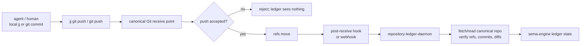
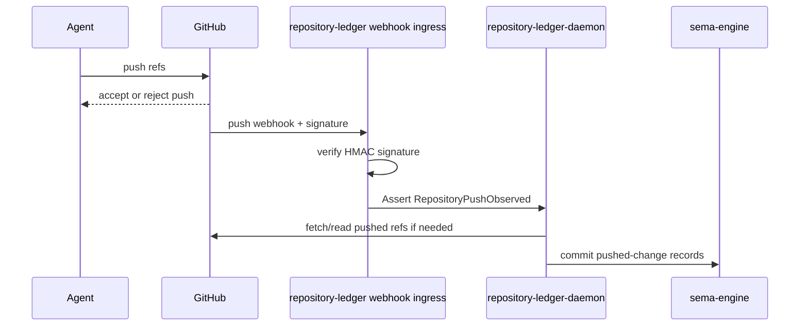
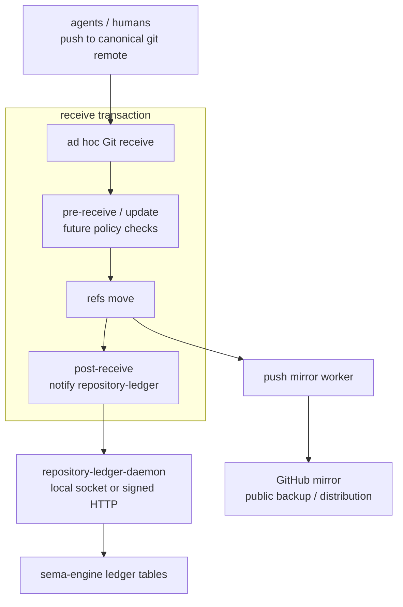
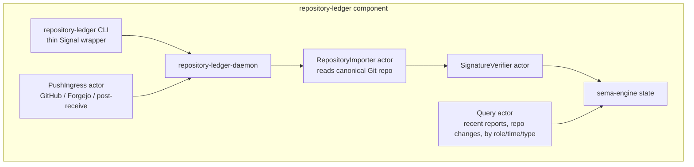

# Post-Push Repository Ledger And Ad Hoc Git Server

Date: 2026-05-18  
Role: designer-assistant  
Status: proposal / research synthesis

Update after user decisions:

- Start with **self-hosted receive**, not GitHub webhooks first.
- Treat signature rejection, signed-release enforcement, and
  Criome/BLS trust as **future features** for this arc.
- Once self-hosted receive exists, GitHub is an **outbound mirror
  only**. Agents and humans do not push there as a second authority.
- Re-evaluate Git server choice through `jj`'s change-oriented model.
  Gerrit is important prior art, but not the first choice if agents are
  the primary users and Orchestrate / `repository-ledger` own review
  state.

## 0. Load-Bearing Decision

Unpushed change is not shared workspace truth.

For the repository ledger, the meaningful event is not "an agent
made a local commit." The meaningful event is "a canonical receive
point accepted a push." Local `jj` or Git commits are drafts until
they are pushed to the repository authority.

That shifts the design:

- Do not install local `post-commit` hooks for the ledger.
- Do not watch local worktrees for ledger truth.
- Use Git server receive events:
  - `pre-receive` / `update` for enforcement before refs move.
  - `post-receive` or forge webhooks for notification after refs move.
- Treat GitHub webhooks as a temporary receive-event source if
  GitHub is still the canonical remote.
- Move to a self-hosted receive point when we want GitHub to become
  a mirror rather than the source of truth.

The repository ledger daemon should use the push notification as a
wake-up signal, then inspect the canonical repository itself. The
payload is not the database of record.



## 1. Fallback Path: GitHub Webhook

GitHub can notify us now. A repository webhook subscribed to the
`push` event sends a delivery after refs move. GitHub includes
delivery identity and event headers such as `X-GitHub-Event`,
`X-GitHub-Delivery`, and, when configured with a secret,
`X-Hub-Signature-256`. GitHub's own guidance is to validate the
HMAC-SHA256 signature before processing the payload.

This is good enough to prove `repository-ledger` without operating a
Git server, but it is not the chosen first path after the user decision.
It remains a fallback if the self-hosted receive point blocks.



What it gives:

- No Git server to administer yet.
- Push event is real and remote, not local draft state.
- HMAC-signed webhook delivery gives basic authenticity for the
  notification.
- Easy to backfill by reading GitHub refs.

What it does not give:

- GitHub remains the canonical receive point.
- The ledger service needs an inbound HTTPS endpoint reachable by
  GitHub.
- GitHub's push identity is still not the long-term trust boundary.
- GitHub webhooks are notification, not proof of authorship or
  authorization.

Decision: do **not** start here unless the self-hosted receive path
blocks. The goal is a self-owned push authority from the first real
deployment.

## 2. Desired Path: Self-Hosted Receive, GitHub Mirror

The longer-term shape should make our Git server the canonical receive
point and GitHub an outbound mirror.



Here GitHub is useful storage and distribution, not authority. In the
first slice, a consumer trusts the object graph accepted by our receive
point. Future trust hardening adds:

- Commit/tag/archive signatures on that object graph.
- Criome/BLS signatures over releases, archive hashes,
   repository identities, and persona/component authority.

GitHub is then allowed to be dumb infrastructure.

## 3. Git Server Candidates

Judge candidates against two separate needs:

1. Canonical Git receive with post-push notification to
   `repository-ledger`.
2. A collaboration model that does not fight `jj`'s stable change
   identity.

Those needs do not point at one tool with equal force. Forgejo is the
best ad hoc forge. Gerrit is the best existing `jj`-shaped review
system. Gitolite is the best small Git authority.

After the user clarified that agents will be the almost sole users of
the remote server, Gerrit no longer looks like the default first step.
Agents do not need a human web review workflow if Orchestrate and
`repository-ledger` provide typed coordination, review state, and
history queries. Gerrit remains useful prior art and a future candidate
for external/human collaboration.

### Gerrit

Gerrit is the candidate that matches the `jj` mental model most
closely.

Why:

- Gerrit traces back to Google's review-tool lineage: the Gerrit origin
  story says it started as patches to Rietveld and was originally built
  to service AOSP.
- Gerrit has a first-class `Change-Id` concept. A change has one or
  more patch sets; new revisions of the same logical change upload as
  new patch sets instead of unrelated commits.
- The official `jj` documentation now has a Gerrit workflow. It says
  `jj` and Gerrit share the same mental model: `jj` tracks stable
  change identity across rewrites, and Gerrit tracks stable `Change-Id`
  across patch sets.
- `jj gerrit upload` bridges the two. It can generate a Gerrit-style
  `Change-Id` from the `jj` change identity when the commit does not
  already carry one.
- Recent `jj` releases transfer change IDs through Git commits by
  default using a `change-id` commit header. That is not the same as
  Gerrit's `Change-Id` footer, but it shows the ecosystem is moving
  toward remote-visible change identity.
- Gerrit has event streams, hook/plugin mechanisms, and replication
  plugins. A ledger integration can subscribe to Gerrit events or use a
  Gerrit hook/plugin rather than relying on raw Git `post-receive`.

Cost:

- Gerrit is review-first, not forge-first. Its default workflow is
  pushing to `refs/for/<branch>` to create or update a review change,
  then submitting that change to the branch.
- It is heavier to operate than Gitolite and conceptually less
  GitHub-like than Forgejo.
- It may be too much ceremony for report-lane repositories where the
  desired operation is probably "publish this report now," not "open a
  code review."
- Gerrit does not simply run standard Git hooks in managed
  repositories; it has its own hook/plugin mechanisms. That is fine,
  but the ledger adapter is Gerrit-shaped rather than generic bare-Git
  `post-receive`.

Fit:

- Best fit for code repositories where `jj` change identity matters.
- Best fit if we want "one logical change evolves through patch sets"
  as the collaboration model.
- Questionable fit for routine report-lane publication unless we use
  direct branch push or auto-submit policy for those repositories.
- Weak fit if agents are the primary users and the workspace intends to
  build review/ownership semantics in Orchestrate. In that world,
  Gerrit duplicates the coordination layer instead of serving it.

What agents gain:

- A mature patch-set model without us designing one first.
- A tested event stream for review-change and ref-update events.
- A known way to map `jj` change identity into remote review objects.

What agents do not gain:

- They do not need the Gerrit web UI for normal operation.
- They do not need Gerrit labels/approvals if Orchestrate is the typed
  approval authority.
- They do not need Gerrit's review ceremony for report publication or
  routine internal commits.
- They still need `repository-ledger` for workspace-specific queries,
  role/lane awareness, report awareness, and Signal/Sema integration.

Important semantic distinction:

- A Gerrit push to `refs/for/main` makes a review change real, but does
  not make it branch truth yet.
- A Gerrit submit makes the accepted patch set land on the target
  branch.
`repository-ledger` therefore needs two event classes if Gerrit is in
play:

| Event | Meaning |
|---|---|
| `ReviewChangeObserved` / `PatchSetObserved` | Pushed to review; visible and real as review state. |
| `RefUpdateObserved` | Submitted, merged, or direct-pushed; real as branch state. |

That distinction is useful for code work, because it matches `jj`: a
change can exist and evolve before it becomes branch truth. It may be
overkill for reports.

### Forgejo

Forgejo is the best ad hoc cloud candidate if we want useful
infrastructure quickly.

Why:

- It is a full forge: web UI, SSH/HTTP Git, users, repository
  settings, webhooks, and mirroring.
- Forgejo supports repository webhooks.
- Forgejo supports push mirrors, including mirroring to GitHub.
- Current Forgejo documentation says SSH push mirrors are supported:
  Forgejo generates an Ed25519 key pair for the mirror, and the public
  key can be installed as a deploy key on the target repository.
- It lets us run the same conceptual shape as GitHub now: repository
  event -> webhook -> ledger.

Cost:

- More moving parts than bare Git or Gitolite.
- More web surface to maintain.
- Its database and forge state become part of the ad hoc cloud backup
  story.

Fit:

- Best "duct-tape but useful" choice.
- Good if we also want a web UI for browsing reports, branches, and
  agent pushes.
- Good if we want mirroring to GitHub without writing all mirror glue
  immediately.
- Weaker than Gerrit for `jj` change semantics. A pull request or
  branch update does not naturally preserve the idea that rewritten
  commits are revisions of one stable logical change.

### Gitea

Gitea is similar to Forgejo and has official documentation for
repository webhooks and push mirrors to GitHub. It is viable. Forgejo
is preferable here because the workspace has been moving toward
independence from GitHub-like corporate infrastructure and Forgejo is
the community fork with that posture.

One practical difference in the docs I checked: Gitea's current mirror
page still says SSH push mirrors are not supported and suggests a
`post-receive` script workaround for SSH mirroring. Forgejo's docs
describe SSH mirror support. That tilts the ad hoc choice toward
Forgejo.

### Gitolite

Gitolite is the best small-core Git authority candidate.

Important framing: Gitolite is not a Rust Git server and not a forge.
It is an authorization layer on top of stock Git and OpenSSH. That is
why it enters this design at all: it keeps canonical receive small, and
lets `repository-ledger` / Orchestrate own the higher-level semantics
instead of importing a forge's collaboration model.

Why:

- It is SSH Git hosting with strong repository ACLs and very small
  operational surface.
- It delegates the actual Git transport to `git-receive-pack` /
  `git-upload-pack`; Git performance remains stock Git performance.
- It supports per-repository post-receive hook configuration.
- It has its own mirroring model: one master and one or more copies;
  users push to the master, and the master pushes mirrors.
- It is closer to "Git receive as a narrow authority" than Forgejo.
- Its overhead is mostly SSH authentication plus ACL rule evaluation.
  It is lean operationally, not magic-faster-than-Git.

Cost:

- No modern forge UI by itself.
- Webhooks and GitHub mirroring become scripts we own.
- More bespoke integration work for repository-ledger.

Fit:

- Better long-term if we want a minimal, auditable canonical Git
  receive layer.
- Pair with `repository-ledger` for semantic history/search instead of
  trying to make the forge UI carry our workflow.
- Does not solve the `jj` change-review model by itself. It can receive
  Git pushes and ledger can read `jj` change IDs, but it has no native
  patch-set/change review vocabulary.

### Rust Git Server / Forge Options

There is no obvious mature Rust replacement for "small canonical Git
receive authority" in the same niche as Gitolite.

Options worth knowing:

- `gitoxide` / `gix` is a pure Rust Git implementation and library
  stack. It is promising infrastructure for future custom tools, but it
  is not the obvious turnkey production Git hosting authority for this
  ad hoc cloud slice.
- Radicle is Rust and Git-based, but it is peer-to-peer code
  collaboration with cryptographic identities and gossip. That is
  philosophically interesting and closer to future Criome/Criome-auth
  instincts, but it is not "one canonical self-hosted receive point that
  mirrors to GitHub."
- GitRiver advertises a Rust self-hosted Git platform with SSH/HTTP
  Git, CI, registry, issues, and pull requests in one binary. It is a
  broad forge/product, not a minimal receive layer. It would need a real
  audit before it becomes infrastructure.
- Gumtree advertises a Rust/gitoxide-based forge. It is ambitious and
  interesting, but its stack is much larger than the current need
  (FoundationDB, object storage, projections, CI/search/etc.).

Conclusion: if the priority is minimal and boring, Gitolite still makes
sense despite not being Rust. If the priority is a useful forge, Forgejo
is the pragmatic default. If the priority is "Rust all the way down,"
the available choices look like research/audit projects rather than a
safe first canonical receive point.

### Own Git Server Triad Component

We should distinguish three possible meanings of "our own Git server."

**Option A: own the receive service, delegate Git protocol to stock Git**

This is realistic and fits the triad pattern.

Shape:

- `repository-ledger-daemon` or a future neutral Git receive daemon owns repository
  registry state in sema-engine.
- It manages allowed repositories, mirror policies, hook secrets, and
  derived Gitolite configuration.
- Git push still enters through OpenSSH + Gitolite or through
  `git-http-backend`.
- Server-side hooks call the daemon after accepted pushes.

This gives us a triad component without reimplementing Git transport.
It is the recommended custom path.

**Option B: own a wrapper around stock Git receive-pack**

This is possible later.

Shape:

- Our daemon accepts an SSH forced-command or HTTP request.
- It authenticates / authorizes through owner-signal state.
- It invokes `git-receive-pack` / `git-upload-pack` for actual pack
  negotiation and object storage.
- It emits typed Signal events to `repository-ledger`.

This replaces some Gitolite duties while still relying on stock Git for
the hard protocol parts. It is plausible, but not needed for the first
ad hoc server.

**Option C: implement Git smart protocol ourselves**

Do not do this first.

This means implementing or deeply embedding:

- SSH or smart HTTP serving.
- `upload-pack` / `receive-pack` protocol behavior.
- Packfile negotiation, ref advertisement, side-band streams, shallow
  clone behavior, atomic ref updates, hooks, and compatibility edge
  cases.
- Authentication and authorization.
- Mirroring.

`gitoxide` may eventually help here, but this is infrastructure
research, not a fast canonical receive point.

Recommendation:

- First: run Gitolite.
- In parallel: make `repository-ledger` the triad component that owns
  repository metadata and event ingestion.
- Later: if Gitolite feels like the wrong boundary, replace it with a
  thin neutral Git receive daemon that wraps stock Git, not a full custom
  Git implementation.

### Bare Git + SSH + Hooks

This is the absolute smallest prototype:

- Create bare repositories.
- Accept SSH pushes.
- Install `pre-receive` and `post-receive` hooks.
- `post-receive` sends ref updates to `repository-ledger`.
- Mirror with `git push --mirror git@github.com:...`.

This is fast, but it lacks user/key management. It is acceptable only
as a very temporary bootstrap or for a single-user host.

### GitLab / SourceHut

Not recommended for this arc:

- GitLab is much heavier than the need.
- SourceHut is interesting culturally, but not the fastest path for
  a self-owned ad hoc Git receive point plus GitHub mirroring.

## 4. Recommendation

Use a self-hosted receive point first. GitHub is an outbound mirror,
not the authority.

### Step A: Self-Hosted Receive

Stand up an ad hoc Git service and make it the canonical
remote.

Minimum ledger records:

- `RepositoryPushObserved`
- `RepositoryRefUpdate`
- `PushedCommitRange`
- `RepositoryKind`
- `MirrorStatus` later
- `ReviewChangeObserved` if Gerrit is used

The server notification wakes the daemon. The daemon fetches or reads
the canonical self-hosted repository to build durable state.

### Step B: Choose The First Receive Implementation

There are two credible first choices.

**Choice 1: Forgejo first**

Pick this if the priority is fast ad hoc service:

- Git receive, web UI, webhooks, and GitHub push mirroring are all in
  one tool.
- It is simpler to explain and administer.
- `repository-ledger` can still recover `jj` change IDs from commits if
  present.

Cost:

- It does not model a stable rewritten change as cleanly as Gerrit.
- Review semantics will look like branches/pull requests, not Gerrit
  patch sets.

**Choice 2: Gitolite first**

Pick this if the priority is minimal Git authority:

- Small SSH Git receive surface.
- Custom `post-receive` hook can notify `repository-ledger`.
- Mirroring to GitHub is explicit script/workflow we own.
- Orchestrate / `repository-ledger` can own all review/change semantics
  without Gerrit or Forgejo adding a second collaboration model.

Cost:

- No built-in forge UI.
- More custom glue for mirroring and web browsing.

**Future choice: Gerrit**

Use Gerrit if the workspace later needs a mature review server,
external contributors, or patch-set semantics before Orchestrate has
its own review model. Do not start there just because it matches `jj`
better than pull requests; agents alone do not need the extra review
server if typed workspace daemons are going to own coordination.

Current recommendation: **Gitolite first.** Do not start with Forgejo or Gerrit. Keep the receive authority narrow and let `repository-ledger` / Orchestrate carry the workspace-specific semantics.

Name the deployment honestly as an ad hoc Git receive host. Do not bind daemon names to any cluster/operator name.

### Step C: Harden Or Replace

Once the ledger and cloud direction are stable:

- Keep Forgejo if the general forge surface proves useful.
- Reconsider Gerrit only if external contributors or review-server
  semantics become load-bearing.
- Keep GitHub as outbound mirror only.
- Move release/authentication trust toward Criome/BLS signatures over
  objects and archive hashes as a future feature.

## 5. Hook / Webhook Boundaries

Git has the exact hooks we need.

`pre-receive`:

- Runs once before refs are updated on the remote.
- Receives `<old-oid> <new-oid> <ref-name>` on standard input.
- Can reject the entire receive transaction.
- Correct place for future policy, not required in the first slice.

Future policy examples: reject unsigned commits; reject commits not
signed by approved keys; reject pushes to protected refs; reject
malformed branch/bookmark names.

`update`:

- Runs once per ref before that ref updates.
- Can reject individual ref updates.
- Useful for per-ref fast-forward rules.

`post-receive`:

- Runs after successful ref updates.
- Receives old/new/ref triples for successfully updated refs.
- Correct place for notification to `repository-ledger`.
- Cannot change the outcome; that is exactly why it is safe as a
  ledger wake-up.

`post-update`:

- Also runs after refs update, but receives only ref names, not old/new
  object IDs.
- Worse fit for the ledger than `post-receive`.

So the canonical self-hosted shape is:

```text
pre-receive: enforce policy
post-receive: notify ledger
```

Forgejo/Gitea webhooks are the forge-level equivalent of
`post-receive` notification. They are not enforcement points.

Gerrit is different:

- Gerrit does not simply run standard Git hooks in the repositories it
  manages.
- It has its own hook/plugin/event mechanisms, including hooks for
  patch-set and ref-update events, plugin `PostReceiveHook` support,
  and `stream-events`.
- A Gerrit-backed ledger adapter should subscribe to Gerrit events or
  install a Gerrit hook/plugin. It should not assume `.git/hooks`
  inside the managed repository.

## 6. Future Features: Signed Commits And Push Policy

SSH and commit signatures answer different questions.

SSH push credential:

- "Is this client allowed to push to this repository?"
- Needed for a Git server or mirror worker to write refs.
- For GitHub mirroring, the server needs some transport credential:
  deploy key, GitHub App token, PAT, or similar.

Commit/tag signature:

- "Was this Git object signed by a trusted author/releaser key?"
- Travels with the object graph.
- Does not depend on GitHub being honest.
- Is the right future security anchor before Criome/BLS replaces it.

So yes, a mirror server will still need a GitHub credential to push
the mirror. That credential should not become the trust model. It is
only transport permission.

Future policy:

1. Index signature status in `repository-ledger`.
2. Warn loudly on unsigned or untrusted commits.
3. Add `pre-receive` or Gerrit validation enforcement once the trusted
   key set is clean.
4. Move the authoritative trust check into Criome/BLS:
   signed release/archive objects, signed repository identity,
   signed authorization facts.

None of this blocks the self-hosted receive and ledger prototype.

## 7. Repository Ledger Contract Shape

`repository-ledger` should be a triad component:

- CLI: converts human/agent text commands to Signal.
- Daemon: long-lived, owns state, uses sema-engine.
- Signal contract(s): typed vocabulary for public and owner surfaces.

The push-notification ingress is one actor plane inside the daemon.



Public signal examples:

- `Assert RepositoryPushObserved`
- `Match RecentRepositoryChanges`
- `Match RecentReports`
- `Match ChangesByRepository`
- `Match ChangesByRole`
- `Match ChangesInTimeWindow`

Owner signal examples:

- `Assert WatchedRepository`
- `Mutate RepositoryMirrorPolicy`
- `Mutate SignatureTrustPolicy`
- `Retract WatchedRepository`
- `Validate RepositoryHookConfiguration`

The owner signal surface is mandatory. Registering a watched repository,
changing mirror policy, changing hook secrets, or changing any privileged
mutable configuration goes through the owner-signal actor inside
`repository-ledger-daemon`. The CLI may expose commands for these
operations, but it only translates text into owner-signal frames and
sends them to the owner-owned socket. Static files may provide bootstrap
defaults needed to start the daemon; they are not a privileged
configuration plane after daemon start.

## 8. Data Model Sketch

Minimum tables:

```text
repositories
  key: RepositoryId
  value: RepositoryRecord

repository_ref_updates
  key: (RepositoryId, PushSequence, RefName)
  value: RefUpdateRecord

repository_commits
  key: (RepositoryId, CommitId)
  value: CommitRecord

repository_pushes
  key: (RepositoryId, PushSequence)
  value: RepositoryPushRecord

signature_results
  key: (RepositoryId, CommitId)
  value: SignatureVerificationResult  # future feature

report_landings
  key: (ReportLane, ReportNumber, CommitId)
  value: ReportLandingRecord

mirror_status
  key: (RepositoryId, MirrorName)
  value: MirrorStatusRecord

review_changes          # Gerrit-backed repos only
  key: (RepositoryId, ReviewChangeId)
  value: ReviewChangeRecord

review_patch_sets       # Gerrit-backed repos only
  key: (RepositoryId, ReviewChangeId, PatchSetNumber)
  value: ReviewPatchSetRecord
```

Important distinction:

- `PushSequence` is minted by the ledger after observing a canonical
  accepted push.
- It is not the same as Git commit order.
- It is not the same as `jj` change ID.

For `jj` repositories:

- Store `ChangeId` if it is recoverable.
- Store Git commit ID always.
- Treat `ChangeId` as the stable human workflow identifier when
  available.
- Treat Git commit ID as the object graph identifier.

For plain Git repositories:

- Store only commit ID and ref update.

For Gerrit-backed repositories:

- Store Gerrit `Change-Id` and patch-set number.
- Store `jj` change ID when recoverable from commit headers or upload
  metadata.
- Distinguish pushed review state from branch ref state.

## 9. Report-Repositories Consequence

The proposed "one report lane per repository" direction fits this
well.

If each report lane has its own repository:

- A pushed report is a real event.
- `repository-ledger` can query "latest designer-assistant reports" by
  repository kind or lane.
- Agents no longer need duplicate "what I changed" reports for code
  changes because commits become searchable durable facts.
- The user can ask "what landed today?" and get an answer from ledger
  state rather than from every agent's chat memory.

The ledger should classify repositories by authored purpose:

- `code`
- `report-lane`
- `skill`
- `architecture`
- `deployment`
- `data`

This should remain a typed record, not a hardcoded file-path heuristic
alone. A path heuristic can be used to bootstrap.

## 10. Current Decisions And Remaining Question

### D1. Self-hosted receive first

Decision: start with a self-hosted receive point. GitHub webhook remains
only a fallback.

### D2. GitHub is mirror only after self-hosted receive

Decision: once the self-hosted receive point is live, GitHub should be
read-only by convention for our workflow. Mirror pushes flow outward
from our server.

### D3. Signature enforcement is future work

Decision: signed commits, pre-receive rejection of unsigned commits,
and Criome/BLS release trust are future features. They should be
designed, but they do not block the ad hoc Git receive prototype.

### Q1. Forgejo first, or Gitolite first?

This is now the remaining architecture choice.

Forgejo is the faster general forge: web UI, webhooks, push mirrors,
and simpler administration. It gives the ad hoc cloud a usable surface
immediately.

Gitolite is the smaller authority: SSH Git receive, ACLs, hooks, and
less surface area. It relies on `repository-ledger` and Orchestrate for
the higher-level collaboration model.

Recommendation after the agent-user clarification: do not start with
Gerrit. Agents gain too little from a full review server if Orchestrate
and `repository-ledger` are meant to become the typed coordination
surface. Choose Forgejo for speed, or Gitolite for minimality.

## 11. Sources

- Git hooks documentation: `pre-receive`, `update`, `post-receive`, and
  `post-update` semantics. <https://git-scm.com/docs/githooks.html>
- GitHub webhook signature validation and `X-Hub-Signature-256`.
  <https://docs.github.com/en/webhooks/using-webhooks/validating-webhook-deliveries>
- GitHub webhook event headers, including `X-GitHub-Event` and
  `X-GitHub-Delivery`.
  <https://docs.github.com/en/webhooks/webhook-events-and-payloads>
- Forgejo repository webhooks.
  <https://forgejo.org/docs/latest/user/webhooks/>
- Forgejo repository mirroring and SSH push mirrors.
  <https://forgejo.org/docs/next/user/repo-mirror/>
- Gitea repository mirroring to GitHub.
  <https://docs.gitea.com/usage/repository/repo-mirror>
- Gitea webhooks and HMAC headers.
  <https://docs.gitea.com/usage/repository/webhooks>
- Gitolite mirroring model.
  <https://gitolite.com/gitolite/mirroring.html>
- Gitolite post-receive hook configuration.
  <https://gitolite.com/gitolite/non-core.html>
- cgit: hyperfast web frontend for Git repositories written in C.
  <https://git.zx2c4.com/cgit/about/>
- Git server-side Smart HTTP implementation via `git-http-backend`.
  <https://git-scm.com/docs/git-http-backend>
- Git HTTP protocol: dumb and smart HTTP server forms.
  <https://git.github.io/htmldocs/gitprotocol-http.html>
- GitHub deploy keys and write access for mirror pushes.
  <https://docs.github.com/authentication/connecting-to-github-with-ssh/managing-deploy-keys>
- Gitoxide / `gix`: pure Rust Git implementation and library stack.
  <https://github.com/GitoxideLabs/gitoxide>
- Radicle: Rust/Git peer-to-peer code collaboration with cryptographic
  identities and gossip.
  <https://radicle.dev/>
- GitRiver: Rust self-hosted Git platform / forge.
  <https://gitriver.com/>
- Gumtree: Rust/gitoxide-based forge concept.
  <https://gumtree.necessary.nu/>
- Jujutsu Gerrit workflow: stable `jj` change identity mapped to Gerrit
  `Change-Id` / patch sets by `jj gerrit upload`.
  <https://docs.jj-vcs.dev/latest/gerrit/>
- Gerrit user documentation: `refs/for/<branch>`, `Change-Id`, patch
  set semantics, and submit-to-branch flow.
  <https://gerrit.googlesource.com/gerrit/+/refs/tags/v3.10.3/Documentation/intro-user.txt>
- Gerrit origin story: Rietveld fork originally built to service AOSP.
  <https://gerrit.googlesource.com/homepage/+/md-pages/about.md>
- Gerrit patch set concept.
  <https://gerrit.wikimedia.org/r/Documentation/concept-patch-sets.html>
- Gerrit support-for-Jujutsu design discussion.
  <https://www.gerritcodereview.com/design-docs/support-jujutsu.html>
- Jujutsu changelog: default transfer of change ID through Git commit
  header.
  <https://github.com/jj-vcs/jj/blob/main/CHANGELOG.md>
- Gerrit hook/plugin/event surfaces.
  <https://gerrit-review.googlesource.com/Documentation/config-hooks.html>
  <https://gerrit-review.googlesource.com/Documentation/dev-plugins.html>
  <https://gerrit-review.googlesource.com/Documentation/cmd-stream-events.html>
- Gerrit replication plugin for mirrors.
  <https://gerrit.wikimedia.org/r/plugins/replication/Documentation/index.html>
