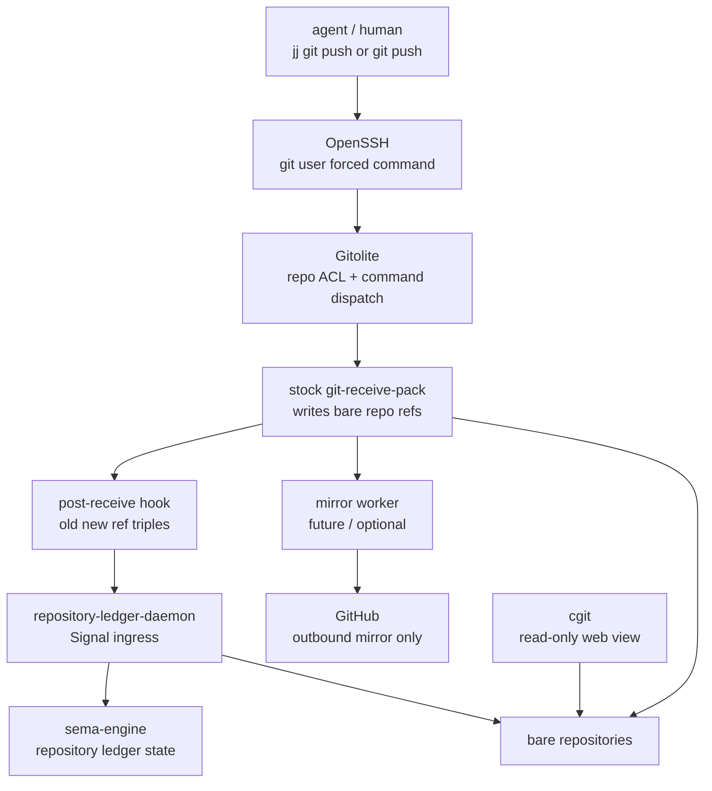

# Gitolite Repository Ledger Implementation Plan

Date: 2026-05-18  
Role: designer-assistant  
Status: implementation-ready plan with open questions

## 0. Decision

Use Gitolite as the first self-hosted canonical Git receive point.

Why:

- It is lean: OpenSSH forced command + Gitolite ACL check + stock Git
  `git-receive-pack` / `git-upload-pack`.
- It is not a forge. That is a feature here: Orchestrate and
  `repository-ledger` should own the workspace's higher-level semantics.
- It exposes the right hook shape for the ledger: server-side
  `post-receive` after refs move.
- It can mirror outward to GitHub with ordinary Git push/mirror
  machinery.

Do not bind daemon names to any cluster/operator name. The neutral
component names in this plan are:

- `repository-ledger-daemon`
- `repository-ledger`
- future `git-receive-daemon` if Gitolite is replaced later

## 1. Target Shape



Gitolite owns receive authorization. cgit is optional read-only
browsing. `repository-ledger-daemon` owns semantic history, report
queries, repository metadata, and eventually mirror status.

## 2. First Implementation Slice

### Slice A: Gitolite Host

Implement or document the ad hoc host profile that runs:

- `openssh`
- `git`
- `gitolite`
- bare repository storage
- Gitolite admin repository
- server-side hook install path

Minimum Nix/CriomOS shape:

- A host role or service module for the ad hoc Git receive node.
- A dedicated Unix user such as `git`.
- A persistent repository root, for example `/var/lib/gitolite`.
- SSH access limited to the Gitolite forced-command path.
- Backups deferred but named.

Do not put cluster-specific names into daemon/component names.

### Slice B: Repository Ledger Skeleton

Create the triad component:

- `signal-repository-ledger` contract repository.
- `repository-ledger-daemon`.
- `repository-ledger` CLI.

The daemon stores state in sema-engine.

Minimum public signal:

```text
Assert RepositoryPushObserved
Match RecentRepositoryChanges
Match RecentReports
Match ChangesByRepository
Match ChangesInTimeWindow
```

Minimum owner signal, if we keep owner-signal split from day one:

```text
Assert WatchedRepository
Mutate RepositoryMirrorPolicy
Mutate RepositoryHookSecret
Retract WatchedRepository
Validate RepositoryHookConfiguration
```

If owner-signal is too much for the first day, keep the split in the
architecture but implement only local config loading first.

### Slice C: post-receive Adapter

Gitolite hook calls a tiny adapter after refs are updated.

Hook input:

```text
<old-oid> <new-oid> <ref-name>
```

Adapter should send one event to `repository-ledger-daemon` containing:

- repository path or repository logical name;
- old object ID;
- new object ID;
- ref name;
- receive timestamp from daemon side, not trusted hook side;
- delivery ID minted by daemon or adapter;
- source kind: `GitolitePostReceive`.

The hook should be dumb:

- It should not parse commits deeply.
- It should not decide report types.
- It should not verify signatures in this slice.
- It should be allowed to fail closed or fail logged depending on the
  policy decision below.

Recommended first shape: hook writes to a local Unix socket owned by
`repository-ledger-daemon`. If the daemon is down, hook writes a spool
file and exits success, so Git pushes do not fail because the ledger is
offline. The daemon replays the spool on restart.

### Slice D: Ledger Importer

`repository-ledger-daemon` treats hook delivery as a wake-up. It then
reads the canonical bare repo itself.

Importer work:

- Resolve repository identity.
- Record the ref update.
- Enumerate commits in `old..new` where meaningful.
- For each commit, store:
  - Git commit ID;
  - author/committer identities;
  - commit timestamp;
  - subject/body;
  - changed paths summary;
  - `jj` change ID if recoverable from commit metadata;
  - report landing facts if changed paths are report-lane files.

The payload from the hook is not the source of truth. The bare repo is.

### Slice E: cgit Optional View

Add cgit only if we want a browser immediately.

Shape:

- cgit reads the same bare repo root.
- It is read-only.
- It should not own any workflow concept.
- It can be behind the same reverse proxy as the future ledger HTTP
  view, but the ledger is the semantic query API.

## 3. Repository Ledger Tables

Minimum sema-engine tables:

```text
repositories
  RepositoryId -> RepositoryRecord

repository_ref_updates
  (RepositoryId, PushSequence, RefName) -> RepositoryRefUpdate

repository_pushes
  (RepositoryId, PushSequence) -> RepositoryPushRecord

repository_commits
  (RepositoryId, CommitId) -> RepositoryCommitRecord

repository_changed_paths
  (RepositoryId, CommitId, PathKey) -> ()

report_landings
  (ReportLane, ReportNumber, CommitId) -> ReportLandingRecord

hook_deliveries
  HookDeliveryId -> HookDeliveryRecord

hook_spool_replays
  HookDeliveryId -> HookReplayRecord
```

Future tables:

```text
signature_results
  (RepositoryId, CommitId) -> SignatureVerificationResult

mirror_status
  (RepositoryId, MirrorName) -> MirrorStatusRecord
```

Signature enforcement and mirror status are future features, not first
slice blockers.

## 4. CLI Shape

The CLI remains a thin wrapper. It does not read Git repositories
directly.

Examples:

```text
repository-ledger recent reports --lane designer-assistant --limit 20
repository-ledger recent changes --repository primary --since today
repository-ledger show push --repository primary --sequence 42
repository-ledger watch repository primary --path /var/lib/gitolite/repositories/primary.git
```

Each command translates to Signal and sends it to
`repository-ledger-daemon`.

## 5. Mirroring To GitHub

GitHub is outbound mirror only after self-hosted receive exists.

First slice can skip mirroring. When added:

- mirror worker runs after accepted pushes;
- mirror target is configured in owner signal or daemon config;
- GitHub deploy key or GitHub App credential gives transport write
  permission;
- trust does not come from the GitHub credential;
- signed commit/tag verification remains future feature;
- Criome/BLS release trust remains future feature.

Do not let agents push to GitHub as a second authority once the
self-hosted receive is live.

## 6. Future Custom Git Receive Daemon

Future direction: replace Gitolite with a neutral
`git-receive-daemon` only if Gitolite becomes the wrong boundary.

The daemon should not implement the full Git smart protocol first.
Correct future shape:

- accept SSH forced command or HTTP receive request;
- authorize through typed owner-signal state;
- invoke stock `git-receive-pack` / `git-upload-pack`;
- emit Signal events directly to `repository-ledger`;
- store policy state in sema-engine.

Full custom Git protocol implementation is out of scope until there is
a concrete reason to own pack negotiation and protocol compatibility.

## 7. Open Questions For User

### Q1. Should failed ledger notification block a push?

If the `post-receive` hook cannot contact `repository-ledger-daemon`,
we have two choices.

Fail-open with spool: accept the push, write a local spool file, and let
the daemon replay later. This preserves Git availability and avoids
agents being blocked by ledger downtime. It means the ledger may lag.

Fail-closed: reject or report failure strongly when the ledger cannot
record the push. In Git, `post-receive` runs after refs moved, so it
cannot cleanly reject the already-accepted push. True fail-closed would
require moving the ledger-critical step into `pre-receive`, which is
more complex.

Recommendation: fail-open with spool for the first slice.

### Q2. Do we implement owner-signal for repository-ledger immediately?

Changing watched repositories, mirror policies, and hook secrets is
higher privilege than reading recent changes. That argues for owner
signal from day one.

But first-slice speed argues for a static daemon config and public read
queries first.

Recommendation: architecture names owner signal now; implementation can
start with static local config, then add owner signal once the daemon is
alive.

### Q3. Should cgit be installed in the first host slice?

cgit is cheap and useful for humans, but not needed by agents if
`repository-ledger` queries work.

Recommendation: install cgit only if the host setup is already easy.
Do not let cgit delay Gitolite + ledger notification.

### Q4. What is the first repository set?

The first watched repositories should be small enough to test the
pipeline and important enough to matter.

Recommendation:

- `primary`
- one report-lane repository if it already exists by then;
- one active code repo that agents push frequently.

## 8. Acceptance Witnesses

Minimum tests / witnesses:

- A push to Gitolite updates a bare repo ref.
- `post-receive` emits a typed `RepositoryPushObserved`.
- `repository-ledger-daemon` records `RepositoryRefUpdate`.
- `repository-ledger recent changes` returns the pushed commit.
- If daemon is down, hook writes spool and push still succeeds.
- On daemon restart, spool replay imports the missed push.
- GitHub remote is not required for the first test.
- GitHub mirror, once added, does not become an accepted push source.

## 9. Operator Handoff

Implementation can be split:

1. System specialist: ad hoc Gitolite host/service module.
2. Operator: `repository-ledger` triad component skeleton.
3. Operator/system specialist together: hook adapter and socket/spool
   integration.
4. Operator: importer and sema-engine tables.
5. Optional system specialist: cgit read-only view.

The architecture constraint is simple: pushed-to-canonical-remote is
what makes a change real; local commits are drafts.
