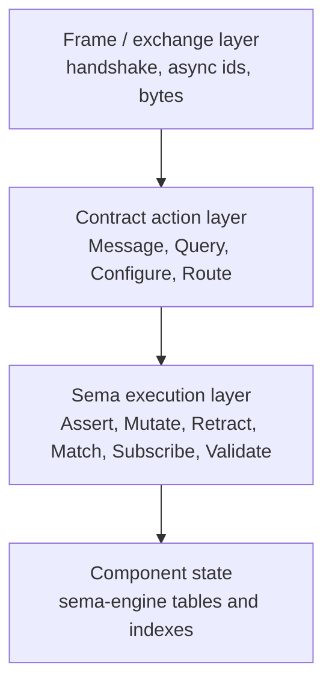
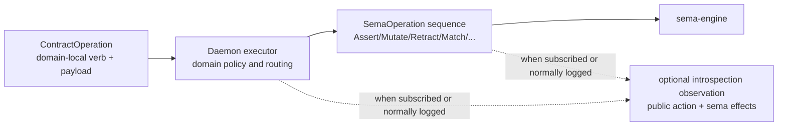

# Contract-Local Verbs vs Sema-Core Verbs

Date: 2026-05-19
Role: designer-assistant
Status: design consideration, not settled intent
Revision: v2, absorbing psyche answers after v1 was passed to other agents

## Purpose

The psyche raised a deeper question than the repository-ledger naming problem:

> Maybe trying to fit every public message into the six Signal roots was the
> wrong layer. Maybe `Assert`, `Mutate`, `Retract`, `Match`, `Subscribe`, and
> `Validate` are really Sema/database verbs, while Signal contracts may define
> domain-local verbs such as `Message` or `Query`.

This report records the brainstorm in a form other agents can evaluate. It does
not assert a final architecture.

The main correction since v1: do not turn the contract-local verb question into
a universal yes/no rule. The right question is not "are all public contract
verbs domain verbs?" The right question is: for this socket and this contract,
what is the public act, and what lower Sema effects does it cause?

## Current Model

The current `signal-core` architecture says:

```text
SignalVerb = Assert Mutate Retract Match Subscribe Validate
Operation<Payload> = SignalVerb + contract payload
Request<Payload> = non-empty sequence of operations
```

Every domain contract request variant declares one of those six verbs through
the `signal_channel!` macro. For example, the repository-ledger contract has
roughly this shape today:

```rust
signal_channel! {
    channel Ledger {
        request Request {
            Assert ReceiveHookNotification(ReceiveHookNotification),
            Assert PushObservation(PushObservation),
            Match EventQuery(EventQuery),
            Match RecentRepositoriesQuery(RecentRepositoriesQuery),
            Match ChangedFileQuery(ChangedFileQuery),
            Match CommitMessageQuery(CommitMessageQuery),
            Match CatalogQuery(CatalogQuery),
        }
    }
}
```

Report `reports/designer-assistant/124-query-suffix-as-missing-schema-layer.md`
diagnosed the repeated `Query` suffix as a missing schema layer and suggested:

```text
Match
  Query
    Events
    RecentRepositories
    ChangedFiles
    CommitMessages
    Catalog
```

The psyche now questions whether that was still one layer too conservative.
Maybe `Query` is not merely a payload family under `Match`. Maybe `Query` is
the public contract verb, and `Match` is the lower Sema execution verb.

## The Missing Layer Separation

There are at least three different things currently being compressed into one
operation wrapper.



The distinction:

- The frame layer answers: how do bytes move, correlate, stream, and return?
- The contract layer answers: what is the caller asking this daemon to do?
- The Sema layer answers: what durable read/write/stream/check operation does
  the daemon perform on its state?

The current model makes the Sema layer visible as the public contract verb.
That may be beautiful when the public action is actually a database operation.
It becomes awkward when the public action is a domain act whose state effects
are downstream.

## Persona Message Example

The strongest example is `persona-message`.

Under the current model, a user submitting a message tends to be described as:

```nota
(Assert (MessageSubmission ...))
```

But the public act is not obviously "assert a row." The user is doing:

```nota
(Message (Submission ...))
```

or:

```nota
(Submit (Message ...))
```

The daemon may then perform several lower effects:

```text
persona-message-daemon receives Message
  stamps origin
  normalizes body
  forwards to persona-router
  records ingress event

lower Sema effects may include:
  Assert MessageIngressEvent
  Assert StampedMessageSubmission
  Mutate DeliveryState
```

In this view, saying "message is an Assert" confuses ingress semantics with
storage semantics. A message submission might cause one assert, many asserts,
a mutation, no durable write until router accepts it, or a forwarded request.
The public operation remains `Message`.

## Repository Ledger Query Example

The repository-ledger problem shows the same pressure from the read side.

The public action an agent wants is:

```nota
(Query (RecentRepositories ...))
```

The daemon executes that by doing lower Sema matches against event, repository,
commit, and file indexes.

The current full Signal form would be:

```nota
(Match (Query (RecentRepositories ...)))
```

That may be technically precise, but the doubled wording exposes two layers to
the caller. If `Match` is the Sema/database operation, then `Query` is the
contract-local verb and the caller should not need to say `Match`.

The lower execution plan can still be logged or inspected:

```text
public contract action:
  Query RecentRepositories

internal Sema plan:
  Match RepositoryByRecentActivity
  Match EventByRepository
```

## Candidate Architectures

### Candidate A: Keep Six Signal Roots Public

This is the current architecture.

Public contract messages always carry:

```text
Operation { verb: SignalVerb, payload: ContractPayload }
```

Domain verbs are represented as payload families under one of the six roots.

Strengths:

- Uniform request shape across every contract.
- The macro can enforce verb/payload alignment.
- `sema-engine` and `signal-core` line up directly.
- Introspection can reason over one shared verb spine.

Weaknesses:

- Domain actions such as `Message`, `Query`, `Configure`, and `Route` become
  second-class payload names.
- Some public operations read awkwardly: `Match Query`, `Assert Message`.
- Component authors may pick the state-effect verb too early and lie about
  what the public action actually means.
- The repeated suffix smell may keep returning because real contract verbs are
  being forced into payload names.

### Candidate B: Move Six Roots Down To Sema

In this model, `signal-core` stops owning the six database verbs as universal
public roots. It owns only transport-neutral frame and request mechanics.

The six roots move to a Sema-oriented crate, perhaps:

```text
sema-operation
sema-signal
signal-sema
```

Public contract crates define their own operation roots:

```rust
pub enum LedgerOperation {
    ReceiveHookNotification(ReceiveHookNotification),
    PushObservation(PushObservation),
    Query(Query),
}

pub enum MessageOperation {
    Message(MessageSubmission),
    Query(MessageQuery),
}

pub enum OwnerLedgerOperation {
    Configure(DaemonConfiguration),
    Register(Registration),
}
```

The daemon maps those public operations to Sema operations internally.

Strengths:

- Public contract vocabulary reads in the domain's language.
- Socket permission boundaries become clearer: a socket exposes exactly the
  verbs its contract owns.
- `Message` can be a real verb on `signal-persona-message`, not a disguised
  `Assert`.
- `Query` can be a real verb on read-oriented contracts, not necessarily a
  payload under `Match`.

Weaknesses:

- The uniform operation spine disappears from the public Signal layer.
- Cross-component tooling must know many contract-local verb sets.
- The macro and reply model need redesign: request outcomes can no longer rely
  on a single `SignalVerb` enum.
- Sema-effect logging becomes mandatory if we still want uniform database-level
  introspection.

### Candidate C: Two-Level Operations, Case By Case

This is the synthesis I currently find strongest.

Some Signal contracts may expose domain-local verbs at the public boundary:

```text
Ledger: Query, Receive, Observe
PersonaMessage: Message
OwnerLedger: Configure, Register
PersonaOrchestrate: Assign, Revoke, Handoff
```

This is not a blanket rule. A contract whose public act is genuinely a direct
database assertion may still expose an assertion-shaped operation. A contract
whose public act is "send a message," "query recent repositories," or "configure
this daemon" should not be forced to pretend that the public verb is the lower
storage operation. Look at the contract.

Each public operation may declare or derive its lower Sema effects:

```text
public operation:
  Ledger.Query RecentRepositories

sema effects:
  Match RepositoryRecentIndex
  Match EventIndex

public operation:
  PersonaMessage.Message Submission

sema effects:
  Assert IngressEvent
  Assert StampedSubmission
```

The two levels are both typed:



This keeps the public language beautiful while preserving the useful database
verb spine where it belongs.

Strengths:

- Public contracts speak domain language.
- Sema stays the uniform durable-state execution layer.
- Introspection can show both: "what was asked" and "what state effects
  happened," without requiring every possible event to be always-on logged.
- It avoids pretending every public request is a direct row operation.

Weaknesses:

- It needs more explicit executor architecture.
- It may require renaming or splitting `signal-core`.
- The macro needs to generate contract operation metadata separately from Sema
  effect metadata.
- Some operations may not have a static Sema-effect list because policy decides
  at runtime.

## What This Means For `signal-core`

The current `signal-core` crate may be conflating two responsibilities:

```text
1. Signal frame/exchange kernel
   frames, handshake, exchange identifiers, streams, replies

2. Sema/database operation kernel
   Assert, Mutate, Retract, Match, Subscribe, Validate
```

If the psyche's new consideration holds, the better split may be:

```text
signal-core
  domain-free frame and exchange mechanics
  request/reply/event transport shapes
  no universal domain verbs

signal-sema
  SemaOperation
  Assert/Mutate/Retract/Match/Subscribe/Validate
  Sema operations on the wire when a component explicitly speaks that relation
  sema-engine execution and effect-observation shape

signal-<component>
  ordinary contract-local operation roots

owner-signal-<component>
  owner-only contract-local operation roots
```

This does not make the six verbs wrong. It moves them to the layer they may
actually describe: database/state execution. `signal-sema` is the likely name
for the relation that sends Sema operations over Signal frames.

## What This Means For `signal_channel!`

The current macro requires each request variant to declare a `SignalVerb`:

```rust
Match RecentRepositoriesQuery(RecentRepositoriesQuery)
```

Under Candidate C, the macro would instead declare contract-local operations:

```rust
signal_channel! {
    channel Ledger {
        operation Query(Query)
        operation ReceiveHookNotification(ReceiveHookNotification)
        operation PushObservation(PushObservation)
    }
}
```

The Sema mapping would either be:

1. Generated from annotations when the mapping is static.
2. Produced by the daemon executor when policy/runtime state decides.
3. Logged after execution as a typed `SemaEffect` list.

Static annotation example:

```rust
operation Query(Query) lowers_to Match
```

But this should not be forced too early. Some domain operations lower to
different Sema effects depending on authorization, state, or routing.

## What This Means For CLI Shape

The CLI should remain human-side sugar over the daemon contract. It does not
need to make the user type every internal execution wrapper.

For repository-ledger:

```nota
(Query (RecentRepositories None 20))
```

For persona-message:

```nota
(Message (Submission ...))
```

For an owner contract:

```nota
(Configure (DaemonConfiguration ...))
```

The CLI translates this into the daemon's contract frame. The daemon then maps
contract actions into Sema effects. Agents that can speak binary Signal later
can send the same contract operation directly without going through CLI text.

## Naming Consequence

Report `124` was correct that repeated suffixes reveal missing structure, but
it may not have gone far enough.

Repeated category words can mean one of three things:

1. A missing parent payload enum.
2. A missing contract-local verb.
3. A lower execution verb being exposed at the wrong layer.

`RecentRepositoriesQuery`, `ChangedFileQuery`, and `CommitMessageQuery` may
mean "create a `Query` parent enum." They may also mean "`Query` is the public
contract verb and `Match` is internal Sema execution."

The naming rule should therefore become:

> When a word repeats across sibling variants, do not only rename. Ask which
> layer the repeated word belongs to: parent payload, contract-local operation,
> or lower execution effect.

## Permission Consequence

Contract-local verbs fit the owner-signal model well.

The ordinary socket exposes ordinary operations:

```text
signal-repository-ledger:
  Query
  ReceiveHookNotification
  PushObservation
```

The owner socket exposes privileged operations:

```text
owner-signal-repository-ledger:
  Configure
  Register
  RebuildIndex
```

The permission boundary is then not "runtime gate each `SignalVerb`." It is
"the socket only decodes the contract vocabulary it is allowed to receive."
That matches the persona-daemon ownership model: the daemon establishes socket
correctness; the contract defines which verbs exist on that socket.

## Introspection Consequence

If public verbs become contract-local, introspection should be able to observe
two layers:

```text
Public contract action:
  component = repository-ledger
  contract = signal-repository-ledger
  operation = Query
  payload = RecentRepositories

Lower Sema effects:
  Match repository_recent_index
  Match event_by_repository_index

Outcome:
  completed
  rows = 20
```

This is more informative than only logging:

```text
Match RecentRepositoriesQuery
```

It tells agents what the daemon was asked to do and what database operations
actually happened.

But this does not mean every daemon logs every possible public action and Sema
effect by default. The psyche's current answer is subscription-driven:

- if normal operation already requires a durable record, keep that durable
  record;
- if `persona-introspect` subscribes to an event class, the component emits or
  records that event class for the subscription;
- otherwise, do not turn every possible introspection event into an always-on
  log.

This treats introspection like an explicit observation mode rather than a
default infinite debug log.

## Recommendation

Do not implement this immediately as a sweeping rewrite. It is a root-model
question and should be tested against concrete flows first.

My tentative recommendation is Candidate C, with the psyche's case-by-case
correction:

> Signal contracts may expose contract-local verbs when that is the truthful
> public act for the socket. The six current roots should be re-evaluated as
> Sema/database operation verbs, probably through `signal-sema`, while
> `signal-core` keeps frame/exchange mechanics.

The next design pass should evaluate three flows:

1. `persona-message`: user submits a message.
2. `repository-ledger`: agent asks for recent repositories and changed files.
3. `owner-signal-*`: owner configures or registers daemon state.

For each flow, ask:

- What is the public contract verb?
- What socket/contract exposes it?
- What Sema effects does it lower to?
- Which effects are static and which are runtime-policy-dependent?
- What should introspection expose only when subscribed?
- What must still be durably recorded as normal operation?

## Psyche Answers Absorbed

### Universal Domain Verbs

The psyche rejected the universal form of the question. Do not ask "should
public contracts always name domain verbs?" Ask the local modeling question:

```text
For this contract, what public act does this socket receive?
What lower Sema effects does the daemon perform?
Are those the same layer or different layers?
```

### Signal-Sema

The six current roots are under active reconsideration as Sema operations. The
likely relation name is `signal-sema`: sending Sema operations on the wire when
that is the relation a component is actually speaking.

### Introspection

Do not assume always-on logging of every public action and Sema effect.
Subscription-driven introspection is the sensible first shape: when
`persona-introspect` subscribes, a component emits the requested event class;
otherwise only normal operational records persist.

## Bottom Line

The psyche's discomfort is structurally valid. `Match Query` and
`Assert Message` may be signals that the architecture is exposing database
verbs at the public contract layer. The six verbs remain useful, but they may
belong to Sema execution and to a `signal-sema` relation rather than to every
Signal contract's public vocabulary.
