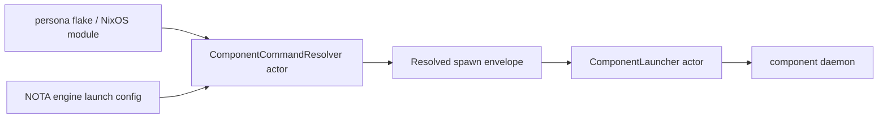

# 23 - Persona Daemon Supervision and Nix Dependency Review

*Designer-assistant report. Scope: `/git/github.com/LiGoldragon/persona`
daemon/component-launch architecture, the operator state report
`reports/operator/112-persona-engine-work-state.md`, and the question of
systemd vs Rust-owned process supervision.*

---

## 0 - Short Read

The current `persona` implementation is useful but not yet the engine
supervisor the architecture needs.

What is real:

- `persona-daemon` is a Rust daemon with a Unix socket, Signal frame codec,
  Kameo `EngineManager`, and Kameo `ManagerStore` writing manager state.
- `EngineLayout` already derives EngineId-scoped state paths, socket paths,
  socket modes, peer socket lists, and a first spawn-envelope shape.
- The flake already composes Nix-built component binaries and stateful sandbox
  witnesses.

What is missing:

- `persona-daemon` does not spawn or supervise component processes.
- The spawn envelope does not yet carry resolved executable path, argv, or
  environment.
- There is no NOTA launch configuration with per-component command overrides.
- The sandbox runner still has a credential-root visibility bug when a
  dedicated credential root sits under the hidden host home.

Recommendation: use a hybrid supervision shape. Systemd should own the
host-level `persona-daemon` service. Inside that daemon, component lifecycle
should first be represented by data-bearing Kameo launcher/supervisor actors.
Those actors may use a direct child-process backend now, and a systemd
transient-unit backend later when cgroup cleanup, resource accounting,
credentials, sandboxing, journald, or watchdog semantics become load-bearing.

I patched `/git/github.com/LiGoldragon/persona/ARCHITECTURE.md` to make the
Nix-built component command rule, explicit launch-config overrides, spawn
envelope contents, actor-owned process supervision, and sandbox credential
mount rule explicit.

---

## 1 - Current Implementation Facts

| Area | Current state | Assessment |
|---|---|---|
| Daemon boundary | `src/transport.rs` binds a Unix socket and dispatches one Signal frame per connection into `EngineManager`. | Correct daemon-first surface. |
| Manager actor | `src/manager.rs` owns the Kameo `EngineManager`; `src/manager_store.rs` owns the Kameo writer actor for `manager.redb`. | Correct first actor/store shape. |
| Engine layout | `src/engine.rs` derives state dirs, run dirs, component sockets, modes, and peer socket lists. | Good substrate for component spawn. |
| Spawn envelope | `ComponentSpawnEnvelope` has engine, component, state path, socket path, socket mode, peers. | Needs resolved command, argv, env. |
| Component binaries | `flake.nix` exposes Nix-built component packages; `persona-dev-stack` receives package paths from the flake wrapper env. | Good for scripts, not yet daemon-owned. |
| Launch config | No NOTA engine launch config with component command overrides exists yet. | Missing architecture-to-code bridge. |
| Process supervisor | No component launcher/supervisor actor or systemd transient-unit control exists. | The largest daemon gap. |
| Sandbox auth | Dedicated auth bootstrap exists. | Direction is correct. |
| Credential root mount | `scripts/persona-engine-sandbox` still uses `ReadWritePaths=` for an existing credential root while `ProtectHome=tmpfs` hides home. | Needs `BindPaths=` or `LoadCredential=`; tracked by operator bead `primary-a18`. |

The new operator report `reports/operator/112-persona-engine-work-state.md`
matches this diagnosis: the current work is a foundation and witness scaffold,
not a working Persona Engine.

---

## 2 - Nix Dependency Rule

The daemon should treat component commands as part of the engine definition,
not as accidental host tools.

Target rule:



The default command set comes from the Nix closure. A launch config may
override one component command for a custom build or test. Omitted components
use the Nix default. Resolution must fail closed if a required component is
missing or ambiguous.

The resolved spawn envelope should carry:

- `EngineId`
- component kind
- executable path
- argv
- environment
- state path
- socket path
- socket mode
- peer socket paths

That makes the component boundary testable. The component does not scan the
filesystem for peers, and the daemon does not silently fall back to a random
host executable.

---

## 3 - Supervision Options

| Option | What it gives | What it misses |
|---|---|---|
| Direct Rust child processes | Simple first implementation; easy to test in-process; naturally sits behind Kameo actors. `tokio::process::Command` gives async process spawning, env/stdio control, process groups, and `kill_on_drop`, but Tokio itself warns that dropped children can keep running and strict cleanup requires awaiting/reaping the child. | No built-in cgroup ownership, journald unit identity, systemd credentials, namespace hardening, restart accounting, or watchdog manager. |
| Direct Rust plus process groups | Better cleanup with process-group kill/reap; `command-group` extends std/Tokio commands with process-group support and signal helpers. | Still not a replacement for systemd cgroups, unit state, resource accounting, credential passing, and service sandboxing. |
| systemd transient units | Systemd owns the child cgroup, unit lifecycle, resource/accounting properties, journal identity, credentials, sandboxing, and readiness/watchdog protocol. `systemd-run` is a wrapper over `StartTransientUnit`, and the D-Bus API can create named transient service/scope units. | More integration surface; unit/job state is asynchronous; requires a systemd backend actor and tests around unit names/properties/job completion. |
| Kameo actor supervision alone | Correct for in-process actor failures. Kameo actors run in async tasks, have lifecycle hooks, and can supervise linked actors with restart policies. | It supervises Rust actors, not OS process trees. It should supervise the launcher actor, while the launcher actor supervises component processes. |

The clean abstraction is not "use systemd" or "do not use systemd." The clean
abstraction is a component launcher/supervisor actor with two possible
backends:

```rust
enum ComponentProcessBackend {
    DirectProcess,
    SystemdTransientUnit,
}
```

That enum belongs behind a data-bearing actor, not in request decoding. The
actor owns child identity, desired state, readiness, restart policy, stop
order, and durable lifecycle events.

---

## 4 - Recommended Shape

Use this order:

1. Keep `persona-daemon` itself as a NixOS/systemd service in production.
2. Add Kameo actors inside `persona-daemon`: a command resolver, spawn-envelope
   builder, component launcher, process monitor, and manager catalog writer.
3. Implement the first backend as direct child processes, because it is enough
   to prove daemon-owned component lifecycle quickly.
4. Make that direct backend production-grade enough before trusting it:
   process group, nonblocking spawn, readiness observation, graceful stop,
   kill/reap fallback, restart trace, reverse-order shutdown.
5. Add a systemd transient-unit backend when the architecture needs cgroup
   cleanup, per-component resource limits, `LoadCredential=`, namespace
   sandboxing, journald unit identity, or `WatchdogSec`/`sd_notify` semantics.

This keeps the actor topology honest. Systemd is a backend for OS process
control, not the noun that owns Persona lifecycle decisions.

---

## 5 - Architecture Edits Made

I added these constraints to `/git/github.com/LiGoldragon/persona/ARCHITECTURE.md`:

- component executables come from the Nix-built stack;
- launch config supports explicit per-component command overrides;
- resolved spawn envelopes include command path, argv, environment, state path,
  socket path, socket mode, and peer sockets;
- component process supervision belongs behind Kameo launcher/supervisor
  actors;
- a direct child-process backend must own process groups, readiness, kill/reap,
  restart tracing, and reverse-order shutdown;
- a future systemd backend stays behind the launcher actor and uses
  EngineId-scoped transient unit names;
- sandbox credential roots hidden by `ProtectHome=tmpfs` must be exposed with
  `BindPaths=` or `LoadCredential=`, not assumed visible through
  `ReadWritePaths=`;
- architectural-truth tests were named for Nix command resolution, launch
  override narrowness, spawn-envelope command contents, nonblocking launcher
  behavior, process-tree cleanup, and credential-root visibility.

---

## 6 - Open Questions

| Question | My recommendation |
|---|---|
| Should component daemons ultimately be systemd transient units by default? | Not for the first full-engine witness. Build the actor-owned direct backend first, then add systemd as a backend when its cgroup/sandbox/credential features are needed. |
| What should the launch config carry? | A NOTA `PersonaEngineLaunchConfig` with optional `ComponentCommandOverride` records keyed by closed component kind. |
| Should overrides be package names or executable paths? | Store the resolved command as path + argv + env. The config can start with explicit executable paths produced by Nix apps/tests. Nix attribute references can be added later if they become useful. |
| Should systemd D-Bus be used directly from Rust? | Only behind a launcher actor. `zbus` is a stable Rust D-Bus client, but direct systemd control should not leak into manager request handlers. |
| Should `persona-engine-sandbox` be fixed before Codex/Claude live auth smoke? | Yes. Dedicated auth files under a hidden home need `BindPaths=` or `LoadCredential=` first. |

---

## 7 - Sources Consulted

- Local: `/git/github.com/LiGoldragon/persona/ARCHITECTURE.md` - current Persona architecture.
- Local: `/git/github.com/LiGoldragon/persona/src/engine.rs` - current engine layout and spawn-envelope types.
- Local: `/git/github.com/LiGoldragon/persona/src/manager.rs` - current `EngineManager` actor.
- Local: `/git/github.com/LiGoldragon/persona/src/manager_store.rs` - current `ManagerStore` writer actor.
- Local: `/git/github.com/LiGoldragon/persona/flake.nix` - current Nix composition and sandbox apps.
- Local: `reports/operator/112-persona-engine-work-state.md` - operator's implementation-state survey.
- Web: [systemd control group interface](https://systemd.io/CONTROL_GROUP_INTERFACE/) - transient units and `StartTransientUnit`.
- Web: [systemd.exec source manpage](https://raw.githubusercontent.com/systemd/systemd/main/man/systemd.exec.xml) - `ExecSearchPath=`, `BindPaths=`, `ProtectHome=tmpfs`, and execution environment properties.
- Web: [systemd-run source manpage](https://raw.githubusercontent.com/systemd/systemd/main/man/systemd-run.xml) - transient service/scope behavior.
- Web: [systemd.service source manpage](https://raw.githubusercontent.com/systemd/systemd/main/man/systemd.service.xml) - `Type=notify`, readiness, timeouts, and watchdog semantics.
- Web: [Tokio process docs](https://docs.rs/tokio/latest/tokio/process/struct.Command.html) - async process spawning, process groups, `kill_on_drop`, and child reaping caveats.
- Web: [command-group docs](https://docs.rs/command-group/latest/command_group/) - process-group support for std/Tokio commands.
- Web: [sd-notify docs](https://docs.rs/sd-notify/latest/sd_notify/) - pure-Rust systemd readiness/watchdog notification helper.
- Web: [zbus docs](https://docs.rs/zbus/latest/zbus/) - stable Rust D-Bus client option.
- Web: [Kameo actor docs](https://docs.rs/kameo/latest/kameo/actor/trait.Actor.html) and [Kameo spawn/supervision docs](https://docs.rs/kameo/latest/kameo/actor/trait.Spawn.html) - in-process actor lifecycle and supervision.
