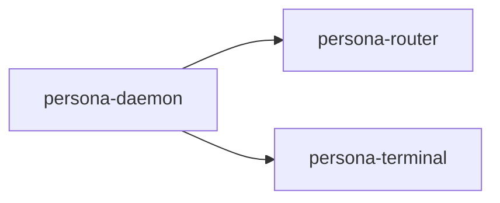
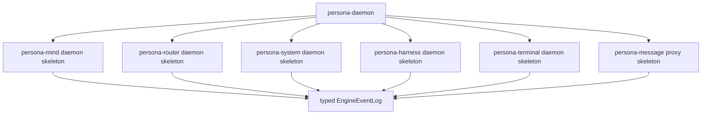

# 24 - Persona Daemon Skeletons and Engine Event Log

*Designer-assistant report. Scope: the user's answers after
`reports/designer/132-persona-engine-supervision-shape.md` and
`reports/designer-assistant/23-persona-daemon-supervision-and-nix-dependency-review.md`.
This report is written as an operator handoff.*

---

## 0 - Decisions

The first engine-supervision witness should not only spawn the subset of
components that already have meaningful behavior. It should spawn every
first-stack component daemon once each component has a minimum daemon skeleton.

Minimum skeleton means:

- the daemon starts as a real process from a Nix-resolved command;
- it accepts its component's Signal boundary;
- it can answer health/status/readiness;
- for valid-but-unimplemented requests, it returns a typed
  unimplemented reply instead of crashing, hanging, or producing an untyped
  text error.

The supervision witness should therefore prove the shape of the full engine
early, even while most component behavior is still not implemented.

Confirmed supporting decisions:

| Question | Decision |
|---|---|
| Component override shape | Explicit resolved executable path, plus argv/env where needed. The daemon consumes resolved commands; it does not evaluate Nix concepts. |
| Sandbox credential location | Keep a dedicated sandbox credential root such as `$XDG_STATE_HOME/persona/engine-sandbox/credentials`; expose it with `BindPaths=` or `LoadCredential=` as appropriate. |
| Actor names from designer/132 | Names like `ComponentSupervisor`, `DirectProcessLauncher`, `SpawnEnvelopeBuilder`, `EngineCatalog`, and `ComponentHealthMonitor` are acceptable. |

---

## 1 - What Changes

Before this decision, the narrowest plausible witness was:



That would prove daemon-owned launch and supervision, but only for components
that already run.

The better witness is:



Some of these daemon skeletons may do almost nothing. That is fine. The point
is to make the full engine topology executable and inspectable early, with
honest typed replies wherever behavior is not ready yet.

---

## 2 - Typed "Unimplemented Yet" Replies

Do not make this a stringly error like:

```text
error: unimplemented yet
```

The reply should be typed and data-carrying. The display text can say
"unimplemented yet", but the boundary record should carry enough structure for
the manager, router, tests, and human-facing NOTA projection to understand
what happened.

Recommended distinction:

| Reply kind | Meaning |
|---|---|
| `Unimplemented` | The request is valid for this component contract, but this daemon has not implemented that operation yet. |
| `Unsupported` | The request is not valid for this component/runtime mode, or belongs to a different boundary. |
| `Unavailable` | The operation exists, but a dependency or lifecycle state is not ready. |
| `Failed` | The operation was attempted and failed. |

Shape sketch:

```rust
pub struct UnimplementedOperation {
    pub component: ComponentKind,
    pub operation: ComponentOperation,
    pub reason: UnimplementedReason,
}

pub enum UnimplementedReason {
    NotBuiltYet,
    DependencyTrackNotLanded,
}
```

The exact type names belong in the relevant contract crates. The rule is the
important part: this is a closed, typed reply, not an arbitrary `Unknown` or
free-text fallback.

Each contract can expose its own closed request-kind projection. For example,
`persona-harness` should not need a cross-workspace string to say which
harness operation is unimplemented; it should point at a typed harness request
kind.

---

## 3 - Engine Event Log

The user's "log" concept should be treated as a typed engine event log, not a
line-oriented text log.

The durable truth should be a manager-owned event stream in `persona-daemon`,
written through the manager catalog / `ManagerStore` path. A human-readable
log view can project the events as NOTA, with one NOTA record per line if that
is ergonomic.

Good event-log facts:

- component spawned;
- component ready;
- component replied `Unimplemented`;
- component exited;
- restart scheduled;
- restart exhausted;
- component stopped;
- engine reached degraded/ready/stopping state.

Shape sketch:

```rust
pub struct EngineEvent {
    pub sequence: EngineEventSeq,
    pub engine: EngineId,
    pub source: EngineEventSource,
    pub body: EngineEventBody,
}

pub enum EngineEventBody {
    ComponentSpawned(ComponentSpawned),
    ComponentReady(ComponentReady),
    ComponentUnimplemented(ComponentUnimplemented),
    ComponentExited(ComponentExited),
    RestartScheduled(RestartScheduled),
    EngineStateChanged(EngineStateChanged),
}
```

The NOTA projection is a view:

```nota
EngineEvent{
  sequence: 42
  engine: "dev"
  source: Component{ kind: "persona-harness" }
  body: ComponentUnimplemented{
    operation: "DeliverToHarness"
    reason: NotBuiltYet
  }
}
```

The internal store should not degrade this into plain lines. Plain lines are
only a display format.

This log is also not a terminal transcript. It is an engine-management event
stream. Terminal transcripts remain terminal/harness-owned data with their own
privacy and pointer rules.

---

## 4 - Operator Implementation Handoff

Suggested acceptance criteria for the next daemon-supervision pass:

1. Every first-stack component has a runnable daemon/proxy skeleton packaged
   through Nix.
2. `persona-daemon` resolves each component command from the Nix-built stack
   or an explicit resolved-path override.
3. `ComponentSupervisor` starts every first-stack component for one named
   engine through `DirectProcessLauncher`.
4. Each component receives a resolved spawn envelope containing executable
   path, argv, environment, state path, socket path, socket mode, and peer
   socket paths.
5. Each component can answer a readiness/health/status request.
6. At least one request to a not-yet-implemented component operation returns a
   typed `Unimplemented` reply.
7. `persona-daemon` records component spawn, readiness, and unimplemented
   replies into a typed engine event log through the manager writer path.
8. A NOTA log projection displays those typed engine events without making the
   text projection the source of truth.
9. The Nix witness proves this through real processes and sockets, not
   in-process fake logic.

The first witness does not need real router-to-harness-to-terminal delivery.
It needs a supervised full topology and typed honesty about which operations
are not built yet.

---

## 5 - Follow-Up Architecture Edits

This report should feed the next architecture/report update with two new
constraints:

- first-stack components should have runnable daemon skeletons that answer
  health/status and typed unimplemented replies;
- `persona-daemon` owns a typed engine event log / journal in the manager
  catalog, with NOTA as a projection rather than the durable truth.

The exact contract placement still needs a small design pass:

| Type family | Likely home |
|---|---|
| Engine event records | `signal-persona` / `persona` manager catalog. |
| Component readiness/status replies | Each component's Signal contract, with manager-visible projection. |
| Typed unimplemented replies | Each component contract, with common naming discipline. |
| NOTA engine-log display | `persona` CLI projection. |

No operator should add a shared untyped "error bucket" to make this easy.
The whole point is to preserve typed specificity while making unfinished
components runnable.
