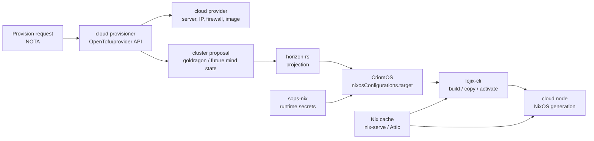
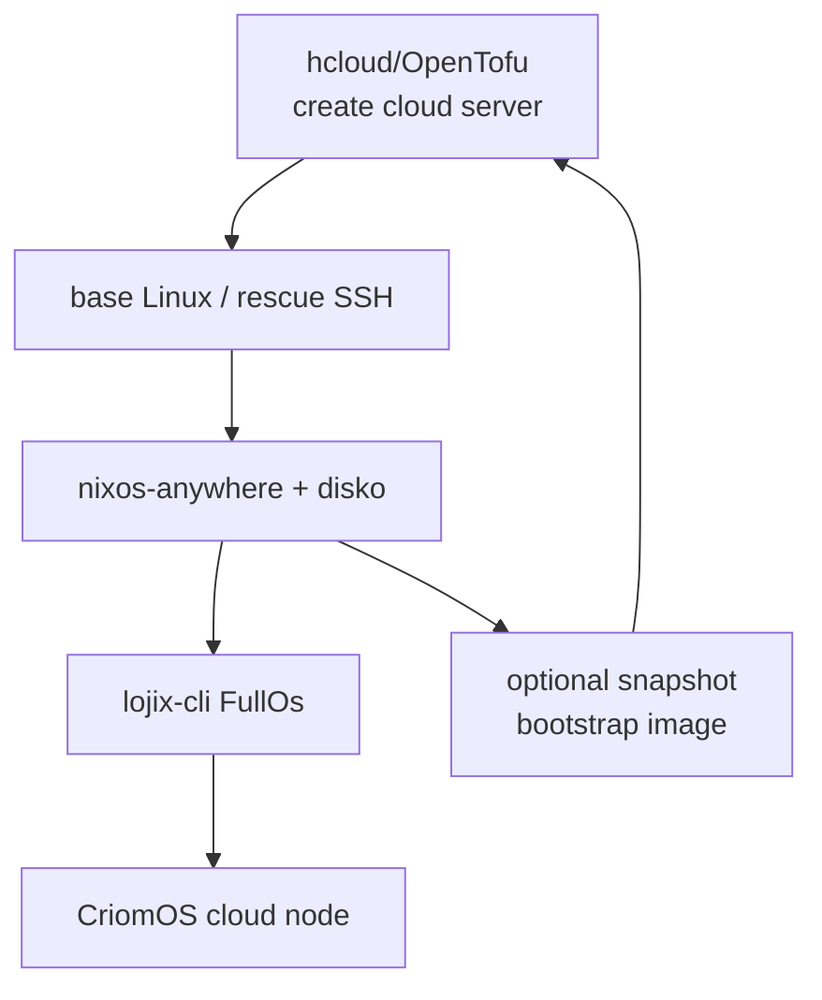

# CriomOS Cloud Infrastructure Survey

Date: 2026-05-12  
Role: designer-assistant

## Summary

CriomOS is already shaped correctly for cloud deployment: it is a
provider-neutral NixOS target, and provider identity enters through
projected `horizon`, `system`, and `deployment` inputs rather than host
directories or hand-written per-node flakes. The cloud layer should keep
that property.

Recommended first stack:

| Layer | First choice | Why |
|---|---|---|
| Provider resource lifecycle | OpenTofu + provider plugins | Mature provider ecosystem; Hetzner Cloud has an official provider; OpenTofu keeps Terraform compatibility and adds client-side state encryption. |
| First install | `nixos-anywhere` + `disko` | Reproducible unattended NixOS install over SSH, including disk partitioning. |
| Fast image path | `nixos-generators` + provider snapshots/images | Builds provider-specific or generic raw/qcow images, then providers cache them as snapshots/custom images. |
| NixOS activation | Existing `lojix-cli` | It already projects horizon and activates `CriomOS#nixosConfigurations.target`; replacing it with Colmena/deploy-rs would duplicate the workspace-specific truth path. |
| Secrets | `sops-nix` with age host recipients and optional PGP operator recipients | It can reuse the current GPG operator infrastructure while using age/SSH-derived identities for cloud hosts. |
| Binary cache | Current `nix-serve` for first pass; Attic/S3-backed cache as scale path | The current cluster cache exists. Cloud expansion needs pushable, garbage-collectable, object-backed cache behavior. |
| First provider | Hetzner Cloud for elastic nodes; Hetzner dedicated/auction for steady builders/cache | Best price/performance in Europe, with US cloud regions available. Dedicated servers are excellent steady capacity but not fast elasticity. |

The main architectural move is **not** to put cloud provider concepts
inside CriomOS modules. Add a provisioning layer that speaks provider
APIs, records placement/state, and then hands a typed target to the
existing horizon -> CriomOS -> lojix path.



## Current CriomOS Shape

The important local facts:

- `CriomOS` exposes one public system output:
  `nixosConfigurations.target`.
- The repo is intentionally network-neutral. It does not own
  `hosts/<name>` and does not know provider identities directly.
- `lojix-cli` reads one Nota request, projects through `horizon-rs`,
  materializes generated override inputs, and invokes Nix against
  CriomOS.
- `horizon-rs` owns the typed projection from cluster proposal to an
  enriched horizon. Current `MachineSpecies` is `Metal | Pod`; there is
  no cloud placement vocabulary yet.
- Secrets are not yet declaratively solved. Current examples include
  `/etc/wireguard/privateKey`, `/etc/nordvpn/privateKey`,
  `/var/lib/nix-serve/nix-secret-key`, and the prior LLM key review
  explicitly called out missing `agenix` / `sops-nix` / systemd
  credential wiring.

This is a good foundation. The missing piece is a **provider placement
relation** in the cluster truth, not per-provider conditionals inside
CriomOS.

## Recommended Architecture

### 1. Add a provider-neutral provisioning layer

Create a cloud provisioning component or repo. It should own:

- provider API calls;
- OpenTofu/Terraform state;
- provider token handling;
- server creation/deletion;
- uploaded image or snapshot lifecycle;
- initial SSH reachability;
- handoff into `nixos-anywhere` or `lojix-cli`.

It should not own:

- NixOS module policy;
- Home Manager;
- horizon projection rules, except by contributing typed input data;
- activation semantics already owned by `lojix-cli`.

The provisioner should emit or update typed placement records that
`horizon-rs` can project. A plausible shape:

```text
Placement
  LocalMetal { ...existing physical identity... }
  CloudInstance {
    provider,
    region,
    server_class,
    image_policy,
    public_network_policy,
    private_network_policy,
    disk_layout,
  }
```

The exact names need a designer pass, but the relation is clear:
**placement says where and how a node exists before CriomOS takes over
the operating system**.

### 2. Keep `lojix-cli` as the activation path

Colmena and deploy-rs are good general NixOS deploy tools, but CriomOS
already has domain-specific deployment semantics:

- a single Nota request;
- horizon projection;
- generated `horizon`, `system`, and `deployment` inputs;
- remote builder/cache behavior;
- `FullOs`, `OsOnly`, and `HomeOnly` split.

Replacing that with Colmena/deploy-rs would lose the workspace's typed
deployment boundary. The better use of external tools is below
`lojix-cli`, not instead of it.

### 3. Use `nixos-anywhere` for first install

`nixos-anywhere` is the best first install primitive. Its documented
shape matches CriomOS: connect to a reachable Linux machine over SSH,
optionally kexec into an installer, run `disko`, install NixOS, and copy
extra files if needed.[^nixos-anywhere]

That maps cleanly to cloud:

1. Provision a temporary provider image that exposes root SSH.
2. Run `nixos-anywhere --flake <criomos-with-projected-inputs>#target`.
3. `disko` lays out disks declaratively.
4. Reboot into CriomOS.
5. Normal `lojix-cli FullOs` takes over for later changes.

For dedicated servers, Hetzner's rescue system/installimage path is
also compatible with this shape because the server can boot a rescue
Linux and expose root SSH.[^hetzner-rescue][^hetzner-installimage]

### 4. Use `nixos-generators` for fast cached images

`nixos-generators` supports image formats for major clouds and generic
formats, including `amazon`, `azure`, `do`, `gce`, `linode`, `openstack`,
`qcow`, `qcow-efi`, `raw`, and `raw-efi`.[^nixos-generators]

The fast path should be:

1. Build a small CriomOS bootstrap image.
2. Upload it to the provider as a custom image or seed one node and
   snapshot it.
3. Create future nodes from that cached image.
4. Use `lojix-cli` to converge the node to its exact role.

Do not put full cluster secrets into the image. It should contain only
the minimal bootstrap shape: SSH, Nix, trusted cache keys, and enough
networking to accept the real deploy.

### 5. Use `sops-nix` as the first secret substrate

`sops-nix` is the best fit because it supports both age and PGP key
groups. That means the existing GPG operator infrastructure can remain
useful while cloud hosts use age identities derived from SSH keys or
dedicated age keys.[^sops-nix][^sops]

Recommended policy:

- human/operator recipients may be PGP or age;
- host recipients should be age, usually converted from SSH Ed25519
  host public keys;
- cloud provider API tokens stay on the operator/provisioner side and
  never enter target NixOS generations;
- target service secrets decrypt to runtime paths such as
  `/run/secrets/...`, never into the Nix store;
- modules accept secret file paths and fail closed when a required
  secret is missing.

`agenix` is simpler and also good, but it is age-only and less aligned
with the existing GPG key infrastructure.[^agenix] If the workspace
wants generated secrets and automatic rekeying later, `agenix-rekey` is
worth a separate spike.

Systemd credentials are a useful second layer for individual services,
but they should not be the first repository-wide secret system. Use
`sops-nix` to materialize files first; then wrap specific services with
`LoadCredential=` where it improves containment.

### 6. Treat OpenTofu state as secret-bearing state

OpenTofu state will contain provider resource IDs, IPs, sometimes
user-data, and occasionally accidental secret values. It must be
protected. OpenTofu has provider plugins and provider lock files, and
current OpenTofu supports client-side state encryption.[^opentofu]

First implementation:

- local encrypted state file for one-person operation;
- SOPS-managed provider tokens;
- state path outside the Nix store;
- no provider token in Nix expressions;
- explicit paid-operation gates for `apply`.

Later:

- remote encrypted state in S3-compatible object storage;
- CI/system agent applies only after human approval;
- typed `ProvisionNode` / `DestroyNode` requests instead of free-form
  Tofu invocations.

## Tool Evaluation

| Tool | Use | Fit for CriomOS |
|---|---|---|
| `nixos-anywhere` | Install NixOS remotely over SSH, using `disko` for disks. | **Adopt.** Best bootstrap primitive for cloud and dedicated servers. |
| `disko` | Declarative partitioning, filesystems, LUKS/LVM/ZFS/etc. | **Adopt.** Cloud disk layouts should become typed horizon/proposal data projected into disko modules.[^disko] |
| `nixos-generators` | Build cloud/custom VM images. | **Adopt.** Use for provider image factory and fast spin-up. |
| OpenTofu / Terraform | Provision provider resources. | **Adopt, but only for infrastructure lifecycle.** Do not let HCL become the source of OS truth. |
| Terranix | Generate Terraform JSON from Nix. | Possible later. First pass should prefer explicit generated artifacts or small HCL to avoid making Nix responsible for provider state semantics too early. |
| Colmena | Stateless parallel NixOS deploy over SSH. | Good general tool; **not primary** because `lojix-cli` owns CriomOS deployment semantics. |
| deploy-rs | Flake-based profile/NixOS deployment. | Good general tool; **not primary** for the same reason. |
| NixOps | Historical NixOS cloud deploy tool. | Do not adopt. It is older/heavier and does not fit the current Nota/horizon path. |
| Morph/krops | Older NixOS deploy approaches. | Do not adopt unless a specific missing primitive appears. |
| Cachix Deploy | Pull-based Nix profile/NixOS activation. | Interesting later for public fleet updates, but it adds a SaaS control plane and bypasses current `lojix-cli` semantics.[^cachix-deploy] |
| `nix-serve` | Simple HTTP binary cache from one Nix store. | Keep for first pass; already wired in CriomOS. |
| Attic | Self-hosted Nix binary cache backed by S3-compatible storage. | Best scale path for cloud because it is pushable and object-backed.[^attic] |
| Native Nix S3 store | Store/fetch binary cache objects in S3-compatible storage. | Useful low-level primitive; lacks the higher-level cache management Attic provides.[^nix-s3-cache] |

## Provider Evaluation

### Hetzner

Hetzner is the best default provider to test first.

Strengths:

- very strong Europe price/performance;
- cloud regions in Germany, Finland, Ashburn VA, Hillsboro OR, and
  Singapore; dedicated root servers are not available in the US/Singapore
  locations.[^hetzner-locations]
- official Hetzner Cloud Terraform provider; current registry metadata
  shows active publication and large install count.[^hcloud-provider]
- snapshots can duplicate servers and serve as cached images for future
  nodes.[^hetzner-snapshots]
- dedicated servers and server auction are excellent steady capacity
  for builders, cache nodes, large AI routers, and storage-heavy nodes.

Constraints:

- Hetzner changed prices on 2026-04-01. It is still affordable, but old
  price assumptions are stale. Example new EU prices include CX23 at
  EUR 3.99/month, CAX11 at EUR 4.49/month, CPX22 at EUR 7.99/month;
  US cloud prices are higher.[^hetzner-price]
- Cloud custom ISO support exists, but it is a support-request flow with
  a direct download URL, not the same as an automated custom-image API.
  Snapshots are the more natural cached-image primitive.
- Hetzner Object Storage is S3-compatible and useful for archives/caches,
  but it is currently Europe-only.[^hetzner-object]
- Dedicated servers are cheap steady power, not elastic capacity. Use
  them for always-on roles, not fast scale-out.

Recommended Hetzner path:



### DigitalOcean

DigitalOcean is a strong second candidate for custom-image workflows.
It supports uploaded custom images in raw, qcow2, VHDX, VDI, and VMDK
formats, with cloud-init and SSH requirements, and droplets can be
created from uploaded images.[^digitalocean-images] It also moved
Droplets to per-second billing effective 2026-01-01, which matters for
short-lived tests and batch workloads.[^digitalocean-billing]

Fit: good for fast custom-image tests and North America coverage, but
usually worse price/performance than Hetzner.

### Akamai / Linode

Akamai Cloud/Linode supports custom images by uploading raw `.img`
files and describes them as deployable golden images for future
instances.[^akamai-images] This is a good fit for a CriomOS image
factory.

Fit: mature US/EU cloud, good operational fallback, likely more
expensive than Hetzner.

### Vultr

Vultr has broad regions, custom ISO flows, snapshots, and CLI/API support
for creating instances from OS images, snapshots, ISOs, or custom images.
It is useful as a compatibility provider and for geographic reach.[^vultr-create]

Fit: good third candidate; likely more expensive than Hetzner, with
better global spread.

### AWS, Google Cloud, Azure

These are the strongest image-cache/global-scale platforms and the most
expensive/complex providers.

- AWS: AMIs and image import are mature; best ecosystem, highest
  complexity.[^aws-import-image]
- Google Cloud: custom images can be stored in selected locations and
  cached in a region on first VM creation if not already available
  there.[^gcp-images]
- Azure: Compute Gallery is a managed image repository that can use VMs,
  snapshots, VHDs, managed images, or gallery versions as sources.[^azure-gallery]

Fit: not first for cost, but important once public services need global
regions, IAM depth, managed load balancing, and enterprise-grade image
distribution.

### OVHcloud, Scaleway, Oracle Cloud, Equinix Metal

- OVHcloud: strong EU/dedicated presence, but less directly aligned with
  NixOS custom-image workflows than Hetzner or DO.
- Scaleway: Europe-focused and worth watching; likely a good secondary
  EU provider after Hetzner.
- Oracle Cloud: cheap ARM/free-tier possibilities, but quota and account
  friction make it poor as the first production substrate.
- Equinix Metal: excellent bare-metal API and iPXE-style control, but
  expensive. Use only if physical hardware control becomes load-bearing.

## Infrastructure Changes Needed

### Horizon / proposal vocabulary

Add provider-neutral placement records. The current `MachineSpecies`
only models `Metal` and `Pod`. Cloud placement needs typed fields for:

- provider;
- region / zone;
- server class;
- architecture;
- public/private network intent;
- image policy (`BootstrapInstall`, `Snapshot`, `CustomImage`);
- disk layout;
- billing or lifecycle intent (`Ephemeral`, `Steady`, `Builder`,
  `Cache`, etc. only if those are real domain concepts).

Avoid stuffing Hetzner terms directly into CriomOS. Provider literals
belong at the provisioning boundary and in proposal data.

### CriomOS Nix modules

Add only provider-neutral OS support:

- importable `disko` layout modules;
- cloud-init support only if a provider/image path needs it;
- sops-nix module wiring;
- secret file options for WireGuard, NordVPN, nix-serve, LLM keys, and
  provider-neutral service credentials;
- image outputs or image-factory packages, likely in a separate image
  module so the normal host generation stays clean.

Do not add `hcloud`, `aws`, `do`, or `linode` branches to ordinary OS
modules unless a kernel/network quirk is genuinely provider-specific.

### lojix-cli

Keep the current activation role. Possible additions:

- a `BootstrapOs` or provisioner-facing deploy request only if
  `nixos-anywhere` needs to be driven by the same Nota surface;
- remote archive-host support for generated inputs, from the existing
  `reports/0006-archive-hosting-review.md` direction;
- direct builder-to-target closure copy, from
  `reports/0008-third-party-builder-copy-topology.md`;
- cache signing secret integration so non-cache builders can safely
  publish usable closures.

### Secrets repository shape

Add a secrets directory or repo with:

- `.sops.yaml`;
- operator recipient keys;
- host age recipients;
- encrypted files grouped by relation, not by random service habit;
- documented rotation flow;
- an explicit rule that provider API tokens are for the provisioner,
  not for target hosts.

Initial secret names to model:

- `wireguard/privateKey`;
- `nordvpn/privateKey`;
- `nix-serve/signingKey`;
- `llm/apiKeys`;
- `cloud/hetzner/token`;
- `cloud/digitalocean/token`;
- `cloud/linode/token`;
- `cloud/vultr/token`;
- OpenTofu state encryption passphrase or key material.

### Cache and archive hosting

Current `nix-serve` is enough for a small first cloud test. For bigger
cloud work:

- use Attic or another pushable binary cache;
- use S3-compatible storage for object backing;
- keep cache signing keys secret-managed;
- consider Hetzner Object Storage for EU-only cache/archive experiments;
- keep R2 or another mature S3-compatible provider on the table for
  globally-served generated input archives.

The existing `lojix-cli/reports/0006-archive-hosting-review.md` remains
relevant: remote builders need remotely fetchable generated inputs, not
dispatcher-local `path:` refs, when SSH staging is not the desired path.

## Test Plan

Default tests must not spend money.

Recommended test ladder:

1. `nix flake check` for CriomOS, horizon-rs, and provisioner repo.
2. Build image-factory outputs for at least `raw-efi`, `qcow-efi`, and
   one provider-specific format (`do`, `linode`, or `gce`).
3. Run `disko` VM tests for the cloud disk layout.
4. Run a NixOS VM test proving sops-nix creates runtime secret files
   with correct owner/mode and services fail closed when absent.
5. Run `tofu validate` and `tofu plan` against fake/no-token fixtures
   where possible.
6. Add explicit paid smoke tests behind a request record such as
   `ProvisionCloudSmoke HetznerCloud ... confirmPaid true`.
7. First paid smoke test creates the smallest Hetzner Cloud node,
   installs CriomOS with `nixos-anywhere`, runs `lojix-cli CheckHostKeyMaterial`,
   then destroys the server.
8. Second paid smoke test creates from a snapshot/custom image and
   measures time-to-SSH and time-to-CriomOS-activation.

The paid tests should write provider resource IDs to an auditable state
file and include a cleanup command that can run even after partial
failure.

## Open Questions

1. Should cloud nodes live in the existing `goldragon` production
   proposal, or should public-service clouds get a separate cluster
   proposal from day one?
2. Is the first cloud role an elastic worker, a public service edge, a
   Nix builder/cache, or a Persona test engine? The placement vocabulary
   should name the role without overfitting the provider.
3. Do we want `lojix-cli` to call `nixos-anywhere`, or should the
   provisioner own bootstrap and hand off only after first boot?
4. Is age acceptable as the host secret identity even if the operator
   root remains GPG? My recommendation is yes: use SOPS key groups with
   PGP humans and age hosts.
5. Should the first object-backed cache be Hetzner Object Storage
   because it keeps traffic/provider locality in Europe, or Cloudflare
   R2 because the older archive-hosting review favored its edge/egress
   shape?

## Near-Term Bead Candidates

File these for the operator/system lane if this direction is accepted:

| Candidate | Role | Work |
|---|---|---|
| Cloud placement vocabulary report | designer | Name the provider-neutral records for horizon/goldragon. |
| CriomOS sops-nix integration | system-specialist/operator | Add sops-nix module wiring and migrate one existing secret path. |
| Disko cloud layout | operator | Add a small cloud disk layout and VM test. |
| Hetzner Cloud bootstrap smoke | system-specialist/operator | OpenTofu creates smallest node; nixos-anywhere installs CriomOS; cleanup proves destroy. |
| CriomOS image factory | operator | Build `raw-efi`, `qcow-efi`, and one provider-specific image output. |
| Cache scale report | designer-assistant/system-assistant | Decide `nix-serve` vs Attic vs S3 store for cloud nodes. |

## Sources

[^nixos-anywhere]: nix-community, `nixos-anywhere`, https://github.com/nix-community/nixos-anywhere
[^disko]: nix-community, `disko`, https://github.com/nix-community/disko
[^nixos-generators]: nix-community, `nixos-generators`, https://github.com/nix-community/nixos-generators
[^opentofu]: OpenTofu provider/state documentation, https://opentofu.org/docs/language/providers/
[^sops-nix]: Mic92, `sops-nix`, https://github.com/Mic92/sops-nix
[^sops]: getsops, SOPS age/PGP documentation, https://github.com/getsops/sops
[^agenix]: ryantm, `agenix`, https://github.com/ryantm/agenix
[^nix-s3-cache]: Nix manual, S3 binary cache store, https://nix.dev/manual/nix/latest/store/types/s3-binary-cache-store
[^attic]: Attic documentation, https://docs.attic.rs/
[^cachix-deploy]: Cachix Deploy documentation, https://docs.cachix.org/deploy/
[^hetzner-locations]: Hetzner Cloud locations, https://docs.hetzner.com/cloud/general/locations/
[^hetzner-price]: Hetzner price adjustment effective 2026-04-01, https://docs.hetzner.com/general/infrastructure-and-availability/price-adjustment/
[^hetzner-snapshots]: Hetzner Cloud backups/snapshots, https://docs.hetzner.com/cloud/servers/backups-snapshots/overview/
[^hetzner-rescue]: Hetzner Rescue System, https://docs.hetzner.com/robot/dedicated-server/troubleshooting/hetzner-rescue-system
[^hetzner-installimage]: Hetzner installimage, https://docs.hetzner.com/robot/dedicated-server/operating-systems/installimage/
[^hcloud-provider]: Hetzner Cloud Terraform provider, https://registry.terraform.io/providers/hetznercloud/hcloud/latest/docs
[^hetzner-object]: Hetzner Object Storage FAQ, https://docs.hetzner.com/storage/object-storage/faq/general/
[^digitalocean-images]: DigitalOcean custom images, https://docs.digitalocean.com/products/custom-images/how-to/upload/
[^digitalocean-billing]: DigitalOcean per-second Droplet billing changelog, https://ideas.digitalocean.com/changelog/droplets-per-second-billing
[^akamai-images]: Akamai/Linode custom images, https://techdocs.akamai.com/cloud-computing/docs/images
[^vultr-create]: Vultr CLI instance create documentation, https://docs.vultr.com/reference/vultr-cli/instance/create
[^aws-import-image]: AWS EC2 `import-image` command reference, https://docs.aws.amazon.com/cli/latest/reference/ec2/import-image.html
[^gcp-images]: Google Compute Engine custom images, https://cloud.google.com/compute/docs/images/create-custom
[^azure-gallery]: Azure Compute Gallery, https://learn.microsoft.com/en-us/azure/virtual-machines/shared-image-galleries
