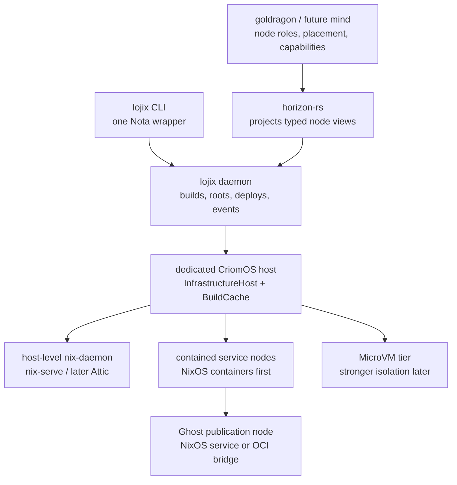

# Dedicated Cloud Host And Contained Node Research

Date: 2026-05-12  
Role: designer-assistant

## Summary

The previous cloud survey chose the provider/install side: OpenTofu for
provider resources, `nixos-anywhere` + `disko` for first install, and
`lojix-cli` for normal CriomOS activation. This follow-up is about the
node model after a dedicated server exists.

The important architectural split is:

- **Node role**: what a node is for. Examples: edge desktop, router,
  center, AI node, infrastructure host, public service.
- **Node placement**: where and how the node exists. Examples: metal,
  contained inside another node, MicroVM, OCI image, cloud instance.
- **Node capability**: what the node can provide. Examples: Nix cache,
  remote builder, container host, public reverse-proxy endpoint.

CriomOS should stay data-neutral. It should not contain a Hetzner node
name, a Ghost domain, a container inventory, or provider facts. Those
facts belong in horizon/goldragon/future mind state, then arrive at
CriomOS as typed projected data. CriomOS modules consume the projection
and produce a NixOS generation.

Recommendation for the first dedicated server:

1. Add horizon-level **infrastructure host** capability data for a
   trusted metal node that hosts contained services. Do not add
   provider/service composites like `DedicatedCloudHost`,
   `ContainerServiceNode`, or `CacheBuilder` as `NodeSpecies` variants.
2. Materialize first contained nodes with **NixOS declarative
   containers**, which are NixOS-shaped and implemented on
   `systemd-nspawn`.
3. Reserve **MicroVM.nix** for public or less-trusted services that
   need a real kernel boundary.
4. Keep the first Nix cache/builder on the host, not inside a
   container, because `nix-serve` naturally serves the host Nix store
   and the builder naturally owns host CPU/store policy.
5. Let `lojix` grow into the daemon that owns deployed-generation
   liveness, cache roots, container lifecycle events, and eventually
   deployment requests over a Signal contract. The current CLI should
   stay as a one-Nota wrapper.
6. Treat Ghost as the first public service node, but do not pretend
   Nixpkgs already has a Ghost CMS module. It does not. The immediate
   path is either a CriomOS-owned NixOS service module or a pragmatic
   OCI/Docker Compose bridge that is marked as transitional.



## Current Local Shape

The current code already has the seed of this model, but it is
underspecified for a dedicated service host.

In `horizon-rs`, `MachineSpecies` is currently only:

```rust
pub enum MachineSpecies {
    Metal,
    Pod,
}
```

`Machine` then has pod-only fields:

```rust
pub struct Machine {
    pub species: MachineSpecies,
    pub arch: Option<Arch>,
    pub cores: u32,
    pub model: Option<ModelName>,
    pub mother_board: Option<MotherBoard>,
    pub super_node: Option<NodeName>,
    pub super_user: Option<UserName>,
    ...
}
```

`Node::project` derives `behaves_as.virtual_machine` from
`MachineSpecies::Pod`. It also derives cache and builder behavior from
role/trust/size:

- `is_remote_nix_builder = online && !edge && fully_trusted &&
  (medium || center) && has_base_pub_keys`
- `is_nix_cache = behaves_as.center && min_size && has_base_pub_keys`

CriomOS consumes these flags in `modules/nixos/nix.nix`: remote builder
nodes enable `nix.sshServe`, dispatcher nodes get `buildMachines`, and
cache nodes enable `services.nix-serve` on port 80 with the signing key
at `/var/lib/nix-serve/nix-secret-key`.

That is good enough for the current cluster, but it mixes several
concepts:

- `MachineSpecies::Pod` says "not metal" but does not say whether this
  is a NixOS container, MicroVM, OCI container, cloud VM, or something
  else.
- `NodeSpecies::Center` currently causes Nix cache behavior, but a
  dedicated cloud host may be a container host, cache, builder,
  reverse-proxy endpoint, and service supervisor at the same time.
- CriomOS imports modules broadly and gates behavior inside them. That
  is acceptable, but `nix.nix` currently mixes Nix client settings,
  remote builder service, dispatcher config, and cache service.

## Node Model Recommendation

Do not fix this by adding a long flat list of node species. Add
explicit axes. `NodeSpecies` can remain compatibility sugar for current
archetypes, but new truth should move into placement and capability
records.

### Role

Add capability vocabulary for the metal host. Suggested names:

- `InfrastructureHost`: best domain name. It says the node hosts
  infrastructure and does not tie the role to any provider.
- `ContainerHost`: narrower. Good as a capability, not as the whole
  node role, because the same host can also be a builder/cache.
- `CloudHost`: user-facing phrase, but slightly misleading for a
  dedicated server because the provider may be Hetzner Robot, a home
  rack, or another metal host.

Recommendation: use **InfrastructureHost** as a role-family/capability
name in the projection language, and **ContainerHost** as a narrower
capability. Avoid a `NodeSpecies::InfrastructureHost` variant unless the
old enum must carry compatibility sugar.

### Placement

Replace or refine the current `MachineSpecies::Pod` concept with a
typed placement relation. A plausible shape:

```text
NodePlacement
  Metal {
    arch,
    model?,
    motherboard?,
    ram_gb?,
  }

  Contained {
    host: NodeName,
    substrate: ContainmentSubstrate,
    resources,
    network,
    state,
    trust,
  }

ContainmentSubstrate
  NixosContainer
  MicroVm
  OciContainer
  SystemdService
```

This should live in horizon/goldragon/future mind state, not CriomOS.
CriomOS receives the projected result and decides which NixOS modules to
enable. If `MachineSpecies::Pod` stays for compatibility, make it a
legacy synonym for `Contained`, not the place where all containment
semantics accumulate.

### Capability

Add capability records rather than deriving all infrastructure behavior
from `NodeSpecies`:

```text
NodeCapability
  BuildHost { max_jobs, cores_per_job, trust }
  BinaryCache { public_url, signing_key_secret, retention_policy }
  ContainerHost { substrates, bridge_policy, public_endpoint_policy }
  PublicEndpoint { domains, tls_policy, reverse_proxy_policy }
```

The point is naming. A node can be one role and several capabilities.
That is more honest than making `Center`, `InfrastructureHost`,
`NixCacheHost`, `NixBuilderHost`, `GhostHost`, and `ContainerHost` all
compete as one enum.

## Container Substrate Recommendation

### First substrate: NixOS containers / systemd-nspawn

Use NixOS declarative containers first.

Why:

- They are NixOS modules, so they fit CriomOS better than Docker-first
  service definitions.
- The NixOS manual documents both imperative and declarative NixOS
  containers; declarative containers are updated with the host generation
  and can be managed through `container@name.service`.
- `systemd-nspawn` gives the underlying namespace container primitive,
  including user namespace support. Its own manual warns that running
  without user namespacing is not secure for untrusted code, so
  `privateUsers`/user namespace policy should be explicit for any
  service exposed to the public internet.
- The data model is clean: the host projection contains a set of child
  service nodes, and CriomOS turns those into `containers.<name>`.

Cost:

- Declarative containers are coupled to the host rebuild. That is fine
  for the first milestone because `lojix` already deploys host NixOS
  generations. If independent child updates become important, evaluate
  `extra-container` or a `lojix-daemon`-owned equivalent later.
- They are not a hard security boundary for hostile workloads. Public
  services should be considered trusted-enough services, not arbitrary
  tenant code.

### Second substrate: MicroVM.nix

Use MicroVM.nix when a contained node needs a stronger boundary.

MicroVM.nix is NixOS-native, host-declarative, and starts MicroVMs
through systemd units. Its host module creates `/var/lib/microvms`,
tap-interface units, virtiofsd units, and `microvm@` services. It can
share host directories and even a read-only host `/nix/store`, but a
writable Nix store overlay has caveats.

This is a better fit for:

- public membership/payment services after the first working Ghost
  deployment;
- less-trusted applications;
- anything where a container root escape would be unacceptable.

Cost:

- More memory, network, disk, and boot machinery than `nspawn`.
- More design surface for state, backups, secrets, and upgrade.

### Third substrate: OCI containers

Use Podman/Docker only when the application is realistically delivered
as an OCI stack and writing a native NixOS module is not worth the first
pass.

For Ghost specifically, this is a tempting bridge because Ghost now has
official Docker Compose documentation. It should not become the default
CriomOS service model. OCI image tags and Docker Compose files become a
second configuration universe unless `lojix` and horizon own the inputs
typedly.

### Defer Incus/LXD/Kubernetes

Incus/LXD and Kubernetes are control planes. They are useful when the
product is a private cloud or multi-tenant platform. They are too much
for one dedicated server hosting CriomOS-shaped services. They would
also create state outside the horizon -> CriomOS -> lojix path unless
carefully wrapped.

## Nix Cache And Builder Shape

The first Nix cache/builder should be host-level, even if it is a
logical "cache node" in horizon.

Reason:

- `nix-serve` serves paths from the host Nix store.
- A remote builder naturally wants host CPU, host store policy, and the
  host Nix daemon.
- CriomOS already has the relevant gates in `modules/nixos/nix.nix`.
- Running a writable Nix daemon inside a container is possible, but it
  creates store ownership, signing, and GC questions before there is a
  benefit.

So the first dedicated server can be:

```text
node: hyacinth
role: InfrastructureHost
placement: Metal
capabilities:
  BuildHost
  BinaryCache
  ContainerHost { substrates = [NixosContainer] }
```

That still lets the human think "the cache node lives on the dedicated
server", but CriomOS materializes it as host services until isolation is
worth the extra complexity.

### Cache retention

`nix-serve` does not own a retention policy. It serves whatever the host
Nix store still has. Therefore `lojix-daemon` should own the deployed
live set and create/remove GC roots.

Recommended first retention model:

1. Every build/deploy emits typed events:
   `BuildRealized`, `CachePublished`, `ActivationSucceeded`,
   `GenerationRetired`.
2. On the cache/builder host, `lojix-daemon` creates roots under:

   ```text
   /nix/var/nix/gcroots/criomos/<cluster>/<node>/<kind>/<generation>
   ```

3. Root only the top-level system path or Home activation path. Nix
   keeps runtime dependencies reachable from roots.
4. Index the closure with `nix-store -qR` or `nix path-info -r`; do not
   reinvent Nix's closure graph.
5. Keep current, boot-pending, rollback-window, pinned release, and
   short-grace recent build roots.
6. Deletion is two phase: retire the root/index entry, then wait for
   the configured narinfo TTL before expecting clients to stop asking
   for the path.

Attic is the scale path, not the first required move. It is
self-hostable, S3-compatible, globally deduplicating, and has garbage
collection, but it still needs a CriomOS live-set index. Attic's LRU
retention should never be the only thing protecting active generations.

## Lojix Daemon Shape

Today `lojix-cli` reads one Nota request, decodes it into
`LojixRequest`, creates a deployment actor pipeline in-process, and
exits. That is correct for a CLI, but the dedicated-server use case
introduces long-lived responsibilities:

- deployed generation live-set;
- cache GC roots;
- container node lifecycle;
- stateful deploy history;
- build/cache publication events;
- eventually provider placement handoff from the cloud layer.

Recommendation:

1. Extract a `lojix-core` library from the current CLI implementation.
   It should own typed request handling, horizon projection, build plan
   creation, copy, and activation.
2. Add `lojix-daemon` as the long-lived component. It owns state and
   serializes deployment/cache/container mutations.
3. Add a contract crate only when there are two processes speaking over
   a wire, likely `signal-lojix`. Its relations should be named
   explicitly: deployment submission, deployment observation, cache
   retention command, contained-node lifecycle observation.
4. Keep `lojix-cli` as the one-Nota wrapper. It parses the same Nota
   request surface and sends the typed signal to the daemon. For
   bootstrap, it may keep a local one-shot path until the daemon exists.
5. Do not put provider data in `lojix-cli`. Provider placement belongs
   to the cloud provisioner/horizon layer. `lojix` consumes the resolved
   target and activates the system.

This matches the direction the user named: CLI becomes wrapper; daemon
does the real work. It also preserves the current good property:
operator intent is one Nota record, not a flag soup.

## Ghost As First Public Service Node

Ghost is a good first real service because it forces the hard questions:
public HTTP/TLS, persistent content, database, mail, payments/members,
backup, upgrades, and service isolation.

Current upstream facts:

- Ghost's official self-hosted production guide targets Ubuntu
  22.04/24.04, NGINX, supported Node.js, MySQL 8, systemd, a domain, and
  at least 1 GB RAM.
- Ghost 6 requires Node `^22.13.1` according to Ghost's current Node
  compatibility page.
- Ghost says MySQL 8 is the only supported production database.
- Ghost also documents a Docker Compose install path for its newer
  Docker setup.
- Nixpkgs currently has `ghost-cli`, but `pkgs.ghost` is not Ghost CMS;
  it is a different package. I found no NixOS `services.ghost` module
  in the checked Nixpkgs source.

Therefore there are two honest implementation paths.

### Path A: CriomOS-native Ghost module

Create a CriomOS/NixOS module that declares:

- Ghost version/source or `ghost-cli` bootstrap strategy;
- Node 22 runtime;
- MySQL 8 service;
- Ghost content state path;
- systemd service;
- reverse proxy endpoint;
- TLS;
- mail/Stripe/member secrets;
- backup paths and restore procedure.

This is the architectural target. It keeps Ghost as a NixOS-shaped
service node and lets horizon own the domain/state/secret facts.

Risk: packaging Ghost CMS cleanly may take time. `ghost-cli` is designed
to install/manage Ghost dynamically, which is not the same as pure Nix
packaging.

### Path B: Transitional OCI bridge

Use Ghost's official Docker Compose shape, but wrap it from CriomOS with
typed inputs:

- image tag pinned by horizon/CriomOS;
- MySQL 8 image/tag pinned;
- state volumes declared;
- env file generated from secrets at runtime, not in the Nix store;
- host reverse proxy owns public TLS;
- `lojix-daemon` records the deployed image/tag and volume generation.

This gets a public Ghost service working faster. It must be marked
transitional because otherwise Docker Compose becomes a second
deployment language sitting beside CriomOS.

Recommendation: start with Path A if the goal is to improve CriomOS; use
Path B only if the goal is "publish Ghost quickly".

## CriomOS Code Reshuffle

The repos are not too large, so this does not need a new repository.
The useful reshuffle is inside CriomOS modules and horizon vocabulary.

Suggested CriomOS module layout:

```text
modules/nixos/
  base/
  nix/
    client.nix
    builder.nix
    cache.nix
    retention-agent.nix
  infrastructure/
    default.nix
    container-host.nix
    reverse-proxy.nix
  services/
    ghost.nix
  edge/
  router/
  network/
```

The aggregate can still import everything and gate behavior from
projected horizon flags. The improvement is conceptual separation:

- `nix/client.nix`: every node's Nix settings;
- `nix/builder.nix`: SSH build receiver/dispatcher;
- `nix/cache.nix`: `nix-serve`/Attic cache service;
- `nix/retention-agent.nix`: lojix GC roots and live-set agent;
- `infrastructure/container-host.nix`: `containers.<name>` projection;
- `services/ghost.nix`: Ghost service node module.

This keeps CriomOS data-neutral while making the role boundaries visible.

### Data-neutrality cleanup before adding cloud host work

Before adding dedicated-server node roles, clean up current hardcoded
node-name gates in CriomOS. They already violate the rule that CriomOS
consumes projected facts instead of carrying node-specific data:

- `modules/nixos/nix.nix` opens port `11436` when
  `node.name == "prometheus"`. That should be a projected service
  endpoint or move beside the LLM service gate.
- `modules/nixos/network/tailscale.nix` enables Tailscale only for
  `["ouranos", "prometheus"]`. That should be a `TailnetMember`
  capability or equivalent projected boolean.
- `modules/nixos/network/headscale.nix` enables Headscale when
  `node.name == "ouranos"` and constructs `ouranos.<cluster>.criome`.
  That should be a projected `HeadscaleServer` endpoint with its public
  name, port, and TLS policy.

Those cleanups are directly relevant to dedicated servers: if
`prometheus` and `ouranos` remain special strings in CriomOS, a future
Hetzner host will invite more special strings.

## First Implementation Plan

1. **Horizon vocabulary pass**
   - Add an infrastructure-host role/capability.
   - Replace or clarify `MachineSpecies::Pod` with contained placement
     data: host, substrate, network, state, resources, trust.
   - Add explicit capabilities for builder/cache/container host instead
     of deriving all of them from `Center`.
   - Keep `NodeSpecies` as compatibility/archetype sugar, not the home
     of new provider/service composites.

2. **CriomOS infrastructure module**
   - Split Nix cache/builder code from generic Nix client settings.
   - Remove node-name gates from Nix, Tailscale, and Headscale modules.
   - Add an infrastructure/container-host module consuming projected
     contained-node data.
   - First substrate: NixOS declarative containers.

3. **Host-level cache/builder**
   - Keep `nix-serve` on the dedicated host for first pass.
   - Add `lojix`-owned GC root policy before aggressive GC.
   - Later evaluate Attic once there are multiple builders/cloud nodes.

4. **Lojix daemon extraction**
   - Extract current deploy path into `lojix-core`.
   - Add a daemon with an event log and live-set state.
   - Keep CLI as one-Nota wrapper.
   - Consider replacing `builder: Option<NodeName>` with a closed
     `BuilderSelection` enum later, so "target builds", "dispatcher
     chooses", and "named remote builder" are not overloaded through
     `None` and same-node behavior.

5. **Ghost node**
   - Decide native module vs transitional OCI bridge.
   - For either path, model the Ghost node in horizon as a public service
     node placed on the infrastructure host.
   - Persist content/database state, mail secrets, TLS, reverse proxy,
     backup, and restore semantics in typed records.

## Open Questions

1. Should the first Nix cache/builder be a **logical node materialized as
   host services**, as recommended here, or do you want a hard container
   boundary even though it complicates writable store/signing/GC?

2. Should Ghost start as a **native CriomOS module** or a
   **transitional OCI bridge**? Native is cleaner; OCI is faster.

3. Should the child service nodes be first-class horizon nodes with their
   own names/keys, or should they begin as services under one
   infrastructure host? My recommendation: first-class nodes for
   externally addressed services like Ghost; plain host services for
   same-trust helpers like the first cache.

4. Is `InfrastructureHost` the right role name? I prefer it over
   `CloudHost` because it also covers a colocated/dedicated/home-rack
   server without leaking the provider model into the role.

## Sources

- NixOS manual, container management and declarative containers:
  https://nixos.org/manual/nixos/stable/#ch-containers
- NixOS options for `containers.<name>.config` and related fields:
  https://nixos.org/nixos/manual/options.html
- `systemd-nspawn` manual, especially user namespace and network
  options: https://man7.org/linux/man-pages/man1/systemd-nspawn.1.html
- MicroVM.nix host module documentation:
  https://microvm-nix.github.io/microvm.nix/host.html
- MicroVM.nix shares and `/nix/store` notes:
  https://microvm-nix.github.io/microvm.nix/shares.html
- Attic introduction and garbage collection:
  https://docs.attic.rs/ and https://docs.attic.rs/tutorial.html
- Nix garbage collection manual:
  https://nix.dev/manual/nix/2.34/package-management/garbage-collection
- Nix narinfo TTL settings:
  https://nix.dev/manual/nix/2.34/command-ref/conf-file.html
- Ghost install overview:
  https://docs.ghost.org/install/
- Ghost Ubuntu production guide:
  https://docs.ghost.org/install/ubuntu
- Ghost Docker Compose install:
  https://docs.ghost.org/install/docker/
- Ghost supported Node versions:
  https://docs.ghost.org/faq/node-versions/
- Ghost supported production databases:
  https://docs.ghost.org/faq/supported-databases/
- Local code read:
  `/git/github.com/LiGoldragon/horizon-rs/lib/src/species.rs`,
  `/git/github.com/LiGoldragon/horizon-rs/lib/src/machine.rs`,
  `/git/github.com/LiGoldragon/horizon-rs/lib/src/node.rs`,
  `/git/github.com/LiGoldragon/CriomOS/modules/nixos/nix.nix`,
  `/git/github.com/LiGoldragon/CriomOS/modules/nixos/criomos.nix`,
  `/git/github.com/LiGoldragon/lojix-cli/src/request.rs`,
  `/git/github.com/LiGoldragon/lojix-cli/skills.md`.
