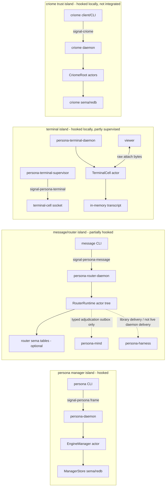
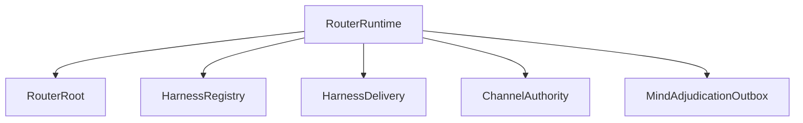

# Persona Engine Code Compendium

Date: 2026-05-12
Role: designer-assistant
Scope: current code in the Persona engine and adjacent Criome trust daemon.

This report is the first pass using the new
[skills/engine-analysis.md](/home/li/primary/skills/engine-analysis.md)
protocol. It emphasizes what is actually wired in code over what the recent
architecture intends.

External vocabulary borrowed lightly:

- [C4 diagrams](https://c4model.com/diagrams): context/container/component
  zoom levels plus dynamic/deployment views.
- [arc42 method](https://arc42.org/method): building-block, runtime,
  deployment, and crosscutting-concept slices.
- [SEI Views and Beyond](https://www.sei.cmu.edu/library/views-and-beyond-collection/):
  separate module, component-and-connector, and allocation views.
- [OWASP threat modeling process](https://owasp.org/www-community/Threat_Modeling_Process):
  data flows and trust boundaries.
- [OpenTelemetry traces](https://opentelemetry.io/docs/concepts/signals/traces/):
  request paths as named spans across process boundaries.
- [SEI ATAM](https://www.sei.cmu.edu/library/the-architecture-tradeoff-analysis-method/):
  explicit risks, non-risks, and tradeoffs.

## 1. Current State

The current engine is not yet one fully supervised federation. It is several
working islands plus contract surfaces that are converging:

Hooked facts:

- `persona` CLI sends one `signal-persona` frame to `persona-daemon`; the
  daemon starts `ManagerStore` and `EngineManager` and replies over the same
  connection. See [persona transport](/git/github.com/LiGoldragon/persona/src/transport.rs:180).
- `message` CLI sends one `signal-persona-message` frame to
  `persona-router-daemon`; the router stamps ingress provenance from
  `RouterIngressContext`. See [message router client](/git/github.com/LiGoldragon/persona-message/src/router.rs:11)
  and [router ingress](/git/github.com/LiGoldragon/persona-router/src/router.rs:44).
- `persona-terminal-supervisor` resolves named sessions from component Sema,
  forwards `signal-persona-terminal` requests to terminal sockets, and records
  attempts/events. See [terminal supervisor](/git/github.com/LiGoldragon/persona-terminal/src/supervisor.rs:340).
- `terminal-cell` owns a real child PTY, raw viewer attach path, input gate,
  worker lifecycle observations, and in-memory transcript. See
  [terminal-cell session](/git/github.com/LiGoldragon/terminal-cell/src/session.rs:1134).
- `criome` has a real Unix-socket daemon and Kameo actor tree, but BLS
  signing/verification is still placeholder logic. See
  [criome root](/git/github.com/LiGoldragon/criome/src/actors/root.rs:94).

Not yet hooked:

- `persona-daemon` does not yet launch the first-stack component daemons through
  `DirectProcessLauncher`. The launcher exists and is tested as a library path,
  but it is not wired into the live daemon request path. See
  [direct process launcher](/git/github.com/LiGoldragon/persona/src/direct_process.rs:206).
- Router-to-mind adjudication is an in-memory typed outbox, not a live
  `persona-mind` socket path.
- Router-to-harness delivery currently calls a harness terminal-delivery
  library adapter; `persona-harness-daemon` itself returns typed unimplemented
  for delivery.
- `persona-system-daemon` returns status and typed unimplemented for focus
  operations; the working focus stream is still the NOTA/stdout `system` CLI.
- Criome is not integrated into Persona policy or routing yet.

## 2. Channel Ledger

| Channel | Producer -> Consumer | Contract / transport | Payloads today | State effect | Status |
|---|---|---|---|---|---|
| Engine management | `persona` CLI -> `persona-daemon` | `signal-persona` length-prefixed rkyv over Unix socket | `EngineRequest`: status, component status, startup, shutdown. `EngineReply`: status, accepted/rejected. | `EngineManager` mutates `EngineState`; `ManagerStore` persists engine record. | Hooked. |
| Component spawn envelope | `persona-daemon` -> component process | env vars plus component executable path | `PERSONA_ENGINE_ID`, `PERSONA_COMPONENT`, `PERSONA_STATE_PATH`, `PERSONA_SOCKET_PATH`, `PERSONA_SOCKET_MODE`, peer sockets. | Would create component processes and sockets. | Library-only; not live daemon path. |
| Message ingress | `message` CLI -> `persona-router-daemon` | `signal-persona-message` over Unix socket | `MessageSubmission`, `InboxQuery`; replies accepted/listing/rejected. | Router pending queue, signal slots, optional router tables for delivery/channel. | Hooked. |
| Router channel authority | `RouterRoot` -> `ChannelAuthority` | Kameo actor message | grant, retract, check, use, install structural channels. | In-memory channels; optional `channels` and `adjudication_pending` tables. | Hooked inside router. |
| Router mind adjudication | `RouterRoot` -> `MindAdjudicationOutbox` | Kameo actor message using `signal-persona-mind` records | `AdjudicationRequest` with origin, destination harness, kind, body summary. | In-memory outbox only. | Stubbed; no live mind socket. |
| Router harness delivery | `RouterRoot` -> `HarnessDelivery` -> harness terminal adapter | Kameo plus `persona-harness` library call | Router `Message` rendered as NOTA text, delivered to terminal endpoint. | Optional delivery attempts/results in router tables. | Partly hooked; bypasses live harness daemon. |
| Mind CLI/daemon | `mind` CLI -> `persona-mind` daemon | `signal-persona-mind` over Unix socket | role claim/release/handoff/observe, activity, work graph operations. | `claims`, `activities`, `activity_next_slot`, `memory_graph`. | Hooked for work graph; no channel adjudication. |
| Terminal supervisor | caller -> `persona-terminal-supervisor` -> terminal socket | `signal-persona-terminal` over Unix socket | connection, input, resize, capture, prompt pattern, gate, injection, worker lifecycle. | `sessions`, `delivery_attempts`, `terminal_events`, viewer/session tables. | Hooked, but sequential subscription serving is a risk. |
| Terminal raw attach | viewer -> `terminal-cell` daemon -> child PTY | terminal-cell byte protocol plus raw pump | attach accept/reject, raw keyboard/output bytes, resize, exit. | in-memory transcript and worker lifecycle. | Hooked. |
| Harness daemon | caller -> `persona-harness-daemon` | `signal-persona-harness` over Unix socket | status returns typed status; delivery/prompt/cancel return typed unimplemented. | in-memory `Harness` lifecycle and transcript count. | Skeleton. |
| System daemon | caller -> `persona-system-daemon` | `signal-persona-system` over Unix socket | status returns typed status; focus requests unimplemented. | served count, backend, last op. | Skeleton. |
| System focus CLI | human/script -> `system` CLI -> Niri | NOTA in/out and `niri msg --json` | focus snapshot/subscription records. | `FocusTracker` actor state during run. | Hooked outside daemon. |
| Criome trust | client -> `criome` daemon | `signal-criome` over Unix socket | identity register/revoke/lookup, sign, verify, archive/channel/auth attestation, subscribe. | `identities`, `revocations`, `attestations`, cursor. | Hooked skeleton; cryptography placeholder. |

Important contract skew:

- `persona-router` is locked to `signal-persona-mind` commit `89d843c`, which
  includes channel/adjudication vocabulary. `persona-mind` is locked to
  `signal-persona-mind` commit `46db5ca`, whose implemented daemon surface is
  role/activity/work-graph only. Router can produce typed adjudication records
  that the current mind daemon cannot serve. See [router Cargo.lock](/git/github.com/LiGoldragon/persona-router/Cargo.lock:820)
  and [mind Cargo.lock](/git/github.com/LiGoldragon/persona-mind/Cargo.lock:453).
- `persona-router` and `persona-message` use different
  `signal-persona-message` commits, but the public variants they use still line
  up. See [router message lock](/git/github.com/LiGoldragon/persona-router/Cargo.lock:810)
  and [message lock](/git/github.com/LiGoldragon/persona-message/Cargo.lock:453).
- `signal` still has older frame/auth vocabulary with `AuthProof`; the
  Persona-specific contracts have moved to local filesystem trust plus
  provenance tags, and `signal-criome` explicitly avoids `AuthProof`.

## 3. Component Pages

### 3.1 persona

Function: host-level engine manager and Nix/test composition apex.

Entry points:

- `persona` CLI: parse one NOTA command, send `signal-persona` to the daemon,
  render one NOTA reply.
- `persona-daemon`: bind one Unix socket and keep manager actors alive.
- scripts: `persona-dev-stack`, `persona-engine-sandbox`, terminal-cell smoke
  lanes, host Ghostty attach helper.

Actors/state:

- `EngineManager` carries `engine`, `EngineState`, optional `ManagerStore`,
  and in-memory `ManagerEvent` trace.
- `ManagerStore` owns Sema/redb tables `manager.engine-records` and
  `manager.engine-events`.
- `ComponentCommandResolver` and `DirectProcessLauncher` exist as actors for
  command resolution and child supervision, but are not live-wired through
  `persona-daemon`.

State machine:

- Startup builds default `EngineState`.
- `EngineStatusQuery` reads status.
- `ComponentStartup` sets desired running, health starting, increments
  generation, recalculates phase.
- `ComponentShutdown` sets desired stopped, health stopped, increments
  generation, recalculates phase.
- Accepted mutations persist the engine record when a store is present.

Logging/observability:

- Daemon prints its socket path to stderr.
- `EngineManager` holds an in-memory trace.
- `ManagerStore` can store engine events, but the live manager request path is
  mostly persisting status records rather than appending a rich event log.

Gaps:

- Manager store does not restore previous engine state on daemon restart.
- Default status catalog omits `MessageProxy`, while engine layout first stack
  includes it.
- Socket modes and per-engine paths exist in layout/spawn envelopes, but
  `persona-daemon` is not yet applying them by supervising the first stack.

### 3.2 persona-message

Function: stateless NOTA boundary and router proxy.

Entry points:

- `message` binary only. There is no daemon.

State:

- None. No actor runtime, no ledger, no durable store.

Logic:

- Decode one NOTA `Send` or `Inbox`.
- Convert to `signal-persona-message::MessageRequest`.
- Require `PERSONA_MESSAGE_ROUTER_SOCKET`.
- Open a Unix stream, send one length-prefixed Signal frame, wait for one
  reply frame, render local NOTA projection.

Boundary rule:

- It does not mint sender, ownership, proof, or endpoint authority. Router
  ingress does that from accepted socket context.

### 3.3 persona-router

Function: delivery reducer, channel authorization state, and pending message
owner.

Entry points:

- `persona-router-daemon` binds a Unix socket and accepts
  `signal-persona-message` frames.
- In-process tests can drive `RouterRuntime` and `RouterRoot`.

Actor topology:

State:

- `RouterRoot`: pending messages, signal slots, delivery sequence, router
  trace, optional `RouterTables`.
- `HarnessRegistry`: registered actors and endpoint transports.
- `ChannelAuthority`: direct-message channel triples, lifetimes, use counts,
  adjudication de-duplication.
- `MindAdjudicationOutbox`: typed mind adjudication requests in memory.
- `RouterTables`: `channels`, `channels_by_triple`,
  `adjudication_pending`, `delivery_attempts`, `delivery_results`, `meta`.

Message logic:

- Signal `MessageSubmission` becomes a router `Message` whose sender/origin
  comes from `RouterIngressContext`.
- Message acceptance records a slot and parks the message.
- Retry checks `ChannelAuthority`.
- If authorized, `HarnessDelivery` attempts delivery.
- If no active channel, the message remains parked and a typed
  `signal-persona-mind::AdjudicationRequest` is recorded in the outbox.
- A mind channel grant can be projected back to current `ActorId ->
  ActorId + DirectMessage` channels and retry parked messages.
- A mind deny removes matching parked messages.

Gaps:

- Live mind socket transport is absent.
- Channel table is not yet the full `ChannelEndpoint + ChannelMessageKind`
  model; it collapses to router `ActorId` triples.
- Pending queue, inbox, registry, and outbox are memory-resident.
- `HarnessRegistry::mark_delivered` is a no-op.
- Grant/retract/mind operations are not exposed through the NOTA daemon-client
  surface.

### 3.4 persona-mind

Function: central work/memory state and role coordination daemon.

Entry points:

- `mind daemon --socket <path> --store <path>`.
- `mind --socket <path> --actor <actor> '<NOTA>'`.

Actor topology:

- `MindRoot` supervises config, ingress, dispatch, domain, view,
  subscription, reply, and store actors.
- `StoreSupervisor` supervises `StoreKernel`, `MemoryStore`, `ClaimStore`,
  and `ActivityStore`.

State:

- `MindTables` schema v3: `claims`, `activities`,
  `activity_next_slot`, `memory_graph`.
- `MemoryState` is loaded in memory and persisted as one graph snapshot.
- Claims and activity have separate table ledgers.

Message logic:

- Role claim/release/handoff/observe enforce claim conflict and handoff rules.
- Activity append/query stamps time in store, not caller payload.
- Work graph operations open items, add notes/links/status/aliases, and query
  ready/blocked/open/recent/by-kind/by-status/by-alias views.

Gaps:

- Current daemon does not implement the channel/adjudication surface that
  router is beginning to speak.
- Signal actor identity is scaffolded; current daemon ingress effectively uses
  a fixed operator identity in transport.
- Work graph durability is snapshot-shaped; normalized item/edge/event tables
  are future work.
- Subscription actor exists but is not materially carrying live pushed streams.

### 3.5 persona-terminal

Function: Persona-facing terminal session owner around `terminal-cell`.

Entry points:

- `persona-terminal-daemon`: embeds `terminal-cell` and exposes terminal-cell
  compatible socket operations plus Signal side channel.
- `persona-terminal-supervisor`: engine-facing `signal-persona-terminal`
  socket that resolves named sessions from Sema before terminal effects.
- CLIs: view/send/capture/type/sessions/resolve/signal.

Actors/state:

- `TerminalSignalControl` is a Kameo actor owning prompt pattern registry,
  active Signal leases, prompt cleanliness checks, and injection decisions.
- `TerminalSupervisor` actor tracks served request count, recorded event
  count, and last operation.
- `TerminalTables`: sessions, delivery attempts, terminal events, viewer
  attachments, session health, session archive.

Message logic:

- Supervisor receives `TerminalRequest`.
- It opens terminal Sema, resolves `TerminalName` to terminal-cell socket.
- It records a `Started` delivery attempt.
- It forwards the Signal frame or terminal socket operation.
- It records returned `TerminalEvent`.
- Worker lifecycle subscriptions are proxied from terminal socket to client and
  each observed event is stored.

Gate/injection logic:

- Register prompt pattern.
- Acquire input gate: check prompt state, close human input through
  `TerminalInputPort`, store lease plus prompt state.
- Write injection: reject unknown lease or dirty prompt; otherwise write bytes
  as programmatic terminal input.
- Release gate: reopen human input and flush cached human bytes.

Gaps:

- `serve_forever` handles supervisor connections sequentially; a long
  subscription can block later clients.
- Terminal generation is hardcoded to 1 in several paths.
- `delivery_attempts` currently records started attempts, not completed/failed
  state.
- Raw transcript deltas are not durable end to end.

### 3.6 terminal-cell

Function: low-level durable PTY owner and raw viewer attachment primitive.

Entry points:

- `terminal-cell-daemon` owns one child process group and PTY.
- `terminal-cell-view` attaches a visible terminal.
- send/capture/wait/resize/exit/list/rename/select clients.

Actor/workers:

- `TerminalCell` Kameo actor owns lifecycle, transcript, resize authority,
  exit state, waiters, and worker observations.
- Blocking workers own OS I/O: input writer, output fanout, output reader,
  child exit watcher, socket accept loop, attach connection pump.
- Workers report typed `TerminalWorkerLifecycle` events to the actor.

State:

- In-memory append-only transcript with `TerminalSequence`.
- In-memory worker lifecycle observations and broadcast streams.
- Runtime directory metadata (`cell.sock`, pid/env/name/logs) for discovery;
  no Sema database in this repo.

Data plane:

- Viewer attach is raw bytes in both directions after accept/reject framing.
- Human keyboard bytes go through `TerminalInputPort` directly to the writer,
  not through Kameo mailbox scheduling.
- Programmatic input uses the same writer port with source provenance.
- Input gate sits at the writer, so every frontend follows the same lock.

Gaps:

- Direct `signal-persona-terminal` handling remains transitional witness code.
  Production Signal ownership is supposed to be `persona-terminal`.
- Socket-level attach/subscription replay currently uses full snapshot/from
  beginning, not a client-supplied resume sequence.

### 3.7 persona-harness

Function: harness identity, lifecycle, and terminal adapter skeleton.

Entry points:

- `persona-harness-daemon` binds a Unix socket and speaks
  `signal-persona-harness`.
- Library adapter `HarnessTerminalDelivery` can deliver text to a terminal
  socket.

Actor/state:

- `Harness` Kameo actor carries binding, lifecycle, and transcript event
  count.
- No harness-owned Sema store is implemented yet.

Message logic:

- `HarnessStatusQuery` reads actor state and returns typed health/readiness.
- `MessageDelivery`, `InteractionPrompt`, and `DeliveryCancellation` return
  `HarnessRequestUnimplemented(NotBuiltYet)`.
- Library delivery path appends carriage return to text and counts only
  `TerminalInputAccepted` as delivered.

Gaps:

- Live daemon delivery is not implemented.
- Library delivery sends simple `TerminalInput`; it does not yet use the full
  prompt-pattern/gate/cleanliness injection workflow.
- Transcript observations are typed but not durable.

### 3.8 persona-system

Function: OS/window observation component, currently Niri-focused.

Entry points:

- `system` CLI: NOTA command surface.
- `persona-system-daemon`: Signal skeleton.

State:

- `FocusTracker` actor owns last focus observation, generation counters,
  workspace id, synthetic generation, and event counters during a run.
- Daemon tracks backend, served request count, last operation.

Message logic:

- Working CLI path calls `niri msg --json windows` for snapshot and
  `niri msg --json event-stream` for pushed focus events.
- Signal daemon answers `SystemStatusQuery`.
- Signal focus subscribe/snapshot/unsubscribe returns typed unimplemented.

Gaps:

- Daemon Signal focus stream is not wired.
- No durable system Sema state yet.
- Focus is currently not needed for terminal injection decisions because
  terminal-cell input gates solve the prompt interleaving concern closer to the
  PTY writer.

### 3.9 criome and signal-criome

Function: minimal BLS12-381 trust/attestation substrate. Persona will decide
policy; Criome verifies cryptographic facts.

Entry points:

- `criome daemon` binds a Unix socket.
- `CriomeClient` sends one `signal-criome` frame per connection.

Actor topology:

- `CriomeRoot` supervises `StoreKernel`, `IdentityRegistry`,
  `AttestationSigner`, and `AttestationVerifier`.

State:

- `StoreKernel` owns Sema/redb tables `identities`, `revocations`,
  `attestations`, and `attestation_next_slot`.
- Store path comes from `CRIOME_STORE`, then `PERSONA_STATE_PATH`, then
  `/tmp/criome.redb`.

Message logic:

- Identity registration/revocation/lookup is implemented against the store.
- Sign/attestation requests require a registered signer but use a placeholder
  literal signature.
- Verification checks content equality, signer existence, revocation status,
  and public-key equality, then returns invalid signature because real BLS
  verification is not implemented.
- `SubscribeIdentityUpdates` currently returns a one-shot identity snapshot,
  not a push stream.

Gaps:

- No real `blst` key loading, signing, or verification.
- No replay guard, expiry enforcement, delegation grant table, or root-key
  bootstrap.
- Not integrated into Persona daemon, mind, router, or inter-persona messages.
- `criome/AGENTS.md` and `signal-criome/ARCHITECTURE.md` have stale wording.

## 4. Flow Examples

### 4.1 Engine Status Query

Input: a NOTA engine status request to `persona`.

Trace:

1. `persona` CLI decodes the text into `signal-persona::EngineRequest`.
2. `PersonaClient` opens `PERSONA_SOCKET` or `/var/run/persona/persona.sock`.
3. It writes a length-prefixed `signal-persona::Frame`.
4. `persona-daemon` reads the frame, asks `EngineManager`.
5. `EngineManager` reads `EngineState` and creates `EngineReply`.
6. Daemon writes one reply frame.
7. CLI renders one NOTA reply.

Effects: no state mutation unless the query path records in-memory trace.

### 4.2 Component Startup Request

Input: `ComponentStartup` for a known component.

Trace:

1. CLI sends `signal-persona` request to daemon.
2. `EngineManager` mutates `EngineState`: desired running, health starting,
   generation incremented, phase recalculated.
3. If `ManagerStore` is present, manager persists the engine record.
4. Reply says startup accepted.

Current breakpoint: no child process is spawned. The code has a
`DirectProcessLauncher`, `ComponentCommandResolver`, and `ComponentSpawnEnvelope`,
but the live manager path does not call them yet.

### 4.3 Message Submission With No Authorized Channel

Input: `message '(Send harness "hello")'`.

Trace:

1. `message` CLI decodes NOTA `Send`.
2. It sends `MessageSubmission` over `signal-persona-message` to router.
3. Router ingress stamps sender/origin from `RouterIngressContext`, defaulting
   to internal `MessageProxy`.
4. `RouterRoot` accepts and parks the message.
5. `ChannelAuthority` checks `message-proxy -> harness DirectMessage`.
6. No active channel means `NeedsAdjudication`.
7. `MindAdjudicationOutbox` records a typed
   `signal-persona-mind::AdjudicationRequest`.
8. Router replies `SubmissionAccepted` with a message slot.

Effects: in-memory pending message; optional table write for adjudication if
router tables are attached; no harness delivery.

Current breakpoint: the adjudication request does not leave router over a live
mind socket, and current `persona-mind` cannot yet handle that newer
adjudication contract.

### 4.4 Message Submission With Authorized Channel

Precondition: a channel exists in `ChannelAuthority` from sender to recipient,
or structural channels were installed in-process.

Trace:

1. Submission follows the same ingress path.
2. `ChannelAuthority` returns `Authorized`.
3. `RouterRoot` records delivery attempt if `RouterTables` are attached.
4. `HarnessDelivery` looks up the recipient in `HarnessRegistry`.
5. Delivery renders router `Message` as NOTA text and calls
   `persona-harness` terminal delivery library.
6. The library path writes `TerminalInput` to a terminal socket and counts
   `TerminalInputAccepted` as delivered.
7. Router records delivery result if tables are attached.

Current breakpoint: this does not call `persona-harness-daemon`, and it does
not use the terminal input gate/injection workflow.

### 4.5 Safe Terminal Injection

Input: programmatic terminal bytes under a prompt-pattern lease.

Trace:

1. Caller sends `RegisterPromptPattern` to `persona-terminal` Signal surface.
2. Caller sends `AcquireInputGate`.
3. `TerminalSignalControl` snapshots transcript, evaluates prompt cleanliness,
   and calls `TerminalInputPort.close_human_input`.
4. Human viewer bytes typed while closed are cached by the writer gate.
5. Caller sends `WriteInjection` with the lease.
6. If prompt state was clean, bytes enter the same PTY writer as
   programmatic input; if dirty, injection is rejected.
7. Caller sends `ReleaseInputGate`.
8. Human input reopens and cached bytes flush in order.

Effects: terminal transcript grows from PTY output; terminal events may be
recorded by `persona-terminal-supervisor`; terminal-cell state remains
in-memory.

### 4.6 Criome Identity And Verification

Input: register identity, request attestation, verify it.

Trace:

1. Client sends `IdentityRegistration` over `signal-criome`.
2. `CriomeRoot` routes to `IdentityRegistry`, which writes `identities`.
3. Client sends a sign/attestation request.
4. `AttestationSigner` resolves signer and writes an attestation with
   placeholder BLS signature bytes.
5. Client sends `VerifyAttestation`.
6. `AttestationVerifier` checks signer/revocation/content/public-key facts.
7. It returns invalid signature because actual BLS verification is absent.

Effects: identity and attestation records persist, but the cryptographic truth
surface is not production-ready.

## 5. Trust And Permissions

Architecture direction:

- Local engine trust comes from running components as the privileged persona
  user and binding internal sockets with filesystem ACLs.
- Internal sockets are intended to be mode `0600`.
- The message boundary socket is intended to be mode `0660` or otherwise
  user-writable in a controlled per-user runtime directory.
- `ConnectionClass` and `MessageOrigin` are audit/provenance tags, not runtime
  proof gates.
- Criome adds cryptographic facts for signed releases, signed persona
  requests, identities, revocations, and future inter-persona trust.

Current code:

- `persona` engine layout models socket modes and spawn envelopes, including
  `PERSONA_SOCKET_MODE`, but live first-stack supervision is not wired.
- Component daemons bind their own sockets. The inspected code generally
  creates parent dirs and binds/removes socket files; it does not yet enforce
  the full persona-user/mode trust boundary.
- `persona-router` can construct internal or external `IngressContext`, but
  daemon default is internal `MessageProxy`.
- `signal-persona-auth` carries provenance records only. No `AuthProof` should
  be reintroduced on local Persona channels.
- `signal-criome` carries BLS12-381 typed key/signature vocabulary and no
  Ed25519 vocabulary. Current `criome` source is placeholder cryptography.

Inter-persona communication:

- Contract vocabulary exists (`OtherPersona`, network connection classes,
  Criome signed persona requests/channel grants).
- There is no live inter-persona transport, route policy, signed request
  verification path, or mind policy loop in the current code.

## 6. State Storage Standard

The intended standard is component-owned Sema/redb state. There is no shared
Persona database.

| Component | Current durable state | Memory-only state |
|---|---|---|
| `persona` | manager engine records and event table | manager trace, default loaded state unless restored later |
| `persona-router` | optional channel/adjudication/delivery tables | pending queue, signal slots, registry, outbox |
| `persona-mind` | claims, activities, activity cursor, memory graph snapshot | loaded memory reducer, live actor topology |
| `persona-terminal` | sessions, delivery attempts, terminal events, viewer/session tables | current supervisor counters; terminal-cell transcript outside this store |
| `terminal-cell` | none; runtime directory metadata only | PTY transcript, worker lifecycle, exit/waiters |
| `persona-harness` | none yet | lifecycle and transcript event count |
| `persona-system` | none yet | focus tracker and daemon counters |
| `criome` | identities, revocations, attestations, attestation cursor | actor supervision state |

The biggest storage gap is transcript truth: terminal-cell records transcript
in memory, while persona-terminal records terminal events but not durable raw
transcript deltas.

## 7. Witness Inventory

Already witnessed:

- `persona` sandbox/dev-stack smokes start router and terminal daemons and
  drive message/terminal clients, but not full federation delivery.
- `persona-engine-sandbox` creates isolated systemd-run envelopes and
  credential-root policy tests.
- `persona-router` has architectural tests for signal ingress, no terminal
  crate dependency, no polling, channel authorization misses, structural
  channels, and router-owned tables.
- `persona-message` tests prove it requires router socket and does not create
  a local ledger.
- `persona-mind` tests cover daemon Signal framing, role/activity/work-graph
  state, and actor topology.
- `persona-terminal` witnesses named session Sema, supervisor routing,
  subscription relay, spawn-envelope environment, gate/cache, and dirty-prompt
  rejection.
- `terminal-cell` witnesses raw attach, input gate caching, programmatic
  injection, dirty prompt rejection, worker lifecycle, and attach under output
  load.
- `persona-harness` and `persona-system` witness daemon status plus typed
  unimplemented replies.
- `signal-criome` tests enforce BLS-only vocabulary and no `AuthProof`.
- `criome` tests cover actor startup, identity registration, missing socket,
  and skeleton daemon framing.

Missing or weak witnesses:

- A `persona-daemon-spawns-first-stack-skeletons` witness where manager startup
  actually launches mind/router/system/harness/terminal/message-proxy daemons.
- A socket mode/owner witness proving internal sockets are `0600` and message
  boundary is the intended writable exception.
- A live router -> mind adjudication witness against the actual mind daemon.
- A live router -> harness daemon delivery witness, not library-only delivery.
- A harness delivery witness using terminal gate-and-clean-prompt injection.
- A durable transcript witness separating terminal-cell transcript truth from
  terminal event metadata.
- A concurrent supervisor subscription witness; current sequential serving can
  block later clients.
- Real BLS positive/negative verification witnesses in `criome`.

## 8. Findings That Need Attention

1. `persona-daemon` is still a manager daemon, not the full engine supervisor.
   The code contains the right nouns for spawn envelopes and direct process
   supervision, but the live request path does not use them. This is the most
   important gap for full-engine testing.

2. Router and mind have a contract skew. Router has started implementing
   channel choreography against newer `signal-persona-mind`; mind daemon is
   still on the role/activity/work-graph surface. Until that is aligned,
   adjudication can only be tested inside router.

3. The local trust model is not yet enforced by the running daemons. Socket
   modes are modeled in `persona` layout, but component daemons still bind
   their own sockets without the full persona-user ACL witness.

4. Terminal injection has the right low-level primitive. The clean writer-side
   gate is implemented in terminal-cell and exposed through persona-terminal,
   but harness delivery is not using it yet.

5. Transcript privacy and durability are still split. The safest architecture
   says broad subscribers should get typed observations plus sequence pointers;
   current code has in-memory transcript truth in terminal-cell and durable
   terminal events in persona-terminal, but no completed range-resolution story.

6. Criome is correctly shaped as a separate trust component, but it is not yet
   trustworthy for production decisions. Its current value is identity/store
   skeleton and contract discipline; BLS verification is deliberately not done
   yet.

7. A few docs are stale relative to code:
   `persona/README.md` still describes an in-process stub;
   `criome/AGENTS.md` describes the prior validator skeleton;
   `signal-criome/ARCHITECTURE.md` mentions a stale `VerificationReceipt`
   name; `persona-mind/skills.md` omits newer channel choreography variants.

## 9. Recommended Next Analysis Checklist

For the next pass, ask each component these exact questions:

| Question | Why it matters |
|---|---|
| What process owns the socket, and who can connect by OS permission? | Tests the filesystem trust model. |
| Which contract crate defines every byte crossing that socket? | Catches duplicated or stale wire types. |
| Which actor receives the request first? | Catches bypasses around actor-owned state. |
| What durable table changes before any reply/event is emitted? | Catches push-before-commit and memory-only lies. |
| Which request variants return real effects, and which return typed unimplemented? | Keeps skeletons honest. |
| What state is memory-only, and what survives daemon restart? | Defines real engine behavior. |
| What trace/log/event would prove the path happened? | Turns architecture into witnesses. |
| Which paths are still conceptual despite existing contract records? | Prevents contract-only work from being mistaken for integration. |
