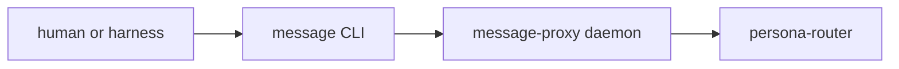

# Review Of Operator 113 - Engine Supervision Slice

Date: 2026-05-12
Role: designer-assistant
Subject: [reports/operator/113-persona-engine-supervision-slice-and-gaps.md](/home/li/primary/reports/operator/113-persona-engine-supervision-slice-and-gaps.md)

## Verdict

The operator report is accurate in its central claim. `persona-daemon` is no
longer only a manager request daemon when a launch plan is supplied. At
`persona` commit `980a902`, the daemon starts an `EngineSupervisor`, the
supervisor resolves commands, launches every first-stack component through
`DirectProcessLauncher`, and appends `ComponentSpawned` events through
`ManagerStore`.

This closes the first gap named in
[reports/designer-assistant/31-persona-engine-code-compendium.md](/home/li/primary/reports/designer-assistant/31-persona-engine-code-compendium.md):
the direct process launcher is now wired into the daemon launch-plan path. It
does not close readiness, socket ACL, restart, restore, or live component
contract paths.

## What Is Now Actually Hooked

Source confirms the operator's slice:

- [src/transport.rs](/git/github.com/LiGoldragon/persona/src/transport.rs:192)
  starts `ManagerStore`, `EngineManager`, then `start_supervisor(store)`.
- [src/transport.rs](/git/github.com/LiGoldragon/persona/src/transport.rs:213)
  starts `EngineSupervisor` when `PersonaLaunchPlan` is present and asks
  `StartFirstStack` before daemon readiness is printed.
- [src/supervisor.rs](/git/github.com/LiGoldragon/persona/src/supervisor.rs:22)
  is a real data-bearing actor with layout, launch configuration, resolver,
  launcher, optional store, and counters.
- [src/supervisor.rs](/git/github.com/LiGoldragon/persona/src/supervisor.rs:52)
  prepares directories, resolves component commands, builds spawn envelopes,
  launches each component, and appends `ComponentSpawned`.
- [src/direct_process.rs](/git/github.com/LiGoldragon/persona/src/direct_process.rs:174)
  owns child process handles, process groups, launch/stop counters, and the
  spawn-envelope environment.
- [tests/daemon.rs](/git/github.com/LiGoldragon/persona/tests/daemon.rs:260)
  proves the live daemon path launches the first stack and records
  `ComponentSpawned` events in `manager.redb`.

The report's "not full engine witness yet" framing is correct.

## Main Architectural Feedback

### 1. Readiness Should Be Common, But Domain Unimplemented Must Stay Domain

The operator asks whether the manager should learn every component-specific
status contract or whether a small common engine-lifecycle relation should
exist for every first-stack daemon.

My recommendation: use a narrow common supervision/readiness relation, but do
not let it become a generic component command bus.

The common relation should carry only manager-level lifecycle facts:

- component hello / identity;
- readiness;
- health;
- graceful stop readiness or drain state;
- supported supervision protocol version;
- maybe last fatal startup error.

It should not carry router messages, terminal input, mind work graph requests,
or harness deliveries. Those stay in the component's native `signal-persona-*`
contract.

The report's proposed "typed unfinished-operation reply" needs one more
distinction. A component returning `Unimplemented` for a valid domain request
belongs on that component's native contract. A manager readiness probe can
prove the component is alive, but it cannot prove every domain contract variant
is decoded unless the witness also sends native-contract probes. Otherwise the
common lifecycle relation becomes a shortcut that lets domain contracts rot.

Practical split:

| Need | Best home |
|---|---|
| "Is this process the expected component and ready for engine supervision?" | Common supervision/readiness relation. |
| "Does `persona-harness` decode `MessageDelivery` and return typed unimplemented?" | `signal-persona-harness` daemon boundary. |
| "Does `persona-terminal` decode gate/injection/worker lifecycle variants?" | `signal-persona-terminal` daemon boundary. |
| "Can the manager log the observation?" | Manager event log, after the witness or supervisor observes it. |

This keeps manager readiness simple while preserving perfect specificity at
component boundaries.

### 2. Keep `MessageProxy`, But Make It Real

The operator correctly identifies a contradiction: `persona-message` is
currently a stateless CLI proxy, while the first stack includes
`MessageProxy` as a supervised component.

My recommendation: keep `MessageProxy` as a supervised engine component and
make it a real long-lived boundary daemon in the `persona-message` repo.

Reason: the message-proxy socket is the special user-writable boundary where
untrusted owner/user input crosses into the trusted engine. If that socket is
owned directly by router, router becomes both the public ingress boundary and
the internal routing component. That collapses a useful trust boundary.

The clean shape is:

The CLI can remain thin. The daemon should own the user-facing socket, validate
one NOTA or Signal message request, stamp or forward boundary context as
designed, and send `signal-persona-message` to router over the internal
router socket. The current `persona-message` code is already close to being
the client side of that relation; it needs a daemon half rather than removal
from the stack.

If this is accepted, the code naming should converge:

- `EngineComponent::MessageProxy` is right.
- Socket file `message-proxy.sock` is right.
- Environment variable `PERSONA_MESSAGE_PROXY_EXECUTABLE` is right.
- `as_component_name()` returning `"persona-message"` is only acceptable if
  the repo owns both CLI and proxy daemon; otherwise name the component
  `"persona-message-proxy"` in status output.

### 3. Socket Mode Rule: Child Applies, Manager Verifies

The operator's recommended narrow path is correct: component binds and applies
the mode from the spawn envelope; manager verifies metadata before
`ComponentReady`.

Do not try to have the manager chmod before bind. The socket file does not
exist yet. Passing a pre-bound file descriptor or using systemd socket
activation may become useful later, but it is too much machinery for the next
slice.

The witness should fail if:

- the child never creates the socket;
- the path exists but is not a socket;
- the mode differs from the spawn envelope;
- an internal component socket is not `0600`;
- the message-proxy boundary is not the configured writable exception;
- the socket is outside the EngineId-scoped run directory.

Owner/group verification can be added when the privileged `persona` system
user deployment is in place. For now, mode/type/path are enough for the next
testable slice.

### 4. Beware Split-Brain Manager State

The report says `ManagerStore` persists engine records and events, while
`EngineManager` still starts from the default catalog. That is true, but the
new supervision slice adds another split:

- `EngineManager` owns desired state and health/status replies to the CLI.
- `EngineSupervisor` owns process launch/stop observations.
- `ManagerStore` owns both reduced records and append-only events.

Today, a component can be spawned and logged as `ComponentSpawned` while
`EngineManager` still reports only the default `Starting` health. That is
expected in this slice, but the next architecture step should name the reducer
that reconciles manager events and engine status.

Recommended first rule:

1. On daemon startup, load the latest `StoredEngineRecord` for the default
   engine if present; otherwise use the default catalog.
2. Treat `manager.engine-records` as the reduced snapshot for CLI status.
3. Treat `manager.engine-events` as append-only audit and future replay input.
4. When `EngineSupervisor` appends `ComponentReady`, also send a typed update
   to the engine-status reducer so CLI status and event log do not diverge.

Event replay can wait. Snapshot restore should land first.

### 5. Restart Should Wait, Exit Observation Should Not

The operator is right that restart policy should not be first. But the launcher
can still grow exit observation before restart policy if the event is carefully
classified.

Minimal next shape:

- `StopFirstStack` marks components as expected-stopping before signaling them.
- child wait loop emits `ComponentExited { expected: true/false, exit_code }`
  or an equivalent closed distinction;
- no restart is scheduled yet.

Then restart policy can be added after readiness and exit observation are both
real. This avoids designing backoff in the dark while still preventing silent
child death.

## Suggested Decisions For The User

### Decision A: Readiness Contract Shape

Use a narrow common supervision/readiness relation for every first-stack daemon.
Keep domain `Unimplemented` probes on each native `signal-persona-*` contract.

Why this matters: the manager should not import every domain contract just to
know whether a component is ready, but a generic lifecycle contract must not
replace the domain contracts.

### Decision B: Message Proxy

Keep `MessageProxy` in the supervised first stack and implement a real
message-proxy daemon in `persona-message`.

Why this matters: the message-proxy socket is the one local boundary where
untrusted user input enters the trusted engine. If router owns that socket
directly, the router absorbs an ingress/security responsibility that belongs
at the boundary.

### Decision C: Socket Metadata

Let components bind and chmod/chgrp their sockets from the spawn envelope;
make the manager verify socket type, path, and mode before `ComponentReady`.

Why this matters: it is implementable now and still gives the manager an
observable correctness check before trusting the component boundary.

### Decision D: Restore Rule

Restore manager status from the latest `StoredEngineRecord` first; keep event
replay as a later stronger reducer.

Why this matters: it fixes daemon restart behavior without forcing a full
event-sourcing design before the engine can run.

## Bottom Line

Operator 113 is a good implementation slice. It moves the engine from
"manager-only daemon" to "daemon-started first-stack process supervisor
scaffold." The next clean implementation step is not restart policy; it is a
readiness boundary plus socket metadata verification, with `MessageProxy`
settled as a real daemon rather than a test-only fiction.
