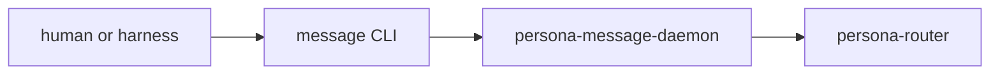

# Engine Prototype Naming And Supervision Corrections

Date: 2026-05-13  
Role: designer-assistant  
Inputs: latest user/designer exchange, latest user/operator exchange,
[reports/operator/113-persona-engine-supervision-slice-and-gaps.md](/home/li/primary/reports/operator/113-persona-engine-supervision-slice-and-gaps.md),
[reports/designer-assistant/32-review-operator-113-engine-supervision.md](/home/li/primary/reports/designer-assistant/32-review-operator-113-engine-supervision.md),
and
[reports/operator-assistant/108-signal-criome-foundation-self-review.md](/home/li/primary/reports/operator-assistant/108-signal-criome-foundation-self-review.md).

## 0. Bottom Line

The operator's prototype checklist is pointing at the right missing layers, but
two names must be corrected before the next implementation slice or the wrong
architecture will harden:

1. There must be no `signal-persona-supervision` repository. The common
   lifecycle/readiness relation belongs inside `signal-persona`, because it is
   the engine manager's wire surface. This has not landed as a separate repo
   yet; the drift is still preventable.
2. There is no `persona-message-proxy` component and no "proxy daemon." The
   supervised first-stack component is `persona-message`. If it needs a
   long-lived process, the binary is `persona-message-daemon`, and its role is
   message ingress / text boundary / Signal submission. The word "proxy" was a
   descriptive accident and should not be promoted into type, binary, socket, or
   event vocabulary.

The first drift is mostly in chat and planning language. The second drift is
already in code and architecture:

- `/git/github.com/LiGoldragon/signal-persona/src/lib.rs` has
  `ComponentKind::MessageProxy`.
- `/git/github.com/LiGoldragon/persona/src/engine.rs` has
  `EngineComponent::MessageProxy`, `message-proxy.sock`,
  `message-proxy.redb`, `message-proxy`, and
  `PERSONA_MESSAGE_PROXY_EXECUTABLE`.
- `/git/github.com/LiGoldragon/persona/ARCHITECTURE.md` names
  `message-proxy.sock`.
- `/git/github.com/LiGoldragon/persona-message/ARCHITECTURE.md` frames the repo
  as a "stateless router proxy" and says it builds no daemon.

The next operator slice should fix those names before adding readiness and
socket verification.

## 1. What Has And Has Not Happened

### No Separate Supervision Repo Exists

Local repository scan shows these relevant contract repos:

```text
signal-persona
signal-persona-auth
signal-persona-harness
signal-persona-message
signal-persona-mind
signal-persona-system
signal-persona-terminal
signal-persona-terminal-test
```

There is no `signal-persona-supervision` checkout. The operator's chat phrase
"probably signal-persona-supervision" has not become a repo yet.

That matters because the correction is cheap: update the next implementation
handoff to say:

> Add a second named relation inside `signal-persona` for component
> supervision/readiness. Do not create a new contract repo.

`skills/contract-repo.md` now permits one component-owned contract crate to
carry multiple named relations. `signal-persona` is exactly that case: it is
the engine manager contract crate, and supervision/readiness is an engine
manager relation.

### Proxy Naming Has Already Landed

The proxy vocabulary has landed in three places:

| Surface | Current shape | Correction |
|---|---|---|
| `signal-persona` component kind | `MessageProxy` | `Message` |
| `persona` engine component | `MessageProxy` | `Message` |
| socket file | `message-proxy.sock` | `message.sock` |
| state file | `message-proxy.redb` | `message.redb` only if this component actually owns durable state |
| environment variable | `PERSONA_MESSAGE_PROXY_EXECUTABLE` | `PERSONA_MESSAGE_EXECUTABLE` |
| supervised binary | implied proxy executable | `persona-message-daemon` |
| repo architecture | "stateless router proxy" | "message ingress/text-boundary component" |

The repo may still contain a `message` CLI. That is fine. The component can own
both:



The important point is that the daemon is not named as a proxy. It is the
message component's daemon surface.

## 2. Where The Readiness Relation Belongs

The common readiness relation belongs in `signal-persona`, but it should not be
folded into the existing manager-client request family as if clients and
children were the same endpoint.

Recommended contract shape:

```text
signal-persona
  src/lib.rs
  src/manager.rs       -- existing client -> persona-daemon relation
  src/supervision.rs   -- persona-daemon -> first-stack child relation
```

The supervision relation should have its own closed request/reply family, for
example:

```text
ComponentSupervisionRequest
  | ComponentHello(ComponentHelloQuery)
  | ComponentReadinessQuery(ComponentReadinessQuery)
  | ComponentHealthQuery(ComponentHealthQuery)
  | GracefulStopRequest(GracefulStopRequest)

ComponentSupervisionReply
  | ComponentHello(ComponentHello)
  | ComponentReady(ComponentReady)
  | ComponentNotReady(ComponentNotReady)
  | ComponentHealth(ComponentHealthReport)
  | GracefulStopAccepted(GracefulStopAcceptance)
  | GracefulStopRejected(GracefulStopRejection)
```

Load-bearing records:

- `SupervisionProtocolVersion` newtype.
- `ComponentHello`, carrying expected component kind/name, engine id, and
  supported supervision protocol version.
- `ComponentReady`, meaning the child accepted a supervision frame on its own
  socket and replied successfully after binding that socket.
- `ComponentHealthReport`, carrying only lifecycle health, not domain status.
- `GracefulStopRequest`, a manager lifecycle request, not a domain command.

The relation is intentionally small. It tells the manager whether the child
process is the expected component and whether the supervision boundary works. It
does not carry router messages, terminal input, harness delivery, prompt audit,
or domain `Unimplemented` replies.

## 3. Domain `Unimplemented` Probes Are Not Readiness

The operator's prototype list includes "domain unimplemented probes" and says
the manager can log them as observed `ComponentUnimplemented`.

That needs a sharper boundary.

Readiness proves:

```text
spawned process -> bound expected socket -> accepted supervision frame -> replied ready
```

Domain probes prove:

```text
component-specific Signal contract -> valid request variant -> typed unfinished reply
```

Those are different witnesses. The manager should not import every domain
contract and become a generic test bus. The better prototype shape is:

1. `persona-daemon` performs the common `signal-persona` supervision probe.
2. The Nix prototype witness, or a dedicated development witness tool, sends
   one native-contract probe to each component.
3. The witness asserts typed replies at the wire:
   `HarnessUnimplemented`, `TerminalUnimplemented`,
   `SystemUnimplemented`, and so on.
4. If a manager-visible log projection is wanted, record a typed
   `BoundaryProbeObserved` development event only from the witness path. Do not
   make domain `Unimplemented` a core lifecycle event unless the manager is the
   actor that actually sent and observed the domain request.

This preserves the user's useful development idea: every daemon skeleton can
reply honestly with typed unfinished-state records. It also preserves the
architecture: the engine manager's durable event log is for manager facts such
as `ComponentSpawned`, `ComponentReady`, `ComponentExited`, and
`EngineStateChanged`.

## 4. The Two Reducers Need Names

The designer's addendum is right that "manager restore" is not the whole issue.
There are two reduced views entangled today:

| Reducer | Input facts | Output |
|---|---|---|
| Engine lifecycle reducer | `ComponentSpawned`, `ComponentReady`, `ComponentExited`, `ComponentStopped` | lifecycle state such as `Planned`, `Launched`, `Ready`, `Exited`, `Stopped` |
| Engine status reducer | lifecycle state plus desired state and health facts | manager CLI status: desired state, health, and phase |

The next slice should not treat `ManagerStore` as just an append-only event
file. The event log is audit. The reduced engine record is the manager's live
view.

Prototype rule:

1. `ComponentSpawned` transitions the lifecycle reducer to `Launched`.
2. `ComponentReady` transitions lifecycle to `Ready` and status health to
   `Running`.
3. `ComponentExited { expected, code }` transitions lifecycle to `Exited` and
   status health to `Stopped` or `Failed`.
4. On daemon startup, load the latest reduced `StoredEngineRecord` first.
5. Event replay can come later, after the first prototype has a stable event
   vocabulary.

This is the missing bridge between "supervisor wrote an event" and "`persona
status` shows the truth."

## 5. Revised Prototype Checklist

Using the user's corrections, the working-prototype checklist becomes:

1. Add the supervision/readiness relation to `signal-persona`; do not create
   `signal-persona-supervision`.
2. Rename first-stack message vocabulary from `MessageProxy` to `Message` in
   `signal-persona`, `persona`, and architecture docs.
3. Make every first-stack daemon answer the `signal-persona` supervision
   relation:
   `persona-mind`, `persona-router`, `persona-system`, `persona-harness`,
   `persona-terminal`, and `persona-message`.
4. Give `persona-message` a real daemon surface if it remains in the supervised
   first stack. Name the binary `persona-message-daemon`; keep the `message`
   CLI as a thin client.
5. Have each child bind its own socket from the spawn envelope and apply the
   requested mode. Have the manager verify socket type, path, and mode before
   recording `ComponentReady`.
6. Implement the engine lifecycle reducer and engine status reducer so manager
   events and CLI status cannot diverge.
7. Restore the latest reduced `StoredEngineRecord` on daemon startup. Treat
   event replay as later strengthening.
8. Add native-contract skeleton probes as Nix witnesses, not as a generic
   manager command bus.
9. Add child-exit observation before restart policy:
   `ComponentExited { expected, code }` is enough for the prototype.
10. Build one Nix prototype runner that starts real Nix-built component
    binaries and proves live daemon-to-daemon sockets, not in-process memory.

Still out of prototype scope:

- restart backoff policy;
- production `persona` system-user deployment;
- systemd transient-unit backend;
- Criome/BLS integration;
- multi-engine routing;
- cross-host authentication.

## 6. Architecture Documents To Update

### `/git/github.com/LiGoldragon/signal-persona/ARCHITECTURE.md`

Required edits:

- Add a second named relation: manager-to-component supervision/readiness.
- State explicitly that this relation lives in `signal-persona`; no sibling
  `signal-persona-supervision` repo.
- Rename `ComponentKind::MessageProxy` to `ComponentKind::Message`.
- Update the witness table entry "Message proxy is named as a closed component
  kind" to the corrected message component wording.

### `/git/github.com/LiGoldragon/signal-persona/src/lib.rs`

Required implementation consequence:

- Rename `MessageProxy` to `Message`.
- Add supervision relation types in a separate module or section rather than
  overloading the existing manager-client request/reply family.

### `/git/github.com/LiGoldragon/persona/ARCHITECTURE.md`

Required edits:

- First stack is:
  `persona-mind`, `persona-router`, `persona-system`, `persona-harness`,
  `persona-terminal`, `persona-message`.
- Socket set uses `message.sock`, not `message-proxy.sock`.
- State file naming uses `message.redb` only if the message component has real
  state; otherwise the spawn envelope can carry a state path without promising a
  message ledger.
- Add the two reducers by name: engine lifecycle reducer and engine status
  reducer.
- Clarify that `ComponentReady` comes from the common `signal-persona`
  supervision relation plus socket metadata verification.

### `/git/github.com/LiGoldragon/persona/src/engine.rs`

Required implementation consequence:

- Rename `EngineComponent::MessageProxy` to `EngineComponent::Message`.
- Rename `message-proxy.sock`, `message-proxy.redb`,
  `PERSONA_MESSAGE_PROXY_EXECUTABLE`, and the internal string
  `message-proxy` to message-shaped names.
- Keep `as_component_name()` returning `persona-message`.

### `/git/github.com/LiGoldragon/persona-message/ARCHITECTURE.md`

Required edits:

- Stop describing the repo as a "stateless router proxy."
- State that `persona-message` owns the message CLI and, if supervised in the
  first stack, `persona-message-daemon`.
- Preserve the important negative facts: no local message ledger, no local
  actor index, no in-band proof material, no final routing policy.
- Replace proxy-named tests such as `message-proxy-cannot-own-local-ledger`
  with message-boundary names when the daemon rename lands.

### Older designer reports

Designer reports that still say `message-proxy` can remain historical if their
status banners point readers at the canonical current architecture. The current
architecture files must not keep the proxy vocabulary.

## 7. Operator-Assistant 108 In This Light

[reports/operator-assistant/108-signal-criome-foundation-self-review.md](/home/li/primary/reports/operator-assistant/108-signal-criome-foundation-self-review.md)
is mostly aligned with the current architecture:

- It keeps `signal-criome` as a pure contract crate.
- It says "Criome verifies; Persona decides."
- It avoids `AuthProof` and local in-band authority gates.
- It admits the weakness that the crate is broad vocabulary without real BLS
  signing/verification pressure yet.

The important connection to this report is negative: `signal-criome` does not
belong in the engine readiness path. The local prototype should not wait for
Criome, and the `signal-persona` supervision relation should not import Criome
proof vocabulary.

Immediate Criome follow-up remains what operator-assistant 108 says:

- implement the real `criome` daemon;
- exercise `blst` with a deterministic sign/verify/revoke witness;
- keep `SignedPersonaRequest` under scrutiny so it stays a signed content
  envelope, not Persona policy.

That is separate from the first-stack prototype. Local engine trust remains
filesystem ACLs, socket modes, spawn envelopes, and manager-observed readiness.

## 8. Replacement For My Report 32 Decision B

My previous report
[reports/designer-assistant/32-review-operator-113-engine-supervision.md](/home/li/primary/reports/designer-assistant/32-review-operator-113-engine-supervision.md)
recommended "keep `MessageProxy`." That recommendation is now superseded.

Corrected recommendation:

> Keep `persona-message` in the supervised first stack if the architecture needs
> a message ingress boundary, but name it `Message` / `persona-message` /
> `persona-message-daemon`, not `MessageProxy` or
> `persona-message-proxy-daemon`.

The architectural reason I was reaching for remains valid: the user-writable
message boundary should not be collapsed into router. The name I used was
wrong.

## 9. Bottom-Line Hand-Off

The next operator implementation should start by removing the two naming traps:

1. Put the common lifecycle/readiness relation in `signal-persona`, as a named
   second relation under the engine manager contract crate.
2. Rename the message first-stack component away from proxy vocabulary before
   tests and Nix runners make that vocabulary expensive to remove.

After that, the clean implementation order is readiness relation, component
readiness skeletons, socket metadata verification, reducers, restore, exit
observation, and one live message path.
