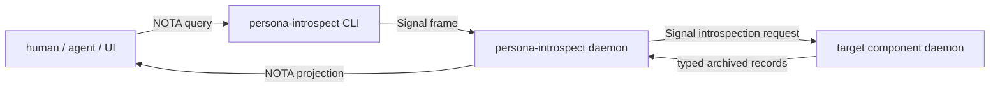

# 37 - Signal, Nexus, and Introspection Survey

*Designer-assistant report. Scope: interpret the user's Signal/Nexus
format rule, survey current Persona engine code and contracts for
inspectable state, and recommend how a future `persona-introspect`
component and introspection contract family should fit without
breaking component ownership.*

---

## 0. Position

The user's format split is correct and already matches the strongest
parts of the current architecture:

- **Signal** is the engine's Rust-to-Rust binary discipline:
  length-prefixed rkyv archives over process boundaries, with typed
  records owned by `signal-*` contract crates.
- **Nexus** is semantic content written in NOTA syntax. It belongs at
  ingress, egress, CLI, UI, report, and inspection edges.
- **Sema/redb state** should be rkyv-archived typed records. It is
  Signal-compatible, but not literally a Signal frame unless the table
  is recording frames. The shared truth is the typed archived record,
  not a text projection.
- **Logs** that the engine re-reads are typed binary records in a
  component-owned Sema database. NOTA log output is a view.

The new design pressure is not the Signal/Nexus rule itself. That rule
is already in `skills/rust/storage-and-wire.md` and
`persona/ARCHITECTURE.md`. The new pressure is:

> Every durable or externally inspectable component state record should
> have a contract-owned typed home, even when no operational peer
> consumes it yet.

That is a small but important evolution of the current contract skill.
The existing skill says contract repos do not own component-internal
state. That should remain true for runtime ownership and logic. It
should be refined for durable record shapes: contracts can own the
typed vocabulary of inspectable state without owning the component's
database, reducers, actors, or policy.

---

## 1. The Format Doctrine

### 1.1 Inside the engine

Internal component communication is Signal:

```text
component runtime -> typed record -> rkyv archive -> Signal frame -> peer
```

Components should not send NOTA/Nexus to each other. A CLI may accept
NOTA, but the daemon path lowers it into typed Signal records before it
enters the engine. A UI may display NOTA, but the engine's durable
truth stays typed and binary.

Text inside a typed payload is not automatically a violation. For
example, a user message body may be text carried by a Signal record.
The violation would be using NOTA text itself as the daemon-to-daemon
protocol, or storing a line log and reparsing it as state.

### 1.2 On disk

Component state belongs in that component's Sema/redb file:

```text
component actor -> component Sema table -> rkyv-archived typed record
```

That record should be either:

- an existing operational contract type, if the record crosses a live
  component boundary, or
- an introspection contract type, if the record is durable and
  inspectable but not part of an operational channel.

Runtime-only helper types do not need contract homes. The trigger is
durability or external inspection:

| Type use | Contract home required? |
|---|---|
| Private in-memory helper inside one actor | No |
| Actor message used only in-process | No, unless it is persisted or exposed |
| Sema table value | Yes |
| Engine event / audit event | Yes |
| Trace or status record that can be queried from another process | Yes |
| CLI-only NOTA wrapper around a typed record | Usually no; projection policy stays at the edge |

### 1.3 At the edge

Nexus/NOTA belongs here:

```text
human / agent / UI -> NOTA -> CLI or edge daemon -> typed Signal record
typed Signal reply -> projection policy -> NOTA -> human / agent / UI
```

`persona-message` is the clearest example: its CLI accepts one NOTA
record and prints one NOTA reply, while `persona-message-daemon`
forwards typed `signal-persona-message` frames to `persona-router`.

---

## 2. `persona-introspect`

The clean component shape is a high-privilege read/projection component:



The important constraint: `persona-introspect` should not become a
second owner of every component database. Live introspection should ask
the component daemon through a Signal relation. The component owns:

- which tables exist;
- how to read a consistent snapshot;
- which records are safe to expose;
- how to sequence live subscriptions;
- redaction rules for sensitive fields.

`persona-introspect` owns:

- cross-component inspection requests;
- fan-in from multiple component introspection relations;
- NOTA/Nexus projection for humans, agents, and UIs;
- later, authorization checks for who may inspect which state.

Direct redb reading can exist later as an offline artifact/debug tool,
but it should not be the live engine architecture. Live peeking would
bypass the actor/store boundary and recreate a shared database in
disguise.

### Security posture

Development mode can be transparent. The future shape still needs a
typed denial surface:

- secret material, private keys, tokens, and raw credentials should not
  implement normal introspection projection;
- raw terminal transcript ranges should require explicit request
  records and be audited;
- redaction should be a typed projection decision, not an ad hoc string
  scrub.

This keeps `persona-introspect` powerful without making every component
leak everything by default.

---

## 3. Contract Placement

There are three plausible contract layers. The report recommends using
all three, but for different jobs.

### 3.1 Existing operational contracts

If the record already belongs to an operational relation, keep it in
the existing `signal-persona-*` contract.

Examples:

- component readiness, health, and `SpawnEnvelope`: `signal-persona`;
- message ingress and stamped message provenance:
  `signal-persona-message`;
- terminal input gates, prompt state, worker observation:
  `signal-persona-terminal`;
- focus observation: `signal-persona-system`;
- work graph and activity records: `signal-persona-mind`.

Do not create a second introspection copy of these. The same typed
record can be projected by `persona-introspect`.

### 3.2 Component-specific introspection contracts

If a component has durable internal state that should be inspectable but
is not part of an operational relation, give it a component-specific
introspection contract.

Recommended naming, aligned with the existing repo family:

| Component | Candidate contract |
|---|---|
| persona manager | `signal-persona-introspect` or existing `signal-persona` if the record is manager catalog state |
| router | `signal-persona-router-introspect` |
| terminal | `signal-persona-terminal-introspect` |
| harness | `signal-persona-harness-introspect` |
| system | `signal-persona-system-introspect` |
| message | likely no separate crate until it has durable inspectable state |

I would avoid bare names like `signal-introspect-router`. The active
Persona contract namespace is `signal-persona-*`; dropping `persona`
makes the component under-specified and invites cross-project buckets.

### 3.3 Central introspection contract

If `persona-introspect` has its own daemon socket, it needs its own
wire surface:

```text
signal-persona-introspect
  IntrospectionRequest
  IntrospectionReply
  IntrospectionSubscription
  IntrospectionEvent
  IntrospectionProjection
```

This crate should own query/projection envelopes, selectors, cursors,
subscription handles, and reply framing. It should not own every
component's domain records. Those stay in existing operational
contracts or component-specific introspection contracts.

Clean rule:

> `signal-persona-introspect` asks for and wraps observations.
> Component contracts define the observations.

---

## 4. Current Landscape

### 4.1 Manager / `persona`

Strong candidate for contract migration:

- `StoredEngineRecord`
- `EngineEvent`
- `EngineEventSequence`
- `EngineEventSource`
- `EngineEventBody`
- component lifecycle/restart/exit/unimplemented event payloads
- NOTA projection records in `schema.rs`

These are manager catalog facts. Because `signal-persona` is already
the engine-manager contract, the likely home is `signal-persona`, not a
new sibling, unless the manager event-log vocabulary becomes too large
for operational clients. The NOTA report records in `schema.rs` are
projection policy and can stay in `persona` or move under
`persona-introspect` later.

### 4.2 Router

Strong candidate for `signal-persona-router-introspect`:

- `StoredChannelRecord`
- `StoredChannelIndex`
- `StoredAdjudicationRequest`
- `StoredDeliveryAttempt`
- `StoredDeliveryResult`
- router trace/status records
- channel decision snapshots

The operational channel grant/adjudication vocabulary belongs in
`signal-persona-mind` or the relevant operational contract. Router
table readouts, reducer snapshots, delivery trace, and queue
inspection are introspection state.

One warning: `persona-router/src/message.rs` has local rkyv/NOTA
message-like types (`ActorId`, `MessageId`, `ThreadId`, `Attachment`,
`Message`). These look transitional. If the signal contracts now cover
the intended model, retire these instead of promoting them into a new
introspection contract.

### 4.3 Mind

Lowest pressure for a new introspection crate. `signal-persona-mind`
already owns rich observable vocabulary:

- role observations and snapshots;
- activity log query records;
- work graph and event records;
- item/note/edge/event projections.

Local storage wrappers like `StoredClaim`, `StoredActivity`, and
`MemoryGraph` are mostly implementation wrappers around contract-owned
records. `MemoryGraph` can remain local if only the derived event/view
records are exposed.

### 4.4 Message

Low pressure. `persona-message` is intended to be stateless:

- CLI NOTA input/output records are edge projection;
- daemon transport wrappers are runtime code;
- no local message ledger should exist.

Only daemon health, socket status, and forwarded-count style facts
would be introspection candidates, and those may fit existing
supervision/status surfaces.

### 4.5 Terminal and terminal-cell

Highest pressure. `persona-terminal` already has durable local Sema
records that are explicitly inspectable:

- `StoredTerminalSession`
- `TerminalSessionState`
- `StoredDeliveryAttempt`
- `DeliveryAttemptState`
- `StoredTerminalEvent`
- `StoredViewerAttachment`
- `ViewerAttachmentState`
- `StoredSessionHealth`
- `StoredSessionArchive`
- `SessionArchiveState`

It also owns runtime gate and prompt state:

- prompt pattern registry;
- input-gate leases;
- prompt cleanliness;
- injection sequence and decision state;
- session health and worker lifecycle.

`terminal-cell` has rich runtime truth:

- transcript deltas and snapshots;
- terminal sequence;
- worker lifecycle observations;
- input gate leases and cached human bytes;
- active viewer state;
- screen projections.

The Persona-facing owner should still be `persona-terminal`. The
introspection surface should project terminal-cell facts through
`persona-terminal`, not make every Persona component talk to
terminal-cell directly.

Special case: raw terminal transcript bytes are inspectable, but they
are not the same thing as engine logs. The typed introspection record
should carry sequence ranges, provenance, and permissions. The raw
bytes can stay raw bytes; NOTA projection is for display windows,
summaries, or selected escaped ranges.

### 4.6 Harness

Moderate pressure:

- harness lifecycle and state snapshots;
- identity projection state (`Full`, `Redacted`, `Hidden`);
- transcript counters and transcript event summaries;
- terminal binding and delivery receipts.

Operational delivery records belong in `signal-persona-harness` or
`signal-persona-terminal`. Read-path identity, lifecycle snapshots,
and adapter statistics can become harness introspection records.

### 4.7 System

Small but real pressure:

- `SystemState` and served-request counts;
- focus tracker statistics;
- backend health;
- Niri event decode status.

Focus observations already belong in `signal-persona-system`. Backend
adapter internals should not leak as generic system events unless
needed. If exposed, they should be explicitly system introspection
records, not router or terminal records.

---

## 5. Complexity

The design is plausible. Complexity is medium, not extreme.

The main costs:

- `persona-introspect` will depend on many contract crates and will
  recompile when they change. That is acceptable for a high-privilege
  inspection component.
- Sibling introspection contracts can multiply quickly. Add them only
  when durable inspectable state is real and too large or too separate
  for the existing operational contract.
- Projection must not become a second schema. The NOTA output should be
  generated from typed records, not maintained as independent text
  structs unless those structs are clearly edge wrappers.
- Live introspection needs push-shaped subscriptions for changing
  state. Avoid polling component databases or repeatedly asking for
  snapshots on a timer.

The compensating benefit is large: every component becomes observable
without violating ownership, and the engine can inspect itself without
turning NOTA into an internal protocol.

---

## 6. Recommended Architecture Rule

Add this rule to the architecture/skills after review:

> Nexus/NOTA is the edge text projection for ingress, egress, and
> inspection. Signal/rkyv is the engine's internal wire. Sema/redb
> stores rkyv-archived typed records. Every durable Sema value that can
> be inspected outside its component has a contract-owned record shape:
> operational contract when it crosses a live boundary, introspection
> contract when it exists only so the component can explain its own
> state. Runtime ownership stays in the component; `persona-introspect`
> asks components for typed observations and renders NOTA views.

This rule preserves the existing contract-repo discipline while adding
the missing introspection path.

---

## 7. Suggested Landing Order

1. Update `skills/rust/storage-and-wire.md` to name the clarified
   Signal/Nexus/Sema split explicitly. Most of the content is already
   there; the new phrase is "Sema values are Signal-compatible
   archived records, not text and not necessarily IPC frames."
2. Update `skills/contract-repo.md` to allow contract-owned
   introspection record shapes for durable inspectable state while
   still forbidding contracts from owning daemon logic or redb access.
3. Add a short `persona/ARCHITECTURE.md` section for
   `persona-introspect`: high-privilege read/projection component,
   live queries through component daemons, NOTA at the edge.
4. Start with terminal, because `persona-terminal` has the largest
   current gap between durable local Sema records and contract-owned
   inspectable vocabulary.
5. Move manager event-log records into `signal-persona` or a named
   manager introspection relation before expanding NOTA log views.
6. Treat router trace/table readouts as the second introspection slice.

---

## 8. Open Decisions

### Decision 1: same contract or sibling contract?

When a component has introspection-only state, should its records live
inside the existing `signal-persona-<component>` crate under an
`introspection` module, or in a sibling
`signal-persona-<component>-introspect` crate?

Recommendation: start inside the existing component contract when the
records are small and closely related to existing status/events. Split
to a sibling crate when the records are heavy, high churn, or not
needed by normal operational clients.

### Decision 2: live only or offline too?

Should `persona-introspect` be live-daemon-only at first, or should it
also open offline redb snapshots?

Recommendation: live first. Offline readers are useful for crash
artifacts and tests, but live architecture should preserve component
ownership by asking daemons through Signal.

### Decision 3: component name

The component can be called `persona-introspect` at the repo/binary
surface, with a `PersonaIntrospector` root actor inside. That gives the
human command a clean verb while keeping the state-bearing actor as a
noun.

### Decision 4: secret projection

Do secret-bearing types need a marker trait, a closed redaction enum, or
an explicit "not introspectable" absence from the contract?

Recommendation: do not solve this before the first transparent
development version. For the first production-minded pass, make
redaction explicit in the projection relation rather than relying on
field-name conventions.

