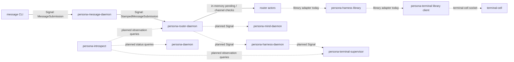

# Persona Engine Analysis - 2026-05-13

Role: designer-assistant  
Scope: current code and current architecture for the Persona engine, with a
pass over today's implementation progress and gaps not fully covered in the
recent reports.

## 0. Current-State Summary

The engine is now clearly shaped as:

```text
persona-daemon
  supervises seven prototype components:
    persona-mind
    persona-router
    persona-system
    persona-harness
    persona-terminal
    persona-message
    persona-introspect

  operational delivery path remains six components:
    persona-message -> persona-router -> persona-mind/persona-harness
    -> persona-terminal -> terminal-cell -> harness process

  inspection plane:
    persona-introspect -> component-owned observation contracts
```

The code has made real progress today. The `persona` repo now includes
`Introspect` in `EngineComponent::prototype_supervised_components()`;
`signal-persona` and `signal-persona-auth` both know the introspect component;
`persona-message-daemon` exists and forwards stamped message submissions to
router; `persona-router` now rejects unstamped ingress; `persona-terminal` has
terminal-owned introspection records; `signal-persona-router` and
`signal-persona-introspect` exist; and `persona-introspect` has a Kameo
scaffold.

The engine is still not a full working prototype. The most important gap is
that the manager can spawn the seven binaries and append `ComponentSpawned`
events, but it does not yet prove component readiness over the common
`signal-persona` supervision relation, does not verify socket metadata, and
does not reduce lifecycle/status into the two snapshots named in
`/git/github.com/LiGoldragon/persona/ARCHITECTURE.md`.

The second important gap is that the live message path is only partly a
daemon-to-daemon engine path. `persona-message-daemon` can stamp and forward
to `persona-router`, and router can commit/park messages in memory. But router
currently uses `persona-harness` as a library adapter for delivery; it does
not deliver through `persona-harness-daemon` over `signal-persona-harness`.
The harness daemon itself returns typed unimplemented for `MessageDelivery`.

The third important gap is introspection. The architecture is right to include
`persona-introspect` in the prototype, but the current daemon is not live yet:
`persona-introspect-daemon` prints a scaffold line and exits, and the CLI's
`PrototypeWitness` path returns `Unknown` for manager/router/terminal/delivery
without querying any component socket.

## 1. Progress Made Today

These are code-level changes visible from repository heads, not just report
claims.

| Area | Current code fact |
|---|---|
| Prototype component closure | `/git/github.com/LiGoldragon/persona/src/engine.rs` has seven prototype-supervised components and six operational delivery components. `Introspect` has socket/state/executable/env mappings. |
| Engine launch | `/git/github.com/LiGoldragon/persona/src/supervisor.rs` starts all seven prototype-supervised components through `DirectProcessLauncher` and appends `ComponentSpawned` to manager store. |
| Spawn environment | `/git/github.com/LiGoldragon/persona/src/direct_process.rs` passes `PERSONA_ENGINE_ID`, `PERSONA_COMPONENT`, `PERSONA_STATE_PATH`, `PERSONA_SOCKET_PATH`, `PERSONA_SOCKET_MODE`, and peer socket env vars. |
| Signal management contract | `/git/github.com/LiGoldragon/signal-persona/src/lib.rs` has `ComponentKind::Introspect`, `SpawnEnvelope`, and a separate `supervision` root family. |
| Auth contract | `/git/github.com/LiGoldragon/signal-persona-auth/src/names.rs` has `ComponentName::Introspect`; `MessageOrigin` remains provenance, not authority. |
| Message ingress | `/git/github.com/LiGoldragon/persona-message/src/daemon.rs` implements a long-lived `persona-message-daemon` that reads `SO_PEERCRED`, stamps `MessageOrigin`, and forwards `StampedMessageSubmission` to router. |
| Router ingress | `/git/github.com/LiGoldragon/persona-router/src/router.rs` rejects raw `MessageSubmission` at router, accepts `StampedMessageSubmission`, creates a message slot, and attempts pending delivery/adjudication. |
| Terminal introspection vocabulary | `/git/github.com/LiGoldragon/signal-persona-terminal/src/introspection.rs` defines terminal-owned inspectable records, and `/git/github.com/LiGoldragon/persona-terminal/src/tables.rs` stores those records. |
| Introspection envelope | `/git/github.com/LiGoldragon/signal-persona-introspect/src/lib.rs` defines central query/reply envelopes without owning component row types. |
| Router observation contract | `/git/github.com/LiGoldragon/signal-persona-router/src/lib.rs` defines summary, message trace, and channel state observation queries. |
| Criome substrate | `/git/github.com/LiGoldragon/criome` is a Kameo daemon skeleton over `signal-criome`; it owns identity, revocation, and attestation tables, but the BLS signature is still a placeholder string and verification intentionally returns `InvalidSignature` after registry checks. |

## 2. What Recent Reports Do Not Fully Cover

Recent reports correctly captured the high-level direction, especially
`reports/designer/146-introspection-component-and-contract-layer.md`,
`reports/operator/114-persona-introspect-prototype-impact-survey.md`, and
`reports/operator-assistant/110-engine-wide-architecture-implementation-gap-assessment.md`.
The code pass found several extra implementation facts that should be brought
forward:

1. `signal-persona-mind` architecture claims code that is not present.
   `/git/github.com/LiGoldragon/signal-persona-mind/ARCHITECTURE.md` says
   `ChannelMessageKind` includes `MessageIngressSubmission` and `MindReply`
   includes `MindRequestUnimplemented`. `/git/github.com/LiGoldragon/signal-persona-mind/src/lib.rs`
   has neither. It still has `ChannelMessageKind::MessageSubmission` and no
   unimplemented reply variant.

2. Socket-mode enforcement is mostly not implemented. The manager passes
   `PERSONA_SOCKET_MODE`, but the inspected daemons bind sockets and do not
   apply `chmod`/permissions afterward: `persona-message`, `persona-router`,
   `persona-system`, `persona-harness`, `persona-terminal-supervisor`, and
   `criome` all need the same treatment. `terminal-cell` documents 0600
   control socket mode, but production enforcement should be witnessed
   through the component path too.

3. Common supervision is contract-only in most runtime daemons. Architecture
   sections say components answer `signal-persona::SupervisionRequest`, but
   inspected daemon code accepts only domain-specific contracts:
   `signal-persona-message`, `signal-persona-system`,
   `signal-persona-harness`, `signal-persona-terminal`, or `signal-criome`.
   `persona-introspect-daemon` does not bind its socket yet.

4. The manager emits launch events but does not observe child readiness. A
   process that binds no socket can still be counted as spawned. There is no
   `ComponentReady` event emitted from a real supervision round trip yet.

5. `persona-message-daemon` stamps `Owner` by comparing peer uid to the
   daemon's effective uid. That is correct only when the message client and
   daemon run as the same user. In the planned dedicated `persona` user model,
   the human owner connects over a group-writable `message.sock`, so owner uid
   needs to come from the manager spawn context/config, not `geteuid()` inside
   the daemon.

6. `persona/ARCHITECTURE.md` has absorbed introspect in §0.6, but §1.5's
   resource table still lists per-engine component sockets as
   `{mind,router,system,harness,terminal,message}.sock`, omitting
   `introspect.sock`. The code already creates `introspect.sock`.

7. `ComponentOperation` in `/git/github.com/LiGoldragon/persona/src/engine_event.rs`
   has no introspect operation family. That is not a compile blocker today,
   but it will matter once the manager logs
   `ComponentUnimplemented`/readiness facts for introspect.

8. `signal-persona-router` uses `Unknown` in observation status enums. That is
   acceptable as scaffold, but it should not become the durable substitute for
   named states once router trace rows are live.

## 3. Hooked Versus Planned



Solid arrows are hooked through runtime code. Dotted arrows are either
planned, scaffolded, or currently implemented through a library shortcut
rather than the intended daemon boundary.

## 4. Channel Ledger

| Channel | Contract / transport | Authority minted by | State effect | Status |
|---|---|---|---|---|
| CLI -> `persona-daemon` | `signal-persona::EngineRequest` over Unix socket | Client supplies request; manager owns status reply | `EngineManager` mutates desired state and persists `StoredEngineRecord` on startup/shutdown requests | Hooked for status/start/stop; not wired to common supervision readiness |
| `persona-daemon` -> child processes | Env vars from `ComponentSpawnEnvelope` over process spawn | Manager mints engine id, component, socket path, socket mode, peer socket list | Child receives environment; manager appends `ComponentSpawned` | Hooked, but local env struct is not the typed `signal-persona::SpawnEnvelope` wire record |
| Manager -> component readiness | `signal-persona::supervision::{SupervisionRequest, SupervisionReply}` | Manager asks; component replies with identity/ready/health | Should update lifecycle/status reducers | Contract-only in inspected daemon code |
| `message` CLI -> `persona-message-daemon` | `signal-persona-message::MessageRequest` over `message.sock` | Daemon mints `MessageOrigin` and timestamp | No local durable state yet; forwards or typed-unimplemented | Hooked |
| `persona-message-daemon` -> router | Same `signal-persona-message` root, relation-specific legality | Message daemon stamps origin/time; router mints `MessageSlot` | Router in-memory pending/trace; some delivery/channel tables | Hooked |
| Router -> mind adjudication | `signal-persona-mind::AdjudicationRequest` / channel ops | Router mints adjudication id; mind should decide | Router should park and later release/deny | Contract partially exists; router currently records outbox/adjudication locally but no live mind daemon wire |
| Router -> harness delivery | Intended `signal-persona-harness::MessageDelivery` over `harness.sock` | Router mints slot/sender/delivery attempt | Harness should accept or fail delivery | Not hooked as daemon path; router calls `persona-harness` library adapter |
| Harness -> terminal | Intended `signal-persona-terminal` through terminal supervisor | Harness owns harness semantics; terminal owns gate/injection | Terminal session/delivery/event records | Partly hooked through `persona-harness` library using `persona-terminal::contract::TerminalTransportBinding` |
| Persona-terminal -> terminal-cell | `signal-persona-terminal` control frames plus raw attach byte plane | Terminal owns prompt patterns, gate leases, session registry; terminal-cell owns PTY writer | `terminal.redb` records and terminal-cell transcript/worker state | Hooked for terminal supervisor/session registry/control frames; not yet reached from full engine delivery path |
| `persona-introspect` -> components | `signal-persona-introspect` query envelope plus component-owned observation contracts | Introspect asks; components own observed rows | Should not mutate state except observation counters | Scaffold only; CLI returns `Unknown`, daemon does not bind a live socket |
| `criome` clients -> criome | `signal-criome` over Unix socket | Criome store mints attestation slots and timestamps | `criome.redb` identity/revocation/attestation tables | Hooked skeleton; real BLS sign/verify not implemented; not integrated into Persona prototype path |

## 5. Component Pages

### 5.1 `persona` Engine Manager

Entrypoints:
`/git/github.com/LiGoldragon/persona/src/bin/persona_daemon.rs`,
`/git/github.com/LiGoldragon/persona/src/transport.rs`,
`/git/github.com/LiGoldragon/persona/src/manager.rs`, and
`/git/github.com/LiGoldragon/persona/src/supervisor.rs`.

Actors and state:

- `EngineManager` owns an in-memory `EngineState`, a trace vector, and optional
  `ManagerStore`.
- `ManagerStore` owns `manager.redb` tables `manager.engine-records` and
  `manager.engine-events`.
- `EngineSupervisor` owns layout, command resolver, process launcher, and the
  optional manager store handle.
- `DirectProcessLauncher` owns live child handles and process-group shutdown.

Transitions implemented:

- `EngineStatusQuery` reads the manager's current in-memory state.
- `ComponentStartup` / `ComponentShutdown` mutate desired state and persist a
  full `EngineStatus` record.
- `StartPrototypeSupervision` launches all seven prototype components and
  appends `ComponentSpawned`.
- `StopPrototypeSupervision` sends process-group termination and appends
  `ComponentStopped`.

Not implemented yet:

- Latest-record restore into `EngineState` on daemon startup. The store can
  read the latest record, but daemon startup currently starts from default
  state and persists/synchronizes that.
- Named `engine-lifecycle` and `engine-status` reducers/snapshot tables from
  architecture.
- Socket metadata verification before readiness.
- Common supervision request/reply.
- Unexpected child-exit observation while the supervisor is running.

### 5.2 `persona-message`

Entrypoints:
`/git/github.com/LiGoldragon/persona-message/src/daemon.rs`,
`/git/github.com/LiGoldragon/persona-message/src/router.rs`, and
`/git/github.com/LiGoldragon/signal-persona-message/src/lib.rs`.

Actors and state:

- `MessageDaemonRoot` is a data-bearing Kameo actor with a `SignalRouterClient`,
  `MessageOriginStamper`, and `forwarded_count`.
- The daemon has no durable local store yet.

Logic:

- Raw `MessageSubmission` accepted at `message.sock` becomes
  `StampedMessageSubmission` with `MessageOrigin` and `TimestampNanos`.
- `StampedMessageSubmission` arriving from a client is rejected as
  `MessageRequestUnimplemented`, which prevents caller-forged provenance.
- `InboxQuery` is forwarded to router.

Gaps:

- Socket mode is not applied after bind.
- Owner stamping uses daemon euid; dedicated `persona` user deployment will
  misclassify the human owner unless owner uid comes from spawn context.
- It does not answer common `signal-persona` supervision yet.

### 5.3 `persona-router`

Entrypoints:
`/git/github.com/LiGoldragon/persona-router/src/router.rs`,
`/git/github.com/LiGoldragon/persona-router/src/channel.rs`,
`/git/github.com/LiGoldragon/persona-router/src/harness_delivery.rs`,
and `/git/github.com/LiGoldragon/persona-router/src/tables.rs`.

Actors and state:

- `RouterRuntime` starts `RouterRoot`, `HarnessRegistry`,
  `HarnessDelivery`, `ChannelAuthority`, and `MindAdjudicationOutbox`.
- `RouterRoot` carries pending messages, in-memory signal slots, a trace,
  delivery sequence, optional `RouterTables`, and child actor refs.
- `ChannelAuthority` owns live channel rows and adjudication requests.
- `RouterTables` owns router redb tables for channels, channel index,
  adjudication pending, delivery attempts, delivery results, and meta.

Logic:

- Router rejects unstamped `MessageSubmission`.
- A stamped message receives a slot, gets parked in `pending`, and enters
  `retry_pending()`.
- If target harness is unknown, the message stays pending.
- If the harness is known but no channel exists, router records adjudication
  and sends to the mind outbox.
- If channel exists, router records delivery attempt/result and calls
  `HarnessDelivery`.

Gaps:

- Accepted message slots are memory-only; there is no durable accepted-message
  table yet.
- The mind outbox is local actor state, not a live socket relation to
  `persona-mind-daemon`.
- `HarnessDelivery` calls `persona-harness` as a library; the actual
  `signal-persona-harness` daemon path is not used.
- `signal-persona-router` exists, but `persona-router` does not serve those
  observation requests yet.
- Router architecture mentions `MessageIngressSubmission`, but the current
  `signal-persona-mind` code does not define that variant.

### 5.4 `persona-mind`

Entrypoints:
`/git/github.com/LiGoldragon/persona-mind/src/transport.rs`,
`/git/github.com/LiGoldragon/persona-mind/src/actors/root.rs`,
and `/git/github.com/LiGoldragon/signal-persona-mind/src/lib.rs`.

Actors and state:

- `MindRoot` supervises config, ingress, dispatch, domain, store, view,
  subscription, and reply actors.
- `StoreSupervisor` owns `StoreKernel`, `MemoryStore`, `ClaimStore`, and
  `ActivityStore`.
- `MindTables` owns `claims`, `activities`, `activity_next_slot`, and
  `memory_graph` over `mind.redb`.

Logic:

- Role claim/release/handoff/observation are real.
- Activity append/query are real and store-stamped.
- Work graph operations are real for the current `Item`/`Edge`/`Note` graph
  model.

Gaps:

- The new thought/property-graph design in `reports/designer/152-persona-mind-graph-design.md`
  is not implemented yet.
- Channel choreography request variants exist in `signal-persona-mind`, but
  `persona-mind` dispatch does not handle them.
- `MindRequestUnimplemented` is described in architecture but missing from
  `signal-persona-mind/src/lib.rs`.
- Common `signal-persona` supervision relation is not implemented in the
  daemon code.

### 5.5 `persona-system`

Entrypoints:
`/git/github.com/LiGoldragon/persona-system/src/daemon.rs`,
`/git/github.com/LiGoldragon/persona-system/src/niri_focus.rs`,
and `/git/github.com/LiGoldragon/signal-persona-system/src/lib.rs`.

Actors and state:

- `SystemSupervisor` owns backend, served request count, and last operation.
- `FocusTracker` is a real Kameo actor for Niri event application.

Logic:

- The daemon answers `SystemStatusQuery` with typed running/ready state.
- Other domain requests return `SystemRequestUnimplemented(NotBuiltYet)`.
- Niri focus actor code exists but is architecturally deferred until a real
  consumer resurfaces.

Gaps:

- No common `signal-persona` supervision relation.
- Socket mode is not applied after bind.
- No durable `system.redb` behavior, which is fine while the component is
  skeleton/deferred.

### 5.6 `persona-harness`

Entrypoints:
`/git/github.com/LiGoldragon/persona-harness/src/daemon.rs`,
`/git/github.com/LiGoldragon/persona-harness/src/runtime.rs`,
`/git/github.com/LiGoldragon/persona-harness/src/terminal.rs`, and
`/git/github.com/LiGoldragon/signal-persona-harness/src/lib.rs`.

Actors and state:

- `Harness` owns binding, lifecycle, and transcript event count.
- `HarnessDaemon` starts one harness actor and sets lifecycle to `Running`.

Logic:

- `HarnessStatusQuery` is real and returns typed health/readiness.
- `MessageDelivery`, `InteractionPrompt`, and `DeliveryCancellation` return
  `HarnessRequestUnimplemented(NotBuiltYet)`.
- `HarnessTerminalDelivery` can deliver text through a
  `persona-terminal` library binding to a terminal-cell socket.

Gaps:

- No live daemon delivery implementation.
- No durable harness Sema tables yet.
- No common `signal-persona` supervision relation.
- The router does not call the harness daemon over `signal-persona-harness`.

### 5.7 `persona-terminal` And `terminal-cell`

Entrypoints:
`/git/github.com/LiGoldragon/persona-terminal/src/supervisor.rs`,
`/git/github.com/LiGoldragon/persona-terminal/src/pty.rs`,
`/git/github.com/LiGoldragon/persona-terminal/src/signal_control.rs`,
`/git/github.com/LiGoldragon/persona-terminal/src/tables.rs`, and
`/git/github.com/LiGoldragon/terminal-cell`.

Actors and state:

- `TerminalSupervisor` owns supervisor request counts, event counts, and
  opens `TerminalTables`.
- `TerminalSignalControl` owns prompt patterns, input-gate leases, and
  programmatic injection decisions for a cell.
- `TerminalTables` stores sessions, delivery attempts, terminal events,
  viewer attachments, session health, and session archive records.
- `terminal-cell` owns the low-level PTY, transcript, input writer gate,
  worker lifecycle, and raw attach byte path.

Logic:

- Terminal supervisor resolves named sessions from `terminal.redb` and
  forwards requests to terminal-cell sockets.
- `AcquireInputGate` checks prompt state if a pattern is supplied, closes
  human input, and returns a lease with `PromptState`.
- `WriteInjection` rejects dirty prompt leases and writes programmatic bytes
  through the same PTY writer path as human input.
- Worker lifecycle subscription is initial-state-then-deltas through
  terminal-cell and supervisor.
- Raw attached viewer bytes stay off Kameo mailboxes and off the Signal
  control plane, which preserves the manual Pi TUI behavior that fixed the
  earlier lag problem.

Gaps:

- `persona-terminal-supervisor` does not answer common `signal-persona`
  supervision.
- The full engine path has not yet driven router -> harness daemon ->
  terminal supervisor -> terminal-cell.
- `persona-terminal-daemon` and `persona-terminal-supervisor` are both present;
  the engine command currently names `persona-terminal-daemon` in tests, while
  architecture's engine-facing surface is the supervisor. This needs one
  explicit launch decision before the prototype witness.

### 5.8 `persona-introspect`

Entrypoints:
`/git/github.com/LiGoldragon/persona-introspect/src/runtime.rs`,
`/git/github.com/LiGoldragon/persona-introspect/src/daemon.rs`, and
`/git/github.com/LiGoldragon/signal-persona-introspect/src/lib.rs`.

Actors and state:

- `IntrospectionRoot` starts `TargetDirectory`, `QueryPlanner`,
  `ManagerClient`, `RouterClient`, `TerminalClient`, and `NotaProjection`
  actors.
- The actors currently only hold sockets/counters; no live client behavior.

Logic:

- CLI can parse/render `PrototypeWitness`.
- Runtime returns `PrototypeWitness` with all observed fields as `Unknown`.

Gaps:

- `persona-introspect-daemon` does not bind `introspect.sock`.
- No Signal server for `signal-persona-introspect`.
- Manager/router/terminal clients do not query actual component sockets.
- This component is included in `persona` launch closure, but if the daemon
  exits immediately the current manager still only knows it spawned.

### 5.9 `criome`

Entrypoints:
`/git/github.com/LiGoldragon/criome/src/daemon.rs`,
`/git/github.com/LiGoldragon/criome/src/actors/root.rs`, and
`/git/github.com/LiGoldragon/signal-criome/src/lib.rs`.

Actors and state:

- `CriomeRoot` owns `IdentityRegistry`, `AttestationSigner`, and
  `AttestationVerifier`.
- `StoreKernel` owns `criome.redb` tables for identities, revocations,
  attestations, and attestation slot cursor.

Logic:

- Identity registration, revocation, lookup, and identity snapshots are real.
- Signing records an attestation row, but the signature is a skeleton string.
- Verification checks content, signer existence, revocation, and public-key
  match, then returns `InvalidSignature` until real BLS verification lands.

Gaps:

- No real `blst` signing/verification path.
- No replay guard beyond vocabulary.
- No Persona engine integration yet. It is an adjacent trust substrate, not a
  live dependency of the prototype.

## 6. Worked Flows

### Flow A - Current Message Submission

1. User runs `message` CLI with a NOTA message request.
2. CLI sends `signal-persona-message::MessageRequest::MessageSubmission` to
   `message.sock`.
3. `persona-message-daemon` reads `SO_PEERCRED`, stamps
   `StampedMessageSubmission { origin, stamped_at }`, and forwards to router.
4. Router accepts the stamped payload, creates a `MessageSlot`, records an
   in-memory pending message and trace, and calls `retry_pending()`.
5. If no harness target is registered, the message remains pending and the
   user receives `SubmissionAccepted`.
6. If a harness target exists but the channel is missing, router records an
   adjudication request locally.
7. If a channel exists, router records delivery attempt/result and uses the
   library `HarnessDelivery` adapter.

Breakpoint: this is not yet a live daemon federation path past router.

### Flow B - Current Terminal Injection Primitive

1. A terminal session is registered in `TerminalTables` with a terminal name
   and terminal-cell socket.
2. A caller sends `RegisterPromptPattern` and then `AcquireInputGate` through
   `signal-persona-terminal`.
3. `TerminalSupervisor` resolves the session and forwards the request to the
   terminal-cell signal control path.
4. `TerminalSignalControl` snapshots transcript, checks prompt suffix if a
   pattern id is supplied, closes human input, and returns a lease.
5. `WriteInjection` with that lease writes programmatic bytes through the
   shared PTY input writer only if prompt state was clean.
6. `ReleaseInputGate` reopens human input and reports held bytes.

This path is the strongest piece of the engine today because it came from
manual failure, redesign, and real terminal behavior.

### Flow C - Current Prototype Supervision

1. `persona-daemon` starts with a launch plan from environment component
   executable variables.
2. `PersonaLaunchPlan` creates an `EngineLayout`.
3. `EngineSupervisor` resolves commands for all seven prototype components.
4. `DirectProcessLauncher` spawns each command with environment variables for
   engine id, component name, socket, state path, mode, and peers.
5. `EngineSupervisor` appends `ComponentSpawned` for each component.

Breakpoint: no socket verification, no common readiness request, no
`ComponentReady`, no child-exit watcher.

### Flow D - Current Introspection Query

1. `introspect` CLI creates a `PrototypeWitnessQuery`.
2. It starts an in-process `IntrospectionRoot`.
3. `IntrospectionRoot` returns `manager_seen = Unknown`, `router_seen =
   Unknown`, `terminal_seen = Unknown`, and `delivery_status = Unknown`.

Breakpoint: this does not query live manager/router/terminal sockets yet.

## 7. State, Logs, And Observability

| Component | Durable state now | Logs/events now | Main gap |
|---|---|---|---|
| `persona` | `manager.engine-records`, `manager.engine-events` | `ComponentSpawned`, `ComponentStopped`, manual event variants in tests | Reducers and restore are not implemented as named in architecture |
| `persona-mind` | claims, activities, memory graph snapshot | In-memory actor trace in replies/tests | New thought graph and channel choreography not live |
| `persona-router` | channels, channel index, adjudication pending, delivery attempts/results, meta | In-memory message trace and signal slots | Accepted message trace is not fully durable/observable |
| `persona-message` | none | forwarded count in actor | No local audit row; origin stamping needs configured owner |
| `persona-system` | none | served request count in actor | Skeleton only; no common supervision |
| `persona-harness` | none | lifecycle/transcript count in actor | No durable harness history; delivery unimplemented |
| `persona-terminal` | sessions, delivery attempts, terminal events, viewer attachments, health, archive | terminal events and worker lifecycle | Not integrated into full delivery witness |
| `terminal-cell` | runtime directory and transcript in actor memory while daemon lives | transcript, worker lifecycle, logs | No component redb by design; persona-terminal owns durable component state |
| `persona-introspect` | none | handled query count | Does not bind/query live sockets |
| `criome` | identities, revocations, attestations, slot cursor | typed replies, stored attestations | Real BLS and Persona integration missing |

## 8. Witness Inventory

Current witnesses are useful but uneven.

What is strong:

- `terminal-cell` has behavioral witnesses for attach/detach, raw input under
  output load, programmatic injection, gate behavior, resize, worker lifecycle,
  Pi/fixture terminal behavior, and transcript capture.
- `persona-router` has meaningful unit/actor tests for channel authority,
  parking, one-shot/retracted/expired channels, delivery attempt/result tables,
  and stamped ingress.
- `persona-message` has the right ingress shape and rejects forged stamped
  submission.
- `criome` has a real daemon/actor/store skeleton, although crypto is
  placeholder.

What is weak or missing:

- No full seven-component live supervision witness using
  `signal-persona::SupervisionRequest`.
- No socket permission witness through all component daemons.
- No manager restore witness that kills/restarts `persona-daemon` and proves
  status comes from durable reducer state.
- No end-to-end message witness:
  `message CLI -> persona-message-daemon -> router daemon -> mind daemon
  adjudication -> harness daemon -> terminal supervisor -> terminal-cell`.
- No introspection witness that queries live manager/router/terminal and
  returns non-`Unknown` facts.
- No real BLS fixture witness in `criome`.

## 9. Prioritized Gaps

1. Fix `signal-persona-mind` code/ARCH mismatch. Either add
   `MessageIngressSubmission` and `MindRequestUnimplemented`, or revise the
   architecture. Given the current architecture, adding the variants is the
   right direction.

2. Implement common supervision minimally in each first-stack daemon. The
   domain status queries are not enough; the manager needs one uniform relation
   to ask identity, readiness, and health.

3. Apply and verify socket modes. The engine's filesystem-ACL trust model
   depends on actual modes, not only env vars.

4. Make `persona-introspect-daemon` a real socket daemon. It can still return
   typed `Unknown` or `Unimplemented`, but it must stay alive and answer the
   introspection contract.

5. Decide the engine-facing terminal binary. The current tests name
   `persona-terminal-daemon`; architecture expects a supervisor-facing
   component. Prototype launch should run the binary that owns the named
   `terminal.sock` relation.

6. Move router->harness from library adapter to `signal-persona-harness`.
   The library adapter is useful test pressure, but it hides the real
   component boundary.

7. Fix owner stamping for `persona-message-daemon`. The daemon needs an
   engine-owner uid from manager context so `External(Owner)` remains correct
   when the daemon runs as dedicated `persona`.

8. Add manager lifecycle/status reducers or revise architecture to match the
   current simpler store. I think the architecture is right: two reducers are
   needed before status can be trusted.

## 10. Questions For You

1. Should the first prototype require `persona-introspect-daemon` to bind
   `introspect.sock` and answer `PrototypeWitness` even while the reply is
   mostly `Unknown`? My recommendation is yes; otherwise the seventh
   supervised component can never prove the inspection plane exists.

2. Should the engine-facing terminal process be `persona-terminal-supervisor`
   rather than `persona-terminal-daemon`? My read is yes. The supervisor owns
   the component Sema state and named terminal sessions; `terminal-cell` owns
   one PTY cell below it.

3. For `persona-message-daemon`, should the owner uid be an explicit field in
   the manager's typed spawn envelope? My recommendation is yes. It keeps
   `SO_PEERCRED` mapping deterministic under the dedicated `persona` user
   deployment model.

4. Should `signal-persona-mind` be fixed immediately before more router/mind
   channel work? My recommendation is yes because router architecture already
   depends on the distinct ingress kind and unimplemented reply discipline.

