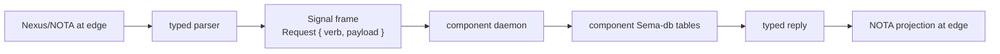

# 43 - Nexus query language and Sema engine arc

*Designer-assistant report, 2026-05-14. Scope: recover the older
Nexus-as-database-language work, compare it to the current
Nexus/Signal/Sema architecture, and name how that lineage should
shape `sema` as a more capable typed database engine without
reintroducing a second text syntax or a shared Persona database.*

## 0. Bottom line

The bigger picture was not lost. It moved.

The old Nexus work in
`/git/github.com/LiGoldragon/nexus-spec-archive/` treated Nexus as a
human/agent database request language: patterns, assertions,
mutations, retractions, transactions, joins, and datalog-shaped
evaluation. The current architecture deliberately killed the custom
syntax and preserved the semantic spine:

```text
Assert Subscribe Constrain Mutate Match Infer
Retract Aggregate Project Atomic Validate Recurse
```

That spine now exists in three places:

- `nexus/spec/grammar.md`: Nexus is ordinary NOTA records, not a
  separate expression language.
- `signal-core/src/request.rs`: `SemaVerb` is the binary rkyv request
  envelope used by Signal.
- `signal-persona*` contracts: component request variants are already
  being mapped onto the Sema verb spine (`Match` for status queries,
  `Mutate` for lifecycle changes, `Assert` for message submissions).

So the right recovery is not "bring back old Nexus syntax." The right
recovery is:

> Treat each component contract as a typed subset of the larger Sema
> database language. Nexus/NOTA is the edge projection of that typed
> language; Signal is the internal binary form; Sema-db should grow the
> reusable storage/query/mutation affordances that make those verbs
> cheap and correct for every state-bearing component.

## 1. Recovered lineage

### 1.1 Old Nexus: database language instincts

`/git/github.com/LiGoldragon/nexus-spec-archive/README.md` and
`ARCHITECTURE.md` had the important instincts:

- assert a typed record as a fact;
- mutate a record at a stable identity;
- retract an asserted fact;
- batch operations atomically;
- query by patterns with binds and wildcards;
- constrain multiple patterns through shared binds;
- support negation/left-join/datalog-like evaluation later.

It also had syntax that no longer belongs in the workspace:

```text
old: (| Node @name |)
new: (Match (NodeQuery (Bind)) Any)

old: [| op1 op2 |]
new: (Atomic [op1 op2])

old: ~record
new: (Mutate slot record)

old: !record
new: (Retract Kind slot)
```

The semantic model survived; the punctuation did not. That is the
right trade. Per `skills/language-design.md`, NOTA is the only text
syntax. Nexus is a typed vocabulary over NOTA, not a second parser.

### 1.2 Current Nexus: NOTA front-end for Signal

`/git/github.com/LiGoldragon/nexus/spec/grammar.md` now says the
important rule plainly:

```text
Every top-level request is a verb record.
Query is not a verb.
Query-like payload names may exist, but public text starts with the
verb that owns the behavior.
```

That means Nexus is the text front-end for the same operation spine
that Signal carries in binary:



Inside the engine, components should not send Nexus to each other.
They send Signal frames or typed in-process messages. Sema stores
rkyv-archived typed records, not Nexus text.

### 1.3 Current Signal: the preserved verb spine

`/git/github.com/LiGoldragon/signal-core/src/request.rs` is the
preserved database-language kernel:

```rust
pub enum SemaVerb {
    Assert,
    Subscribe,
    Constrain,
    Mutate,
    Match,
    Infer,
    Retract,
    Aggregate,
    Project,
    Atomic,
    Validate,
    Recurse,
}
```

`/git/github.com/LiGoldragon/signal-core/src/pattern.rs` also carries
the old pattern language in the current style:

```rust
pub enum PatternField<T> {
    Wildcard,
    Bind,
    Match(T),
}
```

In NOTA this becomes `(Wildcard)`, `(Bind)`, or a concrete typed
value in a field whose Rust type is `PatternField<T>`.

## 2. How Persona already uses the larger language

The current Persona contracts already look like domain-specific
subsets of the larger Sema language.

| Contract | Current mapping | Meaning |
|---|---|---|
| `signal-persona` engine status | `Match` | Read current engine/component status. |
| `signal-persona` startup/shutdown | `Mutate` | Change manager-owned desired/runtime state. |
| `signal-persona` supervision hello/readiness/health | `Match` | Read lifecycle facts from a component. |
| `signal-persona` graceful stop | `Mutate` | Ask a component to transition. |
| `signal-persona-message` message submission | `Assert` | Submit a new message fact/event into the engine. |
| `signal-persona-message` stamped submission | `Assert` | Submit a message fact after provenance stamping. |
| `signal-persona-introspect` observation snapshots | should be `Match` | Read typed component state/observations. |
| future introspection live observation | should be `Subscribe` | Initial snapshot plus commit deltas. |

This confirms the user's phrasing: a message is an assert. More
precisely, a `MessageSubmission` and `StampedMessageSubmission` are
assertions into the engine's message relation.

One drift should be cleaned up: `signal-persona-message` currently has
an `InboxQuery` payload and the round-trip test constructs it through
`Request::assert(...)`. The test does not assert the verb, but the
constructor still encodes the wrong instinct. `InboxQuery` is read
shaped and should be `Match` when the contract grows an explicit
variant-to-verb mapping.

## 3. What this means for Sema-db

`/git/github.com/LiGoldragon/sema/ARCHITECTURE.md` is right that
today's `sema` is a typed database kernel, not the eventual universal
Sema. It owns redb lifecycle, typed tables, schema/header guards,
closure-scoped transactions, and slot utilities. It does not own
record types, daemon actors, validators, mailbox order, subscriptions,
or wire protocol.

The recovered Nexus/Sema language does not overturn that. It sharpens
the growth path:

```text
Nexus text  -> Signal Request { SemaVerb, typed payload }
Signal      -> component daemon applies policy and validation
Sema-db     -> reusable typed storage/query/mutation primitives
```

Sema-db should become more capable, but "more capable" should mean
typed database affordances that correspond to the existing verbs. It
should not mean:

- a Nexus parser inside sema-db;
- a generic string query language;
- a central Persona database;
- sema-owned component policies;
- sema-owned subscribers and routing destinations;
- untyped table names or string-tagged dispatch.

The component daemon remains the owner of semantic policy:

- who is allowed to request the operation;
- which payload variants are legal on that relation;
- how the payload validates;
- when the transaction runs in mailbox order;
- what Signal replies or subscription events are emitted after commit.

Sema-db can still remove repetition underneath that policy.

## 4. Verb-to-storage interpretation

This table is the missing bridge between the recovered language and a
future sema-db query engine.

| Sema verb | Storage/query meaning | Likely sema-db help | What stays in the component |
|---|---|---|---|
| `Assert` | Insert/append a new typed fact/event/row. | typed insert helpers, slot/sequence allocation, same-transaction index writes | validation, auth, durable event meaning |
| `Mutate` | Replace or transition a typed record at stable identity. | typed update helper, expected-revision/check helpers later | allowed transitions, reducer semantics |
| `Retract` | Tombstone/remove/retract a typed fact. | typed remove/tombstone helper | whether retraction is allowed and what audit record means |
| `Atomic` | Bundle multiple operations in one transaction. | transaction-local operation bundle helpers | cross-component atomicity is out of scope; daemon decides legal bundle |
| `Match` | Pattern/range/key query over typed tables. | range-limited scans, secondary-index helpers, bounded collection | domain query record and filter semantics |
| `Project` | Return selected fields/derived view. | maybe reusable projection traits later | exposed shape, redaction, field vocabulary |
| `Aggregate` | Count/reduce grouped matched rows. | simple typed reducers after repetition appears | aggregate vocabulary and meaning |
| `Constrain` | Join/unify multiple typed patterns. | not v1; maybe typed query-plan IR later | relation semantics and bind naming |
| `Subscribe` | Initial state plus commit deltas. | durable subscription table helpers at most | push destinations, commit-then-emit policy |
| `Validate` | Dry-run request through validators. | transaction rollback/dry-run wrapper later | validators and diagnostics |
| `Infer` | Derived facts from rules/ontology. | not sema-db v1 | mind/graph/rule layer |
| `Recurse` | Fixpoint traversal over graph/relation shape. | not sema-db v1 | mind graph or domain graph layer |

The immediate extraction target remains close to
`reports/designer-assistant/42-review-designer-154-sema-db-query-engine-brief.md`:
a pattern-library layer, not a full query DSL. But the verb table
gives that pattern library a direction. The helpers should be named
around the operations the engine already speaks.

## 5. Contract discipline needed next

The weak point is not the existence of `SemaVerb`. The weak point is
that most contracts do not yet force a request variant to declare its
legal verb.

Today a caller can wrap any payload in any `Request::<Payload>` helper.
That is useful as a low-level envelope but weak as a contract witness.
Each contract should grow a contract-owned mapping:

```rust
impl MessageRequest {
    pub fn sema_verb(&self) -> SemaVerb {
        match self {
            Self::MessageSubmission(_) => SemaVerb::Assert,
            Self::StampedMessageSubmission(_) => SemaVerb::Assert,
            Self::InboxQuery(_) => SemaVerb::Match,
        }
    }
}
```

The precise API can vary, but the witness should not. Every
`signal-persona-*` contract should have tests that prove:

- each request variant maps to exactly one `SemaVerb`;
- read-shaped payloads use `Match`, `Project`, `Aggregate`, or
  `Subscribe`, not `Assert`;
- write-shaped payloads use `Assert`, `Mutate`, `Retract`, or
  `Atomic`;
- domain-unimplemented replies preserve the fact that the request was
  well-typed even when behavior is absent;
- Nexus examples use the same verb as the Signal frame.

This would turn the user's "a message is an assert" rule into an
architectural-truth test, not a convention remembered by agents.

## 6. How this ties into introspection

`reports/designer-assistant/37-signal-nexus-and-introspection-survey.md`
already established the format split:

- Signal inside;
- Nexus/NOTA at ingress/egress;
- Sema/redb as typed binary state;
- NOTA logs and inspection output as views.

The query-language recovery strengthens that design. Introspection is
not a special query language. It is a component that accepts Nexus/NOTA
at the edge, lowers into Signal requests, asks component daemons for
typed records, and renders typed replies back to NOTA.

For example:

```nota
(Match
  (TerminalObservationQuery
    kinds [DeliveryAttempt Event SessionHealthChange]
    sequenceRange (Since 100))
  (Limit 200))
```

That should lower to a Signal `Request { verb: Match, payload:
TerminalObservationQuery(...) }` for the relevant terminal observation
relation. The terminal daemon applies the query to its component-owned
Sema tables through sema-db helpers. The introspect CLI renders the
reply as NOTA.

Live introspection should be the same pattern with `Subscribe`, not a
bespoke tail endpoint.

## 7. Sema-db growth path

### Package 1: verb mapping witnesses

Before adding a query engine, tighten contracts:

- add request-variant to `SemaVerb` mappings in every
  `signal-persona-*` crate;
- add round-trip tests that assert the verb as well as the payload;
- correct `InboxQuery` to `Match`;
- add Nexus examples that match the binary verb.

This is small and catches semantic drift early.

### Package 2: typed table pattern library

After terminal/router/mind show the repeated shapes in code, extract
small sema-db helpers:

- named secondary-index helper that forces primary row + index row in
  the same write transaction;
- named packed-key pattern, not anonymous tuple keys;
- data-carrying index values, not zero-sized `()`;
- bounded range/scan collection that keeps redb lifetimes inside the
  closure;
- monotone counter/sequence helper only when the counter is
  domain-neutral;
- batch read/write helpers if they stay typed and closure-scoped.

This gives components common machinery for `Assert`, `Mutate`,
`Retract`, `Atomic`, and basic `Match` without moving domain policy
into sema-db.

### Package 3: typed query-plan IR, only after repetition proves it

If multiple components need the same `Match`/`Project`/`Aggregate`
shape, design a typed Rust/Signal IR. It should be data, not text.
Nexus would project to it at the edge; Rust clients could build it
directly.

Do not start with a Datalog/text DSL inside sema-db. The old Nexus
archive is useful as a semantic map, not as syntax to resurrect.

### Package 4: subscriptions remain actor-owned

Sema-db may help persist subscription records or scan deltas, but the
consumer actor must own commit-then-emit:

```text
actor validates request
actor runs sema write transaction
commit succeeds
actor emits typed subscription event
```

That keeps `Subscribe` aligned with push-not-pull without hiding
runtime routing inside a database library.

## 8. Impact on designer 154

`reports/designer/154-sema-db-query-engine-research-brief.md` asks the
right question but should add an internal-architecture preface:

> Before surveying external query engines, recover the workspace's own
> query-language spine: Nexus verb records, `signal-core::SemaVerb`,
> `PatternField<T>`, and the old Nexus database-language archive. The
> research is not choosing between "raw KV" and an alien query DSL; it
> is deciding how much of the already-existing Sema verb language
> belongs in sema-db as reusable typed execution machinery.

It should also add one research question:

### Q0 - How do current contracts map variants to Sema verbs?

Inventory every `signal-persona-*` request variant:

- current intended verb;
- whether code/tests enforce it;
- whether the verb is semantically right;
- whether Nexus examples agree.

This inventory will expose immediate drifts like `InboxQuery` being
constructed through `Assert`.

## 9. Open design questions

1. Should `signal_channel!` generate verb-mapping scaffolds, or should
   each contract hand-write `sema_verb()`? Generated scaffolds reduce
   drift, but the macro needs a clean syntax for per-variant verb
   declarations.
2. Should a domain-free `signal-sema-query` crate exist later for
   typed query-plan records, or should query records remain fully
   component-owned until at least two components repeat the same
   shape?
3. Should sema-db expose operation names (`assert_row`,
   `mutate_row`, `retract_row`) or stay table-shaped (`insert`,
   `remove`, `range`) with higher-level helpers in component typed
   layers?
4. Which verbs are prototype-scope? I would keep `Assert`, `Mutate`,
   `Retract`, `Atomic`, `Match`, `Project`-lite, and `Subscribe`-as
   actor-owned in scope; keep `Infer` and `Recurse` out of sema-db v1.

## 10. Recommendation

Bring the database-language work forward as an architectural rule:

> Every component request is a typed subset of the Sema operation
> language. Nexus is the NOTA projection of that language at the edge.
> Signal is the binary transport. Sema-db is the typed execution kernel
> for durable state. Components own domain policy, but they should not
> keep reimplementing the same mechanical table/index/range/atomic
> machinery.

The next concrete move is not a broad query engine. It is:

1. add per-contract `SemaVerb` mapping witnesses;
2. correct obvious verb drift (`InboxQuery` -> `Match`);
3. implement the terminal/router introspection slices against current
   sema;
4. extract the repeated typed table/index/scan helpers into sema-db
   once two components have real code showing the same shape.

That preserves the old Nexus database-language insight while keeping
the current architecture clean: NOTA outside, Signal inside, Sema-db
under state-bearing actors, no central shared Persona database, no
string query language, no resurrected sigils.
