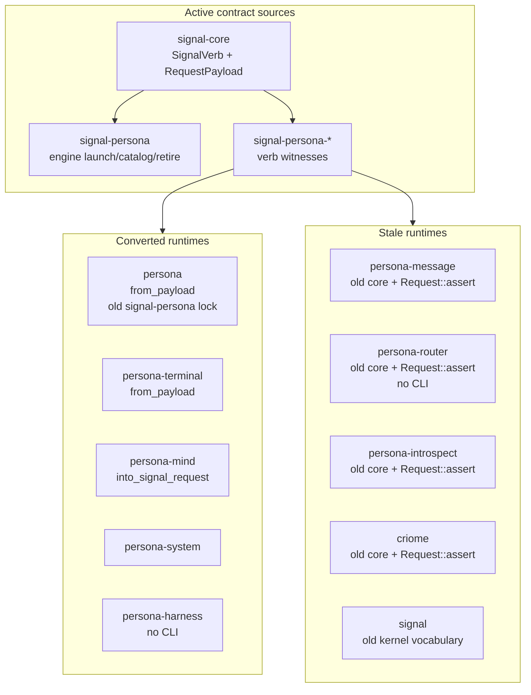

# 53 — Signal-Core, Signal, and CLI Verb-Wrapping: Implementation Audit

*Designer-assistant report, 2026-05-14. Independent audit after
`reports/designer/164-signal-core-vs-signal-and-cli-verb-wrapping.md`.
Focus: how closely current architecture and implementation match the intent
that all Signal-side traffic is wrapped in one of the seven Signal verbs, that
CLIs are thin Nexus/NOTA-to-Signal clients, and that `signal-core` is the
domain-free kernel while `signal-*` crates are domain vocabularies.*

## 0 · Verdict

The architecture direction is now clear and mostly beautiful:

- **`signal-core` is the wire kernel.** It owns `Frame`, handshake,
  `SignalVerb`, generic `Request<Payload>` / `Reply<Payload>`, and
  `signal_channel!`.
- **Signal is the family of typed vocabularies over that kernel.**
  `signal-persona-*`, `signal-criome`, `signal`, and future contracts own
  domain payloads and their mapping to the seven root verbs.
- **Nexus/NOTA is outside.** CLIs and human/agent display surfaces parse or emit
  NOTA, then wrap the typed payload in a Signal request before crossing daemon
  boundaries.
- **The contract-source layer mostly follows this.** Current active
  `signal-persona-*` contracts use `signal_channel!` and per-variant
  `SignalVerb` witnesses.

The implementation is less converted than the contract layer suggests:

1. Several runtime repos still build against old `signal-core` commits with
   `SemaVerb` / `Request::assert`, so the live build state is mixed.
2. Multiple receive paths drop the verb and accept only the payload. That means
   writer-side witnesses do not yet protect the receiver from a mismatched
   `Operation { verb, payload }` frame.
3. The engine-management contract source now has `Assert EngineLaunchProposal`,
   `Match EngineCatalogQuery`, and `Retract EngineRetirement`, but `persona` is
   still locked to the older `signal-persona` commit and the CLI/manager only
   handle the older status/start/stop subset.
4. The CLI discipline is partial: `router` and `harness` lack component CLIs;
   `terminal` has many command binaries instead of one canonical `terminal`
   CLI; `router` architecture claims a CLI witness that the code does not ship.
5. Some architecture files still describe old names (`SemaVerb`, `AuthProof`)
   or old layering (`signal` owning kernel pieces).

So designer/164 is right about the target shape. The deeper implementation
audit says the target is not yet true in the built component graph.

## 1 · Intended Shape

The clean shape is:

```mermaid
flowchart LR
    human["Human / agent"]
    cli["component CLI<br/>one NOTA request in"]
    payload["typed contract payload<br/>(domain enum variant)"]
    request["signal_core::Request::from_payload<br/>or into_signal_request"]
    frame["Signal frame<br/>rkyv length-prefixed"]
    daemon["component daemon"]
    checked["read request and verify<br/>verb == payload.signal_verb()"]
    actor["Kameo actor topology"]
    state["sema-engine / sema state"]
    reply["typed reply"]
    output["one NOTA reply out"]

    human --> cli --> payload --> request --> frame --> daemon --> checked --> actor --> state
    state --> reply --> output --> human
```



Important separations:

| Layer | Format | Role |
|---|---|---|
| CLI / display edge | Nexus/NOTA | Human/agent ingress and egress. |
| Component wire | Signal | Typed binary frames over Unix sockets. |
| Core wire kernel | `signal-core` | Domain-free frame, request, reply, verb, macro machinery. |
| Domain vocabulary | `signal-*` | Contract-owned request/reply payloads and verb witnesses. |
| Component state | `sema` / `sema-engine` | Durable typed records, operation log, indexes, projections. |

This means a CLI should never invent a line protocol to a daemon. It should
parse a NOTA record, produce a contract payload, let the contract choose its
root verb, send a Signal frame, decode a typed Signal reply, and print NOTA.

## 2 · What Designer/164 Got Right, And What Changed

| Point | Current assessment |
|---|---|
| `signal-core` vs Signal is kernel vs vocabulary. | Correct. This is now the cleanest way to explain it. |
| `signal_channel!` makes request variants declare verbs. | Correct for current active contract sources. |
| CLI-as-thin-wrapper is the right intent. | Correct; it matches the current workspace direction. |
| Engine launch/catalog/retirement missing from `signal-persona`. | **Outdated in active source.** Current `/git/github.com/LiGoldragon/signal-persona` has `EngineLaunchProposal`, `EngineCatalogQuery`, and `EngineRetirement`. But `persona/Cargo.lock` still points at the older `signal-persona` commit, so the implementation has not consumed the new contract. |
| Contract layer is excellent, CLI layer mixed. | Correct, but the implementation split is sharper than /164 states because several runtimes still build against old core/contract locks. |

## 3 · Current Contract-Source State

Active source heads at audit time:

| Repo | Active source status |
|---|---|
| `signal-core` | Current seven-root `SignalVerb`, `RequestPayload`, `Request::from_payload`, `unchecked_operation`, `signal_channel!`. |
| `signal-persona` | Current source includes engine launch/catalog/retirement and supervision relation. |
| `signal-persona-message` | Current source uses `SignalVerb` witnesses. |
| `signal-persona-router` | Current source uses `SignalVerb` witnesses. |
| `signal-persona-harness` | Current source uses `SignalVerb` witnesses. |
| `signal-persona-terminal` | Current source uses `SignalVerb` witnesses. |
| `signal-persona-system` | Current source uses `SignalVerb` witnesses. |
| `signal-persona-mind` | Current source uses `SignalVerb` witnesses. |
| `signal-persona-introspect` | Current source uses `SignalVerb` witnesses. |
| `signal-criome` | Current source uses current `signal-core`. |
| `signal` | Architecture/source are still partly pre-kernel-extraction: `AuthProof`, `SemaVerb`, and old kernel ownership language remain. |

Current active `signal-core` is strong on writer-side correctness:

```rust
pub trait RequestPayload {
    fn signal_verb(&self) -> SignalVerb;

    fn into_request(self) -> Request<Self>
    where
        Self: Sized,
    {
        Request::from_payload(self)
    }
}
```

The important property: contract payloads choose the verb; runtime code should
not decide that every payload is `Assert`.

## 4 · Runtime Build State

The implementation graph is mixed because consumer locks do not all point to
the current contract/kernel heads.

| Runtime repo | `signal-core` lock | Writer shape in source | Assessment |
|---|---:|---|---|
| `persona` | `aa7a0d93` current | `Request::from_payload` | Good on core, but `signal-persona` lock is old and lacks new engine verbs. |
| `persona-mind` | current | `into_signal_request` | Good writer shape. Receive path still drops verb. |
| `persona-system` | current | `Request::from_payload` in tests | Good writer shape. Receive path still drops verb. |
| `persona-harness` | current | `Request::from_payload` in tests | Good writer shape. No component CLI. Receive path still drops verb. |
| `persona-terminal` | current | `Request::from_payload` | Good writer shape. CLI shape is still many binaries, not one canonical component CLI. Receive path still drops verb. |
| `persona-message` | `9f4e20b` old | `Request::assert` in `src/router.rs` | Stale. Builds against old 12-root core. Tests still mention `SemaVerb`. |
| `persona-router` | `9f4e20b` old | `Request::assert` in `src/router.rs` | Stale. Also no router CLI despite ARCH claiming one. |
| `persona-introspect` | `9f4e20b` old | `Request::assert` in `src/daemon.rs` | Stale. ARCH still says `SemaVerb` until rename lands. |
| `criome` | `9f4e20b` old | `Request::assert` in `src/transport.rs` | Stale relative to current `signal-core` / `signal-criome`. |
| `signal` | `ee0a9f` old branch lock | Old kernel vocabulary remains | Needs cleanup or explicit retirement path. |

Representative stale call sites:

- `persona-message/src/router.rs`: `Request::assert(request)`
- `persona-router/src/router.rs`: `Request::assert(request)`
- `persona-introspect/src/daemon.rs`: `Request::assert(request)`
- `criome/src/transport.rs`: `Request::assert(request)`

Representative converted call sites:

- `persona/src/transport.rs`: `Request::from_payload(request)`
- `persona-mind/src/transport.rs`: `request.into_signal_request()`
- `persona-terminal/src/signal_cli.rs`: `Request::from_payload(self.request)`
- `persona-terminal/src/supervisor.rs`: `Request::from_payload(request)`

This matters because the actual build truth is the lockfile plus the source,
not only the active contract repository head. The workspace policy should use
named references/bookmarks/tags for stable interfaces, but each consumer still
needs to move to the named reference that exposes the current interface and
refresh its lock.

## 5 · Receiver-Side Gap

The most important gap missed by the first pass: most receive paths discard the
wire verb.

Current pattern appears in several repos:

```rust
match frame.into_body() {
    FrameBody::Request(Request::Operation { payload, .. }) => Ok(payload),
    other => Err(...),
}
```

This is incomplete. `Request::from_payload` protects honest writers, but the
wire still contains both a verb and a payload. `signal-core` deliberately has
`Request::unchecked_operation(verb, payload)` as an escape hatch. A buggy old
client, stale test, or hostile peer can produce:

```text
Operation {
  verb: Assert,
  payload: IntrospectionRequest::ComponentObservations(...)
}
```

If the receiver drops `verb`, the component accepts a `Match`-shaped payload
inside an `Assert` frame. That violates the intent that *all messages are one
of the seven verbs* in a meaningful way. The verb must be checked at the
receiving boundary before the payload enters the component actor.

Recommended kernel helper:

```rust
impl<Payload: RequestPayload> Request<Payload> {
    pub fn into_payload_checked(self) -> Result<Payload, SignalVerbMismatch> {
        match self {
            Request::Operation { verb, payload } if verb == payload.signal_verb() => Ok(payload),
            Request::Operation { verb, payload } => Err(SignalVerbMismatch {
                frame_verb: verb,
                payload_verb: payload.signal_verb(),
            }),
            Request::Handshake(_) => Err(SignalVerbMismatch::handshake()),
        }
    }
}
```

Then every component transport should use it:

```rust
FrameBody::Request(request) => request.into_payload_checked().map_err(...)
```

Without this, the verb is decorative at the receiving edge.

## 6 · CLI Audit

| Component | Current CLI state | Alignment |
|---|---|---|
| `persona` | Has `persona`; one NOTA request in, one reply out. | Mostly aligned, but request enum only covers old status/start/stop subset because the implementation lock has not consumed the new engine-launch contract. |
| `persona-mind` | Has `mind`. | Aligned shape. |
| `persona-message` | Has `message` and `persona-message-daemon`. | Shape is aligned, but writer still uses old `Request::assert` until lock/source convert. |
| `persona-system` | Has `system` and daemon. | Aligned shape. |
| `persona-introspect` | Has `introspect` and daemon. | Conceptually aligned, but stale core lock and `Request::assert` remain. |
| `persona-router` | Only `persona-router-daemon`. ARCH claims a daemon-client CLI and constraint witness. | Implementation missing. |
| `persona-harness` | Only `persona-harness-daemon`. | Missing CLI. |
| `persona-terminal` | Many binaries: daemon, view, send, capture, type, sessions, resolve, signal, supervisor. | Operationally useful but not the intended single canonical component CLI. |

The terminal helper binaries do not all need to disappear immediately. Some are
terminal-cell operations or development witnesses. But the component should
have one canonical `terminal` CLI surface that speaks NOTA-to-Signal in the
same shape as `mind`, `message`, and `introspect`. Extra helper binaries should
be explicitly named as fixtures/dev tools rather than the component's primary
public CLI.

## 7 · Architecture Drift

### `signal/ARCHITECTURE.md`

Still says the kernel owns `AuthProof` and says `SignalVerb` is "currently
still named `SemaVerb` in code." Current `signal-core` no longer matches that.
This file should be edited or marked historical. If `signal` remains the
sema-ecosystem vocabulary, its architecture should state only that and stop
describing old kernel ownership.

### `persona-introspect/ARCHITECTURE.md`

Constraint table still says:

```text
signal_verb() method ... returns signal_core::SemaVerb until the signal-core
SignalVerb rename lands
```

The rename landed. The architecture is stale.

### `persona-router/ARCHITECTURE.md`

The component surface says a daemon-client CLI exists and the constraint table
names:

```text
router-cli-sends-signal-to-daemon-and-prints-nota-reply
```

But `Cargo.toml` ships only `persona-router-daemon`. Either implement the CLI
or remove the claim. Given the user's stated intent, implement the CLI.

### `persona-terminal/ARCHITECTURE.md`

The architecture is honest about current binaries and calls
`persona-terminal-signal` the current contract witness client. It does not yet
state the target canonical `terminal` CLI. Add a transition rule:

- one canonical `terminal` CLI for component debugging/testing;
- existing binaries are helper/witness surfaces until folded or explicitly
  retained.

### `persona/ARCHITECTURE.md` and `persona` implementation

Current `signal-persona` active source contains:

- `Assert EngineLaunchProposal`
- `Match EngineCatalogQuery`
- `Retract EngineRetirement`

But `persona` currently builds against older `signal-persona` in its lock, and
`persona/src/request.rs` only decodes:

- `EngineStatusQuery`
- `ComponentStatusQuery`
- `ComponentStartup`
- `ComponentShutdown`

The design has moved ahead of the manager implementation.

## 8 · Architecture Diagram: Current Split



The source layer has largely adopted the new model. The runtime layer is in a
half-migrated state.

## 9 · Implementation-Ready Corrections

### P0 — Make receiver validation real

Add a checked payload extraction helper to `signal-core`, then convert all
daemon/client transport read paths to reject verb/payload mismatches.

Initial call sites to convert:

- `persona/src/transport.rs`
- `persona/src/supervision_readiness.rs`
- `persona/src/bin/persona_component_fixture.rs`
- `persona-mind/src/transport.rs`
- `persona-message/src/router.rs`
- `persona-router/src/router.rs`
- `persona-router/src/supervision.rs`
- `persona-terminal/src/signal_cli.rs`
- `persona-terminal/src/supervisor.rs`
- `persona-introspect/src/daemon.rs`
- `persona-harness/src/daemon.rs`
- `persona-harness/src/supervision.rs`
- `persona-system/src/daemon.rs`
- `persona-system/src/supervision.rs`
- `criome/src/transport.rs`

Witness: construct an `unchecked_operation` with a mismatched verb and assert
the receiver rejects it.

### P0 — Finish the old-core migration

Move stale consumers to the named reference that exposes the current
`signal-core` interface, refresh locks, and remove `Request::assert` /
`SemaVerb` from runtime repos.

Initial stale repos:

- `persona-message`
- `persona-router`
- `persona-introspect`
- `criome`
- `signal`
- `nexus` if it is still active on Signal traffic
- `persona-sema` if it is not retired

This should not use raw rev pins as the design answer. Stable interfaces should
be carried by named references or tags; locks then record the resolved object
for reproducibility.

### P1 — Consume engine launch/catalog/retirement in `persona`

`signal-persona` active source has the right contract direction. `persona`
needs to consume it:

- update dependency lock to the named reference containing current
  `signal-persona`;
- add NOTA CLI records for `EngineLaunchProposal`, `EngineCatalogQuery`, and
  `EngineRetirement`;
- route them through `PersonaRequest::into_engine_request`;
- implement manager/state behavior or return typed unimplemented replies while
  preserving the verb shape;
- add tests that the CLI wraps launch as `Assert`, catalog as `Match`, and
  retirement as `Retract`.

### P1 — Close component CLI gaps

Implement canonical thin CLIs:

- `router`: one NOTA `signal-persona-message` or router contract request in,
  one NOTA reply out, over Signal frames.
- `harness`: one NOTA harness request in, one NOTA reply out.
- `terminal`: one canonical CLI over `signal-persona-terminal`; current helper
  binaries remain only as dev witnesses or lower-level terminal-cell helpers.

### P1 — Add architectural truth tests

Recommended reusable checks:

- no production source uses `Request::assert`;
- no repo source or tests import `signal_core::SemaVerb`;
- every frame writer uses `Request::from_payload` or `into_signal_request`;
- every frame reader verifies `verb == payload.signal_verb()`;
- every component with a daemon has one canonical CLI binary;
- every component CLI prints exactly one NOTA reply record for one NOTA request
  record.

### P2 — Clean architecture drift

Update:

- `signal/ARCHITECTURE.md`
- `persona-introspect/ARCHITECTURE.md`
- `persona-router/ARCHITECTURE.md`
- `persona-terminal/ARCHITECTURE.md`
- `persona/ARCHITECTURE.md` after `persona` consumes current `signal-persona`

The ARCH updates should be present-tense and should not cite this report.

## 10 · Main Unclear Point

The only thing that still needs a design decision is the long-term role of the
plain `signal` repo. It currently reads like an older kernel/vocabulary hybrid,
while `signal-core` has already extracted the kernel and `sema-engine` is
becoming the full database-operation engine.

My recommendation:

- keep `signal` only if it is the sema/criome domain vocabulary over
  `signal-core`;
- remove or rewrite every old kernel claim from its architecture and source;
- if its record vocabulary is superseded by `sema-engine` + more specific
  `signal-*` contracts, explicitly retire it rather than leaving it as a
  second conceptual center.

That is the only architecture ambiguity I would bring back to the user. The
rest is implementation cleanup against a clear design.

