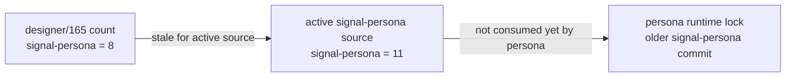
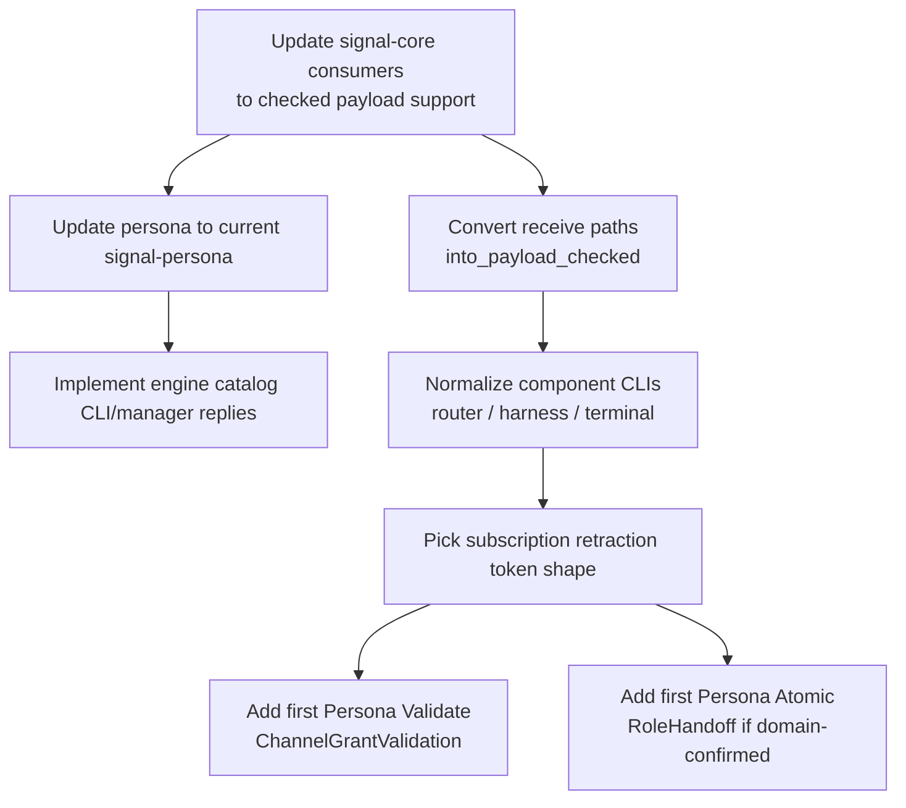

# 54 — Verb Coverage: Implementation and Design Audit

*Designer-assistant report, 2026-05-14. Parallel review after
`reports/designer/165-verb-coverage-across-persona-components.md`. Focus:
whether the current contracts, component implementations, and architecture
actually match the seven-root Signal discipline; where designer/165 is already
stale; and which design questions should be answered before operators widen the
contracts.*

## 0 · Verdict

Designer/165 is right about the big thesis: the seven roots still cover the
Persona engine. I found no operation that needs an eighth verb.

The implementation state is more nuanced than designer/165 reports:

1. **Active `signal-persona` source already has the engine catalog verbs.**
   `EngineLaunchProposal` is `Assert`, `EngineCatalogQuery` is `Match`, and
   `EngineRetirement` is `Retract`. Designer/165's count is therefore stale
   for active source.
2. **Active Persona contract-source count is 65, not 62.** The three extra
   variants are the engine launch/catalog/retirement variants.
3. **`Atomic` and `Validate` are not globally unused.** `sema-engine` already
   implements both at the library layer, and active `signal-criome` already has
   a `Validate VerifyAttestation` request. They are still unused in
   `signal-persona-*` contracts.
4. **Runtime adoption lags contract source.** Several component repos still
   build against older `signal-core` and/or older `signal-persona-*` locks.
5. **Receiver-side verb validation is still mostly not consumed.** Active
   `signal-core` now has `Request::into_payload_checked`, but component
   transports still commonly accept `Request::Operation { payload, .. }` and
   discard the frame verb.

The design work still needed is not root-verb discovery. It is contract
normalization: subscription lifetime, first Persona-domain `Atomic`, first
Persona-domain `Validate`, read-plan exposure through Nexus/CLI, and canonical
component CLI shape.

## 1 · Corrected Active-Source Counts

Counts from active source under `/git/github.com/LiGoldragon/signal-persona*`
on 2026-05-14:

| Contract | Assert | Mutate | Retract | Match | Subscribe | Atomic | Validate | Total |
|---|---:|---:|---:|---:|---:|---:|---:|---:|
| `signal-persona` | 1 | 3 | 1 | 6 | 0 | 0 | 0 | 11 |
| `signal-persona-mind` | 11 | 3 | 2 | 6 | 2 | 0 | 0 | 24 |
| `signal-persona-message` | 2 | 0 | 0 | 1 | 0 | 0 | 0 | 3 |
| `signal-persona-router` | 0 | 0 | 0 | 3 | 0 | 0 | 0 | 3 |
| `signal-persona-harness` | 2 | 0 | 1 | 1 | 0 | 0 | 0 | 4 |
| `signal-persona-terminal` | 5 | 1 | 3 | 2 | 1 | 0 | 0 | 12 |
| `signal-persona-system` | 0 | 0 | 1 | 2 | 1 | 0 | 0 | 4 |
| `signal-persona-introspect` | 0 | 0 | 0 | 4 | 0 | 0 | 0 | 4 |
| **Total** | **21** | **7** | **8** | **25** | **4** | **0** | **0** | **65** |

The high-level shape still matches designer/165: Persona is read-heavy,
`Subscribe` is underused, and no Persona contract currently exposes `Atomic`
or `Validate`.

But the engine-catalog gap has moved:



## 2 · Contract Source vs Runtime Build Truth

The source layer and build layer disagree in several places. That is the most
important implementation finding.

| Runtime repo | `signal-core` lock | Contract lock status | Consequence |
|---|---|---|---|
| `persona` | `aa7a0d93` | `signal-persona` locked to pre-engine-catalog commit | Current CLI/manager do not see `EngineLaunchProposal`, `EngineCatalogQuery`, or `EngineRetirement`. |
| `persona-mind` | `aa7a0d93` | current `signal-persona-mind` | Good writer shape; still needs checked receive conversion. |
| `persona-harness` | `aa7a0d93` | current harness contract, older `signal-persona` supervision contract | Mostly fine for current surface; no CLI. |
| `persona-terminal` | `aa7a0d93` | current `signal-persona` and terminal contract | Good contract adoption; CLI surface still fragmented. |
| `persona-system` | `aa7a0d93` | current system contract, older `signal-persona` supervision contract | Mostly fine for current surface; checked receive still missing. |
| `persona-message` | `9f4e20b` | old `signal-persona-message` and old `signal-persona` | Still old `Request::assert` / `SemaVerb` era. |
| `persona-router` | `9f4e20b` | old message/mind/terminal/persona contracts | Still old `Request::assert` era; no router CLI despite ARCH claim. |
| `persona-introspect` | `9f4e20b` | old introspect contract | Still old `Request::assert` era. |
| `criome` | `9f4e20b` | old `signal-criome` | Does not consume active `signal-criome`'s `Validate VerifyAttestation`. |

`signal-core` active source has already advanced again:

- `RequestPayload`
- `Request::from_payload`
- `Request::into_payload_checked`
- `SignalVerbMismatch`

No audited runtime lock points at the `signal-core` commit containing
`into_payload_checked`. Even after locks update, components still need to use
the helper at receive boundaries.

## 3 · What Designer/165 Gets Right

Designer/165 is strong on these points:

- The seven-root set still covers every Persona operation named in current
  architecture.
- The missing pieces are payload variants, not root verbs.
- `Subscribe` is underrepresented relative to `Match`.
- Subscribe lifetime is inconsistent across contracts.
- Terminal CLI shape is out of line with the one-component-one-canonical-CLI
  direction.
- Router's public observation contract should stay narrow unless a concrete
  external writer appears.

These conclusions still hold.

## 4 · Corrections and Sharpening

### 4.1 · Engine catalog verbs are landed in active source

Active `signal-persona` already declares:

```text
Assert  EngineLaunchProposal
Match   EngineCatalogQuery
Retract EngineRetirement
```

So the next operator task is not "add these to `signal-persona`." It is:

1. move `persona` to the current `signal-persona` named reference;
2. add CLI NOTA records for those variants;
3. update manager/state reducers to handle them, even if initial behavior is
   typed `Unimplemented`;
4. add tests that the CLI wraps launch as `Assert`, catalog as `Match`, and
   retirement as `Retract`.

### 4.2 · Atomic has a kernel implementation

`sema-engine` already implements `AtomicBatch<RecordValue>`:

- one registered table per batch;
- `Assert`, `Mutate`, and `Retract` operations inside the bundle;
- preflight rejection for empty batch, duplicate keys, missing mutation target,
  and missing retraction target;
- one operation-log entry with `SignalVerb::Atomic`;
- one committed snapshot for the bundle;
- post-commit subscription deltas sharing the bundle snapshot.

This should be treated as the reference implementation for `Atomic` semantics.
Persona should not invent a different meaning.

The open question is narrower: **what is the first Persona-domain contract
payload that needs to expose an atomic operation across a Signal boundary?**

My recommendation: do not force `Atomic` into a low-value batch just to exercise
the verb. The best first Persona candidate is `signal-persona-mind`
`RoleHandoff` if we decide the domain truth is really "retract old claim +
assert new claim under one snapshot" rather than an opaque `Mutate`. It is
central, low-cost, and semantically honest.

`EngineUpgrade` is a better long-term `Atomic`, but it depends on multi-engine
federation and migration. It should not be the first implementation pressure.

### 4.3 · Validate has two existing footholds

`Validate` is not unused globally:

- active `sema-engine` has `Engine::validate(QueryPlan<_>)`, returning a
  `ValidationReceipt` with `SignalVerb::Validate`;
- active `signal-criome` declares `Validate VerifyAttestation(VerifyRequest)`.

The open question is again narrower: **what is the first Persona-domain
contract validation?**

My recommendation: the first Persona `Validate` should be a mind-owned policy
check, probably `ChannelGrantValidation(ChannelGrantProposal)`. Mind owns the
decision to open channels; router enforces. A dry-run that asks "would this
grant be accepted, and why?" is load-bearing and fits the trust/channel model.

`WriteInjectionValidation` is useful, but more local to terminal control.
`DeliveryValidation` belongs after terminal/harness delivery is wired enough
that "can accept now" has real data behind it.

### 4.4 · Receiver validation is still the real correctness gap

Active `signal-core` now has the right primitive:

```text
Request::into_payload_checked()
```

But many component transports still use the old pattern:

```rust
FrameBody::Request(Request::Operation { payload, .. }) => Ok(payload)
```

That discards the frame verb. The seven-root discipline is not fully enforced
until receivers reject verb/payload mismatches.

This should be a P0 implementation pass:

- refresh component locks to current `signal-core`;
- replace receive-path destructuring with `into_payload_checked`;
- add negative tests using `Request::unchecked_operation` with a mismatched
  verb.

## 5 · Open Questions: My Answers

### Q1 · First Persona `Atomic`

Use sema-engine as the semantic reference. For first Persona-domain use, prefer
`signal-persona-mind::RoleHandoff` only if we agree role handoff is two facts
under one snapshot:

```text
Atomic RoleHandoff
  Retract old RoleClaim
  Assert new RoleClaim
```

Do not use message batching as the reference implementation; it makes `Atomic`
look like an optimization rather than a correctness boundary.

### Q2 · First Persona `Validate`

Prefer `ChannelGrantValidation` in `signal-persona-mind`.

Reason: mind owns policy. Router should not decide whether a channel grant is
valid; router should enforce a grant that mind has committed. A validation
request lets an operator, agent, or future policy actor ask the mind what would
happen before committing.

### Q3 · Subscribe lifecycle

Choose pattern **B**: one contract-local retraction by subscription token.

```text
Subscribe ThoughtStream(...)
Subscribe RelationStream(...)
Retract  SubscriptionRetraction(SubscriptionToken)
```

This is explicit, data-carrying, and scales better than one retract variant per
subscribe variant. Pattern A is acceptable for one-stream contracts like
`signal-persona-system` today, but it grows repetitive. Pattern C, implicit
close-on-connection-drop only, is too vague for durable subscriptions and
reconnect semantics.

### Q4 · Engine creation vs adoption

Use two `Assert` variants, not one union payload:

```text
Assert EngineLaunchProposal
Assert EngineAdoptionProposal
```

Both assert a catalog row, but they have different provenance and failure
modes. Launch means "spawn a child from this manager's plan." Adoption means
"verify and catalog an already-running engine." The names should preserve that
difference.

### Q5 · ReadPlan algebra at CLI/Nexus edge

The full query language belongs in Nexus, but component CLIs should not expose
raw sema-engine internals by accident.

Recommended shape:

- every CLI accepts the canonical typed NOTA record for its contract;
- contracts that truly expose query algebra carry a typed `ReadPlan` or
  domain-specific query-plan wrapper inside a `Match` / `Subscribe` /
  `Validate` payload;
- ergonomic shorthand may desugar to the full typed record, but the typed
  record is the truth.

So the answer is "full, but typed." Not "simple forever," and not "stringly
query snippets in every CLI."

### Q6 · Terminal binaries

Make one canonical `terminal` CLI. Keep specialized binaries only if they are
explicit shims or development witnesses that desugar to the same contract
request path.

Because backward compatibility is not a workspace design constraint, do not
preserve nine binaries for their own sake. Preserve only the helpers that still
make the terminal-cell/terminal split easier to test.

### Q7 · Router external surface

Keep `signal-persona-router` observation-first. Router control should come from
mind decisions and internal structural channels, not from arbitrary external
`Assert` / `Mutate` calls on the router contract.

If router needs a writable control relation later, name it as a separate
relation, not as an expansion of the introspection/observation surface.

## 6 · Architecture Drift To Fix

| Area | Drift | Correction |
|---|---|---|
| `persona` runtime | Locked to older `signal-persona`; CLI and manager lack engine catalog variants. | Consume current `signal-persona` and implement or typed-unimplement the new variants. |
| `persona-message`, `persona-router`, `persona-introspect`, `criome` | Old `signal-core` locks and `Request::assert`. | Move to current named reference and use contract-owned verb witnesses. |
| component transports | Receive paths discard frame verb. | Use `Request::into_payload_checked`. |
| `signal-persona-system` subscribe lifecycle | Has `FocusUnsubscription`, while mind/terminal use implicit close. | Move toward a shared `SubscriptionRetraction(SubscriptionToken)` pattern when adding more subscriptions. |
| `persona-router` CLI | ARCH claims a daemon-client CLI; Cargo only has daemon. | Implement router CLI or remove the claim. User intent favors implementation. |
| `persona-harness` CLI | No canonical CLI. | Add one NOTA-in / NOTA-out CLI. |
| `persona-terminal` CLI | Many binaries, no canonical `terminal` command. | Add canonical CLI; demote helpers to shims/witnesses. |

## 7 · Recommended Operator Order



Do not start by adding more proposed variants everywhere. First make the current
Signal discipline real in the running component graph: current locks, checked
receive paths, engine catalog consumption, and canonical CLIs.

## 8 · Questions To Bring Back

Only two questions need user attention before implementation choices become
expensive:

1. **Subscribe lifecycle:** confirm pattern B, a contract-local
   `SubscriptionRetraction(SubscriptionToken)`, as the canonical lifecycle
   pattern.
2. **First Persona-domain `Atomic`:** should `RoleHandoff` become atomic
   (`Retract RoleClaim` + `Assert RoleClaim`) or remain a single `Mutate`?

Everything else can be implemented under the current intent or deferred until
there is a real consumer.

