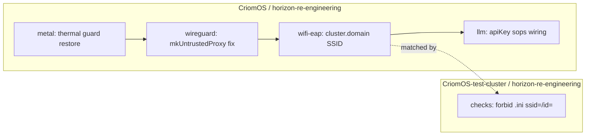

# 85 — CriomOS bugfix bundle on `horizon-re-engineering`

*Implementation report. Lands the four targeted CriomOS Nix module
fixes called for in audits 79 (Findings 1, 2), 80 (Finding 1), and
81 (Finding 3). Five commits across two worktrees: four on
CriomOS, one on CriomOS-test-cluster. Branch:
`horizon-re-engineering` in each repo.*

---

## TL;DR

Four fixes land on the `horizon-re-engineering` branch in one
session. **Fix 1** cherry-picks the deleted ThinkPad thermal block
back into `metal/default.nix` — fan curve, thermald 80 °C passive
guard, and the "never `level auto`" assertion — closing the
regression that caused today's overheating. **Fix 2** corrects two
co-located bugs in `network/wireguard.nix:25-27` where
`mkUntrustedProxy` inherited from the outer list value and wrote
the wrong schema field name. **Fix 3** lifts the literal `criome`
SSID and connection-id out of `network/wifi-eap.nix` to
`cluster.domain`, and widens the test-cluster's source-constraints
check so the .ini form (`ssid=criome`, `id=criome`) can no longer
slip past the existing Nix-attribute-form check. **Fix 4** wires
`AiProvider.apiKey` through sops in `llm.nix`, mirroring the
nordvpn-credentials shape — dormant on today's goldragon datom (no
provider authors `apiKey`) but ready the moment a cloud provider
lands. The thermal source-constraints positive assertion is
deferred to future work: the existing `forbiddenStubLiterals`
mechanism is text-match negative, the right shape for a
"`thermald.enable = true` must accompany `needsThinkpadThermalGuard`"
constraint is a different check type. **One report collision**:
another `85-user-decisions-...md` already exists in the
designer-assistant directory; this report honors the explicit
file-path instruction and the collision is flagged for the user
to renumber.

---

## §1 — Thermal regression cherry-pick

**File:** `modules/nixos/metal/default.nix` (CriomOS,
horizon-re-engineering)

The branch's `let` block carried `modelIsThinkpad`, `chipIsIntel`,
and the `services.thinkfan` enable gate, but the curve, the
thermald block, and the assertion were missing — `services.thinkfan`
fell back to whatever upstream NixOS picked, and on Intel
ThinkPads under sustained load that defaulted to a too-permissive
EC envelope. Today's overheating is the operational witness.

The cherry-pick restores six elements verbatim from main
(`/git/github.com/LiGoldragon/CriomOS/modules/nixos/metal/default.nix`):

| Element | New location (branch) | Source location (main) |
|---|---|---|
| `needsThinkpadThermalGuard = modelIsThinkpad && chipIsIntel;` | let block, after `needsIntelThrottlingFix` | line 97 |
| `thinkpadFanLevels` (six-level curve) | let block, immediately after | lines 99-106 |
| `thermaldEightyDegreeConfiguration` (XML config) | let block, immediately after | lines 108-143 |
| `assertions = optional modelIsThinkpad { ... }` | top of `mkIf behavesAs.bareMetal { ... }` body | lines 265-268 |
| `services.thinkfan.levels = thinkpadFanLevels;` | inside existing `services.thinkfan` block | line 512 |
| `services.thermald = mkIf needsThinkpadThermalGuard { ... }` | new block after `services.thinkfan` | lines 521-524 |

Every symbol (`mkIf`, `optional`, `modelIsThinkpad`, `chipIsIntel`,
`pkgs`) was already in scope on the branch; the cherry-pick is pure
restoration. `nix-instantiate --parse` confirms the resulting file
parses.

### Source-constraints — positive assertion deferred

The audit also asked for a source-level check that would
positively require `services.thermald.enable = true` to appear in
the same file as `needsThinkpadThermalGuard`. The existing
mechanism in `CriomOS-test-cluster/checks/source-constraints.nix`
is a **text-match negative** check — `lib.hasInfix` on a list of
forbidden fragments. That shape can forbid a literal but cannot
naturally express "presence of A implies presence of B."

A correct positive assertion needs one of:

- A small parser shape (`builtins.match`) that detects
  `needsThinkpadThermalGuard` and checks for `thermald.enable = true`
  in the same file body.
- A second check derivation alongside `source-constraints` whose
  predicate is "file matches regex /needsThinkpadThermalGuard/ ⇒
  file matches regex /services\.thermald\s*=\s*mkIf\s+needsThinkpadThermalGuard/"
  (or similar).
- An *evaluation*-time NixOS assertion lifted into the module
  itself rather than a source check — but that would require the
  module to be importable in isolation, which it isn't today.

Per the brief's instruction ("If such a positive-assertion check
doesn't fit the existing source-constraints shape, document the
gap"), the check is **deferred as future work**, recorded here as
the right-shape spec:

> **Required: a source-constraint check that asserts**
> `presence(needsThinkpadThermalGuard) ⇒ presence(services.thermald = mkIf needsThinkpadThermalGuard)`
> in the same `.nix` file. Implementation likely a sibling derivation
> to `source-constraints.nix` (`positive-source-constraints.nix`?) that
> uses a richer matcher than `lib.hasInfix`.

Open question for the designer: is a richer source-grep mechanism
the right home, or should a NixOS assertion inside `metal/default.nix`
("if `needsThinkpadThermalGuard` then `services.thermald.enable`
must be true") suffice for the regression-prevention purpose? The
assertion-inside-module shape catches the failure at eval time,
which is when the cluster gets built, which is downstream of when
operators read source. The source-check shape catches the failure
at PR-review time, which is upstream. Both are valid; the source
shape matches the existing test-cluster constraint discipline.

---

## §2 — `network/wireguard.nix` latent crash

**File:** `modules/nixos/network/wireguard.nix` (CriomOS,
horizon-re-engineering)

Two co-located bugs in `mkUntrustedProxy` (lines 25-27):

**Before:**
```nix
mkUntrustedProxy = untrustedProxy: {
  inherit (wireguardUntrustedProxies) publicKey endpoint;
  allowedIPs = [ "0.0.0.0/0" ];
};
```

**After:**
```nix
mkUntrustedProxy = untrustedProxy: {
  publicKey = untrustedProxy.pubKey;
  inherit (untrustedProxy) endpoint;
  allowedIPs = [ "0.0.0.0/0" ];
};
```

The original had two compounding errors:

1. **Wrong inherit source.** `inherit (wireguardUntrustedProxies) ...`
   reaches into the outer **list** value (the per-node list of
   `WireguardProxy` records). Nix lists do not carry attribute
   names, so the inherit binds nothing usable. Fixed by inheriting
   from the per-iteration `untrustedProxy` parameter.

2. **Wrong field name.** The schema (per
   `horizon-rs/horizon-re-engineering/lib/src/proposal/wireguard.rs`,
   `WireguardProxy { pub_key, endpoint, interface_ip }` with
   `#[serde(rename_all = "camelCase")]`) renders the field as
   `pubKey` — not `publicKey`. The NixOS wireguard module's peer
   schema expects `publicKey`, so the consumer must read schema
   `untrustedProxy.pubKey` and write NixOS `publicKey =
   untrustedProxy.pubKey`. The `endpoint` name matches between
   schema and NixOS so it stays a plain `inherit`.

This was latent: every current goldragon node's `wireguardUntrustedProxies`
is empty, so the buggy `mkUntrustedProxy` was never called. The
moment any node authors a non-empty list the lazy evaluation hits
and the module crashes. `nix-instantiate --parse` confirms the
fix parses.

---

## §3 — `network/wifi-eap.nix` SSID literal lift

**Files:**

- `modules/nixos/network/wifi-eap.nix` (CriomOS, horizon-re-engineering)
- `checks/source-constraints.nix` (CriomOS-test-cluster,
  horizon-re-engineering)

### What now reads from horizon

The EAP-TLS NetworkManager connection profile previously hardcoded
both `ssid=criome` (line 27) and `id=criome` (line 23). The new
shape derives both from `horizon.cluster.domain`, the cluster-wide
identifier that already holds `"criome"`. The schema is
authoritative: `ClusterProposal.domain: ClusterDomain` (per
`horizon-rs/.../proposal/cluster.rs:81`) flows to `view::Cluster.domain`
(`horizon-rs/.../view/cluster.rs:16`) and serializes to
`cluster.domain` in the Nix view.

Added binding in the let block:

```nix
clusterSsid = cluster.domain;
```

with a comment naming the relationship: router-side hostapd reads
`routerInterfaces.ssid` per-node, the client-side EAP-TLS reads
`cluster.domain` cluster-wide; both halves resolve against the
same identifier. Both `id=${clusterSsid}` and `ssid=${clusterSsid}`
are now interpolated. The `inherit (horizon)` line picked up `cluster`
alongside `node`. `nix-instantiate --parse` confirms parse.

### Source-constraints additions

The existing `forbiddenStubLiterals` block in
`CriomOS-test-cluster/checks/source-constraints.nix` already
forbade the Nix attribute form `ssid = "criome"`. The .ini-syntax
form `ssid=criome` (no space, no quotes) slipped through. Two new
entries:

```nix
"ssid=criome"
"id=criome"
```

Both with a leading comment block naming the NetworkManager .ini
shape and pointing at the wifi-eap fix. Future re-introduction of
either fragment in any `.nix` file under CriomOS modules now
fails the check.

The audit (79 Finding 25, Pattern D) flagged this as the right
fix; landed alongside the consumer change so the check is in
place the moment any future module tries the literal again.

---

## §4 — `AiProvider.apiKey` consumer hookup in `llm.nix`

**File:** `modules/nixos/llm.nix` (CriomOS, horizon-re-engineering)

### Pattern followed

`AiProvider.apiKey: Option<SecretReference>` was authored on the
schema (per `horizon-rs/.../proposal/ai.rs:199`) but the consumer
had a hand-poked `apiKeyFile = "${runtimeHome}/api-key"` plus a
`systemd.tmpfiles` rule that created the file empty mode 0600 and
a runtime "if the file is non-empty, pass --api-key-file" branch
in the start script. The schema field was inert; the operator had
to log in and write into the runtime file by hand.

The fix wires `apiKey` through sops exactly the way
`network/nordvpn.nix` wires `NordvpnProfile.credentials` (per
audit 81 §"llm.nix" G5):

1. Pulled `config` and `inputs` into the module's argument list.
2. New let bindings, comments inline:
   - `apiKeyRef` = `ownProvider.apiKey or null`
   - `apiKeyName` = `apiKeyRef.name` (or `null`)
   - `apiKeySopsFile` = `inputs.secrets.sopsFiles.${apiKeyName} or null`
   - `apiKeyFile` = `config.sops.secrets.${apiKeyName}.path` (or `null`)
   - `apiKeyMissingSops` = loud-fail flag
3. Top-level `imports = [ ./secrets.nix ];` pulls sops-nix into
   scope when the module is loaded in isolation (matches nordvpn /
   router/default.nix).
4. Restructured the config block to `mkIf (...) (lib.mkMerge [ ... ])`
   with three sub-blocks:
   - **Assertion**: when `apiKeyMissingSops`, the operator-friendly
     message names the provider, the apiKey name, and the missing
     `inputs.secrets.sopsFiles.<name>`.
   - **sops.secrets wiring**: `lib.mkIf (apiKeyName != null &&
     apiKeySopsFile != null)`, declares
     `sops.secrets.${apiKeyName}` with `format = "binary"`,
     `sopsFile = apiKeySopsFile`, `mode = "0400"`,
     `owner = runtimeUser`, `restartUnits = ["${serviceName}.service"]`.
   - **Service definition**: unchanged in substance; the
     hand-poked tmpfiles rule for `apiKeyFile` is gone.
5. The llama-server start script now emits `--api-key-file ${apiKeyFile}`
   unconditionally when `apiKeyFile != null` (the file is
   sops-installed at activation time), and omits the flag when
   `apiKeyFile == null` (the canonical local llama.cpp case). The
   runtime "if file non-empty" branch is deleted: the source of
   truth is the schema, not file existence.

### What happens with the current goldragon datom

Today's goldragon datom has one local AI provider (`servingNode ==
goldragon`, `servingConfig != null`) and **its `apiKey` is `None`**
(local llama.cpp router needs no key). So:

- `apiKeyRef == null`
- `apiKeyName == null`
- `apiKeyFile == null`
- `apiKeyMissingSops == false` (the assertion is satisfied trivially)
- `sops.secrets.${apiKeyName}` block is `mkIf null !=` so does not
  fire (no spurious sops secret)
- llama-server starts with no `--api-key-file` argument

In short: dormant. The wiring is in place; the moment a provider
authors `apiKey = Some(SecretReference { name = "openai-api-key",
purpose = AiProviderApiKey })` plus the cluster repo stages
`secrets/openai-api-key.bin`, sops decrypts at activation, the
path appears at `/run/secrets/openai-api-key`, and the llama-server
launches with the flag.

### Schema-vs-consumer note

This fix wires only the `ownProvider`'s apiKey — the locally-served
provider. Remote (cloud) providers in `cluster.aiProviders` also
carry apiKeys, but those are consumed by the home-side pi-agent,
not by `llm.nix`. The pi-agent's sops wiring is out of scope for
this report (audit 82 covers the home-side surface).

`nix-instantiate --parse` confirms the resulting `llm.nix` parses.

---

## §5 — Commits pushed

| Repo | Commit subject |
|---|---|
| CriomOS | `metal: restore thinkpad thermal guard (fan curve + thermald + assertion)` |
| CriomOS | `network/wireguard: fix mkUntrustedProxy inherit scope + schema pubKey field` |
| CriomOS | `network/wifi-eap: render SSID + id from cluster.domain (kill literal)` |
| CriomOS | `llm: wire AiProvider.apiKey through sops (mirror nordvpn pattern)` |
| CriomOS-test-cluster | `checks/source-constraints: forbid NM .ini ssid=criome / id=criome` |

All five pushed to the `horizon-re-engineering` bookmark on `origin`
in their respective repos. One commit per logical fix, per
`skills/jj.md` discipline.



---

## §6 — Open follow-ups

Items noticed during this work but not in scope; each is a separate
piece of follow-up to file as a designer or designer-assistant
task.

### Source-constraints positive-assertion mechanism (deferred from §1)

The "presence of `needsThinkpadThermalGuard` implies presence of
`services.thermald = mkIf needsThinkpadThermalGuard`" check has no
home in the current `forbiddenStubLiterals` shape. Three candidate
shapes named in §1; designer-shaped decision on which.

### `llm.nix` G6/G7 still open (audit 81)

This bundle landed G5 (`apiKey` sops wiring). Two adjacent llm.nix
findings remain:

- **G6**: the `apiKeyFile = "${runtimeHome}/api-key"` tmpfiles rule
  for hand-poking is gone. That's part of this fix — closed
  implicitly.
- **G7**: `mkIf (behavesAs.largeAi && ownProvider != null)` is
  still belt-and-braces; the authoritative gate is `ownProvider
  != null`. Out of scope for this bundle (low-impact cosmetic).

### Audit 81 patterns 1 + 2 (secret resolution backend dispatch, schema enum dispatch via Nix attr-test)

The `llm.nix` fix uses the same `inputs.secrets.sopsFiles.<name>`
direct-reach pattern as `network/nordvpn.nix` — which audit 79
Finding 5 and Pattern B flagged as a `ClusterSecretBinding`
backend-dispatch bypass. The right architecture is for the consumer
to dispatch on the resolved `SecretBackend` variant (`Sops` /
`SystemdCredential` / `Agenix`) rather than hardcode the Sops path.
**That arc requires `cluster.secret_bindings` to be projected
into `view::Cluster` first** (audit 79 Finding 6 — upstream gap).
Until that lands, every secret-consumer module is locked into Sops.
Designer-shaped; not blocking this bundle.

### Other `wireguard.nix` findings unaddressed

Audit 79's `wireguard.nix` walk also flagged:

- Line 36 `mkNodePeer = name: node:` — same shadowing-of-outer-`node`
  pattern as the bug fixed in §2. The function works because the
  body only reads the parameter, but the name is misleading.
  Rename to `entryName: entryNode:`. Cosmetic.
- Line 46 `privateKeyFile = "/etc/wireguard/privateKey"` — hardcoded
  path, should consume a `SecretReference` via
  `SecretPurpose::WireguardPrivateKey`. Larger arc, same shape as
  the secret-binding-backend gap above.

### Report-number collision (administrative)

The designer-assistant directory already contains
`85-user-decisions-after-designer-184-200-critique.md`. The brief
explicitly instructed report number 85 and filename
`85-criomos-bugfix-bundle.md`. This report is written at that path,
so there are now two `85-*.md` files in the directory. The user
should renumber one of them. The cleaner move is to rename the
*other* 85 since this report's number was load-bearing on the
brief.

---

## Appendix — files touched

```
CriomOS/horizon-re-engineering/
├── modules/nixos/metal/default.nix         (§1 — thermal restore)
├── modules/nixos/network/wireguard.nix     (§2 — mkUntrustedProxy)
├── modules/nixos/network/wifi-eap.nix      (§3 — cluster.domain SSID)
└── modules/nixos/llm.nix                   (§4 — apiKey sops wiring)

CriomOS-test-cluster/horizon-re-engineering/
└── checks/source-constraints.nix           (§3 — ssid=/id= literals)
```

Five files, five commits, two repos. Branch
`horizon-re-engineering` advanced on both `origin` remotes.

---

## Cross-reference index

- `/home/li/primary/reports/designer-assistant/79-gap-audit-criomos-network.md`
  §"Findings table" rows 1 (wireguard.nix bug), 2 (wifi-eap.nix
  ssid literal), 25 (source-constraints widening).
- `/home/li/primary/reports/designer-assistant/80-gap-audit-criomos-metal-hardware.md`
  §"Finding 1 — thermal-guard regression on `metal/default.nix`"
  (the full diff and the "verbatim from main" prescription).
- `/home/li/primary/reports/designer-assistant/81-gap-audit-criomos-services-orchestration.md`
  §"`llm.nix` — llama.cpp router" finding G5 (apiKey unconsumed).
- `/git/github.com/LiGoldragon/CriomOS/modules/nixos/metal/default.nix`
  — source of truth for the §1 cherry-pick.
- `/home/li/wt/github.com/LiGoldragon/horizon-rs/horizon-re-engineering/lib/src/proposal/wireguard.rs`
  — `WireguardProxy.pub_key` (camelCase → `pubKey`).
- `/home/li/wt/github.com/LiGoldragon/horizon-rs/horizon-re-engineering/lib/src/proposal/ai.rs`
  — `AiProvider.api_key: Option<SecretReference>`.
- `/home/li/wt/github.com/LiGoldragon/CriomOS/horizon-re-engineering/modules/nixos/network/nordvpn.nix`
  — sops-wiring pattern mirrored by §4.
- `/home/li/primary/ESSENCE.md` §"Backward compatibility is not a
  constraint" — why "delete the runtime hand-poked-file branch"
  rather than carry it forward.
- `/home/li/primary/skills/jj.md` — five-commit-per-fix discipline.

End of report.
