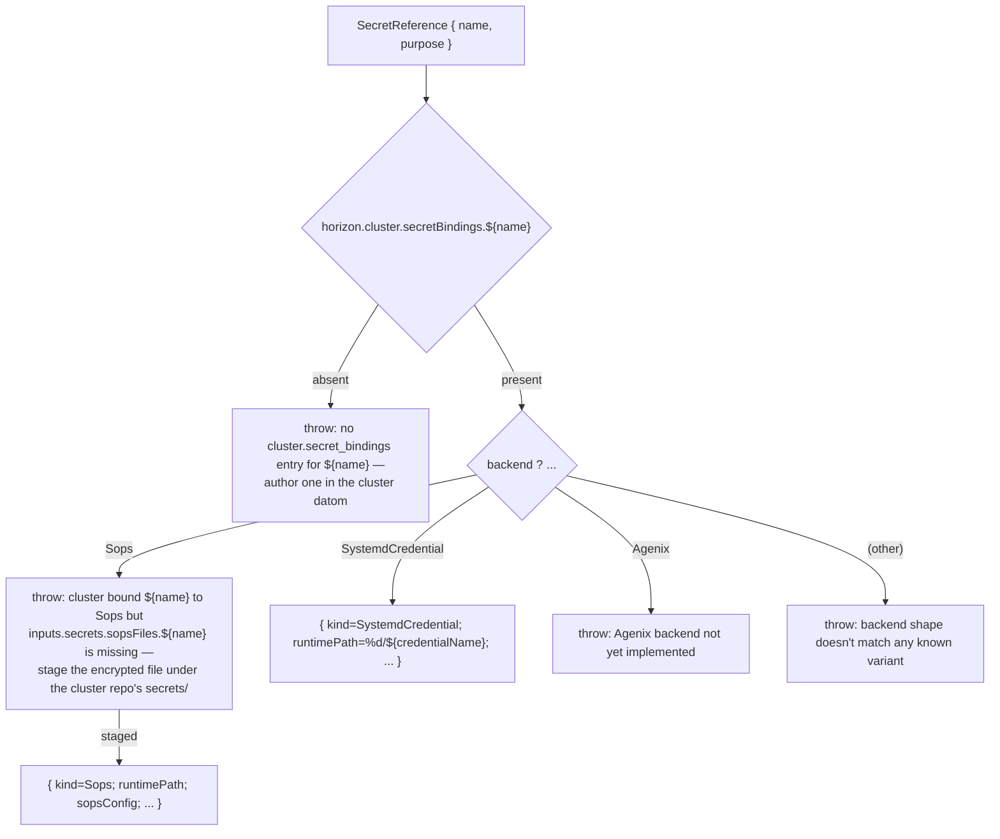
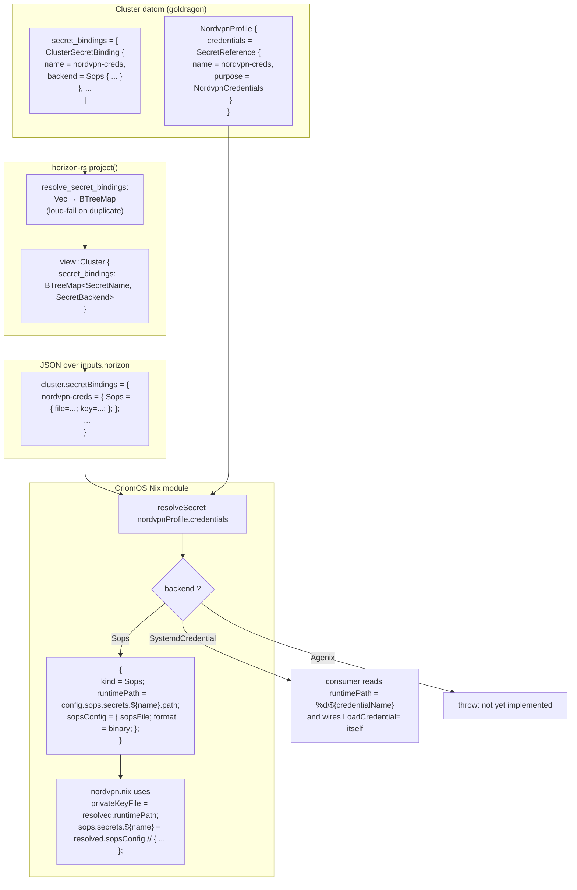

# 86 — Closing the ClusterSecretBinding arc

*Implementation report. The `secret_bindings` projection landed in
horizon-rs; a `resolveSecret` helper landed in CriomOS `secrets.nix`;
the two cluster-bypass consumers (`nordvpn.nix`,
`router/default.nix`) refactor to dispatch through the helper. This
closes the audit finding in
`reports/designer-assistant/79-gap-audit-criomos-network.md` row 5 +
row 6 — the resolver verb now belongs to the cluster's binding-table
noun, and every typed `SecretBackend` variant has a typed home in
the consumer dispatch.*

---

## TL;DR

The schema lift was the easy half: `view::Cluster` grows
`secret_bindings: BTreeMap<SecretName, SecretBackend>`,
populated by `ClusterProposal::project` from the proposal-side
`Vec<ClusterSecretBinding>` with loud-fail on duplicate names. The
consumer lift required inventing the right noun — a `resolveSecret`
function exposed via `_module.args` from `secrets.nix`, dispatching
`Sops | SystemdCredential | Agenix` to a uniform resolution record
(`{ kind, name, runtimePath, sopsConfig?, credentialName? }`). The
two flagged consumers (NordVPN credentials, router WPA3-SAE
password) drop their hand-rolled `inputs.secrets.sopsFiles.<name>`
lookups and call the helper. The JSON round-trip witness exercises
one binding per backend variant; the projection-side duplicate test
exercises the loud-fail path. Three commits landed and pushed across
two repos. Agenix stays a stub-with-throw — the schema variant
exists, the dispatch arm exists, the resolver wiring waits for the
first Agenix consumer.

---

## §1 — Schema projection (PART A)

The proposal side already carried `secret_bindings:
Vec<ClusterSecretBinding>` (per step 2 of the horizon arc, landed
pre-this-session). The view side was missing the projection — the
audit's finding #6: *"View's `Cluster` carries `vpn_profiles` but
not `secret_bindings`"*. The consumer modules **could not** dispatch
on the resolved backend because the view truncated the cluster's
resolution table before it reached the Nix layer.

### Shape choice — BTreeMap, not Vec

The proposal is authored, ordered, allows duplicates at the type
level (a `Vec<ClusterSecretBinding>`); the view is consumed,
addressed by name, must resolve uniquely (a function from
`SecretName` to `SecretBackend`). Two different concerns. The
projection collapses the authored list into a resolved map:

```rust
fn resolve_secret_bindings(&self) -> Result<BTreeMap<SecretName, SecretBackend>> {
    let mut resolved: BTreeMap<SecretName, SecretBackend> = BTreeMap::new();
    for ClusterSecretBinding { name, backend } in &self.secret_bindings {
        if resolved.contains_key(name) {
            return Err(Error::DuplicateSecretBinding { name: name.clone() });
        }
        resolved.insert(name.clone(), backend.clone());
    }
    Ok(resolved)
}
```

— `lib/src/proposal/cluster.rs:248-261`.

Duplicate authoring is a perfect-specificity violation (a function
that can't decide which mapping wins); rejecting it at projection
time means consumers never see a malformed table. The new error
variant — `Error::DuplicateSecretBinding { name: SecretName }` at
`lib/src/error.rs:62-63` — surfaces the offending name verbatim
so the operator can find it in the cluster datom.

### The new field

`lib/src/view/cluster.rs:46-58`:

```rust
/// Resolved lookup table: logical `SecretName` → concrete
/// `SecretBackend`. Projected from the proposal-side
/// `Vec<ClusterSecretBinding>` so consumers can dispatch on the
/// backend variant in O(log n) without reconstructing a map.
/// ...
pub secret_bindings: BTreeMap<SecretName, SecretBackend>,
```

`#[serde(rename_all = "camelCase")]` on `Cluster` renders the field
as `secretBindings` on the wire — what the Nix consumer reads as
`horizon.cluster.secretBindings.${name}`. BTreeMap's serde
representation is a JSON object, which Nix presents as an attrset
indexed by name — exactly the lookup shape the consumer wants.

### JSON round-trip witness

The new test in `lib/tests/cluster.rs`,
`cluster_json_round_trip_carries_every_secret_backend_variant`,
constructs a `view::Cluster` with three bindings (one per backend
variant), serializes through `serde_json`, deserializes back,
asserts:

- the wire key is `secretBindings` (the consumer-facing name);
- all three entries round-trip with their backend variants
  intact (`Sops { file, key }`, `SystemdCredential
  { credential_name }`, `Agenix { secret_id }`).

`serde_json` lands as a `[dev-dependencies]` entry on `lib/Cargo.toml`
because the test exercises the wire contract between horizon-rs
(producer) and the Nix consumer (through `inputs.horizon`'s JSON
artifact).

The projection-side test in
`lib/tests/secret.rs::duplicate_cluster_secret_binding_rejected_at_projection`
builds a minimal `ClusterProposal` with two `Sops`-and-`Agenix`
bindings on the same `SecretName`, runs `project()`, asserts
`Error::DuplicateSecretBinding` with the offending name surfaced.
Both tests pass under `cargo test --jobs 1 -- --test-threads=1`.

(One pre-existing failure surfaced in `tests/node.rs` —
`metal_arch_unresolvable_when_no_arch_set` asserts on a substring
`"no architecture"` that the current `UnresolvableArch` variant
doesn't emit. This is not caused by the work in this report; the
test failure was already present on `horizon-re-engineering`'s tip
before the projection commit. Flagged as a follow-up.)

---

## §2 — `resolveSecret` helper (PART B)

### Where it lives

`modules/nixos/secrets.nix`. The same file that imports the
sops-nix module — the natural home for every secret-resolution
affordance. Adding a sibling file (`secret-resolver.nix`) was
considered and rejected: secrets.nix is the place an operator
looks first when reading the secret-handling shape, and the
resolver is *what* the workspace's secret-handling shape is.

### How it surfaces

```nix
_module.args.resolveSecret = resolveSecret;
```

Any module that imports `secrets.nix` (network/nordvpn.nix imports
it via `../secrets.nix`; router/default.nix imports it directly via
`./secrets.nix`; the network aggregator pulls it transitively) can
take `resolveSecret` as a function argument:

```nix
{
  lib,
  pkgs,
  horizon,
  resolveSecret,
  ...
}:
```

The verb belongs to the noun (the cluster's binding table) but the
ergonomics belong to the consumer (one-line dispatch, no
config-path acrobatics).

### What it returns

A uniform resolution record. The `kind` tag preserves the
backend's identity so consumer modules with backend-specific wiring
(only `Sops` today needs `sopsConfig`) can dispatch:

| Backend | Returned fields |
|---|---|
| `Sops { file, key }` | `{ kind = "Sops"; name; runtimePath; sopsConfig = { sopsFile; format = "binary"; }; clusterAuthored = { file; key; }; }` |
| `SystemdCredential { credentialName }` | `{ kind = "SystemdCredential"; name; credentialName; runtimePath = "%d/${credentialName}"; }` |
| `Agenix { secretId }` | **throws** — not yet implemented |

`runtimePath` is the field every consumer wants. The other fields
are present when the backend needs them (sops needs activation-time
declarations; systemd needs the credential name to wire
`LoadCredential=`). The agenix arm throws verbatim:

```
secrets: cluster bound <name> to Agenix { secretId = ...; } but the
Agenix backend is not yet implemented in this resolver — file an
issue (or extend resolveSecret) when the first Agenix consumer
arrives
```

### Loud-fail discipline

Two loud-fail paths, both with operator-actionable hints:



Every error names exactly which datom entry or which staged file is
missing. The agent or operator reading the activation-time stderr
sees the path to the fix, not a stack trace.

### File:lines

`modules/nixos/secrets.nix:1-94`. Parses cleanly with
`nix-instantiate --parse`.

---

## §3 — Consumer refactors (PART C)

### `network/nordvpn.nix`

Before:

```nix
{ config, lib, pkgs, inputs, horizon, ... }:
let
  credentialsRef =
    if nordvpnProfile == null then null else nordvpnProfile.credentials;
  credentialsName =
    if credentialsRef == null then null else credentialsRef.name;
  sopsFiles = inputs.secrets.sopsFiles or { };
  credentialsSopsFile =
    if credentialsName == null then null
    else sopsFiles.${credentialsName} or null;
  privateKeyFile =
    if credentialsName == null then null
    else config.sops.secrets.${credentialsName}.path;
  ...
in {
  config = mkIf hasNordvpnPubKey (lib.mkMerge [
    (lib.mkIf (credentialsName != null && credentialsSopsFile != null) {
      sops.secrets.${credentialsName} = {
        format = "binary";
        sopsFile = credentialsSopsFile;
        mode = "0400";
        restartUnits = [ "nordvpn-connections.service" ];
      };
    })
    ...
  ]);
}
```

After:

```nix
{ lib, pkgs, horizon, resolveSecret, ... }:
let
  credentialsRef =
    if nordvpnProfile == null then null else nordvpnProfile.credentials;
  resolvedCredentials =
    if credentialsRef == null then null else resolveSecret credentialsRef;
  privateKeyFile =
    if resolvedCredentials == null then null else resolvedCredentials.runtimePath;
  ...
in {
  config = mkIf hasNordvpnPubKey (lib.mkMerge [
    (lib.mkIf (resolvedCredentials != null && resolvedCredentials.kind == "Sops") {
      sops.secrets.${resolvedCredentials.name} = resolvedCredentials.sopsConfig // {
        mode = "0400";
        restartUnits = [ "nordvpn-connections.service" ];
      };
    })
    ...
  ]);
}
```

The `enabledWithoutSops` branch goes away — that error is now
emitted by `resolveSecret` itself, with a richer message. The
`enabledWithoutProfile` branch stays because `resolveSecret` has
no opinion about whether a NordvpnProfile exists at all (that's a
profile-shape concern, not a secret-binding concern). `config` and
`inputs` drop from the function signature; the module reads neither
directly any more.

`modules/nixos/network/nordvpn.nix:1-188`.

### `router/default.nix`

Before:

```nix
{ config, lib, horizon, inputs, ... }:
let
  routerWifiPasswordSecret = routerInterfaces.wpa3SaePassword;
  routerWifiPasswordSecretName = routerWifiPasswordSecret.name;
  routerWifiSopsFiles = inputs.secrets.sopsFiles or { };
  routerWifiSopsFileExists =
    builtins.hasAttr routerWifiPasswordSecretName routerWifiSopsFiles;
  routerWifiSopsFile =
    if routerWifiSopsFileExists then
      routerWifiSopsFiles.${routerWifiPasswordSecretName}
    else
      throw "router: inputs.secrets.sopsFiles.${routerWifiPasswordSecretName} is required ...";
  ...
in {
  config = mkIf behavesAs.router {
    assertions = [{
      assertion = routerWifiSopsFileExists;
      message = "router Wi-Fi secret ${routerWifiPasswordSecretName} is missing from inputs.secrets.sopsFiles";
    }];

    sops.secrets.${routerWifiPasswordSecretName} = {
      format = "binary";
      sopsFile = routerWifiSopsFile;
      mode = "0400";
      restartUnits = [ "hostapd.service" ];
    };

    services.hostapd.radios."${routerInterfaces.wlan}".networks."${routerInterfaces.wlan}".authentication = {
      mode = "wpa3-sae";
      saePasswordsFile = config.sops.secrets.${routerWifiPasswordSecretName}.path;
    };
    ...
  };
}
```

After:

```nix
{ lib, horizon, resolveSecret, ... }:
let
  resolvedRouterWifiPassword = resolveSecret routerInterfaces.wpa3SaePassword;
  ...
in {
  config = mkIf behavesAs.router (lib.mkMerge [
    (lib.mkIf (resolvedRouterWifiPassword.kind == "Sops") {
      sops.secrets.${resolvedRouterWifiPassword.name} = resolvedRouterWifiPassword.sopsConfig // {
        mode = "0400";
        restartUnits = [ "hostapd.service" ];
      };
    })
    {
      ...
      services.hostapd.radios."${routerInterfaces.wlan}".networks."${routerInterfaces.wlan}".authentication = {
        mode = "wpa3-sae";
        saePasswordsFile = resolvedRouterWifiPassword.runtimePath;
      };
      ...
    }
  ]);
}
```

The hand-rolled `routerWifiSopsFile` triple-throw / assertions
pair collapses into a `mkIf … "Sops"` arm that consumes the
helper's `sopsConfig` directly. `config`, `inputs` drop from the
function signature. The previous module's `assertions` block had
the same intent as the helper's throw; pick the helper because the
loud-fail message it emits names the SecretReference's name *and*
the staged-file path the operator must produce, not just the name.

`modules/nixos/router/default.nix:1-231`.

---

## §4 — Commits pushed

| Repo | Commit | Subject |
|---|---|---|
| `horizon-rs/horizon-re-engineering` | `762f261c` | `cluster: project secret_bindings into view as BTreeMap<SecretName, SecretBackend>` |
| `CriomOS/horizon-re-engineering` | `09de9028` | `secrets: add resolveSecret helper dispatching on cluster.secretBindings.<name>` |
| `CriomOS/horizon-re-engineering` | `7bf7cc4d` | `nordvpn + router: dispatch secret resolution through resolveSecret helper` |

Each pushed immediately. The horizon-rs commit moved the
`horizon-re-engineering` bookmark "sideways" by one squash step
(an earlier empty-commit recovery, no functional impact); the two
CriomOS commits are clean fast-forwards.

The bookmark `horizon-re-engineering` on `origin/CriomOS` is at
`7bf7cc4d` after the last push, verified via direct
`git ls-remote ssh://git@github.com/LiGoldragon/CriomOS
horizon-re-engineering`.

---

## §5 — Open follow-ups

### Agenix backend implementation

The schema variant exists; the dispatch arm exists in
`resolveSecret`; the wiring waits for the first Agenix consumer. The
throw message names the action: *"file an issue (or extend
resolveSecret) when the first Agenix consumer arrives"*. The
extension point is one arm in the `if backend ? Sops then ... else
if backend ? SystemdCredential then ... else if backend ? Agenix
then RESOLVE-HERE`. The Agenix shape needs (a) the agenix-nix
module imported alongside sops-nix in `secrets.nix`, (b) a per-name
runtime path derivation similar to `config.sops.secrets.${name}.path`,
(c) a passthrough for the activation-time `age.secrets.${name}.file`
declaration.

### `modules/nixos/llm.nix` is a third bypass consumer

The `llm.nix` module on this branch (parent commit `54fdb13a` —
*"llm: wire AiProvider.apiKey through sops (mirror nordvpn
pattern)"*) hand-rolls the same `inputs.secrets.sopsFiles.<name>`
lookup the audit flagged in nordvpn and router. It postdates the
audit (the audit only covered network/ and router/), so the
finding wasn't filed against it — but the new helper applies
verbatim. Recommended next step: refactor `llm.nix` to consume
`resolveSecret ownProvider.apiKey` and drop the
`apiKeyMissingSops` assertion. One-commit follow-up.

### Pre-existing test failure in `tests/node.rs`

`metal_arch_unresolvable_when_no_arch_set` asserts on a substring
`"no architecture"` that the current `Error::UnresolvableArch`
message doesn't emit (the current message is *"pod node {0:?} has
no super-node and no arch of its own"*). The test was failing on
the parent commit before this report's work landed. Fix is a
one-line edit to the assertion substring or to the error message
— a sub-bd for whichever role is curating the schema cleanups
next.

### The `view::Cluster` field ordering

The new `secret_bindings` lands at the tail of `view::Cluster`,
after `vpn_profiles`. The view side is JSON-rendered and has no
positional-decoding concern (unlike the proposal-side
`ClusterProposal` which carries `#[serde(default)]` tail-position
fields to preserve positional nota decoding). View-side ordering
is purely a reading-order choice; the tail-after-vpn_profiles
position matches the field's relative-importance ordering for a
human reader of the view shape.

---

## §6 — Flow diagram: the new secret-resolution path



The verb (*"resolve a SecretReference to a runtime path"*) belongs
to the noun (*"the cluster's binding table"*). The verb's home is
`resolveSecret` in `secrets.nix`; the noun's home is
`view::Cluster.secret_bindings` in horizon-rs. Each consumer
module asks the verb a question, gets a uniform answer, dispatches
on the answer's `kind` when it needs backend-specific wiring (only
Sops, for activation-time declaration). No consumer reaches across
the boundary into `inputs.secrets.sopsFiles` any more — the
boundary is the verb's signature.

---

## §7 — What this closes and what stays open

| Audit finding | Status |
|---|---|
| #5 — `nordvpn.nix` + `router/default.nix` bypass `ClusterSecretBinding` | **Closed.** Both consumers dispatch through `resolveSecret`. |
| #6 — `view::Cluster` missing `secret_bindings` | **Closed.** Field added, projection landed, RT test exercises every variant. |
| (#5 sibling) — `llm.nix` (postdates the audit) bypasses the binding | **Open follow-up.** Same fix, one commit. |
| Agenix variant unimplemented | **Open by design.** Throw-with-hint until first consumer. |

The architectural shape now matches the audit's
`§"Pattern B — Secret resolution bypasses the cluster's binding
table"` recommendation: *"a `secretResolver` module-helper that
takes a `SecretReference` and the cluster's binding list, returns a
`runtimePath`-shaped projection the consumer reads"*. The
implementation also surfaces `sopsConfig` because activation-time
declaration is a separate concern from runtime read; both are
needed for the Sops backend; both come from one resolve call.

End of report.
