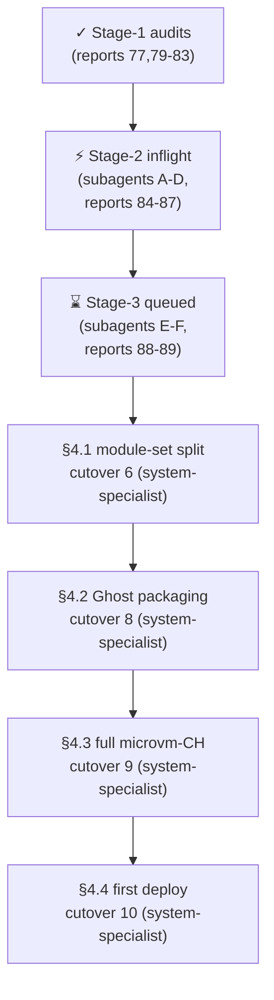

# 92 — Cloud-host arc system-specialist hand-off (and standing decisions)

*Designer-assistant hand-off. Names the design decisions made under the
user's broader authority on 2026-05-16, the implementation work currently
in flight via subagents (reports 84–87), the staged next-wave
implementation (subagents E and F), and the substantial cloud-host arc
work that remains for the system-specialist lane.*

## TL;DR

Stage-1 audit reports 79–83 surfaced the gap list against the
horizon-re-engineering arc; stage-2 implementation is in flight via four
parallel subagents (reports 84–87) landing the high-signal regression
fixes and unfinished arcs. Designer-assistant decided the open questions
under broader authority — `Substrate` lands as empty struct variants,
`NodeSpecies::CloudHost` as a new species (not derived flag), the
trust→flags lowering lives in per-substrate wrappers, native Ghost
packaging is out of arc scope, the cross-realm session-lock collapses
to system-only, `TlsTrustPolicy` extends to carry server material, and
Tailscale-protocol constants get their own attribute outside
`TailnetConfig`. After stage-2 lands, subagents E (nspawn.nix
reinstatement — cutover step 1) and F (rich `Contained` schema
additions — cutover steps 2–3) fire next. System-specialist owns the
remaining big work: the host-set/contained-set/cloud-host-set module
split (cutover step 6, the largest single change), native Ghost
packaging, the full `MicrovmCloudHypervisor` substrate, and goldragon's
first `Publication` node deployment.

---

## §1 — Standing decisions

User authorised (`2026-05-16`, *"make wise decisions on stuff that I
haven't answered. We want to develop the system, we want to use the
components better, so make wise decisions, extend where needed, and
modify where appropriate"*) and *"You can delete the orphaned window
manager stuff. And all of the dead code you can get rid of it. We can
always bring features back if we want."*).

| # | Open question | Decision | Reason |
|---|---|---|---|
| Q1 | `Substrate` per-variant fields in cut one? | **Empty struct variants** — `Substrate ::= NixosContainer {} \| MicrovmCloudHypervisor {}`. | One type per concept (ESSENCE); fields earn their place when a carrier demands them, not by speculation. |
| Q2 | Native Ghost packaging in this arc? | **Out of scope.** | Cloud-host arc lands the substrate machinery; Ghost is one consumer. Packaging is independent operator/system-specialist work. |
| Q3 | New `NodeSpecies::CloudHost` or derived flag? | **New species.** | Perfect specificity at boundaries (ESSENCE §"Perfect specificity at boundaries"); a derived flag is the same shape audit 80 finding 7 warned against with `behavesAs.iso`. |
| Q4 | trust→flags lowering location? | **Per-substrate wrappers.** `contained.nix` carries the policy helper; each substrate module does its own lowering to its primitives. | Couples substrate internals to substrate modules; dispatcher stays substrate-agnostic. |
| audit 80 §4 | Cross-realm session-lock coupling — collapse or assert? | **Collapse to system-only `loginctl lock-sessions`.** Drop the cross-realm contract. | Simpler; no per-user contract surface to maintain; Wayland-lock-aware on the system side. |
| audit 79 | Tailnet TLS server material location | **Extend `TlsTrustPolicy`** to carry server cert + key alongside `ca_certificate`. | They travel together operationally; splitting would fragment one concept across two types. |
| audit 79 | Tailscale-protocol constants location (`100.100.100.100`, `100.64.0.0/10`) | **New `TailscaleConstants` attribute** on horizon-lib's Nix surface (NOT `TailnetConfig`). | Protocol constants are not operator policy; muddying `TailnetConfig` (which IS operator policy) would mix concerns. |
| audit 81 | `nspawn.nix` deletion on horizon-re-engineering — intent? | **Regression — reinstate.** | Cutover step 1 of the cloud-host roadmap (report 78); blocks all subsequent cloud-host work. |
| audit 82 / user 2026-05-16 | Orphan WM files, `element.nix`, `wasistlos` comment — keep or delete? | **Delete freely** (no soft-delete, no comment stubs). | Per user message; per ESSENCE §"Backward compatibility is not a constraint for systems being born". Git history preserves the path. |
| audit 82 §3 | Emacs theme reading retired darkman path | **Subagent D's call** between (a) switch to chroma's path (file-poll, stop-gap) or (b) flag as future work and leave the immediate symptom fixed-default. | If chroma's interface is push-shaped, subscribe; if it's file-shaped, file-poll as transitional with a follow-up. |
| audit 81 (lojix-cli) | `lojix-cli` `sopsFiles` template still camelCase on main | **No fix on main; lives on horizon-re-engineering branch already.** | Per session context — the data-driven kebab-case template landed on the branch earlier this session; main is the legacy path retiring per closed §15. |

---

## §2 — Stage-2 implementation in flight (subagents A–D)

Four Opus subagents fired in parallel, each writing one implementation
report covering its scope. All commits land on `horizon-re-engineering`
across the relevant repos; resource posture is `--jobs 1
--test-threads=1` (cargo) and `nix-instantiate --parse` only (no compile
loads) per the day's overheating context.

| Sub | Lane | Report | Scope |
|---|---|---|---|
| A | horizon-rs Rust | `reports/designer-assistant/84-…md` | `System` serde fix (per-variant `#[serde(rename = "x86_64-linux" / "aarch64-linux")]`); `KnownModel` expansion for `ThinkPadE15Gen2Intel` (tiger), `GmktecEvoX2` (prometheus), `Rock64` (balboa); goldragon datom string rewrites; JSON round-trip test seed across `view::*` records (the contract-repo discipline gap that allowed the vpn double-wrapper). |
| B | CriomOS Nix | `reports/designer-assistant/85-…md` | Thermal regression cherry-pick (the laptop-overheating root cause); `wireguard.nix` latent crash fix (`inherit` scope + `pubKey` field name); `wifi-eap.nix` SSID literal lift (with source-constraints ini-form addition); `AiProvider.api_key` consumer hookup in `llm.nix`. |
| C | horizon-rs + CriomOS | `reports/designer-assistant/86-…md` | `ClusterSecretBinding` arc completion: project `secret_bindings` into `view::Cluster`; new `secretResolver` Nix helper dispatching by `SecretBackend`; refactor `nordvpn.nix` and `router/default.nix` consumers; JSON round-trip test for the new view shape. |
| D | CriomOS-home Nix | `reports/designer-assistant/87-…md` | `arch == "x86-64"` typo → `chipIsIntel` (i7z on zero nodes today); delete dead `services.dunst.enable` (always-false conjunction); replace stale darkman path in `profiles/med/emacs.nix`; delete orphan WM files (waybar, hyprland, sway, swayConf, element); clean delete `wasistlos` comment; add Quickshell plugin-reload note to `dictation.nix` (bd `primary-d5im`). |

**Renumbering note**: a parallel designer-assistant agent landed reports
at 84 and 85 (`90-critique-designer-184-200-deep-architecture-scan.md`
and `91-user-decisions-after-designer-184-200-critique.md` after
renaming this session — substance preserved, cross-citation updated)
before subagents A-D wrote. The original critique work moved to 90 and
91; A-D claim 84–87 as briefed.

---

## §3 — Stage-3 implementation (subagents E and F, queued)

After A–D land (avoiding jj working-copy conflicts on shared
horizon-rs and CriomOS worktrees), two further subagents fire:

| Sub | Lane | Planned report | Scope |
|---|---|---|---|
| E | CriomOS Nix | `reports/designer-assistant/88-…md` | Reinstate `modules/nixos/nspawn.nix` from main with the `criomos-nspawn` wrapper gated on `size.large && behavesAs.center`; reinstate `checks/nspawn-role-policy/` if needed. **Cloud-host cutover step 1.** |
| F | horizon-rs Rust | `reports/designer-assistant/89-…md` | Rich `Contained` schema additions: `Substrate ::= NixosContainer {} \| MicrovmCloudHypervisor {}` per Q1; `Resources { cores, ramGb }`; `ContainedNetwork { localAddress, hostAddress }`; `ContainedState { persistentPaths }`; `UserNamespacePolicy ::= PrivateUsersPick \| PrivateUsersIdentity \| PrivateUsersOff`; extend `NodePlacement::Contained` with these fields tail-positioned for NotaRecord stability; extend `view::ProjectedNodeView` to carry the new shape; JSON round-trip tests; goldragon datom defaults so existing decoding still works. **Cloud-host cutover steps 2–3.** Also lands `NodeSpecies::CloudHost` per Q3 and extends `TlsTrustPolicy` with server cert + key per audit 79 decision. |

E and F do not include the `NodeSpecies::CloudHost` and `TlsTrustPolicy`
items if subagent A's `species.rs` work hasn't merged cleanly first;
those items shift to F's commit only after A's species changes land.

---

## §4 — System-specialist work order (cloud-host arc remainder)

After subagents A–F land, the cloud-host arc still requires substantial
system-specialist work that doesn't fit a single bounded subagent. This
hand-off names that work in cutover order from report 78 §6, scoped so
each item can land as a focused operator or system-specialist push.

### §4.1 — Host-set / contained-set / cloud-host-set module split (cutover step 6)

**This is the largest single change in the arc.** Current
`modules/nixos/criomos.nix` imports every module on every node, with
internal `mkIf` gates deciding what activates. The split replaces this
with three closed module sets, picked at the top level based on
viewpoint species:

- `modules/nixos/host-set/default.nix` — what a metal host (desktop
  user, edge / hybrid / large_ai / etc.) loads. Most current
  modules, including `metal/`, `network/` (modulo router), home
  manager wiring, etc.
- `modules/nixos/contained-set/default.nix` — what a `Contained` node
  loads. Much smaller: no `metal/` hardware, no `services.thinkfan`,
  no power management, possibly no display stack depending on
  workload; networking limited to bridged endpoints.
- `modules/nixos/cloud-host-set/default.nix` — what a host whose
  primary job is hosting cloud-style contained workloads loads.
  Subset of `host-set` excluding desktop, coding utilities, AI dev
  stacks, etc.; includes `contained.nix` dispatcher.

The top-level chooser dispatches on `horizon.node.species` and
`horizon.node.behavesAs.virtual_machine`. Acceptance is a side-by-side
`toplevel.drvPath` diff per fixture (fieldlab.nota, goldragon's
existing nodes): the split must NOT change the closure of any existing
node-type that's already deploying. New node-types (`CloudHost`,
`Publication`) get fresh closures.

**Inputs needed**: the module-load gating inventories in reports
80 §"Module-load gating", 81 §"Module-load gating inventory", and 82
§"Module-load gating inventory" are the input data. Each names every
module its scope owns + the cloud-host gate it should grow.

**Risk**: silent module-load drift surfaces only at deploy. Mitigation
is the toplevel-derivation diff; every existing fixture must compile
to a byte-identical closure pre/post split for the node types it
currently covers.

### §4.2 — Native Ghost packaging (cutover step 8)

`pkgs.ghost` in nixpkgs is a name collision (points at an unrelated
Python tool, per research report 77). Native Ghost needs a CriomOS-owned
derivation. Likely shape:

- `packages/ghost/default.nix` in CriomOS — derivation building Ghost
  from upstream sources (Node.js / pnpm-based; the canonical install
  is Docker Compose, which `skills/nix-discipline.md` rejects).
- `modules/nixos/services/ghost.nix` — service module consuming the
  derivation + horizon's Publication-node settings (database via
  PostgreSQL or SQLite; reverse proxy via Caddy or nginx;
  ACME/Let's Encrypt for the public surface).

This work is the *first concrete Publication-class native-NixOS
service* and pins the pattern for everything that follows. Plan 04 §P6
inlined the Ghost shape (handover §"Ghost as Publication"); read that
before designing.

### §4.3 — Full `MicrovmCloudHypervisor` substrate (cutover step 9)

Subagent F lands the empty `MicrovmCloudHypervisor {}` variant; the
substrate module must implement the lowering. Per research report 77
§"microvm.nix" and §"Networking":

- Consume `microvm.nix` flake input (github:astro/microvm.nix) added to
  CriomOS's flake.nix.
- Per-contained-node `microvm@<name>.service` shape; virtiofs-shared
  `/nix/store` (closure dedup preserved); cloud-hypervisor as the
  hypervisor for the first cut (boot time <150ms, virtiofs + full
  network).
- Networking: bridge or veth pair into the cluster LAN per Q1's empty
  `MicrovmCloudHypervisor {}` (network shape inherited from
  `ContainedNetwork`, not substrate-specific).

Acceptance: a `Publication` node in fieldlab.nota runs a placeholder
nginx vhost inside a microvm; `nix flake check` green on
CriomOS-test-cluster.

### §4.4 — Goldragon's first Publication node (cutover step 10)

Depends on §4.2 (Ghost packaging) and §4.3 (microvm substrate). The
operator-side prep is in handover §"Operator-side prep" step 13.
Hyacinth is the named candidate in Plan 04. The deploy chain:

1. Add Publication node to goldragon's datom.
2. Author `services/ghost.nix` consumption.
3. lojix deploys to the chosen host (containing the Publication
   node).

Designer-assistant signs off on the schema shape before this lands.

### §4.5 — Smaller system-specialist follow-ups not in the cloud-host arc

These came out of stage-1 audits and are operator/system-specialist
shape; not in any subagent's scope:

- **Concern split of `modules/nixos/metal/default.nix`** (bd item
  `primary-gfc0`; audit 80 Finding 3): the file mixes ten concerns in
  523 lines. Subagent B's thermal cherry-pick lands the regression fix
  but leaves the concern-mixing intact; the split is independent work.
- **`KnownModel` stringly-typed model dispatch in `metal/default.nix`**
  (audit 80 Finding 2): six `model == "ThinkPadT14Gen2Intel"` sites and
  the `modelKernelModulesIndex` map should consume `computerIs.*`
  booleans. Depends on subagent A's `KnownModel` expansion landing
  first; then refactor in CriomOS.
- **`disks/preinstalled.nix` typed-enum re-encoding** (audit 80 Finding
  5): `fsTypeFor` and `bootloader == "Uefi"` triples re-encode the
  closed Rust enums. Codec belongs on the projection side.
- **`Editor`/`AiProtocol`/`TextSize` stringly-typed dispatch** in Nix
  consumers (audit 83 closed §17 unfinished): the capability derivation
  pattern from closed §17 (`Vec<ProposalCapability>` with Override/Off
  per capability) is the larger redesign; the immediate fix is closing
  the open-string side of the projection.
- **`unused-inputs` check** (bd item `primary-k9kj`, handover
  §"Operational debt"): static-grep check that fails if a flake input
  is declared but not read.
- **Lojix daemon implementation** (bd `primary-sff`, the canonical
  replacement for `lojix-cli` per closed §1 + §15) — the existing
  handover §"Lojix daemon — the next major arc" is the input.

---

## §5 — Outstanding items not yet assigned

Surfaced by the audits but not in any subagent's current scope and not
named in §4 above:

- **Niri polling shapes** in `profiles/min/niri.nix` (audit 82): the
  `lockListener` 2-second poll for session existence (D-Bus `SessionNew`
  signal would push) and the `saveScreenshot` 50ms × 20 file-existence
  poll. The screenshot poll is documented as acceptable transitional;
  the session poll deserves a push replacement.
- **DomainProposal, WireguardProxy, ProjectedNodeView** untested in
  contract repo (audit 83). Subagent A's JSON RT seed covers the
  view-side records; the proposal-side surface deserves similar
  round-trip discipline.
- **Goldragon datom coverage gaps** (audit 83): five schema surfaces
  never witnessed by either fixture (DomainProposal, LinkLocalIp,
  WireguardProxy / WireguardPubKey, wifi_cert true, wants_printing true,
  online=false). Not bugs; gaps in test coverage that fixtures should
  grow.
- **Closed §17 capability derivation pattern** (audit 83): the full
  Override/Off-per-capability shape is the largest open design change.
  Per cloud-host §K rec 5, deferred to the lojix-daemon arc.

---

## §6 — Acceptance summary for the cloud-host arc

The arc is complete when:

1. ✅ Audit reports 77–83 land (done).
2. ⚡ Subagents A–D land (in flight).
3. ⌛ Subagents E–F land (queued).
4. System-specialist §4.1 module split lands with byte-identical
   closure diff for existing node types.
5. System-specialist §4.2 native Ghost packaging lands.
6. System-specialist §4.3 full `MicrovmCloudHypervisor` substrate lands.
7. System-specialist §4.4 first Publication node deploys to goldragon.

After step 7, the standing goal — "complete the re-engineering, tested
in sandbox and working" — is met for the cloud-host axis as well as the
schema-arc axis.

---

## See also

- `reports/designer-assistant/77-nix-container-hosting-prior-art-research.md`
  — substrate research feeding the roadmap.
- `reports/designer-assistant/78-criomos-cloud-host-implementation-roadmap.md`
  — the full 10-step cutover and option matrices (these decisions
  collapse §"Open questions" Q1–Q4 from that report).
- `reports/designer-assistant/79-gap-audit-criomos-network.md` through
  `83-gap-audit-horizon-consumer-alignment.md` — the gap findings
  driving stage-2 work.
- `reports/system-assistant/15-handover-2026-05-15.md` — the
  schema-arc handover this hand-off builds on.
