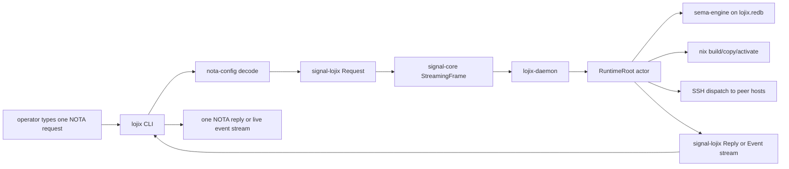
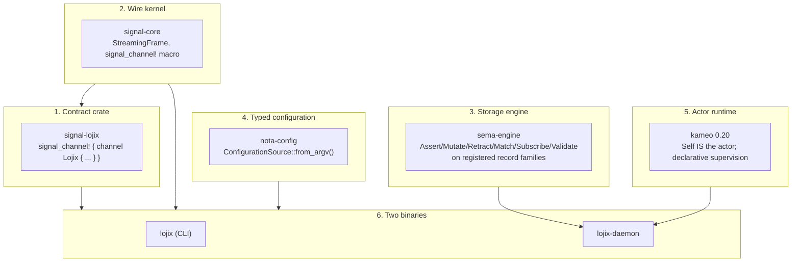
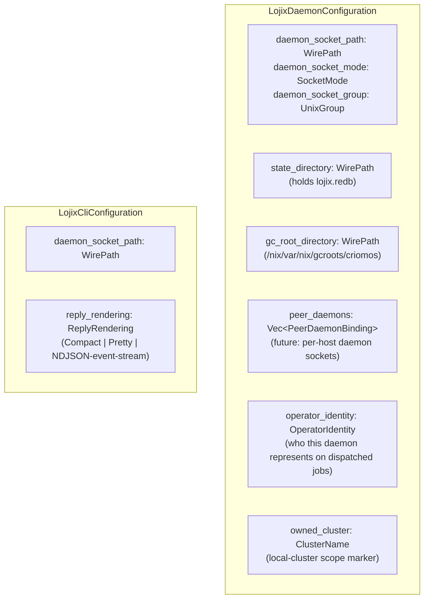
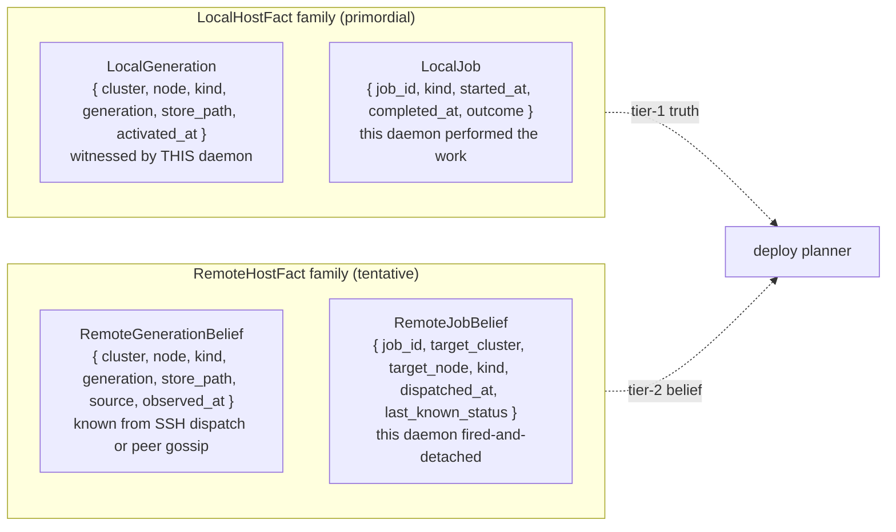
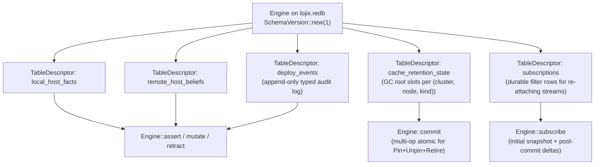
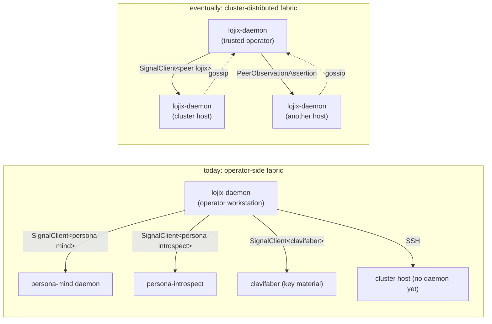

# 94 — lojix daemon design on the Persona Engine pattern

*Architecture research for the new lojix stack — `lojix-daemon`
long-lived deploy orchestrator plus thin `lojix` CLI — applying
the Persona Engine pattern, the typed `nota-config` boundary, and
a state model that distinguishes locally-known facts from
tentatively-known peer-cluster facts.*

> **Status (2026-05-16):** Research pass. No code edits. Picks up
> where `reports/designer/180-lojix-daemon-cli-implementation-research.md`
> stopped — that report identifies six implementation gaps (A–F)
> on the existing `horizon-re-engineering` worktree scaffolding
> and proposes an eight-wave landing sequence. This report adds
> what /180 did not yet name: the typed-configuration boundary,
> the lojix-daemon's *state-of-knowledge* model (primordial vs
> tentative), the sole-operator invariant ("correctness through
> foreknowledge and complete control" — the Rust-compiler-style
> framing the user named), and the daemon-as-client surface the
> eventual per-host distribution shape requires.

> **Scope (today vs eventually).** Today: one cluster-operator
> workstation runs one `lojix-daemon`; per-host daemons do not
> exist yet; cross-host work happens through SSH. Eventually:
> per-host daemons run on each cluster host and gossip typed
> deploy facts over `signal-core`. This report names today's
> shape rightly while keeping the eventually-distributed shape
> reachable without retrofit.

---

## 0 · TL;DR

The new lojix stack is **Persona Engine, applied to deploy
orchestration**:



The shape matches `persona-mind` exactly:

| Persona | Lojix | What it is |
|---|---|---|
| `mind` CLI | `lojix` CLI | Thin client; one NOTA in, one NOTA (or stream) out. |
| `persona-mind` daemon (binary `persona-mind-daemon`) | `lojix-daemon` | Long-lived Kameo actor system. |
| `signal-persona-mind` | `signal-lojix` | Typed wire contract via `signal_channel!`. |
| `signal-core` frames | `signal-core` frames | `StreamingFrame` carrying length-prefixed rkyv archives. |
| `sema-engine` on `mind.redb` | `sema-engine` on `lojix.redb` | Typed durable state with structural atomicity. |
| `nota-config` (consumer) | `nota-config` (consumer) | Both binaries decode typed `<X>DaemonConfiguration` from argv. |

What's distinctive about lojix vs `persona-mind`:

- **The state model has a provenance axis.** A `Generation` fact
  about the local host is *primordial*: the daemon performed the
  build/copy/activate itself and witnessed completion. The same
  fact about a peer host is *tentative*: the daemon either
  remembers what it dispatched (via SSH, until per-host daemons
  land) or remembers what a peer daemon told it. The two are
  modelled as **distinct typed record families** in
  `sema-engine`, not as a `Provenance` enum on one family — the
  type system carries the distinction.
- **The sole-operator invariant is load-bearing.** Lojix is the
  *only* component that invokes `nix build`, `nix copy`, or `nix
  switch` against cluster hosts. That sole authority is what
  makes the local-host live-set true-by-construction. Out-of-band
  `nix` invocations are out-of-scope failures, not edge cases —
  the Rust-compiler analogy the user named: correctness comes
  from controlling *all* the writes, not from observing arbitrary
  ones.
- **Daemon-as-client is in scope from day one.** Even before
  per-host daemons exist, the operator-side daemon will need to
  query `persona-mind` for tracked deploy items, push observations
  to `persona-introspect`, and ask `clavifaber` about per-host
  key material. The generic `SignalClient` surface (Gap E in
  /180) earns its place because the eventual per-host gossip
  uses the same mechanism.
- **Trust is a property of the channel, not the request.** Some
  daemons may push jobs (version-switches) onto peer hosts;
  others only observe. Today that gradient is enforced through
  SSH access. Eventually it's enforced through a typed
  capability claim on the `signal-core` handshake. Both are
  channel properties; neither belongs in the request payload.

---

## 1 · The shape — Persona Engine, applied

The Persona Engine pattern has six load-bearing pieces. Each
maps directly into the new lojix stack:



The pattern carries five hard rules (per `skills/contract-repo.md`,
`skills/actor-systems.md`, `skills/push-not-pull.md`,
`skills/rust/crate-layout.md`, and ESSENCE §"Perfect specificity
at boundaries"):

1. **The contract crate has no behavior.** `signal-lojix` owns
   typed records, validation newtypes, and the channel
   declaration. No actors, no storage, no I/O, no `tokio`.
2. **The CLI is a thin client.** `lojix` reads one NOTA record,
   constructs one typed request, opens the daemon socket, sends
   one Signal frame, prints one NOTA reply (or streams events
   until the subscription closes), exits.
3. **The daemon owns its `redb`.** No other process touches
   `lojix.redb`; the CLI never opens it.
4. **State enters and leaves through the actor tree.** No
   `Arc<Mutex<_>>` between actors. Every plane that owns state,
   IO, identity-minting, time-stamping, or transaction ordering
   is a typed Kameo actor.
5. **Push, never poll.** Subscribers register; the daemon
   pushes observation events as they occur. No reconciliation
   loops, no tick timers.

These are all already named in `lojix/ARCHITECTURE.md`'s 24
constraints (C1–C24). The remainder of this report names what
the architecture does *not* yet cover.

---

## 2 · Configuration — `nota-config` as the typed boundary

The user named the configuration shape explicitly: "the CLI will
take a NotaConfig — there's a new library for that now." That
library is `nota-config` at
`github:LiGoldragon/nota-config`, designed in
`reports/designer/183-typed-configuration-input-pattern.md` ("typed
configuration input pattern — every Persona-stack binary reads
its configuration through `ConfigurationSource::from_argv()`,
decodes into the binary's own typed configuration record, and
runs; environment variables are not a control-plane channel for
production binaries").

### 2.1 Per-binary configuration records (no shared monolith)

Each binary owns its own typed configuration record. The contract
crate (`signal-lojix`) is the natural home for these — same
pattern as `signal-persona-message::MessageDaemonConfiguration`
in `persona-message`'s architecture (§"State and Ownership":
"the daemon requires a typed `MessageDaemonConfiguration` on
argv whose `router_socket_path` names the router's internal
socket; it exits at decode time if the configuration is missing
or malformed").

Two typed records:



`LojixDaemonConfiguration` uses `impl_rkyv_configuration!` (so
the supervised launcher can pre-decode an rkyv archive and pass
its path; faster startup, validated at supervisor build time).
`LojixCliConfiguration` uses `impl_nota_only_configuration!`
(human-typed argv; no rkyv path for an interactive CLI).

Both decode via `ConfigurationSource::from_argv()` — inline NOTA,
`.nota` file, or (daemon only) `.rkyv` file. No environment
variables on the production path. Per `nota-config`'s test-shim
discipline, the `_with_test_env_fallback(env_var)` form exists
only in test code with an explicit per-binary env var name.

### 2.2 What configuration does NOT carry

By construction, the typed configuration is the *control plane* —
who I am, where my sockets live, where my state lives, who my
peers are. The *data plane* (which deploy to run, which generation
to retire, what to query) arrives over the wire as `signal-lojix`
requests. The configuration record never names a deploy plan; the
request never names a socket path.

This is the same split `persona-message-daemon` follows: typed
`MessageDaemonConfiguration` for the control plane;
`signal-persona-message` requests for the data plane.

---

## 3 · State model — primordial vs tentative

This is the central new design substance. The user named it
sharply: *"the local host data is more primordial; the other
host is more tentative."*

### 3.1 Two families of fact, two table families

The standard temptation is to put a `provenance: Provenance` enum
on a single `HostFact` record. **Don't.** That's the
fragmented-by-flag shape ESSENCE §"Perfect specificity at
boundaries" forbids. Two different kinds of fact deserve two
different types.



Two `sema-engine`-registered record families:

| Family | Records | Provenance |
|---|---|---|
| `local_host_facts` | `LocalGeneration`, `LocalJob` | This daemon performed the operation; the fact is witnessed. |
| `remote_host_beliefs` | `RemoteGenerationBelief`, `RemoteJobBelief` | This daemon dispatched via SSH (or received via peer gossip); the fact is what we expect, not what we know. |

The `source` field on belief records is typed:

```text
RemoteFactSource (closed enum)
  | SshDispatch { ssh_target, exit_code, captured_at }
  | PeerDaemonGossip { peer_daemon_identifier, observation_id, observed_at }
  | OperatorAssertion { operator_identity, asserted_at }  -- manual entry
```

The consumer is the deploy planner: when it answers *"is host X
on generation G?"*, the local answer is authoritative and the
remote answer is best-known. The two never merge into one
fact; queries against either family carry the family's name in
their type, so a caller can't confuse them.

### 3.2 Why not a `Provenance` enum on one family?

Two reasons:

1. **The query shape differs.** Local-fact queries are about *what
   is true*; remote-belief queries are about *what we think, with
   what confidence*. A consumer that mixes the two surfaces is
   trying to do statistics on data that should be type-separated.
2. **The write paths differ.** A local fact is asserted by the
   daemon's own build/copy/activate actors when those actors
   complete. A remote belief is asserted by the dispatcher when
   it fires off SSH work and updated by the (future) peer-gossip
   subscriber. Different writers, different invariants — two
   typed families make the difference type-checked.

The user's framing: *"those are going to be kind of seen
separately."* Two record families enshrine that separation.

### 3.3 Sema-engine table shape



Each table is one `Engine::register_table` call at startup. The
multi-op `Engine::commit` is structural atomicity for cache
retention transitions (atomically retire-N-pin-1 in one
transaction). No separate `Atomic` verb — the
`NonEmpty<WriteOperation>` shape *is* the atomic boundary, per
the closed six-root verb spine in `signal-core`.

### 3.4 The sole-operator invariant

The user named this in the Rust-compiler analogy: *"because it's
the only deployer, then it's kind of like how the Rust compiler
guarantees some things by making sure that some things can only
happen a certain way."*

Stated as a typed invariant:

> **Lojix is the sole operator of host-generation transitions
> within its scope of authority.** No other component invokes
> `nix build`, `nix copy`, or `nix switch` against hosts in
> `LojixDaemonConfiguration.owned_cluster`. The
> `local_host_facts` table for the daemon's own host is therefore
> true-by-construction (every transition went through this
> daemon's actor tree); the `remote_host_beliefs` table for
> dispatched-to hosts is true-by-construction *up to dispatch
> outcome* (every SSH-dispatched transition produced the
> dispatcher's typed `RemoteFactSource::SshDispatch` entry; the
> per-host truth is whatever the SSH dispatch reported).

This becomes the architectural-truth test:
`out_of_band_nix_invocation_breaks_local_fact_correctness`. The
test invokes `nix-env --switch-profile` on a host outside the
daemon's actor tree, then queries `local_host_facts`, and
demonstrates the divergence. The divergence is not a bug in
lojix — it's a *violation of lojix's scope of authority*. The
architectural commitment is that the scope is enforced by
operator discipline (today), then by socket-level cluster-host
admission (tomorrow).

This is what makes the type-system framing real: the daemon's
internal state is correct iff its authority is honoured.

---

## 4 · Wire — `signal-lojix` channel shape

Per /180 §3 Gap D, the contract's destination shape uses the
streaming-channel grammar so push-not-poll is structural, not
aspirational. Adapted for the per-host distribution future and
the local/remote provenance split:

```text
signal_channel! {
    channel Lojix {
        request Request {
            // Local-cluster deploy operations
            Assert    DeploymentSubmission(DeploymentSubmission),
            Mutate    CacheRetentionRequest(CacheRetentionRequest),

            // Queries — both families
            Match     LocalHostQuery(LocalHostQuery),
            Match     RemoteHostBeliefQuery(RemoteHostBeliefQuery),
            Match     DeployEventQuery(DeployEventQuery),

            // Subscriptions — push, not poll
            Subscribe DeploymentObservation(DeploymentObservationFilter)
                      opens DeploymentEventStream,
            Subscribe CacheRetentionObservation(CacheRetentionObservationFilter)
                      opens CacheRetentionEventStream,
            Subscribe LocalHostFactObservation(LocalHostFactFilter)
                      opens LocalHostFactStream,
            Subscribe RemoteHostBeliefObservation(RemoteHostBeliefFilter)
                      opens RemoteHostBeliefStream,

            // Peer-daemon gossip (future per-host distribution)
            Assert    PeerObservationAssertion(PeerObservationAssertion),

            // Stream closure
            Retract   StreamClose(StreamToken),
        }
        reply Reply {
            DeploymentAccepted(DeploymentAccepted),
            DeploymentRejected(DeploymentRejected),
            CacheRetentionAccepted(CacheRetentionAccepted),
            CacheRetentionRejected(CacheRetentionRejected),
            LocalHostListing(LocalHostListing),
            RemoteHostBeliefListing(RemoteHostBeliefListing),
            DeployEventListing(DeployEventListing),
            StreamOpened(StreamOpenedAck),
            PeerObservationAccepted(PeerObservationAccepted),
            LojixRequestUnimplemented(LojixUnimplementedReason),
        }
        event Event {
            DeploymentPhaseEvent(DeploymentPhase)
                belongs DeploymentEventStream,
            CacheRetentionTransition(CacheRetentionTransition)
                belongs CacheRetentionEventStream,
            LocalHostFactCommitted(LocalHostFactCommitted)
                belongs LocalHostFactStream,
            RemoteHostBeliefRevised(RemoteHostBeliefRevised)
                belongs RemoteHostBeliefStream,
        }
        stream DeploymentEventStream {
            token StreamToken;
            opened StreamOpened;
            event DeploymentPhaseEvent;
            close StreamClose;
        }
        stream CacheRetentionEventStream {
            token StreamToken;
            opened StreamOpened;
            event CacheRetentionTransition;
            close StreamClose;
        }
        stream LocalHostFactStream {
            token StreamToken;
            opened StreamOpened;
            event LocalHostFactCommitted;
            close StreamClose;
        }
        stream RemoteHostBeliefStream {
            token StreamToken;
            opened StreamOpened;
            event RemoteHostBeliefRevised;
            close StreamClose;
        }
    }
}
```

Two notable additions over /180's sketch:

- **`PeerObservationAssertion`** — the inbound gossip from a
  peer daemon. When per-host daemons land, each peer pushes its
  own local facts as our remote beliefs. Today this is unused;
  carrying it in the contract from day one is cheap and avoids
  a schema bump when distribution arrives.
- **`LocalHostFactObservation` / `RemoteHostBeliefObservation`**
  streams — `persona-introspect` and any operator UI subscribe
  to these instead of polling. The two streams are typed
  separately so introspection clients dispatch on type, not on
  a provenance enum.

Each subscribe variant `opens` exactly one stream; each event
variant `belongs` to exactly one stream. The `signal_channel!`
macro enforces the cross-references at compile time per
`signal-core`'s ARCH §3 ("Macro grammar is wrapped in `channel
<ChannelName> { ... }`. Required blocks: `request` and `reply`.
Streaming channels add `event` plus one or more `stream
<StreamName>` blocks. Subscribe variants annotate `Subscribe
Foo(...) opens <StreamName>`; event variants annotate `Foo(...)
belongs <StreamName>`").

---

## 5 · Actor topology

The runtime root is non-ZST (per `actor-systems.md` §"Runtime
roots are actors" and lojix ARCH C8) and carries child
`ActorRef`s as state. Children are organized by plane:

```mermaid
flowchart TB
    root["RuntimeRoot<br/>{ store_kernel, deploy_supervisor, observation_supervisor,<br/>  peer_client_pool, socket_acceptor, operator_identity }"]

    root --> store["StoreSupervisor"]
    store --> kernel["StoreKernel<br/>(dedicated OS thread; owns sema-engine handle)"]
    store --> local_facts["LocalFactLedger"]
    store --> remote_beliefs["RemoteBeliefLedger"]
    store --> event_log["EventLogActor"]
    store --> retention["RetentionLedger"]

    root --> deploy["DeploySupervisor"]
    deploy --> eval["HorizonEvalActor<br/>(reads horizon-rs in-process)"]
    deploy --> build["NixBuildActor<br/>(Template 3: tokio::process)"]
    deploy --> copy["NixCopyActor"]
    deploy --> activate["NixActivateActor"]
    deploy --> gc["GcRootActor<br/>(/nix/var/nix/gcroots/criomos tree)"]

    root --> observation["ObservationSupervisor"]
    observation --> deploy_sub["DeploymentEventPublisher"]
    observation --> retention_sub["RetentionEventPublisher"]
    observation --> local_sub["LocalFactSubscriptionPublisher"]
    observation --> remote_sub["RemoteBeliefSubscriptionPublisher"]

    root --> peers["PeerClientPool"]
    peers --> mind_client["SignalClient&lt;persona-mind&gt;"]
    peers --> introspect_client["SignalClient&lt;persona-introspect&gt;"]
    peers --> peer_lojix["SignalClient&lt;peer lojix-daemon&gt;<br/>(future per-host distribution)"]

    root --> socket["SocketAcceptor<br/>(/run/lojix/daemon.sock)"]
```



Per `kameo.md` §"Blocking-plane templates":

- `StoreKernel` runs on a dedicated OS thread (Template 2 —
  redb work is synchronous and frequent).
- `NixBuildActor` / `NixCopyActor` / `NixActivateActor` use
  Template 3 (`tokio::process::Command` with `kill_on_drop` and
  bounded `timeout`).
- SSH dispatch to peer hosts uses Template 1 (`spawn_blocking`
  + `DelegatedReply`) — short blocking exec calls, no async
  `ssh` equivalent in the std ecosystem.

`RuntimeRoot` is the only bare Kameo spawn site. Every other
actor is spawned through its parent supervisor with declared
`RestartPolicy` per `kameo.md` §"Supervision".

---

## 6 · The CLI body — one NOTA in, one NOTA (or stream) out

The CLI is structurally smaller than `persona-mind`'s `mind`
binary because lojix's request shape is simpler. Three argv
modes, all dispatched through `nota-config`:

```mermaid
flowchart LR
    argv["argv"] --> cs["ConfigurationSource::from_argv()"]
    cs --> mode{first arg}
    mode -->|"starts with ("| inline["inline NOTA"]
    mode -->|".nota"| file["NOTA file"]
    mode -->|".rkyv"| rkyv["rkyv file (operator-prebuilt)"]
    inline --> decode["ConfigurationRecord::decode::&lt;LojixCliConfiguration&gt;()"]
    file --> decode
    rkyv --> decode
    decode --> request_arg{request arg}
    request_arg -->|"inline NOTA"| req["signal_lojix::Request"]
    request_arg -->|".nota request file"| req
    req --> open["open daemon socket"]
    open --> handshake["signal-core handshake"]
    handshake --> send["send one StreamingFrame"]
    send --> path{reply shape}
    path -->|"single Reply"| print_one["print one NOTA"]
    path -->|"Subscribe → stream"| print_many["print events until StreamClose<br/>or until SIGINT → send StreamClose"]
    print_one --> exit["exit"]
    print_many --> exit
```



A minimal invocation:

```sh
# Operator types one NOTA deploy request inline:
lojix '(DeploymentSubmission criome tiger FullOs (Switch) (NamedBuilder prometheus))'

# Operator types a longer one from a file:
lojix /etc/lojix/deploy-tiger.nota

# Or with explicit configuration (test path; production binary
# is supervised and pre-given a typed config):
lojix-daemon /etc/lojix/daemon.rkyv

# Subscription stays attached until the operator sends SIGINT:
lojix '(DeploymentObservation (DeploymentObservationFilter (Cluster criome)))'
```

The CLI exits with a typed exit code per
`LojixUnimplementedReason` and `Reply::Rejected.reason`, not a
prose-only error message.

---

## 7 · The daemon-as-client surface (Gap E from /180)

The user surfaced this in the prior session: *"create the
possibility for this daemon to then talk to the rest of our
infrastructure directly with signal."* The user's new message
adds the more concrete framing: *"some lojix daemons will run on
more trusted hosts that have more privilege to push jobs like
switching versions on other hosts."*

The same surface serves both today's needs (the operator daemon
calling `persona-mind` for tracked deploy items) and tomorrow's
(the trusted operator daemon dispatching version switches to
per-host daemons).



The generic shape (recommended in /180 §6 Q2, repeated here):

```text
daemon/client.rs
  pub struct SignalClient<RequestPayload, ReplyPayload, EventPayload> {
      stream: tokio::net::UnixStream,
      lane:   ExchangeLane,
      next_sequence: LaneSequence,
      operator_identity: OperatorIdentity,
      ...
  }

  impl<R, P, E> SignalClient<R, P, E> {
      pub async fn connect(peer_socket: WirePath,
                           operator_identity: OperatorIdentity) -> Result<Self, Error>;
      pub async fn send_request(&mut self, request: Request<R>) -> Result<Reply<P>, Error>;
      pub async fn subscribe(&mut self, request: Request<R>) -> Result<SubscriptionHandle<E>, Error>;
  }
```

Parameterised over the peer contract crate's payload types. The
operator-side daemon holds one per peer (mind, introspect, etc.);
the eventual cluster-distributed shape holds one per peer
lojix-daemon.

`SignalClient` is itself a typed actor (`SignalPeerClientActor`)
held in `PeerClientPool`, not bare async code on the actor
handlers' paths. That preserves the no-blocking-handlers rule
per `kameo.md` and `actor-systems.md`.

---

## 8 · Trust gradient — channel property, not request payload

The user named a trust gradient: *"some lojix demons will run on
more trusted hosts that have more privilege to push jobs like
switching versions on other hosts, which is currently enforced by
controlling the SSH access."*

This is critical for design: **trust is a property of the
connection, not the request**. Putting "I have privilege X" into
the request payload makes every request a re-asserted claim; an
attacker (or a buggy peer) can claim anything. Putting it on the
channel makes it a property of how the connection was
authenticated — verified once at handshake, valid for the
session, and aligned with ESSENCE §"Infrastructure mints identity,
time, and sender" ("sender comes from the connection's auth
proof, not the message body").

Today's enforcement: SSH access control. A host that can SSH into
peer hosts as a privileged user can dispatch version switches;
others can only observe via SSH-read commands. The operator
configures this through standard SSH key distribution.

Eventually: the `signal-core` handshake carries a typed capability
claim verified by `clavifaber`-issued material. The daemon's
handshake handler refuses Subscribe-only peers from issuing
`DeploymentSubmission`; it refuses unknown peers entirely. The
typed capability lives in `signal-core` (or a `signal-persona-auth`
peer) so the policy is the same across components.

This is *intentionally not yet in the contract*. The current
`signal-lojix` channel accepts every request from any
authenticated peer; today's deployment context is one operator
running one daemon, with SSH as the trust boundary. The channel
capability layer lands when per-host daemons land.

---

## 9 · Local-cluster scope today, multi-cluster eventually

The user named scope: *"concerns itself mostly with its own
cluster, at least for now."* The configuration record carries
`owned_cluster: ClusterName`; the daemon refuses
`DeploymentSubmission` whose target is not its owned cluster
(typed `Reply::Rejected` with reason
`DeploymentOutOfClusterScope`).

This is a *positive* constraint, not a deferred-feature note. The
local-cluster scope is what makes the sole-operator invariant
realistic — one daemon authoritatively owns one cluster's deploy
state. Multi-cluster operation is a *federation* problem (one
operator-side daemon per cluster; cross-cluster requests dispatch
to the peer daemon owning the target cluster), not a single-daemon
problem. Today, the operator workstation runs one daemon per
cluster they operate, or one daemon that names a single cluster
in its configuration. Either way, the per-daemon scope is one
cluster.

The future federation shape is `SignalClient<peer lojix>` against
a peer operator's daemon owning the target cluster, with the
typed handshake naming which cluster each peer is sovereign over.
That's the same daemon-as-client surface as today's `persona-mind`
client — one fabric, many peers.

---

## 10 · Where /180's gaps fit in this design

This report does not re-do /180's gap audit. The cross-reference,
with inline summaries:

- **Gap A** (signal-lojix macro lags signal-core — `signal-lojix`
  needs the `channel <Name> { ... }` outer wrap per the
  proc-macro grammar): wave-1 mechanical fix, captured in the
  §4 macro invocation above (already uses the new shape).
- **Gap B** (Cargo.lock pins stale — `signal-core`,
  `sema-engine`, `sema` need bumping on the lojix worktree):
  `cargo update` after kernel readiness landed via OA/121 +
  operator/121.
- **Gap C** (sema-engine Assert-overwrite + fmt fixes):
  **closed**. OA/121 landed the assertion duplicate-key check;
  the lojix daemon can rely on Assert-as-fresh semantics for
  the local-fact write path.
- **Gap D** (observation shape — reply variants or streamed
  events): §4 above adopts the streaming shape from day one.
  The four streams (`DeploymentEventStream`,
  `CacheRetentionEventStream`, `LocalHostFactStream`,
  `RemoteHostBeliefStream`) make push-not-poll structural.
- **Gap E** (daemon-as-client capability — generic vs
  per-relation): §7 above recommends generic, with per-relation
  actors holding typed instances. Same shape `persona-mind`
  uses for its inter-component calls.
- **Gap F** (lojix/ARCHITECTURE.md §6 collision — three sections
  share the §6 header): editorial; renumber when the next
  ARCH edit lands.

---

## 11 · Open questions for the user

Each carries inline context per `skills/reporting.md`
§"Questions to the user — paste the evidence, not a pointer."

### Q1 — Local vs remote families: two record families, or one with `Provenance` enum?

Per §3.1 above, my recommendation is **two families** —
`local_host_facts` and `remote_host_beliefs` register separately
in `sema-engine`. The split makes the type system enforce the
query-shape difference (authoritative reads vs best-known reads)
and the writer difference (own actors vs SSH dispatcher / peer
gossip subscriber).

The alternative is one family `host_facts` with a
`provenance: HostFactProvenance` field. Smaller schema, but the
type system stops carrying the "what kind of truth is this"
distinction; consumers can confuse local with remote facts; the
two writer paths now share a table.

Recommendation: **two families.** Cost: two `register_table`
calls and two parallel query plans. Benefit: type-checked
provenance everywhere it matters.

### Q2 — Should the daemon assert authority over its own cluster's host even when SSH dispatch fails partially?

When the daemon dispatches a version switch via SSH and the SSH
exit code is nonzero but the build artifact was already copied
and partially activated, what does `remote_host_beliefs` record?

Options:
- (a) `RemoteFactSource::SshDispatch { exit_code, captured_at }`
  with a typed `partial_outcome` field. The belief reflects
  "uncertain — SSH errored mid-activation."
- (b) The belief reflects only successful dispatches; partial
  dispatches produce a `Rejection` reply with no state change.
  Operator must manually inspect and either retry or assert the
  belief through `OperatorAssertion`.

Recommendation: **(a)** — the belief is what we *believe* the
host is in, including "we're unsure because dispatch errored
partway." That matches the tentative shape. (b) would silently
discard the most operationally interesting state (an
in-flight-but-broken activation).

### Q3 — Should `DeploymentSubmission` carry the trust capability today, or accept all-comers and rely on socket-permission?

Today's daemon binds `/run/lojix/daemon.sock` with mode 0660 and
the cluster-operator group. Anyone in that group can issue any
request. Tomorrow, the handshake will carry a typed capability
verified through `clavifaber`; until then:

Options:
- (a) Accept every request from any authenticated peer (today's
  shape). Rely on Unix group membership as the trust gate.
- (b) Add a placeholder typed capability now (a
  `CapabilityClaim` field on the handshake) that the daemon
  validates against a hard-coded "trust everyone" policy.
  Lifts the shape into the contract today; the policy
  tightens later.

Recommendation: **(a)** — the capability layer is real
infrastructure work (clavifaber-issued material, handshake
extension, validator). Don't add a placeholder that ships unused;
the schema bump when the real layer lands will be a clean break
and easier to reason about. The Unix group is a real (if
coarse) trust gate.

### Q4 — Per-host daemons: same `lojix` crate with a third binary, or a separate `lojix-host` repo?

The eventual per-host daemon runs on every cluster host (not just
the operator workstation), holds *its own* `local_host_facts`,
gossips them upward to operator daemons, and accepts dispatched
work from trusted operator daemons.

Options:
- (a) Third binary in the `lojix` crate: `lojix-host-daemon`.
  Shares the actor tree, the `sema-engine` table registrations,
  and the wire vocabulary; differs in which subset of requests
  it accepts (smaller — no `DeploymentSubmission` from outside;
  yes `PeerObservationAssertion` from upstream operator daemons).
- (b) Separate `lojix-host` repo: its own crate, its own ARCH,
  its own scope. Shares the `signal-lojix` contract but builds
  independently.

Recommendation: **(a)** initially — the actor tree, the storage
shape, and the wire vocabulary are 90% the same. The role
difference (operator vs host) is captured in
`LojixDaemonConfiguration.role: LojixDaemonRole`
(`Operator { owned_cluster }` vs `Host { hosting_cluster,
upstream_operator }`). Two binaries in one crate; one storage
shape; one actor tree that gates on role at the request
dispatcher. Split into (b) only if the host daemon grows enough
divergent surface to justify the boundary. Today's per-component
discipline (`skills/micro-components.md`) doesn't force the split
when two roles share a capability — and these two roles share
"manage a deploy state engine for a node."

### Q5 — The `lojix` CLI subscription closing — Path A (reply-side close) or symmetric close?

`signal-persona-mind` decided Path A: the producer emits
`MindReply::SubscriptionRetracted` to close a stream the
consumer opened (per signal-persona-mind ARCH §3.1.5
"Subscription close uses Path A reply-side variant"). The
client can't pre-emptively retract through a separate request.

For `lojix`, the CLI is interactive — an operator running `lojix
'(DeploymentObservation ...)'` and pressing Ctrl-C should close
the subscription cleanly. Options:

- (a) Same as `signal-persona-mind` — Path A only. On SIGINT,
  the CLI drops the socket; the daemon detects disconnect and
  closes server-side.
- (b) Add a `Retract StreamClose(StreamToken)` request variant
  (already in /180 §3 Gap D's sketch) so the CLI can send a
  graceful close before disconnect.

Recommendation: **(b)** — keep `StreamClose` in the contract.
The CLI can send it on SIGINT before dropping the socket; the
daemon can also emit a `SubscriptionRetracted`-style event on
its own terms (peer disconnect, timeout). Both close paths are
valid; the contract makes the graceful one explicit. This
diverges from `persona-mind`'s Path A only because lojix's CLI
is operator-facing and SIGINT-shaped, whereas `mind`'s
subscriptions are mostly long-lived component-to-component.

### Q6 — Configuration record location: in `signal-lojix` or in `lojix`?

`persona-message-daemon` keeps `MessageDaemonConfiguration` in
its consumer crate's contract (`signal-persona-message`),
per nota-config ARCH §"Cross-cutting context"
("per-component contract crates own their typed
`<X>DaemonConfiguration` records"). For lojix:

- (a) `LojixDaemonConfiguration` + `LojixCliConfiguration` in
  `signal-lojix`. Both binaries import them via the contract
  crate. Maximally symmetric with `persona-message`.
- (b) Configuration records in `lojix` itself (the consumer
  crate). The contract crate stays purely wire-shaped.

Recommendation: **(a)** — matches the workspace pattern;
keeps configuration shape under coordinated schema control
alongside wire shape (same audit, same versioning, same
`nix flake check` round-trip witnesses). The contract carries
both kinds of typed boundary records.

---

## 12 · Suggested next move

This report does the design work; the implementation pickup
order matches /180 §4 Wave 1–8, with the following adjustments
based on this report's substance:

- **Wave 1.5 (new):** Configuration scaffolding — add the two
  `<X>Configuration` records to `signal-lojix`, install the
  appropriate `impl_*_configuration!` macros, scaffold both
  binaries' `main` around
  `ConfigurationSource::from_argv().decode::<…>()`. Cheap to
  land standalone; downstream waves rely on it.
- **Wave 2 onward:** As /180 names, but with the table shape
  from §3.3 (two record families, separate registration) and
  the streaming-channel grammar from §4.
- **Wave 3.5 (new):** Sole-operator invariant test — the
  architectural-truth test
  `out_of_band_nix_invocation_breaks_local_fact_correctness`
  per §3.4. Lands as part of constraint C13/C14's witnesses.
- **Wave 6 (existing):** Generic `SignalClient` surface per §7;
  this report keeps the recommendation but adds the
  cluster-host peer use case alongside the operator-side
  peer use case.

The actual coding belongs to operator or system-specialist. The
designer's lane (and this designer-assistant's) ends at the
shape decisions named here and the open questions in §11. After
the user answers, this report's substance migrates into
`lojix/ARCHITECTURE.md` as new constraints (per
`skills/reporting.md` §"Kinds of reports — and where their
substance ultimately lives": architecture decisions go to the
relevant ARCH).

---

## See also

- `reports/designer/180-lojix-daemon-cli-implementation-research.md`
  — prior research pass. Identifies six implementation gaps
  (A–F) on the existing worktree scaffolding; proposes an
  eight-wave landing sequence. This report builds on /180 by
  adding the typed-configuration boundary, the
  primordial-vs-tentative state model, the sole-operator
  invariant, and the daemon-as-client surface for both
  today's needs and the eventual per-host distribution.
- `reports/designer/183-typed-configuration-input-pattern.md`
  — designs `nota-config` as the typed-configuration boundary
  pattern (every Persona-stack binary reads typed
  configuration via `ConfigurationSource::from_argv()`; env
  vars are not a production channel). The new lojix follows
  this pattern.
- `/git/github.com/LiGoldragon/lojix/ARCHITECTURE.md` — the
  24 constraints (C1–C24) for the new lojix stack; this
  report's substance migrates here on user answer.
- `/git/github.com/LiGoldragon/signal-lojix/ARCHITECTURE.md`
  — the typed wire vocabulary; receives the configuration
  records per Q6 and the streaming-channel shape per §4.
- `/git/github.com/LiGoldragon/persona-mind/ARCHITECTURE.md`
  — the canonical Persona Engine implementation; the
  structural template this report applies.
- `/git/github.com/LiGoldragon/persona-message/ARCHITECTURE.md`
  — the closest cousin (a daemon + thin CLI ingress
  component); the `nota-config`-based control-plane discipline
  shows here in production form.
- `/git/github.com/LiGoldragon/sema-engine/ARCHITECTURE.md`
  — the typed database engine; this report's §3.3 table
  registrations target this surface.
- `/git/github.com/LiGoldragon/signal-core/ARCHITECTURE.md`
  — the wire kernel; `StreamingFrame` and the
  `signal_channel!` proc-macro are the substrate the wire in
  §4 uses.
- `/git/github.com/LiGoldragon/nota-config/ARCHITECTURE.md`
  — the typed-configuration library; §2 above consumes it.
- `~/primary/skills/actor-systems.md` — actor density,
  no-public-ZST-actor-noun, blocking-plane templates; §5
  applies these.
- `~/primary/skills/kameo.md` — Kameo runtime usage; §5's
  three blocking-plane templates come from §"Blocking-plane
  templates".
- `~/primary/skills/contract-repo.md` — contract-crate
  pattern; §4's channel declaration is one
  `signal_channel!` invocation per the pattern.
- `~/primary/skills/push-not-pull.md` — the producer pushes,
  the consumer subscribes; §4's four streams structurally
  enforce this.
- `~/primary/ESSENCE.md` §"Perfect specificity at boundaries"
  — the rule that drives §3.1's two-record-families choice
  over a `Provenance` enum.
- `~/primary/ESSENCE.md` §"Infrastructure mints identity,
  time, and sender" — drives §8's "trust is channel
  property, not request payload" stance.
