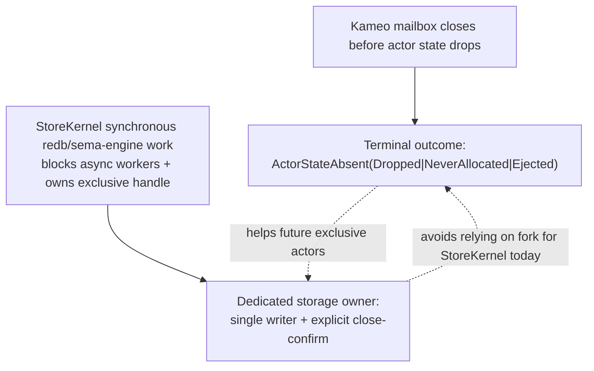
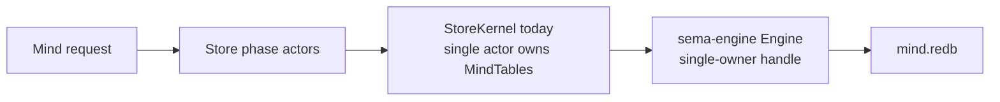

# 96 — Independent POV: kameo lifecycle and exclusive resources

Date: 2026-05-16
Role: designer-assistant
Scope: independent research pass after `reports/designer/202` and
`reports/designer/203`, with emphasis on what Persona actually needs
for `StoreKernel` and future exclusive-resource actors.

## 0. Position

Update after designer's Akka-shaped contract note:

> The public Kameo contract should be one terminal wait returning one
> path-aware outcome. Lifecycle facts are implementation/test facts, not
> the user API.

I agree with the canonical sentence:

> Persona follows the Erlang/OTP + Akka release-before-notify discipline,
> but implements it explicitly because Rust/Tokio does not provide it at
> the runtime level.

My skeptical refinement is:

> The ranch pattern is correct as inspiration, but the proposed
> `KernelHandleOwner + TxnWorker pool over Arc<Database>` mapping is too
> loose for `StoreKernel`. For mind storage, the beautiful shape is
> single-owner, single-writer, explicit close-confirm. Read concurrency
> can be added later only when the snapshot semantics are named.

The release-before-notify fix and the exclusive-resource topology split
are not substitutes. They close different holes:



## 1. What the field actually gives us

### 1.1 Erlang/OTP

Erlang gives the strongest conceptual precedent: exit/down signals are
not sent until directly visible Erlang resources are released. The
current docs say this explicitly for link exit signals, monitor `down`
signals, and `alive_request` replies.

The important caveat is equally explicit: the guarantee is for
resources directly visible to the Erlang runtime. Heap-held resources,
dirty native code, and process identifier reuse have their own caveats.
A Rust redb handle inside a Tokio actor is closer to native/heap-owned
state than to an ETS table owned by BEAM. OTP tells us the order we
want, not a mechanism Rust gives us for free.

Implication: copy OTP's **discipline**:

```text
release state/resource before death notification
```

Do not pretend Rust/Tokio gives us BEAM's VM-level guarantee.

### 1.2 Akka Classic

Akka Classic is the best source-level ordering reference. Its
`finishTerminate` path calls user cleanup (`aroundPostStop`) and then,
in a chained `finally` sequence, detaches the dispatcher, notifies the
parent, and tells watchers. The source comment says the order is
crucial.

Akka proves release-before-notify is not our invention. It does not
prove we should expose every intermediate phase. The stronger reading
is the opposite: the framework should make the internal ordering true,
then expose a single truthful terminal event.

Rust differs:

- `on_stop().await` can be arbitrarily long.
- `Drop` is synchronous and cannot await.
- Tokio task detachment lets work outlive handles.
- Persona actors own local exclusive resources, not only GC-backed
  objects or pooled clients.

Implication: copy Akka's **ordering** and Akka's public restraint. Rust
needs stronger internal awaits; it does not need a larger public
lifecycle surface.

### 1.3 Ranch

Ranch is the best topology reference, but the exact mapping matters.
Ranch keeps the listening socket lifetime outside the cheap restartable
acceptor workers. The listener/supervisor owns the socket; acceptors
borrow it to accept connections. Routine worker death does not release
or rebind the socket.

For Persona, the transferable lesson is:

```text
keep the exclusive resource in a long-lived owner;
restart work-doing planes around it.
```

The non-transferable part is "many workers freely borrow the resource."
TCP accepts are independent. `sema-engine` commits are not. The
workspace's `sema-engine` architecture already says `Engine` is a
single-owner handle and component daemons must serialize calls through
one actor because concurrent callers can race the commit log.

### 1.4 Service Fabric

Service Fabric is useful mostly as a warning. Official docs say actor
object lifetime is virtual: state outlives the object in the State
Manager; deactivation releases object references and state is restored
on reactivation. The docs also say actors are not garbage-collected
while executing a method, and warn against blocking callers with
unpredictable I/O.

I did not find a primary Microsoft quote saying "exclusive file locks
and port bindings are explicitly listed as actor anti-patterns." That
claim may be a correct inference from the model, but it should be
written as inference unless a primary source is found.

Implication: Service Fabric reinforces that if state can live outside
the actor object, the actor can be disposable. Persona's `StoreKernel`
is the opposite unless we deliberately move the durable handle into a
separate owner.

## 2. The StoreKernel mapping needs a sharper design

Current code:

- `StoreKernel` owns `MindTables`.
- `MindTables` owns the `sema-engine` / `sema` handle over
  `mind.redb`.
- `StoreKernel` handles every durable claim, activity, thought,
  relation, subscription, and graph read/write message directly.
- The architecture says `StoreKernel` should eventually run on a
  dedicated OS thread because every handler performs synchronous redb /
  sema-engine work.
- The same architecture says current Kameo 0.20
  `supervise(...).spawn_in_thread()` is unsafe because parent shutdown
  can observe child closure before the actor's `Self` drops the redb
  handle.

This is not just an "exclusive resource" problem. It is also an
**ordering** problem:



A generic `TxnWorker` pool over `Arc<Database>` risks breaking that
shape:

- redb permits concurrent reads, but only one write transaction.
- `begin_write()` blocks while another writer exists.
- `sema-engine` has a commit log and snapshot sequence; its architecture
  says concurrent callers on one `Engine` can race.
- Passing raw `Arc<Database>` to workers bypasses the engine's
  single-owner constraint unless every worker goes through the same
  engine owner anyway.

Therefore my StoreKernel recommendation is narrower than designer/203:

```text
DatabaseOwner / EngineOwner:
  owns MindTables or sema-engine Engine
  owns the redb handle
  runs on a dedicated OS thread
  serializes all writes
  exposes explicit CloseAndConfirm

Store phase actors:
  remain Kameo actors on async runtime
  send typed requests to the owner
  do not hold Database, Engine, MindTables, or write transactions

Optional read workers:
  only after read snapshot semantics are named
  never share write ownership
```

The ranch lesson still applies, but as "separate owner from restartable
domain phases," not as "pool database workers immediately."

## 3. Working lifecycle model

The Kameo fork should stop modelling lifecycle as a linear `Ord` enum.
Its public surface should collapse to a single terminal wait:

```rust
pub struct ActorTerminalOutcome {
    pub state: ActorStateAbsence,
    pub reason: ActorTerminalReason,
}

pub enum ActorStateAbsence {
    Dropped,
    NeverAllocated,
    Ejected,
}

pub enum ActorTerminalReason {
    Stopped,
    Killed,
    Panicked,
    StartupFailed,
    CleanupFailed,
}
```

The framework may keep internal lifecycle facts for tests, debugging,
or Persona introspection, but those facts should not become the normal
user API:

```rust
pub enum ActorLifecycleFact {
    Prepared,
    Starting,
    Running,
    AdmissionStopped,
    InFlightWorkEnded,
    ChildrenAbsent,
    CleanupHookFinished,
    ActorStateAbsent(ActorStateAbsence),
    RegistryEntryAbsent,
    LinkSignalsDispatched,
    TerminalResultVisible,
    Terminated(ActorTerminationPath),
}
```

These facts are useful as implementation witnesses: tests can assert
that `CleanupHookFinished` and `ActorStateAbsent(Dropped)` happen before
the framework dispatches the terminal signal. Public callers should not
wait on `CleanupHookFinished`, `LinkSignalsDispatched`, or
`RegistryEntryAbsent` directly. They call `wait_for_shutdown()` and
inspect the returned `ActorTerminalOutcome`.

The terminal outcome carries the path information that the public
ordinal enum tried and failed to encode. `Terminated` must never imply
`Dropped`; `ActorTerminalOutcome.state` says whether the actor was
`Dropped`, `NeverAllocated`, or `Ejected`.

Startup failure becomes honest:

```text
Prepared
Starting
AdmissionStopped
ChildrenAbsent
ActorStateAbsent(NeverAllocated)
RegistryEntryAbsent
LinkSignalsDispatched
TerminalResultVisible
Terminated(StartupFailed)
```

Normal completion becomes:

```text
Prepared
Starting
Running
AdmissionStopped
InFlightWorkEnded
ChildrenAbsent
CleanupHookFinished
ActorStateAbsent(Dropped)
RegistryEntryAbsent
LinkSignalsDispatched
TerminalResultVisible
Terminated(Completed)
```

State ejection is separate:

```text
ActorStateAbsent(Ejected)
```

No caller should infer ejection or dropping from a generic terminal
phase.

## 4. `watch` is right for current truth, not durable truth

Tokio `watch` retains only the latest value. That is correct for:

```text
wait until this lifecycle target is satisfied
```

It is not an audit log. Persona must mirror lifecycle facts it cares
about into component sema state / introspection logs. The Kameo
watcher tells a supervisor what is true now; Persona's Sema log tells
an agent what happened.

## 5. Implementation bar

### 5.1 Kameo fork

Minimum acceptable fork shape:

- no public ordinal phase waits;
- exact lifecycle facts or target predicates;
- fallible waits;
- strong and weak refs use the same implementation;
- no direct weak wait on `shutdown_result`;
- `shutdown_result` set at the same terminal boundary on every path;
- `LinkSignalsDispatched` either awaited honestly or removed;
- registry removal has one path-aware contract;
- state ejection is a separate API and reports `Ejected`;
- tests cover startup failure, slow `on_stop`, slow `Drop`,
  weak/strong waits, registry ordering, link dispatch, and child-before-
  parent release.

### 5.2 StoreKernel

Minimum acceptable StoreKernel topology:

- one owner of `MindTables` / `Engine` / redb handle;
- no other actor opens `mind.redb`;
- no worker stores a long-lived raw `Arc<Database>` unless the
  architecture explicitly proves it cannot bypass engine ordering;
- writes are serialized through one owner;
- sync redb/sema-engine work does not run on Tokio's shared worker pool;
- shutdown has an explicit close-confirm path that proves:
  - admission is closed;
  - in-flight transactions have finished or aborted;
  - the owner has dropped `MindTables` / `Engine` / redb handle;
  - a fresh process can reopen the same `mind.redb`.

The key test is practical:

```text
start owner on dedicated thread
write claim/activity/graph rows
request close-confirm
wait for confirmation
open same mind.redb in a fresh owner or fresh process
read rows successfully
```

If that test cannot pass, the topology is not done.

## 6. My recommendation

Adopt Path C, but refine it:

```text
Path C' — Akka-shaped terminal outcome + single-owner storage topology
```

Do not implement a general `TxnWorkerPool` for StoreKernel writes yet.
Implement a dedicated owner / single-writer storage plane with explicit
close-confirm. Add read workers later only if a report names their
snapshot semantics and proves they do not bypass `sema-engine`'s
single-owner constraint.

Keep Kameo lifecycle redesign moving in parallel. It is the right
framework repair and it will help future actors that cannot decompose.
The public Kameo API should stay small: one terminal wait, one terminal
outcome, one death signal. Internal lifecycle facts belong in tests and
diagnostics, not in everyday actor code.

`StoreKernel` should not wait for the fork. Its immediate shape can be
correct with explicit close-confirm and one storage owner.

## 7. Sources

- Erlang process documentation:
  <https://www.erlang.org/doc/system/ref_man_processes.html>
- Erlang supervisor principles:
  <https://erlang.org/documentation/doc-15.0/doc/system/sup_princ.html>
- Ranch listener documentation:
  <https://ninenines.eu/docs/en/ranch/2.0/guide/listeners/>
- Ranch manual:
  <https://ninenines.eu/docs/en/ranch/2.2/manual/ranch/>
- Akka Classic `FaultHandling.scala`:
  <https://raw.githubusercontent.com/akka/akka/main/akka-actor/src/main/scala/akka/actor/dungeon/FaultHandling.scala>
- Akka Typed lifecycle documentation:
  <https://doc.akka.io/libraries/akka-core/current/typed/actor-lifecycle.html>
- Service Fabric Reliable Actors introduction:
  <https://learn.microsoft.com/en-us/azure/service-fabric/service-fabric-reliable-actors-introduction>
- Service Fabric actor lifecycle:
  <https://learn.microsoft.com/en-us/azure/service-fabric/service-fabric-reliable-actors-lifecycle>
- Service Fabric actor state management:
  <https://learn.microsoft.com/en-us/azure/service-fabric/service-fabric-reliable-actors-state-management>
- Tokio `JoinHandle`:
  <https://docs.rs/tokio/latest/tokio/task/struct.JoinHandle.html>
- tokio-util `TaskTracker`:
  <https://docs.rs/tokio-util/latest/tokio_util/task/struct.TaskTracker.html>
- Tokio `watch`:
  <https://docs.rs/tokio/latest/tokio/sync/watch/index.html>
- redb `Database`:
  <https://docs.rs/redb/latest/redb/struct.Database.html>
- redb `Builder` file-lock note:
  <https://docs.rs/redb/latest/redb/struct.Builder.html>
- redb `WriteTransaction`:
  <https://docs.rs/redb/latest/redb/struct.WriteTransaction.html>
- Local `sema-engine` architecture:
  `/git/github.com/LiGoldragon/sema-engine/ARCHITECTURE.md`
- Local `persona-mind` StoreKernel:
  `/git/github.com/LiGoldragon/persona-mind/src/actors/store/kernel.rs`
- Local `persona-mind` storage architecture:
  `/git/github.com/LiGoldragon/persona-mind/ARCHITECTURE.md`
