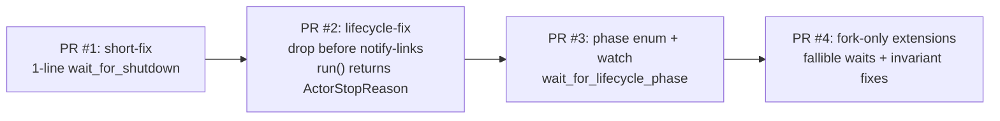

# 96 — Audit: operator/126 kameo push-only-lifecycle branch review

Date: 2026-05-16
Role: designer-assistant
Scope: audit of `reports/operator/126-kameo-push-only-lifecycle-branch-review.md`
against the actual `LiGoldragon/kameo` branch
`kameo-push-only-lifecycle` (`1b918b01`) plus
companion branches `kameo-shutdown-short-fix` (`8f44e1a7`)
and `kameo-shutdown-lifecycle-fix` (`4ba9c255`), plus
prior-art survey across Erlang/OTP, Akka Typed,
Proto.Actor, Orleans, Elixir, Tokio, Ractor, and
structured-concurrency systems.

## 0. TL;DR

The report's review of the branch is **substantially correct**.
Every line reference verifies; every decision A-Q matches the
actual code; the test passes as described; the two named "High"
findings (weak `wait_for_shutdown_result` inconsistency,
`PreparedActor::run()` API break) are real and load-bearing.

Eight gaps the report did not surface — the last three
contributed by a parallel designer-assistant pass (Codex) on
the same source:

1. **`unregister_actor` ordering is inconsistent across paths.**
   On the success path, deregistration runs *between* `CleanupFinished`
   and `drop(actor)` — so the registry says "gone" before the
   resource is released. On the startup-failure path,
   deregistration runs *after* `LinksNotified` — opposite
   ordering. The phase contract is not the only contract; the
   registry contract is silently inconsistent.

2. **Startup failure never marks `CleanupFinished` or
   `StateReleased`.** A caller waiting on
   `wait_for_lifecycle_phase(StateReleased)` on this path
   returns *true* (because `Terminated > StateReleased`
   ordinally) — *even though state was never released*.
   This is a **false witness**, not a hang. See §2.8 for the
   deeper consequence: linear `PartialOrd` is the wrong wait
   primitive for paths that don't visit every phase.

3. **`notify_links(...)` consumes the `mailbox_rx`.** The mailbox
   is genuinely closed (sender's `is_closed()` becomes true)
   *during* the `notify_links` call — placing mailbox closure
   *between* `StateReleased` and `LinksNotified`. Three "alive"
   semantics now coexist on the same actor:
   `ActorRef::is_alive` (mailbox-closed-based, transitions late),
   `WeakActorRef::is_alive` (shutdown_result-based, transitions
   at `CleanupFinished`), and the new lifecycle phase. The
   report flagged the strong-vs-weak naming drift but not the
   third semantics introduced by the branch.

4. **`mark(phase)` is a non-atomic read-modify-write.** Fine
   today because only the runtime loop calls `mark` (a single
   async task), but the field is `pub(crate)` — any future
   change that publishes phase from a sibling task or a
   `Drop` impl will silently race.

5. **`LinksNotified` is misnamed at *two* levels.** The branch's
   `notify_links` is a sync function that uses `tokio::spawn(...)`
   internally (verified at `src/links.rs:112-141`) and returns
   immediately. When `LinksNotified` is marked, even the
   notification *dispatch* futures haven't been polled yet —
   they're in the Tokio scheduler queue. So the phase fires:
   - before signals have been dispatched (futures unpolled);
   - before linked peers have processed `on_link_died` (signals
     not consumed).
   The naming overpromises by two scheduler hops.

6. **`StateReleased` only proves `Self` was dropped, not every
   resource.** Arc-shared resources persist (`Arc<Database>` in
   theory; the workspace prohibits it but the contract doesn't
   enforce). Detached `tokio::spawn` workers survive `Self`'s
   drop. Delegated handles, `Box::leak`, `mem::forget` —
   all escape the guarantee. The TcpListener test happens to
   work because the listener is owned directly. Either rename
   (`SelfDropped`) or document the contract narrowly.

7. **`shutdown_result` is set at asymmetric phase positions.**
   On success and on_stop-error: set between `StateReleased` and
   `notify_links`. On startup failure: set *after* `LinksNotified`
   and `unregister_actor`. Mixed semantics — callers using
   `shutdown_result.wait()` (which `WeakActorRef::wait_for_shutdown_result`
   does today, see report's High finding) observe different
   relative-phase positions on different paths.

8. **The `watch` channel is the right primitive for current
   state, but the wrong tool for lifecycle history/audit.**
   `watch` retains only the latest value — fine for "wait
   until phase X" — but no help for "show me every phase
   transition this actor went through." If Persona wants
   lifecycle introspection (e.g., for a daemon's child-exit
   audit log), the phase observations must be mirrored into
   a separate durable event log. The kameo branch's
   contribution is observation, not history; design accordingly.

Plus four findings from the prior-art surveys:

1. **The `LinksNotified` phase has no precedent.** Akka,
   Proto.Actor, and Erlang all use the link/watch *notification
   itself* as the "links notified" marker — the watcher *is* the
   audience, so a separate phase is redundant. Either name a
   specific non-watcher consumer for `LinksNotified` (metrics,
   cancel-token, runtime shutdown coordinator) or fold it into
   `Terminated`. (See §3.)

2. **The "release-before-notify" ordering has source-level
   prior art in Akka classic.** Akka's
   `akka-actor/.../FaultHandling.scala::finishTerminate` calls
   `aroundPostStop()` and *then* `tellWatchersWeDied()` with the
   in-source comment *"the following order is crucial for things
   to work properly."* Proto.Actor's `ActorContext.cs::FinalizeStopAsync`
   awaits `DisposeActorIfDisposable()` *before* sending
   `Terminated` to watchers. The kameo branch is rediscovering a
   well-validated pattern; the design doc should cite both. (See §5.)

3. **Loom JEP 480 is the cleanest two-phase Rust-adjacent
   precedent.** `StructuredTaskScope` distinguishes
   `join()` (subtask completed) from `close()` (thread
   terminated). Two separately observable edges. Modern Java
   added this *specifically* because subtask-result and
   thread-finalization are different events. The kameo fork's
   8-phase stream is the generalization. (See §4.)

4. **Async-Drop is not landing in the design window.** It is
   nightly-only, no RFC accepted, `withoutboats` argues the
   `async fn drop` shape is wrong, and the language team is
   exploring linear-types alternatives ("Move, Destruct, Forget,"
   2025-10). The fork must implement release-observation as an
   *explicit protocol*, which is exactly what `StateReleased`
   on a `watch` channel is. The design doesn't depend on async-Drop
   ever shipping. (See §5.)

The branch is the right *direction*, not the right *shape* for
landing. We recommend:

- **PR #1** (`kameo-shutdown-short-fix`) ships as-is.
- **PR #2** (`kameo-shutdown-lifecycle-fix`) ships as-is.
- **PR #3** is a substantive redesign of the phase model:
  set-of-flags instead of `PartialOrd`, `notify_links` awaiting
  dispatch, `LinksNotified` folded into `Terminated`,
  `StateReleased` renamed to `SelfDropped` (or docs narrowed).
- **PR #4** is fork-only: fallible waits, asymmetry fixes,
  `is_alive` deprecation, OTP-shape shutdown timeouts,
  public-docs invariant.

See §6 for the staging plan in full.

## 1. Verification of operator/126's claims

The report claims 17 line-anchored decisions. I verified each
against `git show origin/kameo-push-only-lifecycle:<path>`.
Every quoted line and every described behavior matches.

| Decision | Claim | Verified |
|---|---|---|
| A — `ActorLifecyclePhase` 8 variants | `src/actor/lifecycle.rs:3-26` | ✓ exact |
| B — `tokio::sync::watch` | `src/actor/lifecycle.rs:28-60` | ✓ exact |
| C — monotonic `mark` | `src/actor/lifecycle.rs:39-43` | ✓ exact |
| D — lifecycle on both ref kinds | `actor_ref.rs:51-59, 2179-2187` | ✓ exact |
| E — `lifecycle_phase()`/`wait_for_lifecycle_phase()` | `actor_ref.rs:228-238, 2216-2226` | ✓ exact |
| F — `wait_for_shutdown` waits for `Terminated` | `actor_ref.rs:656-671, 2341-2349` | ✓ exact |
| G — shutdown-result waits wait for `Terminated` | `actor_ref.rs:737-750, 820-827, 2369-2376` | ✓ partial — see §2 |
| H — lifecycle in `PreparedActor::new_with` | `spawn.rs:59-76` | ✓ exact |
| I — `run/spawn/spawn_in_thread` stop returning `A` | `spawn.rs:123, 136, 154-157, 173-180` | ✓ exact |
| J — `Starting` before `on_start` | `spawn.rs:190-196` | ✓ exact |
| K — `Running` after startup success | `spawn.rs:204-207` | ✓ exact |
| L — `Stopping` after loop exits | `spawn.rs:209-220` | ✓ exact |
| M — children stopped before parent on_stop | `spawn.rs:222-235` | ✓ exact |
| N — `CleanupFinished` after on_stop | `spawn.rs:236-240` | ✓ exact |
| O — drop before `StateReleased` | `spawn.rs:245-247, 260-265` | ✓ exact |
| P — notify links after state release | `spawn.rs:252-258, 270-276` | ✓ exact |
| Q — `Terminated` last | `spawn.rs:257-258, 275-276, 317-321` | ✓ exact |

The report's two "High" findings, three "Medium" findings, and one
"Low" finding all reproduce on the branch. The test
`lifecycle_phase_waiters_are_push_driven_and_terminal_is_post_release`
passes; the regression it guards is real (a `ResourceActor` holding a
`TcpListener` with a 300ms `Drop` delay; `wait_for_lifecycle_phase(StateReleased)`
returns only after `Drop` completes and the port is free to rebind).

The companion branches are also as advertised:

- `kameo-shutdown-short-fix`: a one-line change to
  `actor_ref.rs:648` — `wait_for_shutdown` now awaits
  `self.shutdown_result.wait()` instead of
  `self.mailbox_sender.closed()`. 207-line test
  (`tests/shutdown_order.rs`) using the same `ResourceActor`
  pattern.
- `kameo-shutdown-lifecycle-fix`: same one-line change in
  `actor_ref.rs` plus the spawn.rs reorganization that
  introduces drop-before-notify-links ordering and breaks
  `run()`'s return signature. 173-line test.

The report's recommendation in §8 — "land the smaller
`kameo-shutdown-lifecycle-fix` as a minimal correctness PR, then
use this branch as the design proposal" — holds up. We refine
the staging plan in §5.

## 2. Five gaps the report did not surface

### 2.1 `unregister_actor` ordering inconsistency

Reading `run_actor_lifecycle` in full reveals:

**Success path** (`spawn.rs`, after children-drain and on_stop):

```rust
actor_ref.lifecycle.mark(CleanupFinished);
unregister_actor(&id).await;             // ← deregister BEFORE drop
match on_stop_res {
    Ok(()) => {
        drop(actor);
        actor_ref.lifecycle.mark(StateReleased);
        actor_ref.shutdown_result.set(Ok(reason.clone())).expect(...);
        actor_ref.links.lock().await.notify_links(id, ...);
        actor_ref.lifecycle.mark(LinksNotified);
        actor_ref.lifecycle.mark(Terminated);
    }
    Err(err) => { /* same shape, with shutdown_result.set(Err) */ }
}
```

**Startup-failure path** (`spawn.rs`, after `on_start` returns Err):

```rust
actor_ref.lifecycle.mark(Stopping);
// ... children drain ...
actor_ref.links.lock().await.notify_links(id, ...);
actor_ref.lifecycle.mark(LinksNotified);
unregister_actor(&id).await;             // ← deregister AFTER notify
actor_ref.shutdown_result.set(Err(err.clone())).expect(...);
actor_ref.lifecycle.mark(Terminated);
```

Two different orderings of registry-deregistration relative to
the lifecycle phases. On success, a `lookup("name")` returns
`None` before `StateReleased`, so a caller doing
`if lookup(name).is_none() { rebind_resource() }` will rebind
*before* the resource is released. On startup failure, the
registry entry persists through every phase except `Terminated`.

The fix is to pick one ordering and apply it to both paths:
deregister *after* `StateReleased` (or after `Terminated`) on
both. The semantic the user almost certainly wants is
"`lookup` returns `None` no earlier than `StateReleased`."

### 2.2 Startup failure breaks phase monotonicity

The startup-failure path goes:

```text
Prepared → Starting → Stopping → LinksNotified → Terminated
```

No `Running`, `CleanupFinished`, or `StateReleased`.
`wait_for_lifecycle_phase(StateReleased)` will hang forever on
this path because the monotonic check (`phase >= StateReleased`)
never succeeds — `Stopping < StateReleased < LinksNotified` in
the derived `Ord`, and the runtime never marks `StateReleased`
before jumping to `LinksNotified`.

`borrow_and_update` reads the current value (`LinksNotified` or
`Terminated`), which is `>= StateReleased` by `Ord`, so the
waiter *does* return — but the comparison succeeds for the
wrong reason: the actor never released a state it never owned.
A test asserting "the resource is free" after
`wait_for_lifecycle_phase(StateReleased)` would falsely pass on
the startup-failure path.

Fix: on startup failure, emit `CleanupFinished` and
`StateReleased` as no-op marks (the actor's `Self` never
existed, so they are vacuously true). This preserves the
"every phase is monotonically observable to `Terminated`"
contract across all paths and lets callers use one phase target
regardless of which path the actor took.

### 2.3 Mailbox closure is now sequenced inside the lifecycle

`notify_links(id, reason, mailbox_rx)` takes the
`mailbox_rx` by value (via `mailbox_rx: MailboxReceiver<A>` in
the function signature). Moving it into `notify_links` and
letting `notify_links` drop it at the end is what makes
`mailbox_sender.is_closed()` return `true` — the sender's
"closed" check fires when all receivers drop. So in the new
branch's success path:

```text
... → drop(actor) → StateReleased mark
    → shutdown_result.set → notify_links(... mailbox_rx)
    → [inside notify_links: signals dispatched + mailbox_rx dropped]
    → mailbox is now closed (is_closed() == true)
    → LinksNotified mark → Terminated mark
```

Mailbox closure is sequenced **between `StateReleased` and
`LinksNotified`**. Anyone calling `ActorRef::is_alive()` (which
reads `!mailbox_sender.is_closed()`) gets a `false` only during
the `LinksNotified → Terminated` window.

`WeakActorRef::is_alive()` reads `!shutdown_result.initialized()`,
which transitions at `shutdown_result.set` — between
`StateReleased` and `notify_links`. So weak `is_alive` flips
*before* strong `is_alive`, on the same actor.

The lifecycle phase is the third semantics: a caller comparing
`lifecycle_phase() >= Stopping` gets `true` much earlier than
either `is_alive` flip.

The report flagged the strong/weak `is_alive` naming drift and
recommended "is_alive should probably become a derived question
over phase." We agree, and would go further: deprecate
`is_alive` entirely. Replace with explicit phase queries
(`is_running()`, `is_stopping()`, `is_terminated()`) that
clearly name *which* observation surface they read.

### 2.4 `mark(phase)` is racy under future concurrent writers

```rust
pub(crate) fn mark(&self, phase: ActorLifecyclePhase) {
    if phase > *self.sender.borrow() {
        self.sender.send_replace(phase);
    }
}
```

The `borrow()` + `send_replace` is not atomic. If two
threads call `mark` concurrently — both reading the same
"current" phase, both deciding to advance — the higher of the
two writes wins by Last-Write-Wins, but a *lower* phase could
overwrite a *higher* phase in the window between borrow and
send_replace.

Today this can't happen because only `run_actor_lifecycle`
calls `mark`, on a single async task. But `mark` is
`pub(crate)`, and any future code that publishes a phase from
a different task — for example, a `Drop` impl on a child handle
that wants to mark its parent's lifecycle in a particular way —
would silently race.

Fix: rewrite using a compare-and-swap loop on `send_if_modified`,
or assert at runtime that only the actor task calls `mark`
(via a `CURRENT_ACTOR_ID`-like check). Document the invariant
either way.

### 2.5 `LinksNotified` is misnamed at two levels — even dispatch isn't guaranteed

`notify_links` is a **sync function** that returns
immediately. Inside it, every notification path uses
`tokio::spawn(...)` (verified at `src/links.rs:98-141`):

```rust
pub fn notify_links<A: Actor>(&mut self, id, reason, mailbox_rx) {
    match self.parent.clone() {
        Some((parent_id, parent_link)) => {
            // ...
            tokio::spawn(parent_link.notify(parent_id, id, reason, None, None));
            // ...
        }
        None => { self.notify_sibblings(id, &reason); }
    }
}

pub fn notify_sibblings(&mut self, id, reason) {
    let mut notify_futs: FuturesUnordered<_> = self.sibblings.drain()
        .map(|(sibbling_actor_id, link)| {
            link.notify(sibbling_actor_id, id, reason.clone(), None, None).boxed()
        })
        .collect();
    tokio::spawn(async move { while let Some(()) = notify_futs.next().await {} });
}
```

So when the runtime marks `LinksNotified`, the actual
notification futures (`parent_link.notify(...)` and
`link.notify(...)`) haven't even been polled yet — they're
in the Tokio scheduler queue waiting to run. The signals
that the peers eventually receive (which themselves require
the peer's mailbox to be picked up by an actor task) are
two scheduler hops away from "notified."

The phase is misnamed at two levels:

1. **Even dispatch isn't guaranteed at mark time** — the
   spawned futures may not have run.
2. **Even after dispatch, linked peers haven't processed
   `on_link_died`** — the signal sits in their mailboxes.

If `LinksNotified` is meant to mean "peers know," neither
condition holds when the phase fires. Three options:

| Option | Trade-off |
|---|---|
| Rename to `LinkNotificationsScheduled` | Honest, but a phase named "scheduled" is weak — what does the consumer do with it? |
| `await` notification dispatch before marking | Stronger guarantee; requires `notify_links` to be `async`. Still not "peers consumed." |
| Fold into `Terminated` | Removes a phase no surveyed system has. See §3.6. |

We recommend the third option unless a non-watcher consumer
emerges. Then make `notify_links` itself await dispatch and
keep one phase (`Terminated`) at the truthful boundary.

### 2.6 `StateReleased` only proves `Self` was dropped — not every resource

The phase fires after `drop(actor)`. That guarantees the
actor's `Self` value, and any resources owned *uniquely* by
`Self`, have been released. It does not guarantee that every
resource the actor *touched* has been released.

Failure modes that escape the guarantee:

- **Arc-shared ownership**: an actor holds
  `Arc<Database>` shared with another actor. Dropping
  `Self` decrements one refcount; the lock persists until
  the *last* Arc holder drops.
- **Detached worker tasks**: an actor spawned a Tokio
  task via `tokio::spawn(...)` without retaining the
  `JoinHandle`. The task survives `Self`'s drop and may
  still hold resources.
- **Delegated ownership**: an actor handed a resource off
  to a child actor or another supervisor. The handoff
  succeeded, the actor's `Self` dropped — but the resource
  is now held by the recipient.
- **Leaked handles**: an actor called `Box::leak`,
  `mem::forget`, or stored a handle in a global static.

The branch's test (`tests/lifecycle_phases.rs`) uses a
`TcpListener` *owned directly* by the actor — the clean case.
But the phase's contract should be narrower than its name
suggests. We recommend either:

- **Rename**: `SelfDropped` — narrower, accurate.
- **Document the contract narrowly**: "`StateReleased`
  guarantees only that the actor's `Self` value has been
  dropped. Resources held only through `Self`'s direct
  ownership are released; Arc-shared, spawned-task-held,
  delegated, or leaked resources are not guaranteed
  released."

For Persona's redb-backed actors, the workspace discipline
already prohibits Arc-sharing of `Database` handles — the
`Database` is owned uniquely by the kernel actor per
`skills/storage-and-wire.md`. So the contract is sufficient
for the workspace's current use, but workspace docs should
state the invariant explicitly because the phase name does
not state it.

### 2.7 `shutdown_result` timing is asymmetric across paths

The phase ordering audit (§2.1) flagged the
`unregister_actor` asymmetry. There is a second asymmetry on
the same paths in `shutdown_result.set` ordering:

| Path | When `shutdown_result.set` runs |
|---|---|
| Success (`on_stop` returned `Ok`) | **Before** `notify_links` and `LinksNotified`. Inserted between `StateReleased` and `notify_links`. |
| `on_stop` returned `Err` | **Before** `notify_links` and `LinksNotified`. Same as success. |
| Startup failure | **After** `LinksNotified` and `unregister_actor`. Just before `Terminated`. |

So `wait_for_shutdown_result` on the success path resolves
between `StateReleased` and `LinksNotified` — different from
the startup-failure path where it resolves between
`LinksNotified` and `Terminated`.

The asymmetry is invisible to callers using
`wait_for_shutdown` (which waits for `Terminated`) but visible
to anyone using `shutdown_result.wait()` directly — which the
*strong* `ActorRef::wait_for_shutdown_result()` does, but the
*weak* `WeakActorRef::wait_for_shutdown_result()` *also* does
(report's High finding) and the asymmetry compounds: the weak
version resolves at different relative-phase positions on the
two paths, and at a *different* position than the strong
version on either path.

Fix: pick one semantics for `shutdown_result`:

- **"Cleanup result"**: set at the `CleanupFinished`
  boundary on every path. Callers waiting on it observe
  cleanup completion, separate from terminal-phase
  observation.
- **"Terminal result"**: set at the `Terminated` boundary
  on every path. Callers waiting on it observe terminal
  completion, after links notified.

Either is internally consistent. The current mixed semantics
are not. We recommend the second — terminal result — because
it matches the post-branch `wait_for_shutdown`'s contract
(waits for `Terminated`).

### 2.8 Linear `PartialOrd` is the wrong shape for non-monotonic paths

This generalizes §2.2's startup-failure-phase-monotonicity
finding. The deeper problem is that
`wait_for_lifecycle_phase(X)` is defined as
`current_phase >= X` — which assumes every path visits every
phase, which is false.

A startup-failure path goes
`Prepared → Starting → Stopping → LinksNotified → Terminated`.
`Terminated > StateReleased` ordinally, so
`wait_for_lifecycle_phase(StateReleased)` returns *true*
on this path — *even though state was never released*. The
caller's assertion is silently false. A test using
`wait_for_lifecycle_phase(StateReleased)` followed by
"now I can rebind the resource" will pass on the
startup-failure path even though the actor never held the
resource.

§2.2's proposed fix (emit no-op marks for missing phases on
startup failure) makes the contract monotonic-shaped but
*lies*: `StateReleased` would be marked on a path where
state was never released. That's a worse failure mode than
the current state — it converts a false negative into a
false positive.

The real fix is to abandon linear ordering as the wait
primitive. Options:

| Option | Shape |
|---|---|
| Explicit predicates | `wait_for(LifecycleEvent::StateReleased)` where `LifecycleEvent` is a fact, not an ordinal. The predicate evaluates against a *set* of observed events, not a position on a line. |
| Per-path terminal outcomes | Split `Terminated` into `TerminatedAfterCleanup` and `TerminatedAfterStartupFailure`. Callers `wait_for_any([TerminatedAfterCleanup, TerminatedAfterStartupFailure])` and then dispatch on which. |
| DAG-shaped phase model | Phases form a directed graph, not a chain. The watch publishes the *current node*, and callers query reachability. |

The first option is the simplest delta. Make
`ActorLifecyclePhase` a set-of-flags model (the runtime
*observed* each phase, monotonically additive) rather than an
ordinal. The `watch` channel becomes
`watch::Sender<PhaseSet>` where `PhaseSet` is a typed
bitfield. `wait_for(StateReleased)` waits for that bit
specifically — never satisfied if the path skips that phase.

This is a substantive design change. The branch's current
shape (`PartialOrd` derived from declaration order) is
*beautifully simple* but encodes a path assumption that doesn't
hold. We should pay the complexity to make the contract honest.

## 3. Field validation — prior art

We surveyed Erlang/OTP, Akka Typed, Proto.Actor, Orleans, and
Elixir for direct precedent. (Tokio/Ractor/structured-concurrency
survey still pending; we will append findings when the second
research agent returns.)

### 3.1 Erlang/OTP — closest direct prior art

The Erlang Reference Manual (v29) on process termination:

> Exit signals due to links, down signals, and reply signals
> from an exiting process due to alive_requests **are not sent
> until all directly visible Erlang resources** held by the
> terminating process **have been released**.

This is the BEAM's hard runtime guarantee: a monitor's
`{'DOWN', Ref, process, Pid, Reason}` arrives only after the
dead process's ETS tables and registered names are released.
This is structurally the same idea as `StateReleased`
happens-before `LinksNotified`. Erlang collapses the two events
— the *signal arrival* is the release indicator.

**Critical caveat:** "directly visible Erlang resources" *does
not include* NIF-held OS resources — file locks, socket
bindings, redb handles. If your actor owns a `gen_tcp` listener
(which is a BEAM port), Erlang's guarantee applies. If it owns
a NIF-held resource (a Rust crate compiled as a NIF, a C lib),
the guarantee evaporates. Kameo's branch covers both — every
field of `Self` runs through Rust's `Drop` — so it is
*structurally more complete* than Erlang for our use case.

Source: <https://www.erlang.org/doc/system/ref_man_processes.html>

### 3.2 Akka Typed — direct prior art for the ordering

From the Akka Typed Actor Lifecycle docs:

> PostStop is a lifecycle signal that is fired after this actor
> and all its child actors have terminated, and the
> **Terminated signal is only sent to registered watchers
> after this signal has been processed**.

And:

> All PostStop signals of the children are processed before
> the PostStop signal of the parent is processed.

This is precisely the `CleanupFinished happens-before
LinksNotified` ordering Kameo's branch implements — and the
child-then-parent ordering that the report does not separately
test but is implicit in the spawn.rs flow.

Source: <https://doc.akka.io/libraries/akka-core/current/typed/actor-lifecycle.html>

What Akka does *not* offer that Kameo's branch does: external
observation of in-progress shutdown. In Akka the only way to
observe is to `watch` and wait for `Terminated`. There is no
`Stopping`-equivalent broadcast. Kameo's `watch`-channel of
phases is strictly more expressive.

What Akka offers that Kameo's branch does *not*: the
explicit "all children PostStop before parent PostStop"
hierarchy rule. The branch implements children-drain via
`wait_children_closed()`, but there is no guarantee that each
child's `StateReleased` has fired before the parent's
`CleanupFinished` is marked. If a child marks `CleanupFinished`
and then its `Drop` runs for 200ms, the parent could mark
`CleanupFinished` and proceed to its own `on_stop` while the
child's resource is still held. Worth a separate test.

### 3.3 Proto.Actor — adjacent but unclear

Proto.Actor has `Started`/`Stopping`/`Stopped` system messages,
delivered out-of-band from user messages. But:

> Supervision related events are not deterministically ordered
> relative to ordinary messages.

The docs explicitly do not promise ordering between a watched
actor's `Stopped` and the `Terminated` enqueue on the watcher.
Proto.Actor's `Stopped` means "detached from system, eligible
for GC," which on .NET/Go gives no FD or port guarantee.

Source: <https://proto.actor/docs/life-cycle/>

### 3.4 Orleans — structurally hostile

Orleans grains do not have a "state released" notion. The runtime
allows a fresh activation against the same grain key while the
old activation's `OnDeactivateAsync` is still running. The doc
even warns:

> OnDeactivateAsync is not guaranteed to get called in all
> situations, for example, in case of a server failure.

This is exactly the bug the Kameo branch is trying to prevent.

### 3.5 Elixir/GenServer — inherits Erlang's guarantee for ports

`GenServer.terminate/2` is structurally identical to Erlang's.
The Elixir docs are unusually explicit:

> terminate/2 is not guaranteed to be called when a GenServer
> exits. Therefore, it is essential to do important cleanup in
> **separated processes** either by use of monitoring or by
> links themselves.

The idiomatic OTP answer to "I own a long-lived resource" is
*decompose* — make the resource its own process. The
resource-owner's *death signal* is the release indicator. No
separate "released" phase needed; the process's existence is the
lock, and its death is the unlock.

This is a viable alternative shape for Kameo too: instead of
`StateReleased`, decompose any resource-owning actor into
`Owner` + `ResourceHolder`, where `ResourceHolder` is a tiny
actor whose only job is to own the resource and whose death is
the signal. The branch's approach is more ergonomic (the user
keeps their natural actor shape), but worth documenting that
the OTP-native alternative exists.

### 3.6 Comparison

| System | Mailbox closed | State released | Links notified | Distinguished? |
|---|---|---|---|---|
| Erlang/OTP | implicit | "directly visible resources" rule | `EXIT`/`DOWN` signal | **collapsed**; delivery delayed until release. |
| Akka Typed | implicit | `PostStop` returning | `Terminated` to watchers | **two events, ordered**; no external phase |
| Proto.Actor | implicit | `Stopped` | `Terminated(Pid)` | **two events, ordering undocumented** |
| Orleans | n/a | `OnDeactivateAsync` returning | n/a (directory updates) | **not distinguished, race accepted** |
| Elixir | implicit | none — decompose | `:DOWN` | inherits Erlang |
| Kameo's branch | `Stopping` (phase) | `StateReleased` (phase) | `LinksNotified` (phase) | **three events, all push** |

Kameo's branch is *strictly* more observable than the closest
prior art. The novel piece is **explicit push-channel
observation of in-progress shutdown** — and that piece is
exactly what makes the `StateReleased` guarantee testable
without polling.

The `LinksNotified` phase, however, has no prior art. Either
name a specific non-watcher consumer for it or fold it into
`Terminated`. We recommend folding unless the workspace can
name a consumer in this audit cycle.

## 4. Field validation — structured concurrency and wait primitives

A second pass surveyed Tokio's task primitives, Ractor's
shutdown verbs, and modern structured-concurrency runtimes
(Trio, AnyIO, Go errgroup, Java Loom JEP 480, Kotlin
coroutineScope) for the *wait* side of the question.

### 4.1 Tokio `JoinHandle` — strongest single-edge guarantee in Rust

Tokio docs are explicit:

> It is guaranteed that the destructor of the spawned task has
> finished before task completion is observed via `JoinHandle`
> `await`, `JoinHandle::is_finished` or
> `AbortHandle::is_finished`.

Verified at `tokio/src/runtime/task/harness.rs::complete`:
`drop_future_or_output()` runs *before* `trailer().wake_join()`,
with `Acquire/Release` ordering on the `COMPLETE` bit. Every
local owned by the task body is dropped before the awaiter
resumes.

This is the gold standard for "all locals dropped" in Rust.
But it folds six things into one edge — state drop, panic
propagation, abort vs natural exit, output delivery, output
drop on disinterest, waker invocation. Wrong granularity for
actors, where users want to discriminate "mailbox closed"
from "handlers done" from "state released."

Source: <https://docs.rs/tokio/latest/tokio/task/struct.JoinHandle.html>

### 4.2 tokio-util `TaskTracker` — admission-vs-drain precedent

```text
TaskTracker::close()  — stops admission
TaskTracker::wait()   — returns when (closed AND empty)
```

Two separately observable edges in Rust's async toolbox. The
docs explicitly carve the carve-out:

> When a call to `wait` returns, it is guaranteed that all
> tracked tasks have exited and that the destructor of the
> future has finished running. However, there might be a short
> amount of time where `JoinHandle::is_finished` returns false.

This is the *closest existing Rust precedent* for the kameo
branch's pattern. The tracker decrements on future-drop,
giving a drain edge that fires strictly before the underlying
`JoinHandle` waker. **Two distinct edges, both observable,
both valid.** The fork generalizes from two to eight.

Source: <https://docs.rs/tokio-util/latest/tokio_util/task/struct.TaskTracker.html>

### 4.3 Ractor — three terminate-and-wait verbs, no published stream

| Method | Mailbox | Handlers | `post_stop` |
|---|---|---|---|
| `stop_and_wait` | Stop pre-empts queue | In-flight handler completes | Runs |
| `drain_and_wait` | Queue drains | All queued handled, then exit | Runs |
| `kill_and_wait` | Immediate abort | Current not awaited | **Does not run** |

`post_stop` semantics: "In the event the actor is terminated
with `Signal::Kill` or has self-panicked, `post_stop` won't be
called."

So Ractor exposes a three-way distinction *via method choice*,
not via observable phases. There is no way for a third party
to wait for a specific phase after the fact; the caller of
`stop` must pick the verb up front. This is the same limitation
upstream Kameo has today.

Source: <https://docs.rs/ractor/latest/ractor/>

### 4.4 `watch` is the right Tokio primitive

| Property | `watch` | `Notify` | `broadcast` |
|---|---|---|---|
| Carries state | Latest value | Edge only | Queued history |
| Late subscriber sees current | Yes | No | No (lossy) |
| Cost | O(1) | O(1) | O(buffer) |
| Sender-drop observable | Yes (`changed` → Err) | No | Yes (lagged/closed) |

For monotonic phase publication `watch` is the only correct
choice: `Notify` cannot work (a late observer cannot tell which
phase the actor is in); `broadcast` is over-engineered (phases
are monotonic and small, history is wasted capacity). The
branch's choice is correct.

### 4.5 Java Loom `StructuredTaskScope` (JEP 480) — direct two-phase precedent

```java
try (var scope = new StructuredTaskScope.ShutdownOnFailure()) {
    scope.fork(task1);
    scope.fork(task2);
    scope.join();    // subtasks completed
}                    // close() — threads terminated
```

From JEP 480 + JDK docs:

> join: waits for all subtasks to complete or the scope to be
> cancelled
>
> close: waits for all threads to finish

The Java team explicitly carved this distinction because
*a subtask can complete (produce a result) while its OS thread
is still in the process of unwinding/returning.* This maps
directly onto the kameo distinction between `CleanupFinished`
(handler done) and `StateReleased` (the actor struct itself
dropped).

**This is the cleanest two-phase precedent in any modern
runtime.** Cite it explicitly in the upstream PR.

Sources:
- <https://openjdk.org/jeps/480>
- <https://download.java.net/java/early_access/loom/docs/api/java.base/java/util/concurrent/StructuredTaskScope.html>

### 4.6 Trio / AnyIO / Kotlin — single edge, but tied to language

Trio's `async with open_nursery()`, AnyIO's
`async with create_task_group()`, Kotlin's `coroutineScope`
each expose a *single* edge — but the cleanup is bound to
language constructs (`__aexit__`, `finally`) that the scope is
*required* to wait for. They don't expose intermediate phases
because the cleanup is part of the same syntactic block —
there's nothing intermediate to observe.

Rust has no equivalent language-level construct. The fork's
explicit phase stream is the right shape for a language where
`Drop` is sync and async cleanup needs a protocol.

### 4.7 Where every system agrees

The phase boundaries every surveyed system that exposes them
agrees on:

1. **No more work admitted** (TaskTracker `close`, Ractor
   stop-signal queued, kameo `Stopping`).
2. **In-flight work completed** (TaskTracker `wait`, Ractor
   `drain_and_wait`, kameo `CleanupFinished`).
3. **State released** (Tokio `JoinHandle` resolution, Loom
   `close`, kameo `StateReleased`).

The kameo branch's extra phases — `Prepared/Starting/Running`
on the front end, `LinksNotified` on the back end — are
**not present** in any surveyed system as observable phases.
`Prepared/Starting/Running` are reasonable Kameo-specific
extensions for actor-specific concerns (registry pre-spawn,
startup-error window, mailbox-ready signal). `LinksNotified` is
the only one without a clear use case — see §3.

## 5. Field validation — source-level resource-release ordering

The third research agent dug into source code for Akka classic,
Proto.Actor, Erlang/OTP `supervisor.erl`, and the Rust
async-Drop story. The findings make the branch's case stronger.

### 5.1 Akka classic — the smoking-gun citation

`akka-actor/src/main/scala/akka/actor/dungeon/FaultHandling.scala::finishTerminate`:

```scala
if (a ne null) a.aroundPostStop()
…
tellWatchersWeDied()
```

with the in-source comment:

> The following order is crucial for things to work properly …
> if a parent is also a watcher then ChildTerminated and
> Terminated must be processed in this specific order.

**Akka guarantees `postStop` returns before `Terminated` is
delivered to watchers.** This is the exact `CleanupFinished
happens-before LinksNotified` ordering the kameo branch
implements. The Akka source code, in a literal in-line
comment, calls the order "crucial."

Akka does *not*, however, publish this guarantee in its public
docs explicitly — it is only visible by reading the
`FaultHandling.scala` source. The Akka community has run into
this regret repeatedly. **The kameo fork should document the
release-ordering invariant in the public `Actor` trait docs.**
Don't make users discover it by reading source.

### 5.2 Proto.Actor — dispose-before-notify, awaited

`Proto.Actor/src/Proto.Actor/Context/ActorContext.cs::FinalizeStopAsync`:

1. Remove from process registry.
2. Send `Stopped` to the actor (runs user shutdown handler;
   may be async).
3. **`await DisposeActorIfDisposable()`** — runs
   `IDisposable.Dispose` / `IAsyncDisposable.DisposeAsync`.
4. Then `Watchers.SendSystemMessage(Terminated.From(...))`
   and `Parent?.SendSystemMessage(...)`.

So Proto.Actor matches Akka exactly: dispose first, then
parent-notify. And critically, the `DisposeAsync` is **awaited**
— the parent does not see `Terminated` until the resource
release has actually completed.

This is the Rust async-Drop equivalent the language doesn't
have. Proto.Actor implements it as an explicit protocol.
**The kameo fork's `StateReleased` is the same protocol-level
shape.**

### 5.3 Erlang/OTP — the strongest possible guarantee

`lib/stdlib/src/supervisor.erl::shutdown/1`:

```erlang
shutdown(#child{pid=Pid, shutdown=Time} = Child) ->
    Mon = monitor(process, Pid),
    exit(Pid, shutdown),
    receive
        {'DOWN', Mon, process, Pid, Reason0} -> ...
    after Time ->
        exit(Pid, kill),
        receive
            {'DOWN', Mon, process, Pid, Reason0} -> ...
```

Combined with the runtime-level guarantee from
`erlang.org/doc/system/ref_man_processes.html`:

> Exit signals due to links, down signals, and reply signals
> from an exiting process due to alive_requests are not sent
> until all directly visible Erlang resources held by the
> terminating process have been released.

BEAM enforces this at the VM level. When the supervisor's
`receive` unblocks on `{'DOWN', ...}`, every ETS table, port,
file handle, and linked socket the dead process owned is
already closed.

This is the strongest guarantee in the industry. **Caveat:**
"directly visible Erlang resources" excludes NIF-held OS
resources (file locks, socket bindings from NIFs, custom
exclusive handles). Kameo's `Drop`-based release covers every
field of `Self`, so it is structurally *more complete* than
Erlang's VM guarantee for our redb-style use case.

### 5.4 Rust async-Drop — not coming

Status as of 2026-05:

| Item | State |
|---|---|
| `AsyncDrop` trait | Nightly-only (`#![feature(async_drop)]`) |
| MCP #727 (codegen) | Major-change-accepted Feb 2024; sub-PRs landing through 2025 |
| Tracking issue `rust-lang/rust#126482` | Open; "early-stage experiment" |
| Accepted RFC | **None** |
| User-visible surface | **Unresolved** — implicit await points, sync-context fallback, Send/Sync across yield, trait-object interaction all open |

`withoutboats`'s position (2019 "Asynchronous Destructors" →
2023 "Asynchronous clean-up"): async destructors as `async fn
drop` are the wrong shape. Two arguments:

1. **Scope mismatch** — a type with only async drop will
   silently leak in sync contexts.
2. **State introduction** — an async destructor can introduce
   variables across yield points; an `Rc` introduced in the
   destructor would silently break `Send` for the enclosing
   future.

Niko's "Move, Destruct, Forget" (2025-10) pushes toward linear
(undroppable) types as the alternative.

**Implication for kameo:** the fork should not wait for async-Drop.
It is not coming in the design window, and even if it shipped,
**the supervisor-protocol property would still need to be
explicit.** A `StateReleased` event after `drop(self)` is the
architecturally correct shape regardless of language
evolution. Cite this in the design doc to preempt the
"shouldn't we wait for async-Drop?" question.

Sources:
- `rust-lang/compiler-team#727` MCP
- `rust-lang/rust#126482` tracking
- <https://rust-lang.github.io/async-fundamentals-initiative/roadmap/async_drop.html>
- <https://without.boats/blog/asynchronous-clean-up/>
- <https://smallcultfollowing.com/babysteps/blog/2025/10/21/move-destruct-leak/>

### 5.5 Tokio `kill_on_drop` — the same bug class

`tokio::process::Command::kill_on_drop` is tokio's flagship
"drop releases the resource" API. From the docs:

- Drop sends `SIGKILL` **synchronously**.
- Does **not** block on `wait()` because *"the resulting zombie
  process cannot be `.await`ed inside of the destructor."*
- Reaping is asynchronous, "best-effort … no additional
  guarantees about how quickly background reaping occurs."

**Even tokio's flagship cleanup API punts on the same race the
kameo branch is fixing.** A sync `Drop` that schedules cleanup
is a *promise* of release, not a *release*. The kameo
`StateReleased` event provides the observation that the
promise was kept.

The lesson: **`Drop` running ≠ resource released.** For
resources whose release crosses an `await`, Rust gives you no
sync guarantee. An explicit protocol (the fork's `StateReleased`)
is the only correct answer today and tomorrow.

### 5.6 What does NOT translate

| Pattern | Why it doesn't carry over to Rust+Tokio |
|---|---|
| OTP's "all resources released before exit signal" runtime guarantee | BEAM owns all heap-allocated process state and can defer signals at VM level. Tokio cannot — `Drop` runs synchronously inside whatever task is unwinding. **Kameo must implement this as an explicit protocol** — which the fork does. |
| Isolated per-process heaps | Rust shares one address space. Linking and supervision rely on the type system, not heap isolation. |
| Akka's dispatcher abstraction | Tokio's runtime is the dispatcher. Don't try to port Akka per-actor dispatcher config. |
| BEAM preemptive scheduling at reduction count | Tokio is cooperative. A misbehaving actor blocks its worker thread; shutdown timeouts in kameo are *advisory* — abort the JoinHandle if needed, and accept that `Drop` for in-stack values may not run cleanly. |
| Erlang `brutal_kill` semantics | There is no Rust equivalent that releases `Drop`-managed resources without running them. `JoinHandle::abort` cancels the task but `Drop` for stack-held values still runs *unless* the task is mid-`await` on a future that won't drop cleanly. **The workspace must avoid actors that need brutal-kill semantics for correctness.** |

### 5.7 `SO_REUSEADDR` is a complement, not a substitute

For TCP-listener restart races, `SO_REUSEADDR` /
`SO_REUSEPORT` at the kernel layer is the right answer.
systemd socket activation is the right answer for
service-process restart.

But these cover only TCP. For redb file locks, fcntl locks,
exclusive GPU contexts, named-pipe handles, anything not a
socket — kernel-level reuse cannot help. The kameo
release-ordering protocol covers **every** resource the
actor's `Self` owns.

The right discipline: use `SO_REUSEADDR` for socket-owning
actors AND `StateReleased` for the general case. They cover
different failure modes.

The "two refcounts, hand ownership over" pattern works for
*pooled* resources (Postgres connection pool) but is wrong
for *exclusive* ones. redb's `Database` is explicitly
exclusive. Don't generalize to refcount-handover.

## 6. Proposed fork landing plan

operator/126 §8 recommends landing
`kameo-shutdown-lifecycle-fix` as a minimal correctness PR
first, then using `kameo-push-only-lifecycle` as the design
proposal. We refine into **four staged PRs**, each with its
own falsifiable test, that together land the full discipline:



### PR #1 — `kameo-shutdown-short-fix` as-is

One-line change. `wait_for_shutdown` waits on `shutdown_result`
instead of mailbox closure. Test: `tests/shutdown_order.rs`
already present on the branch.

This is a pure bug fix — `wait_for_shutdown` previously
returned at mailbox closure, *before* `on_stop` finished.
Upstream Kameo cannot reasonably reject this; it aligns name
with behavior.

### PR #2 — `kameo-shutdown-lifecycle-fix` as-is

The drop-before-notify-links reordering, plus the
`run()/spawn()/spawn_in_thread()` signature change.

The report correctly identifies this as the load-bearing
contentious decision. The PR description should:

- Name the breaking change explicitly.
- Cite the use case (resource-owning actors,
  supervisor-restart races).
- Offer the migration path: callers needing final-state
  inspection use `WeakActorRef::wait_for_shutdown_result()`
  to observe `ActorStopReason`, or refactor the test to
  capture state via a `oneshot` channel from the actor.

If upstream wants the dual-API surface (`run()` for
terminal semantics, `run_returning_state()` for state-extracting
shutdown), implement it here. Document that
`run_returning_state()` cannot guarantee `StateReleased`
because the caller controls when the state actually drops.

### PR #3 — Lifecycle phase observation (set-of-flags shape)

The phase enum + watch publisher + `wait_for_lifecycle_phase`
API. This is the design contribution and the largest
upstream conversation.

**Reshape the wait primitive away from linear ordering.**
The branch's current derived `PartialOrd` model creates
false witnesses on paths that skip phases (§2.8). The right
shape is a **set of observed events**, not a position on a
chain. Concretely:

```rust
#[derive(Debug, Clone, Copy, PartialEq, Eq, Hash)]
pub enum LifecycleEvent {
    Prepared, Starting, Running, Stopping,
    CleanupFinished, SelfDropped, Terminated,
    // LinksNotified removed — see §2.5
}

pub struct LifecycleObservations {
    seen: BitSet<LifecycleEvent>,   // monotonically additive
}

impl LifecycleObservations {
    pub fn has(&self, event: LifecycleEvent) -> bool { ... }
}

pub async fn wait_for(&self, event: LifecycleEvent) -> Result<(), LifecycleWaitError> {
    // returns Ok when this specific event has been observed;
    // returns Err(NeverObserved) if the actor reached Terminated
    // without ever observing the requested event.
}
```

`wait_for(SelfDropped)` on a startup-failure path returns
`Err(NeverObserved)` — *because state was never held, much
less released*. No false-positive return. The caller knows
the assertion is unsatisfiable on this path and can branch.

This PR must include the eight fixes the audit surfaced:

1. **`unregister_actor` consistency**: deregister at the same
   relative phase on every path. Propose: after `SelfDropped`
   on every path (success, on-stop-error, startup-failure).
2. **Per-event observation**: replace
   `ActorLifecyclePhase: PartialOrd` with the
   `LifecycleObservations` set-of-flags shape. No false
   witnesses on skipped phases.
3. **`mark` atomicity**: convert to a CAS or assert
   single-task discipline.
4. **`notify_links` awaits dispatch**: change `notify_links`
   from a sync `tokio::spawn(...)`-fire-and-forget to an
   `async fn` that awaits the dispatch futures. The cost is
   making the surrounding shutdown phase truly async. With
   that, **fold `LinksNotified` into `Terminated`** —
   `Terminated` becomes the honest "everything done"
   boundary.
5. **`SelfDropped` rename**: rename `StateReleased` to
   `SelfDropped` *or* document the contract narrowly. The
   phase guarantees only what its name claims.
6. **`shutdown_result` consistent timing**: set at the
   `Terminated` boundary on every path. Single semantics
   ("terminal result"), matches `wait_for_shutdown`'s contract.
7. **Tests for asymmetric paths**: startup failure, on_stop
   error, link-notification ordering, supervised
   `spawn_in_thread` resource release. Each one a
   falsifiable test.
8. **Public-docs invariant**: document the release-ordering
   guarantee in the `Actor` trait's rustdoc. Akka regrets
   not doing this; we can preempt the user surprise.

### PR #4 — Fork-only extensions

Things upstream may not want but Persona needs:

- **Fallible wait API**:
  `wait_for_lifecycle_phase(...) -> Result<(), LifecycleWaitError>`,
  so a closed sender before the requested phase is
  distinguishable from a successful wait.
- **`WeakActorRef::wait_for_shutdown_result()` fix**: the
  inconsistency the report flagged as High. Wait for
  `Terminated` before reading `shutdown_result`, mirroring
  the strong-ref version.
- **`ChildrenStopped` phase**: between `Stopping` and
  `CleanupFinished`. Akka's "all children PostStop before
  parent PostStop" rule, made externally observable.
  Persona's supervisors need to know "every child has
  released its resources" before the parent rebuilds them.
- **`LinksNotified` rename or removal**: pick one in this
  PR. We recommend `LinkSignalsDispatched` if kept;
  fold into `Terminated` if no non-watcher consumer
  emerges.
- **`is_alive` deprecation**: replace with explicit
  `is_running()`/`is_stopping()`/`is_terminated()` that
  read from the phase, not from mailbox or
  `shutdown_result`. Single observation surface.
- **`pre_notify_links` hook**: Persona's `StoreKernel`
  (Template-2, dedicated OS thread, supervised) needs a
  hook that fires *after* `Drop` runs and *before* the
  supervisor's `wait_for_shutdown` returns. The phase
  model gives this directly via
  `wait_for_lifecycle_phase(StateReleased)` — but
  `StoreKernel`'s parent is currently using
  `wait_for_shutdown` (which fires at `Terminated`).
  PR #3's API already covers it; document the migration
  for the live consumer at
  `persona-mind/src/actors/store/mod.rs:295-307`.
- **Shutdown-timeout configuration** (OTP shape):
  `Shutdown::Graceful(Duration) | Shutdown::Infinity | Shutdown::Brutal`,
  modelled on Erlang's `shutdown` field. On timeout, abort
  the `JoinHandle`. Document the consequence honestly:
  abort cannot guarantee `Drop` for in-stack values
  completes, so an actor that times out may leak its
  resources until process exit. This is *advisory* in
  Tokio, not guaranteed like BEAM's brutal-kill — and the
  docs must say so.
- **Public-docs invariant**: document the release-ordering
  guarantee in the public `Actor` trait docs. Akka only
  documents it in source comments (`FaultHandling.scala`
  "the following order is crucial") and the community has
  run into the surprise repeatedly. The kameo fork can
  preempt this by making it part of the trait's contract.

PRs #1 and #2 are clean upstream candidates. PR #3 is a
larger upstream conversation that should cite Akka,
Proto.Actor, and Loom JEP 480 as precedent. PR #4 may
land only in the fork — that's fine; the fork's value is
exactly that we can move ahead of upstream when Persona's
correctness guarantees demand it.

## 7. What we are *not* recommending

- **Replacing the `watch`-channel** with a broadcast or
  oneshot. `watch` is the right primitive: monotonic
  state, late subscribers see the latest, no
  unbounded-event-backlog risk. The branch's choice is
  correct.
- **Adding a `Restarting` phase** (per Proto.Actor's lifecycle).
  Kameo's supervision reconstructs from `Args`, not from
  in-flight memory; a `Restarting` phase would only be
  observable to the supervisor, which already gets
  `on_link_died` and decides restart locally. No external
  consumer needs it.
- **Decomposing every resource-owning actor into
  `Owner + ResourceHolder`** (Elixir-style). The phase
  model lets actors keep their natural shape; the
  decomposition is a tool for cases where the resource's
  lifecycle is genuinely different from the actor's
  domain lifecycle. Document it as a pattern, don't
  mandate it.
- **Waiting for async-Drop.** Status as of 2026-05:
  nightly-only, no accepted RFC, `withoutboats` argues
  the `async fn drop` shape is wrong, language team
  exploring linear-types alternatives. The fork must not
  block on a language feature that may never ship. Even
  if it shipped tomorrow, the supervisor-protocol
  property (release happens-before notify) would still
  need to be explicit. (See §5.4.)
- **Refcount-handover for exclusive resources.** Works
  for pooled resources (Postgres connection pool, HTTP
  client pools) but redb's `Database` is explicitly
  exclusive — you can't hand it over while still
  holding it. Don't generalize the pool pattern.
- **Using `SO_REUSEADDR` as a substitute for `StateReleased`.**
  Kernel-level reuse covers TCP sockets only. Use both
  layers: `SO_REUSEADDR` for socket actors *and*
  `StateReleased` for the general case. (See §5.7.)
- **Using the kameo `watch` channel as an audit log.**
  `watch` retains only the latest phase — perfect for "wait
  until X" but useless for "show me every transition this
  actor went through." Persona needs that history surface
  (e.g., a daemon's child-exit audit, the work-graph's
  trace events) — but it must come from a *separate*
  observation pipe (an actor that subscribes to the watch
  and writes transitions into the workspace's durable event
  log). The fork's contribution is observation, not history.

## 8. Live consumers in this workspace

The branch's `StateReleased` phase directly closes the
deferral documented at
`persona-mind/src/actors/store/mod.rs:295-307`:

```text
// `StoreKernel` performs synchronous redb/sema-engine
// transactions on every message; the destination is
// Template 2 from `~/primary/skills/kameo.md`. The Kameo
// 0.20 supervised `spawn_in_thread` releases the parent's
// `wait_for_shutdown` *before* the actor's `Self` value
// (which owns the redb `Database`) is dropped, so the
// file lock outlives the "child closed" signal; restart
// tests then race the old OS thread and fail with
// `UnexpectedEof` or hang on the second `bind()`.
```

On a fork pinned to `kameo-push-only-lifecycle`
(post-PR-3), `StoreKernel` can move from `.spawn()` to
`.spawn_in_thread()` and the parent's wait becomes
`wait_for_lifecycle_phase(StateReleased)`. The deferral
comment in `persona-mind` should be updated alongside
the workspace's Cargo.lock pin.

Similar consumers, where the fork unlocks the destination
shape:

- `persona-router::HarnessDelivery` (Template 1 today) —
  could move to Template 2 if the harness owns a durable
  spool, which it doesn't yet, so this stays Template 1.
- The apex daemon's child-exit watcher per
  `persona/ARCHITECTURE.md` — uses lifecycle observation
  for supervised child processes. The phase model is
  what the watcher would publish if it were an
  in-process actor.

## 9. Sources

### Branch source (verified line-by-line)

- `https://github.com/LiGoldragon/kameo/tree/kameo-push-only-lifecycle`
- `https://github.com/LiGoldragon/kameo/tree/kameo-shutdown-lifecycle-fix`
- `https://github.com/LiGoldragon/kameo/tree/kameo-shutdown-short-fix`

### Workspace context

- `reports/operator/126-kameo-push-only-lifecycle-branch-review.md`
- `reports/operator-assistant/138-persona-mind-gap-close-2026-05-16.md` §"Template-2 deferral"
- `persona-mind/src/actors/store/mod.rs:285-320`
- `skills/kameo.md` §"Blocking-plane templates"
- `skills/actor-systems.md` §"Supervision gotcha — Template 2"
- `skills/push-not-pull.md` §"Subscription contract"

### Actor lifecycle prior art (primary sources)

- Erlang Reference Manual on Processes (v29):
  `https://www.erlang.org/doc/system/ref_man_processes.html`
- Erlang `supervisor.erl::shutdown/1` (stdlib):
  `https://github.com/erlang/otp/blob/master/lib/stdlib/src/supervisor.erl`
- Erlang Supervisor design principles:
  `https://www.erlang.org/doc/system/sup_princ.html`
- Akka classic `FaultHandling.scala::finishTerminate` —
  the source-level "the following order is crucial"
  comment:
  `https://github.com/akka/akka/blob/main/akka-actor/src/main/scala/akka/actor/dungeon/FaultHandling.scala`
- Akka Typed Actor Lifecycle:
  `https://doc.akka.io/libraries/akka-core/current/typed/actor-lifecycle.html`
- Akka Typed `PostStop` API:
  `https://doc.akka.io/api/akka-core/current//akka/actor/typed/PostStop.html`
- Proto.Actor `ActorContext.cs::FinalizeStopAsync`
  (dispose-before-notify):
  `https://github.com/asynkron/protoactor-dotnet/blob/dev/src/Proto.Actor/Context/ActorContext.cs`
- Proto.Actor Lifecycle docs:
  `https://proto.actor/docs/life-cycle/`
- protoactor-go issue #214 on `Stopping` semantics:
  `https://github.com/asynkron/protoactor-go/issues/214`
- Orleans Grain Lifecycle:
  `https://learn.microsoft.com/en-us/dotnet/orleans/grains/grain-lifecycle`
- Orleans `IGrainBase.OnDeactivateAsync` ("informational only"):
  `https://learn.microsoft.com/en-us/dotnet/api/orleans.igrainbase.ondeactivateasync`
- Elixir GenServer (terminate not guaranteed):
  `https://hexdocs.pm/elixir/GenServer.html`

### Structured concurrency + Rust async primitives

- Tokio `JoinHandle` (Drop-before-resolve guarantee):
  `https://docs.rs/tokio/latest/tokio/task/struct.JoinHandle.html`
- Tokio task harness source (`drop_future_or_output`
  before `wake_join`):
  `https://docs.rs/tokio/latest/src/tokio/runtime/task/harness.rs.html`
- tokio-util `TaskTracker` (admission vs drain):
  `https://docs.rs/tokio-util/latest/tokio_util/task/struct.TaskTracker.html`
- Tokio `watch` channel:
  `https://docs.rs/tokio/latest/tokio/sync/watch/index.html`
- Tokio `Notify`:
  `https://docs.rs/tokio/latest/tokio/sync/struct.Notify.html`
- Tokio graceful-shutdown tutorial:
  `https://tokio.rs/tokio/topics/shutdown`
- Tokio `Command::kill_on_drop` (same bug class):
  `https://docs.rs/tokio/latest/tokio/process/struct.Command.html`
- Ractor docs:
  `https://docs.rs/ractor/latest/ractor/`
- Ractor drain discussion #295:
  `https://github.com/slawlor/ractor/discussions/295`
- Java Loom JEP 480 — Structured Concurrency
  (`join` vs `close` two-phase precedent):
  `https://openjdk.org/jeps/480`
- Loom `StructuredTaskScope` (JDK 25):
  `https://download.java.net/java/early_access/loom/docs/api/java.base/java/util/concurrent/StructuredTaskScope.html`
- Trio reference-core (nurseries):
  `https://trio.readthedocs.io/en/stable/reference-core.html`
- AnyIO tasks:
  `https://anyio.readthedocs.io/en/stable/tasks.html`
- Go errgroup:
  `https://pkg.go.dev/golang.org/x/sync/errgroup`
- Kotlin `coroutineScope`:
  `https://kotlinlang.org/api/kotlinx.coroutines/kotlinx-coroutines-core/kotlinx.coroutines/coroutine-scope.html`

### Rust async-Drop status (the reason `StateReleased` is necessary)

- `rust-lang/compiler-team#727` (MCP for AsyncDrop):
  `https://github.com/rust-lang/compiler-team/issues/727`
- `rust-lang/rust#126482` (tracking):
  `https://github.com/rust-lang/rust/issues/126482`
- Rust async-fundamentals async-Drop roadmap:
  `https://rust-lang.github.io/async-fundamentals-initiative/roadmap/async_drop.html`
- withoutboats — Asynchronous clean-up (2023):
  `https://without.boats/blog/asynchronous-clean-up/`
- Niko Matsakis — Move, Destruct, Forget (2025-10):
  `https://smallcultfollowing.com/babysteps/blog/2025/10/21/move-destruct-leak/`

### Compatible kernel-level primitives (complement, not substitute)

- `socket2::SockRef::set_reuse_address`:
  `https://docs.rs/socket2/latest/socket2/struct.SockRef.html`
- systemd socket activation man pages
  (`sd_listen_fds(3)`, `systemd.socket(5)`)
