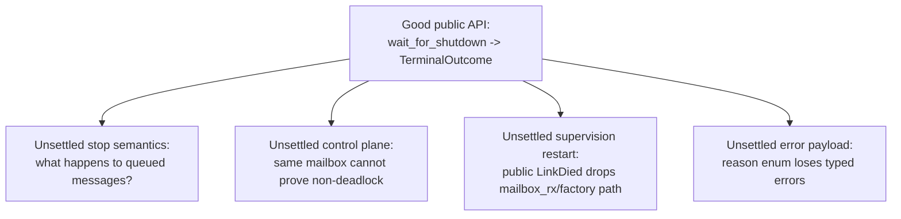
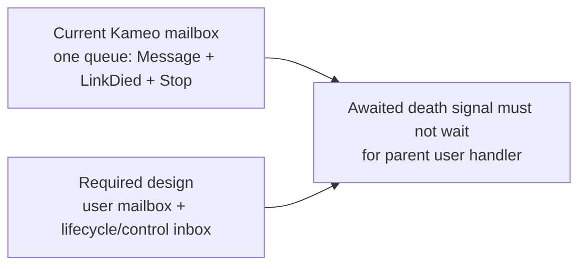

# 97 — Flaw review of designer/204 Kameo lifecycle canonical design

Date: 2026-05-16
Role: designer-assistant
Scope: critique `reports/designer/204-kameo-lifecycle-canonical-design-2026-05-16.md`
before operator treats it as an implementation spec.

## 0. Verdict

The report's central correction is right:

> Public Kameo lifecycle should be one terminal wait returning one
> path-aware outcome, not a public stream of lifecycle phases.

That is a better API than `wait_for_lifecycle_phase` and it aligns
with the Akka contract the report is trying to translate.

The flaws are mostly in the implementation sketch. The largest issue
is that `/204` names a clean public contract but still leaves several
mechanically hard choices under-specified:

- graceful stop semantics after `close_admission`;
- the new control-plane channel needed for awaited death-signal
  dispatch;
- supervised restart's need to carry restart material, not only a
  public `LinkDied { id, outcome }`;
- error payloads and the outer `Result` vs terminal outcome split;
- state-ejection types and `wait_for_shutdown` guarantees.

Operator should not implement directly from `/204` until these are
settled or explicitly filed as design constraints.



## 1. Concrete internal inconsistencies in `/204`

### 1.1 Duplicate `run_to_termination` signatures

In §1.1, the API sketch declares `run_to_termination` twice:

```rust
pub async fn run_to_termination(self, args: A::Args)
    -> Result<ActorTerminalOutcome, PanicError>;

pub async fn run_to_termination(self, args: A::Args)
    -> Result<ActorRunOutcome<A>, PanicError>;
```

The second version is introduced after `run_to_state_ejection`. The
text says both run modes should return `ActorRunOutcome<A>`, but the
first signature still returns `ActorTerminalOutcome`.

Recommendation: choose one shape. My preference:

```rust
pub async fn run_to_termination(self, args: A::Args)
    -> ActorRunOutcome<A>;

pub async fn run_to_state_ejection(self, args: A::Args)
    -> ActorRunOutcome<A>;
```

If the type-level guarantee matters, use separate enums:

```rust
pub enum ActorTerminationRunOutcome {
    Dropped(ActorTerminalOutcome),
    NeverAllocated(ActorTerminalOutcome),
}

pub enum ActorEjectionRunOutcome<A> {
    Ejected { actor: A, outcome: ActorTerminalOutcome },
    NeverAllocated(ActorTerminalOutcome),
}
```

### 1.2 The `ActorRef::wait_for_shutdown` rustdoc overclaims under ejection

`/204` says `ActorRef<A>::wait_for_shutdown` guarantees:

> if the actor was constructed, its `Self` value has been dropped

But the same report defines `run_to_state_ejection`, whose terminal
state is `ActorStateAbsence::Ejected`. In that path, `Self` is
returned to the caller and is explicitly not dropped by the runtime.

Recommendation: the public rustdoc should be phrased as:

> At resolution, the runtime has reached a terminal state. Inspect
> `outcome.state` to learn whether state was dropped, never
> allocated, or ejected.

Do not state an unconditional "Self was dropped" guarantee on the
generic `ActorRef` method.

### 1.3 Step numbers in invariant 1 are stale

§2 "Invariant 1" says:

> Steps 1+2 (`on_stop` await, `drop(actor)`) complete strictly before
> steps 4+5 (parent/watcher notification) begin.

In the corrected §1.2 sequence, `on_stop` and `drop(actor)` are steps
4 and 5; parent/watcher dispatch are steps 6 and 7. The invariant is
conceptually right, but the step labels are wrong.

This matters because the report is meant to become an implementation
spec. Operators should not have to reconcile stale numbering in a
shutdown chain this sensitive.

### 1.4 `Killed` contradicts current Kameo semantics

`/204` defines:

```rust
Killed,
/// Actor was killed via `abort()`/`kill()`; `on_stop` did not run.
```

Current Kameo's `ActorRef::kill()` docs say:

> The actors on_stop hook will still be called.

Current `spawn.rs` also aborts the actor loop, then calls
`state.shutdown().await`, then calls `actor.on_stop(...)`.

This may be a deliberate new design, but `/204` does not call it out
as a breaking semantic change. There are two different operations here:

| Operation | Should `on_stop` run? | Suggested name |
|---|---:|---|
| Abort current handler but still run cleanup | yes | `Killed` or `Aborted` |
| Tear down without `on_stop` | no | `Brutal` |

Recommendation: keep `kill()` as "abort work, still run cleanup" unless
the workspace explicitly wants to break Kameo's current contract. Put
the no-cleanup path under the `/204` §5 PR #4 `Shutdown::Brutal`
extension instead.

## 2. Stop semantics are under-specified

### 2.1 `close_admission` first conflicts with graceful-drain wording

`/204` correctly says admission should stop before cleanup so new sends
do not queue into a dying actor. But Kameo's current `stop_gracefully`
contract says:

> stop after processing all messages currently in its mailbox.

The §1.2 sequence says:

> Finish the currently-running handler (if any).

It does not say whether messages already queued before the stop request
are drained or discarded. That is a semantic choice, not an
implementation detail.

The design needs a closed answer:

| Stop mode | Queued user messages before stop | New user messages after stop | `on_stop` |
|---|---|---|---|
| Graceful drain | drain then stop | reject | yes |
| Graceful current-only | discard queued, finish current | reject | yes |
| Brutal | abort current and discard queued | reject | no or best-effort |

Current Kameo docs imply "graceful drain." `/204`'s wording implies
"current-only." Those are not the same contract.

Recommendation: make stop modes explicit before implementation. If
`stop_gracefully` keeps its current meaning, `close_admission` must
reject new sends while the actor drains the already-admitted prefix of
the mailbox.

### 2.2 Closing the receiver cannot remain a public wait boundary

If implementation uses `MailboxReceiver::close()` as
`close_admission`, then `MailboxSender::closed().await` may resolve
early by design. `/204` correctly moves the public wait to a terminal
oneshot, but the migration must be explicit:

- every strong `ActorRef::wait_for_shutdown` path stops waiting on
  `mailbox_sender.closed()`;
- every weak ref path stops waiting on `mailbox_sender.closed()`;
- docs for `closed()` are not reused as shutdown truth;
- old `get_shutdown_result` surfaces cannot observe half-terminal
  state.

The current branch has both strong and weak variants with different
wait mechanisms. `/204` mentions equivalence, but the implementation
checklist should name "no public shutdown wait may use mailbox
closure."

## 3. The control-plane requirement is much larger than `/204` admits

`/204` says death notifications must be awaited into a
non-deadlocking control plane, not merely spawned. That is right.
But current Kameo does not have that control plane in the necessary
sense.

Current `mailbox.rs` has one `Signal<A>` enum with:

```rust
Signal::Message { ... }
Signal::LinkDied { ... }
Signal::Stop
Signal::SupervisorRestart
```

`recv_mailbox_loop` reads those from the same receiver and dispatches
them through the same actor task. `SignalMailbox::signal_link_died` on
a bounded mailbox awaits `tx.send(Signal::LinkDied { ... })`.

That means the current shape has two problems:

1. **Control and user traffic share capacity.** If the bounded mailbox
   is full of user messages, an awaited death-signal send can block.
2. **Control and user traffic share processing.** If the parent actor
   is inside a handler awaiting the child shutdown, it cannot process
   `Signal::LinkDied` through `recv_mailbox_loop` until that handler
   returns.

`/204` names the desired semantics but not the migration:



Recommendation: add an explicit design subsection:

- introduce a lifecycle/control inbox separate from the user mailbox;
- define its capacity and backpressure (`unbounded`, reserved slots, or
  nonblocking set-once per linked actor);
- define who drains it while a user handler is blocked;
- define the exact "dispatch accepted" witness;
- prove parent-waiting-on-child does not deadlock.

Without that, the instruction "await dispatch" can reintroduce the
deadlock `/204` is trying to avoid.

## 4. Supervised restart loses required restart material

The public `Signal::LinkDied { id, outcome }` in `/204` is too small
to describe Kameo's supervised restart path as implemented today.

Current Kameo passes extra restart material in `Signal::LinkDied`:

```rust
LinkDied {
    id,
    reason,
    mailbox_rx,
    dead_actor_sibblings,
}
```

The parent supervisor uses `mailbox_rx` when calling the child
`SpawnFactory` to restart the child with the same mailbox receiver.
For `OneForAll` and `RestForOne`, it also coordinates sibling
mailboxes before restarting.

If `/204` removes the restart material from the signal, it must name
where that material moves. Possibilities:

1. A private `SupervisorChildTerminated` control message carries
   `mailbox_rx`, sibling links, and the public `ActorTerminalOutcome`.
2. The supervisor owns child mailbox receivers and restart factories
   directly, so child death signals only carry identity/outcome.
3. Restart uses a fresh mailbox pair every time, and all old handles
   become permanently dead.

These are different architectures. `/204` currently presents a public
watcher signal as if it were also enough for supervisor restart. It is
not.

Recommendation: split public watcher notification from private
supervisor restart notification:

```rust
pub enum WatchSignal {
    LinkDied { id: ActorId, outcome: ActorTerminalOutcome },
}

pub(crate) enum SupervisorSignal {
    ChildTerminated {
        id: ActorId,
        outcome: ActorTerminalOutcome,
        restart_material: ChildRestartMaterial,
    },
}
```

Then define whether restart reuses or replaces mailboxes.

## 5. Error information is not designed

`ActorTerminalReason` currently names categories:

```rust
Stopped
Killed
Panicked
StartupFailed
CleanupFailed
```

But it loses payloads:

- `on_start` can return `A::Error`;
- `on_stop` can return `A::Error`;
- handlers and hooks can panic with `PanicError`;
- current `wait_for_shutdown_result` returns typed hook errors for
  callers that have `ActorRef<A>`.

The report also wraps run methods in `Result<..., PanicError>` while
the terminal reason itself has `Panicked`, `StartupFailed`, and
`CleanupFailed`. That creates two error channels:

```text
outer Result error
terminal outcome reason
```

The design should choose one.

Recommendation:

- `wait_for_shutdown()` returns terminal category only, if the public
  contract intentionally hides error details;
- add a separate typed method for same-actor callers that need details;
- keep watcher/supervisor outcomes erased or category-shaped;
- do not use outer `Result` for terminal paths already represented by
  `ActorTerminalOutcome`.

Possible shape:

```rust
pub struct ActorTerminalOutcome {
    pub state: ActorStateAbsence,
    pub reason: ActorTerminalReason,
}

pub enum ActorTerminalReason {
    Stopped,
    Aborted,
    Brutal,
    StartupFailed,
    CleanupFailed,
    Panicked,
}

pub enum ActorTerminalDetail<E> {
    StartupError(E),
    CleanupError(E),
    Panic(PanicError),
}

impl<A: Actor> ActorRef<A> {
    pub async fn wait_for_shutdown(&self) -> ActorTerminalOutcome;
    pub async fn wait_for_shutdown_detail(&self) -> Option<ActorTerminalDetail<A::Error>>;
}
```

The exact shape can differ. The missing piece is separating
cross-actor lifecycle category from same-type error detail.

## 6. Registry semantics need a tombstone/reservation design

`/204` wants:

- `registry_lookup_returns_none_at_admission_stop`;
- `registry_register_blocks_until_terminal`.

That is a two-state registry, not a simple map:

```text
Published(name -> ActorRef)
Retiring(name reserved, lookup hidden, register blocked)
Absent(name free)
```

This is probably correct, but the report should say so explicitly.
Otherwise an operator may implement "remove on admission stop" to
make lookup return `None`, which would accidentally allow a new actor
to register before the old state is dropped and before death signals
are dispatched.

Recommendation: add an internal `Retiring` reservation state to the
registry design and test both lookup and register behavior against
that state.

## 7. StoreKernel blocker is overstated

`/204` says the Kameo lifecycle design closes the
`StoreKernel` Template-2 deferral:

> On a Kameo fork pinned to this design, that test passes and the
> comment at `persona-mind/src/actors/store/mod.rs:295-307` can be
> removed.

That may be true for the narrow "parent wait resolves before the
state drops" bug, but it is not enough for the whole StoreKernel
destination.

`StoreKernel` still needs the single-owner storage topology from
`reports/designer-assistant/96`:

- one actor/owner holds `MindTables` / `sema-engine::Engine`;
- synchronous redb/sema-engine work does not run on Tokio's shared
  worker pool;
- writes are serialized through that owner;
- close-confirm proves `mind.redb` can be reopened cleanly.

Kameo's terminal outcome helps the restart boundary. It does not by
itself make `StoreKernel`'s storage topology correct.

Recommendation: soften the claim:

> This Kameo fix removes the lifecycle bug that blocked a supervised
> dedicated-thread StoreKernel. StoreKernel still needs the
> single-owner storage plane and close-confirm implementation before
> the Template-2 deferral is fully closed.

## 8. Test bar additions

The existing §6 test bar is good but missing tests for the specific
ambiguities above.

Add:

```rust
#[tokio::test]
async fn graceful_stop_drains_or_discards_queued_messages_as_documented() {
    // Whatever stop mode is chosen, prove the queued-message contract.
}

#[tokio::test]
async fn death_signal_dispatch_does_not_deadlock_when_parent_handler_waits_on_child() {
    // Parent handler calls child.stop + child.wait_for_shutdown.
    // Child terminal dispatch must still complete.
}

#[tokio::test]
async fn bounded_user_mailbox_full_does_not_block_terminal_death_signal_dispatch() {
    // Fill user mailbox; death signal must still enter the control plane.
}

#[tokio::test]
async fn supervisor_restart_has_restart_material_without_public_watcher_payload_pollution() {
    // Watchers get only public outcome; supervisor still restarts child.
}

#[tokio::test]
async fn kill_runs_or_skips_on_stop_according_to_documented_mode() {
    // Locks down whether Killed means cleanup ran or Brutal means cleanup skipped.
}

#[tokio::test]
async fn registry_retiring_state_hides_lookup_but_blocks_register_until_terminal() {
    // Proves publication vs reservation split.
}
```

## 9. Bottom line

`/204` is directionally good and should probably become the canonical
public API direction. I would not let operator implement it verbatim
yet.

The public shape is ready:

```text
wait_for_shutdown() -> ActorTerminalOutcome
```

The implementation shape is not fully ready until the report specifies:

1. whether graceful stop drains queued messages or discards them;
2. the separate lifecycle/control inbox needed for non-deadlocking
   awaited dispatch;
3. where supervised-restart material lives after public `LinkDied`
   becomes outcome-only;
4. how typed hook/panic details relate to category-shaped terminal
   outcomes;
5. the registry `Retiring` state.

Those are the flaws I would bring back before operator starts the
rewrite.
