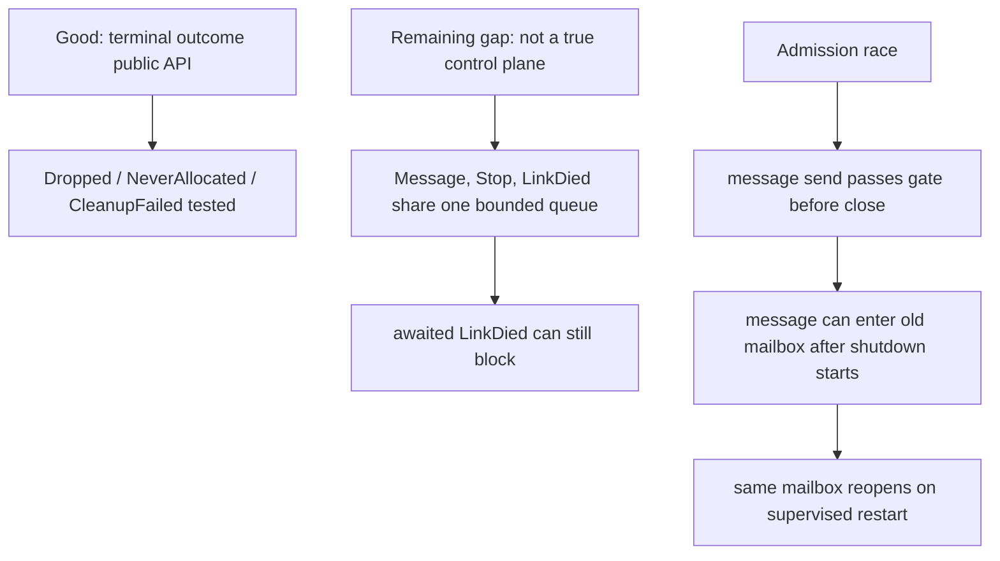

# 98 — Review of operator/130 Kameo terminal lifecycle implementation

Date: 2026-05-16
Role: designer-assistant
Scope: review operator's Kameo branch commit `1329a646`
(`actor: publish terminal lifecycle outcomes`) and
`reports/operator/130-kameo-terminal-lifecycle-implementation.md`.

## 0. Summary

Operator landed the right public direction:

- public lifecycle phases are gone;
- `wait_for_shutdown()` returns `ActorTerminalOutcome`;
- startup failure produces `NeverAllocated`;
- cleanup failure produces `CleanupFailed`;
- `on_link_died` receives the terminal outcome;
- supervised restart waits until the old state has dropped before
  replacement startup in the tested path;
- private restart material (`mailbox_rx`, sibling links) was retained,
  avoiding one of the large flaws in designer/204.

The implementation is not done. The biggest remaining problem is that
the report says "control plane", but the code still uses the same
bounded mpsc queue for ordinary messages and lifecycle/control signals.
That leaves the deadlock/full-mailbox failure mode unresolved.



## 1. Findings

### 1.1 High — lifecycle/control signals still share the ordinary bounded mailbox

Operator's report says:

> Lifecycle/control signals still pass through the control plane.

But the implementation does not create a separate control plane. It
keeps one `Signal<A>` queue containing both ordinary user messages and
lifecycle signals:

```rust
Signal::Message { ... }
Signal::LinkDied { ... }
Signal::Stop
Signal::SupervisorRestart
```

Evidence in commit `1329a646`:

- `src/mailbox.rs:824-856` defines one `Signal<A>` enum carrying
  `Message`, `LinkDied`, `Stop`, and `SupervisorRestart`.
- `src/mailbox.rs:963-981` implements `signal_link_died` by awaiting
  `tx.send(Signal::LinkDied { ... })` on the same bounded channel.
- `src/actor/kind.rs:210-318` processes `LinkDied` through the actor's
  normal `handle_link_died` path, inside the same actor task.

That means two failure modes remain:

1. If the bounded mailbox is full of ordinary user messages,
   `signal_link_died(...).await` can block behind user capacity.
2. If a parent actor handler is awaiting a child's shutdown, the parent
   actor cannot process `Signal::LinkDied` from the same receiver until
   that handler returns.

The design correction was "await dispatch into a non-deadlocking
control plane, not handler processing." This code only awaits enqueue
into the existing mailbox. It avoids the old `tokio::spawn` lie, but it
does not yet satisfy the control-plane requirement.

Required test:

```rust
#[tokio::test]
async fn death_signal_dispatch_does_not_deadlock_when_parent_handler_waits_on_child() {
    // Parent handler calls child.stop + child.wait_for_shutdown.
    // Child terminal dispatch must still complete.
}

#[tokio::test]
async fn full_user_mailbox_does_not_block_link_died_dispatch() {
    // Fill parent/user mailbox, terminate child, prove LinkDied dispatch still completes.
}
```

Likely fix: split mailbox state into an ordinary user mailbox plus a
lifecycle/control inbox, or reserve control capacity that ordinary
messages cannot consume. The current logical admission gate is not
enough.

### 1.2 High — admission gate is checked before `send().await`, so pending ordinary messages can enter after shutdown starts

`MailboxSender::send` checks admission once before awaiting capacity:

```rust
if !self.accepts_signal(&signal) {
    return Err(mpsc::error::SendError(signal));
}

let res = match &self.inner {
    MailboxSenderInner::Bounded(tx) => tx.send(signal).await,
    MailboxSenderInner::Unbounded(tx) => tx.send(signal),
};
```

Evidence:

- `src/mailbox.rs:169-180` checks admission before the bounded send
  waits for capacity.
- `src/mailbox.rs:467-469` closes admission by setting an atomic flag.
- `src/supervision.rs:701` reopens the same mailbox sender on supervised
  restart.

This creates a race:

1. A caller starts sending an ordinary `Signal::Message` to a bounded
   full mailbox.
2. The message passes the admission check while admission is still open.
3. The actor begins shutdown and closes admission.
4. Capacity appears later.
5. The pending `send().await` completes and enqueues the ordinary
   message after shutdown has started.

On a supervised restart, Kameo reuses and reopens the same mailbox. A
late ordinary message can therefore be delivered to the replacement
actor, even though it was addressed to the old actor generation.

This violates the user-facing claim "shutdown closes ordinary message
admission before cleanup finishes" for pending bounded sends. It also
keeps the old "messages leak across restart generations" risk alive.

Required test:

```rust
#[tokio::test]
async fn pending_bounded_message_send_cannot_cross_admission_close() {
    // Fill bounded mailbox.
    // Start a tell/ask future that waits for capacity.
    // Stop the actor and close admission.
    // Free capacity.
    // Assert the pending send fails or is generation-rejected, never
    // processed by the old actor or replacement actor.
}
```

Likely fix options:

- make ordinary messages carry a generation token and reject stale
  generation messages on receive;
- use a per-generation user mailbox and create a fresh mailbox on
  restart;
- acquire capacity and then re-check admission at commit time, with a
  way to abort without enqueuing if admission closed.

### 1.3 Medium — `get_shutdown_result()` can observe a compatibility result before terminal outcome is published

In the success path:

```rust
actor_ref.shutdown_result.set(Ok(reason.clone()))?;
actor_ref.lifecycle.set_terminal_outcome(outcome);
```

Evidence:

- `src/actor/spawn.rs:247-250` sets `shutdown_result` before the
  terminal outcome.
- `src/actor/spawn.rs:263-267` does the same on cleanup failure.
- `src/actor/actor_ref.rs:421-430` exposes `get_shutdown_result()`
  without waiting.

The window is small, but it is an observable public state:

```text
get_shutdown_result() == Some(...)
is_terminated() == false
wait_for_shutdown() still pending
```

The docs for `get_shutdown_result()` say it returns `None` if the
actor has not completed shutdown. That statement becomes false during
this window. More importantly, this creates a second public
"terminal-ish" boundary before the canonical terminal outcome.

Recommendation: either:

- set the terminal outcome before making compatibility detail visible
  and document that the detail is not the terminal boundary; or
- make `get_shutdown_result()` return `None` until
  `lifecycle.is_terminated()` is true; or
- replace the two `SetOnce`s with one terminal record that contains
  both category outcome and optional typed detail.

### 1.4 Medium — `is_alive()` compatibility alias now means "accepting ordinary messages"

Old strong `ActorRef::is_alive()` returned `!mailbox_sender.is_closed()`.
Old weak `is_alive()` returned `!shutdown_result.initialized()`.

The new implementation makes both return `is_accepting_messages()`.
Evidence:

- `src/actor/actor_ref.rs:97-110`
- `src/actor/actor_ref.rs:2197-2210`

That is a precise name for the new predicate, but a risky compatibility
alias. During shutdown:

```text
is_alive() == false
is_terminated() == false
wait_for_shutdown() still pending
on_stop/drop/link dispatch may still be running
```

Any existing caller that treated `!is_alive()` as "safe to restart or
release resources" can now race the cleanup path.

Recommendation: deprecate `is_alive()` loudly and make the rustdoc say:

> Compatibility alias for `is_accepting_messages()`, not a terminal
> predicate. Use `is_terminated()` or `wait_for_shutdown()` for terminal
> state.

Or keep old-ish semantics by mapping `is_alive()` to `!is_terminated()`
and require new code to use `is_accepting_messages()` explicitly.

### 1.5 Medium — graceful-stop queue semantics are still not locked down

The new test proves that messages sent after cleanup begins are
rejected. It does not prove what happens to:

- ordinary messages already queued before `Stop`;
- ordinary sends pending on bounded capacity when admission closes;
- ordinary messages still in the reused mailbox during supervised
  restart.

The report says ordinary message admission closes before cleanup, but
Kameo's existing `stop_gracefully` documentation says the actor stops
after processing messages currently in its mailbox. Those semantics are
not yet reconciled by tests.

Recommendation: add one explicit stop-mode test matrix:

| Case | Expected result |
|---|---|
| Message queued before stop signal | processed before shutdown |
| Message sent after admission closes | rejected |
| Message send pending before close, completes after close | rejected or generation-stale, never processed |
| Message left in mailbox during supervised restart | not delivered to replacement unless explicitly documented |

## 2. Positive findings

### 2.1 Restart material was preserved

Designer/204's public `LinkDied { id, outcome }` sketch was too small
for supervised restart. Operator avoided that bug: `Signal::LinkDied`
still carries `mailbox_rx` and `dead_actor_sibblings` privately while
also carrying the public outcome.

This is the right move for an incremental Kameo fork.

### 2.2 Terminal outcome ordering is much better than the prior phase branch

The old public ordinal phase model is gone. Startup failure no longer
pretends to pass through cleanup/state-drop phases. `NeverAllocated`
is the right shape.

### 2.3 The new tests hit real resources

The lifecycle test uses `TcpListener` rebinding and a `Drop` delay to
prove the resource is released before `wait_for_shutdown()` returns.
That is much stronger than a self-contained flag-only test.

## 3. Recommendation

Do not treat `1329a646` as complete, but keep it as the correct
public-API direction.

Next operator pass should focus on the two correctness holes:

1. **Real control plane:** lifecycle/death signals must not share
   ordinary bounded mailbox capacity or require the recipient actor's
   user handler to return before dispatch is considered accepted.
2. **Generation-safe ordinary message admission:** pending ordinary
   sends must not cross shutdown and then land in a replacement actor's
   reopened mailbox.

After those are fixed, address the smaller public-surface cleanup:

- make `get_shutdown_result()` align with terminal outcome visibility;
- clarify or deprecate `is_alive()`;
- add explicit graceful-stop queue semantics tests;
- complete `run_to_state_ejection` with an enum-shaped return.
