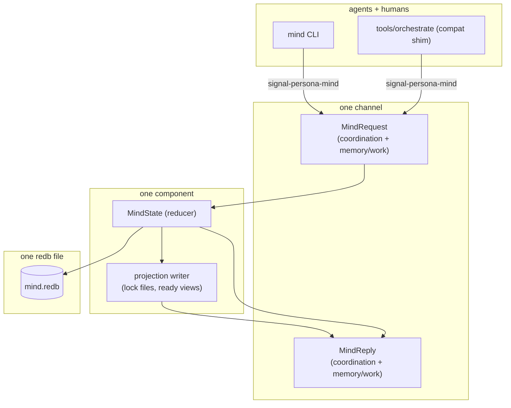

# 100 — Persona-mind architecture — designer companion

*Designer report. Operator/100
(`~/primary/reports/operator/100-persona-mind-central-rename-plan.md`)
and operator/101
(`~/primary/reports/operator/101-persona-mind-full-architecture-proposal.md`)
have already settled the consolidated architecture
(persona-mind absorbs role coordination + memory/work graph;
one channel, one component, one redb file). The
`signal-persona-mind` contract crate ships with both
vocabularies; the `persona-mind` runtime crate has in-memory
reducers proven by tests; sema persistence is the next gap.
This report is the designer companion: endorse the chosen
direction, name the corrections operator's contract already
applied (closed taxonomies, no inverse edges,
ExternalReference enum), push back on the items still off
(actor framing in Phase 1, EventHeader.actor identity source,
Status::Closed without Resolution, Body String), and surface
five extensions worth pinning before sema persistence lands.*

---

## 0 · TL;DR

**Endorse:** the consolidation. Operator/100's reframe — *"the
previous work-graph split was too bounded-context-heavy for the
shape the user wants; work tracking is one of the mind's
domains"* — is the right call. My earlier /98 §2.2 critique
argued for separate components; operator/100 corrects that on
the basis that the user's intent is *"Persona's heart owns the
living state of the system."* Cognition + coordination share an
operational pattern (typed reducer → events → projections);
folding into one component is cleaner than I gave it credit
for.

**Endorse, with applause:** operator's contract already
applied my /98 §2.2 corrections to the work-graph vocabulary —
`EdgeKind` has no inverse `Blocks` variant; reports are
`ExternalReference::Report(ReportPath)` not a separate item
kind; item kinds form a small closed enum (6 variants); the
no-`Unknown` rule is followed. Worth naming explicitly: those
corrections landed.

**Push back on five remaining shape choices:**

1. **Actor framing in Phase 1** (operator/101 §4 + §14) —
   plain methods on `MindState` until subscriptions land in
   Phase 5. Same argument as /98 §1.2 for orchestrate; same
   conclusion for mind. Pulling in ractor for one-shot CLI is
   ceremony.
2. **`EventHeader.actor: ActorName` filling** (current
   contract `signal-persona-mind/src/lib.rs:758`) — the
   `actor` field is on the wire today; per ESSENCE
   §"Infrastructure mints identity, time, and sender", the
   dispatcher must fill it from `AuthProof`, not from the
   request body. The field stays; the source of truth shifts.
3. **`Status::Closed` carries no `Resolution`** — current
   contract `signal-persona-mind/src/lib.rs:611-617` has
   `Status::{Open, InProgress, Blocked, Closed, Deferred}` but
   no closure-metadata. *Why* an item closed is load-bearing
   (Done vs Wontfix vs Duplicate vs Superseded vs Answered);
   without it, the audit trail is thinner than it needs to be.
4. **`Body(String)` everywhere** — same primary-b7i / typed
   Nexus body migration that designer/97 §6 named for
   `Message::body`; applies here to `Item.body`, `Note.body`,
   `Edge.body`, etc. No urgency; track for the migration wave.
5. **Flat `MindRequest` enum spanning two domains** — current
   contract has 12 flat variants (6 coordination + 6
   memory/work). A reader can't see the bounded contexts
   without reading variant prefixes. Optional refinement: keep
   flat, but document the grouping in
   `signal-persona-mind/ARCHITECTURE.md`.

**Five extensions worth pinning before Phase 2 sema persistence:**

- §3.1 — DisplayId mint algorithm (the contract has
  `DisplayId(String)` but no spec for how it's generated)
- §3.2 — Concrete sema table key shapes (operator/101 names
  the tables; doesn't pin the keys)
- §3.3 — Caller-identity configuration mechanism (how does
  `ActorName` come from auth instead of from agent input?)
- §3.4 — Workspace-local vs system-level `mind.redb` path
- §3.5 — Subscription contract sketch (Phase 5 future, but
  the wire shape worth naming so consumers can plan)

§4 — implementation cascade adjustments (small set; mostly
operator/assistant lane). §5 — additional architectural-truth
witnesses extending operator/101 §13.

This report **does not** propose a separate component or a
separate contract — operator/100's consolidation is correct
and stands. It refines what's already there and names what's
still missing.

---

## 1 · What operator/100 + /101 settle

Five load-bearing decisions, restated for designer-side
acknowledgment:

1. **`persona-mind` is Persona's central state component** —
   role coordination and memory/work graph live in one place,
   one reducer, one redb file. The previous orchestrate-vs-work
   split (designer/93 + designer/98 §2.2) yields to this.
2. **`signal-persona-mind` is the one channel** — `MindRequest`
   spans both vocabularies; `MindReply` does too. No second
   "memory contract"; no second "coordination contract."
3. **`mind.redb` is the durable substrate** — opened via
   `persona-sema::PersonaSema::open(mind_db_path)`; tables for
   `CLAIMS`, `HANDOFFS`, `ACTIVITIES`, `ITEMS`, `EDGES`,
   `NOTES`, `ALIASES`, `EVENTS`, `META`.
4. **`mind` is the canonical CLI** — one Nota record on argv,
   one Nota record on stdout. `tools/orchestrate` becomes a
   compatibility shim translating legacy syntax into the
   canonical request.
5. **BEADS migrates via one-shot importer** — preserve old IDs
   as `ExternalAlias` records; archive `.beads/`; remove from
   required startup reads.

Visual restatement:



This is the architecture. Below: refinements + extensions to
it, not alternatives.

---

## 2 · Five push-backs

### 2.1 · Actor framing in Phase 1 — methods first

**The setup.** Operator/101 §4 names a four-actor tree
(`MindRootActor`, `MindIngressActor`, `MindStateActor`,
`ProjectionActor`, `SubscriptionActor`); §14 sequences this as
"Phase 1: Actor-backed service" before "Phase 2: Sema
persistence." Operator/101 §15 hedges — *"Short-lived actor
tree in mind CLI first; long-lived host only when
subscriptions need it"* — but the recommendation still pulls
in ractor before the work needs it.

**The push back.** Same argument as designer/98 §1.2 for
`OrchestrateState`: the actor framework's value
(`~/primary/skills/rust-discipline.md` §"Actors") is *"logical
cohesion, coherence, and consistency"* for a coherent
component with state, message protocol, lifecycle. A one-shot
CLI that spawns a "short-lived actor tree" gets none of those
benefits — the actor's lifecycle is "spawn → handle one
message → die"; the message protocol is "the one variant"; the
state is a redb handle that closes on drop. Methods on
`MindState` carry the contract without the framework
ceremony:

```rust
pub struct MindState {
    sema: PersonaSema,
}

impl MindState {
    pub fn open(path: impl AsRef<Path>) -> Result<Self> { … }

    pub fn role_claim(&self, request: RoleClaim, actor: ActorName) -> Result<MindReply> { … }
    pub fn role_release(&self, request: RoleRelease, actor: ActorName) -> Result<MindReply> { … }
    pub fn open_item(&self, request: Opening, actor: ActorName) -> Result<MindReply> { … }
    pub fn add_note(&self, request: NoteSubmission, actor: ActorName) -> Result<MindReply> { … }
    pub fn link(&self, request: Link, actor: ActorName) -> Result<MindReply> { … }
    // …
}

fn main() -> ExitCode {
    let request = parse_argv()?;
    let actor = configured_caller_identity()?;          // see §3.3
    let state = MindState::open(&mind_db_path())?;
    let reply = state.dispatch(request, actor)?;
    print_nota(&reply);
    ExitCode::SUCCESS
}
```

redb's MVCC handles concurrent CLI invocations cleanly; one
writer per logical concern is enforced by the `&self` receiver
(or `&mut self` for write paths).

**When to promote to actor.** Phase 5 (operator/101's
subscription work). At that point, the message protocol has
real shape (a stream of post-commit events; multiple
subscribers; long-lived state). The methods become handlers;
the CLI becomes one client; the subscription listener becomes
another. Promotion is mechanical when the time comes.

The contract crate doesn't care which shape the consumer
takes — both implementations satisfy `signal-persona-mind`.
But the implementation cascade is faster, simpler, and
cheaper to debug without ractor + tokio in Phases 1–4.

### 2.2 · `EventHeader.actor` — fill from auth, not from request body

**The setup.** Current contract
(`/git/github.com/LiGoldragon/signal-persona-mind/src/lib.rs:754-759`):

```rust
pub struct EventHeader {
    pub event:     EventSeq,
    pub operation: OperationId,
    pub actor:     ActorName,
}
```

`ActorName` is on the wire as part of every event header.
Operator/101 §8 surfaces this: *"current memory mutations need
a reliable actor identity. The clean solution is a common
request envelope: `MindEnvelope { actor, request }`."*

**The push back.** Putting `actor` in the wire envelope is
fine *as a typed slot*, but the slot must be **filled by the
dispatcher from the connection's `AuthProof`, not by the
agent's request bytes**. Per ESSENCE §"Infrastructure mints
identity, time, and sender":

> *"Sender comes from the connection's auth proof, not the
> message body. ... Putting the sender in the record body is
> redundant and untrustworthy: the model could write any name
> and the record would carry it."*

The current contract has `EventHeader.actor` as part of
typed event records *that the store assigns*, not as a field
on requests like `Opening` (the `Opening` request struct does
not have an actor field — good). When a request lands, the
dispatcher:

1. Reads `AuthProof` from the frame.
2. Resolves the proof's principal to an `ActorName` (configured
   binding — see §3.3).
3. Constructs the `EventHeader { event, operation, actor }`
   using the resolved actor.
4. Persists.

The wire representation is right; the source of truth for
`actor` must be the auth proof. The CLI's responsibility (per
operator/101 §11 — *"attach configured caller identity"*)
is to ensure the auth proof carries the configured principal;
the contract enforces that the agent body never names actor.

**Architectural-truth witness for this** (extending operator/101
§13.5):

| Test | Catches |
|---|---|
| Request body cannot supply an actor | Compile-fail — `Opening`, `NoteSubmission`, `Link`, `StatusChange`, `AliasAssignment`, `Query` literally have no `actor` field |
| `EventHeader.actor` matches the auth proof's resolved principal | Spawn dispatcher with synthetic auth (principal=designer); submit an `Opening`; assert resulting `ItemOpenedEvent.header.actor == ActorName::new("designer")` |
| Spoofed `actor` is impossible at the contract level | Try to construct an `EventHeader` and submit it as a request — fails at the type level, since requests don't carry `EventHeader` |

### 2.3 · `Status::Closed` carries no `Resolution`

**The setup.** Current contract
(`signal-persona-mind/src/lib.rs:610-617`):

```rust
pub enum Status {
    Open,
    InProgress,
    Blocked,
    Closed,
    Deferred,
}
```

`Status::Closed` is a single variant. Why an item closed (it
got done; it was wrongly opened; it's a duplicate of something
else; it's superseded by a different decision; it's been
answered) is collapsed into one bit.

**The push back.** Closure metadata is load-bearing for the
audit trail and for query semantics:

- `Resolution::Done` — work completed; ready-queue removes
- `Resolution::Wontfix` — explicitly declined; ready-queue
  removes; future readers know it was decided not to do
- `Resolution::Duplicate(ItemReference)` — points at the
  canonical item; the duplicate hides from views; both link
  via `EdgeKind::Duplicates`
- `Resolution::Superseded(ItemReference)` — points at the
  superseding item; same hiding behavior; link via
  `EdgeKind::Supersedes`
- `Resolution::Answered(ItemReference)` — for `Question`
  items; points at the answering item; link via
  `EdgeKind::Answers`

Proposed contract change:

```rust
pub enum Status {
    Open,
    InProgress,
    Blocked,
    Closed(Resolution),     // ← carry the why
    Deferred,
}

pub enum Resolution {
    Done,
    Wontfix,
    Duplicate(ItemReference),
    Superseded(ItemReference),
    Answered(ItemReference),
}
```

This is a coordinated schema change; lands in the same wave
as the actor-vs-methods choice in §2.1. The `EdgeKind`
variants `Duplicates`, `Supersedes`, `Answers` already exist;
the resolution makes the closure-edge relationship explicit at
the status layer too. Both layers carry the relationship —
the edge for graph queries, the resolution for status queries.

### 2.4 · `Body(String)` everywhere

**The setup.** The contract carries `Body(String)` in `Item`,
`Note`, `Link`, `StatusChange`. Same shape as
`signal_persona::Message::body`, `signal_persona_harness::DeliverMessage::body`,
and `signal_persona_orchestrate::ScopeReason`.

**The push back, light.** This is the same `primary-b7i`
typed Nexus body migration that designer/97 §6 named. No
rework needed in this report — when the migration wave hits
`signal_persona`'s `Message::body`, mind's `Body` field
travels with it. Track in the same migration:

| Field | Today | After primary-b7i |
|---|---|---|
| `signal_persona::Message::body` | `MessageBody(String)` | `NexusBody` (typed enum) |
| `signal_persona_harness::DeliverMessage::body` | `String` | `NexusBody` |
| `signal_persona_mind::Body` (used in Item/Note/Link/StatusChange) | `Body(String)` | `NexusBody` |

`Body(String)` is fine as a placeholder; flagged for the
typed-Nexus wave.

### 2.5 · Flat `MindRequest` spanning two domains

**The setup.** Current contract (lines 855-869):

```rust
signal_channel! {
    request MindRequest {
        // Coordination
        RoleClaim(RoleClaim),
        RoleRelease(RoleRelease),
        RoleHandoff(RoleHandoff),
        RoleObservation(RoleObservation),
        ActivitySubmission(ActivitySubmission),
        ActivityQuery(ActivityQuery),
        // Memory/work
        Open(Opening),
        AddNote(NoteSubmission),
        Link(Link),
        ChangeStatus(StatusChange),
        AddAlias(AliasAssignment),
        Query(Query),
    }
    reply MindReply {
        // …mixed similarly…
    }
}
```

12 request variants, flat, no namespacing.

**The push back, light.** A reader scanning `MindRequest`
doesn't immediately see the two bounded contexts. Variant
naming partially helps (`Role*` prefix vs others), but it's
convention-by-convention, not enforced by the type.

Two options:

| Option | Shape | Trade-off |
|---|---|---|
| Stay flat | Current shape | Simple; consumers match exhaustively against 12 variants; bounded contexts are convention |
| Group via sub-enums | `MindRequest::Coordination(CoordinationRequest)` + `MindRequest::Memory(MemoryRequest)` | Bounded contexts visible at the type level; consumers handle two layers of dispatch |

**Recommendation: stay flat for v1.** The grouping is a
stylistic refinement; the contract works either way. *But* —
document the grouping explicitly in
`signal-persona-mind/ARCHITECTURE.md` so a fresh reader sees
the bounded contexts without parsing variant prefixes:

```markdown
## Bounded contexts inside the channel

`MindRequest` carries two domains (kept in one channel because
they share an operational pattern — typed reducer producing
events, projections derived):

**Coordination** — transient role-scoped state:
`RoleClaim`, `RoleRelease`, `RoleHandoff`, `RoleObservation`,
`ActivitySubmission`, `ActivityQuery`.

**Memory/work** — durable item-scoped graph:
`Open`, `AddNote`, `Link`, `ChangeStatus`, `AddAlias`,
`Query`.

Both domains commit through the same MindState reducer, the
same `mind.redb`, the same `EventSeq` ordering. The
coordination side projects to `<role>.lock` files; the
memory/work side projects to ready-work and graph views.
```

If the contract grows past ~15 variants in v2, revisit the
grouping decision.

---

## 3 · Five extensions to pin before Phase 2

### 3.1 · DisplayId mint algorithm

The contract has `DisplayId(String)` (line 441) but no spec
for how it's generated. Pin before persistence:

```rust
fn mint_display_id(item: StableItemId, existing: &DisplayIndex) -> DisplayId {
    // base32-crockford encoding of BLAKE3(StableItemId).
    // Crockford avoids 0/O 1/I/l confusion — important for
    // human transcription and LLM tokenisation.
    let full = base32_crockford(blake3(item.as_bytes()));
    // Try lengths 3, 4, 5, ... until uncollided.
    for len in 3.. {
        let candidate = DisplayId::new(&full[..len]);
        if !existing.contains(&candidate) {
            return candidate;
        }
    }
    unreachable!("BLAKE3 has 256 bits; collision exhaustion impossible");
}
```

Examples (illustrative): `9iv`, `kxa`, `ffj` (3-char default);
`9ivx` (collision-extended).

No workspace prefix on the wire (`9iv`, not `mind-9iv`, not
`primary-9iv`). The `mind` CLI adds presentation prefixes only
when ambiguity would arise across multiple substrate types in
one display surface.

**Imported BEADS aliases** (`primary-9iv` style) preserve the
old token via `ExternalAlias` records. Resolving the old
alias goes through the alias index, not the DisplayId index.

### 3.2 · Concrete sema table key shapes

Operator/101 §6 names the tables; the *keys* aren't pinned.
Per `~/primary/reports/assistant/90-rkyv-redb-design-research.md`
§"Do Not Store Arbitrary rkyv Archives as redb Keys" — keys
are designed, not rkyv-encoded. Proposed:

| Table | Key | Value | Notes |
|---|---|---|---|
| `CLAIMS` | `(RoleNameByte, ScopeKeyBytes)` | `ClaimEntry` | Composite key; RoleName as 1-byte tag + scope as bytes; ordered for prefix scans |
| `HANDOFFS` | `OperationId(String)` | `HandoffRecord` | One row per handoff; OperationId provides ordering |
| `ACTIVITIES` | `EventSeq(u64)` BE bytes | `Activity` | Append-only; EventSeq for chrono order |
| `ITEMS` | `StableItemId` bytes | `Item` projection | Direct lookup |
| `EDGES_BY_SOURCE` | `(StableItemId, EdgeKindByte, EdgeTargetBytes)` | `Edge` | Outbound graph index |
| `EDGES_BY_TARGET` | `(EdgeTargetBytes, EdgeKindByte, StableItemId)` | `Edge` | Inbound graph index |
| `NOTES_BY_ITEM` | `(StableItemId, EventSeq)` | `Note` | Per-item chrono |
| `ALIASES` | `ExternalAlias` bytes | `StableItemId` | Reverse lookup: old alias → native item |
| `DISPLAY_IDS` | `DisplayId` bytes | `StableItemId` | Reverse lookup: short id → native item |
| `EVENTS` | `EventSeq(u64)` BE bytes | `Event` | The truth layer |
| `OPERATIONS` | `OperationId` bytes | `Operation` | Audit metadata for one CLI invocation |
| `META` | `&'static str` | `Vec<u8>` | `schema_version`, `event_seq_counter`, etc. |

Composite keys use explicit byte layouts (per assistant/90's
warning); type bytes (`RoleNameByte`, `EdgeKindByte`) are
1-byte enum discriminants chosen at the application layer,
documented as part of the storage spec and protected by
schema-version bumps.

### 3.3 · Caller-identity configuration mechanism

Operator/101 §11 names the responsibility (*"attach configured
caller identity"*); the *how* needs design.

Proposal: the `mind` CLI reads caller identity from one of
three sources, in priority order:

1. **`MIND_ACTOR` env var** — explicit override; useful for
   test harnesses.
2. **`~/.config/persona/actor.toml`** — per-machine default:
   ```toml
   actor = "designer"
   ```
3. **Process ancestry** — the same mechanism
   `persona-message`'s `actors.nota` resolver uses
   (`/git/github.com/LiGoldragon/persona-message/src/resolver.rs`).
   Walks the process tree; matches PID against registered
   actor bindings; returns the matched `ActorName`.

The CLI builds an `AuthProof` carrying the resolved
`ActorName`. The dispatcher reads the `AuthProof` and fills
`EventHeader.actor` from it. The agent's request bytes never
carry actor.

**Spoofing prevention**: the `MIND_ACTOR` env var is
trust-on-first-use; in a single-user workspace this is fine.
For multi-user contexts, fall through to process ancestry
which is harder to spoof (requires controlling a parent
process registered as that actor).

This is the Phase 2 design surface; pin it before sema
persistence so the dispatcher knows what to fill into
`EventHeader.actor`.

### 3.4 · Workspace-local vs system-level `mind.redb` path

Operator/101 §6 hedges — *"the file should live in a
workspace-local state directory at first."* Pin before
implementation:

| Option | Path | Trade-off |
|---|---|---|
| Workspace-local | `~/primary/.mind/mind.redb` (gitignored) | Different workspaces have different mind databases; matches today's per-workspace coordination |
| User-level XDG | `~/.local/share/persona-mind/mind.redb` | One mind across all workspaces; unified view; conflicts when two workspaces have different roles for the same agent |
| Configurable via env | `$MIND_DB_PATH` overrides default | Test isolation; allows either of the above |

**Recommendation: workspace-local default + env override.**
Path: `~/primary/.mind/mind.redb`; gitignored; `MIND_DB_PATH`
env override for tests and future multi-workspace moves. This
mirrors the per-workspace shape of `<role>.lock` files today;
the unified-view question can wait until multiple workspaces
genuinely exist.

### 3.5 · Subscription contract sketch

Phase 5 in operator/101 §14. Worth sketching the wire shape
now so consumers can plan for it without surprises.

Two new request variants in a future minor bump of
`signal-persona-mind`:

```rust
pub enum MindRequest {
    // …existing 12…
    Subscribe(Subscribe),
    Unsubscribe(Unsubscribe),
}

pub enum MindReply {
    // …existing…
    SubscriptionAccepted(SubscriptionAccepted),
    SubscriptionEvent(SubscriptionEvent),
    UnsubscribeAcknowledgment(UnsubscribeAcknowledgment),
}

pub struct Subscribe {
    pub filter: SubscribeFilter,
}

pub enum SubscribeFilter {
    AllEvents,
    Coordination,
    Memory,
    ItemsOfKind(Kind),
    EventsForItem(ItemReference),
}
```

Per `~/primary/skills/push-not-pull.md` §"Subscription
contract" — every subscription emits the producer's current
state on connect, then deltas. For mind, the "current state on
connect" varies by filter:

- `AllEvents` — emit every event from a starting `EventSeq`
  (or current+1 if no starting seq); then deltas
- `Coordination` — emit current `RoleSnapshot`; then
  deltas affecting coordination
- `Memory` — emit a `View` snapshot; then deltas affecting
  memory/work
- `ItemsOfKind(k)` — emit current `Item` projections of
  kind `k`; then deltas affecting matching items
- `EventsForItem(ref)` — emit recent events for the item; then
  deltas affecting the item

Subscriptions cross the actor boundary — when this lands,
the methods-vs-actors trade-off in §2.1 flips toward actors
naturally. That's the right time to promote.

---

## 4 · Implementation cascade adjustments

Operator/101 §14's phase cascade is sound. Three small
adjustments:

| Phase | Operator/101 | Designer adjustment |
|---|---|---|
| 1 | "Actor-backed service" | **Methods on `MindState`**; ractor deferred to Phase 5. Cascade order otherwise unchanged. |
| 1.5 (new) | — | **Pin §3.3 caller-identity mechanism** — env + config + ancestry resolver; before sema persistence. |
| 2 | "Sema persistence" | **Apply §3.2 table key shapes** explicitly; add §3.4 path decision; apply §2.2 dispatcher-fills-actor; apply §2.3 `Status::Closed(Resolution)` schema bump. |
| 3 | "Lock projections" | Unchanged. |
| 4 | "Compatibility shim" | Unchanged. Shim translates legacy syntax → canonical `MindRequest`. |
| 5 | "Post-commit subscriptions" | **Apply §3.5 subscription contract**; promote `MindState` to actor at this point. |

The §2.3 schema bump (`Status::Closed(Resolution)`) is the
only contract-affecting change; the rest are implementation
choices. Coordinated schema-version bump on
`signal-persona-mind` for §2.3.

---

## 5 · Architectural-truth witnesses extending operator/101 §13

Operator/101 §13 names a strong test set. Five additions to
catch the issues §2 identifies:

| Witness | Catches |
|---|---|
| Request body cannot supply `actor` | Compile-fail — `Opening`, `NoteSubmission`, `Link`, `StatusChange`, `AliasAssignment`, `Query` literally have no `actor` field |
| `EventHeader.actor` equals the resolved auth principal | Synthetic-auth dispatcher test — submit `Opening` with auth principal `designer`; assert `ItemOpenedEvent.header.actor == ActorName::new("designer")`; vary the auth principal; assert the field varies in lockstep |
| `Status::Closed(Resolution)` is the closure shape (post-§2.3) | Compile-fail on `Status::Closed` (no payload); only `Status::Closed(Resolution::*)` parses |
| Closure resolution edges match status payload | When `Status::Closed(Resolution::Duplicate(ref))` lands, also assert an `EdgeAdded { kind: Duplicates, target: ref }` event in the same operation |
| DisplayId collision extends alias, never reuses | Force a 3-char collision (test fixture); assert the second item's DisplayId is 4 chars; both StableItemIds remain unchanged |

Plus the §2.1 plain-methods architecture witness:

| Witness | Catches |
|---|---|
| `mind` CLI binary doesn't depend on `tokio` or `ractor` (Phases 1-4) | `cargo metadata` test — assert the dependency tree of the `mind` binary excludes both crates until Phase 5 lands |

---

## 6 · Open questions

Surfacing the live ambiguities for the implementation pair:

1. **Item kind `Note` vs Note record on items.** The contract has
   `Kind::Note` (an item kind) AND a `Note` record (commentary on
   any item). When does an agent open a `Kind::Note` item vs add
   a `Note` to an existing item? Probably: standalone observations
   become `Kind::Note`; commentary on tracked work becomes a
   `Note` attached to the work item. Worth documenting.

2. **`Priority` field — needed in v1?** Operator/101 didn't
   propose priority; the current contract has `Priority` (5
   variants). It's not derivable from events without
   `ChangeStatus`-equivalent operations for priority. Keep, drop,
   or defer? Lean keep — the schema is closed; removing later
   is a coordinated bump.

3. **`Status::Blocked` vs `EdgeKind::DependsOn` open blocker.**
   Two ways to express "this can't proceed": status flag or
   incoming open dependency. Are both authoritative? Or is
   `Blocked` derivable from edges? Lean: `Blocked` is for *external*
   blockers (waiting on a human; waiting on infra); `DependsOn`
   on an open item is *internal* blocking. Both legitimate; document
   the distinction.

4. **`HANDOFFS` table semantics.** Operator/101 §6 names the
   table; operator/101 §7 says *"a handoff is not a release plus
   a claim. It is a typed transition with one event that
   preserves provenance."* What's the table's lifecycle —
   append-only history, or live "pending handoff" state with
   acknowledgments? Probably append-only, with current pending
   state derivable. Pin before Phase 2.

5. **CLI sub-shims (`mind ready`, `mind open <kind> <title>`).**
   Acceptable as long as they lower into the canonical
   `mind '<NOTA record>'` form. Architectural-truth witness:
   sub-shim and canonical produce identical EVENTS rows.
   Operator/101 §11 already names this rule; pin the sub-shim
   set before Phase 4.

---

## See also

- `~/primary/reports/operator/100-persona-mind-central-rename-plan.md`
  — the consolidation reframe; this report endorses it.
- `~/primary/reports/operator/101-persona-mind-full-architecture-proposal.md`
  — the full architecture proposal this report is a designer
  companion to. §1 restates; §2 refines; §3 extends.
- `~/primary/reports/operator/97-native-issue-notes-tracker-research.md`
  — the BEADS-retirement research that grounded the work-graph
  side; folded into mind per /100.
- `~/primary/reports/designer/98-critique-of-operator-95-orchestrate-cli-protocol-fit.md`
  §2 — the prior designer critique; §2.2's "separate component"
  argument is corrected by /100's consolidation; the EdgeKind /
  ExternalReference / closed-taxonomy critiques landed in the
  current contract crate (worth naming).
- `~/primary/reports/designer/93-persona-orchestrate-rust-rewrite-and-activity-log.md`
  — the orchestrate Rust rewrite design; the coordination
  vocabulary it named lives now in `signal-persona-mind`.
- `~/primary/reports/designer/97-persona-system-vision-and-architecture-development.md`
  §6 — typed Nexus body migration (primary-b7i); applies to
  mind's `Body(String)` fields too.
- `~/primary/reports/designer/92-sema-as-database-library-architecture-revamp.md`
  — sema-as-library framing; mind opens its own redb file via
  `persona-sema::PersonaSema::open(mind_db_path)`.
- `~/primary/reports/assistant/90-rkyv-redb-design-research.md`
  §"Do Not Store Arbitrary rkyv Archives as redb Keys" — the
  basis for §3.2's explicit byte-key shapes.
- `/git/github.com/LiGoldragon/signal-persona-mind/src/lib.rs` —
  the contract crate as it exists today; lines cited.
- `/git/github.com/LiGoldragon/persona-mind/src/memory.rs`,
  `claim.rs` — the in-memory reducers awaiting sema persistence.
- `~/primary/skills/rust-discipline.md` §"Actors" — the
  test for whether ractor is the right shape (§2.1 push back).
- `~/primary/ESSENCE.md` §"Infrastructure mints identity, time,
  and sender" — the rule §2.2 push back applies.
- `~/primary/skills/push-not-pull.md` §"Subscription contract"
  — the rule §3.5 subscription sketch follows.
