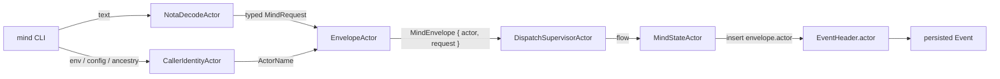

# 100 — Persona-mind architecture — designer companion

*Designer report. Operator/101
(`~/primary/reports/operator/101-persona-mind-full-architecture-proposal.md`)
is the architecture; operator/100
(`~/primary/reports/operator/100-persona-mind-central-rename-plan.md`)
is the consolidation that grounds it. This designer companion
contributes only what operator/101 explicitly leaves open or
doesn't pin. The first version of this report (commit
24d47bd) carried push backs that were wrong-shaped — see
§"Retracted from prior draft" below.*

---

## 0 · TL;DR

Operator/101 is the architecture: persona-mind is the central
state component (role coordination + memory/work graph in one
place). Operator/101 §4 commits to an **actor-dense** runtime
— `MindRootActor` supervises eight top-level supervisors
(`ConfigActor`, `IngressSupervisorActor`,
`DispatchSupervisorActor`, `DomainSupervisorActor`,
`StoreSupervisorActor`, `ViewSupervisorActor`,
`SubscriptionSupervisorActor`, `ReplySupervisorActor`); each
supervisor owns dozens of typed phase actors (decode, identity,
envelope, claim-normalize, claim-conflict, id-mint, clock,
event-append, commit, role-snapshot-view, ready-work-view,
commit-bus, …); per-role / per-item / per-table actors fan out
beneath. *"If a phase has a name and a failure mode, it
probably deserves an actor; hundreds of actors are normal, not
exceptional"* (operator/101 §4). Lock files are retired
(Phase 3 = typed read views, not projections); `mind.redb`
holds the typed truth via `persona-sema`.

This report contributes five concrete pins for what
operator/101 names but doesn't fully specify. Each pin lives
*inside* a named actor in operator/101's tree — these are
implementation contracts for those actors, not new structure.

| Section | Pin | Lives inside |
|---|---|---|
| §1 | `DisplayId` mint algorithm | `IdMintActor` |
| §2 | concrete sema table key shapes | per-table actors (`ClaimTableActor`, `ItemTableActor`, `EdgeTableActor`, `NoteTableActor`, `AliasTableActor`, `ActivityTableActor`) |
| §3 | caller-identity resolution mechanism | `CallerIdentityActor` + `EnvelopeActor` |
| §4 | `mind.redb` path with env override | `ConfigActor` |
| §5 | subscription contract sketch (Phase 5) | `CommitBusActor` + `SubscriberActor` |

§6 names open questions worth surfacing before Phase 2.

---

## 1 · `DisplayId` mint algorithm — `IdMintActor` implementation

Current contract has `DisplayId(String)`
(`/git/github.com/LiGoldragon/signal-persona-mind/src/lib.rs:441`)
without a generation spec. Operator/101 §4 names `IdMintActor`
under `StoreSupervisorActor` as the source of minted IDs.
The data lives on `IdMintState` (the actor's typed state per
the four-piece-per-file shape in
`~/primary/skills/rust-discipline.md` §"Actors"); the verb is
a method on it:

```rust
impl IdMintState {
    /// Mint a fresh DisplayId for `item`, extending the prefix
    /// length on collision against the in-memory index. The
    /// new alias is recorded in `self.display_index` before
    /// the method returns, so subsequent calls in the same
    /// transaction see it.
    pub fn mint_display_id(&mut self, item: &StableItemId) -> DisplayId {
        // base32-crockford encoding of BLAKE3(StableItemId).
        // Crockford avoids 0/O 1/I/l confusion — important
        // for human transcription and LLM tokenisation.
        let full = self.encode(item);
        (3..)
            .map(|len| DisplayId::new(&full[..len]))
            .find(|candidate| !self.display_index.contains(candidate))
            .map(|candidate| {
                self.display_index.insert(candidate.clone());
                candidate
            })
            .expect("BLAKE3 has 256 bits; collision exhaustion impossible")
    }
}
```

`IdMintState::encode` (also a method) wraps the BLAKE3 +
base32-crockford pipeline; both are calls into external
crates (`blake3`, a base32 helper) — no project-side free
functions in the algorithm.

Examples of minted DisplayIds (illustrative): `9iv`, `kxa`,
`ffj` (3-char default); `9ivx` (collision-extended).

No workspace prefix on the wire (`9iv`, not `mind-9iv`, not
`primary-9iv`). Imported BEADS aliases (`primary-9iv` style)
preserve the old token via `ExternalAlias` records;
resolution goes through the `ALIASES` index, not the
`DISPLAY_IDS` index.

`IdMintState` also owns the methods that mint `StableItemId`
(BLAKE3 of `workspace_salt || EventSeq || hash(payload)`),
`OperationId`, and `EventSeq` (read from the `META` counter).
Operator/101 §6 lists *"item IDs, display IDs, imported-alias
records"* as store-minted; `IdMintActor`'s state is the
single owner.

---

## 2 · Concrete sema table key shapes — per-table actor contracts

Operator/101 §6 names tables; §4.8 and §12 name per-table
actors (`ClaimTableActor`, `ItemTableActor`, `EdgeTableActor`,
`NoteTableActor`, `AliasTableActor`, `ActivityTableActor`).
Per `~/primary/reports/assistant/90-rkyv-redb-design-research.md`
§"Do Not Store Arbitrary rkyv Archives as redb Keys" —
keys are designed bytes, not rkyv-encoded. Each table actor
owns one key shape:

| Owner actor | Table | Key | Value |
|---|---|---|---|
| `ClaimTableActor` | `CLAIMS` | `(role_byte, scope_kind_byte, scope_bytes)` | `Claim` |
| `HandoffTableActor` | `HANDOFFS` | `OperationId` bytes | `Handoff` |
| `ActivityTableActor` | `ACTIVITIES` | `EventSeq(u64)` BE bytes | `Activity` |
| `ItemTableActor` | `ITEMS` | `StableItemId` bytes | `Item` |
| `EdgeTableActor` | `EDGES_BY_SOURCE` | `(StableItemId, edge_kind_byte, EdgeTargetBytes)` | `Edge` |
| `EdgeTableActor` | `EDGES_BY_TARGET` | `(EdgeTargetBytes, edge_kind_byte, StableItemId)` | `Edge` |
| `NoteTableActor` | `NOTES_BY_ITEM` | `(StableItemId, EventSeq)` | `Note` |
| `AliasTableActor` | `ALIASES` | `ExternalAlias` bytes | `StableItemId` |
| (display-id table actor) | `DISPLAY_IDS` | `DisplayId` bytes | `StableItemId` |
| `EventAppendActor` | `EVENTS` | `EventSeq(u64)` BE bytes | `Event` |
| (meta actor) | `META` | `&'static str` | `Vec<u8>` |

Type-discriminator bytes (`role_byte`, `scope_kind_byte`,
`edge_kind_byte`) are 1-byte enum tags chosen at the
application layer, documented in `persona-mind/src/tables.rs`,
and protected by schema-version bumps. Big-endian encoding for
numeric keys gives lexicographic ordering equal to numeric
ordering — important for range scans on `EVENTS` and
`ACTIVITIES`.

Per operator/101 §4 ("only `SemaWriterActor` opens write
transactions"), the table actors are *typed views* over the
single writer's transactions — they shape and validate write
intents but don't independently open transactions.

---

## 3 · Caller-identity mechanism — `CallerIdentityActor` + `EnvelopeActor` contracts

Operator/101 §8 raises the open issue (*"current memory
mutations need a reliable actor identity ... if the CLI
derives actor identity from the role configuration, the actor
field must still enter the typed state transition before
persistence"*). Operator/101 §15 hedges to *"Add or confirm a
common request envelope carrying actor identity."* Operator/101
§4 names `CallerIdentityActor` + `EnvelopeActor` under
`IngressSupervisorActor` as the runtime locations.

Concrete contracts for those two actors:

### `CallerIdentityActor` — three-layer resolution

Determines the calling actor in priority order:

1. **`MIND_ACTOR` env var** — explicit override; primarily
   for test harnesses and one-shot pipelines.
2. **`~/.config/persona/actor.toml`** — per-machine default:
   ```toml
   actor = "designer"
   ```
3. **Process-ancestry resolver** — same shape
   `persona-message`'s `actors.nota` resolver uses
   (`/git/github.com/LiGoldragon/persona-message/src/resolver.rs`).
   Walks the process tree; matches PID against registered
   actor bindings; returns the matched `ActorName`.

If none of these yields an `ActorName`, the actor returns a
typed identity-failure that `IngressSupervisorActor` routes
through `ErrorShapeActor` → `NotaReplyEncodeActor`. No
implicit "unknown" actor is ever stamped on an event.

### `EnvelopeActor` — wire-shape construction

Wraps the typed `MindRequest` from `NotaDecodeActor` together
with the resolved `ActorName` from `CallerIdentityActor`:

```rust
MindEnvelope {
    actor:   resolved_caller_identity,    // from CallerIdentityActor
    request: typed_request,               // from NotaDecodeActor
}
```

The envelope is what `DispatchSupervisorActor` receives —
operations downstream see the envelope, never the raw request.

### Dispatcher enforcement (the load-bearing rule)

`MindStateActor` (and every domain flow actor — `ClaimFlowActor`,
`MemoryFlowActor`, etc.) reads `envelope.actor` and inserts it
into the `EventHeader.actor` of every persisted event. Per
ESSENCE §"Infrastructure mints identity, time, and sender":
the wire carries the envelope, but the **typed request payload
itself carries no actor field** — the type system enforces
that the agent's `Opening`, `NoteSubmission`, `Link`,
`StatusChange`, `AliasAssignment`, `Query` cannot supply or
override actor identity.



### Architectural-truth witnesses

| Witness | Catches |
|---|---|
| Request body cannot supply actor | Compile-fail — `Opening`, `NoteSubmission`, `Link`, `StatusChange`, `AliasAssignment`, `Query` literally have no `actor` field |
| `EventHeader.actor` equals `MindEnvelope.actor` | Synthetic-envelope test — submit `MindEnvelope { actor: ActorName::new("designer"), request: Opening { … } }` through the actor tree; assert resulting `ItemOpenedEvent.header.actor == ActorName::new("designer")`; vary actor; assert lockstep |
| Identity failure routes through `ErrorShapeActor` | Run `mind` with `MIND_ACTOR` unset and no config and no resolvable ancestry; assert reply is a typed `Rejected(IdentityFailure)`, not a panic and not a default actor |

### Trust note

`MIND_ACTOR` env override is trust-on-first-use; in a
single-user workspace this is fine. For multi-user contexts,
fall through to process ancestry which is harder to spoof
(requires controlling a parent process registered as that
actor). Stronger actor authentication (e.g. signed
`AuthProof`) is deferred — `signal-persona-mind` doesn't
carry an `AuthProof` shell yet, and adding one is a
coordinated schema bump for a later wave.

---

## 4 · `mind.redb` path with env override — `ConfigActor` contract

Operator/101 §6 says workspace-local first; operator/101 §4
names `ConfigActor` as the supervisor-tree owner of paths.
Pin the exact path + env override before Phase 2:

| Source | Path | When |
|---|---|---|
| `MIND_DB_PATH` env var | (override) | Test isolation; CI; future multi-workspace |
| `ConfigActor` default | `~/primary/.mind/mind.redb` | The standard path |

`~/primary/.mind/` is gitignored. The path mirrors per-workspace
shape `<role>.lock` files used today (until they're retired in
Phase 3). System-level multi-workspace deployment can move the
location behind `ConfigActor` configuration without changing
the contract.

---

## 5 · Subscription contract sketch — `CommitBusActor` + `SubscriberActor` wire

Operator/101 §4 names `CommitBusActor` + `SubscriberActor`
under `SubscriptionSupervisorActor`; operator/101 §14 Phase 5
names "Post-commit subscriptions" without fixing the wire
shape. Worth sketching now so consumers (router, harness,
future external integrations) can plan for it:

```rust
pub enum MindRequest {
    // …existing 12…
    Subscribe(Subscribe),
    Unsubscribe(Unsubscribe),
}

pub enum MindReply {
    // …existing…
    SubscriptionAccepted(SubscriptionAccepted),
    SubscriptionEvent(SubscriptionEvent),
    UnsubscribeAcknowledgment(UnsubscribeAcknowledgment),
}

pub struct Subscribe {
    pub filter: SubscribeFilter,
}

pub enum SubscribeFilter {
    AllEvents,
    Coordination,                       // role/handoff/activity changes
    Memory,                             // item/edge/note/alias changes
    ItemsOfKind(Kind),
    EventsForItem(ItemReference),
}
```

Per `~/primary/skills/push-not-pull.md` §"Subscription
contract" — every subscription emits the producer's current
state on connect, then deltas. `SubscriberActor` handles the
on-connect emission per filter:

| Filter | On-connect emission | Then deltas |
|---|---|---|
| `AllEvents` | Every event from a starting `EventSeq` (default current+1) | Every committed event |
| `Coordination` | Current `RoleSnapshot` from `RoleSnapshotViewActor` | Coordination-touching events |
| `Memory` | Current `View` snapshot from memory view actors | Memory-touching events |
| `ItemsOfKind(k)` | Current `Item` projections of kind `k` | Events affecting matching items |
| `EventsForItem(ref)` | Recent events for the item | Events affecting the item |

`CommitBusActor` is the post-commit fanout — every commit by
`CommitActor` produces a typed event; `CommitBusActor` routes
the event to every `SubscriberActor` whose filter matches.
No polling; subscription wakes are push-driven from the
commit.

---

## 6 · Open questions worth surfacing

Concerns that need designer/operator dialogue before Phase 2,
beyond what operator/101 §15 already lists:

1. **Item kind `Note` vs Note records on items.** Contract has
   `Kind::Note` (an item kind) AND a `Note` record (commentary
   on any item). Standalone observations → `Kind::Note` items;
   commentary on tracked work → `Note` attached to the work
   item. Worth documenting in `signal-persona-mind/ARCHITECTURE.md`
   so an agent doesn't have to reverse-engineer the convention.

2. **`Status::Blocked` vs `EdgeKind::DependsOn` open blocker.**
   Two ways to express "this can't proceed": status flag or
   incoming open dependency. Lean: `Blocked` is for *external*
   blockers (waiting on a human, infra); `DependsOn` on an
   open item is *internal* blocking. Both legitimate; document
   the distinction.

3. **`HANDOFFS` table semantics.** Operator/101 §6 names the
   table; operator/101 §7 says *"a handoff is not a release
   plus a claim. It is a typed transition with one event that
   preserves provenance."* Is `HANDOFFS` append-only history
   with current pending state derivable, or live mutable
   pending-handoff state? Lean append-only.

4. **CLI sub-shims.** Acceptable as long as they lower into
   the canonical `mind '<NOTA record>'` form. Operator/101
   §11 already names the rule. Pin the sub-shim set before
   Phase 4; suggest `mind ready` / `mind open <kind> <title>`
   / `mind note <id> <body>` as the v1 set.

5. **`Body(String)` typed migration.** Same `primary-b7i`
   wave that touches `signal_persona::Message::body` and
   `signal_persona_harness::DeliverMessage::body`. Mind's
   `Body(String)` field travels with that migration; no
   separate handling needed.

6. **Actor density vs. test surface.** Operator/101 §4
   commits to "hundreds of actors normal" — each phase actor
   becomes a test seam. Worth confirming: are
   architectural-truth tests expected per actor (e.g.
   `ItemActor`, `EdgeActor`, `GraphTraversalActor` each have
   their own behavioral contract test), or only at supervisor
   boundaries? §4.8 says *"if a future agent claims 'the
   item graph is actor-based' but there is no `ItemActor`,
   no `EdgeActor`, and no `GraphTraversalActor`, the
   architecture truth tests should fail"* — so per-actor
   existence tests at minimum, plus per-actor behavioral
   tests for the load-bearing ones.

---

## Retracted from prior draft

The first version of this report (commit 24d47bd) carried
five push backs in §2 that were wrong-shaped:

- **§2.1 — actor framing in Phase 1.** The push back argued
  for plain methods on `MindState` until subscriptions land,
  treating actors as ceremony around a one-shot CLI. This was
  wrong-shaped on two counts. *First*: persona-mind is the
  central state component, not a CLI; the actor structure is
  the component's shape across phases; the CLI is one short-
  lived access path. *Second*: operator/101 §4 has since been
  hardened to an explicit actor-dense system (eight top-level
  supervisors, dozens of per-phase actors, per-role / per-item
  / per-table fanout, *"hundreds of actors normal, not
  exceptional"*). The push back wasn't just missing the
  small actor tree — it was opposite to the explicit design
  intent that every named phase with a failure mode gets its
  own actor. Retracted.
- **§2.3 — `Status::Closed` carries no `Resolution`.** The
  push back proposed adding closure metadata to `Status`, but
  closure relationships (`Duplicates`, `Supersedes`,
  `Answers`) already live on `EdgeKind`. The current
  contract's design (flat Status; semantic relationships on
  edges) is intentional and the right separation. Retracted.
- **§2.5 — flat `MindRequest`.** Already light; recommended
  stay-flat; no real disagreement. Dropped from this version
  because there's nothing to push back on.

The remaining /98 §2.2-derived observations (`EventHeader.actor`
filling from a trustworthy source; `Body(String)` flagging for
typed-Nexus migration) appear in this revised version where
they're load-bearing — §3 (caller-identity mechanism, now
mapped to `CallerIdentityActor` + `EnvelopeActor`) and §6
(open questions) respectively.

The prior draft also referenced "lock-file projections" as
mind's compatibility output. Operator/101 has been updated
since: lock files are retired entirely (Phase 3 is "Typed
read views"; §7 says *"Mind does not keep lock files alive as
projections. Old lock files are migration artifacts only."*).
This revised version aligns with that direction throughout.

---

## See also

- `~/primary/reports/operator/100-persona-mind-central-rename-plan.md`
  — the consolidation that grounds operator/101.
- `~/primary/reports/operator/101-persona-mind-full-architecture-proposal.md`
  — the architecture this report companions; §4 is the
  actor-dense runtime each section here pins implementations
  inside.
- `~/primary/reports/assistant/90-rkyv-redb-design-research.md`
  §"Do Not Store Arbitrary rkyv Archives as redb Keys" —
  the basis for §2 explicit byte-key shapes.
- `~/primary/reports/designer/97-persona-system-vision-and-architecture-development.md`
  §6 — typed Nexus body migration (primary-b7i); applies to
  mind's `Body(String)` fields too (§6 here).
- `/git/github.com/LiGoldragon/signal-persona-mind/src/lib.rs`
  — the contract today; lines cited.
- `/git/github.com/LiGoldragon/persona-message/src/resolver.rs`
  — the process-ancestry resolver shape §3 reuses.
- `~/primary/ESSENCE.md` §"Infrastructure mints identity, time,
  and sender" — the rule §3 dispatcher-enforcement applies.
- `~/primary/skills/push-not-pull.md` §"Subscription contract"
  — the on-connect-current-state rule §5 follows.
