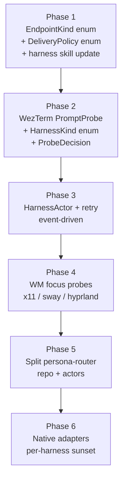

# Persona-message current state + gate design audit

Date: 2026-05-07
Author: Claude (designer)

A read of the persona-message + persona-wezterm code on
2026-05-07, plus a second-pass audit of the operator's
`reports/operator/6-prompt-empty-delivery-gate-design.md`
after the operator's same-day update. The audit confirms the
gate's framing as a *guarded fallback transport*, records
that **every structural concern from the prior pass is
addressed** in the current report, surfaces the new
router-split + block-reasons-as-subscriptions shape, and
flags four polling-shaped residuals that motivate a separate
"no-polling design" follow-up report.

---

## 1. Where we are

Persona-message has reached *naive round-trip working between
real interactive harnesses*. As of the operator's
`5-persona-message-real-harness-test-plan.md`:

- `nix run .#test-actual-codex-to-claude` passes.
- `nix run .#test-actual-claude-to-codex` passes.
- `nix run .#test-basic` passes.

The first end-to-end live test is green. The crate's surface:

- `schema.rs` — `Actor`, `Message`, `MessageId` (typed
  3-character base32 short hash with `m-` prefix +
  `MessageIdKind` enum + `MessageIdView` parser),
  `EndpointTransport`, `EndpointKind`, `Attachment`,
  `ThreadId`, `ActorId`, `expect_end()` helper.
- `command.rs` — `Send`, `Inbox`, `Tail`, `Input` enum,
  `Output` enum (`Accepted`, `InboxMessages`), `CommandLine`
  argument decoder.
- `store.rs` — `MessageStore` with `actors()`,
  `resolve_sender()`, `append()`, `deliver()`, `messages()`,
  `inbox()`, `tail()`. `Actor::deliver` dispatches by
  `endpoint.kind.as_str()`.
- `daemon.rs` — Unix-socket daemon (`message-daemon` binary)
  that lets the `message` CLI bypass per-call store work.
  Frame protocol is rkyv length-prefixed.
- `resolver.rs` — `ProcessAncestry` walking
  `/proc/<pid>/status` `PPid:` lines + `ActorIndex` lookup.

Twenty-five scripts in `scripts/` cover setup/teardown for
visible/headless WezTerm, Codex, Claude, and Pi harnesses;
test entry points; debug commands. Stateful work is named per
`skills/autonomous-agent.md`'s "stateful test command becomes
a named script" rule — clean.

Sender identity is stamped by the binary via process
ancestry, not trusted from model text. The discipline is
preserved.

The trigger for the gate report: a live Pi test exposed
**human typing + injected message bytes splicing into one
prompt line.**

---

## 2. Audit of the gate design

The gate-design report has been substantially updated. The
update materially improves the document on every structural
concern previously raised:

| Prior concern | Status |
|---|---|
| Sunset rule named at the top | ✅ Added (lines 27–31) |
| Polling carve-out explicit | ✅ Added (lines 347–352) |
| `harness_kind` is a closed enum | ✅ Added (lines 307–319) |
| Cancellation mechanism specified | ✅ Added (lines 354–361) |
| Retry loop event-driven, not timer | ✅ Added (whole new section, 433–540) |
| Harness skill teaches deferred outcomes | ✅ Added to Phase 1 plan |
| `EndpointKind` typed enum | ✅ Added (lines 189–208) |
| `DeliveryPolicy` typed enum | ✅ Added (lines 199–204) |

Two substantive new shapes also land in the update:

### 2.1 Router-split as Phase 5

The runtime piece formerly called `message-daemon` is renamed
`persona-router` and proposed to live in its own repo.
Persona-message keeps the contract crate + CLI;
`persona-router` owns runtime routing, harness actors,
desktop event sources, pending-delivery state, retries,
typed route decisions.

This is the right shape per `skills/micro-components.md`:
routing is a distinct capability from the message contract;
the split lands the boundary at the filesystem layer where
it can't decay under deadline pressure.

A single layered note worth flagging: **`persona-router` is
itself transitional substrate** on the path to the persona
reducer. The destination per
`reports/designer/4-persona-messaging-design.md`
is one reducer owning all transitions. Persona-router is
the sketch shape; the reducer absorbs it later. Worth a
single sentence in the gate report stating this layered
status — the same "not the destination, the bridge" framing
that the gate itself now carries.

### 2.2 Block reasons as subscriptions

Every deferred delivery records a typed block reason; each
block reason points at the subscription that resolves it:

```
blocked_on_focus              → subscribe focus-changed
blocked_on_non_empty_prompt   → subscribe screen/input-changed
blocked_on_busy               → subscribe idle/screen-changed
blocked_on_unknown            → last-resort backoff timer
```

This is push-not-pull applied with discipline: the consumer
(router) doesn't poll the producer (WM or harness daemon);
the consumer subscribes when blocked, unsubscribes when no
work is pending. **Right shape.**

The `DesktopEvent::FocusChanged { target, focused }` enum and
the `DesktopEventSource` enum (with WezTerm/X11/Sway/Hyprland
variants) are well-designed for typed event normalization.

### 2.3 Remaining concerns — polling residuals

Despite the substantial improvement, **four polling-shaped
patterns remain** in the design:

1. **`PollingFallback` is a `DesktopEventSource` variant**
   (line 483). The operator's preferred local order ends:
   "Slow polling fallback only while a message is pending."
   Per `skills/push-not-pull.md`: a poll "for now" never gets
   removed. The sunset rule for the gate itself doesn't cover
   the polling fallback inside the gate.

2. **30–75ms debounce on focus events** (lines 510–516):
   "focus event → wait 30–75ms → collect current state → run
   gate." The wait is a small polling window — waiting for
   state to stabilize. The reachability-probe carve-out in
   `skills/push-not-pull.md` covers a one-shot read; the
   debounce introduces a wait-and-resample pattern that the
   carve-out doesn't cover.

3. **Stable-interval check** (50ms two-snapshot, lines
   333–352). The report names the workaround correctly. The
   deeper question — *can the workaround be removed entirely
   by refusing to deliver until the input-region-changed push
   event exists?* — sits outside this report's scope and
   motivates the no-polling follow-up.

4. **`blocked_on_unknown` → last-resort backoff timer**
   (line 530). If state is unknown and no event source
   resolves it, the design falls back to a timer. Per
   push-not-pull, the right answer is *don't deliver* until
   a push primitive exists for that state.

The right pattern in each case: **if you can't subscribe,
defer indefinitely** — the message stays queued until either
a push primitive is built or the user manually discharges
it. The user has steered toward "design a system without
polling"; the no-polling design report explores what each of
the four residuals becomes when polling is removed.

---

## 3. Cross-cutting concerns inside persona-message

Items separate from the gate design — observed reading the
crate as it stands today.

### 3.1 `EndpointKind` typed-enum migration is queued in Phase 1

Per the operator's updated Phase 1: "Replace stringly
`EndpointKind` dispatch with a closed `EndpointKind` enum."
The gate report now explicitly carries the typed enum shape:

```rust
enum EndpointKind {
    Human,
    Native,
    PtySocket,
    WezTermPane,
}
```

…and notes "Adding a new endpoint kind must force an
exhaustive match update." Pairs with the `_ => Ok(false)`
silent-drop branch in current `Actor::deliver` going away.
**Right move.** No further action from this audit; covered.

### 3.2 `Tail` arm in `Input::execute` is dead

```rust
Self::Tail(_) => {
    let recipient = store.resolve_sender()?;
    let stdout = std::io::stdout();
    store.tail(&recipient, stdout.lock())?;
    unreachable!("tail returns only on error")
}
```

The real `Tail` path runs through `Input::run` (which
intercepts `Tail` before either daemon-routing or
`execute()`). The `execute` arm is unreachable in correct
code. Typification smell: `Tail` shouldn't be in the same
enum as `Send`/`Inbox` if its dispatch shape differs.

Two cleaner shapes:

- **Two enums** — `RequestInput { Send, Inbox }` for things
  that produce an `Output`; `StreamInput { Tail }` for things
  that take ownership of the stdout stream until killed.
- **`Output::Stream` variant** — `Tail` returns an `Output`
  whose contents are an iterator/stream, with the daemon
  handling the streaming endpoint differently.

The first is closer to perfect-specificity. Not blocking;
worth fixing before more variants pile on.

### 3.3 `error.rs` uses `Agent` where `schema.rs` uses `Actor`

```rust
#[error("no actor in {path:?} matches this process ancestry")]
NoMatchingAgent { path: PathBuf },
```

The variant name and the message disagree — leftover from a
pre-rename pass. Quick fix: `NoMatchingAgent` →
`NoMatchingActor`.

### 3.4 Doc/live drift — `actors.nota` vs `agents.nota`

Code, README, and `skills.md` say `actors.nota`. Live test
artifacts in `.message/` use `agents.nota` with `(Agent …)`
records (without endpoint field). Pre-rename test artifacts;
not a correctness issue. Worth either gitignoring the stale
file or cleaning it up next time tests are touched.

### 3.5 `Cargo.toml` has direct path deps

```toml
nota-codec      = { path = "../nota-codec" }
persona-wezterm = { path = "../persona-wezterm" }
```

Per `lore/rust/style.md`: "Do NOT use `path = "../sibling"`
directly in a Cargo.toml — that assumes a layout that a
fresh clone won't reproduce. Let the flake populate the
paths." If the flake's `postUnpack` populates these symlinks
(or the dev shell does), this is fine. Otherwise the
git-URL form with `cargoLock.outputHashes` is preferred.

Worth confirming which path is actually load-bearing in the
flake. (Not blocking; surfaced for completeness.)

### 3.6 `Attachment` field in `Message`

Always emitted as `[]` today; never set; nothing reads it.
Per `skills.md`: "Do not add destination records unless a
test drives behavior through them." Same principle for
fields. Drop `attachments` until a test drives it; add back
when the first attachment-bearing test lands.

---

## 4. The shape of the next move

The operator's Phase 1–6 mapped to a clean sequence after
the update:



The dependency order is now clean. Phase 1 unblocks Phase 2
through the typed enums. Phase 3 needs Phase 2's probe.
Phase 5's router split is independent enough that it can
land in parallel with Phase 4 if desired.

---

## 5. Calling out what's good

Persona-message + persona-wezterm + the gate design are now
in materially better shape than yesterday. To balance the
audit:

- **Live-test green** as of 2026-05-07. End-to-end
  bidirectional path works.
- **Sender identity is tool-stamped**, not model-claimed.
- **MessageId design is exemplary** — typed `MessageIdKind`
  enum, prefixed wire form, `MessageIdView` parser. "Don't
  hide typification in strings" applied perfectly.
- **Schema has been narrowed.** No `Authorization`, no
  `Delivery`, no lifecycle enums in the prototype.
- **Persona-wezterm separation is clean.** Right
  micro-components shape.
- **`scripts/` discipline followed.** 25 named scripts;
  flake-exposed Nix entry points.
- **Gate report's update is high-leverage.** Sunset rule at
  top; typed enums for `EndpointKind`, `DeliveryPolicy`,
  `HarnessKind`; cancellation mechanism specified;
  event-driven retry as default; router-split named.
- **Block-reasons-as-subscriptions** is the right shape.
  Push-not-pull applied with discipline.
- **`UnsafeTerminalSubmit`** is named ugly on purpose —
  beauty as criterion working in reverse: the ugliness IS
  the diagnostic.

The substrate is past the demonstration threshold. The gate
design is the bridge from "demonstration" to "first
production-shaped harness adapter." The shape is right; the
remaining polling residuals are what the no-polling
follow-up addresses.

---

## 6. Recommendations in priority order

Most prior recommendations are now satisfied by the
operator's update. Remaining items:

1. **Address the four polling residuals** — see the
   forthcoming `12-no-polling-delivery-design.md`
   for the deeper treatment.
2. **Add a sentence to the gate report** stating that
   `persona-router` is itself transitional substrate on the
   path to the persona reducer. The same "not the
   destination, the bridge" framing the gate itself carries.
3. **Land `EndpointKind` typed-enum migration** as the
   operator's Phase 1 already plans.
4. **Trim the `attachments` field** from `Message` until a
   test drives it. Small commit; consistent with the
   schema-narrowing already done.
5. **Rename `NoMatchingAgent` → `NoMatchingActor`.** One-line
   error.rs cleanup.
6. **Fix `Tail` arm typification** — split the input enum or
   move `Tail` to a streaming output shape. Before more
   stream-shaped variants land.
7. **Confirm flake handling** of the path deps in
   `Cargo.toml` — git-URL form preferred per `lore/rust/style.md`.
8. **Clean up stale `.message/agents.nota`** state.

(1) is the substantive design follow-up the user has just
asked for. (2) is one paragraph in the operator's report.
(3)–(8) are persona-message-internal cleanups; all small;
operator's territory.

---

## 7. Open questions for the operator

1. **Is the WezTerm Lua-script delivery option** in scope
   for Phase 4 or later? The updated report acknowledges it
   as "a later optimization, not the first implementation"
   (line 360). Worth a focused look once Phase 3 is stable —
   the cross-process race goes away inside WezTerm's event
   loop.
2. **Per-harness adapters — separate crates or modules?**
   Same question as last pass. My lean: one crate
   (`persona-harness-recognizers` or similar) with
   per-harness modules until a second non-recognizer
   capability per harness lands.
3. **Native adapters — Pi first?** Operator's Phase 6 names
   Pi first. Worth a brief research check on whether
   Codex/Claude have public protocols sooner.
4. **Persona-wezterm's growing surface.** The operator
   notes (line 233): "For persona-owned PTYs, we should
   eventually stop depending on WezTerm's screen parser and
   maintain our own terminal state model in
   `persona-wezterm-daemon`." That's a substantial
   extension. Worth a focused design pass on the screen-state
   model when it lands. Likely earns its own report.

---

## 8. See also

- `reports/operator/6-prompt-empty-delivery-gate-design.md`
  — the audit target.
- `reports/operator/5-persona-message-real-harness-test-plan.md`
  — the test infrastructure the gate plugs into.
- `reports/operator/4-persona-message-plane-design.md`
  — the message-plane background.
- `reports/designer/5-persona-message-audit.md` —
  the prior persona-message audit; trim discipline lineage.
- `reports/designer/4-persona-messaging-design.md`
  — the full reducer-based fabric design; the gate is one
  endpoint adapter inside that design.
- `reports/designer/6-real-harness-test-architecture.md`
  — the test-architecture parallel-read.
- `reports/designer/12-no-polling-delivery-design.md`
  *(forthcoming)* — the deeper treatment of the four
  polling residuals identified in §2.3.
- `~/primary/skills/rust-discipline.md` §"Don't hide
  typification in strings" — the rule the prior
  `EndpointKind` violated.
- `~/primary/skills/push-not-pull.md` — the rule the
  polling residuals run against.
- `~/primary/skills/beauty.md` — the criterion that names
  `UnsafeTerminalSubmit`'s ugliness as a feature.
- `persona-message`'s `skills.md` and
  `skills/persona-message-harness.md` — the repo skill +
  harness skill that need the Phase-1 doc update.
- `persona-wezterm`'s `ARCHITECTURE.md` — the transport
  layer the gate sits on top of.

---

*End report.*
