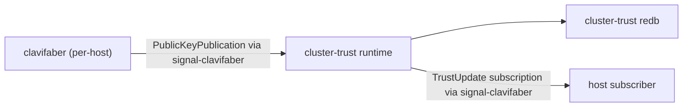

# 110 — Cluster-trust runtime placement

*Designer report. Resolves `primary-rab` (cluster-registry component
identity). Records the user's decision and supporting clarifications:
the cluster-trust runtime is a NEW sibling component in the auth/security
ecosystem; ClaviFaber stays narrow; pragmatic Criome (today's
sema-ecosystem records validator) does not yet house auth/security;
ideal Criome eventually encompasses everything.*

*Supersedes two earlier drafts (commits `81125fa3` and `5df136a2`) —
both numbered 110, both wrong on the ecosystem boundary. The git log
captures their content; this version is the corrected placement.*

---

## 0 · TL;DR

| Question | Answer |
|---|---|
| Where does the cluster-trust runtime live? | **A new sibling component in the auth/security ecosystem**, not inside ClaviFaber and not inside the current `criome` daemon. |
| Why not extend ClaviFaber? | ClaviFaber is intentionally narrow — a key-generation shim for legacy systems (SSH, X.509, Yggdrasil, WiFi certs) that ideal Criome will eventually obsolete. It does not grow new responsibilities. |
| Why not place it in the current `criome` daemon? | Pragmatic Criome today is the sema-ecosystem records validator (Graph/Node/Edge/Derivation/CompiledBinary). It does not currently encompass auth/security. The idealistic framing in `criome/ARCHITECTURE.md` describes the *eventual* shape, not today's. |
| What about ideal Criome? | Eventually, when ideal Criome is realized, it encompasses everything — auth/security included, this cluster-trust runtime among the things that route through it. Today it doesn't. |
| Repo name for the new component? | Open question. System-specialist's call when implementation lands. Candidates: `criome-cluster-trust`, a fresh name in the auth/security family, or something cleanly distinct. Not deciding here. |

---

## 1 · The placement question and what it isn't

`primary-rab` asks where the cluster-trust runtime lives. The runtime
consumes per-host `clavifaber` `PublicKeyPublication` records, holds
cluster-wide trust state, distributes `TrustUpdate` events to host
subscribers (per `primary-e3c`'s shape — `ClusterRegistryActor` +
`TrustDistributionActor`).

Three placements were on the table over the prior drafts:

| Placement | Verdict | Why |
|---|---|---|
| Inside Persona ecosystem (e.g. `persona-trust`) | **Wrong** | Persona owns workspace-scope durable-agent state. Auth/security/identity is not workspace-scope; it's machine + cluster scope. Ecosystem mismatch. |
| Inside the current `criome` daemon | **Wrong** | Pragmatic `criome` today is the sema-ecosystem records validator. It does not currently encompass auth/security. The idealistic framing in `criome/ARCHITECTURE.md` describes the eventual shape; today's pragmatic scope is narrower. |
| Extending ClaviFaber to grow a cluster-side daemon | **Wrong** | ClaviFaber is deliberately narrow — a key-generation shim for legacy systems (SSH, X.509, Yggdrasil, WiFi certs) that ideal Criome will eventually obsolete. It does not grow new responsibilities. |

The right placement: **a NEW sibling component** in the auth/security
ecosystem — sibling to ClaviFaber by ecosystem membership, but
separate by repo and lifecycle. ClaviFaber stays per-host one-shot;
the new runtime is long-lived cluster-side; both are auth/security
components that ideal Criome will eventually subsume.

---

## 2 · Pragmatic vs ideal — the load-bearing distinction

This report applies the workspace's pragmatic-vs-ideal naming
discipline (per `ESSENCE.md` §"Pragmatic now, ideal later — different
things, different names"):

- **`Sema`** — eventual fully-specified knowledge representation.
  **`sema-db`** — current pragmatic typed database library
  (rename pending; the existing `sema` repo carries the load today).
- **`Criome`** — eventual universal validator/coordinator that
  encompasses everything (replaces Git, editor, SSH, web). **The
  current `criome` daemon** — pragmatic sema-ecosystem records
  validator (Graph/Node/Edge/Derivation/CompiledBinary, signs
  capability tokens). The existing `criome/ARCHITECTURE.md` blends
  both, leaning toward the eventual description; the implementation
  is narrower.

The earlier drafts of this report fell into the conflation trap.
The first draft (`81125fa3`) read "persona is the durable agent" too
broadly and placed cluster-trust in a hypothetical persona-* component.
The second draft (`5df136a2`) read "criome is the universal
validator" too broadly and placed cluster-trust in the existing
`criome` daemon. Both errors traced back to taking idealistic
framing as a present-tense description of pragmatic scope.

This third draft holds the distinction: cluster-trust runtime today
goes where today's auth/security work goes. The auth/security
ecosystem is real but not yet centralized; ClaviFaber is one
component, the cluster-trust runtime will be another, and ideal
Criome eventually subsumes both.

---

## 3 · ClaviFaber stays narrow

ClaviFaber's scope, per its `ARCHITECTURE.md` and per user's explicit
direction (2026-05-10):

- A **per-host key-generation shim**. Generates and rotates SSH host
  keys, Yggdrasil identity, WiFi certs, X.509 certificates.
- One-shot under systemd (per `primary-7a7`).
- Writes private material to `/var/lib/clavifaber/` at mode 0600.
- Writes public projection (`PublicKeyPublication`) to
  `/var/lib/clavifaber/publication.nota` at mode 0644.
- Existing ARCH explicitly disclaims being the cluster-database writer.
- **Does not grow.** ClaviFaber is intentionally disposable
  infrastructure — the legacy systems it serves (SSH, X.509, etc.)
  are themselves obsolescence targets. Once ideal Criome is realized,
  none of this matters as a separate concern.

The user's framing (2026-05-10): *"ClaviFaber is just a stupid fucking
tool that makes fucking private keys. It's not something that's going
to become really fucking huge and clever and all connected and godlike.
It's a stupid fucking shim tool to make the keys that these dumb
systems that are still alive for some unknown reason."*

The architectural reading: **deliberate non-expansion**. ClaviFaber's
narrowness is a feature. Its disclaimer ("the cluster database writer
belongs in the cluster-management/deployment layer that already owns
the database revision and deployment transaction... not ClaviFaber")
stays. The cluster-trust runtime is a different component in a
different repo.

---

## 4 · Pragmatic Criome doesn't house auth/security yet

The existing `criome` daemon today owns:

- typed records database (Graph/Node/Edge/Derivation/CompiledBinary)
- signal request validation
- effect-bearing verb dispatch
- capability-token signing

That's sema-ecosystem records. It is not auth/security at the level
of host identity, cluster trust, public-material publication. The
idealistic ARCH framing — *"eventually replaces Git, editor, SSH,
web"* — describes the eventual encompassment, not today's scope.

Placing the cluster-trust runtime inside today's `criome` repo would:

- conflate two pragmatic scopes (records validator + auth/security
  cluster registry) under one daemon
- lock in the conflation across consumer ARCH docs
- make the eventual rename/consolidation harder (more touch points)

So today: cluster-trust lives elsewhere, in its own component. When
ideal Criome arrives, the consolidation happens then.

---

## 5 · The new sibling component

The cluster-trust runtime is a long-lived daemon on the cluster's
central node (presumably Prometheus). Its responsibilities are
those named in `primary-e3c`:

Owned state and actors:

- `cluster-trust.redb` — durable per-host trust state. One slot per
  `NodeName` mapping to the latest committed `PublicKeyPublication`
  plus its commit slot and timestamp.
- `ClusterRegistryActor` — accepts publications from each host's
  ClaviFaber convergence; mints `Slot<PublicationCommit>` on commit;
  idempotent on re-submission.
- `TrustDistributionActor` — owns subscriber set; emits typed
  `TrustUpdate` events to subscribers per committed revision change.
  No polling.
- The `signal-clavifaber` channel (per `designer/111`) is the wire
  contract.

What it does NOT own:

- per-host private key material (ClaviFaber owns this)
- declarative cluster configuration / proposal data (`goldragon`
  owns this)
- deploy-time activation / installation (`lojix-cli` / `CriomOS`)
- workspace-coordination state (`persona-mind`)
- message routing / delivery (`persona-router`)
- sema-ecosystem records validation (current `criome`)

### Repo identity — open question

Naming and repo placement is the system-specialist's call when
implementation lands. Candidates this report flags but does not
decide:

- **`criome-cluster-trust`** — uses `criome-*` as the auth/security
  ecosystem prefix even though pragmatic Criome doesn't own
  auth/security yet (the prefix names the eventual home).
- **A fresh name** in the auth/security family — no `criome-*`
  prefix; the component earns its own name.
- **`clavifaber-cluster`** — explicitly NOT recommended (would
  signal ClaviFaber is expanding; ClaviFaber is not expanding).

System-specialist picks at implementation time. The report names the
shape, not the name.

---

## 6 · Eventual ideal Criome convergence

The eventual shape: ideal Criome encompasses validation, identity,
auth/security, programming, version control, network identity, web
request handling. Per the user (2026-05-10): *"eventually everything
will go through Criome. We're going to program through the Criome,
the Criome will validate everything, it'll replace Git, code editor,
SSH, web server."*

In that eventual world:

- ClaviFaber's per-host key generation routes through ideal Criome
  (or is obsoleted by ideal Criome's identity primitives).
- The cluster-trust runtime routes through ideal Criome (or is
  absorbed into ideal Criome's typed records).
- Sema-ecosystem records (today's pragmatic `criome` daemon) become
  one facet of ideal Criome's universal scope.

This convergence is the long-term direction. The placement decision
in this report is **for today** — which is pre-realization
("pre-duct-tape stage"). When ideal Criome lands, the
pragmatic-vs-ideal distinction collapses and the components named
here either move into Criome or are obsoleted alongside the legacy
systems they serve.

---

## 7 · What this report decides and doesn't decide

**Decides**:

- Cluster-trust runtime is a NEW sibling component, not inside
  ClaviFaber, not inside the current `criome` daemon, not inside the
  Persona ecosystem.
- ClaviFaber stays narrow — does not grow a cluster-side daemon.
- Pragmatic `criome` today does not house auth/security; the
  cluster-trust runtime does not extend its scope.
- Ideal Criome is the eventual convergence target; the new sibling
  component routes into it when ideal Criome is realized.
- Earlier drafts of this report (commits `81125fa3` and `5df136a2`)
  are superseded.

**Does not decide** (deferred to system-specialist or later beads):

- The new component's repo name and concrete file layout.
- The actor topology beyond what `primary-e3c` already names
  (`ClusterRegistryActor` + `TrustDistributionActor`).
- The redb table key shape for `cluster-trust.redb`.
- Deployment shape (which CriomOS module owns it; which systemd unit;
  failover; etc.).
- The `sema` → `sema-db` rename — flagged as separate work.
- Whether and how Criome's `ARCHITECTURE.md` gets a "this is
  pragmatic today; ideal later" marker — depends on `criome` repo
  ownership decision (system-specialist or operator).

---

## 8 · Follow-up beads and pointers

`primary-rab` closes with this report. Updates to other beads:

- `primary-e3c` (the implementation bead, currently labeled
  `repo:clavifaber`): the implementation lands in the new sibling
  component, not in `clavifaber`. Label needs updating when
  system-specialist picks up the work — `repo:clavifaber` →
  `repo:<new-component-name>`. Not relabeling pre-emptively because
  the name is still TBD.
- The two prior drafts' filed beads (persona-trust repo creation,
  persona/ARCH cluster-trust integration tests) were dropped in the
  prior rollback; do not refile.

Possible new beads (file when actively useful):

- *"Sema → sema-db rename"* — the workspace-wide rename; significant
  cascade. File when there's appetite for the work and a clear
  freeze window. Owner: operator (Rust + cargo) with system-specialist
  for flake.lock fan-out.
- *"Criome ARCH ideal-vs-pragmatic marker"* — small edit to
  `criome/ARCHITECTURE.md` flagging that the document describes the
  eventual shape and pragmatic today is narrower. Trivial work; file
  when system-specialist or operator is in `criome` source for any
  reason.

---

## See also

- `~/primary/ESSENCE.md` §"Pragmatic now, ideal later — different
  things, different names" — the upstream framing this report
  applies. (Landed in the same commit as this report.)
- `~/primary/protocols/active-repositories.md` — the active repo
  attention map; sema and criome rows now mark ideal-vs-pragmatic
  scope explicitly. (Landed in the same commit.)
- `~/primary/reports/designer/111-signal-clavifaber-contract-shape.md`
  — sibling report; defines the wire contract between per-host
  ClaviFaber and the cluster-trust runtime. (Updated to refer to
  the runtime by role rather than by repo name.)
- `~/primary/reports/1-gas-city-fiasco.md` — the failure-mode framing
  that grounds the broader workspace's durable-agent and
  no-reconciliation discipline.
- `/git/github.com/LiGoldragon/clavifaber/ARCHITECTURE.md` —
  ClaviFaber's current narrow scope; its disclaimer about the
  cluster-database writer stands.
- `/git/github.com/LiGoldragon/clavifaber/src/publication.rs:7-13` —
  the `PublicKeyPublication` shape that crosses the per-host →
  cluster-trust boundary.
- `/git/github.com/LiGoldragon/criome/ARCHITECTURE.md` — pragmatic
  `criome` daemon's described role (sema-ecosystem records validator,
  blended with idealistic vision).
- `/git/github.com/LiGoldragon/criome/README.md` — *"The Criome / A
  Universal Computing Paradigm"* — the upstream vision statement for
  ideal Criome.
