# 114 — Persona vision as of 2026-05-11

*Designer report. A panoramic synthesis of what Persona is, how it fits the
sema-ecosystem, how the human and the agents share the engine, and how
work opens and closes. Written after a full sweep of every workspace skill
and every active-repo `ARCHITECTURE.md`. Visuals + contracts + scenarios.*

---

## 0 · TL;DR

**Persona is the durable agent.**

It is the workspace's answer to two failure modes: one-shot agent CLIs
that hold no state across sessions, and reconciliation-stack controllers
that lose sight of what's actually happening. Persona replaces both with a
**federation of long-lived, supervised, typed daemons** — each owning one
plane of state, each speaking only through typed wire contracts, each
introspectable from outside.

The federation has six state-owning daemons, each a separate repo with
its own redb store and its own `signal-persona-*` contract, plus the
`persona-message` proxy that wraps `persona-router` on both edges:

| Component | What it owns |
|---|---|
| **`persona`** (engine manager) | Supervisor of the whole engine. Component health, lifecycle, engine status. |
| **`persona-mind`** | The work graph. Role coordination, activity, items, notes, edges, ready/blocked views. Replaces lock-files + BEADS. |
| **`persona-router`** | Message routing, delivery state, gate decisions. Sits between message senders and harnesses. |
| **`persona-message`** (proxy) | Nexus↔signal translation on `persona-router`'s edges. Inbound: Nexus-in-NOTA text from the user/agent surface → `signal-persona-message` frames into router. Outbound: router delivery → terminal-injection bytes into the harness's terminal cell. Stateless boundary; the router owns durable message state. Per bead `primary-2w6`. |
| **`persona-system`** | OS / window-manager observations (focus, prompt-buffer state). Pushed to both `persona-router` (for delivery decisions) and `persona-terminal` (for input gate state). |
| **`persona-harness`** | Harness identity, lifecycle, transcript. Models AI sessions (Codex, Claude, Pi) as addressable nouns. |
| **`persona-terminal`** | Durable terminal sessions, viewer attachments (Ghostty adapter), Signal adapter, viewer-adapter policy, component Sema metadata. **Where the agent CLIs actually run as PTY children.** Consumes `terminal-cell` (the low-level daemon-owned PTY/transcript primitive). |

Underneath sits the **sema-ecosystem**: `sema-db` (typed-database library),
`criome` (today's records validator), `signal-core` (wire kernel), the
`signal-*` contract crates. Persona links `sema-db` for storage and speaks
`signal-core`-framed messages.

**The human's only direct surface is the terminal** — typing into a
Ghostty viewer attached to a `persona-terminal` cell whose PTY child is
an agent CLI (Claude Code, Codex, …). The human's intent flows through
conversation with that agent; everything else (editing ESSENCE.md,
skills, reports; authoring NOTA deploy requests; opening and closing
work items) the agent materializes on the human's behalf.

**Agents take and close work** through `persona-mind`'s typed work graph.
A claim is a typed `RoleClaim` record; release is a typed `RoleRelease`;
opening a work item is an `Opening`; closing is a `StatusChange` to
`Closed`. The lock-file helper is the transitional projection; the
destination is the `mind` CLI as a thin client to the `persona-mind`
daemon.

**Persona today is built rightly for today's stack** (Rust on Linux,
direct Kameo, `sema-db`, signal-* wire). The **eventual** form is
Sema-on-Sema: every Persona component as a Sema program on a Sema
runtime on a Sema-written OS, with auth realized as Criome's
quorum-signature multi-sig. Per `ESSENCE.md` §"Today and eventually",
this is a **scope discipline, not a quality one** — each piece below is
built to be eventually impossible to improve in its current scope, not
sketched as a draft of the eventual.

---

## 1 · The bird's-eye view

Three focused diagrams instead of one giant map. Each shows one slice;
together they're the engine.

### 1.1 · The terminal loop — human and agent share a cell

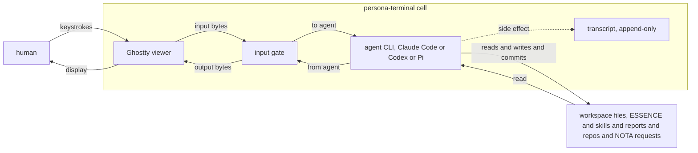

The agent is the PTY child. The human and the agent share the PTY
through the input gate; both write into the same byte stream, gated for
mutual exclusion. The agent — not the human — is what reads and writes
workspace files.

### 1.2 · The federation — six daemons plus the persona-message proxy

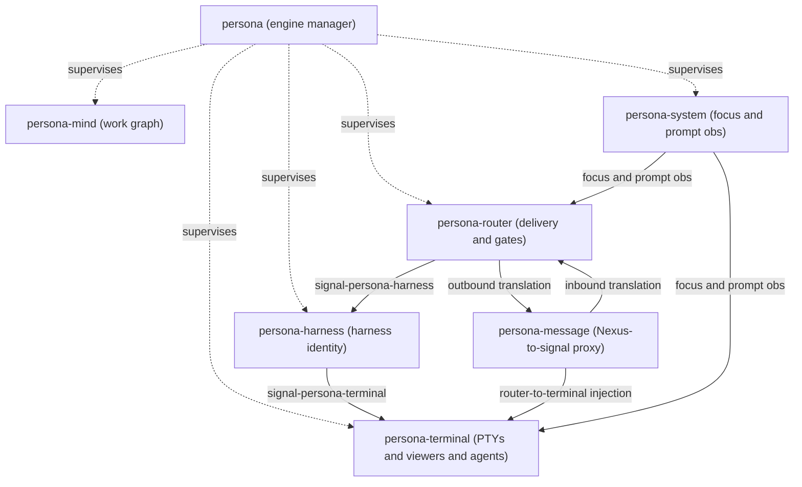

`persona-system` pushes the same focus + input-buffer observations to
**both** `persona-router` (for delivery decisions) and `persona-terminal`
(for input gate state). `persona-message` is the only Nexus↔signal
boundary: agents speak Nexus-in-NOTA into it; it speaks
`signal-persona-message` to `persona-router`; on the way back out it
turns router delivery output into terminal-injection bytes so the
harness sees text, not binary.

### 1.3 · Where the federation sits

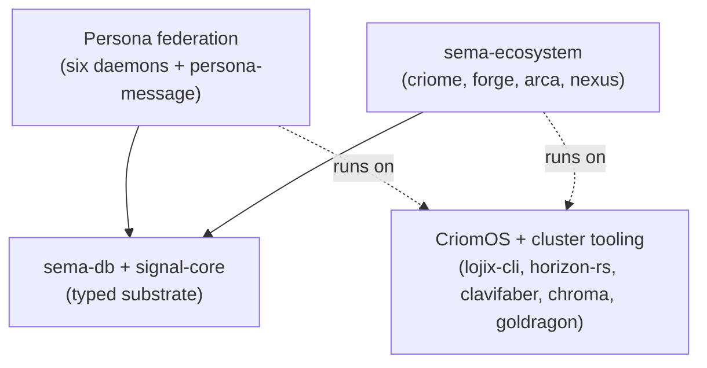

Every solid arrow above is a **typed wire boundary** (length-prefixed
rkyv on UDS). Dashed arrows are OS-level interfaces (PTY,
filesystem, nix activate). No arrow is shared in-memory state.

---

## 2 · Persona — the durable agent

### 2.1 What Persona IS

Persona is **a federation of long-lived daemons** that collectively
provide the substrate for autonomous agents (Claude, Codex, future
agents) to act on a shared workspace with persistent memory, durable
work tracking, and inspectable execution.

Each daemon is:

- **Long-lived.** Started at session start; lives until shutdown.
  Survives individual agent CLI invocations.
- **Supervised.** Each component is one or more Kameo actors with
  declared restart policies; the `persona` engine manager supervises
  the supervisors.
- **Typed.** Inputs and outputs are typed records, defined in a
  dedicated `signal-persona-*` contract crate. No string-tagged
  dispatch, no `Unknown` escape variants.
- **State-isolated.** Each owns one redb file (`mind.redb`,
  `router.redb`, `harness.redb`, …) opened by exactly one actor.
- **Inspectable.** Every actor has a trace; every state transition
  has a typed event; the `persona` engine manager exposes status
  through `signal-persona`.

### 2.2 The federation

| Component | Owns | Does not own |
|---|---|---|
| `persona` (mgr) | supervisor state; component desired/actual state; engine status surface | component-internal logic, work graph, message routing |
| `persona-mind` | role claims, activity, work graph, decisions, aliases, ready views | message delivery, harness lifecycle, terminal transport |
| `persona-message` (proxy) | Nexus↔signal translation on router's edges (inbound + outbound) | durable message state (router owns it), routing policy |
| `persona-router` | message frames, delivery queue, gate state, pending delivery records, the canonical message ledger | role state, work graph, harness process lifecycle, text↔signal translation |
| `persona-system` | OS / window / input observations (FocusObservation, InputBufferObservation); push to router AND to terminal | routing decisions, harness state, gate behavior |
| `persona-harness` | harness identity, lifecycle state, transcript events | router policy, terminal byte transport |
| `persona-terminal` | durable PTYs, viewer attachments (Ghostty adapter), transcript replay, raw byte transport, the **input gate** | Persona message semantics, role state, slash-command parsing |

The wires between them are in §1.2.

### 2.3 Why federated, not monolithic

The federation is not coincidence — it is the workspace's
`skills/micro-components.md` rule applied to the agent runtime:

- **One capability, one crate, one repo.** Each component fits in
  one LLM context window (3k–10k lines including tests). A single
  agent can hold the whole component in mind.
- **Filesystem-enforced boundaries.** A bug in the router cannot
  silently corrupt the mind's work graph; they are different
  processes with different redb files.
- **Typed protocols cross every boundary.** Module-level
  boundaries decay under pressure ("modular monolith" failure
  mode); separate repos with separate contract crates do not.
- **Independent replaceability.** When `persona-message`'s
  Nexus↔signal proxy folds in tightly with `persona-router`, the
  rest of the federation keeps working unchanged because the
  contract is the contract.

### 2.4 The actor density

Each component is **actor-dense** per `skills/actor-systems.md` —
every non-trivial logical plane gets a named, supervised, data-bearing
actor with typed mailbox and trace witnesses.

For example, `persona-mind`'s topology (from its ARCHITECTURE.md):

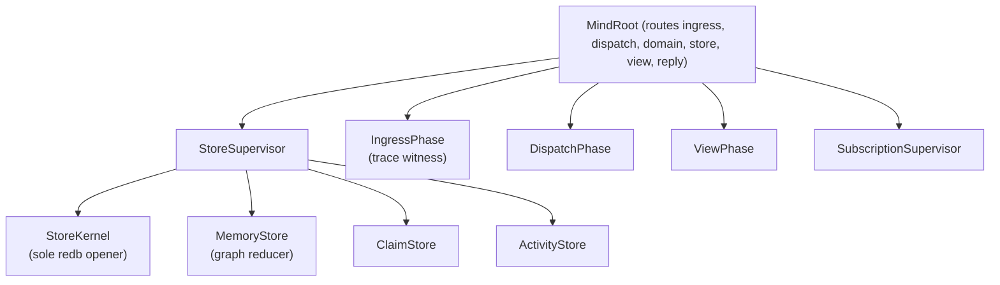

Every actor has a typed message vocabulary (per-kind `Message<T>`
impls). Every long-lived state is in `mind.redb` (via `sema-db`), so
restart reconstruction works. Every blocking plane is one of three
templates (per `skills/kameo.md` §"Blocking-plane templates"): detach,
dedicated thread, or `tokio::process` + timeout.

---

## 3 · How Persona relates to Criome

The relationship is **two things at two scopes**, and conflating them
is the workspace's most common failure mode.

### 3.1 Today: separate stacks, separate concerns

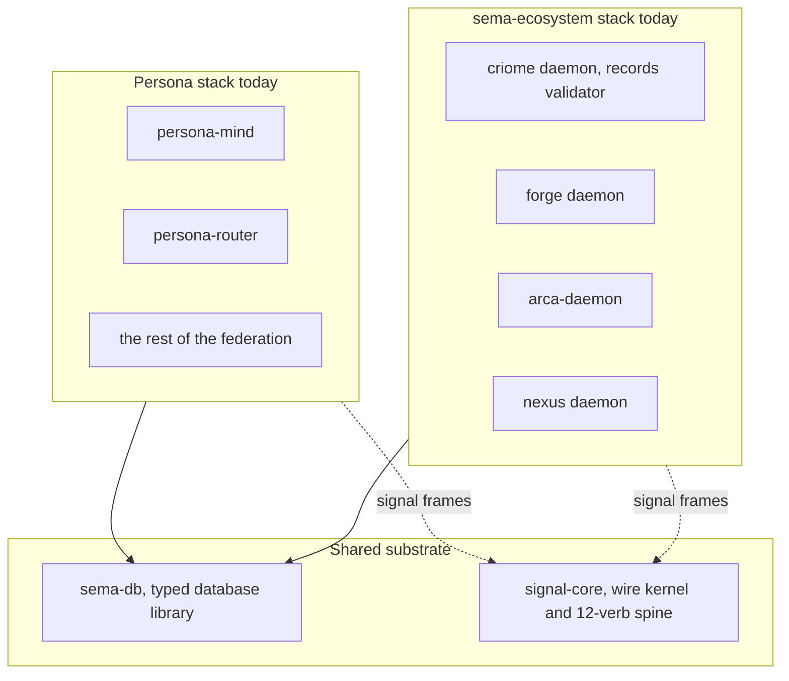

| Concern | Persona today | sema-ecosystem today |
|---|---|---|
| **Domain** | Agent runtime; durable workspace coordination | Typed records (Graph/Node/Edge/Derivation/CompiledBinary); build/deploy |
| **State** | Component-owned redb files via sema-db | criome.redb owned by criome daemon |
| **Contracts** | `signal-persona-*` family | `signal` + `signal-forge` + `signal-arca` |
| **Auth/identity** | (none yet; uses local-user-trust shim) | (none yet; capability tokens are designed but not landed) |
| **Effect dispatch** | Direct (within Persona) | criome validates + dispatches to forge/arca |

The split is **today's correct shape**. Persona is the durable-agent
runtime; criome is the records validator. They share `sema-db` (the
typed-database library) and `signal-core` (the wire kernel) but
otherwise their concerns are disjoint.

A Persona session **does not call criome** for anything in its
day-to-day operation. Persona writes its own state to its own redb
files; criome owns its records database independently.

### 3.2 Eventually: convergent paradigms in one Sema substrate

Per `ESSENCE.md` §"Today and eventually":

- **Eventual Sema** is the universal medium for meaning — a
  self-hosting computational substrate, a fully-typed
  human-language representation, a universal interlingua.
- **Eventual Criome** is the universal computing paradigm,
  expressed in Sema — replacing Git, the editor, SSH, the web;
  encompassing programming, version control, network identity,
  validation, and auth/security across the stack.

When the OS itself is written in Sema, the split between
"persona-the-federation" and "criome-the-validator" dissolves
into one paradigm:

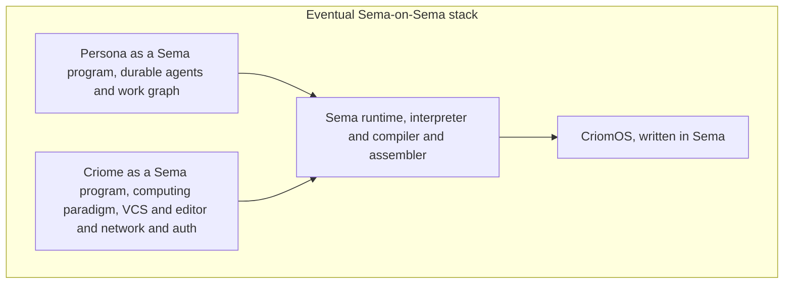

In the eventual:

- Persona's state is one view of typed Sema records, not a
  separate component-owned redb.
- Persona's logic projects from Sema rules, not hand-coded Rust.
- Persona's auth lives in Criome's quorum-signature multi-sig
  (infinitely programmable multi-sig on every object), not in
  ad-hoc local-user-trust.
- The wire between Persona and Criome dissolves — they share a
  substrate, not a socket.

**This is one stack, not many.** The split today is "today's stack"
(Rust + Linux + redb + separate daemons + legacy auth) **vs** "the
eventually self-hosting stack" (Sema all the way down) — not
per-component slow climbs.

### 3.3 The convergence vector — what survives

What carries across both eras:

1. **Perfect specificity.** Every typed boundary names exactly
   what flows through it. Closed enums, no `Unknown` variants, no
   string-tagged dispatch. This is the apex invariant.
2. **Content addressing.** Identity is the hash of canonical
   encoding; mutable handles (slots) sit on top of immutable
   identities. Same shape in both eras.
3. **Push, not poll.** Producers push; consumers subscribe.
   `skills/push-not-pull.md` survives without modification.
4. **Verb belongs to noun.** The Sema substrate is built from
   the same discipline that shapes today's Rust.
5. **One capability, one crate, one repo** — even when "crate"
   becomes "Sema module" and "repo" becomes "Criome graph."
   Filesystem decomposition becomes graph decomposition; the
   discipline is unchanged.

What gets retired:

- The Rust/Nix/Linux/redb substrate (replaced by Sema).
- Per-component-owned databases (replaced by typed Sema records
  in one substrate).
- The `signal-*` wire crates (replaced by Sema-native semantics).
- ClaviFaber-shaped key-material shims (replaced by Criome's
  quorum-signature multi-sig).
- BEADS, lock files, the orchestrate helper (replaced by the
  Sema work graph directly).

---

## 4 · The wire vocabulary

Persona's wire is fully typed and closed. Every inter-component
message is a length-prefixed rkyv archive of a closed Rust type
defined in a `signal-*` crate.

### 4.1 The hierarchy

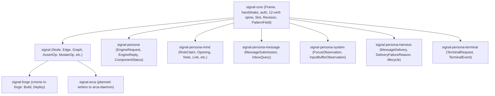

### 4.2 The twelve verbs

`signal-core` owns the closed twelve-verb spine. Every contract
crate pairs verbs with its own typed payloads.

| Verb | Meaning | Used by (representative) |
|---|---|---|
| `Assert` | introduce a typed record | `signal::AssertOperation`, `signal-persona-message::MessageSubmission` |
| `Subscribe` | register a push subscription | `signal-persona-system::FocusSubscription` |
| `Constrain` | snapshot query (point-in-time) | `signal-persona-system::FocusSnapshot` |
| `Mutate` | change an existing record | `signal::MutateOperation`, `signal-persona-mind::Opening` |
| `Match` | pattern-based query | `signal::QueryOperation`, `signal-persona-mind::Query` |
| `Infer` | derive new records from rules | (future; not yet used) |
| `Retract` | remove a record | `signal::RetractOperation` |
| `Aggregate` | grouped result | (future) |
| `Project` | structural projection | `signal-forge::StoreGet` (control-plane) |
| `Atomic` | atomic group of operations | `signal::AtomicBatch` |
| `Validate` | dry-run validation | `signal::ValidateOperation` |
| `Recurse` | nested traversal | (future) |

The verb set is **closed**. Adding new behavior lands as new
typed payloads under existing verbs, not as new verbs.

### 4.3 The relation matrix

Each contract names exactly one relation. Knowing the relation
sentence (per `skills/contract-repo.md`) makes the matrix readable.

| Source | Destination | Contract | Verbs used | Key records |
|---|---|---|---|---|
| client | criome | `signal` | Assert, Mutate, Match, Atomic, Retract, Validate | `Node`, `Edge`, `Graph`, `AssertOperation`, `MutateOperation`, `QueryOperation` |
| criome | forge | `signal-forge` | Mutate (effect), Project (store-ops) | `Build`, `Deploy`, capability-token |
| orchestrate / harness | `persona` | `signal-persona` | Match (status query), Mutate (component start/stop) | `EngineRequest`, `EngineReply`, `ComponentStatus` |
| `mind` CLI / agent | `persona-mind` | `signal-persona-mind` | Mutate (claims, activity, work), Match (queries, observation) | `RoleClaim`, `Opening`, `Note`, `Link`, `StatusChange`, `RoleSnapshot`, `View` |
| `message` CLI | `persona-router` | `signal-persona-message` | Assert (submission), Match (inbox) | `MessageSubmission`, `MessageSlot`, `InboxListing` |
| `persona-router` | `persona-system` | `signal-persona-system` | Subscribe, Constrain | `FocusObservation`, `InputBufferObservation`, `SystemTarget`, `ObservationGeneration` |
| `persona-router` | `persona-harness` | `signal-persona-harness` | Mutate (delivery, cancellation), Subscribe (lifecycle) | `MessageDelivery`, `DeliveryFailureReason`, `HarnessStarted` |
| `persona-harness` | `persona-terminal` | `signal-persona-terminal` | Mutate (open/resize/close), Subscribe (transcript) | `TerminalRequest`, `TerminalEvent` |

### 4.4 Shape of a contract — `signal-persona-mind` in detail

The mind contract is the most-developed example. Its top-level
shape:

```rust
// signal-persona-mind/src/lib.rs (skeleton sketch — see repo for current)

pub enum MindRequest {
    RoleClaim(RoleClaim),
    RoleRelease(RoleRelease),
    RoleHandoff(RoleHandoff),
    RoleObservation(RoleObservation),
    ActivitySubmission(ActivitySubmission),
    ActivityQuery(ActivityQuery),
    Opening(Opening),
    NoteSubmission(NoteSubmission),
    Link(Link),
    StatusChange(StatusChange),
    AliasAssignment(AliasAssignment),
    Query(Query),
}

pub enum MindReply {
    ClaimAcceptance(ClaimAcceptance),
    ClaimRejection(ClaimRejection),
    ReleaseAcknowledgment(ReleaseAcknowledgment),
    HandoffAcceptance(HandoffAcceptance),
    HandoffRejection(HandoffRejection),
    RoleSnapshot(RoleSnapshot),
    ActivityAcknowledgment(ActivityAcknowledgment),
    ActivityList(ActivityList),
    OpeningReceipt(OpeningReceipt),
    NoteReceipt(NoteReceipt),
    LinkReceipt(LinkReceipt),
    StatusReceipt(StatusReceipt),
    AliasReceipt(AliasReceipt),
    View(View),
    Rejection(Rejection),
}

pub struct RoleClaim {
    pub role: RoleName,           // closed enum of eight roles
    pub scopes: Vec<ScopeReference>,  // Path or Task
    pub reason: ScopeReason,
}

pub struct Opening {
    pub kind: ItemKind,           // Task | Decision | Question | Memory
    pub priority: ItemPriority,   // Low | Normal | High
    pub title: ItemTitle,         // newtype-wrapped String
    pub body: Option<ItemBody>,
    pub parent: Option<StableItemId>,
}
```

Caller identity (`who is claiming`), timestamp, and event sequence
are infrastructure-supplied at the daemon boundary — they never
appear in `MindRequest`. Per `ESSENCE.md` §"Infrastructure mints
identity, time, and sender".

Worked NOTA example (`mind` CLI invocation):

```text
$ mind '(RoleClaim Operator ((Path "/git/github.com/LiGoldragon/persona-mind"))
                    "implement command-line mind")'
(ClaimAcceptance ...)

$ mind '(Opening Task High "wire command-line mind"
                  "replace lock-file helper with typed mind state")'
(OpeningReceipt (item_id 42) (timestamp 1748600000000000000))

$ mind '(Query Ready 20)'
(View (ready_items ((Item (id 42) (title "wire command-line mind") (priority High) ...))))
```

Each invocation is one NOTA record in, one NOTA reply record out.
The CLI is a thin client; the daemon owns `MindRoot` and
`mind.redb`.

---

## 5 · Where the human lives

The human is not a peer of the agents. The human has **one direct
surface — the terminal** — through which intent flows in (as
conversation) and the world flows back (as the agent's response). The
agents materialize that intent into every other artifact the workspace
needs.

### 5.1 The terminal is the only direct surface

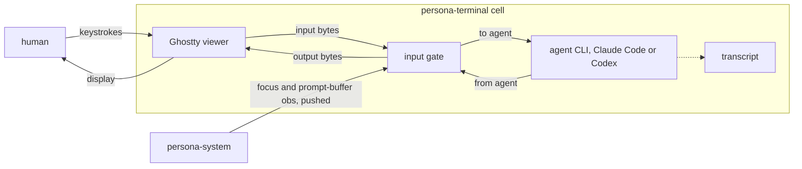

The human types into a Ghostty viewer attached to a `persona-terminal`
cell. Inside that cell, the PTY child IS the agent — Claude Code,
Codex, Pi, etc. — running as a process. The input gate arbitrates
between human keystrokes and programmatic injections (router →
harness → terminal). `persona-system` pushes focus + input-buffer
observations directly to the terminal so the gate knows current state.

Two invariants:

- **Closing the viewer does not kill the agent.** The PTY daemon is
  durable; the viewer is disposable. Detach, reattach, kill the Ghostty
  window — the agent keeps running.
- **Input gate enforces mutual exclusion.** When Persona injects bytes
  (delivering a message to the agent), human keystrokes are queued or
  rejected — gate state is observable per `signal-persona-terminal`.

### 5.2 Intent flows through conversation

The human doesn't author `ESSENCE.md`, skills, reports, or NOTA deploy
requests by hand. They tell the agent in conversation; the agent
materializes the intent into files, commits, deploys. The human's
voice carries the workspace's vocabulary (per `skills/designer.md`
§"The user's vocabulary"); the agent reads that voice as the canonical
statement of intent.

What this means in practice — the agents, on the human's behalf:

- **Edit `ESSENCE.md`, skills, AGENTS, protocols** when the
  conversation reshapes a discipline.
- **File reports** in `reports/<role>/` when work needs durable
  framing or audit.
- **Author NOTA deploy requests** and run `lojix-cli` for cluster
  changes.
- **Open and close work items** in `persona-mind` for anything that
  crosses sessions.

### 5.3 Where the human is NOT

The human is **not** in the message-routing loop (router decides
delivery), **not** in the agent's reasoning loop (agent decides what to
write), **not** in the lifecycle supervision (engine manager handles
restart). The human's authority is **intent setting** (upstream
conversation) and **override** (downstream terminal reading); the
middle is the federation, running without them.

---

## 6 · How agents take and close work

This is the heart of Persona-the-engine: **typed work, typed claims,
typed closure**, all flowing through `persona-mind`.

### 6.1 The eight roles

Per `protocols/orchestration.md`, the workspace recognises eight
coordination roles:

| Role | Default agent | Primary scope |
|---|---|---|
| `operator` | Codex | Rust crates, persona, sema-ecosystem implementation |
| `operator-assistant` | (any) | Operator-shaped support (audits, migrations) |
| `designer` | Claude | ESSENCE, AGENTS, skills, design reports |
| `designer-assistant` | Codex | Designer-shaped support (audits, cross-ref cleanup) |
| `system-specialist` | (any) | CriomOS, lojix-cli, horizon-rs, deploy |
| `system-assistant` | (any) | System-shaped support (host-tool work) |
| `poet` | (any) | TheBookOfSol, prose-as-craft |
| `poet-assistant` | (any) | Poet-shaped support (citation, publishing) |

The role is the discipline — **what kind of attention the work
demands**, not which model holds the role. Any model can take any
role; the role determines scope authority and which skills apply.

### 6.2 Where open work comes from

Work enters Persona's graph from four sources:

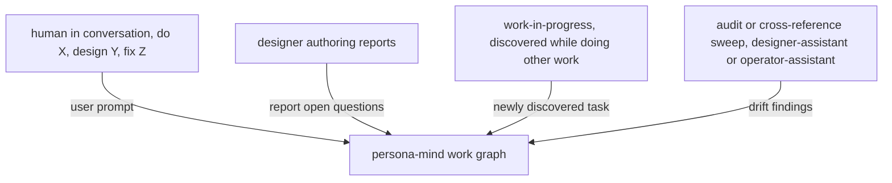

1. **Human prompt.** The user says "do X" or "what should we do
   about Y?" in conversation. The receiving agent either acts
   directly (if the work is small and routine, per
   `skills/autonomous-agent.md`) or files an Opening in
   `persona-mind`.
2. **Designer reports.** Most substantive work is preceded by a
   designer report that frames the problem. The report's "Open
   questions" section becomes one or more typed work items.
3. **In-flight discovery.** While operator is implementing a
   designer report, they discover an unexpected gap. They file an
   implementation-consequences report and an Opening for the
   follow-up.
4. **Audit sweeps.** Designer-assistant or operator-assistant
   reviews recent work; drift findings become typed work items.

In every case, the work item is a typed `Opening` record going
through `signal-persona-mind`:

```text
(Opening Task Normal
         "audit terminal-cell input gate against persona-system observations"
         "after terminal-cell daemon work landed, the gate state should be
          observable through signal-persona-system; check the contract")
```

The item gets a stable id (`StableItemId`), a display id (e.g.,
`primary-2w6` — bd-shaped during the transitional era), a typed
kind, priority, and body.

### 6.3 How agents take work

When an agent starts a session:

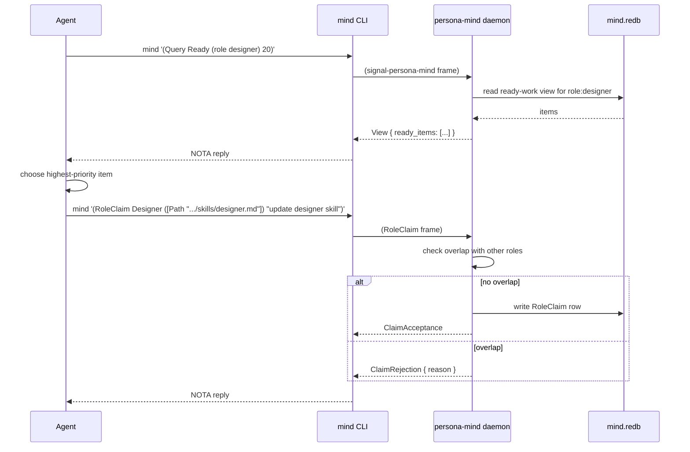

The agent's workflow:

1. **Session start: query ready work.** `mind '(Query Ready
   (role designer) 20)'` returns up to 20 ready items the
   designer role can take. "Ready" means not blocked by another
   open item, not claimed by another agent, not closed.
2. **Pick the highest priority item.** Per
   `skills/autonomous-agent.md`, the highest-priority open item
   is the workspace's continuing intent. The user's live prompt
   in the current turn wins over the bead, but absent that, the
   bead is the answer.
3. **Claim the role + scope.** `mind '(RoleClaim …)'` writes a
   typed claim with the role name, the scopes (paths or task
   tokens), and a reason. The daemon checks overlap with other
   roles' active claims — overlap is rejected.
4. **Update item status.** `mind '(StatusChange (id N)
   InProgress)'` marks the item as actively being worked on.

The lock-file helper is the transitional projection: while agents
are still using `tools/orchestrate claim`, the helper writes both
the lock-file and the typed claim (eventually only the typed
claim).

### 6.4 How agents close work

When the work lands:

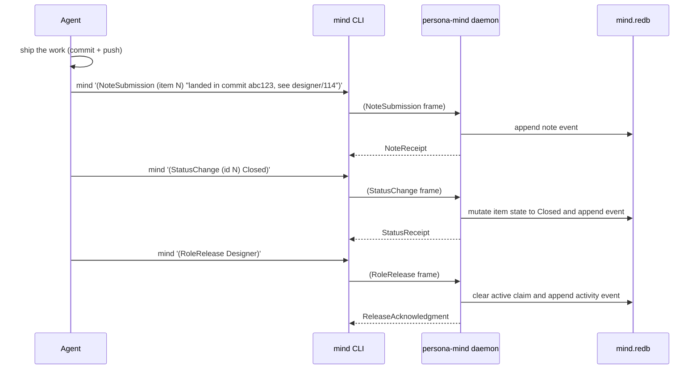

Three actions:

1. **Note the substance.** Where did the work land? A commit
   hash, a designer report number, a path. The note is the
   breadcrumb for future agents.
2. **Status to Closed.** The state transition triggers
   subscription pushes — anyone watching this item is notified.
3. **Release the claim.** Frees the scope for the next agent.

If the work didn't land — was superseded, abandoned, reformulated
as discipline — the closure includes a typed reason:

```text
(StatusChange (id N) Superseded
              "Folded into designer/110's cluster-trust-runtime placement
               work; the original concern is covered there")
```

### 6.5 How agents interact with each other

Agents don't talk to each other directly. They interact through:

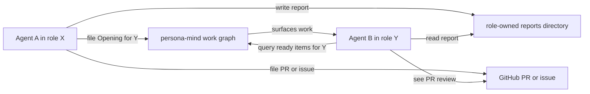

Three channels:

1. **The work graph.** Agent A files an Opening tagged
   `role:Y`; Agent B (in role Y) sees it via `mind '(Query Ready
   (role Y))'`. The graph is the durable handoff.
2. **Role-owned reports.** Designer writes a report in
   `reports/designer/`; operator reads it and writes an
   implementation-consequences report in `reports/operator/`. The
   reports are visible to all; ownership of subdirs prevents
   race-edits.
3. **GitHub PRs and issues.** Cross-machine, cross-time work
   surfaces. PRs are merged by the designer or by the user; the
   merge is the signal.

There is **no synchronous agent-to-agent communication**. Two
agents working in parallel on the same workspace see each other
through:
- The lock files (who holds what scope right now)
- The work graph (who's working what task)
- The git log (what just landed)

The orchestration protocol (`tools/orchestrate claim/release`)
prevents simultaneous edits to the same paths; the typed work
graph durably tracks who's doing what.

### 6.6 Where the orchestrate helper sits

Today's `tools/orchestrate` is the transitional ergonomic surface:

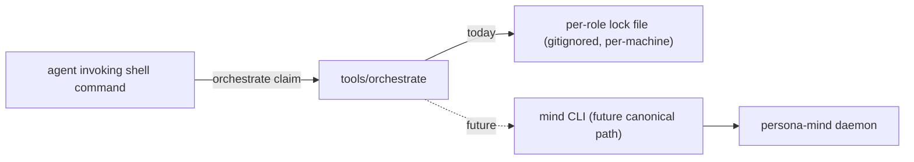

The helper:
1. Writes the role's lock file (today).
2. Checks BEADS for open tasks.
3. Will eventually lower into a `mind` invocation (typed
   `RoleClaim` request).

When the `mind` CLI ships as a thin client to `persona-mind` and
agents adopt it, the orchestrate helper becomes either external
glue (translating ergonomic commands into `mind` invocations) or
retires. The lock files are not persisted by `persona-mind` — they
are transitional helper state that disappears at the cutover.

---

## 7 · Example scenarios

Five close-ups showing how the pieces fit at runtime. Each scenario
names which contracts cross which boundaries.

### 7.1 Scenario A — Operator picks up a P2 task

Setting: Operator (Codex) starts a session. There are open beads;
the highest-priority `role:operator` is `primary-qp7` —
`nota-codec`'s encoder emits single-quoted strings for content that
contains newlines, which the parser rejects on round-trip. Fix:
the encoder must switch to triple-quoted multiline (`"""..."""`)
for any string with a newline.

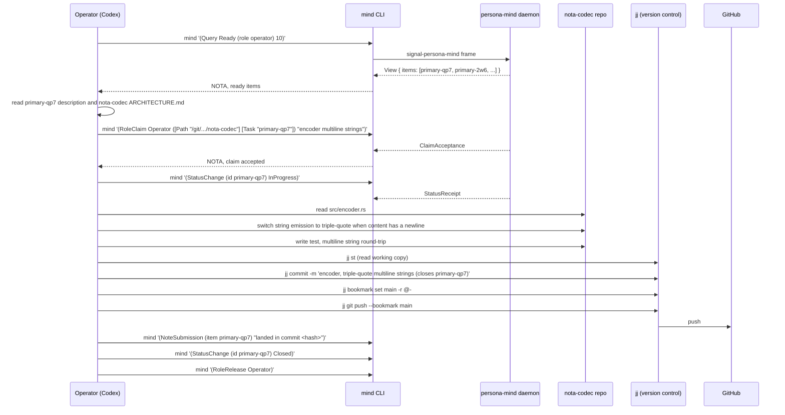

The whole cycle is:
1. **Discover** — `Query Ready`.
2. **Claim** — `RoleClaim` with paths + task token + reason.
3. **In progress** — `StatusChange InProgress`.
4. **Implement** — edit code per the relevant skills.
5. **Test** — Nix-backed test runs through `nix flake check`.
6. **Commit** — single `jj commit -m`, push.
7. **Note** — record where it landed.
8. **Close** — `StatusChange Closed`.
9. **Release** — `RoleRelease`.

Each step is a typed event in `mind.redb`. The next agent reading
the graph sees the full history.

### 7.2 Scenario B — Designer files a report; operator implements

Setting: Designer (Claude) is reading active workspace state and
notices that `persona-message` still owns a text-file ledger plus
polling — stale scaffolding. Designer reframes `persona-message`'s
role: it is a stateless Nexus-to-signal proxy on `persona-router`'s
edges, never the owner of durable message state. The reframe lands
as updates to `protocols/active-repositories.md` and as bead
`primary-2w6` with the destination spec spelled out. Operator picks
it up over several sessions.

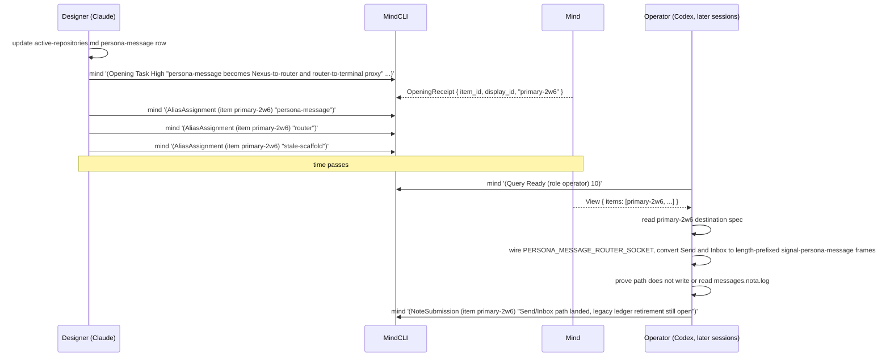

The thread is:
1. Designer's reframe (active-repositories.md and the bead
   description itself) is the **frame**.
2. The Opening is the **handle** that surfaces in operator's queue.
3. Notes record each implementation milestone; the bead stays open
   while sub-pieces (legacy ledger retirement, router-to-terminal
   delivery side) still remain.

Reports, contract docs, and the work graph cross-reference each
other; the substance lives in the documents, the lifecycle lives in
the work graph.

### 7.3 Scenario C — Human asks the agent for something

Setting: The human is at a Ghostty viewer. The PTY child inside that
cell IS the agent (Claude Code, Codex, …). They share the terminal.

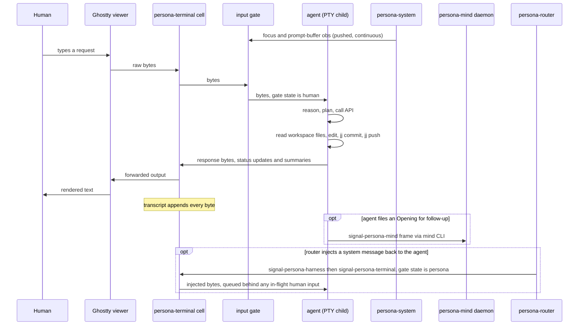

The agent is what runs in the PTY. The human types; the agent reads;
the agent acts on the workspace; the agent writes back. The human
never opens a text editor — every artifact (files, commits, beads,
deploy requests) goes through the agent.

Two push paths feed the cell:

- **`persona-system` → terminal input gate.** Focus state and
  input-buffer state arrive continuously as pushed observations. The
  gate uses them to decide whether the human is actively typing
  (queue Persona injections) or away (inject freely).
- **`persona-router` → terminal (via `signal-persona-harness` then
  `signal-persona-terminal`).** When the router delivers a message to
  the agent's cell, the bytes arrive through the gate just like human
  keystrokes — same input port, same mutual-exclusion rule.

The transcript captures everything — human, agent, router-injected.
It is the auditable record of what actually happened.

### 7.4 Scenario D — Designer-assistant audits operator's recent work

Setting: Designer-assistant (Codex in DA role) is asked to audit
the recent operator commits in `persona-mind` for drift from the
designer's stated architecture.

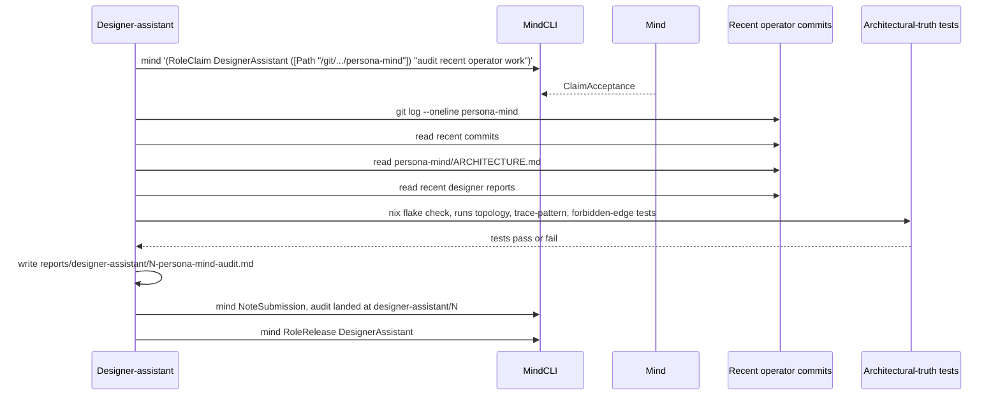

Designer-assistant's discipline (per `skills/designer-assistant.md`):
- Read the upstream design source first.
- Keep the work bounded — one audit target, one report.
- Surface drift through a typed report under
  `reports/designer-assistant/`.
- Don't make structural decisions; flag the question and hand
  back to designer.

The architectural-truth tests (per
`skills/architectural-truth-tests.md`) are how drift gets caught
mechanically: every load-bearing constraint in
`persona-mind/ARCHITECTURE.md` has a named witness test. If
operator's commits regressed an actor topology or bypassed a
required plane, the test fails.

### 7.5 Scenario E — System-specialist deploys a workspace-wide change

Setting: System-specialist needs to bump `nota-codec` across the
cluster after a designer-approved breaking change. The bump
affects every node that runs Persona components.

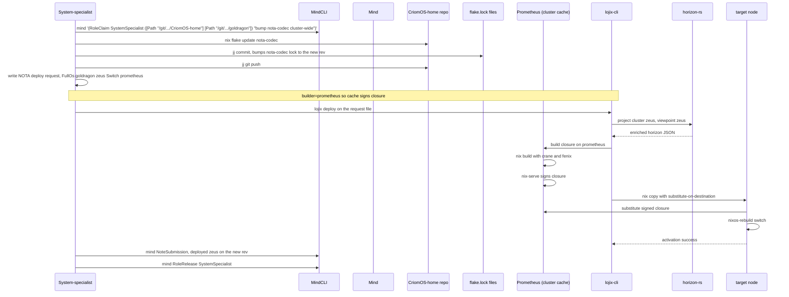

The deploy is one typed NOTA record. The flow:
1. SS updates the flake.lock (deterministic; the rev is pinned).
2. SS authors one `FullOs` request naming target, activation
   mode, and builder.
3. `lojix-cli` reads the request, projects through `horizon-rs`
   (a library), builds via Nix on the cache node, signs via
   `nix-serve`, copies with `--substitute-on-destination`, and
   activates.
4. SS records the deploy in `persona-mind` and releases.

The system-specialist's "just-do-it" rule (per
`skills/system-specialist.md` §"Just-do-it operations"): if the
session already authorized "use the new version", the downstream
flake.lock bump and the activating redeploy are part of the same
work — no need to confirm step-by-step.

---

## 8 · Open seams and drift

The map above is the **intended shape**. Several pieces are in
flight; the seams are honestly visible.

| Seam | Status | Where it lives |
|---|---|---|
| **`persona-terminal` landing** | The terminal owner noun; production component formalizing from the `terminal-cell` daemon prototype. Ghostty is the viewer adapter. | terminal-cell/ARCHITECTURE.md; rename tracked in active-repositories.md |
| **`sema` → `sema-db` rename** | Pending. Bead `primary-ddx`. Naming reflects "today's piece" vs eventual `Sema`. | active-repositories.md; ESSENCE.md §"Today and eventually" |
| **Durable router state** | MVP uses in-memory pending-delivery; destination is `router.redb` via `sema-db`. | persona-router/ARCHITECTURE.md |
| **`persona-message` proxy shape** | Active migration (`primary-2w6`, P1). Today's `persona-message` still owns transitional text-file ledger + polling; destination is a stateless Nexus↔signal proxy on router's edges with no durable message state of its own. | persona-message/ARCHITECTURE.md; bead `primary-2w6` |
| **`signal-persona-terminal` contract** | Exists with `TerminalRequest` and `TerminalEvent` typed records. Its own `ARCHITECTURE.md` still names the former terminal-owner repo — bead filed for the wording sweep. | signal-persona-terminal/ARCHITECTURE.md |
| **Trace phases → real actors** | Persona-mind has trace witnesses (`NotaDecoder`, `CallerIdentityResolver`, etc.) that should graduate to data-bearing actors. | persona-mind/ARCHITECTURE.md §"Trace phases" |
| **Cluster trust runtime placement** | Designer/110 settled the scope discipline; system-specialist work pending on the runtime daemon. | reports/designer/110-cluster-trust-runtime-placement.md |
| **BEADS retirement** | Transitional. Native mind work graph is the destination. No long-term Persona↔bd bridge. | AGENTS.md §"BEADS is transitional" |
| **Lock-files retirement** | Transitional. `tools/orchestrate` becomes external glue (or retires) once agents use `mind` directly. | protocols/orchestration.md §"Command-line mind target" |

None of these are blockers for understanding the vision. They are
the **frontier of the work** — exactly where the next pieces land.

---

## 9 · Reading list — minimal path

For an agent or human entering the workspace cold, the minimal
reading sequence to understand Persona:

1. **`~/primary/ESSENCE.md`** — intent (the upstream of everything).
2. **`~/primary/AGENTS.md`** + **`repos/lore/AGENTS.md`** —
   workspace contract.
3. **`~/primary/protocols/orchestration.md`** — role coordination.
4. **`~/primary/protocols/active-repositories.md`** — current
   attention map.
5. **`~/primary/repos/persona/ARCHITECTURE.md`** — the engine
   manager's apex view.
6. **`~/primary/repos/criome/ARCHITECTURE.md`** — the
   sema-ecosystem apex (the eventual scope is named here).
7. **`~/primary/repos/signal-core/ARCHITECTURE.md`** — wire
   kernel.
8. **`~/primary/repos/signal-persona-mind/ARCHITECTURE.md`** — the
   most-developed contract; reading it teaches the pattern.
9. **`~/primary/repos/persona-mind/ARCHITECTURE.md`** — the
   work-graph runtime.
10. **`~/primary/skills/actor-systems.md`** +
    **`~/primary/skills/kameo.md`** — actor discipline.
11. **`~/primary/skills/contract-repo.md`** — wire-contract
    discipline.
12. **`~/primary/skills/push-not-pull.md`** — push-not-poll
    invariant.

Everything else is reachable from these twelve.

---

## 10 · Closing — the criterion

The vision can be summarised in one sentence:

> **A federation of typed, supervised, inspectable daemons —
> each owning one plane of state, each speaking through typed
> wire contracts — providing the substrate for durable agents to
> act on a shared workspace, with the human upstream of the
> intent and downstream of the live interaction.**

The criterion this report is held to is the same as everything
else in the workspace: **clarity → correctness → introspection →
beauty.** Each daemon reads cleanly. Each contract names exactly
what flows through it. Each state transition is observable from
outside. When the right shape is found, the structure dissolves
the special case into the normal case; what's left is the
operative architecture, not the residue of past decisions.

Today's Persona is built rightly for today's stack. The eventual
Sema-on-Sema substrate is one step up the same ladder, not a
different ladder. The convergence vector is the **closed verb
spine**, the **content-addressing discipline**, the
**verb-belongs-to-noun rule**, and the **micro-component
filesystem-enforced decomposition** — these survive the substrate
swap because they are truths about meaning, not artifacts of
implementation.

If a future agent (human or LLM) cannot derive the right shape
of a new component from these invariants, the invariants need
sharpening — not the shape weakening. That is the discipline
this report enforces.

---

## See Also

- `~/primary/ESSENCE.md` — workspace intent (upstream).
- `~/primary/repos/persona/ARCHITECTURE.md` — engine manager apex.
- `~/primary/repos/criome/ARCHITECTURE.md` — sema-ecosystem apex.
- `~/primary/protocols/orchestration.md` — role coordination.
- `~/primary/protocols/active-repositories.md` — active repo map.
- `~/primary/reports/designer/110-cluster-trust-runtime-placement.md`
  — scope discipline in action.
- `~/primary/skills/actor-systems.md`, `~/primary/skills/kameo.md`
  — actor discipline (foundational).
- `~/primary/skills/contract-repo.md` — wire-contract discipline.
- `~/primary/skills/push-not-pull.md` — push-not-poll invariant.
- `~/primary/skills/designer.md` — the role this report is filed
  under; the discipline that shapes its form.
