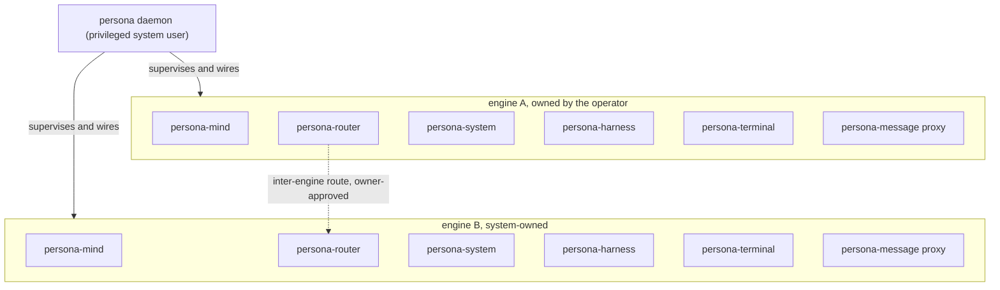
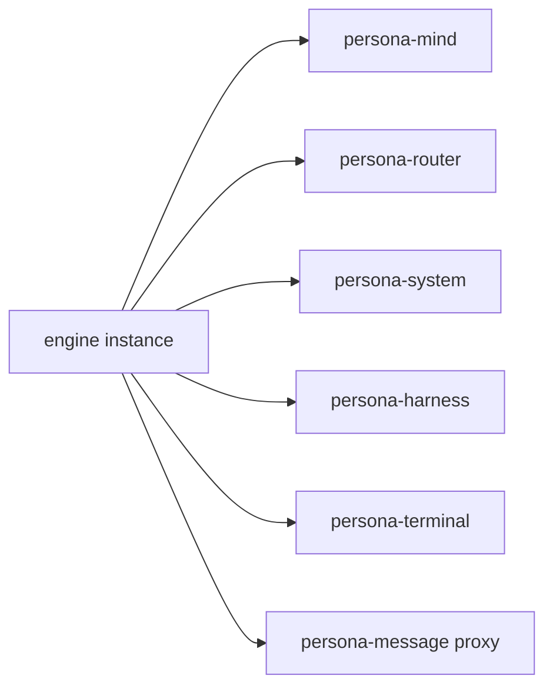
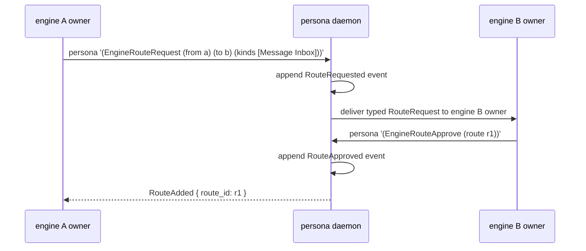

# 115 — Persona engine manager architecture

*Designer report. Lays out what `persona` (the engine manager) IS
and DOES, the privileged-user position, multi-engine supervision,
the authorization-tier model, inter-engine routes, the `persona`
CLI as test surface, and the contract additions to `signal-persona`
that follow. This is the source-of-truth for the `persona` apex
work; `persona/ARCHITECTURE.md` should absorb its substance after
designer-assistant's current cleanup sweep (`primary-2ps`)
releases.*

---

## 0 · TL;DR

`persona` is **the host-level engine manager**: one privileged
system-user daemon per host that supervises **multiple engine
instances**, each owning its own `{mind, router, system, harness,
terminal, message-proxy}` component set. It allocates sockets,
distributes peer wiring, distributes per-engine state directories,
classifies every incoming connection by `ConnectionClass`, and
mediates inter-engine routes.

The privileged-user position is what gives `persona` the ability
to do things the operator's own user cannot: force focus during
prompt injection, create **system personas** the operator does not
own, manage privileged OS-level handles, mint cross-engine auth
proofs.

Every connection into a `persona`-managed engine carries a
**`ConnectionClass`** — `Owner`, `NonOwnerUser`, `System`, or
`OtherPersona { engine_id }`. Downstream components (router,
system, harness, terminal) use the class as a policy axis. A
message from the engine's owner is delivered freely; one from a
non-owner user is quarantined or rejected; one from another
persona requires an explicit owner-approved `EngineRoute`.

The `persona` CLI is the operator's surface for managing the
engine manager — one NOTA record in, one NOTA reply record out,
same shape as `mind`. It's also the test entry point for
integration scenarios.

---

## 1 · What persona IS today (the narrow scope)

Current `persona/ARCHITECTURE.md` describes `persona` as "the
engine manager for the Persona component ecosystem" — a
supervisor daemon that keeps component daemons visible and
coordinated. Current `signal-persona` contract has four request
variants: `EngineStatusQuery`, `ComponentStatusQuery`,
`ComponentStartup`, `ComponentShutdown`. The framing is
**single-engine**: one persona daemon, one set of components, one
owner implicit.

This is the right starting shape for the typical case, but it
doesn't yet name:

- That `persona` is a **privileged system service**, not an
  operator-user process.
- That **multiple engines coexist** on one host.
- That every connection has a **classification** that determines
  what it can do.
- That **inter-engine routes** are typed, owner-approved
  declarations.
- That the operator interacts via a **`persona` CLI** — the same
  one-record-in/one-record-out shape as `mind`.

The substance below adds these.

---

## 2 · What persona must become

The vision (per 2026-05-11 conversation):



The host-level `persona` daemon:

1. **Runs as a privileged system user** (a dedicated `persona`
   user — not root, not the operator's user). Carries elevated
   capabilities for specific OS-level operations.
2. **Spawns engine instances on demand.** Each engine instance is
   a full federation (mind, router, system, harness, terminal,
   message-proxy).
3. **Allocates per-engine resources** — socket paths, state
   directories, auth-proof generation keys.
4. **Wires components within an engine** — when it spawns a
   component, it passes the peer socket paths the component
   needs.
5. **Owns the engine catalog** — its own redb tracks engine
   identities, owners, lifecycle state, and inter-engine routes.
6. **Classifies every incoming connection** by `ConnectionClass`
   at the engine boundary; downstream components consume the
   classification.
7. **Mediates inter-engine routes** — a typed, owner-approved
   declaration that messages of named kinds may flow between two
   engines.
8. **Exposes the `persona` CLI** — operator surface; also the
   test entry point.

---

## 3 · The privileged-user position

`persona` runs as a dedicated system user — **`persona`** — not
as the operator's user and not as root. Why this matters:

| Privilege need | Why persona needs it |
|---|---|
| Force window focus to a specific terminal | When the router injects a system message to an agent while the operator's focus has drifted, the input gate needs the focus held on the agent's terminal to prevent keystroke interleaving. The operator's own user can't reliably force focus against the window manager. |
| Spawn system-owned engines | A system persona (e.g., a background research agent the operator didn't explicitly create) is owned by a system identity, not the operator's Unix user. Only a privileged process can create such an engine. |
| Mint cross-engine auth proofs | Inter-engine messages cross identity boundaries. The privileged daemon signs the proofs that establish the cross-engine `ConnectionClass`. |
| Read connection peer-identity from the kernel | Determining `ConnectionClass` requires reading the peer credentials from the Unix socket (SO_PEERCRED, SCM_CREDENTIALS). Some forms of this need privilege depending on host config. |
| Restart components after operator-user crashes | If a component crashes and its state is on disk, the privileged daemon can clean up and restart without the operator having to intervene. |

What `persona` does NOT need:

- **`root`** — never. Even privileged operations are scoped to
  the `persona` user with specific capabilities. `root` is too
  much authority.
- **`sudo` for downstream components** — components run as the
  `persona` user too (so they share the privilege baseline) but
  the persona daemon is the only one that owns the cross-engine
  authority.

Linux capability set: TBD by `system-specialist`. The architecture
requires *some* elevation for focus override and peer-credential
reading; specific capabilities (`CAP_SYS_PTRACE`, `CAP_NET_ADMIN`,
seat-management permission, etc.) get pinned when the deployment
lands. A bead is filed.

---

## 4 · Multi-engine supervision model

**One `persona` daemon per host. N engine instances per `persona`
daemon.**

### 4.1 Engine instance = the full federation



Each engine has its own complete component set. No sharing of
`mind.redb` across engines, no sharing of router state, no
sharing of harness sessions. Engines are isolated by design.

### 4.2 Per-engine scoped resources

| Resource | Path |
|---|---|
| Engine state directory | `/var/lib/persona/<engine-id>/` |
| Mind redb | `/var/lib/persona/<engine-id>/mind.redb` |
| Router redb | `/var/lib/persona/<engine-id>/router.redb` |
| Harness redb | `/var/lib/persona/<engine-id>/harness.redb` |
| Terminal redb | `/var/lib/persona/<engine-id>/terminal.redb` |
| Engine socket directory | `/var/run/persona/<engine-id>/` |
| Mind socket | `/var/run/persona/<engine-id>/mind.sock` |
| Router socket | `/var/run/persona/<engine-id>/router.sock` |
| System socket | `/var/run/persona/<engine-id>/system.sock` |
| Harness socket | `/var/run/persona/<engine-id>/harness.sock` |
| Terminal socket | `/var/run/persona/<engine-id>/terminal.sock` |
| Message-proxy socket | `/var/run/persona/<engine-id>/message-proxy.sock` |

The persona daemon's own state:

| Resource | Path |
|---|---|
| Engine catalog redb | `/var/lib/persona/manager.redb` |
| Engine-manager socket | `/var/run/persona/persona.sock` |

The exact filesystem layout is TBD by `system-specialist` (XDG
runtime dir conventions on user-mode operation, etc.). The
**scoping discipline** is the architectural commitment: every
per-engine resource path includes the `<engine-id>` segment.

### 4.3 The engine catalog (persona's own state)

The persona daemon owns one redb at the manager level. Its
tables:

| Table | What it holds |
|---|---|
| `engines` | `EngineId → EngineCatalogEntry` (owner, state, generation, created-at) |
| `engine_routes` | `RouteId → EngineRoute` (from, to, kinds, approval state) |
| `engine_owners` | `OwnerIdentity → Set<EngineId>` (reverse index) |
| `component_states` | `(EngineId, ComponentName) → DesiredState` (supervisor policy) |
| `meta` | schema version, store identity, manager-id |

Every state transition (engine create, component start/stop,
route add/remove) is a typed event appended to a transition log
and reduced into the table state.

---

## 5 · Engine identity and ownership

### 5.1 Engine identity

```text
EngineId — typed newtype, content-addressable
  := blake3-derived from { owner_identity, creation_params, persona_daemon_id }
```

Engine IDs are stable for the engine's lifetime. They appear in
every per-engine path, in every cross-engine route, and in every
`ConnectionClass::OtherPersona { engine_id }` classification.

### 5.2 Owner identity

```text
OwnerIdentity (closed enum):
  | User(Uid)              -- a Unix UID on this host
  | System(SystemPrincipal) -- a privileged system identity
  | Cross(EngineId)        -- another engine owns this one
                              (rare; e.g., system orchestrator
                              creates child engines)
```

The owner is bound at engine creation and **does not change
post-creation**. Ownership transfer is a distinct operation
(`EngineOwnershipTransfer`) requiring consent from both the old
and new owner.

### 5.3 Engine creation policy

| Caller class | Creating engine for `User(uid)` | Creating engine for `System(principal)` | Creating engine for `Cross(...)` |
|---|---|---|---|
| Operator user | only if `uid == caller_uid` | rejected | rejected |
| Other Unix user | rejected | rejected | rejected |
| Privileged `persona` daemon (CLI as `persona` user) | any uid | any principal | any |
| Existing engine via internal route | rejected | rejected | only with explicit privilege grant |

Engine creation is gated. The operator can create engines they
own; system personas come from the privileged side; cross-engine
parent/child relationships are a privileged surface.

---

## 6 · Authorization tiers — `ConnectionClass`

### 6.1 The class enum

```text
ConnectionClass (closed enum, minted at engine boundary):
  | Owner                            -- caller matches engine.owner
  | NonOwnerUser(Uid)                -- a different Unix user
  | System(SystemPrincipal)          -- a privileged system identity
  | OtherPersona { engine_id, host } -- another engine, intra- or inter-host
```

### 6.2 Where classification happens

The `persona` daemon mints `ConnectionClass` at the moment a
connection is established to a component socket. It does so by:

1. Reading peer credentials from the Unix socket
   (`SO_PEERCRED`).
2. Comparing peer UID to the engine's owner.
3. Cross-referencing privileged system principals from its
   manager catalog.
4. For socket connections from another engine's components,
   verifying the source-engine `AuthProof` (signed by the
   privileged `persona` daemon).
5. Stamping the classification onto the `AuthProof` that travels
   through the rest of the signal frames in that connection's
   lifetime.

### 6.3 What each component does with the class

| Component | Policy axis |
|---|---|
| `persona-router` | `Owner` messages deliver freely. `NonOwnerUser` messages are **quarantined** — held in a typed inbox the engine's owner must explicitly approve before delivery. `System` messages have a separate policy (e.g., system-personas talking to other system-personas don't need owner approval; system-to-user does). `OtherPersona { engine_id }` requires a matching approved `EngineRoute`. |
| `persona-system` | Privileged observations (focus override, force-focus) are gated on the connection class — only the `persona` daemon itself can request them. |
| `persona-harness` | Harness identity lookups are class-aware: an `Owner` connection sees full identity; a `NonOwnerUser` sees a restricted view (typed, redacted record kinds). |
| `persona-terminal` | The input gate consults `ConnectionClass` when arbitrating between human keystrokes and programmatic injections — `Owner` and `System` injections may queue behind human input; `NonOwnerUser` injections are dropped by default until owner approves. |
| `persona-mind` | Work-graph operations from non-`Owner` connections are recorded as third-party suggestions (typed records), not as owner-authored claims; the owner must explicitly adopt them. |

Each component's per-policy behavior is its own architectural
work item. This report names the **classification surface** and
the **policy axis**; downstream component ARCHs need to absorb
the specifics.

### 6.4 The malicious-non-owner threat model

A non-owner user that gets a connection to the engine's sockets
should be:

- **Read-bounded**: can see only what the engine explicitly
  publishes as `NonOwnerUser`-readable. Most state is owner-only.
- **Write-quarantined**: any mutation request lands in a typed
  inbox visible to the owner; nothing reaches downstream state
  until the owner explicitly approves (and the approval itself is
  a typed `OwnerApproval` record).
- **Resource-bounded**: rate-limited at the engine boundary;
  excessive request volume from a non-owner triggers connection
  drop.

A non-owner cannot create engines, cannot register
`signal-persona-mind` claims, cannot inject terminal bytes,
cannot subscribe to focus observations without owner approval.

---

## 7 · Inter-engine routes

### 7.1 The route declaration

```text
EngineRoute:
  | from:     EngineId
  | to:       EngineId
  | kinds:    Set<MessageKind>      -- closed enum, per-channel
  | approval: ApprovalMode          -- Pending | OwnerApproved | SystemApproved
  | created:  EngineRouteCreated    -- typed record (who, when, generation)
```

Routes are **typed declarations** the persona daemon owns in its
manager redb. Without a matching `OwnerApproved` (or
`SystemApproved` for system-to-system) route, an
`OtherPersona { engine_id }` connection is rejected at the engine
boundary.

### 7.2 Route approval flow



Both ends must approve. The persona daemon mediates the request,
delivers it to the destination owner (via that engine's own
notification path — typically the harness's inbox), and records
the approval cycle.

### 7.3 System-to-system routes

When both engines are `System`-owned, the approval can flow
through privileged auto-approval rules declared in the manager's
configuration. The principle: human-owned engines always require
human approval; system-owned engines can be configured to
auto-approve specific patterns.

---

## 8 · Process supervision and socket wiring

### 8.1 Spawn lifecycle for a component

When persona spawns `persona-mind` for engine `e1`:

1. **Pre-spawn**: allocate socket paths
   (`/var/run/persona/e1/mind.sock`,
   `/var/run/persona/e1/persona-mind-supervisor.sock` if
   bidirectional), allocate state dir
   (`/var/lib/persona/e1/mind.redb` parent exists, perms set to
   `persona` user).
2. **Spawn**: fork+exec the component binary with environment:
   - `PERSONA_ENGINE_ID=e1`
   - `PERSONA_COMPONENT_SOCKET=/var/run/persona/e1/mind.sock`
   - `PERSONA_DATA_DIR=/var/lib/persona/e1`
   - `PERSONA_PEER_ROUTER=/var/run/persona/e1/router.sock`
   - `PERSONA_PEER_SYSTEM=/var/run/persona/e1/system.sock`
   - `PERSONA_PEER_HARNESS=/var/run/persona/e1/harness.sock`
   - `PERSONA_PEER_TERMINAL=/var/run/persona/e1/terminal.sock`
   - `PERSONA_MGR_SOCKET=/var/run/persona/persona.sock`
   - `PERSONA_AUTH_PROOF_KEY_PATH=...`
3. **Health check**: wait for the component to bind its socket
   and respond to a `signal-persona-mind` handshake.
4. **Register**: append `ComponentStarted` event to the
   manager's transition log.
5. **Supervise**: monitor the child via supervised actor
   pattern; restart per `RestartPolicy`.

The discipline: **components don't discover peers via
filesystem scanning or hardcoded paths.** Persona tells them
which sockets to dial. Per `skills/push-not-pull.md` — config is
pushed, not polled.

### 8.2 Restart policy per component

Each component has a typed `RestartPolicy` (per `skills/kameo.md`
restart semantics) declared at engine-creation time. Default:

| Component | Policy | Reason |
|---|---|---|
| `persona-mind` | `Permanent` | central state; must survive |
| `persona-router` | `Permanent` | message delivery must survive |
| `persona-system` | `Permanent` | observations must keep flowing |
| `persona-harness` | `Permanent` | harness identity must survive |
| `persona-terminal` | `Permanent` | PTYs must survive |
| `persona-message proxy` | `Transient` | stateless; restart on crash but not on normal exit |

The persona daemon implements the supervision tree; per-engine
restart limits prevent restart storms.

### 8.3 Graceful shutdown

`(EngineShutdown (engine e1) (mode Graceful))` flows:

1. Persona broadcasts `ComponentShutdown` to each component in
   reverse-dependency order: terminal, harness, system, router,
   mind, message-proxy.
2. Each component flushes pending work, closes its redb, exits
   cleanly.
3. Persona reaps each child, appends `ComponentStopped` events.
4. When all children are reaped, appends `EngineStopped`.
5. Engine state is preserved on disk (redbs are intact); the
   engine can be restarted with `(EngineStart (engine e1))`.

`(EngineShutdown ... (mode Immediate))` sends `SIGTERM` then
`SIGKILL` after timeout; no flush, no clean exit. For
emergency-only use.

---

## 9 · The `persona` CLI

### 9.1 Shape

```sh
persona '<one NOTA request record>'
```

Output:

```sh
'<one NOTA reply record>'
```

Same shape as `mind`. The CLI is a thin client to the persona
daemon at `/var/run/persona/persona.sock`. It encodes the
argv-supplied NOTA into a `signal-persona` frame, sends, awaits
reply, prints reply as NOTA, exits.

### 9.2 Worked examples

```text
$ persona '(EngineStatusQuery (WholeEngine e1))'
(EngineStatus
  (engine_id e1)
  (owner (User 1000))
  (components
    ((Component persona-mind  (state Running) (generation 42))
     (Component persona-router (state Running) (generation 42))
     (Component persona-system (state Running) (generation 42))
     (Component persona-harness (state Running) (generation 42))
     (Component persona-terminal (state Running) (generation 42))
     (Component persona-message-proxy (state Running) (generation 42))))
  (generation 42))

$ persona '(EngineList)'
(EngineList
  (engines
    ((EngineSummary (id e1) (owner (User 1000)) (state Running))
     (EngineSummary (id e2) (owner (System research-agent)) (state Running))
     (EngineSummary (id e3) (owner (User 1000)) (state Paused)))))

$ persona '(EngineCreate (Owner (User 1000)) (ComponentSet Default))'
(EngineCreated (engine_id e4) (owner (User 1000)))

$ persona '(EngineRouteRequest (from e1) (to e2) (kinds [Message]))'
(RouteRequested (route_id r1) (pending_approval_from (System research-agent)))

$ persona '(ComponentStart (engine e1) (component persona-mind))'
(SupervisorActionAccepted)

$ persona '(EngineShutdown (engine e1) (mode Graceful))'
(EngineShutdownAck (engine_id e1) (state Stopped))
```

### 9.3 As test surface

The CLI is the integration-test entry point. Tests written in Nix
can exercise the full engine-manager surface:

```nix
checks.test-engine-create-then-status = pkgs.runCommand "..." {} ''
  ${persona-daemon} &
  ${persona-cli} '(EngineCreate ...)' > engine.nota
  ${persona-cli} '(EngineStatusQuery ...)' > status.nota
  ${test-asserter} --expect-engine-running engine.nota status.nota
'';
```

This is what `skills/testing.md` calls a stateful runner exposed
as a named flake output. The CLI keeps the test surface
**identical to the operator surface**.

### 9.4 What the CLI is not

- Not a daemon. It's a thin client; the daemon owns state.
- Not a config tool. Engine creation params are typed records,
  not flags.
- Not a multi-record batch. One record in, one record out. For
  batched operations, use `(Atomic ...)` — a typed multi-op record.

---

## 10 · Contract additions to `signal-persona`

The current `EngineRequest` has 4 variants. The vision needs the
following additions (the `signal-persona/ARCHITECTURE.md` update
in this commit lands them):

### 10.1 New `EngineRequest` variants

| Variant | Verb | Payload | Purpose |
|---|---|---|---|
| `EngineList` | Match | `()` | enumerate engines on this host |
| `EngineCreate` | Mutate | `(Owner, ComponentSet, Name?)` | create a new engine |
| `EngineShutdown` | Mutate | `(EngineId, ShutdownMode)` | stop an engine |
| `EngineStart` | Mutate | `(EngineId)` | start a stopped engine |
| `EngineOwnershipTransfer` | Mutate | `(EngineId, NewOwner)` | transfer ownership |
| `EngineRouteRequest` | Mutate | `(FromEngine, ToEngine, Kinds)` | propose a route |
| `EngineRouteApprove` | Mutate | `(RouteId)` | approve a pending route |
| `EngineRouteReject` | Mutate | `(RouteId)` | reject a pending route |
| `EngineRouteRemove` | Mutate | `(RouteId)` | remove an established route |
| `EngineRouteList` | Match | `(FilterByEngine?)` | list routes |
| `ConnectionClassQuery` | Match | `(ConnectionToken)` | introspect a connection's class (debug/audit) |

### 10.2 New `EngineReply` variants

| Variant | Returns |
|---|---|
| `EngineList` | `Vec<EngineSummary>` |
| `EngineCreated` | `{ engine_id, owner }` |
| `EngineRejected` | `{ reason }` |
| `EngineShutdownAck` | `{ engine_id, final_state }` |
| `EngineStartAck` | `{ engine_id, state }` |
| `OwnershipTransferred` | `{ engine_id, old_owner, new_owner }` |
| `RouteRequested` | `{ route_id, pending_approval_from }` |
| `RouteAdded` | `{ route_id }` |
| `RouteRejected` | `{ reason }` |
| `RouteRemoved` | `{ route_id }` |
| `RouteList` | `Vec<EngineRoute>` |
| `ConnectionClass` | `{ class }` |

### 10.3 New typed records

| Record | Shape |
|---|---|
| `EngineId` | newtype around content hash |
| `EngineSummary` | `{ id, owner, state, generation, created_at }` |
| `OwnerIdentity` | closed enum: `User(Uid) \| System(SystemPrincipal) \| Cross(EngineId)` |
| `Uid` | typed newtype for Unix UID |
| `SystemPrincipal` | typed newtype for system identity |
| `ConnectionClass` | closed enum: `Owner \| NonOwnerUser(Uid) \| System(SystemPrincipal) \| OtherPersona { engine_id, host }` |
| `EngineRoute` | `{ route_id, from, to, kinds, approval_state, created }` |
| `RouteId` | newtype |
| `MessageKind` | closed enum (per signal-persona-message vocabulary; this contract re-exports for route declarations) |
| `ApprovalMode` | `Pending \| OwnerApproved \| SystemApproved` |
| `ShutdownMode` | `Graceful \| Immediate` |
| `ComponentName` | closed enum: `Mind \| Router \| System \| Harness \| Terminal \| MessageProxy` |
| `DesiredState` | `Running \| Paused \| Stopped` |
| `ComponentSet` | `Default \| Custom { components: Set<ComponentName> }` |

### 10.4 Where `ConnectionClass` lives

This report places `ConnectionClass` in `signal-persona` as the
initial home. It is **a candidate for migration into `signal-core`**
once a second contract domain needs to consume it (per
`skills/contract-repo.md` §"Kernel extraction trigger"). That
migration is not in scope now.

---

## 11 · Consequences for other components

Each of these is its own architectural work item; a bead is
filed.

### 11.1 `persona-router`: auth-tier delivery policy

Router's `ARCHITECTURE.md` needs to absorb:

- Every incoming `signal-persona-message` frame carries the
  `ConnectionClass` of the connection that submitted it.
- Delivery policy is class-aware:
  - `Owner` → deliver per existing gate logic.
  - `NonOwnerUser` → quarantine in a typed `OwnerApprovalInbox`;
    deliver only after the owner asserts a typed
    `OwnerApproval` for that specific message.
  - `System` → deliver per system-to-engine policy table (TBD).
  - `OtherPersona` → require a matching `OwnerApproved`
    `EngineRoute`; reject without one.
- The router maintains a typed `OwnerApprovalInbox` table in
  its own redb.

Bead filed: `primary-???` (filed at end of this report).

### 11.2 `persona-system`: privileged operations

System's `ARCHITECTURE.md` needs to absorb:

- Two-tier observation surface:
  - **Read-only observations** (focus state, prompt-buffer
    state) — any connection class may subscribe; system pushes
    to all subscribers.
  - **Privileged actions** (force-focus to a specific
    terminal, suppress focus drift during injection) — only the
    `persona` daemon's own `System(persona)` class may invoke.
- The privileged-action surface is a separate request enum
  (`SystemPrivilegedRequest`) that requires the connection's
  `ConnectionClass` to be the `persona` daemon's system
  identity.

Bead filed: `primary-???` (filed at end of this report).

### 11.3 `persona-mind`: connection-class as audit context

Mind's `ARCHITECTURE.md` should add:

- Every work-graph mutation carries the `ConnectionClass` of
  the submitting connection in its event log.
- Non-`Owner` claims are stored as typed `ThirdPartySuggestion`
  records, distinct from `Owner`-authored claims; the owner
  must explicitly `AdoptSuggestion` for it to become a claim.

This is a minor-but-important audit and policy hook. Bead filed
under designer-assistant scope once their current cleanup
releases the apex.

### 11.4 `persona-harness`: redacted views for non-owner

Harness's `ARCHITECTURE.md` should add:

- Harness identity records have a `visibility_class` axis;
  full identity visible to `Owner` and `System`; redacted view
  to `NonOwnerUser`.
- `OtherPersona` connections see harness identity only via
  the explicit `EngineRoute` projection — no incidental leak.

### 11.5 `persona-terminal`: input gate consults class

Terminal's `ARCHITECTURE.md` should add:

- Input gate state machine has `ConnectionClass` as an axis
  for the source of programmatic input.
- `Owner` and `System(persona)` injections queue behind human
  input per existing rules.
- `NonOwnerUser` injections are dropped by default; require an
  `OwnerApproval` reference to be accepted.
- `OtherPersona` injections route through the harness layer
  (which has already validated the `EngineRoute`); terminal
  treats them as `System`-class for gate purposes.

---

## 12 · Open questions

| # | Question |
|---|---|
| Q1 | What's the canonical filesystem layout? `/var/run/persona/` vs `$XDG_RUNTIME_DIR/persona/` vs both depending on whether the daemon is system-mode or user-mode? System-specialist decides. |
| Q2 | What Linux capabilities does the `persona` user need? Min set for focus override (compositor-specific — Niri may have a different surface than Wayland generic). System-specialist decides. |
| Q3 | Cross-host inter-engine routes — does `signal-persona` carry network transport, or do we layer a separate transport contract on top? Out of scope for this report; flag for future work. |
| Q4 | Schema version pinning: per-engine, per-host, or per-deployment? Per-engine seems right (each engine can rev independently); confirm with system-specialist. |
| Q5 | Restart semantics of the `persona` daemon itself — systemd unit? `persona` user's user-systemd? Reboot-aware? System-specialist decides via the CriomOS-home or CriomOS NixOS modules. |
| Q6 | Engine ID format — content-addressable from owner + creation params, or operator-supplied with uniqueness check, or both (operator-supplied display name + system-assigned slot)? Likely the slot pattern per `ESSENCE.md` §"Infrastructure mints identity". |
| Q7 | `ConnectionClass` migration to `signal-core` — what's the trigger? Designer decides when 2nd domain (probably `signal-persona-message`) needs the type. |
| Q8 | System persona spawn — who is `System(SystemPrincipal)`? A named identity managed in the persona daemon's catalog? An external identity service? For now: persona-internal catalog. |

---

## 13 · Constraints (architectural-truth test seeds)

Each line is one constraint; each should land a witness test
when implementation begins.

1. The `persona` daemon runs as the `persona` system user (not
   `root`, not the operator's user).
2. The `persona` daemon owns one redb at the manager level and
   exactly one redb per running engine.
3. Engine state directories are scoped:
   `/var/lib/persona/<engine-id>/...` and contain no
   cross-engine state.
4. Engine socket directories are scoped:
   `/var/run/persona/<engine-id>/...` and the `persona` daemon
   is the only writer.
5. Every `signal-persona` connection carries a typed
   `ConnectionClass` minted by the engine boundary; the class
   is never agent-supplied.
6. Engine creation for `User(uid)` is rejected unless the
   calling connection's class is `Owner` with matching `uid`.
7. Engine creation for `System(...)` is rejected unless the
   calling connection's class is `System(persona)`.
8. `EngineRoute` creation requires both `from`-owner and
   `to`-owner explicit approval (or `SystemApproved` for
   system-to-system).
9. The `persona` CLI accepts exactly one NOTA request record
   and writes exactly one NOTA reply record.
10. Component spawn passes peer socket paths via environment
    variables, never via filesystem scanning.
11. Graceful engine shutdown stops components in reverse
    dependency order: terminal → harness → system → router →
    mind → message-proxy.
12. The privileged-action surface in `persona-system`
    (force-focus, suppress drift) accepts only
    `ConnectionClass = System(persona)` requests.
13. Non-owner messages to the router land in a typed
    `OwnerApprovalInbox`; no non-owner mutation reaches
    downstream state without `OwnerApproval`.

---

## 14 · Suggested architectural-truth test names

- `persona_daemon_must_run_as_persona_user`
- `manager_redb_is_singleton`
- `per_engine_state_dir_is_scoped`
- `per_engine_socket_dir_is_scoped`
- `persona_is_only_writer_of_engine_socket_dirs`
- `connection_class_is_minted_at_engine_boundary`
- `connection_class_cannot_be_agent_supplied`
- `engine_create_for_user_requires_matching_owner_class`
- `engine_create_for_system_requires_privileged_caller`
- `engine_route_requires_both_owners_approval`
- `engine_route_requires_system_approved_for_system_to_system`
- `persona_cli_accepts_exactly_one_nota_record`
- `persona_cli_writes_exactly_one_nota_reply`
- `component_spawn_passes_peer_sockets_via_env`
- `component_spawn_cannot_scan_filesystem_for_peers`
- `graceful_shutdown_uses_reverse_dependency_order`
- `force_focus_rejects_non_persona_system_caller`
- `non_owner_message_does_not_reach_downstream_without_approval`

---

## 15 · Implementation sequence

Suggested order for landing the architecture:

1. **`signal-persona/ARCHITECTURE.md` update** (this commit) —
   add contract types so operator and operator-assistant have a
   typed target.
2. **`persona/ARCHITECTURE.md` update** — absorb §§3–9 of this
   report into the apex doc. Blocked on designer-assistant's
   `primary-2ps` releasing the apex.
3. **`persona-router/ARCHITECTURE.md` update** — absorb §11.1
   (auth-tier delivery policy). Blocked on designer-assistant's
   `primary-2ps`.
4. **`persona-system/ARCHITECTURE.md` update** — absorb §11.2
   (privileged operations). Blocked on designer-assistant's
   `primary-2ps`.
5. **`persona-mind`, `persona-harness`, `persona-terminal`
   ARCH updates** — absorb §11.3–11.5. Coordinate with each
   component's owners.
6. **Operator implementation** — `signal-persona` types land
   first (skeleton with round-trip tests), then persona daemon
   skeleton with engine-create / engine-list / engine-status, then
   CLI, then per-component class-aware behavior in dependency
   order.

---

## See Also

- `~/primary/repos/persona/ARCHITECTURE.md` — current apex; this
  report's substance needs to land there.
- `~/primary/repos/signal-persona/ARCHITECTURE.md` — updated in
  this commit with the new contract types.
- `~/primary/repos/persona-router/ARCHITECTURE.md` — needs
  §11.1 auth-tier delivery policy.
- `~/primary/repos/persona-system/ARCHITECTURE.md` — needs
  §11.2 privileged operations.
- `~/primary/ESSENCE.md` §"Infrastructure mints identity, time,
  and sender" — the apex principle this report applies to
  `ConnectionClass`.
- `~/primary/skills/contract-repo.md` §"Kernel extraction
  trigger" — when `ConnectionClass` may migrate to `signal-core`.
- `~/primary/skills/push-not-pull.md` — config is pushed
  (env-vars at spawn), not polled (filesystem scanning).
- `~/primary/reports/designer/114-persona-vision-as-of-2026-05-11.md`
  — the panoramic vision this report deepens for `persona`
  specifically.
- bead `primary-2w6` — `persona-message becomes Nexus-to-router
  and router-to-terminal proxy` — overlaps with §6.3 (router
  consuming `ConnectionClass`) and §11.1.
- bead `primary-2ps` (designer-assistant) — current
  vision-stale-docs cleanup; blocking apex ARCH absorption.
