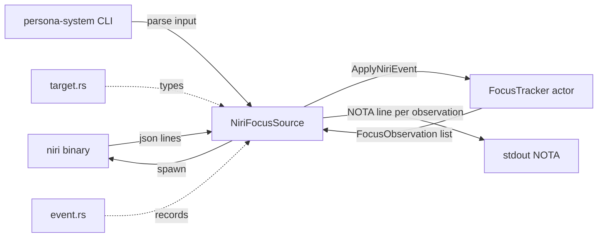
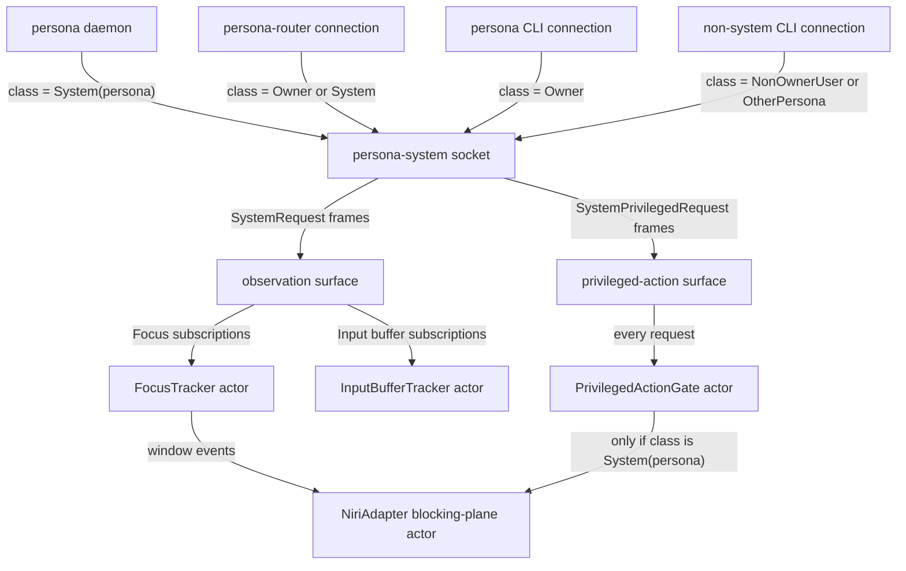
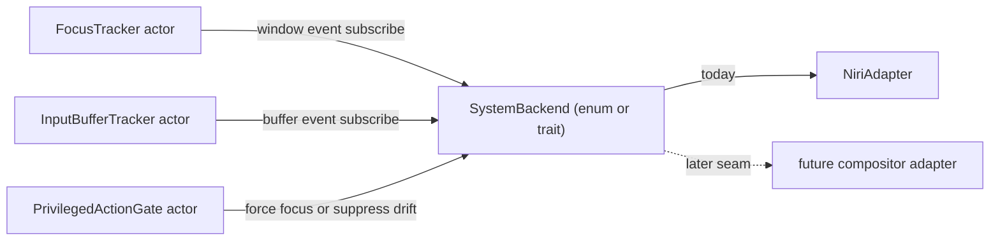
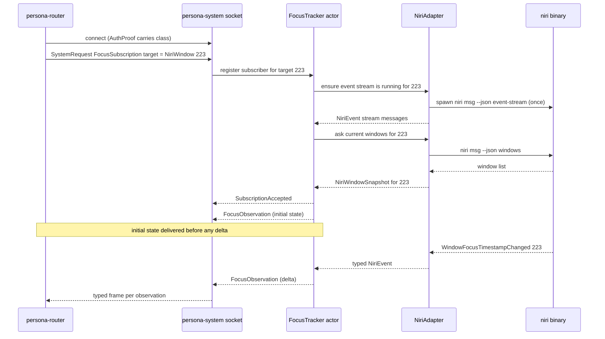
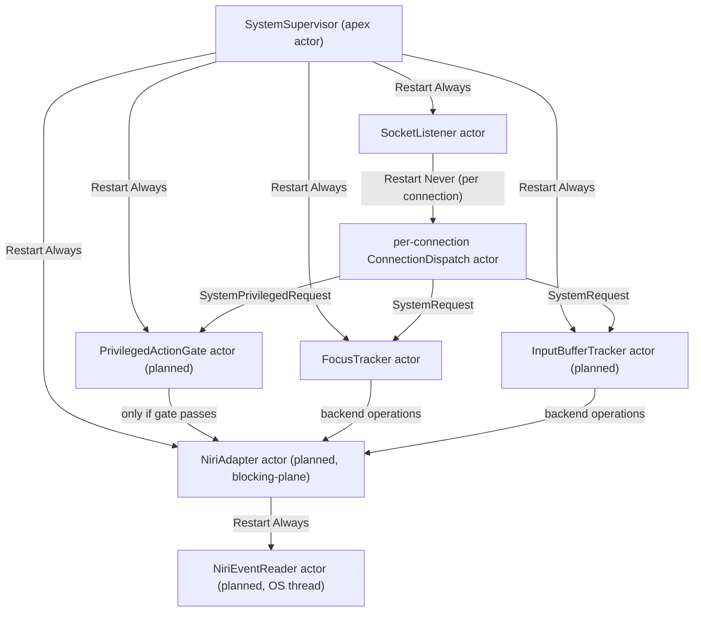
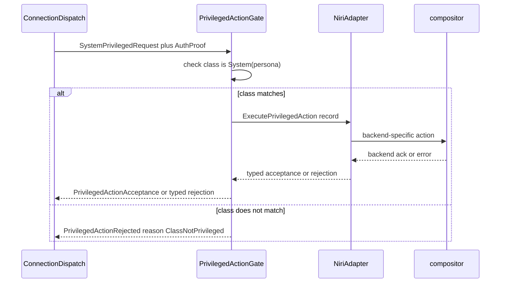
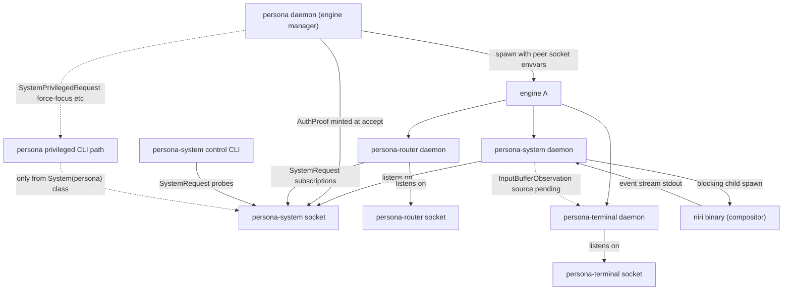
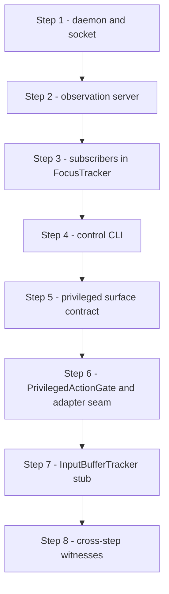

# 119 — persona-system development plan

> **STATUS 2026-05-11**: Deferred entirely for the current
> implementation wave. Per
> `~/primary/reports/designer/127-decisions-resolved-2026-05-11.md`
> §3, the injection-safety use case that justified urgent
> persona-system work dissolves: the terminal-cell input gate
> handles non-interleaving locally (per /127 §1, with
> persona-terminal coordinating the gate-and-cache transaction).
> The `InputBufferTracker` (input-buffer state from a system
> producer) is replaced by the terminal-owned prompt-pattern
> mechanism. `ForceFocus` and other privileged actions return
> when a concrete OS-level Persona need appears.
>
> **Do not file beads against this plan; do not claim its track
> (T8) in the operator hand-off.** The `FocusTracker` Kameo actor
> stays in code (it is real today); plan substance does not grow
> until persona-system is unpaused.

*Designer report. The shape of the system-observation surface as it
stands today, the seams it grows into, and the witnesses that hold
those seams honest.*

---

## 0 · TL;DR

`persona-system` owns one job today and grows into a second job
under the same roof.

- **Today.** A Niri-only focus observer. `NiriFocusSource` shells
  out to `niri msg --json windows` and `niri msg --json event-stream`;
  a Kameo `FocusTracker` actor folds the JSON stream into typed
  `FocusObservation` records; a small NOTA CLI prints those records
  to stdout. There is no daemon, no socket server, no privileged
  surface, no second backend.
- **Eventually.** A two-tier surface bound by `ConnectionClass`:
  read-only observations any subscriber may consume, and a
  privileged-action surface — force-focus, suppress focus drift —
  that the `persona` daemon's own `System(persona)` class alone
  may invoke. An InputBufferTracker beside the FocusTracker. A
  daemon mode behind a Unix socket so the router can subscribe
  per `~/primary/skills/push-not-pull.md` §"Subscription contract"
  (initial state then deltas). A backend abstraction whose seam
  Niri is the first inhabitant of.

The plan names each of those, the contract additions that carry
them, the runtime topology, the gate, the witnesses, and the open
questions. It does not design the next compositor backend; it
names the seam.

---

## 1 · What persona-system IS today

The repo lives at `/git/github.com/LiGoldragon/persona-system`. Its
`ARCHITECTURE.md` describes the eventual two-tier shape; the source
tree implements one slice of it. The slice is real and well-formed;
the rest is named but not yet present.

### 1.1 Source tree as it stands



`src/target.rs` (sources at `/git/github.com/LiGoldragon/persona-system/src/target.rs`)
declares `NiriWindowId`, `NiriWindow`, `SystemTarget` (a closed
NotaSum with one variant), and `HarnessTarget` (a name plus a
target, for the protects-this-window predicate).

`src/event.rs` declares `FocusObservation` (target, focused, generation),
`FocusState` (Focused/Unfocused/Unknown), `InputBufferState`
(Empty/Occupied{preview}/Unknown), and a `SystemEvent` enum with
`FocusChanged` and `InputBufferChanged` variants. `FocusState` and
`InputBufferState` exist as types but no actor yet emits them
through a real adapter; the variants are infrastructure waiting for
its inhabitant.

`src/niri.rs` is the live focus path. `NiriFocusSource::observe`
runs `niri msg --json windows` for a one-shot snapshot; `subscribe`
runs the same command for an initial seed, then spawns
`niri msg --json event-stream` and pipes each JSON line through
`NiriEvent::from_json_str` into the `FocusTracker` actor's
`ApplyNiriEvent` mailbox; the actor's replies (`Vec<FocusObservation>`)
are written to the caller's output. `NiriEvent` is a closed sum of
the known niri event kinds plus an `Other` sink for events that
don't move focus.

`src/niri_focus.rs` is the Kameo seat for `FocusTracker`. It
implements `Actor`, `Message<ApplyNiriEvent>` (returns
`Vec<FocusObservation>`), and `Message<ReadFocusStatistics>` (returns
`FocusStatistics` for the actor-density tests). The actor's state
folds windows-changed and workspace-active-window events into
deduplicated observations: same `(focused, generation)` does not
re-emit; titles changing alone do not re-emit. The generation
counter is the `focus_timestamp` from Niri converted to a single
u64 nanosecond field.

`src/command.rs` defines `ObserveFocus` and `SubscribeFocus` as
NOTA records, an `Input` NotaSum that runs each, and a `CommandLine`
that reads either an inline NOTA argument starting with `(` or a
filesystem path. The CLI does one thing per invocation and writes
NOTA to stdout; the binary at `src/main.rs` is six lines of
`from_environment` plumbing.

`src/error.rs` is a `thiserror`-derived enum: backend mismatches,
niri command failures, JSON decode failures, target-not-found, actor
call failures, command-line errors, and conversions from
`std::io::Error`, `serde_json::Error`, and `nota_codec::Error`.

### 1.2 Tests as they stand

`tests/smoke.rs` exercises the pure record layer: target-protection
predicate, input-buffer accepts-injection predicate, niri-windows
JSON decode, focus-tracker chatter filtering, focus-tracker emit on
focus change, and workspace-active-window event handling.

`tests/actor_runtime_truth.rs` is the architectural-truth surface
for today's slice. It enforces five witnesses:

| Witness | Shape |
|---|---|
| `niri_focus_cannot_use_non_kameo_runtime` | Source scan that rejects `ractor`, `RpcReplyPort`, `ActorProcessingErr` substrings across all source and test files except the guard itself. |
| `niri_subscription_cannot_bypass_focus_actor_mailbox` | `src/niri.rs` must contain `FocusTracker::start` and `focus.ask(ApplyNiriEvent { event }).send()`, and must not contain `tracker.apply_event(&event)` (the direct-call bypass). |
| `focus_tracker_actor_cannot_be_empty_marker` | The struct must carry `last: Option<FocusObservation>`, `generations: HashMap<u64, u64>`, `applied_event_count`, and `emitted_observation_count` fields — no ZST actor. |
| `niri_focus_cannot_emit_target_chatter_without_focus_change` | Tokio actor run with a starting observation; title-only events produce empty reply vectors. |
| `niri_focus_cannot_forget_previous_window_observation_between_messages` | Tokio actor run with two events; only the first emits; statistics probe confirms applied=2, emitted=1. |
| `niri_subscription_cannot_poll_focus_snapshots` | Drives the subscribe path with a fake niri shell script over a temp directory; asserts exactly the expected NOTA lines came out and re-asserts the source patterns. |

These are good witnesses for the slice they cover. They are not yet
the full set the eventual shape needs.

### 1.3 What's a sketch

These appear in `ARCHITECTURE.md` but not in code:

- The InputBufferTracker. `InputBufferState` and an
  `InputBufferChanged` variant of `SystemEvent` exist, but no
  adapter feeds them and no actor owns the stream.
- The privileged-action surface. ARCH §2 names force-focus and
  focus-drift suppression as privileged actions; the source tree
  has no enum, no actor, and no gate.
- The daemon. There is no socket server, no subscriber registry,
  no `signal-persona-system` consumer in this crate yet. The
  CLI is a one-shot subprocess; the contract crate at
  `/git/github.com/LiGoldragon/signal-persona-system` is defined
  but not yet served from this side.
- The backend abstraction. `NiriFocusSource` is the only adapter;
  there is no trait or `BackendAdapter` enum delineating where a
  second compositor would attach.
- The system control CLI. There is a NOTA CLI for one-shot focus
  probes; there is no CLI that talks to a running daemon.

---

## 2 · What's missing vs ARCH and designer/115

The gap list, anchored on `ARCHITECTURE.md` §1 (the surface persona-system
exposes) and `~/primary/reports/designer/115-persona-engine-manager-architecture.md`
§11.2 (the privileged-operations consequence for this component):

1. **Daemon mode.** A long-lived process that owns the Unix socket
   the router connects to, runs the `FocusTracker` and (later)
   `InputBufferTracker` actors continuously, and serves
   `signal_persona_system::SystemRequest` frames over the wire.
2. **`signal-persona-system` server.** The crate at
   `/git/github.com/LiGoldragon/signal-persona-system/src/lib.rs`
   defines the rkyv contract — `SystemRequest`, `SystemEvent`,
   the closed-enum payloads. `persona-system` is the sender side
   (events) and the request-side handler. That binding is not
   wired yet.
3. **InputBufferTracker.** A second observation plane parallel to
   `FocusTracker`. ARCH names input-buffer state alongside focus
   state; the contract crate already has `InputBufferObservation`,
   `InputBufferState::{Empty, Occupied, Unknown}`, `InputBufferSubscription`,
   and `InputBufferSnapshot` variants. The producer side does not
   exist. Persona-terminal is the candidate source (the cell that
   owns the human's keystrokes already knows what's in the input
   buffer); the InputBufferTracker subscribes to terminal-cell
   events, normalises to `InputBufferState`, and pushes to the
   system's subscribers.
4. **Privileged-action surface.** A separate request enum,
   `SystemPrivilegedRequest`, distinct from `SystemRequest`,
   carrying typed records for `ForceFocus`, `SuppressDrift`, and
   any later privileged action. A separate reply enum,
   `SystemPrivilegedReply`, carrying `PrivilegedActionAcceptance`
   and `PrivilegedActionRejected { reason: PrivilegedRejectionReason }`.
   Designer/115 §11.2 (system gains privileged operations as a
   separately-gated surface) is the upstream commitment.
5. **`ConnectionClass = System(persona)` gate.** A
   `PrivilegedActionGate` actor that inspects the connection's
   `AuthProof::class()` before dispatching any
   `SystemPrivilegedRequest`. Hard-rejects every class other than
   `System(persona)`; the rejection is a typed reply, not an
   error swallowed in the transport. Designer/115 §6.3 (per-component
   policy axis on `ConnectionClass`) and designer/115 §13 item 12
   (the privileged-action surface accepts only `System(persona)`
   requests) are the upstream commitments.
6. **Cross-compositor abstraction.** The adapter seam. Today the
   `FocusTracker` mailbox accepts `NiriEvent`; the daemon shells
   out to the `niri` binary directly. The seam where a second
   compositor would attach is unnamed in code. ARCH §1 names
   "backend adapter traits or data-bearing adapter objects" as
   part of the surface; that's the seam to articulate.
7. **persona-system control CLI.** A user-facing test and control
   surface for the daemon. Distinct from today's one-shot CLI:
   the new CLI is a `signal-persona-system` client over the
   daemon socket. Useful for two purposes — manual focus probing
   against a running daemon, and as a witness substrate for the
   architectural-truth tests that prove the gate's rejection
   shape.
8. **System-owned sema-db (conditional).** ARCH §2 states the
   component stays stateless beyond live actor state unless it
   later needs durable subscription registrations or backend
   cursors. The plan keeps the conditional: durable state arrives
   only when a concrete need pushes for it; if it arrives, it
   lives in a system-scoped sema-db following the workspace's
   per-component-database rule.

---

## 3 · Contracts that touch persona-system

Three contract crates intersect this component. Persona-system
speaks the first two; it consumes a property of the third.

### 3.1 `signal-persona-system` — the observation channel and (new) privileged surface

Sources at `/git/github.com/LiGoldragon/signal-persona-system/`. The
relation sentence from the contract's own ARCH: the router initiates
subscriptions via `SystemRequest`; the system accepts and pushes
`SystemEvent` as state changes. The channel is bidirectional but
the steady-state flow is system to router.

Today's variants (from `src/lib.rs`):

```text
SystemRequest                    SystemEvent
  FocusSubscription                FocusObservation
  FocusUnsubscription              InputBufferObservation
  FocusSnapshot                    WindowClosed
  InputBufferSubscription          SubscriptionAccepted
  InputBufferUnsubscription        ObservationTargetMissing
  InputBufferSnapshot
```

What the plan adds to this crate, **in a second top-level channel
declaration alongside the observation channel** (this matters for
the gate — see §4):

```text
SystemPrivilegedRequest          SystemPrivilegedReply
  ForceFocus                       PrivilegedActionAcceptance
  SuppressDrift                    PrivilegedActionRejected
  ReleaseDriftSuppression
```

Plus the supporting typed records that ride those variants:

| Record | Shape |
|---|---|
| `ForceFocus` | `{ target: SystemTarget, generation_hint: Option<ObservationGeneration> }` — request the compositor to bring `target` to focus. The generation hint lets the gate witness that the caller has read recent state. |
| `SuppressDrift` | `{ target: SystemTarget, window: DriftSuppressionWindow }` — during the named window, the system suppresses or reports focus changes that move focus away from `target`. The window is a typed value, not a duration in a string. |
| `DriftSuppressionWindow` | a closed enum carrying either an injection-completion handle or a typed deadline. |
| `ReleaseDriftSuppression` | `{ target: SystemTarget }` — cancel an active drift suppression. |
| `PrivilegedActionAcceptance` | `{ generation: ObservationGeneration }` — system minted; the caller may then watch the observation channel for the effect. |
| `PrivilegedActionRejected` | `{ reason: PrivilegedRejectionReason }`. |
| `PrivilegedRejectionReason` | closed enum: `ClassNotPrivileged`, `BackendDoesNotSupport`, `TargetMissing { target }`, `AlreadySuppressed { target }`, `NotSuppressed { target }`. |

The auth-proof shape is not redefined here — it rides alongside the
`Frame`, minted by the engine boundary per designer/115 §6.2 (the
`persona` daemon mints `ConnectionClass` at socket-accept time from
`SO_PEERCRED` against the engine's owner table and the privileged
principal catalog). `signal-persona-system` consumes the auth proof
via `signal-core`'s `Frame<Req, Reply, AuthProof>` envelope; the
contract crate stays free of auth verification logic. The gate
implementation reads `auth_proof.class()` and compares against
`ConnectionClass::System(SystemPrincipal::persona())`; that match
predicate is the load-bearing test.

`signal-persona-system`'s own architectural-truth tests grow:

- `system_privileged_request_<variant>_round_trips` — one per
  variant in the new enum.
- `privileged_rejection_reasons_have_no_unknown_variant` — closed-enum
  witness.
- `force_focus_record_carries_typed_target` — no string-typed
  shortcut for `SystemTarget`.

### 3.2 `signal-persona-harness` — not directly spoken

System pushes observations to the router; the router aggregates
focus and prompt-buffer facts into the delivery gate it presents to
the harness. The harness does not subscribe to `signal-persona-system`
directly; it subscribes to (or receives push from) the router's own
contract. Designer/115 §11.4 names the harness's class-aware
visibility axis; that's a router-and-harness concern, not a
system-and-harness one. The plan keeps the seam clean: persona-system
sees only the router as its consumer for facts, and only the persona
daemon as its consumer for privileged actions.

### 3.3 `signal-persona` — consumed at the engine boundary

Sources at `/git/github.com/LiGoldragon/signal-persona/`. This is
the engine-manager contract; persona-system does not speak it. What
persona-system *consumes* from it is `ConnectionClass`, a property
of every `AuthProof` minted at the engine boundary
(`/git/github.com/LiGoldragon/signal-persona/src/lib.rs` §6.3 of the
ARCH defines the closed enum). The persona daemon attaches the
class to the auth proof on socket accept; that proof rides every
frame on the connection's lifetime; the system's gate reads it.

The migration question (designer/115 Q7 — when `ConnectionClass`
moves into `signal-core`) is upstream of this report and does not
change the seam. When that migration happens, the gate's match
predicate retargets to `signal_core::ConnectionClass` and nothing
else changes here.

---

## 4 · Two-tier surface — observations versus privileged actions

The component presents two surfaces that share a Unix socket and a
process but separate everything else: their request enums, their
reply enums, their dispatch path inside the daemon, their actor
ownership, and (critically) their gating.



The split is not a runtime convenience — it is the surface's
identity. The observation surface accepts requests from any class
(consumers gated by router policy from there); the privileged
surface accepts requests from `System(persona)` alone. Putting them
into one enum would be the wrong shape per ESSENCE §"Perfect
specificity at boundaries": the two surfaces have different audiences,
different invariants, and different rejection reasons. Two enums.

What variant lives where:

| Surface | Today's variants (observation) | Plan's additions |
|---|---|---|
| Observation (`SystemRequest` / `SystemEvent`) | Focus subscribe/unsubscribe/snapshot; InputBuffer subscribe/unsubscribe/snapshot; FocusObservation; InputBufferObservation; WindowClosed; SubscriptionAccepted; ObservationTargetMissing. | None — the observation surface is closed at its current shape. |
| Privileged (`SystemPrivilegedRequest` / `SystemPrivilegedReply`) | none — the surface is new. | ForceFocus; SuppressDrift; ReleaseDriftSuppression; PrivilegedActionAcceptance; PrivilegedActionRejected. |

The two-enum split is enforced at the contract level (one
`signal_channel!` invocation per surface in
`signal-persona-system/src/lib.rs`). A consumer cannot accidentally
send a privileged request through the observation channel — the
type system rejects the frame.

---

## 5 · Adapter abstraction — the seam

Niri is today's compositor. The seam where a second backend attaches
is a **data-bearing adapter object** per ARCH §1, not a free-floating
trait that hides the adapter's state in a `Box<dyn Adapter>`. The
adapter owns its backend handles; the focus and privileged-action
actors hold a typed handle to the adapter.



The shape:

- `SystemBackend` is the seam — either a closed enum (`NiriAdapter`,
  later variants for other backends) or a trait whose
  data-bearing implementations are the adapters. The choice is
  the first concrete design decision once a second backend
  arrives. The plan does not pick now; it names the seam.
- `NiriAdapter` owns the niri-binary path string, the optional
  long-lived `niri msg event-stream` child handle, and any cached
  state about subscriptions the backend itself tracks. It exposes
  three operations: subscribe-to-window-events,
  subscribe-to-input-buffer-events (initially a stub returning
  `Unknown` until a real source lands), and execute-privileged-action.
- The blocking work — spawning `niri`, reading its stdout — runs
  per `~/primary/skills/kameo.md` §"Blocking-plane templates"
  Template 2 (dedicated OS thread, `spawn_in_thread`) since the
  niri event stream is a long-lived blocking read. Today's code
  already does the right thing in spirit: `BufReader.lines()` on
  the child stdout, each line shipped through the actor's mailbox
  via `runtime.block_on(focus.ask(...))`. The plan reshapes that
  into a Kameo-native streaming actor: the niri child stdout
  becomes a `tokio_stream`-wrapped reader; the stream is attached
  to the `NiriAdapter` actor via `actor_ref.attach_stream`; each
  line lands as a typed `StreamMessage<NiriEventLine, _, _>` per
  the kameo skill §"Streams". The `NiriAdapter` actor forwards
  the parsed event into the `FocusTracker`'s mailbox.

The plan does not design the next compositor backend; the seam is
the point. When the second backend arrives, the `SystemBackend`
shape will be load-bearing enough to commit to (enum-with-variants
or trait-with-implementors); until then the seam is named and the
single inhabitant is named, and any premature trait would be
abstraction-on-one-implementation per the workspace's discipline.

---

## 6 · Subscription flow

Per `~/primary/skills/push-not-pull.md` §"Subscription contract"
(every push subscription emits the producer's current state on
connect, then deltas), persona-system is a producer. The router is
the primary consumer; the persona-system control CLI is a secondary
consumer used for tests and ad hoc inspection.



Mechanics:

1. **Registration is a typed frame.** The router opens its
   connection, completes the `signal-core` handshake (auth proof
   attached), and sends `SystemRequest::FocusSubscription` or
   `InputBufferSubscription`. The socket task hands the request
   to the matching tracker actor.
2. **Initial state precedes deltas.** The tracker actor responds
   with `SubscriptionAccepted` followed by exactly one observation
   describing current state. The tracker holds the subscriber's
   reply channel; subsequent state changes push observations to it
   through the same channel.
3. **Subscribers live in the tracker, not in a shared map.**
   `FocusTracker` already owns per-target state today (the
   `generations` `HashMap`); it grows a typed `Subscribers`
   structure keyed by target with the per-subscriber reply
   channels. No global subscription registry; the tracker is the
   one place the state lives.
4. **Unsubscription is a typed frame too.** `FocusUnsubscription`
   removes the subscriber from the tracker; the last unsubscription
   for a target tells the `NiriAdapter` it may release any
   target-specific state.
5. **Snapshot is a one-shot variant of the same flow.**
   `FocusSnapshot` asks for current state without registering a
   subscriber. The tracker reuses the same path; the
   `SubscriptionAccepted` reply is skipped; only the
   `FocusObservation` is sent.
6. **No polling.** Per ARCH §4 invariant ("unknown system state is
   explicit typed state, not a reason to poll"), the tracker
   never re-asks niri for the same target on a clock. When state
   is unknown — backend has not yet reported, or the target
   does not exist — the tracker emits a typed observation
   (`ObservationTargetMissing` or `InputBufferState::Unknown`)
   rather than retrying.

---

## 7 · Runtime topology

The component's actor tree under daemon mode. Apex on the left;
data-bearing actors and adapter on the right. Restart policies
follow `~/primary/skills/kameo.md` §"Supervision" and
`~/primary/skills/actor-systems.md` §"Supervision is part of the
design".



Per-actor notes:

| Actor | State | Restart | Notes |
|---|---|---|---|
| `SystemSupervisor` | apex; spawn manifest; running children registry | n/a (runtime root) | The runtime root per actor-systems skill §"Runtime roots are actors". Spawns all named children at startup and exposes a topology dump for the architectural-truth tests. |
| `SocketListener` | bound `UnixListener`; accepts; auth handshake | `Always` | Per-accept, spawns a `ConnectionDispatch` actor under itself with `Never` (the connection-actor lifetime is bounded by the connection). |
| `ConnectionDispatch` | the connection's framed reader/writer; the `AuthProof` (with class) for this connection | `Never` | One per connection. Reads `Frame<SystemRequest>` and `Frame<SystemPrivilegedRequest>`; dispatches to the right tracker or gate. Dies with the connection. |
| `FocusTracker` | per-target windows + `Subscribers` map; observation generations | `Always` | Today's struct generalised: it currently tracks one target at a time and serves CLI subscribe; daemon mode promotes it to a per-target keyed structure. The actor's state shape stays load-bearing — public empty actor markers stay forbidden per the existing truth test. |
| `InputBufferTracker` | per-target input-buffer state + subscribers | `Always` | New. Source pending — likely the persona-terminal cell, which knows what's in the input buffer; the terminal subscribes-out and the input-buffer tracker subscribes-in. |
| `PrivilegedActionGate` | reference to the `NiriAdapter`; rejection counters for the truth tests | `Always` | New. Every `SystemPrivilegedRequest` lands here. The gate's first act is the class match; only if it passes does the request proceed to the adapter. |
| `NiriAdapter` | the niri binary path; per-target subscription bookkeeping | `Always` | New. Replaces today's `NiriFocusSource` blocking-shell logic with a Kameo actor that owns the backend's identity and state. |
| `NiriEventReader` | the niri event-stream child process handle | `Always` | New. The blocking-plane plate per kameo skill §"Blocking-plane templates" Template 2 (dedicated OS thread). Owns the long-lived `niri msg --json event-stream` child; pushes each parsed event to `NiriAdapter` via `attach_stream`. |

Per `~/primary/skills/actor-systems.md` §"Counter-only state — test
witnesses must be tested", the `applied_event_count` and
`emitted_observation_count` fields on `FocusTracker` exist for the
truth tests. The plan keeps that pattern: each actor whose
architectural-truth witness depends on it having done specific work
exposes typed counters or generation references through a
typed-message read; no field that exists only for instrumentation
that isn't itself exercised in a witness.

---

## 8 · Skeleton-as-design — what lands in compiled code

Per ESSENCE §"Skeleton-as-design", the shapes named above land as
typed Rust skeletons in the relevant repos before any handler body.

In `/git/github.com/LiGoldragon/signal-persona-system/src/lib.rs`:

```text
SystemPrivilegedRequest  closed enum, 3 variants
SystemPrivilegedReply    closed enum, 2 variants
ForceFocus               struct
SuppressDrift            struct
DriftSuppressionWindow   closed enum
ReleaseDriftSuppression  struct
PrivilegedActionAcceptance struct
PrivilegedActionRejected struct
PrivilegedRejectionReason closed enum, 5 variants
```

Each new payload type derives `Archive`, `RkyvSerialize`,
`RkyvDeserialize`, and the `Debug`/`Clone`/`PartialEq`/`Eq` set the
existing types carry. A second `signal_channel!` invocation
declares the privileged surface alongside the observation surface;
the two channels share `signal-core`'s `Frame` envelope but type
their request and reply enums separately.

In `/git/github.com/LiGoldragon/persona-system/src/`:

| Module | Adds | Notes |
|---|---|---|
| `src/daemon.rs` (new) | `SystemSupervisor`, `Daemon`, socket binding | The apex. Module-level entry point for daemon mode. |
| `src/socket.rs` (new) | `SocketListener`, `ConnectionDispatch` | The wire glue. Reads frames, dispatches per-surface. |
| `src/input_buffer.rs` (new) | `InputBufferTracker`, `Subscribers` | Parallel to today's `FocusTracker`. Source-side stays stubbed (`InputBufferState::Unknown`) until terminal-cell exposes the push primitive. |
| `src/privileged.rs` (new) | `PrivilegedActionGate`, the class-match predicate | The gate. Reads `AuthProof::class()`, matches against `ConnectionClass::System(SystemPrincipal::persona())`. |
| `src/adapter.rs` (new) | `SystemBackend` (today: enum with `NiriAdapter` variant) | The seam. Today: one inhabitant. |
| `src/niri.rs` (existing) | Refactor: `NiriFocusSource` becomes the `NiriAdapter` actor; the blocking child read moves to `NiriEventReader`. | The existing closed-enum `NiriEvent` and the JSON decode stay. |
| `src/niri_focus.rs` (existing) | Generalise `FocusTracker` to hold a `Subscribers<SystemTarget, FocusObservation>` map and accept registration messages. | The existing actor implementation and the statistics probe stay. |
| `bin/persona-system-daemon.rs` (new) | Daemon entry point. | Replaces today's one-shot main for daemon mode. The one-shot CLI may stay as a separate binary for repro fixtures, or migrate to a control CLI mode. |
| `bin/persona-system-cli.rs` (new) | Control CLI; speaks `signal-persona-system` to the daemon. | The user-facing test and inspection surface. |

The `todo!()`-body discipline applies until each handler has its
witness test in place.

If `persona-system` later grows durable state — typed subscription
registrations that should survive a daemon restart, or backend
cursors that resume across restarts — that state lives in a
system-scoped sema-db at `/var/lib/persona/<engine-id>/system/`,
owned by this component, never written into another component's
database. ARCH §2 names this conditional; the plan keeps it
conditional. Until a concrete need pushes for persistence, the
component stays stateless beyond its live actor state.

---

## 9 · Class-aware gate — the privileged-action protocol

The gate is one short loop in code and a single load-bearing
predicate. Every privileged action goes through it. The shape:



The gate is **not** a router-side concern. The router's policy
(designer/115 §6.3) is about message delivery; the system's gate is
about whether the caller may invoke a privileged action at all.
The two layers compose: the router refuses to *route* a privileged
request from anyone other than the persona daemon's own connection
(because the privileged request is not in the router's repertoire
in the first place — the daemon talks to system directly); the
system's gate refuses to *execute* it absent the class match.
Defense in depth, with the system's gate as the last witness the
adversary would have to defeat to act on the host.

The class match is a single equality check against
`ConnectionClass::System(SystemPrincipal::persona())`. There is no
"trusted UID list" or string comparison; the predicate is typed and
the witness test asserts an exhaustive match on the enum (any
non-`System(persona)` arm rejects). The gate emits a typed
`PrivilegedActionRejected { reason: ClassNotPrivileged }`; the
caller's class is **not** echoed back in the rejection (to avoid
leaking class information to non-privileged callers — they learn
only that they are not privileged).

---

## 10 · Architectural-truth tests

The witnesses are named in `x_cannot_happen_without_y` shape per
`~/primary/skills/architectural-truth-tests.md` §"Rule of thumb".
Some live in `persona-system/tests/`; others live in
`signal-persona-system/tests/`; one (the Nix-chained cross-component
witness) lives in the workspace flake. Each carries a one-line
intent.

| Test name | Where | Intent |
|---|---|---|
| `force_focus_rejects_non_system_persona_caller` | persona-system | Connect with a forged `ConnectionClass::NonOwnerUser`; send `ForceFocus`; assert reply is `PrivilegedActionRejected { reason: ClassNotPrivileged }`; assert the `NiriAdapter` was **not** asked to execute. |
| `suppress_drift_rejects_non_system_persona_caller` | persona-system | Same shape as above for `SuppressDrift`. |
| `release_drift_suppression_rejects_non_system_persona_caller` | persona-system | Same shape; rejects symmetrically. |
| `privileged_action_surface_is_a_separate_enum` | signal-persona-system | Source scan that asserts `SystemPrivilegedRequest` does not appear as a variant of `SystemRequest` (the surfaces are two channel declarations, not one). |
| `subscription_receives_initial_focus_state_before_first_delta` | persona-system | Subscribe a fake consumer to a target whose initial state is known; assert the consumer's first received frame is `SubscriptionAccepted`, the second is a `FocusObservation` carrying the initial state, and any delta arrives only after that. |
| `subscription_receives_initial_input_buffer_state_before_first_delta` | persona-system | Same shape for `InputBufferSubscription`. |
| `focus_tracker_does_not_poll_niri` | persona-system | Drive a long-lived subscription with `tokio-test`'s clock-pause; assert zero `niri msg --json windows` invocations during paused time. The witness is a counter on the `NiriAdapter` actor read through a typed message. |
| `non_owner_subscription_sees_only_read_only_observations` | persona-system | Connect with `ConnectionClass::NonOwnerUser`; assert observation subscriptions succeed; assert any `SystemPrivilegedRequest` is rejected with `ClassNotPrivileged`. |
| `focus_tracker_actor_handles_subscriber_registration_through_mailbox` | persona-system | Source scan that asserts subscriber state lives on the actor (`Subscribers: HashMap<...>`) and that no free function takes a `Subscribers` reference outside the actor. The extension of today's `focus_tracker_actor_cannot_be_empty_marker` to the new field. |
| `niri_adapter_blocking_plane_runs_on_dedicated_thread` | persona-system | Source scan plus runtime trace: `NiriEventReader` uses `spawn_in_thread` (or its tokio equivalent); the `FocusTracker` mailbox replies to a probe while the reader thread blocks on niri's stdout. The kameo §"Blocking-plane templates" Template 2 witness. |
| `system_runtime_topology_contains_named_actors` | persona-system | The `SystemSupervisor` topology dump contains `SocketListener`, `FocusTracker`, `InputBufferTracker`, `PrivilegedActionGate`, `NiriAdapter`, `NiriEventReader`. The actor-density witness. |
| `system_does_not_speak_signal_persona` | persona-system | `cargo metadata` test: `persona-system` does not depend on `signal-persona`. The class travels through the auth proof, not through the engine-manager contract. |
| `system_does_not_speak_signal_persona_harness` | persona-system | `cargo metadata` test: `persona-system` does not depend on `signal-persona-harness`. The harness layer is the router's consumer, not the system's. |
| `privileged_action_acceptance_carries_minted_generation` | persona-system | `PrivilegedActionAcceptance` always carries a system-minted `ObservationGeneration`; the agent never supplies one. Witness: `PrivilegedActionAcceptance` has no constructor that accepts a generation from outside. |
| `force_focus_settles_into_observation` | persona-system | After a successful `ForceFocus`, a subscriber to the same target receives a `FocusObservation { focused: true, generation: g }` where `g >= acceptance.generation`. The end-to-end witness that the privileged action's effect is observable through the same channel. |
| `system_durable_state_is_system_scoped_when_present` | workspace flake (Nix-chained) | **Conditional witness, lands only if persona-system grows a sema-db.** Writer derivation: spawn the daemon, register a subscription, kill, restart. Reader derivation: opens `/var/lib/persona/<engine-id>/system/system.redb` with the authoritative reader and asserts the typed registration survived. Until persistent state lands, this test is skipped. |

Two of the existing actor-runtime-truth tests stay (the source scan
against non-Kameo runtimes and the assertion that
`FocusTracker::start` and the mailbox path are present in
`src/niri.rs`). They generalise to cover the new modules; the names
stay stable.

---

## 11 · Federation seam diagram

How persona-system sits inside one engine's daemon federation and
what crosses its socket boundaries.



The persona daemon spawns the engine's components and passes peer
socket paths as environment variables per designer/115 §8.1 (spawn
lifecycle). Each component's socket lives under the engine's scoped
socket directory; the system's socket accepts connections from any
class but enforces gate policy at the per-surface dispatch. The
privileged-action path is the persona daemon's own connection back
into its system component — used to coordinate focus during
programmatic injection windows. The control CLI is a separate
binary that speaks `signal-persona-system` over the socket; it is
the test substrate and an operator's inspection surface.

The InputBufferObservation source path remains a planned seam — the
persona-terminal daemon is the most natural producer of input-buffer
state (the cell owns the human's keystrokes), but the wire shape of
that producer-to-system push is the terminal component's
architectural work, not this plan's. Until it lands, the
`InputBufferTracker` emits `InputBufferState::Unknown` per ARCH §4
("unknown system state is explicit typed state, not a reason to poll").

---

## 12 · Risks and open questions

Each is an open seam the plan names without trying to close.

| # | Question |
|---|---|
| Q1 | **Niri event-stream stability.** The current adapter shells out to a long-lived `niri msg --json event-stream` child. Niri restarts (config reload, segfault) close that stream; the `NiriEventReader` actor's restart will respawn the child, but the gap is observable to subscribers. What's the right shape for the "backend hiccup" observation — a typed `BackendInterrupted` event, or silence with a fresh `FocusObservation` on reconnect? Both are defensible; the witness test is the deciding force. |
| Q2 | **Force-focus semantics on Wayland.** Niri's force-focus support varies by version. The privileged-action's effect needs a backend-capability declaration: `ForceFocus` may be `BackendDoesNotSupport`-rejected on a compositor that cannot guarantee the effect. The capability surface is a typed query the `NiriAdapter` answers at startup; the gate consults it before forwarding. Other Wayland compositors will return different answers; the seam is `SystemBackend::capabilities()`. |
| Q3 | **How is the privileged action's effect verified?** A successful `ForceFocus` acceptance does not mean focus has settled; the focus event arrives milliseconds later via the observation channel. The plan stipulates the `force_focus_settles_into_observation` witness: acceptance must be followed by an observation matching the requested target within a bounded number of subsequent events. What "bounded" means in absolute terms — events, wall time, or both — is the open question. Wall-time bounds invite the polling temptation; event-count bounds are stricter but require a clear definition of "subsequent events." The right shape likely follows the observation-generation invariant: `force_focus` mints a generation; the matching observation carries a generation greater-or-equal to it. |
| Q4 | **SuppressDrift's interaction with human-initiated focus changes.** During an injection window, the suppression prevents drift away from the injection target. If the human explicitly clicks a different window, what is the right answer — honor the human (cancel the suppression), honor the suppression (overrule the click), or report and ask? The human-overrules-system answer is the natural default per ESSENCE; the explicit witness test should make it visible. |
| Q5 | **Cross-host system observations.** Designer/115 §13 item 3 names per-host scoping for the persona daemon and its engines. A second host's compositor is unobservable from this host's persona-system. When the federation grows cross-host, the question of "is window X focused on host Y" pushes inter-engine routes through the `signal-persona-system` shape — not in scope today, but the seam matters once it lands. |
| Q6 | **InputBufferObservation source.** The most natural producer of input-buffer state is the persona-terminal cell. The wire-shape of terminal-to-system push is the terminal component's architectural work; this plan flags the dependency without specifying the contract. Until that contract lands, the `InputBufferTracker` is a placeholder that emits `Unknown` on subscribe. |
| Q7 | **Backend trait versus closed enum.** Today's single-inhabitant seam (`NiriAdapter`) is implementable either way. A closed enum is the workspace-honest shape for "all known backends compiled in" (no `Box<dyn>` indirection, exhaustive matches). A trait with multiple impls is the right shape when backends live in separate crates. The decision waits for the second backend; the plan does not pre-resolve. |
| Q8 | **Capability declaration as static or queried.** The `SystemBackend::capabilities()` answer can be a static declaration (the adapter's type names what it can do) or a runtime query (the adapter's instance reports it). Niri's force-focus support varies by version, suggesting runtime. The runtime query then becomes part of the adapter's required surface; the plan accepts that as the default and revisits if a backend's capability set is provably static. |

These open seams are tracked in BEADS for cross-agent visibility; a
short-tracked item per question lets operators and system-specialists
push back on a specific seam without re-reading this plan in full.

---

## 13 · Implementation sequence

The order in which the missing pieces land. Each step adds one
named witness as it goes; no step lands without its truth test.



Step notes:

1. **Daemon and socket.** Add `bin/persona-system-daemon.rs`,
   `src/daemon.rs` (`SystemSupervisor` apex), `src/socket.rs`
   (`SocketListener`, `ConnectionDispatch`). The daemon binds to
   the engine-scoped socket path passed via the persona daemon's
   env-var contract. Witness: the topology test
   `system_runtime_topology_contains_named_actors` (initial subset).
2. **Observation server.** Wire `signal-persona-system`'s
   `SystemRequest` / `SystemEvent` over the socket. At this step
   the trackers are still single-target like today; the dispatch
   path is real. Witness:
   `subscription_receives_initial_focus_state_before_first_delta`
   and `subscription_receives_initial_input_buffer_state_before_first_delta`
   (the second initially passes only because `InputBufferTracker`
   replies `Unknown`).
3. **Subscribers in FocusTracker.** Generalise `FocusTracker` to
   hold a per-target `Subscribers` structure. Multi-subscriber
   support replaces the single-output-stream shape of today's
   CLI subscribe path. Witness:
   `focus_tracker_actor_handles_subscriber_registration_through_mailbox`
   (extension of today's existing actor-truth test).
4. **Control CLI.** `bin/persona-system-cli.rs` connects to the
   daemon socket and speaks `signal-persona-system`. Replaces the
   one-shot shell path for daemon-mode inspection. Witness:
   `non_owner_subscription_sees_only_read_only_observations`
   (verifies the daemon accepts read-only requests from
   non-privileged classes).
5. **Privileged surface contract.** Add `SystemPrivilegedRequest`,
   `SystemPrivilegedReply`, and the typed records to
   `signal-persona-system`. Land all
   `system_privileged_request_<variant>_round_trips` tests in the
   contract crate. Witness:
   `privileged_action_surface_is_a_separate_enum`.
6. **PrivilegedActionGate and adapter seam.** Add `src/privileged.rs`
   (`PrivilegedActionGate`), `src/adapter.rs` (`SystemBackend`).
   Refactor `NiriFocusSource` into the `NiriAdapter` actor and
   `NiriEventReader` blocking-plane actor. Wire the gate. Witness:
   `force_focus_rejects_non_system_persona_caller` and the two
   sibling rejection tests; `privileged_action_acceptance_carries_minted_generation`;
   `niri_adapter_blocking_plane_runs_on_dedicated_thread`;
   `force_focus_settles_into_observation` once the niri-side
   capability is in place.
7. **InputBufferTracker stub.** Add `src/input_buffer.rs` with the
   actor, subscribers, and the `InputBufferState::Unknown`-default
   placeholder. Real source-side production waits for the
   persona-terminal contract addition; until then the tracker
   replies `Unknown` to subscribers, which is the truthful
   answer per ARCH §4. The witness already-present from step 2
   stays valid.
8. **Cross-step witnesses.** Add the `cargo metadata` tests
   (`system_does_not_speak_signal_persona`, sibling). Add the
   no-polling clock-pause witness (`focus_tracker_does_not_poll_niri`).
   If persistent state lands at any point in 1-7, fold in the
   Nix-chained `system_durable_state_is_system_scoped_when_present`
   witness.

The sequence is sequential because the steps feed each other: the
gate cannot land before the surface enum; the daemon must precede
the observation server which must precede the subscribers refactor.
The InputBufferTracker landing late reflects that its source is
external; its early placeholder is fine.

---

## 14 · See also

- `/git/github.com/LiGoldragon/persona-system/ARCHITECTURE.md` —
  the component's current ARCH; this plan is downstream of it
  and proposes the additions that land in §1 (component surface),
  §2 (state and ownership), §3 (boundaries), and §4 (invariants).
- `/git/github.com/LiGoldragon/signal-persona-system/ARCHITECTURE.md`
  — the observation contract; this plan adds a second
  `signal_channel!` invocation for the privileged surface.
- `/git/github.com/LiGoldragon/signal-persona/ARCHITECTURE.md` —
  the engine-manager contract that mints `ConnectionClass` on
  the auth proof rolled into every frame on a connection.
- `~/primary/reports/designer/115-persona-engine-manager-architecture.md`
  §11.2 (system gains a privileged-action surface as a separately
  gated enum) — the upstream commitment for the gate; §6 (the
  `ConnectionClass` enum, where it's minted, how each component
  consumes it) — the contract this plan integrates with.
- `~/primary/reports/designer/114-persona-vision-as-of-2026-05-11.md`
  §1.2 (the federation — six daemons plus the persona-message
  proxy) — the federation context this component sits in.
- `~/primary/skills/contract-repo.md` — the discipline the
  privileged-surface additions follow.
- `~/primary/skills/kameo.md` §"Streams" (the `attach_stream`
  shape the niri event reader uses) and §"Blocking-plane
  templates" Template 2 (dedicated OS thread, the right plate
  for the long-lived event-stream child).
- `~/primary/skills/actor-systems.md` — supervision, blocking,
  actor-density witnesses.
- `~/primary/skills/architectural-truth-tests.md` §"Rule of
  thumb — the test name pattern" (the
  `x_cannot_happen_without_y` shape used throughout §10).
- `~/primary/skills/architecture-editor.md` — the
  `ARCHITECTURE.md` shape the additions in §8 will fold into.
- `~/primary/skills/push-not-pull.md` §"Subscription contract"
  (initial state then deltas) — the load-bearing rule for §6.
- `~/primary/skills/testing.md` — the test-writing discipline
  the witnesses in §10 follow.
- `~/primary/skills/rust-discipline.md` — Rust enforcement for
  closed enums, typed records, and the redb-rkyv shape the
  durable-state seam (when it lands) follows.
