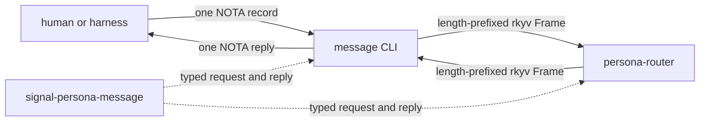
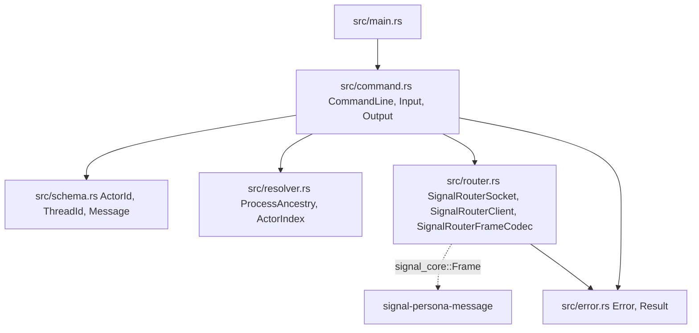
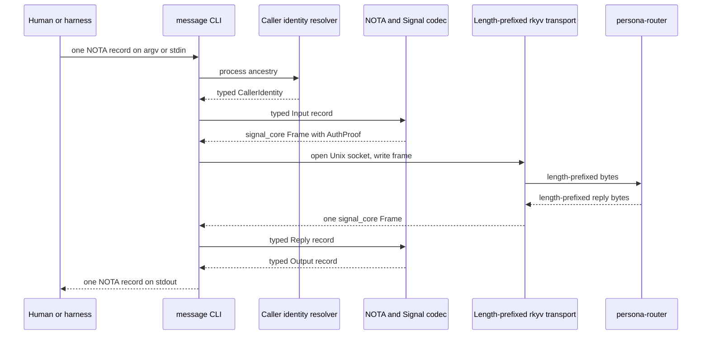
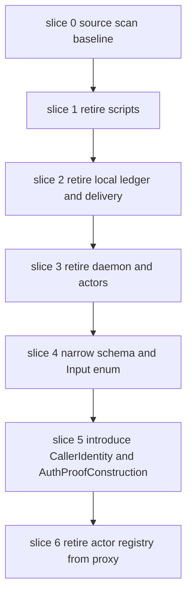
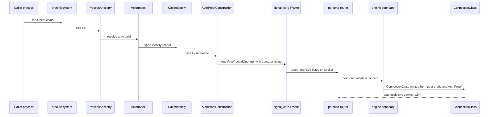
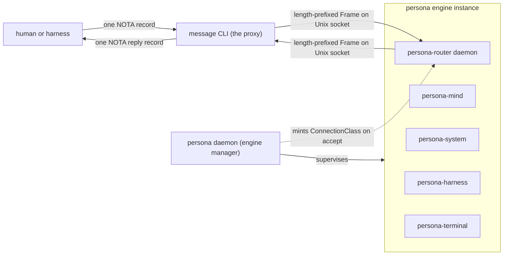

# 116 — persona-message development plan

*Designer report. What `persona-message` IS today, what it must
BECOME (per bead `primary-2w6` — "persona-message becomes
Nexus-to-router and router-to-terminal proxy"), and the typed
shape of the path from one to the other. Anchored on the
current `/git/github.com/LiGoldragon/persona-message/` source
tree and `ARCHITECTURE.md`, the `signal-persona-message`
contract, and `signal-persona` ConnectionClass framing.*

---

## 0 · TL;DR

`persona-message` is the **NOTA boundary and proxy** for Persona
messages — the text edge of the engine where a human or a
harness names a Send/Inbox/Tail/Register/Agents/Flush record in
NOTA, and a router-bound message frame goes out the other side.

Today the repo carries two parallel paths inside one binary:

- **The good path.** `PERSONA_MESSAGE_ROUTER_SOCKET` set ⇒ the
  `message` CLI translates one NOTA `Send`/`Inbox` record into
  a `signal-persona-message` request, writes a length-prefixed
  rkyv `signal_core::Frame` to the router's Unix socket, reads
  one reply frame, and prints one NOTA reply. The router owns
  durable acceptance; the CLI carries no state.
- **The stale path.** `PERSONA_MESSAGE_ROUTER_SOCKET` unset ⇒
  the same binary appends to `messages.nota.log`, registers
  actors in `actors.nota`, runs a local `DeliveryGate`, and
  exposes a transitional `message-daemon` whose Kameo actor
  tree (`DaemonRoot` ⇢ `Ledger`) owns request intake and a
  local ledger. The original `Tail` implementation polls the
  log file from this stale path. The `EndpointKind::PtySocket`
  endpoint vocabulary is the residue of the retired
  `persona-wezterm` delivery path (operator-assistant/105
  §"Slice B" — confirms the path is retired and that source
  scans should keep stale references from coming back).

The destination, per bead `primary-2w6` (and the role
`persona-message proxy` in designer/114 §0 — "Nexus↔signal
translation on `persona-router`'s edges; stateless boundary;
the router owns durable message state"), is a **stateless
NOTA↔Signal proxy**. One NOTA record in, one NOTA reply record
out. No local ledger. No transitional daemon. No
`persona-wezterm` vocabulary. No polling tail. Identity flows
from process ancestry into `AuthProof`, not into the payload.

This plan names what stays, what goes, and how to get there
without breaking the witness scripts that are already proving
the good path. It also names the open architectural question
about whether the repo earns its own existence (§7) and the
shape of the contract gap for `Tail` (§12).

---

## 1 · What persona-message IS today

### 1.1 · Binary surface

The repo today produces two binaries:

| Binary | Source | Role |
|---|---|---|
| `message` | `src/main.rs`, `src/command.rs` | The NOTA CLI. Decodes one inline NOTA argument or one NOTA file, runs it through `CommandLine::run`. |
| `message-daemon` | `src/bin/message-daemon.rs`, `src/daemon.rs` | Transitional Kameo daemon. Owns a Unix socket selected by `PERSONA_MESSAGE_DAEMON`, accepts framed `DaemonEnvelope`s, dispatches to a supervised `Ledger` child. |

### 1.2 · The good path — when `PERSONA_MESSAGE_ROUTER_SOCKET` is set

The runtime fork lives in `Input::run` in `src/command.rs`. If
`SignalRouterSocket::from_environment()` returns `Some`, the
CLI:

| Step | Source | Action |
|---|---|---|
| 1 | `src/command.rs` | Match `Self::Send` or `Self::Inbox` (other variants fall through to the stale path). |
| 2 | `src/store.rs` | Call `MessageStore::resolve_sender()` — read process ancestry via `/proc/<pid>/status`, intersect with `actors.nota` to recover the registered `ActorId`. |
| 3 | `src/command.rs` | `into_message_request` projects the NOTA `Send`/`Inbox` to a `signal_persona_message::MessageRequest` payload — sender-free; the payload carries recipient and body only. |
| 4 | `src/router.rs` | `SignalRouterClient::submit` constructs a `signal_core::Frame { auth: Some(LocalOperator(LocalOperatorProof::new(sender.as_str()))), body: Request(Operation { verb: Assert, payload }) }`. |
| 5 | `src/router.rs` | `SignalRouterFrameCodec::write_frame` encodes via `encode_length_prefixed`, writes 4-byte big-endian length + bytes to the router's `UnixStream`. |
| 6 | `src/router.rs` | `read_frame` reads one length-prefixed reply frame; `reply_from_frame` matches `Reply::Operation(reply)` to recover `MessageReply`. |
| 7 | `src/command.rs` | `Output::from_router_reply` projects the typed reply to the `Output` NOTA enum (`SubmissionAccepted`, `SubmissionRejected`, `RouterInboxListing`). |
| 8 | `src/command.rs` | `Output::to_nota` encodes one NOTA record; the CLI writes it to stdout with a trailing newline and exits. |

This is the path bead `primary-2w6`'s 2026-05-11 10:21 update
named as load-bearing: the legacy router NOTA line socket and
its fallback variable are deleted; ingress is Signal-only.

### 1.3 · The stale path — when `PERSONA_MESSAGE_ROUTER_SOCKET` is unset

| Source | Role | Status |
|---|---|---|
| `src/store.rs` :: `MessageStore` | Owns `messages.nota.log`, `pending.nota.log`, `actors.nota`. Implements `append`, `inbox`, `pending`, `deliver`, `defer`, `flush`, `tail`. | Retire. |
| `src/delivery.rs` :: `DeliveryGate` | Maps `Actor.endpoint` → `DeliveryOutcome`. `EndpointKind::PtySocket` is the residue of the `persona-wezterm` delivery target. | Retire. |
| `src/delivery.rs` :: `PromptState::from_cursor_line` | Reads a terminal cursor line and decides whether the prompt is occupied. Belongs in `persona-system` or `persona-terminal`. | Retire from this repo. |
| `src/daemon.rs` :: `MessageDaemon`, `DaemonRoot`, `DaemonEnvelope`, `MessageDaemonClient` | Transitional Kameo daemon: owns the local request socket, supervises `Ledger`, projects `Input` to `Output` against the local `MessageStore`. | Retire. |
| `src/actors/ledger.rs` :: `Ledger` actor | The supervised child that owns transitional ledger reads/writes. | Retire. |
| `src/bin/message-daemon.rs` | Daemon entry. | Retire. |
| `src/schema.rs` :: `EndpointKind::PtySocket`, `EndpointTransport`, `Attachment`, `Actor.endpoint` | Endpoint vocabulary used only by the stale `Actor`-registration path. The proxy does not own endpoint vocabulary; the router and harness do. | Retire from this repo; the contract already has `signal-persona` for actor identity. |
| `src/schema.rs` :: `MessageId::from_parts`, `ShortMessageHash` | Sequence + base32 hash of body parts. Per ESSENCE §"Infrastructure mints identity" — agents do not mint IDs. Per the contract, the router assigns `MessageSlot`. | Retire. |
| `scripts/setup-pty-*`, `scripts/teardown-pty-*`, `scripts/test-pty-*`, `scripts/pty-send`, `scripts/retired-terminal-workflow` | Stateful witnesses for the retired `persona-wezterm` path (`retired-terminal-workflow` is the only current `wezterm` mention). | Retire or rename `legacy-*`. |
| `tests/daemon.rs`, `tests/actor_runtime_truth.rs`, `tests/two_process.rs`, parts of `tests/message.rs` | Cover the transitional daemon, the actor runtime around `DaemonRoot`/`Ledger`, and the two-process daemon flow. | Retire alongside the daemon they witness. |

The repo's `ARCHITECTURE.md` §"State and Ownership" already
names this split explicitly: "current local ledger is
development state" and "in the assembled runtime
`persona-router` owns routing, pending delivery, and durable
message transitions." This plan converts that prose into a
deletion list.

### 1.4 · Code map of the good path (everything else is stale)

`src/store.rs`, `src/delivery.rs`, `src/daemon.rs`,
`src/actors/`, `src/bin/`, and the stale schema items
(`MessageId::from_parts`, `EndpointKind`, `Attachment`,
`Actor.endpoint`) are not on this diagram on purpose. They are
the retirement frontier.

---

## 2 · What is missing vs the destination

Bead `primary-2w6` names the destination: **"a daemon/CLI
boundary component around the message command — accepts the
human/agent NOTA surface, converts to/from
`signal-persona-message` frames, owns only proxy-local state,
must not own the canonical message ledger."** Designer/114 §0
restates the role: **"Nexus↔signal translation on
`persona-router`'s edges; stateless boundary; the router owns
durable message state."**

The gaps between today's repo and that destination are:

| Gap | Witness for the gap |
|---|---|
| **Stale local-delivery code coexists with the good path.** | `src/store.rs`, `src/delivery.rs`, `src/daemon.rs`, `src/actors/`, `src/bin/message-daemon.rs`, the `EndpointKind` schema, and the stale tests/scripts all still compile and run. A test or a careless harness that omits `PERSONA_MESSAGE_ROUTER_SOCKET` exercises the local path silently. Per operator-assistant/105 §"Slice B" ("prevent wrong-path test success"), this is exactly the failure mode the retirement avoids. |
| **The good path covers `Send` and `Inbox` only.** | `Input::run` falls through to `execute` (the local path) for `Tail`, `Register`, `Agents`, and `Flush`. `Tail` opens `messages.nota.log` and polls (`thread::sleep(Duration::from_millis(200))`) — per ESSENCE §"Polling is forbidden" this is escalation territory, not a fallback. |
| **The signal contract does not yet carry `Tail`.** | `signal_persona_message::MessageRequest` has `MessageSubmission` and `InboxQuery`; `MessageReply` has `SubmissionAccepted`, `SubmissionRejected`, `InboxListing`. There is no streamed-inbox vocabulary. The proxy cannot proxy something the contract does not name. |
| **The signal contract does not yet carry `Register` / `Agents`.** | Actor identity lookup is the router's concern (it minted the `sender` field in `InboxEntry`), but the wire vocabulary lives today only on the proxy side. The actor registry should move to router-owned Sema, with `signal-persona` carrying the actor-management vocabulary (or a sibling contract — see §10). |
| **The transitional `message-daemon` (`DaemonRoot` + `Ledger`) shouldn't survive.** | The proxy's purpose is one record in, one reply out. A daemon between `message` and `persona-router` is a second hop with no current invariant to defend. Witness: `tests/daemon.rs` and `tests/actor_runtime_truth.rs` exercise the actor topology of a daemon the destination shape does not contain. |
| **Identity propagation is right in shape, partial in surface.** | The CLI resolves caller from process ancestry and embeds the resolved `ActorId` as `LocalOperatorProof::new(sender.as_str())` in `Frame.auth`. That is the right shape. What is missing is the explicit `CallerIdentity` record type that names the act — process ancestry → typed identity → `AuthProof` (§9). Today the resolver returns an `ActorId` directly, with no signpost type for the conversion. |
| **`MessageId::from_parts` mints a content hash in the agent.** | Per ESSENCE §"Infrastructure mints identity" — the agent doesn't mint identity. The good path does not call `from_parts` (the router mints `MessageSlot`), but the type is reachable from the stale `Send::into_message`. Deleting the stale path removes the affordance. |
| **`messages.nota.log` is still on disk if any code path runs without `PERSONA_MESSAGE_ROUTER_SOCKET`.** | `MessageStore::append` is the witness. Until the stale path is deleted, no architectural-truth test can say "the CLI cannot write to `messages.nota.log`." |

---

## 3 · Contracts that touch persona-message

`persona-message` is a **consumer of contracts**, not an owner
of records. The wire-level vocabulary lives in these crates:

| Contract | What it gives the proxy | Source of record |
|---|---|---|
| `signal-core` | `Frame`, `FrameBody`, `Request`, `Reply`, `Operation`, `SemaVerb`, `AuthProof`, `LocalOperatorProof`. The envelope, the verb spine, and the auth carrier. | `/git/github.com/LiGoldragon/signal-core/src/{frame,auth,request,reply}.rs` |
| `signal-persona-message` | `MessageRequest { MessageSubmission, InboxQuery }`, `MessageReply { SubmissionAccepted, SubmissionRejected, InboxListing }`. The relation's wire vocabulary. | `/git/github.com/LiGoldragon/signal-persona-message/src/lib.rs` |
| `signal-persona` | `ConnectionClass`, `OwnerIdentity` (when engine boundary mints class from the proxy's `AuthProof`). The proxy itself does not construct these — the engine boundary does on the router side — but they are part of how the proxy's auth proof gets read. | `/git/github.com/LiGoldragon/signal-persona/src/identity.rs` |
| `nota-codec` | `Decoder`, `Encoder`, `NotaDecode`, `NotaEncode`, `NotaRecord`. The text codec the proxy projects through. | (workspace-owned) |

**The proxy does not own any redb/sema table.** The router owns
durable message state; the engine manager (per designer/115
§"Connection Class Operations") owns `ConnectionClass`
classification at the engine boundary; the proxy translates and
forwards.

### 3.1 · The contract gap for streaming

`Tail` does not have a wire shape today. The contract has
`InboxQuery` (one-shot) but no `InboxSubscribe` /
`InboxStream`. Per ESSENCE §"Polling is forbidden" the proxy
cannot tail by polling. Either:

- the signal contract grows a streaming variant (subscription
  primitive — recipient subscribes once, the router pushes
  delivery frames until the connection closes), and the proxy
  decodes a sequence of reply frames into a sequence of NOTA
  records; or
- `Tail` is dropped from the proxy's surface entirely and
  delegated to a separate viewer surface on `persona-terminal`
  or `persona-mind` once those grow subscription primitives.

§12 names this as the load-bearing open question.

---

## 4 · The proxy as it should be

The destination shape of the binary is **one-shot, stateless,
typed at every step**:

The sequence has six conceptual stages — argument decoding,
caller identity resolution, NOTA→typed input, typed→frame
encoding, transport, frame→typed→NOTA reply projection — and
nothing else. No durable state, no daemon, no ledger, no
polling loop.

The witness scripts already prove the contract shape end-to-end
for the `Send` case
(`scripts/message-cli-accepts-one-nota-record-and-prints-one-nota-reply`).
The destination shape preserves that script's invariant —
"exactly one NOTA record in, exactly one NOTA record out" —
while removing the affordance for any other invariant to hold.

---

## 5 · Skeleton-as-design — the proxy's typed shape

Per ESSENCE §"Skeleton-as-design", the design lands as
compiled skeleton code in the repo, not as prose. This section
names the types and signatures the skeleton must carry; the
fields and method bodies are not in this report.

### 5.1 · CLI argument decode

| Type | Role |
|---|---|
| `CommandLine` (kept) | Owns argv; produces one `Input`. The existing `from_env`, `decode_input`, `require_single_argument`, and inline-vs-file split stays as-is. |
| `InputFile` (kept) | Reads a NOTA file when the argument is a path. |
| `Input` (narrowed) | The closed enum of typed CLI verbs. The destination set is `Send(SendRequest)` and `Inbox(InboxRequest)`; `Register`, `Agents`, `Flush` retire (their behaviors move to router or engine manager — see §10); `Tail` retires until a streaming variant exists in the contract (§12). |

### 5.2 · Caller identity resolution

| Type | Role |
|---|---|
| `ProcessAncestry` (kept) | Climbs `/proc/<pid>/status` to enumerate ancestor PIDs. No behavior change. |
| `CallerIdentity` (new) | A typed record naming the result of "process ancestry resolved to an actor name." Carries an `ActorId` plus the originating ancestry for audit. The conversion is one method: `CallerIdentity::from_ancestry(ancestry: ProcessAncestry, actors: &ActorIndex) -> Result<Self, Error>`. |
| `AuthProofConstruction` (new) | The boundary that consumes `CallerIdentity` and produces `signal_core::AuthProof`. One method: `AuthProofConstruction::from(identity: &CallerIdentity) -> AuthProof`. Today this is a one-line `LocalOperator(LocalOperatorProof::new(...))` wrap; named separately so when the engine boundary grows ConnectionClass-aware variants, the construction point is one place. |
| `ActorIndex` (transitional) | Until the actor registry moves to router-owned state, the proxy still needs a way to resolve an ancestry to an actor name. Today `ActorIndex::load` reads `actors.nota`; in the destination, `ActorIndex` is fetched from the router on connect (or `actors.nota` becomes a router-owned projection, not a proxy-owned file). |

The named handoff is *process ancestry → typed
`CallerIdentity` → typed `AuthProof` → frame*. Each arrow is a
single typed method; no string passing in the middle. ESSENCE
§"Infrastructure mints identity, time, and sender" demands
sender comes from auth — the named types make that visible in
the code, not just provable as a witness.

### 5.3 · Signal codec usage

| Type | Role |
|---|---|
| `SignalRouterSocket` (kept) | Carries the path. Constructed from `PERSONA_MESSAGE_ROUTER_SOCKET`. |
| `SignalRouterClient` (kept, narrowed) | One method: `submit(identity: &CallerIdentity, request: MessageRequest) -> Result<MessageReply, Error>`. No state. |
| `SignalRouterFrameCodec` (kept) | Encapsulates the 4-byte big-endian length prefix and the rkyv `Frame::encode_length_prefixed`/`decode_length_prefixed` calls. Hard-fail on frames larger than `maximum_frame_bytes` (today 1 MiB; tunable but not at runtime). |

### 5.4 · NOTA projection

| Type | Role |
|---|---|
| `Input` (narrowed) | One NOTA record decoded from argv/stdin. Direct `NotaDecode` impl matches on head identifier (`Send`/`Inbox`). |
| `SendRequest`, `InboxRequest` (renamed from `Send`/`Inbox`) | Proxy's typed CLI verbs. Per `skills/contract-repo.md` §"Contracts name relations" — names that don't collide with the variant prefix in the contract crate. |
| `Output` (narrowed) | One NOTA reply record. The destination variants are `SubmissionAccepted(SubmissionAccepted)`, `SubmissionRejected(SubmissionRejected)`, `RouterInboxListing(RouterInboxListing)`. The local `Accepted`, `InboxMessages`, `Registered`, `KnownActors`, `Flushed` variants retire. |
| `Output::from_router_reply` (kept) | The projection from `MessageReply` → `Output`. Symmetric to the request side. |

### 5.5 · One-shot main

The destination `main.rs` is conceptually:

> *parse argv → decode input → resolve identity → encode frame
> → write to router socket → read one reply frame → decode reply
> → project to NOTA → write to stdout → exit.*

Each step is one typed method on one typed noun; no module-level
state; no Tokio runtime; no actor system in the binary. The
existing `Cargo.toml` dependency on `kameo` retires with the
daemon.

---

## 6 · Retirement plan for stale code

The retirement is a sequence of typed-deletion slices, each
small enough to land independently and each verifiable by an
architectural-truth test that proves the deletion (per
`skills/architectural-truth-tests.md` §"Legacy-surface absence
witness"). The order is bottom-up: leaves of the dependency
graph first, so each commit compiles.

### Slice 0 — source-scan baseline

Add a Nix-chained check (per
`skills/architectural-truth-tests.md` §"Nix-chained tests") that
greps `src/`, `scripts/`, `tests/`, and `Cargo.toml` for the
strings `wezterm`, `WezTerm`, `PtySocket`, `messages.nota.log`,
`message-daemon`, and `pending.nota.log`. The check records the
current counts as the baseline. Each later slice must reduce
those counts.

### Slice 1 — retire stale scripts

- Delete or rename `scripts/setup-pty-*`, `scripts/teardown-pty-*`,
  `scripts/test-pty-*`, `scripts/pty-send`,
  `scripts/retired-terminal-workflow`,
  `scripts/attach-pty-*`, `scripts/teardown-pty-pi-*`,
  `scripts/test-actual-*`.
- Witness scripts that survive: any that prove the good path
  (`scripts/message-cli-accepts-one-nota-record-and-prints-one-nota-reply`).
- Update `README.md` to direct new test usage through
  `PERSONA_MESSAGE_ROUTER_SOCKET`. The README should be one
  page; one example of inline invocation, one example of a
  file-input invocation, one explicit statement that the local
  ledger is gone.

### Slice 2 — retire local ledger and delivery

- Delete `src/delivery.rs` (the entire file — `DeliveryGate`,
  `DeliveryOutcome`, `DeliveryDeferral`, `PromptState`, the
  `Actor::deliver` impl).
- Delete `src/store.rs` (the entire file — `StorePath`,
  `MessageStore`, `FlushReport`). The `tail` method's polling
  loop disappears with the file.
- Remove store-routed branches from `src/command.rs`
  (`Input::execute`, the `match self` fallthrough in
  `Input::run`, `Send::into_message`).
- Remove `Output` variants the local path produces:
  `Accepted`, `InboxMessages`, `Registered`, `KnownActors`,
  `Flushed` and their NOTA encode/decode impls.
- Delete `tests/message.rs` paths that exercise the local
  store; keep the path that exercises one-record-in /
  one-reply-out via the witness script.

### Slice 3 — retire the transitional daemon

- Delete `src/daemon.rs` (the entire file —
  `DaemonSocket`, `MessageDaemon`, `DaemonRoot`, `DaemonClient`,
  `DaemonEnvelope`, `DaemonRequest`, `DaemonInput`,
  `DaemonFrame`, `DaemonCommandLine`, the
  `RequestCountProbe`/`RequestCount`/`ReadRootRequestCount`/`ReadLedgerRequestCount`
  inspection types).
- Delete `src/actors/` (entire directory).
- Delete `src/bin/message-daemon.rs`.
- Drop the `kameo` dependency from `Cargo.toml`.
- Delete `tests/daemon.rs`, `tests/actor_runtime_truth.rs`,
  `tests/two_process.rs`.

### Slice 4 — narrow the schema and Input surface

- Remove `MessageId::from_parts`, `ShortMessageHash`,
  `MessageIdView`, `MessageIdKind` from `src/schema.rs`.
  Per ESSENCE §"Infrastructure mints identity", the proxy
  does not mint IDs. The local `Message` struct goes with the
  store.
- Remove `Attachment`, `EndpointTransport`,
  `EndpointKind::Human`, `EndpointKind::PtySocket` from
  `src/schema.rs`. The proxy does not own endpoint
  vocabulary.
- Narrow `Input` from six variants
  (`Send`/`Inbox`/`Tail`/`Register`/`Agents`/`Flush`) to two
  (`Send`/`Inbox`). `Tail` retires until §12's open question
  resolves; `Register`/`Agents`/`Flush` retire (their
  destinations are in §10).
- Narrow `Output` to three variants
  (`SubmissionAccepted`/`SubmissionRejected`/`RouterInboxListing`).

### Slice 5 — introduce typed identity flow

- Introduce `CallerIdentity` (new module `src/identity.rs`).
- Introduce `AuthProofConstruction` next to it.
- Replace the inline `LocalOperator(LocalOperatorProof::new(sender.as_str()))`
  in `SignalRouterFrameCodec::request_frame` with a call
  through `AuthProofConstruction::from(&identity)`.
- The architectural-truth test
  `message_cli_carries_no_sender_in_payload` (per §11) passes
  by construction: the only place `LocalOperator` is built is
  inside `AuthProofConstruction`, and there is no caller-supplied
  sender field on `MessageSubmission` or `InboxQuery`.

### Slice 6 — retire the proxy-owned actor registry

This slice depends on contract and router changes outside this
repo — bead `primary-2w6` calls it out and §3.1 + §10 name the
shape. Until those land, `actors.nota` stays as the transitional
lookup file, but only as input to identity resolution; the proxy
never writes it. The slice retires:

- `Register` and `Agents` from `Input` (removed in slice 4).
- `Actor::from_nota` / `Actor::to_nota` writer paths.
- `actors.nota` write paths in `MessageStore::register`
  (already deleted in slice 2; this slice confirms no
  replacement creeps back in).

What remains after slice 6: `src/main.rs`, `src/command.rs`
(narrowed), `src/schema.rs` (narrowed), `src/resolver.rs`
(narrowed), `src/router.rs`, `src/identity.rs` (new),
`src/error.rs` (narrowed), one round-trip test, one good-path
two-process test, the existing witness script, and the
architectural-truth tests (§11).

---

## 7 · The argument for keeping persona-message at all

Once the retirements in §6 are done, the binary is short. The
honest question — surfaced by bead `primary-2w6`'s framing
("daemon/CLI boundary component around the message command") —
is whether a separate repo earns its existence.

### 7.1 · Three candidate homes

| Option | Shape | Trade-offs |
|---|---|---|
| **A. Keep `persona-message` as its own repo.** | One binary (`message`) and a small library crate. | Plus: per ESSENCE §"Micro-components" — a new capability gets a new repo by default, and the NOTA projection is its own concern. Plus: independent versioning, independent flake check. Minus: ~1k lines of post-retirement Rust in a repo with its own scaffolding. Minus: the only consumer of `signal-persona-message`'s CLI projection is this repo, so the boundary is one-way. |
| **B. Move the CLI into `signal-persona-message` as a thin binary in its tests/tools.** | `signal-persona-message/src/bin/message.rs` plus a small `tools/` library. | Plus: zero version drift — the contract and its CLI projection ship together. Plus: every contract round-trip test can use the binary directly. Minus: per `skills/contract-repo.md` §"What goes in a contract repo" — contract crates own types and encoding only, not CLIs. Minus: the contract crate would absorb NOTA-projection responsibility, which the contract intentionally avoids. |
| **C. Roll the CLI into `persona-router` as one of its client surfaces.** | `persona-router/src/bin/message.rs`. | Plus: the daemon and its client ship together; the wire-version-skew guard is automatic. Minus: blurs the engine-boundary rule — the proxy is supposed to sit *outside* the router and project NOTA to the router's edge, per designer/114 §0. Minus: the router would gain a NOTA-aware surface, contaminating its rkyv-only ingress invariant. |

### 7.2 · Recommendation

**Keep `persona-message` as its own repo (option A).**

The reason is the **role**, not the line count. The proxy is
the only component whose responsibility is *NOTA↔Signal
translation at the engine edge*. Designer/114 §0 names this
role explicitly ("Nexus↔signal translation on `persona-router`'s
edges"); designer/115 §2's component federation diagram shows
`persona-message proxy` as a peer of mind/router/system/harness/
terminal. A repo whose only purpose is one edge translation is
not a small repo — it is a perfectly-sized one. The post-
retirement size is the *natural* size of the responsibility.

The contract crate stays a contract crate (no CLI). The router
stays the durable owner of message state (no NOTA ingress).
The proxy stays the one place NOTA records become Signal frames
on the way in, and Signal frames become NOTA records on the way
out. Per ESSENCE §"Behavior lives on types" and `skills/
contract-repo.md` §"Contracts name relations": the verb
*"project NOTA to Signal"* belongs to the type *the proxy*,
and the type the proxy belongs to its own repo.

The opening for revisiting: when designer/114 §0's
"Nexus→signal projection coverage" grows (§8), if the proxy's
responsibility broadens to cover every Persona component's NOTA
surface, the repo's role widens — and stays the right home.
If, instead, each component grows its own NOTA-projection CLI
(per the rust-discipline §"CLIs are daemon clients" pattern),
the proxy's role narrows to *message* specifically, and option A
is still right because the role is still well-shaped.

---

## 8 · Eventual — Nexus→signal projection coverage

Designer/114 §0 names "one NOTA syntax everywhere" as the
workspace's text invariant — Nexus is a NOTA-using
request/message surface, used uniformly across components. The
question this raises for `persona-message`: when Nexus extends
beyond Message records (mind operations, system observations,
engine-manager requests, terminal effects), does
`persona-message` handle all of them, or does each component
get its own NOTA-projection CLI?

The workspace's existing pattern, per `skills/rust-discipline.md`
§"CLIs are daemon clients", is **one CLI per daemon**. Persona
already runs this in practice:

| Daemon | CLI | Contract |
|---|---|---|
| `persona-mind` | `mind` | `signal-persona-mind` |
| `persona-router` | `persona-router` (daemon-client mode, per bead 2026-05-11 11:07) | `signal-persona-message` |
| `persona-system` | (TBD) | `signal-persona-system` |
| `persona-harness` | (TBD) | `signal-persona-harness` |
| `persona-terminal` | `persona-terminal-signal`, `persona-terminal-resolve` | `signal-persona-terminal` |
| `persona-message` | `message` | `signal-persona-message` |
| `persona` | `persona` (planned) | `signal-persona` |

The pattern is **one NOTA-projection CLI per component
contract, not one universal NOTA CLI for the federation.** Each
contract names a relation; each relation gets a thin CLI on the
sender side; each CLI's job is to project that relation's NOTA
surface to that relation's Signal frames. Designer/114 §0's
"one NOTA syntax everywhere" is satisfied by *uniform syntax*,
not by *one universal projector binary*.

`persona-message` is therefore one example of a recurring
shape, not a generic translator. Each new contract surface
grows a sibling CLI in its own repo (or absorbs into the
component daemon's own client mode, per
`skills/rust-discipline.md` §"CLIs are daemon clients").

The argument for **not** centralising NOTA projection in
`persona-message`:

- Per `skills/contract-repo.md` §"Contracts name relations" —
  each relation has its own typed vocabulary; centralised
  projection forces the proxy to import every contract crate
  and grow as the federation grows. The dependency graph
  becomes a giant junction; the repo loses its single
  responsibility.
- Per ESSENCE §"Micro-components" — the burden of proof is on
  the consolidator. A repo whose responsibility includes
  "every Persona component's NOTA surface" is no longer a
  micro-component; it's a hub.
- Per `skills/rust-discipline.md` §"CLIs are daemon clients"
  — every daemon already needs its own CLI for tests and ops;
  the projection lives there with the type that knows the
  relation.

---

## 9 · Identity propagation — concrete flow

Per the repo's `ARCHITECTURE.md` §"Invariants" — "Sender
identity is trusted from process ancestry, not model text" —
the proxy's identity story is already shaped right. This
section names the typed flow that makes the rule visible in
code, not just provable in tests.

The load-bearing claims this flow makes:

| Claim | Witness |
|---|---|
| Process ancestry is the only source of caller identity. | Architectural-truth test `caller_identity_cannot_be_constructed_from_argv` — compile-fail or source-scan asserts no constructor takes a string sender argument. |
| The agent never writes a sender field. | The contract types (`MessageSubmission`, `InboxQuery`) have no sender field. Test `message_cli_carries_no_sender_in_payload` round-trips a request payload and asserts the structurally-typed payload has no sender slot. |
| The `AuthProof` is the only carrier of caller identity on the wire. | Test `frame_auth_proof_is_the_only_caller_identity_path` constructs a request frame and asserts every reachable caller-identity field is inside the `AuthProof`. |
| The engine boundary mints `ConnectionClass`. | Per designer/115 §5 — `ConnectionClass` is infrastructure-supplied at the engine boundary, never in a request payload. The proxy contributes the `AuthProof`; the persona daemon converts peer credentials + `AuthProof` into a class on accept. |

Important: today's `AuthProof::LocalOperator` is single-variant.
As the engine boundary grows (per designer/115 §5), the proof
shape may grow — `Owner`, `NonOwnerUser`, `System`,
`OtherPersona`. The proxy's `AuthProofConstruction` is the
*single place* in the proxy that builds a proof, so adding
variants is a typed change in one file, not a sweep through
call sites.

---

## 10 · Where the retired commands go

The Slice-4 retirement removes `Register`, `Agents`, `Flush`,
and (transitionally) `Tail` from `Input`. The substance does
not vanish — it moves to its proper owner.

| Retired command | New owner | Rationale |
|---|---|---|
| `Register` (actor registration) | `persona-router` (router-owned Sema table) or `persona` (engine-manager owner of the actor catalog). | Per designer/114 §0 — the router owns delivery state; actor registration is the prerequisite for delivery. Per designer/115 §6 — `signal-persona` already carries `OwnerIdentity` and `EngineId`; the actor registry is a closer cousin of the engine-manager catalog than of the message channel. |
| `Agents` (list actors) | Same as `Register`. | Symmetric — whoever owns the registry owns the listing. |
| `Flush` (re-deliver deferred messages) | `persona-router` (delivery retry policy). | Per operator-assistant/105 §"Router-to-terminal stateful witness" — the router already delegates delivery through `persona-harness`. Retry/escalation is a router decision; `Flush` was a workaround for the proxy owning a pending queue, which it now doesn't. |
| `Tail` (stream inbox updates) | Held until the signal contract grows a subscription variant (§12). Then the proxy regains `Tail` as a streamed-reply CLI mode, decoding a sequence of frames into a sequence of NOTA records until the connection closes. |

The destination shape: the `message` CLI's destination verb set
is `Send` and `Inbox` until `Tail` returns with a streaming
contract. Anything actor-registry-shaped becomes a flag or
sub-command on the router's CLI client.

---

## 11 · Architectural-truth tests

Per `skills/architectural-truth-tests.md` §"Constraints
first" — each constraint is one short sentence; each gets at
least one named test in `x_cannot_happen_without_y` shape. The
load-bearing constraints for the destination proxy:

| Constraint | Test name | Witness shape |
|---|---|---|
| The CLI cannot write to `messages.nota.log` when the router socket is set. | `message_cli_cannot_write_to_messages_nota_log_when_router_socket_is_set` | Run `message '(Send ...)'` with `PERSONA_MESSAGE_ROUTER_SOCKET` pointing at a test router; assert no file named `messages.nota.log` is created under any candidate store path; assert exactly one length-prefixed frame is read by the test router. |
| The CLI uses `signal-persona-message` payloads only — no parallel record types. | `message_cli_uses_signal_persona_message_only` | `cargo metadata` scan asserts the proxy crate's only contract-shaped dependency is `signal-persona-message`; static scan asserts no `pub struct MessageSubmission` / `pub struct InboxQuery` lives in `persona-message`'s own source. |
| The CLI carries no sender in the request payload — sender is auth-only. | `message_cli_carries_no_sender_in_payload` | Construct a `MessageRequest::MessageSubmission` from a known body; round-trip through rkyv; assert the decoded payload has the recipient and body and no path through which a sender field could be read. Pair with a compile-fail test that asserts adding a sender field to `MessageSubmission` is a contract-breaking change. |
| The CLI accepts exactly one NOTA record and prints exactly one NOTA reply. | `message_cli_accepts_exactly_one_nota_record_and_prints_one_nota_reply` | The existing witness script `scripts/message-cli-accepts-one-nota-record-and-prints-one-nota-reply` is already this test; ensure it survives the retirement slices unchanged. |
| `persona-wezterm` scripts are absent from the new test path. | `persona_wezterm_scripts_absent_from_new_test_path` | Nix-chained source scan over `scripts/` and `tests/` rejects matches for `wezterm`, `WezTerm`, `persona-wezterm`. (Per operator-assistant/105 §"Slice B".) |
| The CLI does not depend on Kameo, Tokio, or any actor runtime. | `proxy_has_no_actor_runtime` | `cargo metadata` rejects transitive `kameo`, `tokio`, `async-std` reachable from the `message` binary target. |
| The CLI does not build a daemon binary. | `proxy_has_no_daemon_binary` | `cargo metadata` asserts the package has exactly one binary target named `message`. |
| The CLI's typed Input enum has exactly the destination variants. | `proxy_input_enum_has_exact_destination_variants` | Static scan / compile-time witness asserts `Input` has variants `{Send, Inbox}` (and adds `Tail` only when the streaming contract lands). |
| The proxy does not open any redb database. | `proxy_cannot_open_redb` | `cargo metadata` rejects a transitive `redb` dependency from the `message` binary target. |
| The frame on the wire is length-prefixed rkyv, not text. | `proxy_writes_length_prefixed_rkyv_only` | Nix-chained two-process test: run a fake router that records raw bytes; assert the first 4 bytes parse as a big-endian length and the remaining bytes round-trip through `Frame::decode_length_prefixed`. |
| Identity propagation lives in one place. | `proxy_constructs_auth_proof_in_one_place` | Static scan asserts `LocalOperator(LocalOperatorProof::new(...))` appears in exactly one source location, inside `AuthProofConstruction`. |
| The router socket is the only outbound network surface. | `proxy_has_one_outbound_socket_target` | Nix-chained two-process test: run with no `PERSONA_MESSAGE_ROUTER_SOCKET`; assert the binary exits with `Error::MissingInput` or `Error::SignalRouterSocketMissing` (new error), never falls back to a local file path. |

The first, second, third, and fifth tests are the load-bearing
ones — they prove the destination shape; the others are
secondary witnesses against drift. Per
`skills/architectural-truth-tests.md` §"Actor trace first,
artifacts later", these tests should land as the slices land,
not waiting for the full retirement to complete.

---

## 12 · Risks and open questions

### 12.1 · The streaming-contract gap

`Tail` cannot be a proxy command until
`signal-persona-message` carries a subscription primitive. The
shape this would take, per `skills/push-not-pull.md` §"Producer
contract": a request variant `InboxSubscribe` (or
`MessageDeliverySubscribe`) and a reply variant `InboxEvent`
(or a streamed-reply mode on the channel). The proxy's role
becomes "decode a sequence of `InboxEvent` reply frames into a
sequence of NOTA records on stdout, until the connection
closes." The CLI runs until the router closes the socket or
the user interrupts.

**Open question.** Should `Tail` live in `persona-message` (a
streamed mode of the existing CLI) or in a separate viewer
surface — for example, a `persona-terminal`-rendered inbox view
or a `persona-mind`-driven activity stream? Per designer/114
§0, the human's primary surface is the terminal; the streamed
inbox view might naturally live where terminal viewers are
already supervised. The proxy gets a one-shot Tail mode only if
the user wants to pipe a stream of NOTA records into another
process.

**Recommendation, pending workshop with persona-terminal
operator.** Defer `Tail` from the proxy until the streaming
contract lands. The retirement of the polling-shaped Tail
implementation is unblocked; the destination-shaped Tail is a
later slice.

### 12.2 · Coordination with operator-assistant work in persona-router

The retirement slices touch `actors.nota`, the local ledger,
and the daemon — none of which `persona-router` depends on
today. The good path is already wired (per bead `primary-2w6`
2026-05-11 10:21 update — "ingress is Signal-only"). The
retirement does not need `persona-router` changes to land.

However: §10 names new owners for `Register`, `Agents`, and
`Flush`. Those re-emerge on the `persona-router` side as
client-mode subcommands (per bead 2026-05-11 11:07 update —
"the router binary now has a daemon mode and a client mode that
accepts one NOTA MessageSubmission/InboxQuery projection"). The
operator-assistant work that adds those subcommands is the
coordination point. Until it lands, the retirements stand alone
— the `Register`/`Agents`/`Flush` records simply have no CLI
surface for a window.

### 12.3 · Tests that depend on `message-daemon`

The transitional daemon's tests (`tests/daemon.rs`,
`tests/actor_runtime_truth.rs`, `tests/two_process.rs`) are
retired alongside the daemon. The risk: if any external harness
script depends on `PERSONA_MESSAGE_DAEMON` being set, that
script breaks. The mitigation is in slice 1 (script retirement)
and the `README.md` update — the new test path is
`PERSONA_MESSAGE_ROUTER_SOCKET`. Per operator-assistant/105
§"Slice B" the source-truth test prevents wrong-path scripts
from coming back.

### 12.4 · `actors.nota` survival

Slice 6 retires the proxy-owned actor registry. Until the
router-owned actor catalog exists, the proxy still needs *some*
way to convert process ancestry → `ActorId`. The transitional
shape is:

- The proxy reads `actors.nota` if present (existing
  `ActorIndex::load` path) and uses it to resolve ancestry.
- The proxy never writes `actors.nota`; `Register` is gone.
- A separate one-shot helper (operator hand-edit, or a
  router-side CLI in client mode) maintains `actors.nota`
  during the transition.
- When `persona-router` ships an actor catalog table, the
  proxy queries it via a new `signal-persona-message`
  variant or via `signal-persona` directly.

The risk: if no helper maintains `actors.nota`, the proxy
cannot resolve identity. The mitigation is to leave `actors.nota`
as a *read-only proxy input* for now, document the format, and
move the writes to whoever takes ownership.

### 12.5 · The naming collision

`signal_persona_message::MessageSubmission` and the proxy's
own typed `Input::Send(SendRequest)` share the domain noun.
Per `skills/contract-repo.md` §"Contracts name relations" —
"a variant and its payload may share the same domain noun
when that noun is the exact vector." The proxy's `SendRequest`
is the *NOTA-projection* of the contract's
`MessageSubmission`; the name asymmetry is on purpose
(`Send` is the NOTA verb; `MessageSubmission` is the wire
record). The conversion is one method (`SendRequest::into_message_request`),
not a transparent re-export.

### 12.6 · Schema cleanup on the contract side

`MessageRecipient` and `MessageBody` in
`signal-persona-message` are stringly-typed newtypes. Per
`skills/contract-repo.md` §"Domain values are types, not
primitives" they are already typed. No work required on the
proxy side. The risk is the reverse: future contract changes
might tighten the recipient type (e.g., require a parseable
`ActorId` form), and the proxy needs to track. The mitigation
is the existing version-skew guard (per `signal-core::version`)
and the architectural-truth test that round-trips every
contract variant.

---

## 13 · Federation seam — the proxy as edge

The destination-shape proxy is one of the engine's edge
components — the one that lets a human or harness say one
thing in NOTA and get one thing back in NOTA. Designer/115's
component federation already names this role
(`MessageProxy` is one of six `ComponentName` variants in
`signal-persona`); designer/114 §0 puts it at the engine edge
in scenario A.

The witness:

- `cli` and `router` are different processes; their only
  contact is the length-prefixed rkyv frame on the Unix
  socket the engine manager allocates.
- `cli` never reaches into the engine's other components;
  its only contract is `signal-persona-message`. The
  `persona-router` daemon delegates downstream effects
  (delivery into a terminal) through its own typed surfaces
  to `persona-harness` and `persona-terminal`; the proxy is
  blind to that fan-out.
- `persona_daemon` mints `ConnectionClass` from peer
  credentials when the frame arrives at the router socket;
  the proxy contributes the `AuthProof` but never names a
  class.

The diagram is the destination state. Today the lines from
`cli` to `router` already exist (good path); the lines from
`persona_daemon` to engine components are designer/115's
work, not the proxy's. The proxy's role on this diagram is
already complete in shape — the retirement removes the
*off-diagram* parts (local ledger, transitional daemon) that
the current binary still carries.

---

## 14 · Reading list

The substance behind each cross-reference is summarised
inline above; this section is the index, with one-line
summaries per
`skills/reporting.md` §"Inline-summary rule".

- `~/primary/ESSENCE.md` §"Today and eventually" — today's piece
  is built rightly for its scope; the eventual form is named
  separately.
- `~/primary/ESSENCE.md` §"Infrastructure mints identity, time,
  and sender" — agent never writes sender, time, or identity;
  these come from infrastructure.
- `~/primary/ESSENCE.md` §"Polling is forbidden" — push, never
  poll; escalate rather than fall back.
- `~/primary/reports/designer/114-persona-vision-as-of-2026-05-11.md`
  §0 — persona-message is the Nexus↔signal stateless boundary
  at the router's edges.
- `~/primary/reports/designer/115-persona-engine-manager-architecture.md`
  §5 — `ConnectionClass` is minted at the engine boundary from
  peer credentials, never in a request payload.
- `~/primary/reports/operator-assistant/105-persona-terminal-message-integration-review.md`
  §"Slice B" — retire stale local delivery; source-truth tests
  prevent the retired path from sneaking back.
- `~/primary/skills/contract-repo.md` §"Contracts name
  relations" — each contract crate owns one relation's
  vocabulary; per-variant payloads share the domain noun
  with their vector name when exact.
- `~/primary/skills/architectural-truth-tests.md` §"Constraints
  first" — every constraint becomes a sentence and at least one
  named witness test.
- `~/primary/skills/architectural-truth-tests.md` §"Nix-chained
  tests" — the strongest legacy-absence witness is two Nix
  derivations chained by an artifact.
- `~/primary/skills/reporting.md` §"Mermaid 8.8-safe labels" —
  diagrams in this report are 8.8-safe; no Unicode arrows in
  edges, no semicolons in sequence messages.
- `~/primary/skills/rust-discipline.md` §"CLIs are daemon
  clients" — every effect-bearing CLI is a thin client of a
  daemon; the proxy is a thin client of the router.
- `~/primary/skills/push-not-pull.md` §"Subscription contract"
  — the streamed-reply shape `Tail` needs from the signal
  contract.
- `/git/github.com/LiGoldragon/persona-message/ARCHITECTURE.md`
  — current state, including the two-path scope split.
- `/git/github.com/LiGoldragon/signal-persona-message/ARCHITECTURE.md`
  — the wire vocabulary the proxy projects.
- `/git/github.com/LiGoldragon/signal-persona/ARCHITECTURE.md`
  §5 — the `ConnectionClass` shape the engine boundary mints.
- Bead `primary-2w6` — the destination framing
  (Nexus↔signal proxy; router owns durable state; do not
  deepen `messages.nota.log`).
