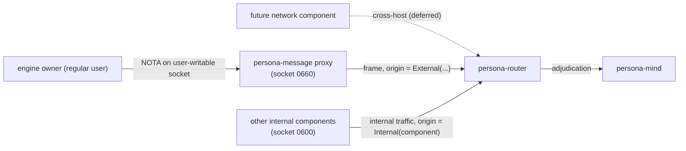
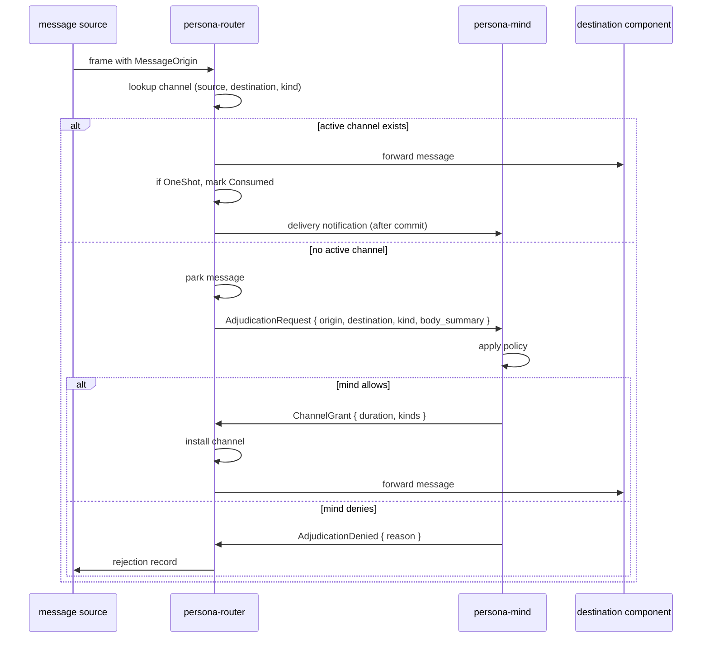
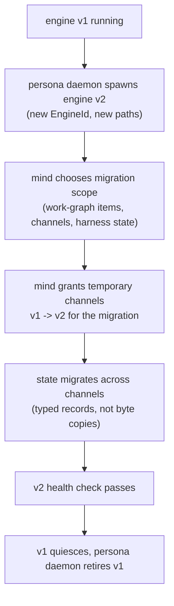

# 125 — Channel choreography and the trust model

*Designer decision record, settled with Li 2026-05-11.
Supersedes the per-component auth-gating that was scattered
across designer/116-121 with a simpler model: the kernel's
filesystem ACL is the engine boundary; routes inside the
engine are **choreographed by persona-mind**; the router
holds the live **authorized-channel state**. This report is
upstream of plans 116-123 — where they conflict with this,
this wins.*

---

## 0 · TL;DR

Four decisions settled in this turn.

1. **Trust comes from filesystem ACL on sockets.** Components
   run as the privileged `persona` system user. Internal
   sockets are mode `0600`, owned by `persona`; only
   processes running as `persona` (i.e., other engine
   components) can `connect()`. The exception is the
   persona-message socket — user-writable — which is the
   single boundary where untrusted input crosses in. There
   is **no in-band auth proof** inside the engine; the
   kernel admits or rejects on every `connect()` call.
2. **`ConnectionClass` is an origin tag, not a runtime
   gate.** Every message carries a typed `MessageOrigin`
   (audit/provenance). Components do not gate on it. Mind
   reads it as a policy input. The auth-context vocabulary
   (`ConnectionClass`, `MessageOrigin`, `OwnerIdentity`,
   `EngineId`) lives in a new contract crate
   `signal-persona-auth`.
3. **Routes are choreographed by persona-mind; the router
   enforces them.** The router holds a live
   **authorized-channel state**: which source can send
   which message kinds to which destination, and for how
   long. Messages on an active channel flow directly.
   Messages without a matching channel are forwarded to
   mind for adjudication. Mind decides: **deny**, **allow
   this one-off**, **open a permanent channel until
   retract**, or **open a time-bound channel**.
4. **Multi-engine is the upgrade substrate.** Persona
   daemon supports N engines per host. The engine upgrade
   path is: spawn engine v2 alongside engine v1; mind
   develops a route to migrate state; v1 retires when v2 is
   healthy. Component-level hot-swap (concurrent-write to
   the same redb) is rejected; engine-level upgrade
   replaces it.

The combined model: **persona daemon establishes the
engine's correctness once at setup (sockets, paths, perms);
the segregation of read/write permission keeps the engine
correct within itself; mind choreographs runtime policy
decisions; router enforces channel state; components inside
the engine trust each other because the filesystem ACL says
they're allowed to.**

---

## 1 · Trust model

### 1.1 Privileged-user, ACL-gated sockets

The `persona` daemon and every component spawned under it
run as the dedicated `persona` system user (not `root`, not
the operator's user; see designer/115 §3 for the
privileged-user position).

Every internal socket is created at spawn time with
permissions that admit only the `persona` user:

| Socket | Path | Mode | Owner |
|---|---|---|---|
| Engine manager | `/var/run/persona/persona.sock` | `0600` | `persona` |
| Per-engine mind | `/var/run/persona/<engine-id>/mind.sock` | `0600` | `persona` |
| Per-engine router | `/var/run/persona/<engine-id>/router.sock` | `0600` | `persona` |
| Per-engine system | `/var/run/persona/<engine-id>/system.sock` | `0600` | `persona` |
| Per-engine harness | `/var/run/persona/<engine-id>/harness.sock` | `0600` | `persona` |
| Per-engine terminal | `/var/run/persona/<engine-id>/terminal.sock` | `0600` | `persona` |
| **Per-engine message ingress** | `/var/run/persona/<engine-id>/message.sock` | **`0660`**, group = engine owner's group | `persona` |

The persona-message proxy socket is the **only** exception.
It's user-writable so the engine owner can submit messages
through the `message` CLI without elevation. Everything else
is privileged-only.

### 1.2 Why this is sufficient

The kernel enforces the ACL on every `connect()`. A process
running as the engine owner can `connect()` to the
persona-message socket but not to any other internal socket;
the kernel returns `EACCES` and the connection never
materialises. Counterfeit credentials are impossible because
the credential check happens before the bytes flow.

Inside the engine, every connected peer is *by definition*
either the `persona` daemon or another component running as
`persona`. The components are written to be correct (per
ESSENCE §"Beauty is the criterion" + all the workspace
discipline skills); they don't lie to each other because
they're built right. The trust is **security through
correctness within the privileged group + filesystem ACL at
the boundary**.

### 1.3 What this leaves to handle in-band

Two boundaries remain where in-band logic matters:

- **Persona-message socket.** The user (or any process with
  group access) can write here. Messages crossing this
  socket are stamped with `MessageOrigin::External(...)`
  reflecting the peer's identity from `SO_PEERCRED`. The
  proxy passes them through to the router; the router
  enforces channel policy against the origin.
- **Future network component** (out of scope today; named
  in this report only so future agents understand the
  shape). Cross-host traffic will enter through a dedicated
  network component which owns its own socket and applies
  whatever perimeter check is appropriate for that
  transport. Messages from across the network end up tagged
  `MessageOrigin::External(Network { ... })` before they
  reach the router.

Both of these become inputs to channel choreography (§3),
not separate auth layers.



---

## 2 · `ConnectionClass` and `MessageOrigin`

### 2.1 The two types

`ConnectionClass` (peer identity at a socket) and
`MessageOrigin` (origin of a message) are distinct:

```text
ConnectionClass (closed enum, minted from SO_PEERCRED at accept)
  | Owner                              -- peer Uid matches engine owner
  | NonOwnerUser(Uid)                  -- peer Uid does not match
  | System(SystemPrincipal)            -- privileged system principal
  | OtherPersona { engine_id, host }   -- cross-engine connection
  | Network(NetworkSource)             -- future: cross-host through network component

MessageOrigin (closed enum, stamped on each message)
  | Internal(ComponentName)            -- message between components in this engine
  | External(ConnectionClass)          -- message arriving from outside
```

A `ConnectionClass` describes a connection. A
`MessageOrigin` describes one message. Internal messages
(component-to-component within the engine) tag themselves
with the source component name for audit; external messages
(coming in through the persona-message proxy or the future
network component) tag themselves with the connection's
class.

### 2.2 Where these types live

A new contract crate **`signal-persona-auth`** (or
`persona-auth`; final name decided when the repo is
created) holds:

- `ConnectionClass`
- `MessageOrigin`
- `OwnerIdentity`
- `EngineId`, `RouteId`, `ChannelId`
- Auth-context records that ride alongside frames

Every domain contract (`signal-persona-message`,
`signal-persona-mind`, `signal-persona-system`,
`signal-persona-harness`, `signal-persona-terminal`,
`signal-persona`) depends on `signal-persona-auth`.
`signal-persona` (the engine-manager-management contract)
keeps its own narrow surface (engine catalog ops, component
lifecycle ops, route catalog ops); it no longer owns
`ConnectionClass`.

This honours the kernel-extraction trigger from
`skills/contract-repo.md` §"Kernel extraction trigger" —
the migration trigger fired the moment six contract
domains needed the same type.

### 2.3 What origin tags are for

Origin is **not a gate**. The router does not reject a
message because of its origin. The router uses origin as
the **key into the authorized-channel state** (§3).

Origin tags survive in every commit, every event log,
every durable record. They are how:

- mind decides whether to absorb a work-graph mutation
  as an `OwnerClaim` or a `ThirdPartySuggestion` (a
  persona-mind concern, per plan 117);
- harness decides whether to project full or redacted
  identity (a persona-harness concern, per plan 120);
- audit queries can ask "what came from outside the
  trusted federation in the last hour";
- future debugging knows which side of the boundary a
  message came from.

The discipline: **origin is provenance, not authority.**
Authority comes from channel state.

---

## 3 · Channel choreography

### 3.1 The channel record

A channel is a typed declaration that messages of named
kinds may flow from a source to a destination:

```text
Channel
  | id:            ChannelId
  | source:        ChannelEndpoint
  | destination:   ChannelEndpoint
  | kinds:         Set<MessageKind>
  | duration:      ChannelDuration
  | granted_by:    GrantSource
  | granted_at:    Timestamp
  | status:        ChannelStatus

ChannelEndpoint (closed enum)
  | Internal(ComponentName)            -- a specific component in this engine
  | External(ConnectionClass)          -- a class of external caller
                                          (Owner, NonOwnerUser(uid), etc.)

ChannelDuration (closed enum)
  | OneShot                            -- exactly one message; auto-revoke after
  | Permanent                          -- open until explicitly retracted
  | TimeBound { until: Timestamp }     -- open until the wall-clock deadline

ChannelStatus (closed enum)
  | Active
  | Expired                            -- TimeBound deadline passed
  | Retracted { at: Timestamp, by: GrantSource }
  | Consumed                           -- OneShot used

GrantSource (closed enum)
  | Mind                               -- granted by the choreography path
  | EngineSetup                        -- pre-installed at engine creation
                                          (default channels for component-to-component
                                          traffic the federation can't work without)
```

The router keeps the live set of channels in its own
sema-db, keyed by `(source, destination, kind)`. Multiple
channels may exist for the same triple (e.g., a `Permanent`
plus a `TimeBound` granted for an exception).

### 3.2 Default channels (pre-installed at engine setup)

The federation cannot function if every internal channel
has to be choreographed at runtime. The engine setup
phase pre-installs the channels the federation needs to
operate at all:

| Source | Destination | Kinds | Duration | Why |
|---|---|---|---|---|
| `Internal(MessageProxy)` | `Internal(Router)` | message submission, inbox query | `Permanent` (engine setup) | message proxy delivers user submissions |
| `Internal(System)` | `Internal(Router)` | focus observations, prompt-buffer observations | `Permanent` | router needs system push observations |
| `Internal(Router)` | `Internal(Harness)` | message delivery | `Permanent` | router delivers to harness |
| `Internal(Harness)` | `Internal(Terminal)` | terminal input, capture, resize | `Permanent` | harness writes to terminal |
| `Internal(Terminal)` | `Internal(Harness)` | transcript events | `Permanent` | terminal pushes transcripts |
| `Internal(Router)` | `Internal(Mind)` | adjudication request, delivery notification | `Permanent` | router consults mind, reports |
| `Internal(Mind)` | `Internal(Router)` | channel grant/extend/retract | `Permanent` | mind choreographs |
| `External(Owner)` | `Internal(Router)` | message submission via proxy | `Permanent` | owner can always submit |

These are the federation's structural channels. They live in
the router's sema-db from the moment the engine is created.
Other channels — third-party suggestions, cross-engine
traffic, time-limited exceptions — are choreographed by mind
at runtime (§3.4).

### 3.3 The enforcement flow



The router never decides allow/deny on its own beyond
"channel exists / channel does not exist." When the answer
is "does not exist," it parks the message and asks mind.

### 3.4 Mind's choreography ops

Mind exposes (via `signal-persona-mind` extensions) a closed
set of channel choreography requests. Mind issues these
either reactively (in response to an `AdjudicationRequest`
from router) or proactively (operator says "open a permanent
channel for X").

| Op | Effect |
|---|---|
| `ChannelGrant { source, destination, kinds, duration }` | Install a new active channel. |
| `ChannelExtend { channel_id, new_duration }` | Adjust a `TimeBound` channel's deadline or convert to `Permanent`. |
| `ChannelRetract { channel_id, reason }` | Mark a channel `Retracted`; subsequent messages on the triple force re-adjudication. |
| `ChannelList { filter? }` | Read-only enumeration for inspection/audit. |
| `AdjudicationDeny { request_id, reason }` | Reject a pending adjudication; router emits the rejection to source. |

Mind's policy for deciding what to do with an
`AdjudicationRequest` is a persona-mind concern (plan 117
covers the work-graph and event-log shape). The
choreography contract names *what mind can say*; the policy
itself is mind-internal.

### 3.5 Cross-engine choreography

When engine A wants to talk to engine B, the model
generalises. The persona daemon mediates the socket
plumbing at engine setup time — engine A's mind has access
to engine B's persona-message proxy socket (if granted) or a
dedicated cross-engine socket (path TBD). Messages cross
that socket with `MessageOrigin::External(OtherPersona {
engine_id })`. Engine B's router sees the origin, looks up
its channel state, and follows the §3.3 flow — including
asking engine B's mind to adjudicate unknown sources.

The engine-route catalog from designer/115 §7 collapses
into this: an `EngineRoute` is **just a channel** with
`source = External(OtherPersona { engine_id })`. The
multi-engine work doesn't need a separate route mechanism —
the channel choreography handles it. (Multi-engine
implementation is still minimal-mode today; see §4.)

---

## 4 · Multi-engine as upgrade substrate

### 4.1 The shape

Persona daemon supports N engine instances per host
(designer/115 §4). Engines are isolated: separate redb
files, separate sockets, separate state directories. The
daemon mints `EngineId` for each, scopes paths under
`/var/lib/persona/<engine-id>/` and
`/var/run/persona/<engine-id>/`, and supervises the
component federation per engine.

### 4.2 Upgrade flow

Engine-level upgrade replaces component-level hot-swap:



The upgrade is **typed migration over channels**, not a
filesystem copy. Mind decides what migrates (the work-graph
content; channel state; harness identity records). The
router moves typed records across temporary channels mind
opened for the migration. When v2's health checks pass
(per designer/115 §8 health monitoring), mind retracts the
migration channels, persona daemon sends `EngineShutdown
(mode Graceful)` to v1.

### 4.3 Why this is better than component-level hot-swap

The original hot-swap design (plan 116 §7) had v2 of a
single component opening the same redb file as v1 while
both were running. redb's single-writer-per-file semantics
forbid that. Engine-level upgrade sidesteps the problem
entirely: each engine has its own redbs; concurrent writes
to the same file never happen; the migration is an explicit
typed transfer, not a shared-state handoff.

### 4.4 Today's scope: multi-engine minimal

Implementation today:

- `EngineId` baked into every state directory, socket path,
  and manager-catalog record.
- Persona daemon can spawn a second engine on demand.
- The `EngineRoute` / cross-engine channel choreography is
  **not yet implemented** — mind's grant ops cover internal
  channels first.
- The upgrade flow lands once mind's choreography ops are
  real and a second engine has been demonstrated alive.

Per skills/micro-components.md, the path-level baking is
free; deferring the route ops costs nothing.

---

## 5 · What this supersedes in plans 116-123

| Plan | Section | What it said | What replaces it |
|---|---|---|---|
| 116 | §10 ConnectionAcceptor as runtime acceptor | Persona daemon accepts every connection, mints class, hands stream to component | **Removed.** Each daemon accepts its own socket. Persona daemon's role at the boundary is socket setup (path, owner, mode) at spawn time. |
| 116 | §7 hot-swap (component-level) | Detailed mechanism with same-redb concurrent write | **Removed.** Engine-level upgrade (§4 here) is the upgrade mechanism. |
| 116 | §3, §6 supervision actors | Same | Stays. `EngineCatalog`, `EngineSupervisor`, `ComponentSupervisor` topology is correct. |
| 117 | §3 channel choreography ops | Implicit; not designed | **New section.** Mind owns `ChannelGrant`/`Extend`/`Retract`, the adjudication flow, the choreography record types. Add to `signal-persona-mind`. |
| 117 | §8 ConnectionClass audit context | One of several class consumers | **Stays, promoted.** Mind is now the primary policy seam. `ThirdPartySuggestion` records consume `MessageOrigin`. |
| 117 | (new) | — | Owner-approval inbox (was in router) moves to mind. |
| 118 | §7 class-aware delivery decision tree | Gate by class | **Replaced.** Router holds the channel table (§3 here); messages on an active channel deliver; missing channels forward to mind. |
| 118 | OwnerApprovalInbox table | Router-owned | **Removed from router.** Mind owns the inbox. Router only holds channel state. |
| 118 | (new) | — | `channels` sema-db table (one per channel record); `adjudication_pending` table (parked messages awaiting mind). |
| 119 | §9 class-aware gate (privileged actions) | Per-component check on `System(persona)` | **Removed.** Privileged actions are reachable only via the privileged socket (mode `0600`); filesystem ACL is the gate. Class tags survive on records for audit. |
| 120 | §11 class-aware identity projection | Per-component redaction by class | **Stays as a *projection* surface**, not a gate. Identity records can still be redacted by class on the read path (for audit replay, future external query). The decision to project is made at query time based on the requesting connection's class; harness doesn't do its own auth. |
| 121 | §8 class-aware input gate | Drop non-Owner injections | **Removed.** Non-Owner injections can't reach the terminal supervisor socket (mode `0600`); the kernel rejects them. Class tags survive on accepted-input records. |
| All component plans | per-component class gating | Various | **Removed.** Inside the engine, every connection is privileged; segregation of read/write paths in each component's actor topology is what keeps them honest. |

The component plans 117-123 stay largely intact for their
core substance (Sema schemas, actor topologies, contract
surfaces). Only the per-component auth gating goes.

---

## 6 · Resolved (2026-05-11)

All seven deferred items are settled. Details in
`~/primary/reports/designer/127-decisions-resolved-2026-05-11.md`;
brief summary here:

| # | Item | Resolution |
|---|---|---|
| D1 | Input-buffer / prompt-cleanliness producer | **Mechanism replaces observation.** Persona-terminal locks the terminal-cell input gate, caches human keystrokes during the lock, checks prompt cleanliness, injects if clean, releases the gate so the cache replays. Focus becomes irrelevant; persona-system pauses (§4 of 127). |
| D2 | Typed-Nexus body migration | **Not needed.** `MessageBody(String)` stays as the freeform body shape. Typing grows through `MessageKind` variant evolution — additive schema bumps, not body migration. |
| D3 | Contract relation broadening | **Skill edit.** A contract crate is the typed-vocabulary bucket for one component's wire surface; multiple relations within one component are fine. `skills/contract-repo.md` §"Contracts name relations" gets the framing change. |
| D4 | Transcript fanout default | **Typed observations + sequence pointers** to router/mind. Raw transcript bytes stay in terminal storage; direct access reserved for the future transcript-inspection agent (§5 of 127). |
| D5 | `ForceFocus` rename | **Moot.** Force-focus deferred along with persona-system. |
| D6 | `HarnessKind::Other` | **Close the enum.** No `Other` variant. New harness types are coordinated schema bumps. |
| D7 | terminal-cell push form | **Subsumed by larger refactor.** terminal-cell speaks `signal-persona-terminal` directly (§2 of 127); the push form for worker lifecycle is part of the signal integration, not a separate add. |

Implementation impact carried into the active BEADS track set
(`primary-2y5` daemon scaffold, `primary-hj4` mind, `primary-8n8`
terminal supervisor + gate-and-cache, `primary-es9` harness,
`primary-devn` first-stack supervision witness): persona-system
deferred per /127 §3; the terminal supervisor track expanded
with the gate-and-cache mechanism; terminal-cell signal
integration coupled with the supervisor track.

---

## 7 · Constraints (architectural-truth test seeds)

For the implementation tracks (now tracked as BEADS items —
`primary-2y5` daemon socket/manager scaffold, `primary-hj4`
mind choreography, `primary-8n8` terminal supervisor + gate,
`primary-es9` harness, `primary-devn` first-stack supervision
witness), the following constraints should each land a witness
test in the appropriate component:

1. Every internal socket is created with mode `0600` and owner `persona`
   (filesystem witness; can be checked by a startup assertion or a
   stateful Nix witness).
2. The persona-message socket is created with mode `0660` and group
   matching the engine owner's group.
3. The persona daemon runs as the `persona` user (process-table
   witness).
4. `MessageOrigin` is stamped on every router-accepted message before
   commit (router actor-trace witness).
5. The router never delivers a message on an inactive channel
   (negative actor-trace witness: with an empty channel table,
   `DeliverToHarness` never fires for any message).
6. The router parks unknown-channel messages and emits
   `AdjudicationRequest` (positive actor-trace witness).
7. Mind's `ChannelGrant` installs a channel into the router's sema-db
   table before the parked message delivers (Nix-chained witness:
   writer derivation grants, reader derivation opens router redb,
   asserts channel row).
8. `OneShot` channels mark `Consumed` after delivery (router-state
   witness).
9. `TimeBound` channels with `until` in the past don't pass the
   active-channel check (clock-paused witness).
10. `ChannelRetract` writes `Retracted` to the channel row before
    subsequent messages re-adjudicate (Nix-chained witness).
11. Engine setup pre-installs the structural channels from §3.2
    (engine-creation witness: after persona daemon creates an engine,
    the router's channel table contains the structural channels).
12. Engine v2 upgrade flow uses typed migration over channels, not
    filesystem copy of v1's redb (Nix-chained witness: spawn v1,
    populate state, spawn v2, run migration, assert v2's redb is a
    fresh file with migrated typed records).

---

## See Also

- `~/primary/ESSENCE.md` §"Infrastructure mints identity,
  time, and sender" — the apex principle this report
  enforces: origin is infrastructure-supplied.
- `~/primary/reports/designer/115-persona-engine-manager-architecture.md`
  — the engine-manager framing this report builds on. §3
  (privileged-user), §4 (multi-engine), §6 (ConnectionClass),
  §7 (EngineRoute) are still load-bearing; this report
  refines the auth/route layer.
- The per-component development plans designer/116-/124 that
  preceded this report — all retired per
  `~/primary/reports/designer/128-designer-report-status-after-127.md`
  (subsequently deleted in /147 cleanup) — had auth-gating
  sections this report superseded per §5. Their live substance
  now lives in the active BEADS tracks named in §7.
- `~/primary/reports/designer-assistant/15-architecture-implementation-drift-audit.md`
  — drift audit; the persona-message retirement work is
  also a precondition for the §3.2 default-channel setup.
- `~/primary/reports/designer-assistant/16-new-designer-documents-analysis.md`
  — designer-assistant's critique that surfaced the four
  shared-decision questions; this report settles items
  ConnectionClass home, socket boundary, redb writer
  (implicit in §3 — router owns the channel table; mind
  owns the choreography records), and `OtherPersona`
  preservation (carried as `MessageOrigin::External(OtherPersona
  ...)` forever).
- `~/primary/skills/contract-repo.md` §"Kernel extraction
  trigger" — the rule that motivates the new
  `signal-persona-auth` crate.
- `~/primary/skills/push-not-pull.md` — channel
  choreography is push-shaped: router subscribes to mind's
  choreography events; mind subscribes to router's
  adjudication requests.
- `~/primary/skills/architectural-truth-tests.md` — every
  constraint in §7 wants a named witness.
