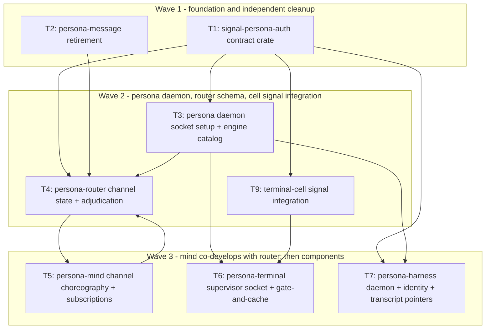

# 126 — Implementation tracks, operator hand-off

*Designer hand-off for the operator role. Eight tracks
ready to claim, written against the channel-choreography
decisions in designer/125 and the component development
plans in designer/116-123. Each track names: scope, files,
witnesses, dependencies. Suggested order in §10.*

---

## 0 · TL;DR

Eight implementation tracks, derived from the channel-choreography
decisions settled in designer/125 (trust model: filesystem ACL +
privileged user; ConnectionClass as origin tag; router holds the
authorized-channel state; mind choreographs grants; multi-engine as
upgrade substrate). Updated 2026-05-11 per designer/127: T8
deferred (persona-system pauses); T6 expanded with the
gate-and-cache injection mechanism; T9 added for terminal-cell
signal integration.

| # | Track | Scope | Blocks |
|---|---|---|---|
| T1 | **`signal-persona-auth` contract crate** | New repo. Foundation auth-context vocabulary. | Everything else. |
| T2 | **persona-message: retire stale paths** | Plan 122. Delete WezTerm/local ledger code; the proxy stays a stateless NOTA-to-Signal converter. Independent of T1. | Plan 118 lockfile cleanup. |
| T3 | **persona daemon: socket setup + privileged-user mode** | Plan 116 (revised per designer/125 §5). Spawn-time socket creation with correct mode and owner; engine catalog; engine creation/shutdown ops; EngineId-scoped paths. No runtime ConnectionAcceptor. | T4, T5, T6. |
| T4 | **persona-router: channel state + adjudication** | Plan 118 (revised per designer/125 §5). Router-owned sema-db `channels` and `adjudication_pending` tables; channel-state lookup; forward-to-mind for unknown channels; structural-channel preinstall at engine setup. | T5 channel-grant flow. |
| T5 | **persona-mind: channel choreography + suggestion adoption** | Plan 117 (revised per designer/125 §3.4). `ChannelGrant`/`Extend`/`Retract` ops; `AdjudicationRequest` consumer; subscription primitive; `ThirdPartySuggestion` records. | (None — leaf in this graph.) |
| T6 | **persona-terminal: supervisor socket + delivery state + gate mechanism** | Plan 121 minus the class gate. Supervisor socket per engine; delivery_attempts / terminal_events / viewer_attachments / session_health / session_archive sema-db tables; commit-before-effect. **Plus the gate-and-cache injection mechanism per designer/127 §1** (acquire-gate / read-prompt-state / write-injection / release-gate with cache replay). Co-evolves with T9 (the contract surface). | (None — runs alongside T4/T5.) |
| T7 | **persona-harness: daemon + identity + transcript pointers** | Plan 120 minus the class gate; transcript-fanout default = typed observations + sequence pointers (per designer/125 §6 D4, applied pre-emptively as the safe default). **`HarnessKind` closes** (drop `Other` variant) per designer/127 §4.5. | (None.) |
| T8 | **persona-system: focus subscription + privileged actions** | **DEFERRED** per designer/127 §3. The gate-and-cache mechanism in T6 dissolves the injection-time need for focus observation. Plan 119 stays as a design record; not part of the current wave. Returns when a real consumer surfaces (window-aware notifications, multi-engine UI coordination, etc.). | — |
| T9 | **terminal-cell signal integration** | Per designer/127 §2. terminal-cell's socket protocol becomes `signal-persona-terminal` Signal frames; subscription primitive for worker lifecycle lands as part of the integration (not a separate "optional push form"); the contract surface grows to include the gate/prompt/injection vocabulary T6 needs. | T6 (the contract surface). |

The order in §10 is the dependency wave diagram (updated:
T9 sits between T1 and T6; T8 removed from the active
graph).

---

## 1 · Track T1 — `signal-persona-auth` contract crate

**Scope.** Create a new contract repository at
`/git/github.com/LiGoldragon/signal-persona-auth` holding the
auth-context vocabulary every domain contract needs.

**Files to create.**

```
signal-persona-auth/
├── Cargo.toml
├── flake.nix              -- standard crane + fenix layout
├── ARCHITECTURE.md
├── AGENTS.md              -- shim, points at workspace AGENTS.md
├── README.md
├── src/
│   ├── lib.rs             -- exports + signal_channel! if any
│   ├── identity.rs        -- ConnectionClass, MessageOrigin, OwnerIdentity, Uid, SystemPrincipal
│   ├── engine.rs          -- EngineId, RouteId, ChannelId
│   └── error.rs           -- typed Error enum
└── tests/
    ├── round_trip.rs      -- rkyv round-trip per variant
    └── version.rs         -- signal-core version compatibility
```

**Records owned.** Per designer/125 §2.1, §3.1:

- `ConnectionClass` (closed enum, 5 variants).
- `MessageOrigin` (closed enum: `Internal(ComponentName)` |
  `External(ConnectionClass)`).
- `OwnerIdentity`, `Uid`, `SystemPrincipal`.
- `EngineId`, `RouteId`, `ChannelId`.
- `ComponentName` (closed enum: `Mind` | `Router` | `System`
  | `Harness` | `Terminal` | `MessageProxy`).

**No `AuthProof` record.** The local trust boundary is the
kernel's filesystem ACL on the socket (per designer/125 §1);
there is no in-band cryptographic verification at
engine-internal sockets. `MessageOrigin` suffices for
audit/provenance. If cross-host Persona ever needs signed
assertions, that lands as a separate type
(e.g. `SignedRouteAssertion`) at that time; do not
pre-create the surface here.

**Records moved out of `signal-persona`.** Move
`ConnectionClass`, `OwnerIdentity`, `EngineId`, `RouteId`
out of `signal-persona/src/identity.rs` and
`src/catalog.rs`; have `signal-persona` re-export from
`signal-persona-auth` for backward compatibility during
migration; eventually drop the re-exports.

**Witnesses.**

- W1: every variant of `ConnectionClass` round-trips through rkyv.
- W2: every variant of `MessageOrigin` round-trips.
- W3: `MessageOrigin::Internal(ComponentName)` covers all six component names.
- W4: rejection variants are closed enums (no `Unknown`).
- W5: `signal-persona-auth` has no runtime dependency (no tokio, no kameo, no nix bindings) — per skills/contract-repo.md "Common mistakes" table.
- W6: `signal-core` version-compatibility witness.

**Dependencies.** Depends on `signal-core` only.

**References.** designer/125 §2; skills/contract-repo.md
§"Kernel extraction trigger".

**Effort estimate.** Small. A few hundred lines of typed records + tests.

**Bead to file.** `role:operator` — *T1 create
signal-persona-auth contract crate per designer/125 §2 +
designer/126 §1*.

---

## 2 · Track T2 — persona-message: retire stale paths

**Scope.** Plan 122. Land the stateless one-shot proxy
destination. Delete the WezTerm/local-ledger code that the
audit P1 flagged. This track is independent of T1 (uses
existing `signal-persona-message` types) so it can run in
parallel.

**Files to delete or rename `legacy-*`.**

- `/git/github.com/LiGoldragon/persona-message/src/delivery.rs` (`persona_wezterm::pty` import + `EndpointKind::WezTermPane`).
- `/git/github.com/LiGoldragon/persona-message/src/store.rs` (`messages.nota.log` + the `thread::sleep` polling tail).
- `/git/github.com/LiGoldragon/persona-message/src/daemon.rs` and `src/bin/message-daemon.rs` (the transitional daemon).
- `/git/github.com/LiGoldragon/persona-message/src/actors/` (the DaemonRoot+Ledger actor planes).
- `/git/github.com/LiGoldragon/persona-message/scripts/setup-pty-*`, `scripts/test-pty-*`, `scripts/pty-send`, `scripts/setup-harnesses` (the WezTerm-shaped paths). Rename to `legacy-*` or delete.

**Files to keep / rewrite.**

- `src/main.rs` — CLI entry stays.
- `src/command.rs` — argv decode stays.
- `src/resolver.rs` — process-ancestry caller resolution stays (becomes the `MessageOrigin::External(ConnectionClass::Owner)` source for messages from the engine owner).
- `src/router.rs` — Signal-frame router proxy stays.
- `src/schema.rs` — remove `EndpointKind::WezTermPane`.

**Cargo.toml.** Remove `persona-wezterm` dependency.

**Witnesses.** Per plan 122 §10:

- W7: `message_cli_cannot_write_to_messages_nota_log_when_router_socket_is_set` — runs the proxy with `PERSONA_MESSAGE_ROUTER_SOCKET`; asserts no `messages.nota.log` file is created.
- W8: `persona_wezterm_scripts_absent_from_new_test_path` — Nix-chained source scan over `scripts/` and `tests/` rejects `wezterm`, `WezTerm`, `persona-wezterm` matches.
- W9: `message_cli_accepts_exactly_one_nota_record_and_prints_one_nota_reply` — CLI smoke witness.
- W10: `message_cli_carries_no_sender_in_payload` — origin via auth, not payload.

**Dependencies.** None for the retirement work itself. Coordinate
with T3 (the proxy will eventually use the new `MessageOrigin`
type from `signal-persona-auth` — but that's a follow-up; the
proxy works on existing `signal-persona-message` types today).

**Follow-up after T2 lands.** Bump `persona-router`'s pin of
`persona-message` to the post-retirement revision and run
`cargo update -p persona-message --precise <rev>` to clear the
`persona-wezterm` entries from `persona-router/Cargo.lock:458,510,512`.
Add a `cargo metadata` witness `router_lock_does_not_carry_persona_wezterm`
to T4.

**References.** Plan 122 §3, §6, §10; designer/124 §6 wave 1;
designer-assistant/15 P1; bead `primary-2w6`.

**Bead to file.** `role:operator` — *T2 persona-message
retirement per plan 122 + designer/124 §6*. (Likely the
existing `primary-2w6` bead is the right home — claim it.)

---

## 3 · Track T3 — persona daemon: socket setup + privileged-user mode

**Scope.** Plan 116 with the channel-choreography revisions
per designer/125 §5. Land the persona daemon as a real
binary that:

- runs as the `persona` user;
- maintains the engine catalog in a manager-level redb (`/var/lib/persona/manager.redb`);
- accepts engine catalog ops (`EngineList`, `EngineCreate`, `EngineShutdown`, `EngineStart`) via the persona socket;
- on `EngineCreate`, generates a new `EngineId` and sets up the engine: creates `/var/lib/persona/<engine-id>/`, creates `/var/run/persona/<engine-id>/`, spawns each component with the right env vars (per plan 116 §5 spawn lifecycle), and creates each component's socket at the right path with the right mode and owner;
- supervises components via Kameo `RestartPolicy::Permanent` (per skills/kameo.md);
- on `EngineShutdown`, signals components in reverse dependency order.

**What's NOT in this track (per designer/125 §5).**

- No runtime `ConnectionAcceptor`. The persona daemon's socket-boundary role is socket *creation* (perms + owner), not runtime acceptance.
- No detailed component-level hot-swap. Engine-level upgrade lands in a later track (after T1-T9; see §9 below).

**Files to create / land.**

- `/git/github.com/LiGoldragon/persona/src/main.rs` — daemon entry.
- `/git/github.com/LiGoldragon/persona/src/actors/root.rs` — PersonaRoot.
- `/git/github.com/LiGoldragon/persona/src/actors/engine_catalog.rs` — EngineCatalog (sole writer of manager.redb).
- `/git/github.com/LiGoldragon/persona/src/actors/engine_supervisor.rs` — per-engine supervision.
- `/git/github.com/LiGoldragon/persona/src/actors/component_launcher.rs` — fork+exec with `SpawnEnvelope` env-var contract.
- `/git/github.com/LiGoldragon/persona/src/spawn.rs` — `SpawnEnvelope` record + socket-creation logic.
- `/git/github.com/LiGoldragon/persona/src/cli.rs` — `persona` thin client (one NOTA in, one NOTA out).
- `/git/github.com/LiGoldragon/persona/src/tables.rs` — manager.redb schema (engines, engine_owners, component_states, meta).

**Witnesses.**

- W11: persona daemon runs as `persona` user (process-table witness).
- W12: engine creation writes scoped paths under `/var/lib/persona/<engine-id>/` and `/var/run/persona/<engine-id>/`.
- W13: every internal component socket is mode `0600`, owned by `persona`.
- W14: the persona-message socket is mode `0660`.
- W15: component spawn passes peer socket paths via env vars (no filesystem scanning) — Nix-chained witness inspecting `/proc/<pid>/environ`.
- W16: `EngineCatalog` is the sole writer of `manager.redb` — cargo-metadata + source-scan witness.
- W17: graceful engine shutdown stops components in reverse dependency order (terminal → harness → system → router → mind → message-proxy) — actor-trace witness.
- W18: persona CLI accepts exactly one NOTA record and prints one NOTA reply.

**Dependencies.** T1 (`signal-persona-auth` for `EngineId`, `OwnerIdentity`, `ComponentName`).

**References.** Plan 116 (revised per designer/125 §5); designer/115 §3, §4, §8; skills/kameo.md §"Spawning", §"Supervision"; skills/rust-discipline.md §"CLIs are daemon clients".

**Bead to file.** `role:operator` — *T3 persona daemon socket setup + engine catalog per plan 116 + designer/125*.

---

## 4 · Track T4 — persona-router: channel state + adjudication

**Scope.** Plan 118 with channel choreography per designer/125 §3. Land the router as:

- Kameo `RouterRuntime` + `RouterRoot` (already exist; keep).
- Router-owned sema-db with channel table (per designer/125 §3.1).
- Engine-setup hook: when the engine boots, install the structural default channels (per designer/125 §3.2) into the channel table.
- `MessageOrigin`-stamped accept path: every incoming frame gets its origin stamped (from `SO_PEERCRED` on external sockets or from the source component on internal sockets).
- Channel-state lookup: on every incoming message, key into the channel table by `(source, destination, kind)`; if active channel exists, deliver; otherwise park and forward to mind.
- Adjudication consumer: receives `ChannelGrant` / `AdjudicationDeny` from mind; updates channel table; releases parked messages.

**Files to land.**

- `/git/github.com/LiGoldragon/persona-router/src/channels.rs` — channel table actor (sole writer of channels.redb).
- `/git/github.com/LiGoldragon/persona-router/src/adjudication.rs` — parked-message state + adjudication request/response handling.
- Extend `/git/github.com/LiGoldragon/persona-router/src/router.rs` with the channel-state lookup path.
- Extend `/git/github.com/LiGoldragon/persona-router/src/tables.rs` (or create it) with the `channels` and `adjudication_pending` sema-db tables.
- Update `/git/github.com/LiGoldragon/persona-router/src/harness_registry.rs` and `harness_delivery.rs` to consume `MessageOrigin` from the auth context, not from payload.

**Sema-db tables.**

| Table | Key | Value | Owner |
|---|---|---|---|
| `channels` | `ChannelId` | `Channel` record (designer/125 §3.1) | router |
| `channels_by_triple` | `(ChannelSource, ChannelDestination, MessageKind)` | `Set<ChannelId>` (multiple channels per triple allowed) | router |
| `adjudication_pending` | `AdjudicationRequestId` | parked `Message` + origin + destination + kind | router |
| `delivery_attempts` | `(MessageSlot, AttemptSeq)` | typed delivery attempt record | router |
| `delivery_results` | `MessageSlot` | latest result | router |
| `meta` | schema version, store identity | | router |

**What's NOT in this track (per designer/125 §5).**

- No class-aware delivery decision tree.
- No `OwnerApprovalInbox` (moved to mind in T5).
- No per-message class gate beyond the channel-state lookup.

**Witnesses.**

- W19: `router_stamps_message_origin_on_every_accepted_frame` — actor-trace witness.
- W20: `router_does_not_deliver_on_inactive_channel` — empty channel table + DeliverToHarness never fires.
- W21: `router_parks_unknown_channel_message_and_emits_adjudication_request` — actor-trace.
- W22: `router_installs_structural_channels_at_engine_setup` — Nix-chained: spawn engine, open router redb, assert structural channels present.
- W23: `mind_channel_grant_installs_row_before_message_delivers` — Nix-chained writer/reader.
- W24: `oneshot_channel_marks_consumed_after_delivery` — router-state witness.
- W25: `timebound_channel_with_past_deadline_does_not_pass_active_check` — clock-paused witness.
- W26: `channel_retract_writes_retracted_status_before_re_adjudication` — Nix-chained.
- W27: `router_lock_does_not_carry_persona_wezterm` — cargo-metadata witness (runs after T2 lands).
- W28: `router_does_not_poll_on_a_timer` — cargo-metadata + source-scan.
- W29: `router_does_not_depend_on_persona_terminal` — cargo-metadata.

**Dependencies.** T1 (`signal-persona-auth`), T3 (engine setup pre-installs structural channels — but partial deps work: router can land its tables before T3 is fully functional). T5 channel-grant flow co-develops with T4.

**References.** Plan 118 (revised per designer/125 §5); designer/125 §3; skills/kameo.md §"Blocking-plane templates" for `HarnessDelivery` (Template 1).

**Bead to file.** `role:operator` — *T4 persona-router channel state + adjudication per designer/125 §3 + plan 118*.

---

## 5 · Track T5 — persona-mind: channel choreography + suggestion adoption

**Scope.** Plan 117 with channel choreography per designer/125 §3.4. Land mind as:

- Event log as the canonical substrate (mind owns the audit trail).
- `CommitBus` — after-commit fanout (NOT inside-transaction; per designer-assistant/16 §2.3).
- Channel choreography ops via `signal-persona-mind` extensions: `ChannelGrant`, `ChannelExtend`, `ChannelRetract`, `ChannelList`, `AdjudicationDeny`.
- `AdjudicationRequest` consumer: receives parked-message metadata from router; applies policy; replies with grant or deny.
- `ThirdPartySuggestion` records: non-Owner mutations are stored as suggestions; `AdoptSuggestion` / `RejectSuggestion` ops let the engine owner promote or discard.
- Owner-approval inbox: typed structure mind owns (moved from router per designer/125 §5).
- Subscription primitive (per skills/push-not-pull.md §"Subscription contract"): initial state on subscribe, then deltas.

**Files to extend.**

- `/git/github.com/LiGoldragon/persona-mind/src/actors/domain.rs` — add channel choreography path.
- `/git/github.com/LiGoldragon/persona-mind/src/actors/subscription.rs` — make it real (currently a placeholder per ARCH §3).
- `/git/github.com/LiGoldragon/persona-mind/src/tables.rs` — add channel-choreography event types + suggestion records to the sema-db schema.
- `/git/github.com/LiGoldragon/persona-mind/src/memory.rs` — extend reducer for suggestion adoption.
- `/git/github.com/LiGoldragon/signal-persona-mind/src/lib.rs` — add the channel choreography request/reply variants.

**Sema-db extensions.**

| Table | Purpose |
|---|---|
| `channel_events` | append-only event log of grant / extend / retract |
| `suggestions` | `ThirdPartySuggestion` records (id, source `MessageOrigin`, content, status) |
| `adjudication_log` | every `AdjudicationRequest` mind has seen + its decision |
| `owner_approval_inbox` | pending owner-approval items (queue of suggestions or message holds awaiting decision) |

**Contract additions to `signal-persona-mind`.**

| Variant | Direction | Purpose |
|---|---|---|
| `Subscribe(SubscriptionFilter)` | request | start a push subscription with initial state |
| `Unsubscribe(SubscriptionId)` | request | end subscription |
| `ChannelGrant { source, destination, kinds, duration }` | request (mind → mind, or operator → mind) | open a channel |
| `ChannelExtend { channel_id, new_duration }` | request | extend a TimeBound channel |
| `ChannelRetract { channel_id, reason }` | request | retract |
| `ChannelList { filter? }` | request | enumerate |
| `AdjudicationRequest { origin, destination, kind, body_summary }` | inbound from router | router parked a message |
| `AdjudicationDecision { decision }` | reply to router | grant or deny |
| `AdoptSuggestion { suggestion_id }` / `RejectSuggestion { suggestion_id }` | request | owner workflow |
| `ListSuggestions(filter?)` | request | read inbox |
| `StateChange(...)` | push to subscribers | deltas |

**Witnesses.**

- W30: `mind_subscribe_emits_initial_state_before_any_delta` — subscription contract witness per skills/push-not-pull.md.
- W31: `mind_commit_bus_fires_after_durable_commit` — actor-trace witness.
- W32: `mind_channel_grant_event_appended_before_router_observes_grant` — Nix-chained writer/reader (mind redb has the event row before router receives the grant).
- W33: `non_owner_message_origin_becomes_third_party_suggestion` — router pushes an adjudication request for a `NonOwnerUser` source; mind decisions write a `ThirdPartySuggestion` row instead of a direct mutation.
- W34: `adopt_suggestion_writes_canonical_record_only_after_adoption` — explicit adoption is required before the suggestion's content becomes a canonical work-graph state.
- W35: `mind_event_log_is_append_only` — source scan + sema-db schema witness.
- W36: `mind_redb_has_one_writer_actor` — actor topology witness.
- W37: `mind_subscribe_never_polls_for_initial_state` — initial state is one push, not Query + Subscribe.

**Dependencies.** T1 (`signal-persona-auth` for `MessageOrigin`). Co-develops with T4.

**References.** Plan 117 (revised per designer/125 §5); designer/125 §3.4; skills/push-not-pull.md §"Subscription contract"; designer-assistant/16 §2.3.

**Bead to file.** `role:operator` — *T5 persona-mind channel choreography + subscription primitive per designer/125 §3.4 + plan 117*.

---

## 6 · Track T6 — persona-terminal: supervisor socket + delivery state

**Scope.** Plan 121 (revised per designer/125 §5 and /127 §1). Land:

- One supervisor socket per engine (`/var/run/persona/<engine-id>/terminal.sock`, mode `0600`, owned by `persona`).
- Delivery state tables in sema-db (`delivery_attempts`, `terminal_events`, `viewer_attachments`, `session_health`, `session_archive`).
- **Gate-and-cache injection transaction** (per /127 §1): for each `TerminalInject` request from router or harness, persona-terminal calls `AcquireInputGate { reason, prompt_pattern_uid }` on the cell; if `prompt_state == Clean`, calls `WriteInjection`; releases the gate; terminal-cell's existing cache replays held human bytes. Dirty prompt → defer per the default policy (clean-then-inject is deferred per /127 §1.4).
- **Pattern registration**: persona-terminal pulls per-adapter `PromptPattern` records from persona-harness at session-create time, calls `RegisterPromptPattern` on the cell, stores the returned `PromptPatternId` keyed by harness identity.
- Subscription push of terminal events to harness/router (typed observations + sequence pointers; raw bytes stay in terminal-cell storage per /127 §3 D4).
- Session GC / archive policy.
- `persona-terminal-control` daemon-client CLI.

**What's NOT in this track (per designer/125 §5 + /127 §3).**

- No `ConnectionClass`-aware input gate. The supervisor socket is privileged-only; non-`persona` callers can't reach it via the filesystem ACL.
- No persona-system subscription for prompt-buffer state — terminal-cell does the prompt check using the registered pattern.

**Witnesses.** Plan 121's witnesses minus the class-gate ones (removed), plus the gate-and-cache witnesses from /127 §1.7 (`injection_cannot_write_to_pty_without_gate_lease`, `human_bytes_cached_during_locked_gate`, `cache_replays_in_original_order_on_release`, `dirty_prompt_state_defers_injection_by_default`, `prompt_pattern_is_registered_not_hardcoded`, `gate_acquired_carries_prompt_state_when_pattern_uid_supplied`), and the control/data plane witnesses from /127 §7.

**Dependencies.** T1 (`signal-persona-auth` for `MessageOrigin`), T9 (terminal-cell speaks the signal contract used here).

**References.** Plan 121 (with the supersession banner — read /127 §1 first), /127 §1.2-1.6 for the mechanism, operator-assistant/105 §3-4.

**Bead to file.** `role:operator` — *T6 persona-terminal supervisor socket + gate-and-cache transaction per plan 121 + /127 §1*.

---

## 7 · Track T7 — persona-harness: daemon + identity + transcript pointers

**Scope.** Plan 120 with two revisions:
- Per designer/125 §5: no per-component class gate. Visibility-class projection stays as a *read-path projection* (full identity for Owner queries, redacted for NonOwnerUser queries) — the projection is what the read path computes from the requesting connection's origin, not a runtime gate.
- Per designer/125 §6 D4 (applied pre-emptively as the safe default): harness pushes typed observations + sequence pointers to router and mind, not raw transcript bytes. Raw bytes stay in terminal-cell + persona-terminal storage; consumers request specific sequence ranges if they have an auth context that justifies it (future).

**Files to land.** Per plan 120 §5.

**Sema-db schema.** Per plan 120 §6:
- `harnesses` (HarnessId → typed record).
- `lifecycle_events` (append-only).
- `provider_observations` (parsed quota/usage).
- `transcript_pointers` (sequence ranges, not raw bytes).
- `meta`.

**Witnesses.** Per plan 120 §10, with:
- W (raw transcript fanout) removed.
- New: `harness_pushes_typed_observation_not_raw_transcript_to_router_and_mind`.
- New: `harness_transcript_pointer_resolves_through_terminal_storage` — Nix-chained witness that the pointer dereferences to bytes only via the terminal component.

**Dependencies.** T1, T6 (for transcript-pointer dereference path).

**References.** Plan 120 (revised per designer/125 §5 + §6 D4 default).

**Bead to file.** `role:operator` — *T7 persona-harness daemon + identity + transcript-pointer fanout per plan 120 (minus class gate; observations + pointers per designer/125 D4)*.

---

## 8 · Track T8 — persona-system: DEFERRED

**Status.** **DEFERRED** per designer/127 §3. The
gate-and-cache mechanism in T6 (per /127 §1) dissolves the
injection-time need for focus observation. Plan 119 stays
as a design record (with a status banner); not part of
this implementation wave. The `FocusTracker` Kameo actor
stays in code (it's real today); no new persona-system
substance grows until persona-system is unpaused.

When persona-system returns, the likely triggers are
window-aware notifications, multi-engine UI coordination,
or other concrete OS-level Persona needs.

**Do not file the T8 bead.**

---

## 9 · What's NOT in this hand-off

Two pieces of work are deliberately deferred to a later wave:

- **Persona-system implementation** (Track T8). Deferred
  per /127 §3 — the gate-and-cache mechanism in T6 covers
  the injection-safety use case; persona-system returns
  when a concrete OS-level Persona need surfaces.
- **Engine-level upgrade flow** (designer/125 §4). Lands
  as a follow-up track after T1-T9 are real and a second
  engine has been demonstrated alive. The substrate
  (`EngineId`-scoped paths, multi-engine support in
  persona daemon) lands in T3; the upgrade choreography
  lands later.

The seven decisions from designer/125 §6 are all
**resolved** per designer/127: input-buffer producer is
terminal (D1); no typed-Nexus body migration needed —
specificity grows through `MessageKind` variants (D2);
contract crates are shared-vocabulary buckets, one per
component, multiple relations allowed (D3); transcript
fanout default is typed observations + sequence pointers
(D4); `ForceFocus` deferred along with persona-system
(D5); `HarnessKind` enum is closed, no `Other` variant
(D6); terminal-cell speaks signal on the control plane,
data plane stays raw, push form for worker lifecycle is
required (D7).

---

## 10 · Order of work — the dependency wave



The T4 ↔ T5 loop is real — router parks messages and asks
mind; mind grants channels and tells router. They
co-develop; neither can finish without the other. T9 must
land before T6 (the supervisor socket consumes the new
signal-on-control-plane contract terminal-cell exposes).
T8 (persona-system) is deferred and not on the graph.

Suggested parallelism inside an operator session:

- **Single operator**: T1 → T2 (in parallel: T1 creates new repo; T2 retires code in an existing repo, no conflict) → T3 → T4 + T5 (co-develop, share commits across two repos) + T9 (independent of T4/T5) → T6 + T7 (parallel after T9 lands).
- **Operator + operator-assistant**: split T1/T2 in wave 1; one takes T3 and the other splits T4/T5/T9 in wave 2; split T6/T7 across both in wave 3.

---

## 11 · Beads to file

Suggested filings (each with `role:operator` label so they
appear on `bd ready --label role:operator`):

| ID hint | Title |
|---|---|
| T1 | `signal-persona-auth: create contract crate per designer/125 §2 + /127 §2.1 (no AuthProof; MessageOrigin suffices)` |
| T2 | (claim existing `primary-2w6`) — `persona-message: retire WezTerm + local ledger per plan 122 + designer/124 §6` |
| T3 | `persona daemon: socket setup + engine catalog + EngineId-scoped paths per plan 116 (revised per designer/125)` |
| T4 | `persona-router: channel state + adjudication tables + structural-channel preinstall per plan 118 (with status banner) + designer/125 §3` |
| T5 | `persona-mind: channel choreography ops + subscription primitive + suggestion adoption per plan 117 + designer/125 §3.4` |
| T6 | `persona-terminal: supervisor socket + gate-and-cache transaction per plan 121 (with status banner) + /127 §1` |
| T7 | `persona-harness: daemon + identity + transcript-pointer fanout per plan 120 (with status banner) + /127 §1 prompt-pattern publisher role` |
| T9 | `terminal-cell signal integration: control-plane signal-persona-terminal frames, data plane stays raw, worker lifecycle push form, prompt-pattern registry per /127 §2 and §1.6` |

T8 (persona-system) is deferred per /127 §3 — do not file.

Each bead's description should: (a) name the destination
files, (b) name the witnesses to land, (c) point at the
relevant plan section and designer/125 sections, (d) name
the dependencies.

---

## 12 · How an operator picks up a track

The discovery flow:

1. `bd ready --label role:operator` — see open tracks.
2. Pick one whose dependencies are landed (per §10).
3. Read the named designer reports: this report (§N for
   the track), the relevant plan (116-123), and
   designer/125 (the auth/channel decisions). Add
   designer-assistant/15 if a P1 finding is in scope.
4. Claim through orchestration: `tools/orchestrate claim
   operator '[<bead-id>]' <paths> -- <reason>`. Use
   `[<bead-id>]` to coordinate the task lock; use file
   paths to coordinate edits.
5. Work it through. Witnesses land alongside the
   implementation (per skills/architectural-truth-tests.md
   constraints-first discipline).
6. Per `skills/jj.md`, commit per logical step and push.
7. Close the bead with a closing note pointing at the
   commits / new files / witness names.
8. Release the lock.

For each track, the "witnesses" list in §1-§8 is the
acceptance criterion. A track is done when every witness
fires green via `nix flake check` (or the appropriate
stateful `nix run .#test-<name>`).

---

## See Also

- `~/primary/reports/designer/125-channel-choreography-and-trust-model.md`
  — the upstream decision record. Read first.
- `~/primary/reports/designer/116-persona-apex-development-plan.md`
  through `123-terminal-cell-development-plan.md` — the
  component plans this hand-off implements (with the
  auth-gating sections superseded per designer/125 §5).
- `~/primary/reports/designer-assistant/15-architecture-implementation-drift-audit.md`
  — drift audit; precondition for T2.
- `~/primary/reports/operator-assistant/105-persona-terminal-message-integration-review.md`
  — operator-assistant's concrete-gap inventory; the
  router-to-terminal stateful witness it names lives in
  T4 + T6 jointly.
- `~/primary/protocols/orchestration.md` — claim flow, role
  lock files, BEADS coordination.
- `~/primary/skills/beads.md` — how to claim / close /
  release a bead.
- `~/primary/skills/jj.md` — commit / push discipline.
- `~/primary/skills/kameo.md` — Kameo runtime; every actor
  in the plans uses it.
- `~/primary/skills/contract-repo.md` — wire-contract
  discipline; relevant for T1.
- `~/primary/skills/architectural-truth-tests.md` —
  witnesses are the acceptance criterion.
- `~/primary/skills/testing.md` — every witness lives in
  Nix.
- `~/primary/skills/rust-discipline.md` — Rust shape.
- `~/primary/skills/push-not-pull.md` — subscription
  contract (initial state then deltas).
