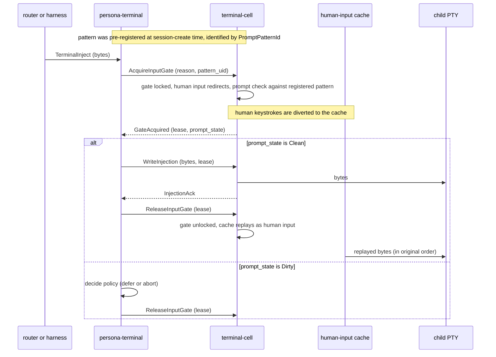

# 127 — Decisions resolved (2026-05-11)

*Designer record. The seven deferred items from
designer/125 §6 are settled. Two have substance worth a
section of their own: D1 (the terminal input-gate
mechanism) becomes a designed flow; D7 (terminal-cell
speaks signal) grows into a real integration reframe. The
other five are short notes. One future architecture move
is flagged for later: the transcript inspection agent.*

---

## 0 · TL;DR

Two substantive resolutions:

1. **Terminal input-gate mechanism handles injection without needing focus observation.** Persona injects safely by **locking the input gate, caching human keystrokes while locked, checking prompt cleanliness, then injecting**. After injection, the cache replays as human input through the same writer. Focus becomes irrelevant to the injection problem (the gate solves it locally). **Persona-system is paused** — we'll come back when other system needs surface, and focus will surely be one of them.

2. **`terminal-cell` speaks `signal-persona-terminal` directly.** It stops being a general abduco-shaped tool with its own bespoke socket protocol; it becomes a tightly integrated component of persona-terminal speaking the same signal-* wire vocabulary as the rest of the federation. **Open question**: whether terminal-cell remains its own repo or folds into persona-terminal's code — to consider when the refactor lands.

Five smaller resolutions:

- **D2** — `MessageBody(String)` is fine. Typing grows through `MessageKind` variant evolution, not body migration. No designer/127-typed-Nexus-body work; no schema-hardening block.
- **D3** — A contract crate IS a typed-vocabulary bucket for one component's wire surface. The "one relation per contract" framing in `skills/contract-repo.md` is wrong and gets edited.
- **D4** — Router and mind subscribe to **typed observations + sequence pointers**, not raw transcript bytes. Raw bytes route directly to the (future) transcript-inspection agent.
- **D5** — `ForceFocus` deferred along with persona-system.
- **D6** — `HarnessKind` is closed. No `Other` variant of any shape. Enums are closed; that's what enums are.

One future architecture move flagged: the **transcript inspection agent** — a persona-mind-resident agent role that reads transcripts directly (not through router; router is for messages, this is inspection). Section §5.

---

## 1 · The input-gate mechanism (D1)

### 1.1 The problem

When persona wants to inject a programmatic message into an
interactive terminal (an agent harness running in it), two
things could go wrong:

- **Interleaving with human typing.** If the human is mid-keystroke when injection happens, the bytes interleave and the resulting prompt is garbled.
- **Injecting into a non-empty prompt.** If the human has typed something not yet submitted, injection appends — the user's draft and the injected message become one combined input.

The original framing (vision 114, plan 119) had this as a
two-source problem: persona-system pushes focus observations
and prompt-buffer observations; router consults both before
injecting.

The mechanism below makes the focus part unnecessary.

### 1.2 The mechanism

Lock-and-check is one round-trip. The prompt pattern is
pre-registered with terminal-cell as configuration
(persona-terminal registers patterns at session-create
time); subsequent injections refer to a pattern by UID.
terminal-cell performs the cleanliness check **inside the
lock-acquisition step**, returning the gate lease and the
prompt-state together. No separate `ReadPromptState`
round-trip while holding the gate.



The collapsed shape is faster (2 round-trips total: gate-with-check then write-or-release) and keeps the check inside terminal-cell where the transcript buffer lives. The pattern is supplied at registration time, not on every injection.

### 1.3 What terminal-cell already has

Terminal-cell carries most of this today. From the
terminal-cell ARCH:

- `TerminalInputGate` — writer-side gate that arbitrates human and programmatic input.
- `TerminalInputGateLease` — typed lease proving human input is closed before a programmatic injection sequence.
- `TerminalInputGateRelease` — release record naming the lease and how many held human bytes were flushed when the gate reopened.
- "Blocked human bytes are either buffered in order or rejected with an explicit gate state" (ARCH §3).
- Witness `input_gate_holds_human_bytes_during_programmatic_injection` already exists.

So the gate, the lease/release pattern, and the buffering of
human bytes during injection are real. The mechanism above
builds on top of this.

### 1.4 What's new

Four pieces, with the load-bearing split: **terminal-cell
holds patterns by UID and runs literal matching; everything
that knows what a prompt *means* lives above it.**

| Piece | What it does | Where it lives |
|---|---|---|
| **`PromptPattern` typed record** | A small structured record describing how to recognize a clean prompt for a specific harness type and version. Closed enum of variants: `LiteralSuffix(bytes)` (terminal output must end in these exact bytes), `RegexSuffix(pattern_bytes)`, future variants as needed. Each pattern is identified by a `PromptPatternId` (UID). | Defined by persona-harness (which knows harness adapters) or persona-terminal session config. The pattern data is opaque to terminal-cell beyond match-or-no-match. |
| **Pattern registration** | persona-terminal registers patterns with terminal-cell at session-create time (or any time before first injection). terminal-cell stores `(PromptPatternId → PromptPattern)`. The set is mutable — `Unregister` retires patterns; new harnesses or new versions add new patterns. | terminal-cell holds the registry; persona-terminal owns the pattern data. |
| **In-cell prompt check** | When `AcquireInputGate` arrives with a `pattern_uid`, terminal-cell performs the literal match against its transcript buffer *during the lock-acquisition step*. The match result rides back with the gate-acquired reply. No additional round-trip. | terminal-cell — but only as a literal byte/regex match against the registered pattern. terminal-cell stays a primitive: it doesn't parse semantics, doesn't know what harness it's hosting, doesn't interpret slash commands. Per the user's framing: *"terminal-cell is kind of a dumb piece of software, so it would need to be told which pattern."* |
| **Decision policy** | Given `(PromptState, InjectionPolicy)`, persona-terminal decides: inject now, defer-and-retry, abort. The clean-then-inject path is deferred (§1.4 note below). | persona-terminal supervisor. |
| **Human-input cache replay** | While the gate is locked, terminal-cell buffers human bytes (this already exists per terminal-cell ARCH §3). On release, the cache replays into the writer in original order. No reordering, no merge with the injected bytes. | terminal-cell (existing buffer; persona-terminal-controlled release reopens it). |

The optional **clean-then-inject** path — clean a dirty
prompt by sending backspaces, save the chars, inject, then
replay the original chars before the cache — is **deferred**
per user direction. Backspace counts must match exactly,
multi-line edits and history-search prompts misbehave, and
the user's draft can include cursor-movement that's hard to
reconstruct. Default policy on dirty: defer.

### 1.5 What this replaces

| Was | Becomes |
|---|---|
| Router subscribes to `signal-persona-system` for `FocusObservation` + `InputBufferObservation`; joins both at the gate decision before deciding to inject. | Router (or harness) issues `TerminalInject`; persona-terminal handles the whole gate-and-cache flow locally; reports back `InjectionAck` or `InjectionDeferred`. Router never reads focus. |
| `InputBufferObservation` in `signal-persona-system`. | `PromptState` is an internal observation inside persona-terminal; it doesn't cross a federation contract boundary at all. |
| Plan 119's `InputBufferTracker` actor in persona-system. | Removed. Plan 119 (persona-system) deferred entirely; see §4. |
| Plan 121's class-aware input gate (already removed by designer/125 §5). | Stays removed. The gate is for non-interleaving, not for auth. |

### 1.6 Contract additions to `signal-persona-terminal`

Per the integration reframe in §2, terminal-cell speaks
this contract on its control plane. The variants the
mechanism needs split into two groups — pattern
registration (configuration; not per-injection) and gate
operations (per-injection).

**Pattern registration ops:**

| Request | Reply |
|---|---|
| `RegisterPromptPattern { pattern }` | `PromptPatternRegistered { uid }` \| `RegistrationRejected { reason }` |
| `UnregisterPromptPattern { uid }` | `PromptPatternUnregistered` \| `PromptPatternUnknown` |
| `ListPromptPatterns` | `PromptPatternList { entries }` (inspection / debug) |

**Gate and injection ops:**

| Request | Reply |
|---|---|
| `AcquireInputGate { reason, prompt_pattern_uid: Option<PromptPatternId> }` | `GateAcquired { lease, prompt_state: PromptState }` \| `GateBusy(current_holder)` |
| `ReleaseInputGate { lease }` | `GateReleased(release_record)` |
| `WriteInjection { lease, bytes }` | `InjectionAck { sequence }` \| `InjectionRejected { reason }` |

**Records:**

```text
PromptPatternId        -- typed newtype, terminal-cell-minted at registration

PromptPattern (closed enum)
  | LiteralSuffix(Vec<u8>)
  | RegexSuffix { pattern_bytes }
  -- future variants land here as schema bumps

PromptState (closed enum)
  | NotChecked              -- AcquireInputGate did not supply a pattern_uid
  | Clean                   -- transcript-buffer suffix matches the registered pattern, no trailing bytes
  | Dirty { trailing_count: BytesCount }
                            -- bytes after the pattern match, or no match at all
```

When `prompt_pattern_uid` is `None`, terminal-cell skips
the check and returns `NotChecked` — useful for cases where
the caller doesn't need a prompt guarantee (e.g.
out-of-band lifecycle signals where there's nothing to
inject in front of).

**Push events** terminal-cell emits over the control plane
subscription (per §2):

| Event | When |
|---|---|
| `InputGateHeld { lease }` | gate acquired (an out-of-band observer can see the lock; the holder gets the reply directly) |
| `InputGateReleased { release_record }` | gate released, with the cached-bytes count |
| `PromptPatternRegistered { uid }` | a new pattern registered (subscribers can re-key) |
| `PromptPatternUnregistered { uid }` | a pattern removed |
| `TerminalWorkerLifecycle { worker, transition }` | per the worker-lifecycle subscription (§2.2) |

### 1.7 Architectural-truth witnesses

The mechanism wants these witnesses (each in the standard
`x_cannot_happen_without_y` shape):

- `injection_cannot_write_to_pty_without_gate_lease` — no `WriteInjection` succeeds without a current lease.
- `human_bytes_cached_during_locked_gate` — keystrokes arriving while the gate is locked end up in the cache, not the PTY.
- `cache_replays_in_original_order_on_release` — sequence-preserved.
- `dirty_prompt_state_defers_injection` — default policy witness.
- `prompt_state_pattern_is_adapter_specific` — Codex pattern ≠ Pi pattern; the recognition records aren't hard-coded.

---

## 2 · `terminal-cell` as signal component (D7)

### 2.1 The reframe

Today's terminal-cell speaks a bespoke socket protocol
(`src/socket.rs` in the terminal-cell repo). It's a typed
request/reply protocol but not signal-frame-shaped — it
predates the federation's commitment to `signal-*` contracts
as the inter-component wire.

User's direction: **terminal-cell should talk signal.**
It's "our component more than a general tool." The
abduco-shaped general-purpose framing was an artifact of the
exploration; in the federation, it's just another Persona
component.

### 2.2 What the refactor entails

Three pieces, with a sharp split between **control plane**
(signal-framed) and **data plane** (raw bytes — stays raw):

| Piece | Change |
|---|---|
| **Wire protocol for the control plane** | terminal-cell's **control socket** (commands like `AcquireInputGate`, `ReadPromptState`, `WriteInjection`, plus push events for lifecycle, prompt-state, gate-held) accepts `signal-persona-terminal` Signal frames (length-prefixed rkyv) instead of its current bespoke request/reply records. The frame envelope, handshake, and auth proof come from `signal-core` like every other federation socket. |
| **Push subscription** | terminal-cell exposes a subscription primitive over the control socket for worker lifecycle events (the D7 "WorkerObservation push form" question). Persona-terminal subscribes at cell startup; receives initial state then deltas per `skills/push-not-pull.md`. This replaces the "optional until demand appears" framing in plan 123. |
| **Adapter contracts** | The `signal-persona-terminal` contract grows the variants from §1.6 (gate ops, prompt-state ops, injection ops, push events). Plan 121 (persona-terminal) and the new contract surface co-evolve. |

The data plane — the attached viewer ↔ child PTY raw byte
pump — does **not** change. §2.3 explains why.

### 2.3 Data plane stays raw (DA's D7 concern)

This is load-bearing. Designer-assistant flagged it in
their post-127 read: *"if it 'speaks Signal,' we still
need to protect the fast raw byte path. The witness has to
prove it still behaves like a real terminal and does not
reintroduce the input mangling problem we already
escaped."*

The failure mode terminal-cell was designed to escape (per
its ARCH §1) is: human keyboard latency through actor
mailboxes and application-level relay. The original abduco
shape exists because the previous relay design's hot path
"puts terminal bytes behind application-level relay,
transcript subscription, and actor/control-plane
scheduling." That's exactly the regression a naive
"terminal-cell speaks Signal everywhere" reading would
reintroduce.

The split:

| Plane | What flows | Wire shape |
|---|---|---|
| **Control plane** | `signal-persona-terminal` requests, replies, push events. Commands and observations. | Signal frames (length-prefixed rkyv). Latency-tolerant (these are control operations, not keystrokes). |
| **Data plane** | Raw bytes: attached viewer's keyboard → child PTY input; child PTY output → attached viewer screen. After attach is accepted, content bytes flow without per-byte framing or actor-mailbox detour. | Raw byte stream. Minimal framing only for attach/detach/resize/exit lifecycle markers (the current terminal-cell shape). |

**Implementation shape** (open detail; either is workable):

- **Two sockets per cell** — `control.sock` (signal-framed) and `data.sock` (raw bytes). Cleanest separation. Both privileged-only.
- **One socket per cell with mode-shift** — current terminal-cell shape: framed for attach negotiation, then raw bytes after attach is accepted. Less work to migrate.

Recommendation: two sockets when terminal-cell migrates,
because the protocols are genuinely different and the
mode-shift complicates protocol versioning. But the
single-socket-with-mode-shift form is acceptable if
implementation prefers it. Pick at refactor time.

**The non-negotiable invariant**: keystrokes from the
attached viewer reach the child PTY without traversing an
actor mailbox, without per-byte signal encoding, without
transcript-subscription scheduling. Witness this directly
(see §7).

### 2.4 The open question — closed

The question was: does terminal-cell stay its own repo or
fold into persona-terminal?

**Resolved 2026-05-11: terminal-cell stays its own repo.**
The micro-components discipline favors it; the signal
contract on the control plane gives a clean seam. If the
seam churns enough later that the overhead matters, the
question reopens — but for now, two repos.

### 2.5 What this changes

- **Plan 123** (terminal-cell): refactor scope grows. The work isn't just polish; it's a real protocol migration. The push-form-for-worker-lifecycle question dissolves into the broader signal-integration work.
- **Plan 121** (persona-terminal): the supervisor socket and the cell socket now speak the same vocabulary. Persona-terminal becomes a thinner adapter over terminal-cell — it adds the Sema state, lifecycle policy, registry, and the gate mechanism from §1.
- **`signal-persona-terminal` contract**: grows the gate/injection/prompt vocabulary from §1.6 plus the subscription primitive for worker lifecycle.

### 2.6 Operator hand-off impact

Track **T9 — terminal-cell signal integration** lands in
designer/126's hand-off as a new track. Sequence: T1
(signal-persona-auth) → T9 (terminal-cell speaks signal) →
T6 (persona-terminal supervisor uses signal protocol to
both directions). T6 and T9 co-develop the contract
surface.

---

## 3 · Persona-system: paused

### 3.1 Why

The original use case for persona-system that surfaced
first in plan design was injection-gating (focus + prompt
buffer). The §1 mechanism dissolves that. Without a
load-bearing current consumer, persona-system has no near-term
implementation pressure.

### 3.2 What stays real

- The Niri focus tracker (`FocusTracker` Kameo actor) exists in code; it stays. Future consumers might be:
  - A focus-aware notification system that wants to know whether the user is currently looking at a specific window.
  - Multi-monitor layout observations.
  - Window-state observations for cross-component coordination.
- `signal-persona-system` contract crate stays; the focus observation variants stay.
- Plan 119 stays as a design record; just isn't part of the current implementation wave.

### 3.3 What gets deprioritized

- **T8 (persona-system in operator hand-off 126)** — deferred. Removed from the active track list.
- Plan 119 work doesn't get bead-filed for current operator pickup.
- `signal-persona-system` doesn't grow new variants beyond what already exists.
- The privileged-action surface (`SystemPrivilegedRequest` with `ForceFocus`, `SuppressDrift`) — deferred along with D5.

### 3.4 When persona-system comes back

User: "I think Persona is going to interact with the system
in many ways. But yeah, we need only to lock the terminal
cell. It might not be implemented right now, but we should
check." And: "I'm sure focus will have something to do with
it."

So: persona-system returns when a real consumer surfaces. Likely candidates: window-focus-aware notifications, multi-engine UI coordination, cross-monitor layout. None of those are in scope today.

---

## 4 · The smaller resolutions

### 4.1 D2 — MessageBody stays String; variants grow

The concern (per designer-assistant/16 §2.8): if router and
harness store `MessageBody(String)` durably, migrating to
typed Nexus bodies later is expensive.

User's resolution: **don't migrate; grow variants.**
`MessageKind` already enumerates message types. Each variant
can carry its own data-bearing fields (a `SendCodeReview`
variant with `file_path` and `line_range` fields; a
`SendInquiry` variant with a structured question record; and
so on). The residual freeform body stays `String` — it's the
escape hatch for "the freeform part of a message kind that
doesn't have more specific structure."

Why this works: messages aren't typed by body shape; they're
typed by `MessageKind` variant. Old records keep their
variant; new variants land additively. Schema-version bumps
are coordinated upgrades (per `skills/contract-repo.md`
§"Versioning is the wire"). No retroactive migration.

**What changes in plans:** Nothing major. T4 (router) and T7
(harness) sema-db schemas store `MessageBody(String)` as the
durable shape. A comment in each schema notes "freeform body
of a message whose `MessageKind` variant doesn't carry more
specific structure; specificity grows by adding new
variants over time." Designer/125 §6 D2 is closed.

### 4.2 D3 — Contract crates are shared-type buckets

User: "A contract repo is not a shared types bucket. It
basically is a shared type bucket. So I don't know who made
that statement, but they were out to lunch."

`skills/contract-repo.md` §"Contracts name relations"
currently opens with: *"A contract repo is not a
shared-types bucket. It is the typed vocabulary of one
relation."* That framing gets edited.

The replacement framing: **a contract crate holds the typed
vocabulary one component speaks across its wire surface.**
Multiple relations within one component's contract are fine
(a harness component speaks delivery-from-router,
identity-query-from-anyone, transcript-tail-to-subscribers
— all in one signal-persona-harness crate). What a contract
crate is *not* is a workspace-wide grab bag mixing
vocabularies from unrelated components.

**What changes:** the skill edit lands as part of this turn
(see §6). Plans don't change — the per-component contract
shape (one crate per component, multiple relations inside)
matches what 116-123 and 126 already specify.

### 4.3 D4 — Transcript fanout

User agrees: typed observations + sequence pointers to
router and mind; raw transcripts don't pass through router
or mind by default.

User's additional substance: a future agent role — a
**transcript inspection agent** — would have direct access
to transcripts. Not through router (which is for messages).
More like an inspection privilege. See §5 below.

**What changes:** Plan 120 (harness) and T7 in 126 already
applied this default. Plan 120's §14 risk-section default
is now the main path. No further edits needed for T7.

### 4.4 D5 — Force-focus naming

Moot. Force-focus is deferred along with persona-system
(§3). The `SystemPrivilegedRequest` enum with `ForceFocus`
/ `SuppressDrift` variants doesn't land in this wave.

When persona-system returns, the renaming-vs-keep-the-name
question gets a real answer. For now: closed.

### 4.5 D6 — HarnessKind closed

User: "We don't need that kind of enum. It's a closed enum.
We don't need open enums. That's not what enums are. So
kill that idea."

Plan 120's `HarnessKind` variants: `Codex`, `Claude`, `Pi`,
`Fixture`. `Other { name }` is dropped. New harness types
are schema bumps to `HarnessKind` (per
`skills/contract-repo.md` §"Versioning is the wire").

**What changes:** Plan 120 §5 needs one line edited. T7 in
126 marks the enum closed. `signal-persona-harness`'s
`HarnessKind` definition drops the `Other` variant.

---

## 5 · Future: the transcript inspection agent

User's vision: *"there's going to be a role in persona —
this agent that goes essentially and looks at transcripts,
sort of like the guy at the office who goes around and
looks behind people's shoulders to see what they're working
on. In the human world he would ask questions; in the agent
world he just reads the transcript and can see everything
they're doing. So that agent would have some more direct
access to the transcripts. I don't think it has to pass
through the router."*

### 5.1 What it implies (not designed today)

- **A persona-mind role.** Mind owns agent identities and role coordination (per `protocols/orchestration.md` and plan 117). The inspection agent is a typed role with its own identity.
- **Direct access to transcript storage.** Not via router. Probably via a typed query channel into persona-terminal's transcript Sema tables: "give me sequences N..M for terminal X" → receive a typed transcript record.
- **Not continuous.** User noted: "agents don't take continuous text. So it would be some kind of section." So the inspection is range-shaped, not stream-shaped: the agent asks for a logical section (last K minutes, last N events, a specific session-range), reads it, summarizes, decides whether to ask more.
- **Inspection, not delivery.** The agent doesn't get messages routed to it. It actively queries. This is a different shape than router's push-shaped delivery.

### 5.2 Why this matters as a flag

The transcript-fanout default (D4: typed observations +
sequence pointers; raw stays in terminal storage) leaves a
door open for direct transcript access — exactly what this
inspection agent needs. The architecture doesn't need to
design this agent now, but the data path should remain:
**raw transcript bytes stay in terminal-storage; direct
authorized queries can read sequence ranges; only typed
observations push to router/mind.** That's the shape that
supports the inspection agent when it's designed.

### 5.3 Not in scope today

No `signal-persona-mind` records for the inspection agent.
No persona-mind role definition. No transcript query
contract on `signal-persona-terminal` beyond what plan 121
already specifies for sequence-based replay. When the user
picks this up, it gets its own designer report.

---

## 6 · What this supersedes / updates

Edits landing alongside this report:

| File | Edit |
|---|---|
| `~/primary/reports/designer/125-channel-choreography-and-trust-model.md` §6 | Mark all D1-D7 resolved; point at this report. |
| `~/primary/reports/designer/126-implementation-tracks-operator-handoff.md` | Defer T8 (persona-system). Expand T6 to include the gate-and-cache mechanism. Add T9 (terminal-cell signal integration). |
| `~/primary/skills/contract-repo.md` §"Contracts name relations" | Replace the opening framing per D3. |

Plans that get notes (not edited inline; the notes live in
this report and in 126):

| Plan | Note |
|---|---|
| 119 (persona-system) | Deferred. The plan stays as a design record; not part of the current wave. |
| 120 (persona-harness) | `HarnessKind` closes per D6 (drop `Other` variant). Transcript fanout default per D4 (already absorbed in 126 T7). |
| 121 (persona-terminal) | Gains the gate-and-cache mechanism from §1. The Sema schemas in plan 121 are unchanged. |
| 123 (terminal-cell) | Refactor scope grows: speaks `signal-persona-terminal` directly (§2). The "optional push form" framing is replaced by "push subscription for worker lifecycle is part of the signal integration." |

---

## 7 · Constraints (architectural-truth test seeds)

For the gate mechanism in §1:

- `injection_cannot_write_to_pty_without_gate_lease`
- `human_bytes_cached_during_locked_gate`
- `cache_replays_in_original_order_on_release`
- `dirty_prompt_state_defers_injection_by_default`
- `prompt_pattern_is_registered_not_hardcoded` — pattern data does not appear in terminal-cell source; it arrives through `RegisterPromptPattern`.
- `terminal_cell_does_not_interpret_pattern_semantics` — terminal-cell's pattern matcher is a literal/regex byte match; no harness-type code paths, no slash-command parser, no quota interpretation.
- `gate_acquired_carries_prompt_state_when_pattern_uid_supplied` — collapsed round-trip witness: `GateAcquired` reply includes `prompt_state` when caller supplied a pattern UID; no separate `ReadPromptState` exchange.
- `acquire_with_no_pattern_uid_returns_not_checked` — when the caller omits `prompt_pattern_uid`, the cell does not run a check and returns `PromptState::NotChecked`.
- `gate_acquire_emits_input_gate_held_event` (push witness)
- `pattern_registration_event_pushed_to_subscribers`

For the terminal-cell signal integration in §2:

- `terminal_cell_control_socket_accepts_signal_frames_not_bespoke_records`
- `terminal_cell_uses_signal_core_handshake_on_control_plane`
- `worker_lifecycle_subscriber_receives_initial_state_then_deltas`
- `terminal_cell_speaks_only_signal_persona_terminal_on_control_plane` (cargo-metadata)

Data-plane-protection witnesses (per §2.3, DA's D7 concern):

- `attached_viewer_keystrokes_reach_pty_without_actor_mailbox` — a Nix-chained witness: a fixture attached viewer sends N keystrokes; the witness asserts that none of the bytes pass through any Kameo mailbox between the attached stream and the PTY writer (source-scan + actor-trace witness combined).
- `attached_viewer_keystrokes_are_not_signal_encoded` — source-scan witness: the data-plane code path does not call `signal_core::Frame::encode` or any rkyv encode/decode for content bytes.
- `attached_viewer_input_latency_under_pressure` — a stateful witness: high-volume PTY output running; attached viewer sends keystrokes; the witness measures the round-trip from keystroke send to PTY-input-port observation; the assertion is that this stays bounded (specific bound to be calibrated, but no per-keystroke actor-mailbox or signal-encode overhead).
- `attached_viewer_input_not_routed_through_transcript_subscription` — actor-trace witness: viewer keystrokes do not appear in the transcript subscription's event ordering before reaching the PTY (the previous relay design's failure mode).

---

## See Also

- `~/primary/reports/designer/125-channel-choreography-and-trust-model.md` §6 — the deferred items this report resolves.
- `~/primary/reports/designer/126-implementation-tracks-operator-handoff.md` — operator tracks; updated alongside this report (T8 deferred; T6 expanded; T9 added).
- `~/primary/reports/designer/121-persona-terminal-development-plan.md` — gains the gate-and-cache mechanism from §1.
- `~/primary/reports/designer/123-terminal-cell-development-plan.md` — refactor scope: signal integration, not polish.
- `~/primary/reports/designer/120-persona-harness-development-plan.md` — `HarnessKind` closes; transcript-pointer default.
- `~/primary/reports/designer/119-persona-system-development-plan.md` — design record, deferred from current wave.
- `~/primary/reports/designer-assistant/16-new-designer-documents-analysis.md` — surfaced the seven decisions resolved here.
- `~/primary/skills/contract-repo.md` §"Contracts name relations" — edited alongside this report per D3.
- `~/primary/skills/push-not-pull.md` §"Subscription contract" — the rule terminal-cell's worker-lifecycle push form must honor.
- `/git/github.com/LiGoldragon/terminal-cell/ARCHITECTURE.md` §1, §3 — TerminalInputGate, lease/release, buffering — the substrate the §1 mechanism builds on.
