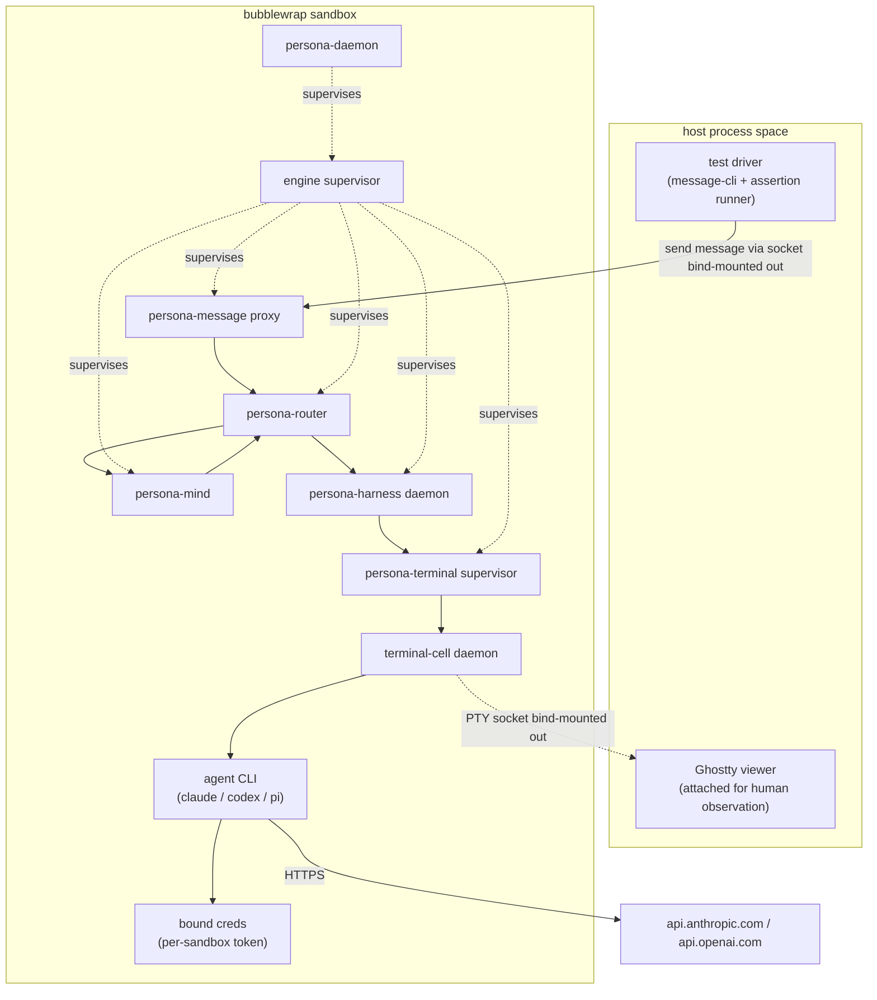
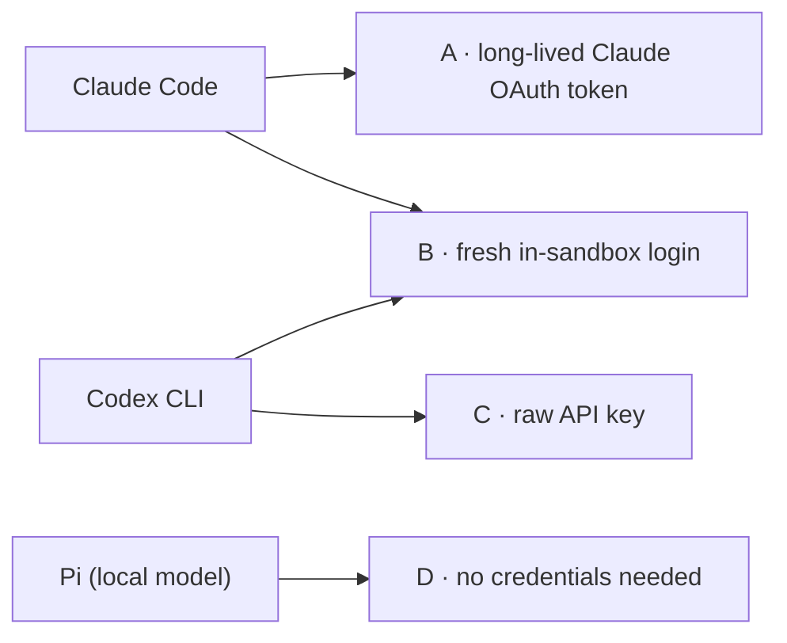
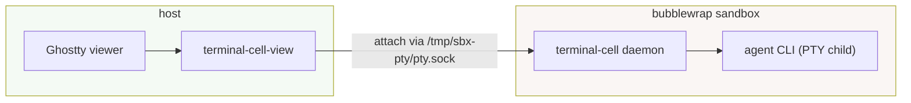
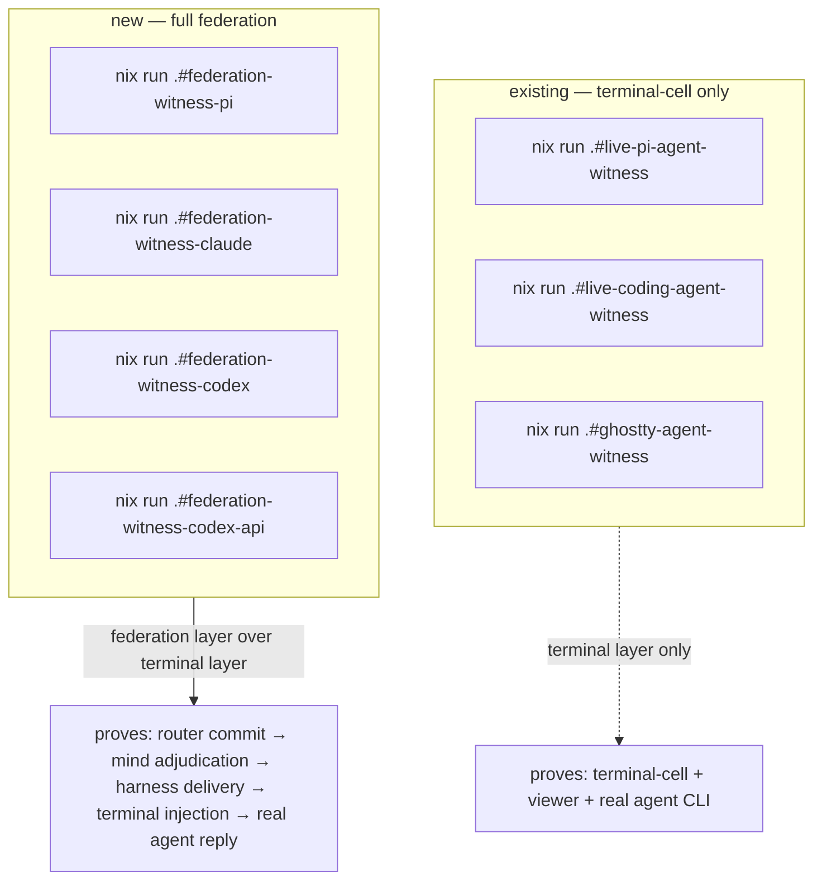
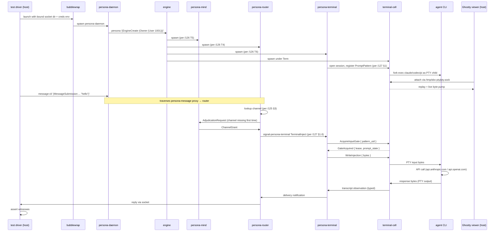
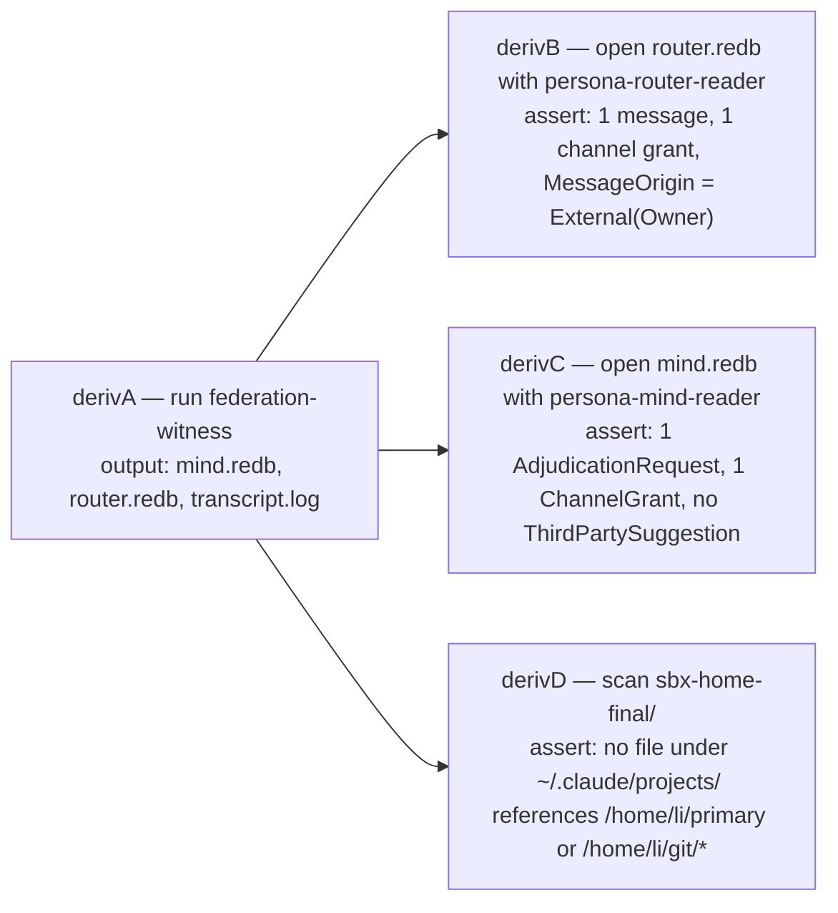

# 129 — Sandboxed Persona engine test

*Designer report, 2026-05-11. How to run the full Persona federation
end-to-end against real agent harnesses (Claude Code, Codex CLI, Pi)
inside a per-test sandbox that authenticates with the user's paid
subscriptions but inherits no conversation history, no project
memory, and no settings drift. Grounded in the architecture decisions
of /125 (channel choreography + trust model), /126 (operator
implementation tracks), /127 (gate-and-cache + terminal-cell signal
integration), and the existing terminal-cell live-agent witnesses.*

---

## 0 · TL;DR

Four load-bearing decisions, each with one primary-source citation
behind it (full list in §10).

| # | Decision | Why |
|---|---|---|
| 1 | **Sandbox is `bubblewrap`, not `systemd-nspawn`.** | nspawn's unprivileged mode supports only `--image=` containers and won't share the host Wayland socket without root or `systemd-machined` registration; `bwrap` does the whole job with the kernel's user-namespace + bind-mount primitives the workspace already runs. |
| 2 | **Auth crosses the boundary by long-lived token or fresh per-sandbox login — never by sharing the live credentials file.** | Both `~/.claude/.credentials.json` and `~/.codex/auth.json` use single-use OAuth refresh-token rotation. Bind-mounting the live file makes the first refresh log out the other party. The supported headless path for Claude Code is `claude setup-token` (1-year token, injected as `CLAUDE_CODE_OAUTH_TOKEN`); Codex CLI ChatGPT-plan auth has no headless equivalent and requires either an in-sandbox `codex login` or a raw API key. |
| 3 | **Model selection per harness aims at the cheapest tier accessible from each authentication path.** Claude → `claude-haiku-4-5` with extended thinking omitted (default-off, no `thinking` field). Codex via ChatGPT-plan auth → `gpt-5.4-mini` with `reasoning_effort = "minimal"`. Codex via API key → `gpt-5-nano` (subscription auth cannot route to the nano tier). Pi → local model when the user's machine can serve it; deferred otherwise. | Subscription auth gates which models the CLI can route to; the cheapest tier on each path is different. Names verified against current provider pricing pages and Codex models documentation as of 2026-05-11. |
| 4 | **Display sharing keeps Ghostty on the host; terminal-cell's PTY socket lives at a path bind-mounted out of the sandbox so the host Ghostty dials in.** | The existing terminal-cell live path (`Ghostty tty ↔ attach pump ↔ daemon byte pump ↔ child PTY`, per `terminal-cell/ARCHITECTURE.md` §1) requires the viewer to reach the daemon's Unix socket. Mounting the socket outward is simpler and exposes less surface than letting the Wayland socket into the sandbox. |

The deliverable is a new flake-app surface at the apex `persona` repo
that composes the federation under bubblewrap and exposes one
parameterised witness per harness kind:

```
nix run .#federation-witness -- --harness claude
nix run .#federation-witness -- --harness codex
nix run .#federation-witness -- --harness pi
```

Each invocation boots one fresh engine instance, drives one message
end-to-end (`persona-message` ingress → `persona-router` → channel
adjudication via `persona-mind` → `persona-harness` →
`persona-terminal` → `terminal-cell` PTY → real agent), and asserts
named architectural-truth witnesses (§9).

---

## 1 · What we're testing



The federation in the sandbox is **the production federation**, not
a fixture. The only test-only thing is the driver outside the
sandbox that sends one typed `signal-persona-message` frame in and
collects observations. The agent is a real agent CLI — same binary
the user runs on the host today — talking to a real provider with a
real (cheap) model.

This is what makes the witness load-bearing. A fixture-only test
can be satisfied by any code path that produces the right shape; a
real-agent witness can only be satisfied by the federation actually
delivering bytes to the agent's PTY and the agent actually replying
through the provider's API.

The witness extends the existing terminal-cell live-agent witnesses
(`live-pi-agent-witness`, `live-coding-agent-witness`,
`ghostty-agent-witness`, per `terminal-cell/ARCHITECTURE.md` §5
"Witnesses") by composing them *under* the rest of the federation
instead of running them in isolation.

---

## 2 · Sandbox technology — bubblewrap

### 2.1 Why not systemd-nspawn

The user's first instinct was `systemd-nspawn` with the caveat that
CriomOS would need a route-setup carve-out. The actual constraint
is sharper. Per the `systemd-nspawn(1)` man page (man7.org), full
functionality requires root; unprivileged mode supports **only
disk-image containers** (`--image=`) and only two network modes
(`--private-network`, `--network-veth`). Neither pattern shares the
host Wayland socket cleanly, neither admits a single
bind-mount-just-one-credential-file pattern, and `machinectl shell`
into the container needs `systemd-machined` registration which
needs root.

We could carve out the privileges, but doing so on a per-test basis
defeats the purpose of the sandbox — the privileged surface
re-enters the host's blast radius the moment we grant it.

### 2.2 Why bubblewrap fits

`bwrap` is the userspace front-end for the kernel's userns +
bind-mount primitives. It runs without setuid (NixOS ships it that
way because `kernel.unprivileged_userns_clone=1` is the default;
confirmed locally: `max_user_namespaces=126182`). It admits
fine-grained `--ro-bind` / `--bind` / `--tmpfs` for each path the
sandbox needs, and `--share-net` for the API calls.

### 2.3 NixOS-specific calling pattern

Two NixOS-specific facts shape the invocation:

| Fact | Consequence |
|---|---|
| `bubblewrap` is in nixpkgs as a plain binary at `~/.nix-profile/bin/bwrap`. | Call that path directly. |
| NixOS *also* installs setuid wrappers at `/run/wrappers/bin/...`. The setuid-wrapped `bwrap` from there breaks inside userns (nixpkgs#49100). | **Do not call `/run/wrappers/bin/bwrap`.** |
| `/etc/*` on NixOS is largely a symlink farm into `/etc/static/*`, which lives in the Nix store. | Both `/etc` and `/etc/static` need ro-bind so SSL roots, resolv.conf, etc. resolve. |
| User-installed binaries are at `~/.nix-profile/bin/...` (and `/etc/profiles/per-user/$USER/bin/...`) — both symlinks into `/nix/store/...`. | Bind `/nix/store` ro plus the relevant profile symlinks; that gives the sandbox the host's whole toolchain without copies. |

Skeleton shape of the bubblewrap invocation (illustrative — the
real invocation lives in a Nix-built shell script under the apex
`persona` repo's `scripts/`):

```text
bwrap
  # process isolation
  --unshare-all --share-net
  --die-with-parent --new-session
  # toolchain
  --ro-bind /nix/store /nix/store
  --ro-bind /etc        /etc
  --ro-bind /etc/static /etc/static
  --ro-bind /etc/resolv.conf /etc/resolv.conf
  # base filesystems
  --proc  /proc
  --dev   /dev
  --tmpfs /tmp
  # fresh $HOME
  --tmpfs $HOME
  --chdir $HOME
  # auth injection — one of: (a) ro-bind a per-sandbox token,
  #                          (b) inject env var (Claude long-lived),
  #                          (c) leave empty for fresh in-sandbox login
  # (per §3)
  # sockets out
  --tmpfs $XDG_RUNTIME_DIR
  --bind  /tmp/sbx-pty/  $HOME/.terminal-cell/
  # env
  --setenv HOME           $HOME
  --setenv PATH           $PATH
  --setenv XDG_RUNTIME_DIR $XDG_RUNTIME_DIR
  -- /nix/store/.../persona-dev-stack
```

The actual content is a Nix-built shell script per
`skills/testing.md` §"Stateful tests": versioned, named flake
output, leaves inspectable artifacts.

### 2.4 What the sandbox sees and doesn't

| Resource | Inside sandbox | Outside |
|---|---|---|
| `$HOME` | fresh tmpfs | the host's real home |
| `/nix/store` | ro-bind from host | shared |
| Network | shared (`--share-net`) | shared |
| `$WAYLAND_DISPLAY` socket | **not mounted in** | available on host |
| terminal-cell socket | created inside `$HOME/.terminal-cell/pty.sock` | visible at host `/tmp/sbx-pty/pty.sock` via `--bind` |
| `~/.claude/projects/...` | absent | present, untouched |
| `~/.claude/history.jsonl` | absent | present, untouched |
| `~/.codex/sessions/`, `logs_2.sqlite`, etc. | absent | present, untouched |
| API endpoints | reachable through shared net | reachable |

The host's session history is **never visible** to the sandbox,
because the entire `$HOME` is a fresh tmpfs. This is what gives the
witness clean session-start semantics: the sandboxed agent has no
prior project memory to "remember", no prior conversation to
reference, no statsig or telemetry continuity. Each test session
starts cold.

---

## 3 · Credential injection — the single-use refresh-token trap

### 3.1 The discovery

Both Claude Code and Codex CLI use OAuth refresh-token rotation
that is **single-use**:

- Claude Code: refresh-token reuse returns 404 with body *"OAuth
  refresh tokens are single-use. Please re-authenticate"* (per
  Anthropic's Claude Code repo issue #27933).
- Codex CLI: refresh-token reuse returns
  `"refresh_token_reused"` / *"Your access token could not be
  refreshed because your refresh token was already used"* (per
  openai/codex issue #10332, citing `codex-rs/core/src/auth.rs`
  lines 1251-1267). OpenAI's own CI/CD auth documentation states
  explicitly: *"Use one `auth.json` per runner or per serialized
  workflow stream. Do not share the same file across concurrent
  jobs or multiple machines."*

**Consequence**: a naive `--ro-bind ~/.claude/.credentials.json
$HOME/.claude/.credentials.json` is **wrong by construction**. It
either:

- (ro): blocks the sandbox from refreshing → first 401 inside the
  sandbox is fatal; *or*
- (rw): lets the sandbox refresh → the sandboxed instance now owns
  the new refresh-token, the host's copy is now stale, and the
  host is silently logged out on the *next* refresh.

Either side wins; the other side loses.

### 3.2 The three named patterns



**A · Long-lived OAuth token (Claude only).** Anthropic ships
`claude setup-token` (documented in Claude Code Authentication
§"Generate a long-lived token") which mints a 1-year OAuth token
that the CLI accepts via the `CLAUDE_CODE_OAUTH_TOKEN` environment
variable. The sandbox receives this token through `--setenv`; the
host's `.credentials.json` is never read. **Recommended default for
Claude in the federation witness.**

**B · Fresh in-sandbox login.** The sandbox starts cold, the test
driver invokes `claude /login` (or `codex login`) inside the
sandbox, and the login completes through the device-code flow on
the host browser. The sandbox's credentials persist only inside the
sandbox tmpfs and vanish when the sandbox exits. Slower; requires
human interaction the first time. Use when the long-lived-token
pattern is unavailable (Codex ChatGPT-plan auth has no headless
equivalent per openai/codex issue #3820).

**C · Raw API key (Codex only).** When the test wants to reach
nano-tier models (which subscription auth cannot route to — see
§4), use a raw `OPENAI_API_KEY` injected via `--setenv` into the
sandbox. Codex CLI's `~/.codex/config.toml` admits raw-key auth as
an alternative to ChatGPT-plan auth. No file injection needed; the
env var supplants the auth.json lookup.

**D · No credentials (Pi).** Pi connects to a local-model backend
on the user's machine. The sandbox needs to reach that backend's
endpoint — either bind-mounted in if it's a Unix socket, or
network-reachable if it's an HTTP server. No API credentials cross
the boundary.

### 3.3 Pattern choice per harness

| Harness | Pattern | Pollution risk | Recovery if invalidated |
|---|---|---|---|
| Claude Code | A (long-lived 1-yr token) | minimal: token is purpose-minted for headless use, separate from host session | regenerate via `claude setup-token` on host |
| Codex CLI (subscription) | B (fresh login) | minimal: in-sandbox session is per-test | re-login at next test |
| Codex CLI (API tier) | C (env-var API key) | none: raw key never touches sandbox storage | rotate key in user's OpenAI dashboard |
| Pi | D (no credentials) | none | — |

### 3.4 What we do NOT do

- **Do not bind-mount `~/.claude/.credentials.json` or `~/.codex/auth.json` into the sandbox** in either direction. The single-use refresh-token rotation makes this unsafe by construction; pattern A/B/C are the supported alternatives.
- **Do not run host + sandbox sessions concurrently against the same auth identity** — even with proper isolation, the provider servers see two clients asking to refresh the same token and one of them loses.
- **Do not copy `auth.json` out of the sandbox at shutdown back to the host.** That's the rw-bind pattern wearing different clothes.

---

## 4 · Model selection

### 4.1 Anthropic side — Haiku 4.5, no thinking

Current pricing (Anthropic platform pricing page, 2026-05):

| Model | Input $/MTok | Output $/MTok | Notes |
|---|---|---|---|
| `claude-haiku-4-5` | $1.00 | $5.00 | current generation; recommended |
| `claude-haiku-3-5` | $0.80 | $4.00 | older, slightly cheaper |
| `claude-haiku-3` | $0.25 | $1.25 | absolute cheapest; still listed |

Use `claude-haiku-4-5` by default. Disabling extended thinking is
**omitting** the `thinking` field — there is no explicit
`{type: "disabled"}` value; default-off is the off switch (per
Anthropic's Extended thinking documentation). Claude Code accepts a
model override via the `--model` flag or `ANTHROPIC_MODEL` env var.

### 4.2 OpenAI side — depends on auth path

This is where the user's recollection of *"5.3 Spark or 5.4 Mini"*
unpacks into a real constraint. Current pricing (OpenAI API
docs, 2026-05):

| Model | Input $/MTok | Output $/MTok | Auth path |
|---|---|---|---|
| `gpt-5.4-nano` | $0.20 | $1.25 | API key only |
| `gpt-5-nano` | $0.05 | $0.40 | API key only |
| `gpt-5.4-mini` | $0.75 | $4.50 | Both subscription and API |
| `gpt-5.4` | (higher) | (higher) | Both |
| `gpt-5.5` | (higher) | (higher) | Both |
| `gpt-5.3-Codex-Spark` | research preview | — | ChatGPT Pro plan via Codex CLI only |

The decisive fact: **ChatGPT-plan subscription auth cannot route
to the `*-nano` tier** (per *Using Codex with your ChatGPT plan*
help-center documentation). The cheapest tier reachable from
subscription auth is `gpt-5.4-mini`.

If we want the absolute cheapest OpenAI option for test traffic, we
must use raw API key auth and route to `gpt-5-nano`. The trade-off:

| Auth path | Cheapest model | Per 1k-token test (input+output ≈ 1k) |
|---|---|---|
| Subscription (ChatGPT plan) | `gpt-5.4-mini` with `reasoning_effort = "minimal"` | ≈ $0.005 |
| Raw API key | `gpt-5-nano` | ≈ $0.0005 |

Order of magnitude difference. For automation-heavy tests (CI
nightly, every-commit hook), raw API key is the right answer; for
ad-hoc developer-driven test runs, subscription auth is friction-
free and the cost is negligible.

The `reasoning_effort = "minimal"` lever applies to both
subscription and API paths and reduces reasoning-token spend (per
OpenAI's reasoning-models guide). Add it unconditionally.

### 4.3 Pi side — local, preferred-when-available

Pi is `persona-harness::HarnessKind::Pi`. The harness binary lives
at `~/.nix-profile/bin/pi`. Pi connects to a local-model backend on
the user's machine. The federation witness for Pi has zero per-call
cost — but it competes with the user's foreground use of the same
local model server.

The pragmatic rule: **Pi is the preferred witness target when the
local-model backend has spare capacity; subscription-paid harnesses
are the fallback when Pi is busy or when the test needs to exercise
specifically Claude or Codex behavior.**

A flake-output naming pattern that encodes this:

```text
nix run .#federation-witness-pi        # local, free, preferred
nix run .#federation-witness-claude    # Haiku 4.5, subscription
nix run .#federation-witness-codex     # gpt-5.4-mini, subscription
nix run .#federation-witness-codex-api # gpt-5-nano, API key
```

CI/automation can prefer `pi` and fall back to `claude` if Pi
unavailable; developers can pick by name.

---

## 5 · Display sharing — terminal-cell socket bind-mounted out

### 5.1 The shape

The existing terminal-cell live attach path (per
`terminal-cell/ARCHITECTURE.md` §1, the diagram captioned "The
current live path") is:

```text
Ghostty tty <-> attach pump <-> daemon byte pump <-> child PTY
```

The viewer (Ghostty + `terminal-cell-view`) reaches the daemon by
its Unix socket at `${XDG_RUNTIME_DIR:-/tmp}/terminal-cell/session-<N>/cell.sock`.

For the sandboxed federation, the daemon is inside the sandbox; the
viewer must run on the host so the human can see the agent windows
in their normal Niri compositor.



**`--bind /tmp/sbx-pty/  $HOME/.terminal-cell/`** in the bubblewrap
invocation makes the directory writable from inside the sandbox at
`$HOME/.terminal-cell/` and visible on the host at `/tmp/sbx-pty/`.
The terminal-cell daemon creates its socket there inside the
sandbox; the host Ghostty viewer reads the same inode through the
bind-mount.

### 5.2 Why not bind the Wayland socket in

The alternative — run Ghostty *inside* the sandbox and bind
`$WAYLAND_DISPLAY` in — works (it's the documented Flatpak/sloonz
pattern). It's the wrong choice here because:

- The viewer doesn't need any of the sandbox's other resources
  (toolchain, federation binaries, network).
- Letting Wayland into the sandbox widens the surface against the
  compositor; the credentials and fresh-state-tmpfs work above
  becomes wasted if the sandbox can drive Wayland clients in the
  user's compositor.
- The data path stays direct: the human's keystrokes reach the PTY
  through the existing terminal-cell raw attach pump, unchanged.

### 5.3 What this preserves from /127 §2.3

`/127` §2.3 ("Data plane stays raw") established the non-negotiable
invariant: **keystrokes from the attached viewer reach the child
PTY without traversing an actor mailbox, without per-byte signal
encoding, without transcript-subscription scheduling**. The
bind-mount-the-socket-outward pattern preserves this — the viewer
talks directly to the same `TerminalInputPort` and
`TerminalInputWriter` as it does today. No additional hop.

---

## 6 · Existing test surface — what this extends, what's new



| What the existing terminal-cell witnesses prove | What the new federation witness adds |
|---|---|
| terminal-cell + Ghostty + a real agent process (Pi, Claude, Codex) interact correctly through the raw byte pump | adds: real `persona-message` ingress, real router channel-state lookup, real mind adjudication, real harness identity projection, real terminal-cell gate-and-cache mechanism (per /127 §1) — all under one process tree under bubblewrap |
| transcript replay, late-attach, slow subscriber, high-volume output | adds: end-to-end message delivery sequence pointer (router commit → harness observation → terminal delivery), and proves the federation didn't bypass any of the planes |
| direct agent process under the user's `$HOME` with full session history | adds: per-test cold start, no session-pollution, sandboxed credentials — the human can re-run without rebuilding context |

The new witness is `persona/scripts/federation-witness` (per
`persona/ARCHITECTURE.md` §1.7's existing pattern of stateful
runners under `scripts/`), exposed through the apex flake as
`apps.federation-witness-<harness>`.

---

## 7 · Per-witness flow



This is the **production path**. Nothing is mocked. The only test-
only code is the driver outside the sandbox and the assertion
runner that reads the artifacts.

---

## 8 · Inspectable artifacts

Per `skills/testing.md` §"Stateful tests" and §"Chained tests", the
witness leaves typed artifacts the next step (or a human) can
inspect:

| Artifact | Where | What it proves |
|---|---|---|
| `mind.redb` from the sandbox | `/tmp/sbx-state/<engine-id>/mind.redb` (bind-mounted out) | mind recorded the AdjudicationRequest and ChannelGrant events |
| `router.redb` | `/tmp/sbx-state/<engine-id>/router.redb` | router's `channels` table contains the granted channel; `messages` table contains the typed message body |
| `harness.redb` | `/tmp/sbx-state/<engine-id>/harness.redb` | harness recorded a transcript event sequence pointer for the response |
| terminal-cell transcript | `/tmp/sbx-state/<engine-id>/transcript.log` | the raw PTY byte sequence shows the injected prompt and the agent's reply |
| api-call-shadow | `/tmp/sbx-net-log/calls.jsonl` (optional: enable `mitmproxy` or `tcpdump` on a network namespace) | the agent's outbound HTTPS request reached the expected provider host |
| sandbox `$HOME` snapshot | `/tmp/sbx-home-final/` (snapshot before sandbox teardown) | the sandbox `$HOME` after the session contains zero entries under `~/.claude/projects/` or `~/.codex/sessions/` whose paths reference host data |

The artifacts allow the second derivation in a chained witness to
read them with the authoritative reader (per
`skills/architectural-truth-tests.md` §"Nix-chained tests"). One
example chain:



---

## 9 · Constraints — witness seeds

Each constraint is a sentence; each should land a named witness
test in the federation-witness flake-app. Names follow the
`x_cannot_happen_without_y` shape per
`skills/architectural-truth-tests.md` §"Rule of thumb".

### 9.1 Federation correctness under sandbox

1. The federation-witness boots `persona-daemon` and at least one
   engine instance without falling back to a fixture daemon
   (`federation_witness_uses_real_persona_daemon`).
2. The router commits the message to `router.redb` before
   delivering to harness
   (`router_cannot_deliver_without_commit_under_sandbox`).
3. Mind adjudicates the first message on an ungranted channel
   triple via the `AdjudicationRequest` path
   (`mind_adjudicates_first_message_on_new_channel`).
4. The terminal-cell input gate acquires before injection per
   /127 §1 (`injection_cannot_write_to_pty_without_gate_lease`,
   reused from /127 §7).
5. The agent's outbound API call reaches a real provider host —
   no in-process fixture intercept
   (`agent_call_reaches_real_provider_endpoint`).

### 9.2 Sandbox correctness

6. The sandbox `$HOME` is a fresh tmpfs; no file under host's
   `~/.claude/projects/`, `~/.codex/sessions/`, `~/.codex/memories/`
   is reachable inside the sandbox
   (`sandbox_home_inherits_no_session_pollution`).
7. The sandbox's `bwrap` invocation does not include
   `~/.claude/.credentials.json` or `~/.codex/auth.json` as a
   bind-mount source
   (`sandbox_does_not_bind_mount_live_credentials_file`).
8. The agent authenticates via one of the three named patterns
   (long-lived OAuth token env var, fresh in-sandbox login, raw
   API key env var) — verifiable by reading the launch script
   (`auth_uses_named_pattern_a_b_or_c`).
9. The sandbox cannot reach host paths outside the explicit
   bind-mount set
   (`sandbox_cannot_read_host_home_outside_bound_paths`).

### 9.3 Display correctness

10. The Ghostty viewer attaches via the bind-mounted-out socket
    path; no Wayland socket crosses the sandbox boundary
    (`viewer_attaches_via_bound_socket_not_wayland_passthrough`).
11. Keystrokes from the attached viewer reach the child PTY
    without per-byte signal encoding (reuses
    `attached_viewer_keystrokes_are_not_signal_encoded` from
    /127 §7).
12. The federation-witness exits cleanly under SIGINT/SIGTERM
    delivered to the bubblewrap process; no daemon outlives the
    sandbox process tree
    (`sandbox_teardown_reaps_all_federation_processes`).

### 9.4 Cost-bounded test traffic

13. The Claude-side witness sets `ANTHROPIC_MODEL=claude-haiku-4-5`
    and omits the `thinking` request field
    (`claude_witness_uses_haiku_no_thinking`).
14. The Codex-subscription witness configures
    `model = "gpt-5.4-mini"` and `model_reasoning_effort = "minimal"`
    in `$HOME/.codex/config.toml`
    (`codex_subscription_witness_uses_mini_minimal_reasoning`).
15. The Codex-api-key witness configures `model = "gpt-5-nano"`
    and reads the key from a `$OPENAI_API_KEY` env var, not from
    a file
    (`codex_api_witness_uses_nano_via_env_key`).

---

## 10 · Open questions

| # | Question | Decision needed from |
|---|---|---|
| Q1 | What's the bead/track number for the operator hand-off? T1-T9 (per /126) are infrastructure for the federation itself; the federation-witness is a *test-side* track and probably wants a new bead category (`role:operator` for the script wiring, `role:system-specialist` for the bubblewrap-on-CriomOS layer). | designer + operator |
| Q2 | Does the Codex-fresh-login pattern (B) work with the device-code flow against a sandbox that has no browser inside? Test plan: run `codex login` inside bwrap, confirm the device-code URL prints, open it on the host browser, confirm the sandbox completes login. If device-code's polling endpoint is reachable, this works; document the exact UX before counting on it. | operator (empirical) |
| Q3 | Pi requires a local-model backend reachable from inside the sandbox. The user's machine has no Ollama installed; the Pi binary's actual backend is undocumented in `persona-harness/ARCHITECTURE.md`. Either: (a) Pi runs an in-process model, (b) Pi assumes a backend service the user hasn't yet installed, (c) Pi has a fallback to a network-hosted model. Resolving Q3 unblocks the Pi witness; doesn't block the Claude/Codex witnesses. | operator + system-specialist (locate or document Pi's backend) |
| Q4 | The sandboxed `persona-daemon` runs as the host user inside the sandbox's userns, not as a `persona` system user. That's fine for testing (no real privilege boundary needed when the whole engine is ephemeral and isolated by bwrap), but it diverges from the production model in /115 §3 ("privileged-user position"). Should the test-mode persona-daemon be marked explicitly as a test variant in its own startup arguments to keep the divergence honest? | designer |
| Q5 | When the API endpoints are reached via `--share-net`, the sandbox sees the host's `/etc/resolv.conf` and outbound routing. Should the witness optionally support an egress-only proxy (mitmproxy or similar) to record the exact provider calls for cost-budget tracking? Listed as optional artifact in §8. | operator (if/when needed) |
| Q6 | The federation-witness exposes the sandbox `$HOME` snapshot at `/tmp/sbx-home-final/` — should we redact any tokens or token-shaped strings before exposing it, in case the inspection artifact ends up in a shared report? | designer |

---

## 11 · What this does NOT change

- **The Persona federation itself.** No new contract types, no new
  actors, no schema bumps. The federation-witness is purely a test
  composition over the federation as designed in /114-/127.
- **The architectural-truth witnesses landing at each component.**
  Each component's own witnesses (per /126 tracks T1-T9) continue
  to land in their own repos. The federation-witness composes them;
  it doesn't replace them.
- **The production trust model.** /125's filesystem-ACL trust model
  applies to production engine deployment. The sandbox runs in a
  user-namespace where the production trust assumptions don't
  apply — the sandbox itself IS the trust boundary. The
  `ConnectionClass` minting at the engine boundary still happens
  (the engine code is the production code) but the resulting
  `Owner` class is "the user-namespace-host" inside the sandbox,
  not a real host UID.

---

## 12 · Implementation outline

The work splits into tracks per the operator hand-off pattern of /126:

| Track | Owner | Substance | Depends on |
|---|---|---|---|
| W1 — sandbox-launch script | operator | `persona/scripts/federation-witness` shell skeleton; bubblewrap invocation; argument parsing for `--harness {claude,codex,codex-api,pi}` | none |
| W2 — auth injection per harness | operator | wire patterns A/B/C/D from §3; one branch per harness | W1 |
| W3 — federation startup inside sandbox | operator | reuse `persona-dev-stack` (per `persona/ARCHITECTURE.md` §1.7); adapt for sandbox $HOME layout | W1, /126 T3 |
| W4 — driver outside sandbox | operator | message-cli invocation + assertion runner; reads bound-out artifacts | W3 |
| W5 — Pi backend discovery | operator + system-specialist | answer Q3 above; document Pi's local-model backend in `persona-harness/ARCHITECTURE.md`; install or document the backend's host setup | none |
| W6 — Ghostty attach helper | system-specialist | tiny wrapper script that finds the bound-out socket and runs `terminal-cell-view` with Ghostty embedded; integrates with Niri to open in the user's session | W3 |
| W7 — nix-chained reader derivations | operator-assistant or operator | the `derivB`/`derivC`/`derivD` shapes from §8; each reader derivation opens one redb with the authoritative reader and asserts the witness | W4 |
| W8 — CI integration (optional, deferred) | system-specialist | run `federation-witness-codex-api` (nano-tier) on commit; budget-bound the per-test spend | W4, W7 |

The tracks don't need to land in lockstep; W1+W2 (bubblewrap +
auth) is enough to start running the Claude witness manually. W7
adds the chained-derivation rigor. W8 is automation.

---

## See Also

- `~/primary/ESSENCE.md` §"Constraints become tests" — the
  witness-test discipline this report applies to a new test surface.
- `~/primary/reports/designer/114-persona-vision-as-of-2026-05-11.md`
  — the federation this report sandboxes.
- `~/primary/reports/designer/115-persona-engine-manager-architecture.md`
  §3 (privileged-user) — the production trust model the sandbox
  intentionally diverges from (Q4).
- `~/primary/reports/designer/125-channel-choreography-and-trust-model.md`
  — the channel choreography the witness exercises end-to-end.
- `~/primary/reports/designer/126-implementation-tracks-operator-handoff.md`
  — the production federation tracks; the federation-witness sits
  on top of all of them.
- `~/primary/reports/designer/127-decisions-resolved-2026-05-11.md`
  §1 (gate-and-cache), §2 (terminal-cell signal integration), §2.3
  (data-plane-stays-raw) — the mechanisms the witness exercises and
  the invariant the display-sharing pattern preserves.
- `~/primary/skills/testing.md` — pure / stateful / chained Nix
  test surfaces; the federation-witness is a stateful Nix runner
  with chained reader derivations.
- `~/primary/skills/architectural-truth-tests.md` — witness
  catalogue and Nix-chained pattern.
- `~/primary/skills/system-specialist.md` — the role this report
  partially defers to (bubblewrap + Niri integration is
  system-specialist territory).
- `~/primary/protocols/active-repositories.md` — current active repo
  map; the federation-witness lands in the `persona` apex repo.
- `~/primary/repos/persona/ARCHITECTURE.md` §1.7 (Startup Strategy)
  — the existing `persona-dev-stack` pattern the witness extends.
- `~/primary/repos/terminal-cell/ARCHITECTURE.md` §5 (Witnesses) —
  the existing live-agent witnesses this report composes over.
- `https://code.claude.com/docs/en/authentication` — Claude Code
  Authentication, including `claude setup-token` for long-lived
  OAuth tokens.
- `https://platform.claude.com/docs/en/about-claude/pricing` —
  current Anthropic API pricing (Haiku 4.5, 3.5, 3).
- `https://platform.claude.com/docs/en/build-with-claude/extended-thinking`
  — extended thinking is opt-in; omit the `thinking` field to
  disable.
- `https://github.com/anthropics/claude-code/issues/27933` —
  single-use refresh-token rotation in Claude Code.
- `https://developers.openai.com/codex/auth/ci-cd-auth` — OpenAI's
  one-`auth.json`-per-runner rule.
- `https://github.com/openai/codex/issues/10332` — refresh-token
  reuse error in Codex CLI (cites `codex-rs/core/src/auth.rs`).
- `https://github.com/openai/codex/issues/3820` — no headless
  ChatGPT-plan auth equivalent for Codex.
- `https://developers.openai.com/codex/models` — Codex CLI model
  routing per auth path.
- `https://developers.openai.com/api/docs/pricing` — current
  OpenAI API pricing (gpt-5.4-nano, gpt-5.4-mini, gpt-5-nano).
- `https://developers.openai.com/api/docs/guides/reasoning` —
  `reasoning_effort = "minimal"` for cost-sensitive flows.
- `https://man7.org/linux/man-pages/man1/systemd-nspawn.1.html` —
  nspawn unprivileged-mode restrictions.
- `https://manpages.debian.org/testing/bubblewrap/bwrap.1.en.html` —
  `bwrap(1)` manual page.
- `https://github.com/NixOS/nixpkgs/issues/49100` — setuid-wrapped
  `bwrap` breaks inside userns on NixOS.
- `https://sloonz.github.io/posts/sandboxing-2/` — Wayland-bridge
  pattern for the sloonz desktop bwrap setup.
- `https://wiki.archlinux.org/title/Bubblewrap` — community
  reference for bubblewrap recipes.
