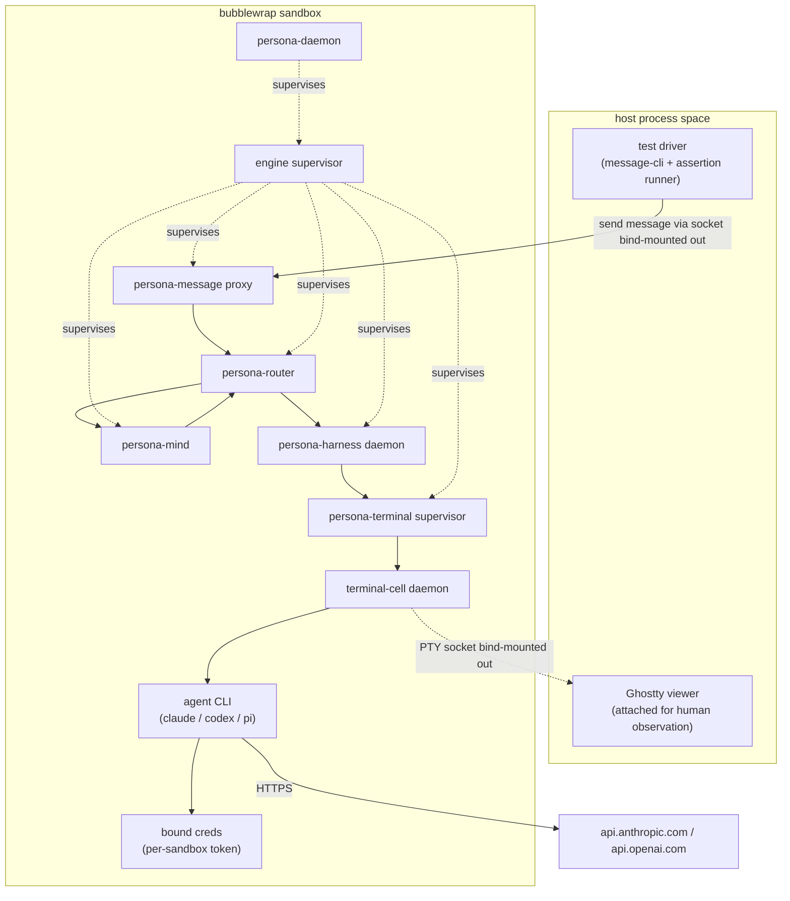
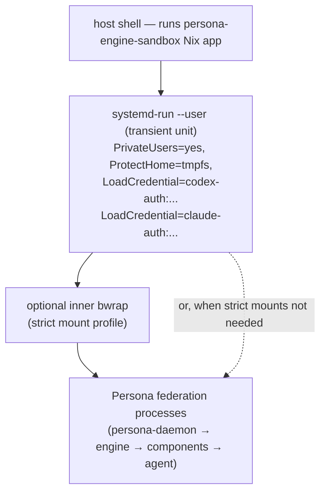
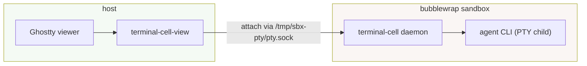
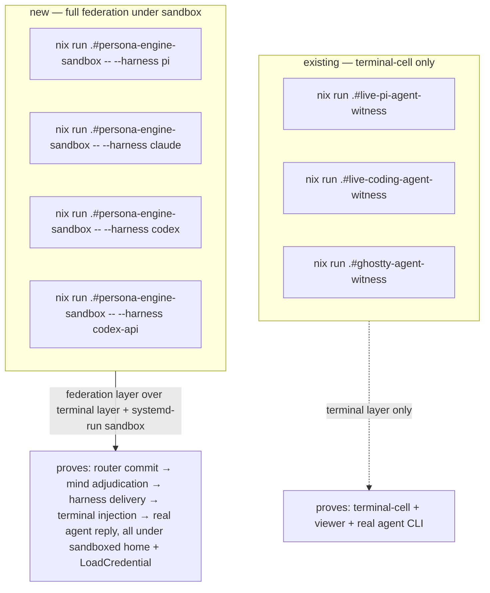
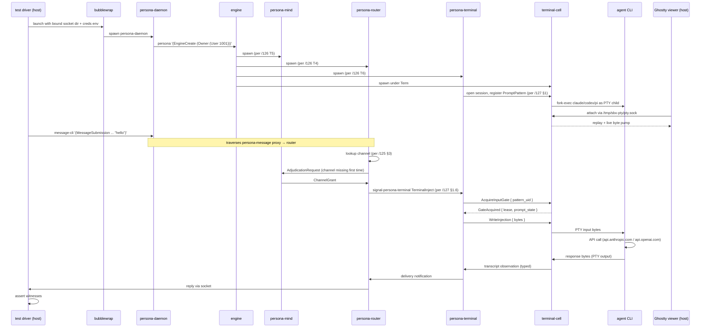
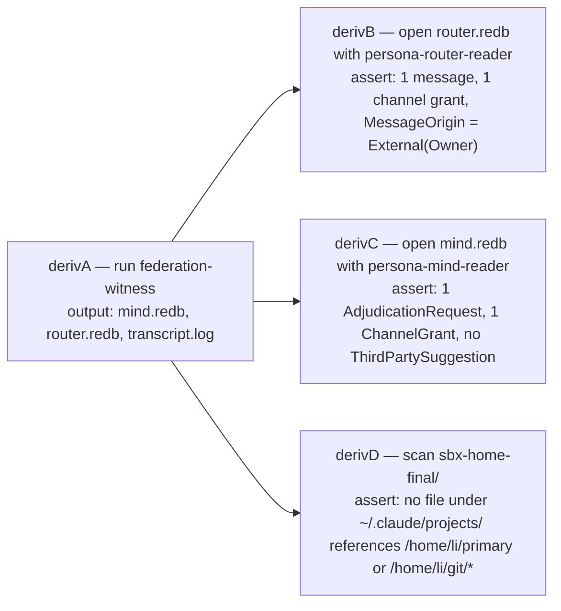

# 129 — Sandboxed Persona engine test

*Designer report, 2026-05-11. How to run the full Persona federation
end-to-end against real agent harnesses (Claude Code, Codex CLI, Pi)
inside a per-test sandbox that authenticates with the user's paid
subscriptions but inherits no conversation history, no project
memory, and no settings drift. Grounded in the architecture decisions
of /125 (channel choreography + trust model), /126 (operator
implementation tracks), /127 (gate-and-cache + terminal-cell signal
integration), and the existing terminal-cell live-agent witnesses.*

---

## 0 · TL;DR

Four load-bearing decisions, each with primary-source citations
behind it (full list in §10). The first two are revised from this
report's initial draft to fold in designer-assistant/19's
empirically-verified findings (see §13 for the convergence
record).

| # | Decision | Why |
|---|---|---|
| 1 | **Sandbox is a two-layer cake: `systemd-run --user` outside, optional `bwrap` strict-mount inside.** `systemd-nspawn` is deferred to the production-container path. | systemd-run provides cgroup lifecycle, cleanup, and — load-bearingly — `LoadCredential=` (systemd's read-only credential-passing mechanism). `ProtectHome=tmpfs` + `PrivateUsers=yes` give the fresh-$HOME and userns properties for free. `bwrap` inner adds a strict mount profile when the test wants a deliberately tiny `/`. nspawn's unprivileged mode is too restricted (image-only containers, no clean Wayland passthrough) for this test path. DA empirically confirmed the systemd-run pattern works against `~/.codex/auth.json`. |
| 2 | **Credentials enter the sandbox through one of three named modes (`SnapshotCredential`, `ReadOnlyHostCredential`, `IssuedSandboxCredential`), preferably via systemd `LoadCredential=` plus per-tool config-dir env-vars (`CLAUDE_CONFIG_DIR`, `CODEX_HOME`, `PI_CODING_AGENT_DIR`). The live host credential file is never bind-mounted in either direction.** | Both `~/.claude/.credentials.json` and `~/.codex/auth.json` use single-use OAuth refresh-token rotation; bind-mounting them races the host's session. Each tool exposes a config-dir env var that redirects the whole config tree, which is cleaner than path-specific bind-mounts. For Claude, `claude setup-token` + `CLAUDE_CODE_OAUTH_TOKEN` is the supported headless path (`IssuedSandboxCredential`). For Codex, no equivalent exists yet; `SnapshotCredential` via `LoadCredential=` is the working pattern but **must be empirically witnessed** before being trusted (§9.4). |
| 3 | **Model selection per harness aims at the cheapest tier accessible from each authentication path.** Claude → `claude-haiku-4-5` with extended thinking omitted (default-off, no `thinking` field). Codex via ChatGPT-plan auth → `gpt-5.4-mini` with `reasoning_effort = "minimal"`. Codex via API key → `gpt-5-nano` (subscription auth cannot route to the nano tier). Pi → prometheus-served local model (e.g. `prometheus/glm-4.7-flash` or `prometheus/qwen3-8b`). | Subscription auth gates which models the CLI can route to; the cheapest tier on each path is different. Names verified against current provider pricing pages and Codex models documentation as of 2026-05-11. Pi's backend (answered by DA's report): the user's cluster `prometheus` node serves the local models; `PI_PACKAGE_DIR` must point at Pi's Nix-store package. |
| 4 | **Display sharing keeps Ghostty on the host; terminal-cell's PTY socket lives at a path bind-mounted out of the sandbox so the host Ghostty dials in.** | The existing terminal-cell live path (`Ghostty tty ↔ attach pump ↔ daemon byte pump ↔ child PTY`, per `terminal-cell/ARCHITECTURE.md` §1) requires the viewer to reach the daemon's Unix socket. Mounting the socket outward is simpler and exposes less surface than letting the Wayland socket into the sandbox. |

The deliverable is a new Nix app at the apex `persona` repo named
`persona-engine-sandbox` (DA's name), parameterised by harness:

```
nix run .#persona-engine-sandbox -- --harness pi
nix run .#persona-engine-sandbox -- --harness claude
nix run .#persona-engine-sandbox -- --harness codex
nix run .#persona-engine-sandbox -- --harness codex-api
```

Each invocation boots one fresh engine instance under `systemd-run
--user`, drives one message end-to-end (`persona-message` ingress →
`persona-router` → channel adjudication via `persona-mind` →
`persona-harness` → `persona-terminal` → `terminal-cell` PTY → real
agent), and asserts named architectural-truth witnesses (§9).

---

## 1 · What we're testing



The federation in the sandbox is **the production federation**, not
a fixture. The only test-only thing is the driver outside the
sandbox that sends one typed `signal-persona-message` frame in and
collects observations. The agent is a real agent CLI — same binary
the user runs on the host today — talking to a real provider with a
real (cheap) model.

This is what makes the witness load-bearing. A fixture-only test
can be satisfied by any code path that produces the right shape; a
real-agent witness can only be satisfied by the federation actually
delivering bytes to the agent's PTY and the agent actually replying
through the provider's API.

The witness extends the existing terminal-cell live-agent witnesses
(`live-pi-agent-witness`, `live-coding-agent-witness`,
`ghostty-agent-witness`, per `terminal-cell/ARCHITECTURE.md` §5
"Witnesses") by composing them *under* the rest of the federation
instead of running them in isolation.

---

## 2 · Sandbox technology — systemd-run outer, bubblewrap inner

The sandbox is **two layers**, each doing a job the other doesn't.
The outer layer is `systemd-run --user`, which gives cgroup
lifecycle management, automatic cleanup, and systemd's
`LoadCredential=` credential-passing primitive. The inner layer is
optional `bwrap`, used when the test wants a deliberately tiny
filesystem view (only `/nix`, `/run/current-system`, the sandbox
state directory, plus `/proc`, `/dev`, and the Wayland socket if
graphics are needed).



### 2.1 Why not systemd-nspawn

`systemd-nspawn` is the right path for production container
deployment of the engine, but it is the wrong path for this test.
Per the `systemd-nspawn(1)` man page (man7.org), full functionality
requires root; unprivileged mode supports **only disk-image
containers** (`--image=`) and only two network modes. Neither
pattern shares the host Wayland socket cleanly, and `machinectl
shell` needs `systemd-machined` registration which needs root.
DA reached the same conclusion: nspawn is heavier than this test
needs and depends on CriomOS routing/private-user setup we don't
have yet.

### 2.2 Why systemd-run + bwrap fit together

**`systemd-run --user`** is the canonical NixOS-native way to
launch a transient user-mode service with a structured property
set. It provides:

- `PrivateUsers=yes` — runs inside a user namespace; uid 0 inside
  the unit maps to the user outside.
- `ProtectHome=tmpfs` — replaces `/home/<user>` with an empty
  tmpfs visible only to the unit.
- `LoadCredential=name:path` — loads the host file at `path` into
  `$CREDENTIALS_DIRECTORY/name` inside the unit. Read-only. The
  unit can read it; nothing else can; the unit cannot write back
  to the host path.
- Cgroup-based lifecycle: the whole process tree is reaped on
  unit stop. No orphan daemons.

DA verified empirically: `systemd-run --user --property=PrivateUsers=yes
--property=ProtectHome=tmpfs --property=LoadCredential=codex-auth:$HOME/.codex/auth.json`
works on this host and gives the unit a fresh $HOME with the
credential file available at `$CREDENTIALS_DIRECTORY/codex-auth`.

**Inner `bwrap`** is added when the test wants a tighter mount
profile than `ProtectHome=tmpfs` provides — typically to keep
`/etc`, `/usr`, and the rest of the host filesystem out of the
sandbox view. It runs *inside* the systemd-run unit (no nested
systemd needed). On NixOS, two facts shape the bwrap invocation:

| Fact | Consequence |
|---|---|
| `bubblewrap` is in nixpkgs as a plain binary at `~/.nix-profile/bin/bwrap`. | Call that path directly. |
| NixOS *also* installs setuid wrappers at `/run/wrappers/bin/...`. The setuid-wrapped `bwrap` from there breaks inside userns (nixpkgs#49100). | **Do not call `/run/wrappers/bin/bwrap`.** |
| `/etc/*` on NixOS is largely a symlink farm into `/etc/static/*`, which lives in the Nix store. | Both `/etc` and `/etc/static` need ro-bind so SSL roots, resolv.conf, etc. resolve. |
| User-installed binaries are at `~/.nix-profile/bin/...` (and `/etc/profiles/per-user/$USER/bin/...`) — both symlinks into `/nix/store/...`. | Bind `/nix/store` ro plus the relevant profile symlinks. |

Inner bwrap is **optional** for the first implementation;
`systemd-run --user` with `ProtectHome=tmpfs` is enough to start
running the witness against. Tighten with bwrap once a concrete
gap surfaces.

### 2.3 Composed invocation shape

Sketch of the layered invocation (the real shape lives in a
Nix-built shell script under the apex `persona` repo's
`scripts/`):

```text
systemd-run --user --pty --collect --service-type=exec
  --property=PrivateUsers=yes
  --property=PrivateTmp=yes
  --property=ProtectHome=tmpfs
  --property=ProtectSystem=strict
  --property=ReadWritePaths=$SANDBOX_DIR
  --property=LoadCredential=codex-auth:$HOME/.codex/auth.json    # SnapshotCredential
  --property=LoadCredential=claude-auth:$HOME/.claude/.credentials.json
  --property=SetCredential=harness-prompt:reply-exactly-persona-sandbox-ok
  --
  /nix/store/.../persona-engine-sandbox-runner
    --sandbox-dir $SANDBOX_DIR
    --harness claude
    # the runner sets CLAUDE_CONFIG_DIR, CODEX_HOME, PI_CODING_AGENT_DIR
    # to point inside $SANDBOX_DIR, copies the loaded credentials into
    # those config dirs as $CREDENTIALS_DIRECTORY/<name>, and starts
    # persona-daemon as a child.
```

`SetCredential=` lets the test driver inject a fixed prompt
without writing it to disk; the runner reads it from
`$CREDENTIALS_DIRECTORY/harness-prompt`. Per
`systemd.exec(5)` documentation on credentials.

### 2.4 What the sandbox sees and doesn't

| Resource | Inside sandbox | Outside |
|---|---|---|
| `$HOME` | empty tmpfs (`ProtectHome=tmpfs`) | the host's real home, untouched |
| `$SANDBOX_DIR/{state,run,home,work,artifacts}/` | rw (`ReadWritePaths=`) | visible to the host for artifact inspection |
| `/nix/store` | shared via systemd defaults (or ro-bind under bwrap) | shared |
| Network | inherited from host | unchanged |
| `$WAYLAND_DISPLAY` socket | **not mounted in** | available on host |
| terminal-cell control socket | created at `$SANDBOX_DIR/run/cell.sock` | visible at the same path on host (rw via `ReadWritePaths=`) |
| Loaded credentials | available read-only at `$CREDENTIALS_DIRECTORY/{codex-auth,claude-auth,...}` | source files on host are untouched |
| `~/.claude/projects/...`, `~/.claude/history.jsonl` | absent | present, untouched |
| `~/.codex/sessions/`, `logs_2.sqlite`, etc. | absent | present, untouched |
| API endpoints | reachable | reachable |

The host's session history is **never visible** to the sandbox
because `$HOME` is an empty tmpfs and the credential injection is
done via `LoadCredential=` (which doesn't traverse the host home
tree). This is what gives the witness clean session-start
semantics: the sandboxed agent has no prior project memory, no
prior conversation, no statsig or telemetry continuity. Each test
session starts cold.

---

## 3 · Credential injection

### 3.1 The single-use refresh-token discovery

Both Claude Code and Codex CLI use OAuth refresh-token rotation
that is **single-use**:

- Claude Code: refresh-token reuse returns 404 with body *"OAuth
  refresh tokens are single-use. Please re-authenticate"* (per
  Anthropic's Claude Code repo issue #27933).
- Codex CLI: refresh-token reuse returns
  `"refresh_token_reused"` / *"Your access token could not be
  refreshed because your refresh token was already used"* (per
  openai/codex issue #10332, citing `codex-rs/core/src/auth.rs`
  lines 1251-1267). OpenAI's own CI/CD auth documentation states
  explicitly: *"Use one `auth.json` per runner or per serialized
  workflow stream. Do not share the same file across concurrent
  jobs or multiple machines."*

**Consequence**: a naive bind-mount of the live credential file —
in either direction — is wrong by construction. Read-only blocks
refresh and the first 401 inside the sandbox is fatal; read-write
lets the sandbox refresh and silently invalidates the host's copy
on its next refresh. Either side wins; the other side loses.

### 3.2 The three named modes

Three distinct ways credentials can cross the boundary — each
with a name (DA's vocabulary, adopted here) so the design choice
is explicit at every call site:

| Mode | Mechanism | Refresh risk | When to use |
|---|---|---|---|
| **`SnapshotCredential`** | Copy the host credential file into the sandbox config dir at launch. | If the sandbox refreshes, the host's copy goes stale at next refresh. | Pi auth; short Codex smokes until the issued-token path lands; Claude when no long-lived token is available. |
| **`ReadOnlyHostCredential`** | Expose the file read-only into the sandbox via `LoadCredential=`. | Sandbox cannot refresh — the first 401 is fatal. | Brief "does it parse the file" smoke tests; not durable enough for prompt-bearing witnesses. |
| **`IssuedSandboxCredential`** | Mint a credential specifically for the sandbox, destroy it after. | None: per-sandbox lifetime; never shared with host. | Claude via `claude setup-token` → `CLAUDE_CODE_OAUTH_TOKEN` (1-year, inference-scoped). Codex via raw `OPENAI_API_KEY` env var (no subscription equivalent yet). |

### 3.3 Two delivery primitives — `LoadCredential=` and config-dir env vars

The modes name *what* crosses; the **delivery primitives** name
*how*. Two cross-cutting mechanisms, used together:

**Systemd `LoadCredential=name:path`.** Loads `path` from the
host into `$CREDENTIALS_DIRECTORY/name` inside the unit. Read-only,
in-memory, doesn't traverse host home tree, never persisted to
sandbox disk. The runner reads it and copies it into the
sandbox's per-tool config dir for `SnapshotCredential`, or leaves
it where it is for `ReadOnlyHostCredential`. Documented in
`systemd.exec(5)` §"Credentials".

**Per-tool config-dir env vars.** Every harness CLI in scope
exposes an env var that redirects its config tree:

| Tool | Env var | What it redirects |
|---|---|---|
| Claude Code | `CLAUDE_CONFIG_DIR` | The whole `~/.claude/` tree. Setting it isolates *all* state — credentials, projects, history, settings — to the chosen path. |
| Codex CLI | `CODEX_HOME` | The whole `~/.codex/` tree, including session/history files. |
| Pi | `PI_CODING_AGENT_DIR` (config), `PI_CODING_AGENT_SESSION_DIR` (session), `PI_PACKAGE_DIR` (Nix-store package path) | Pi needs all three set inside the sandbox; without `PI_PACKAGE_DIR` Pi looks under the fake home and fails before doing useful work. |

Setting these env vars to point at `$SANDBOX_DIR/home/{.claude,.codex,...}/`
is **the cleaner alternative** to bind-mounting credentials to
canonical paths. The sandbox-internal config dir gets the
credential file populated by `LoadCredential=`, plus tool-specific
non-credential bits the tool would otherwise look for in the
default home (Claude writes `.claude.json` into the config dir on
first run; that's fine — it stays in the sandbox state directory).

Additional per-tool flags for non-interactive use (verified by DA):

| Tool | Flag / env var | Purpose |
|---|---|---|
| Claude Code | `claude -p --no-session-persistence` | non-interactive run, no session persistence |
| Claude Code | `CLAUDE_CODE_SKIP_PROMPT_HISTORY` | same persistence control, any mode |
| Codex CLI | `codex exec --ephemeral --ignore-user-config` | ephemeral exec; `--ignore-user-config` still uses `CODEX_HOME` for auth |
| Pi | `--no-session` | no session directory created |

### 3.4 Mode choice per harness

| Harness | Mode | Delivery | Pollution risk | Recovery if invalidated |
|---|---|---|---|---|
| Pi | `SnapshotCredential` | `LoadCredential=pi-auth` + `PI_CODING_AGENT_DIR` + `PI_PACKAGE_DIR` | none (no external API) | — |
| Claude (preferred) | `IssuedSandboxCredential` | `--setenv CLAUDE_CODE_OAUTH_TOKEN=<token>` from `claude setup-token` | minimal: token is purpose-minted, separate from host session | regenerate via `claude setup-token` on host |
| Claude (fallback) | `SnapshotCredential` | `LoadCredential=claude-auth` + `CLAUDE_CONFIG_DIR` | refresh-rotation risk; see §3.5 | re-`/login` on host |
| Codex (subscription) | `SnapshotCredential` | `LoadCredential=codex-auth` + `CODEX_HOME` | **empirically unverified**; refresh-rotation risk; gated by §9.4 witness | re-login on host |
| Codex (API) | `IssuedSandboxCredential` | `--setenv OPENAI_API_KEY=<key>` | none: raw key never touches sandbox storage | rotate key in OpenAI dashboard |

### 3.5 What this report does NOT yet prove

- **Codex `SnapshotCredential` is empirically unverified for
  prompt-bearing workloads.** DA confirmed `codex login status`
  works on a copied `auth.json` with `CODEX_HOME` set, but a
  prompt may trigger a refresh, and a refresh on the copied
  refresh-token will invalidate the host's copy. Architecture
  decision: **gate Codex subscription-auth sandboxing on the
  `full_engine_codex_smoke` witness** (§9.4) which records
  host-side auth state before and after one prompt and asserts
  no mutation. If the witness shows host auth is mutated, the
  Codex subscription-auth path requires an issued-token or
  API-key alternative.
- **`IssuedSandboxCredential` for Codex subscription auth does
  not exist yet.** `codex login --with-api-key` and `codex login
  --with-access-token` exist (verified by DA) but no
  subscription-equivalent long-lived flow is documented (per
  openai/codex issue #3820). Watch for upstream changes.

### 3.6 What we do NOT do

- **Do not bind-mount `~/.claude/.credentials.json` or
  `~/.codex/auth.json` into the sandbox** in either direction.
  Use `LoadCredential=` + config-dir env vars instead.
- **Do not run host + sandbox sessions concurrently against the
  same auth identity** — the provider servers see two clients
  asking to refresh the same token and one of them loses.
- **Do not copy `auth.json` out of the sandbox at shutdown back
  to the host.** That's the rw-bind pattern wearing different
  clothes.

---

## 4 · Model selection

### 4.1 Anthropic side — Haiku 4.5, no thinking

Current pricing (Anthropic platform pricing page, 2026-05):

| Model | Input $/MTok | Output $/MTok | Notes |
|---|---|---|---|
| `claude-haiku-4-5` | $1.00 | $5.00 | current generation; recommended |
| `claude-haiku-3-5` | $0.80 | $4.00 | older, slightly cheaper |
| `claude-haiku-3` | $0.25 | $1.25 | absolute cheapest; still listed |

Use `claude-haiku-4-5` by default. Disabling extended thinking is
**omitting** the `thinking` field — there is no explicit
`{type: "disabled"}` value; default-off is the off switch (per
Anthropic's Extended thinking documentation). Claude Code accepts a
model override via the `--model` flag or `ANTHROPIC_MODEL` env var.

### 4.2 OpenAI side — depends on auth path

This is where the user's recollection of *"5.3 Spark or 5.4 Mini"*
unpacks into a real constraint. Current pricing (OpenAI API
docs, 2026-05):

| Model | Input $/MTok | Output $/MTok | Auth path |
|---|---|---|---|
| `gpt-5.4-nano` | $0.20 | $1.25 | API key only |
| `gpt-5-nano` | $0.05 | $0.40 | API key only |
| `gpt-5.4-mini` | $0.75 | $4.50 | Both subscription and API |
| `gpt-5.4` | (higher) | (higher) | Both |
| `gpt-5.5` | (higher) | (higher) | Both |
| `gpt-5.3-Codex-Spark` | research preview | — | ChatGPT Pro plan via Codex CLI only |

The decisive fact: **ChatGPT-plan subscription auth cannot route
to the `*-nano` tier** (per *Using Codex with your ChatGPT plan*
help-center documentation). The cheapest tier reachable from
subscription auth is `gpt-5.4-mini`.

If we want the absolute cheapest OpenAI option for test traffic, we
must use raw API key auth and route to `gpt-5-nano`. The trade-off:

| Auth path | Cheapest model | Per 1k-token test (input+output ≈ 1k) |
|---|---|---|
| Subscription (ChatGPT plan) | `gpt-5.4-mini` with `reasoning_effort = "minimal"` | ≈ $0.005 |
| Raw API key | `gpt-5-nano` | ≈ $0.0005 |

Order of magnitude difference. For automation-heavy tests (CI
nightly, every-commit hook), raw API key is the right answer; for
ad-hoc developer-driven test runs, subscription auth is friction-
free and the cost is negligible.

The `reasoning_effort = "minimal"` lever applies to both
subscription and API paths and reduces reasoning-token spend (per
OpenAI's reasoning-models guide). Add it unconditionally.

### 4.3 Pi side — local, preferred-when-available

Pi is `persona-harness::HarnessKind::Pi`. The harness binary lives
at `~/.nix-profile/bin/pi`. Pi's local model backend is **served by
the user's `prometheus` cluster node** (DA's discovery). Pi's
configured models, per DA:

| Model | Notes |
|---|---|
| `prometheus/qwen3.6-27b` | Pi's default |
| `prometheus/glm-4.7-flash` | small/fast; preferred for sandbox witness traffic |
| `prometheus/qwen3-8b` | small/fast alternative |

For the sandbox witness, **prefer `prometheus/glm-4.7-flash` or
`prometheus/qwen3-8b`** — small enough that the witness completes
quickly and doesn't compete with the user's foreground use of the
larger default. Set the model via Pi's normal config mechanism in
`$PI_CODING_AGENT_DIR`.

The federation witness for Pi has zero per-call cost — but it
shares the prometheus node with the user's other Pi use. The
pragmatic rule: **Pi is the preferred witness target when
prometheus has spare capacity; subscription-paid harnesses are
the fallback when Pi is busy or when the test needs to exercise
specifically Claude or Codex behavior.**

A flake-output naming pattern that encodes this (DA's name —
adopted):

```text
nix run .#persona-engine-sandbox -- --harness pi        # local, free, preferred
nix run .#persona-engine-sandbox -- --harness claude    # Haiku 4.5, subscription
nix run .#persona-engine-sandbox -- --harness codex     # gpt-5.4-mini, subscription
nix run .#persona-engine-sandbox -- --harness codex-api # gpt-5-nano, API key
```

CI/automation can prefer `pi` and fall back to `claude` if Pi
unavailable; developers can pick by name.

---

## 5 · Display sharing — terminal-cell socket bind-mounted out

### 5.1 The shape

The existing terminal-cell live attach path (per
`terminal-cell/ARCHITECTURE.md` §1, the diagram captioned "The
current live path") is:

```text
Ghostty tty <-> attach pump <-> daemon byte pump <-> child PTY
```

The viewer (Ghostty + `terminal-cell-view`) reaches the daemon by
its Unix socket at `${XDG_RUNTIME_DIR:-/tmp}/terminal-cell/session-<N>/cell.sock`.

For the sandboxed federation, the daemon is inside the sandbox; the
viewer must run on the host so the human can see the agent windows
in their normal Niri compositor.



**`ReadWritePaths=$SANDBOX_DIR`** on the `systemd-run` unit makes
the sandbox state tree writable from inside the unit and visible
on the host at the same path. The terminal-cell daemon creates its
control socket at `$SANDBOX_DIR/run/cell.sock` inside the unit; the
host Ghostty viewer (via `terminal-cell-view`) reads the same inode
through the shared path. No bind-mount-out gymnastics needed; the
sandbox state directory exists on the host filesystem and the
systemd unit just carves out write access to it.

### 5.2 Why not bind the Wayland socket in

The alternative — run Ghostty *inside* the sandbox and bind
`$WAYLAND_DISPLAY` in — works (it's the documented Flatpak/sloonz
pattern). It's the wrong choice here because:

- The viewer doesn't need any of the sandbox's other resources
  (toolchain, federation binaries, network).
- Letting Wayland into the sandbox widens the surface against the
  compositor; the credentials and fresh-state-tmpfs work above
  becomes wasted if the sandbox can drive Wayland clients in the
  user's compositor.
- The data path stays direct: the human's keystrokes reach the PTY
  through the existing terminal-cell raw attach pump, unchanged.

### 5.3 What this preserves from /127 §2.3

`/127` §2.3 ("Data plane stays raw") established the non-negotiable
invariant: **keystrokes from the attached viewer reach the child
PTY without traversing an actor mailbox, without per-byte signal
encoding, without transcript-subscription scheduling**. The
bind-mount-the-socket-outward pattern preserves this — the viewer
talks directly to the same `TerminalInputPort` and
`TerminalInputWriter` as it does today. No additional hop.

---

## 6 · Existing test surface — what this extends, what's new



| What the existing terminal-cell witnesses prove | What the new federation witness adds |
|---|---|
| terminal-cell + Ghostty + a real agent process (Pi, Claude, Codex) interact correctly through the raw byte pump | adds: real `persona-message` ingress, real router channel-state lookup, real mind adjudication, real harness identity projection, real terminal-cell gate-and-cache mechanism (per /127 §1) — all under one process tree under bubblewrap |
| transcript replay, late-attach, slow subscriber, high-volume output | adds: end-to-end message delivery sequence pointer (router commit → harness observation → terminal delivery), and proves the federation didn't bypass any of the planes |
| direct agent process under the user's `$HOME` with full session history | adds: per-test cold start, no session-pollution, sandboxed credentials — the human can re-run without rebuilding context |

The new witness is `persona/scripts/federation-witness` (per
`persona/ARCHITECTURE.md` §1.7's existing pattern of stateful
runners under `scripts/`), exposed through the apex flake as
`apps.federation-witness-<harness>`.

---

## 7 · Per-witness flow



This is the **production path**. Nothing is mocked. The only test-
only code is the driver outside the sandbox and the assertion
runner that reads the artifacts.

---

## 8 · Inspectable artifacts

Per `skills/testing.md` §"Stateful tests" and §"Chained tests", the
witness leaves typed artifacts the next step (or a human) can
inspect:

| Artifact | Where | What it proves |
|---|---|---|
| `mind.redb` from the sandbox | `/tmp/sbx-state/<engine-id>/mind.redb` (bind-mounted out) | mind recorded the AdjudicationRequest and ChannelGrant events |
| `router.redb` | `/tmp/sbx-state/<engine-id>/router.redb` | router's `channels` table contains the granted channel; `messages` table contains the typed message body |
| `harness.redb` | `/tmp/sbx-state/<engine-id>/harness.redb` | harness recorded a transcript event sequence pointer for the response |
| terminal-cell transcript | `/tmp/sbx-state/<engine-id>/transcript.log` | the raw PTY byte sequence shows the injected prompt and the agent's reply |
| api-call-shadow | `/tmp/sbx-net-log/calls.jsonl` (optional: enable `mitmproxy` or `tcpdump` on a network namespace) | the agent's outbound HTTPS request reached the expected provider host |
| sandbox `$HOME` snapshot | `/tmp/sbx-home-final/` (snapshot before sandbox teardown) | the sandbox `$HOME` after the session contains zero entries under `~/.claude/projects/` or `~/.codex/sessions/` whose paths reference host data |

The artifacts allow the second derivation in a chained witness to
read them with the authoritative reader (per
`skills/architectural-truth-tests.md` §"Nix-chained tests"). One
example chain:



---

## 9 · Constraints — witness seeds

Each constraint is a sentence; each should land a named witness
test in the federation-witness flake-app. Names follow the
`x_cannot_happen_without_y` shape per
`skills/architectural-truth-tests.md` §"Rule of thumb".

### 9.1 Federation correctness under sandbox

1. The federation-witness boots `persona-daemon` and at least one
   engine instance without falling back to a fixture daemon
   (`federation_witness_uses_real_persona_daemon`).
2. The router commits the message to `router.redb` before
   delivering to harness
   (`router_cannot_deliver_without_commit_under_sandbox`).
3. Mind adjudicates the first message on an ungranted channel
   triple via the `AdjudicationRequest` path
   (`mind_adjudicates_first_message_on_new_channel`).
4. The terminal-cell input gate acquires before injection per
   /127 §1 (`injection_cannot_write_to_pty_without_gate_lease`,
   reused from /127 §7).
5. The agent's outbound API call reaches a real provider host —
   no in-process fixture intercept
   (`agent_call_reaches_real_provider_endpoint`).

### 9.2 Sandbox correctness

6. The sandbox `$HOME` is a fresh tmpfs; no file under host's
   `~/.claude/projects/`, `~/.codex/sessions/`, `~/.codex/memories/`
   is reachable inside the sandbox
   (`sandbox_home_inherits_no_session_pollution`).
7. The sandbox's `bwrap` invocation does not include
   `~/.claude/.credentials.json` or `~/.codex/auth.json` as a
   bind-mount source
   (`sandbox_does_not_bind_mount_live_credentials_file`).
8. The agent authenticates via one of the three named patterns
   (long-lived OAuth token env var, fresh in-sandbox login, raw
   API key env var) — verifiable by reading the launch script
   (`auth_uses_named_pattern_a_b_or_c`).
9. The sandbox cannot reach host paths outside the explicit
   bind-mount set
   (`sandbox_cannot_read_host_home_outside_bound_paths`).

### 9.3 Display correctness

10. The Ghostty viewer attaches via the bind-mounted-out socket
    path; no Wayland socket crosses the sandbox boundary
    (`viewer_attaches_via_bound_socket_not_wayland_passthrough`).
11. Keystrokes from the attached viewer reach the child PTY
    without per-byte signal encoding (reuses
    `attached_viewer_keystrokes_are_not_signal_encoded` from
    /127 §7).
12. The federation-witness exits cleanly under SIGINT/SIGTERM
    delivered to the bubblewrap process; no daemon outlives the
    sandbox process tree
    (`sandbox_teardown_reaps_all_federation_processes`).

### 9.4 Cost-bounded test traffic

13. The Claude-side witness sets `ANTHROPIC_MODEL=claude-haiku-4-5`
    and omits the `thinking` request field
    (`claude_witness_uses_haiku_no_thinking`).
14. The Codex-subscription witness configures
    `model = "gpt-5.4-mini"` and `model_reasoning_effort = "minimal"`
    in `$CODEX_HOME/config.toml`
    (`codex_subscription_witness_uses_mini_minimal_reasoning`).
15. The Codex-api-key witness configures `model = "gpt-5-nano"`
    and reads the key from a `$OPENAI_API_KEY` env var, not from
    a file
    (`codex_api_witness_uses_nano_via_env_key`).

### 9.5 Auth isolation — the empirical witnesses (per DA)

16. **`codex_auth_isolated_status`** — create a fresh
    `$CODEX_HOME` containing only the loaded credential, run
    `codex login status`, assert no Codex session/history files
    appear under the host's `~/.codex/` or under the sandbox
    state directory except the snapshot.
17. **`claude_auth_isolated_status`** — create a fresh
    `$CLAUDE_CONFIG_DIR` containing only `.credentials.json`,
    run `claude auth status`, assert any `.claude.json` write
    lands in the sandbox config dir, not the host.
18. **`pi_auth_isolated_startup`** — fresh
    `$PI_CODING_AGENT_DIR`, `$PI_PACKAGE_DIR` set, run `pi
    --version` or model-list, assert no session dir created
    unless `--no-session` is overridden.
19. **`full_engine_codex_smoke_preserves_host_auth`** — the gate
    witness for Codex subscription-auth sandboxing. Run one full
    prompt-bearing federation witness through Codex with
    `SnapshotCredential`. Record `mtime`/`hash` of host
    `~/.codex/auth.json` before and after. Assert: **host file
    unchanged** AND `codex login status` on the host still
    returns ok after the sandbox session. If this witness fails,
    Codex subscription-auth `SnapshotCredential` is unsafe and
    the test path falls back to `IssuedSandboxCredential` via
    raw API key.
20. **`full_engine_claude_smoke_preserves_host_auth`** — same
    shape for Claude. Should pass for the
    `IssuedSandboxCredential` path (1-year token from `claude
    setup-token`) by construction; the witness is still required
    to catch regressions.

---

## 10 · Open questions

| # | Question | Decision needed from |
|---|---|---|
| Q1 | What's the bead/track number for the operator hand-off? T1-T9 (per /126) are infrastructure for the federation itself; the federation-witness is a *test-side* track and probably wants a new bead category (`role:operator` for the script wiring, `role:system-specialist` for the bubblewrap-on-CriomOS layer). | designer + operator |
| Q2 | Does the Codex-fresh-login pattern (B) work with the device-code flow against a sandbox that has no browser inside? Test plan: run `codex login` inside bwrap, confirm the device-code URL prints, open it on the host browser, confirm the sandbox completes login. If device-code's polling endpoint is reachable, this works; document the exact UX before counting on it. | operator (empirical) |
| Q3 | ~~Pi's backend is undocumented.~~ **Resolved by DA's report:** Pi uses the user's cluster `prometheus` node to serve local models. Configured models include `prometheus/qwen3.6-27b` (default), `prometheus/glm-4.7-flash`, `prometheus/qwen3-8b`. The sandbox needs `PI_CODING_AGENT_DIR`, `PI_CODING_AGENT_SESSION_DIR`, and `PI_PACKAGE_DIR` set; network reachability to prometheus is the only sandbox requirement beyond that. **Document Pi's prometheus backend in `persona-harness/ARCHITECTURE.md`** as a follow-up. | operator (document) |
| Q4 | The sandboxed `persona-daemon` runs as the host user inside the sandbox's userns, not as a `persona` system user. That's fine for testing (no real privilege boundary needed when the whole engine is ephemeral and isolated by bwrap), but it diverges from the production model in /115 §3 ("privileged-user position"). Should the test-mode persona-daemon be marked explicitly as a test variant in its own startup arguments to keep the divergence honest? | designer |
| Q5 | When the API endpoints are reached via `--share-net`, the sandbox sees the host's `/etc/resolv.conf` and outbound routing. Should the witness optionally support an egress-only proxy (mitmproxy or similar) to record the exact provider calls for cost-budget tracking? Listed as optional artifact in §8. | operator (if/when needed) |
| Q6 | The federation-witness exposes the sandbox `$HOME` snapshot at `/tmp/sbx-home-final/` — should we redact any tokens or token-shaped strings before exposing it, in case the inspection artifact ends up in a shared report? | designer |

---

## 11 · What this does NOT change

- **The Persona federation itself.** No new contract types, no new
  actors, no schema bumps. The federation-witness is purely a test
  composition over the federation as designed in /114-/127.
- **The architectural-truth witnesses landing at each component.**
  Each component's own witnesses (per /126 tracks T1-T9) continue
  to land in their own repos. The federation-witness composes them;
  it doesn't replace them.
- **The production trust model.** /125's filesystem-ACL trust model
  applies to production engine deployment. The sandbox runs in a
  user-namespace where the production trust assumptions don't
  apply — the sandbox itself IS the trust boundary. The
  `ConnectionClass` minting at the engine boundary still happens
  (the engine code is the production code) but the resulting
  `Owner` class is "the user-namespace-host" inside the sandbox,
  not a real host UID.

---

## 12 · Implementation outline

The work splits into tracks per the operator hand-off pattern of /126:

| Track | Owner | Substance | Depends on |
|---|---|---|---|
| W1 — sandbox-launch script | operator | `persona/scripts/persona-engine-sandbox` shell skeleton; `systemd-run --user` invocation with `PrivateUsers=yes`, `ProtectHome=tmpfs`, `LoadCredential=...`; argument parsing for `--harness {claude,codex,codex-api,pi}` | none |
| W2 — auth injection per harness | operator | wire the three modes (`SnapshotCredential`, `ReadOnlyHostCredential`, `IssuedSandboxCredential`) from §3.2 via `LoadCredential=` + config-dir env vars (`CLAUDE_CONFIG_DIR`, `CODEX_HOME`, `PI_CODING_AGENT_DIR`/`PI_PACKAGE_DIR`); one branch per harness | W1 |
| W3 — federation startup inside sandbox | operator | reuse `persona-dev-stack` (per `persona/ARCHITECTURE.md` §1.7); adapt for sandbox state directory layout (`state/`, `run/`, `home/`, `work/`, `artifacts/`) | W1, /126 T3 |
| W4 — driver outside sandbox | operator | message-cli invocation + assertion runner; reads sandbox state directory and credentials artifacts | W3 |
| W5 — Pi backend documentation | operator | document Pi's `prometheus` local-model backend in `persona-harness/ARCHITECTURE.md`; name the small models (`prometheus/glm-4.7-flash`, `prometheus/qwen3-8b`) | none |
| W6 — Ghostty attach helper | system-specialist | tiny wrapper script that finds the sandbox `run/cell.sock` and runs `terminal-cell-view` with Ghostty embedded; integrates with Niri to open in the user's session | W3 |
| W7 — Codex auth-preservation witness (`full_engine_codex_smoke_preserves_host_auth`) | operator | the gate witness from §9.5: assert host `~/.codex/auth.json` is byte-unchanged before and after one full prompt-bearing federation witness. **Blocks** Codex subscription-auth being a settled architecture choice. | W4 |
| W8 — inner bwrap strict-mount profile (optional) | system-specialist | the `bwrap` invocation that runs inside the systemd-run unit, giving a deliberately tiny `/`; deferred until `ProtectHome=tmpfs` alone proves insufficient | W3 |
| W9 — nix-chained reader derivations | operator-assistant or operator | the `derivB`/`derivC`/`derivD` shapes from §8; each reader derivation opens one redb with the authoritative reader and asserts the witness | W4 |
| W10 — CI integration (optional, deferred) | system-specialist | run `persona-engine-sandbox -- --harness codex-api` (nano-tier) on commit; budget-bound the per-test spend | W4, W9 |

The tracks don't need to land in lockstep. W1+W2+W3+W4+W5 is
enough to start running the Pi witness manually. W7 is the
**gate** that decides whether Codex subscription-auth
sandboxing is part of the architecture or whether the API-key
path is the only Codex option.

---

## 13 · Convergence with designer-assistant/19

DA produced a parallel research report at
`reports/designer-assistant/19-persona-engine-sandbox-auth-research.md`
on the same task, surfaced after /129's initial draft landed. The
two reports independently reach the same architectural shape on
most decisions; this section records the agreements, the additions
DA contributed (folded into the revision above), and the
disagreements (none structural).

### 13.1 Agreed

- Runner belongs at the Persona apex, not in a component repo.
- Fresh state tree (`state/`, `run/`, `home/`, `work/`,
  `artifacts/`).
- Never bind-mount the host home or live credential file into
  the sandbox.
- Single-use OAuth refresh-token rotation is the central
  credential risk.
- Three named credential modes (DA's `SnapshotCredential` /
  `ReadOnlyHostCredential` / `IssuedSandboxCredential` —
  adopted, replacing /129's original A/B/C labels).
- `CLAUDE_CODE_OAUTH_TOKEN` (via `claude setup-token`) is the
  cleanest Claude path.
- Codex subscription auth lacks an `IssuedSandboxCredential`
  equivalent.
- Haiku 4.5 for Claude, `gpt-5.4-mini` with low reasoning for
  Codex subscription, Pi local for preferred.
- Display: Ghostty stays on host, attaches via a sandbox-side
  socket bind-mounted out.

### 13.2 DA contributions folded into this revision

- **`systemd-run --user` as the outer layer**, with `LoadCredential=`
  for credential injection. /129's initial draft used pure
  bubblewrap. DA's pattern is empirically verified on this host
  and is structurally better: cgroup lifecycle, systemd-native
  credential primitive, `ProtectHome=tmpfs` for free.
- **Per-tool config-dir env vars** (`CLAUDE_CONFIG_DIR`,
  `CODEX_HOME`, `PI_CODING_AGENT_DIR`) as the redirection
  mechanism. Cleaner than path-specific bind-mounts.
- **Concrete per-tool CLI flags** verified by DA: `claude -p
  --no-session-persistence`, `CLAUDE_CODE_SKIP_PROMPT_HISTORY`,
  `codex exec --ephemeral --ignore-user-config`, Pi's
  `--no-session` plus the `PI_*` env-var trio including
  `PI_PACKAGE_DIR`.
- **Pi backend identified.** Pi uses the user's `prometheus`
  cluster node for local models; small/fast models include
  `prometheus/glm-4.7-flash` and `prometheus/qwen3-8b`. This
  closes /129's Q3.
- **The `full_engine_codex_smoke_preserves_host_auth` witness
  as the gate** for Codex subscription-auth sandboxing.
  /129's initial draft presented `SnapshotCredential` as a
  settled pattern; DA's framing is sharper — settle by
  empirical witness, not by documentation.
- **Runner name `persona-engine-sandbox`** (DA's, adopted)
  replaces /129's initial `federation-witness`.

### 13.3 Where /129 still adds substance DA didn't cover

- The data-plane-stays-raw invariant from /127 §2.3 explicitly
  tied to the display-sharing pattern (§5.3).
- The `x_cannot_happen_without_y` witness naming pattern from
  `skills/architectural-truth-tests.md` (§9, witnesses 1-15).
- The Nix-chained reader-derivation pattern for verification
  (§8 chain diagram).
- The full operator hand-off track table (§12) matching
  /126's structure.

### 13.4 No structural disagreements

The two reports do not disagree on any architectural choice.
The differences are emphasis (DA leads with empirical evidence
from local testing; /129 leads with primary-source citation)
and naming (cleaned up in this revision to use DA's
vocabulary where DA's was clearer).

---

## See Also

- `~/primary/ESSENCE.md` §"Constraints become tests" — the
  witness-test discipline this report applies to a new test surface.
- `~/primary/reports/designer-assistant/19-persona-engine-sandbox-auth-research.md`
  — parallel research synthesized in §13. Carries the empirical
  proof (the `systemd-run --user --property=PrivateUsers=yes
  --property=ProtectHome=tmpfs --property=LoadCredential=codex-auth:...`
  invocation verified locally) that this report builds on.
- `~/primary/reports/designer/114-persona-vision-as-of-2026-05-11.md`
  — the federation this report sandboxes.
- `~/primary/reports/designer/115-persona-engine-manager-architecture.md`
  §3 (privileged-user) — the production trust model the sandbox
  intentionally diverges from (Q4).
- `~/primary/reports/designer/125-channel-choreography-and-trust-model.md`
  — the channel choreography the witness exercises end-to-end.
- `~/primary/reports/designer/126-implementation-tracks-operator-handoff.md`
  — the production federation tracks; the federation-witness sits
  on top of all of them.
- `~/primary/reports/designer/127-decisions-resolved-2026-05-11.md`
  §1 (gate-and-cache), §2 (terminal-cell signal integration), §2.3
  (data-plane-stays-raw) — the mechanisms the witness exercises and
  the invariant the display-sharing pattern preserves.
- `~/primary/skills/testing.md` — pure / stateful / chained Nix
  test surfaces; the federation-witness is a stateful Nix runner
  with chained reader derivations.
- `~/primary/skills/architectural-truth-tests.md` — witness
  catalogue and Nix-chained pattern.
- `~/primary/skills/system-specialist.md` — the role this report
  partially defers to (bubblewrap + Niri integration is
  system-specialist territory).
- `~/primary/protocols/active-repositories.md` — current active repo
  map; the federation-witness lands in the `persona` apex repo.
- `~/primary/repos/persona/ARCHITECTURE.md` §1.7 (Startup Strategy)
  — the existing `persona-dev-stack` pattern the witness extends.
- `~/primary/repos/terminal-cell/ARCHITECTURE.md` §5 (Witnesses) —
  the existing live-agent witnesses this report composes over.
- `https://code.claude.com/docs/en/authentication` — Claude Code
  Authentication, including `claude setup-token` for long-lived
  OAuth tokens.
- `https://platform.claude.com/docs/en/about-claude/pricing` —
  current Anthropic API pricing (Haiku 4.5, 3.5, 3).
- `https://platform.claude.com/docs/en/build-with-claude/extended-thinking`
  — extended thinking is opt-in; omit the `thinking` field to
  disable.
- `https://github.com/anthropics/claude-code/issues/27933` —
  single-use refresh-token rotation in Claude Code.
- `https://developers.openai.com/codex/auth/ci-cd-auth` — OpenAI's
  one-`auth.json`-per-runner rule.
- `https://github.com/openai/codex/issues/10332` — refresh-token
  reuse error in Codex CLI (cites `codex-rs/core/src/auth.rs`).
- `https://github.com/openai/codex/issues/3820` — no headless
  ChatGPT-plan auth equivalent for Codex.
- `https://developers.openai.com/codex/models` — Codex CLI model
  routing per auth path.
- `https://developers.openai.com/api/docs/pricing` — current
  OpenAI API pricing (gpt-5.4-nano, gpt-5.4-mini, gpt-5-nano).
- `https://developers.openai.com/api/docs/guides/reasoning` —
  `reasoning_effort = "minimal"` for cost-sensitive flows.
- `https://www.freedesktop.org/software/systemd/man/systemd.exec.html`
  — `systemd.exec(5)` reference for `LoadCredential=`,
  `SetCredential=`, `PrivateUsers=`, `ProtectHome=`, `ProtectSystem=`.
- `https://systemd.io/CREDENTIALS/` — systemd CREDENTIALS
  architecture: how `LoadCredential=` materializes the file at
  `$CREDENTIALS_DIRECTORY/<name>` in-memory, read-only.
- `https://code.claude.com/docs/en/cli-reference` — Claude Code
  CLI reference (`-p`, `--no-session-persistence`,
  `CLAUDE_CODE_SKIP_PROMPT_HISTORY`, `CLAUDE_CONFIG_DIR`).
- `https://man7.org/linux/man-pages/man1/systemd-nspawn.1.html` —
  nspawn unprivileged-mode restrictions.
- `https://manpages.debian.org/testing/bubblewrap/bwrap.1.en.html` —
  `bwrap(1)` manual page.
- `https://github.com/NixOS/nixpkgs/issues/49100` — setuid-wrapped
  `bwrap` breaks inside userns on NixOS.
- `https://sloonz.github.io/posts/sandboxing-2/` — Wayland-bridge
  pattern for the sloonz desktop bwrap setup.
- `https://wiki.archlinux.org/title/Bubblewrap` — community
  reference for bubblewrap recipes.
