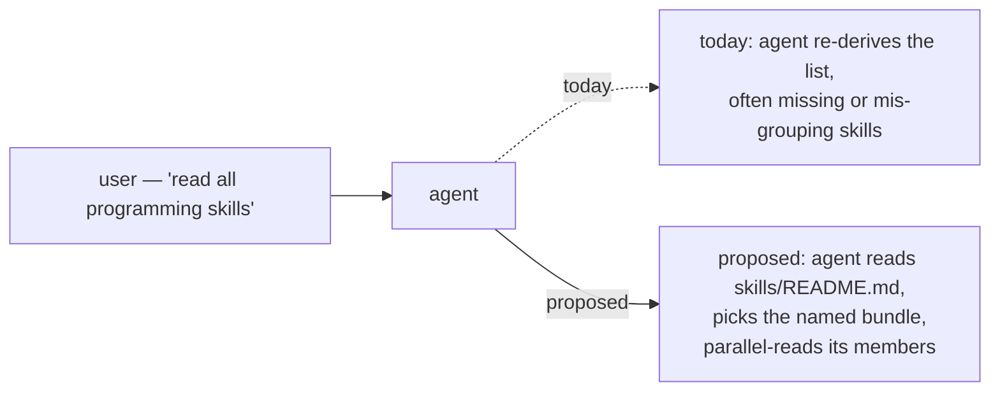
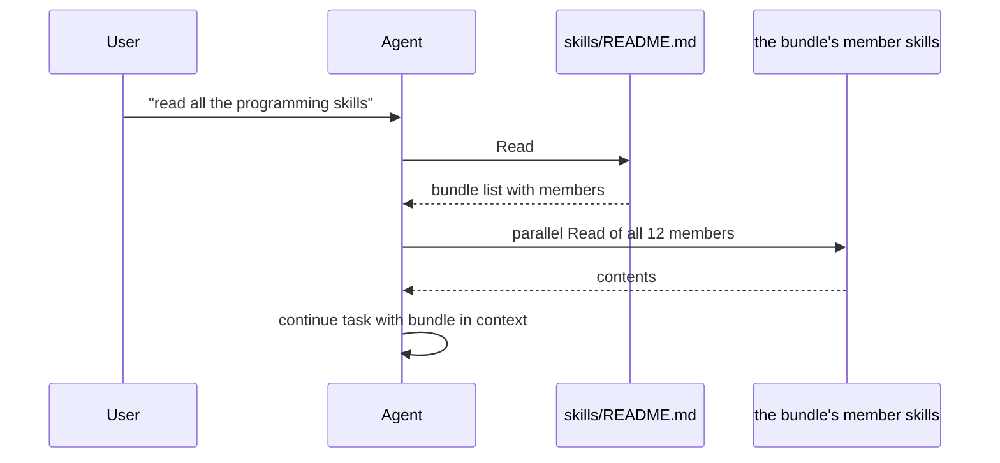

# 130 — Skill bundles

*Designer report, 2026-05-11. A single canonical index of the
workspace's skills, organized into four named bundles
(`programming`, `operational`, `role`, `specialty`) that humans
and agents can refer to by name. The index lives at
`skills/README.md`; this report frames why and what.*

---

## 0 · TL;DR

The workspace has 31 skill files at `skills/<name>.md`. They are
discoverable today only by directory listing, which is fine for
focused work but breaks down when the human wants to say *"read all
the programming skills"* or *"read all the operational skills"* in
one sentence and expect the agent to do the right thing.

Proposed: a single `skills/README.md` index file that names four
**bundles**, each carrying a one-line description and a flat list
of member skill filenames. Agents reading the index pick up the
relevant bundle's members in one parallel-Read batch.

The bundle definitions (membership confirmed by inspection of
each skill file's scope):

| Bundle | When to read | Members |
|---|---|---|
| `programming` | before writing or reviewing code in this workspace | `abstractions`, `actor-systems`, `architectural-truth-tests`, `beauty`, `contract-repo`, `kameo`, `language-design`, `micro-components`, `naming`, `push-not-pull`, `rust-discipline`, `testing` (12) |
| `operational` | before any commit, push, report, bead, skill edit, or repo creation | `autonomous-agent`, `beads`, `jj`, `nix-discipline`, `reporting`, `repository-management`, `skill-editor` (7) |
| `role` | when taking a coordination role | `designer` / `designer-assistant`, `operator` / `operator-assistant`, `system-specialist` / `system-assistant`, `poet` / `poet-assistant` (8) |
| `specialty` | when the task touches one of these surfaces | `architecture-editor` (per-repo ARCHITECTURE.md edits), `library` (citing scholarly sources), `prose` (writing as craft), `stt-interpreter` (decoding speech-to-text in prompts) (4) |

Total: 12 + 7 + 8 + 4 = 31. Matches the directory.

The mechanism is the simplest one that fits: the index file is
prose + a list of paths; reading it costs one round-trip; picking
up an entire bundle costs N parallel reads.

This convergence consolidates designer-assistant/19 §"Skill bundle
draft" (which proposed similar groupings and flagged the need for
the index) with the present design.

---

## 1 · Motivation — the implicit pattern already exists

Two existing patterns already group skills informally:

- **`lore/AGENTS.md` §"Tool basics"** groups under headings like
  *VCS / build*, *Programming discipline (cross-language)*,
  *Language style*, *Data / issues*, *CLI tools*. These are
  category labels in the AGENTS contract, but the categories are
  not named bundles you can invoke.
- **`skills/autonomous-agent.md` §"Required reading before applying
  this skill"** groups under *Coordination*, *Design discipline*,
  *Language and tooling*. These are read in sequence by the
  autonomous-agent skill itself; they're not exposed as bundles
  the workspace can refer to outside that skill.

The bundle index doesn't invent a new mechanism — it lifts the
informal grouping to a canonical, namable surface.

---

## 2 · The four bundles in detail

### 2.1 `programming` — 12 skills

*Read before writing or reviewing code, designing wire contracts,
or shaping actor topologies.*

| Skill | What it owns |
|---|---|
| `abstractions.md` | verb-belongs-to-noun; cross-language |
| `actor-systems.md` | actor-density discipline; supervised long-lived components |
| `architectural-truth-tests.md` | witness tests that prove the architecture |
| `beauty.md` | beauty as the criterion; ugliness as diagnostic |
| `contract-repo.md` | wire contracts between Rust components |
| `kameo.md` | the workspace's actor runtime (Kameo 0.20) |
| `language-design.md` | designing text notations, request languages, schemas |
| `micro-components.md` | one capability, one crate, one repo |
| `naming.md` | full English words; six narrow exceptions |
| `push-not-pull.md` | polling is forbidden; subscription primitives |
| `rust-discipline.md` | Rust-specific enforcement of all the above |
| `testing.md` | Nix-backed testing; constraints become witnesses |

### 2.2 `operational` — 7 skills

*Read before any commit, push, report, bead, skill edit, or repo
creation. The autonomy floor — these are what lets the agent act
without asking for routine obstacles.*

| Skill | What it owns |
|---|---|
| `autonomous-agent.md` | when to act without asking; routine obstacles; checkpoint reads |
| `beads.md` | when to file / claim / close / prune BEADS tasks |
| `jj.md` | version-control discipline (jj over raw git) |
| `nix-discipline.md` | flake-input forms, lock-side pinning, `nix run` over `cargo install` |
| `reporting.md` | reports vs chat; always-name-paths; inline-summary rule |
| `repository-management.md` | `gh` CLI for repo creation and metadata |
| `skill-editor.md` | conventions for editing skill files |

### 2.3 `role` — 8 skills

*Read for the role you're taking. Each role has a "what I own /
what I don't own" frame and discipline.*

| Pair | What it owns |
|---|---|
| `designer.md` / `designer-assistant.md` | architecture, skills, reports |
| `operator.md` / `operator-assistant.md` | Rust implementation, persona, sema-ecosystem |
| `system-specialist.md` / `system-assistant.md` | CriomOS, lojix-cli, horizon-rs, deploy |
| `poet.md` / `poet-assistant.md` | TheBookOfSol, prose-as-craft |

### 2.4 `specialty` — 4 skills

*Read when the task surfaces one of these specific surfaces.*

| Skill | When to read |
|---|---|
| `architecture-editor.md` | editing a per-repo `ARCHITECTURE.md` |
| `library.md` | citing scholarly sources (Sowa, Spivak, Frege, etc.) |
| `prose.md` | when prose is the craft surface (poet-shaped work) |
| `stt-interpreter.md` | decoding speech-to-text-mangled user input |

---

## 3 · How the index works

The bundle name is the interface. The membership list is in one
file. The mechanism is just file reads.

This composes with the existing required-reading discipline in
`lore/AGENTS.md` §"Required reading, in order": that list points
at specific skills today (autonomous-agent, skill-editor,
reporting, beads, jj, repository-management); a future revision
could simplify by pointing at the `operational` bundle by name.

---

## 4 · Edge cases and open questions

### 4.1 Where to land the canonical bundle reference

Three candidates considered:

- **`skills/README.md`** (chosen). Lives in the directory it
  indexes; conventional location; humans naturally look at
  README. Risk: some tooling may treat README.md specially.
- `skills/INDEX.md`. More explicit but less conventional; no
  tooling cost.
- A new section inside `lore/AGENTS.md`. Keeps skills/ flat;
  costs a workspace-AGENTS edit on every bundle change.

Chosen `skills/README.md` because the cost of README's
conventional behavior (some tools auto-display it) is low and the
benefit of finding-by-convention is real.

### 4.2 Should the index be auto-generated or hand-maintained?

Hand-maintained. The bundles are semantic groupings, not the
result of a directory scan — a skill's category isn't recoverable
from its filename, only from its content. Auto-generation would
require frontmatter tags (which workspace skills don't carry); the
cost of maintaining one index file by hand on the rare occasions a
skill moves between bundles is lower than the cost of introducing
frontmatter.

### 4.3 What about multi-bundle skills?

Some skills cross categories. `testing.md` is both programming
discipline and operational; `actor-systems.md` is both programming
and Rust-specific. The rule: **each skill appears in exactly one
bundle, in its primary home.** Cross-references between bundles
live in the skill files themselves (via `See also`), not in the
index.

The choices made above (and the reasoning):

- `testing.md` → `programming`, because it owns "constraints
  become witnesses" which is a design discipline. Operational use
  follows from the programming discipline.
- `nix-discipline.md` → `operational`, because the rule is about
  *how* the tool is used in the workspace, not about
  Nix-as-a-language-design surface.
- `actor-systems.md` → `programming`, because actors are a
  thinking discipline. `kameo.md` is the Rust-specific *how*; it
  also goes in `programming`.

### 4.4 Bundle invocation phrasing

Suggested human → agent phrasings the index recognises:

| Phrase | Bundle |
|---|---|
| "read the programming skills" / "read all programming skills" | `programming` |
| "read the operational skills" / "operational skills bundle" | `operational` |
| "read the role skills" / "all role skills" | `role` |
| "read the specialty skills" | `specialty` |

The index file itself names these phrases so an agent can
recognise the natural human shape and resolve to the bundle.

### 4.5 Should the index also list the eventual destination (skills as Sema records)?

Per `ESSENCE.md` §"Today and eventually", the eventual stack
moves much of this to Sema-native records. The current index is
explicitly today-shaped — a markdown index over markdown skill
files. When the eventual `Sema` substrate lands, the bundle
concept could become a typed record kind; until then, the
markdown index is the right shape.

---

## 5 · Adoption — what changes

Lightweight. Two file changes:

1. **New: `skills/README.md`** — the index. ~50 lines. See the
   companion `skills/README.md` landing alongside this report.
2. **No edits to existing skill files.** Bundle membership lives
   only in the index.

Optional follow-ups (not in scope for this landing):

- `lore/AGENTS.md` §"Required reading" could be simplified to
  point at the `operational` bundle by name.
- `skills/autonomous-agent.md` §"Required reading before applying
  this skill" could similarly point at bundles.

The index is the load-bearing change; the simplifications are
nice-to-have.

---

## 6 · Convergence with designer-assistant/19

DA's report at
`reports/designer-assistant/19-persona-engine-sandbox-auth-research.md`
§"Skill bundle draft" independently proposed two bundles
(`programming-skills`, `operational-skills`) plus a workspace-
content reading list (`persona-architecture-current`) and noted:
*"This wants a small skill or protocol addition later, probably
`skills/reading-bundles.md`, so humans can say 'read the
programming skills' without every agent re-deriving the list."*

This report adopts DA's two-bundle naming as the kernel, adds the
`role` and `specialty` bundles to cover the rest of the skills
directory, and lands the index at `skills/README.md` rather than
a new `skills/reading-bundles.md` file (one fewer file; lives
where humans look first).

DA's third proposed bundle, `persona-architecture-current`, is a
**reading list of architecture documents** rather than a skill
bundle. It belongs in `protocols/active-repositories.md` (or a
new dedicated file), not in `skills/README.md` which indexes
skill files specifically. Out of scope here; flagged for a
follow-up.

---

## 7 · Constraints (witness seeds)

For the bundle index itself:

1. `skills/README.md` lists every file under `skills/<name>.md`
   in exactly one bundle. A scan of the directory finds no
   skill missing from the index and no bundle naming a non-
   existent skill (`skills_readme_lists_each_skill_exactly_once`).
2. Bundle names are stable. Once `programming` / `operational` /
   `role` / `specialty` are established, renaming a bundle is a
   coordinated change with documentation updates
   (`bundle_names_do_not_drift_silently`).

These are documentation invariants, not Nix-flake witnesses;
they apply at every periodic skill-directory review (per
`skills/reporting.md` §"Hygiene").

---

## 8 · Open questions

| # | Question | Owner |
|---|---|---|
| Q1 | Should the `role` bundle be auto-loaded based on the active lock file (e.g. when `designer.lock` is non-empty, auto-read `designer.md` + `designer-assistant.md`)? Currently the rule is: read the role skill manually when claiming. The auto-load would be a tooling addition in `tools/orchestrate`. | designer + system-specialist |
| Q2 | DA's `persona-architecture-current` reading list (architecture docs, not skills) — where does it land? Candidates: `protocols/architecture-reading-list.md`, an addition to `protocols/active-repositories.md`, or a new section in `lore/AGENTS.md`. | designer |
| Q3 | When a new skill lands, the responsibility for updating `skills/README.md` is the skill author's. Is that explicit enough, or should `skills/skill-editor.md` add a "Update the bundle index" step? | designer |

---

## See Also

- `~/primary/skills/README.md` — the bundle index this report
  proposes (lands alongside).
- `~/primary/skills/skill-editor.md` — conventions for editing
  skills; sister of this report's index.
- `~/primary/lore/AGENTS.md` §"Tool basics" — the informal
  category grouping that this index lifts to canonical form.
- `~/primary/skills/autonomous-agent.md` §"Required reading
  before applying this skill" — the in-skill grouping pattern
  this index parallels.
- `~/primary/reports/designer-assistant/19-persona-engine-sandbox-auth-research.md`
  §"Skill bundle draft" — DA's parallel proposal; substance
  consolidated in §6.
- `~/primary/ESSENCE.md` §"Rules find their level" — where this
  rule lives: workspace-cross-cutting, hence at
  `skills/README.md` rather than per-repo `skills.md`.
