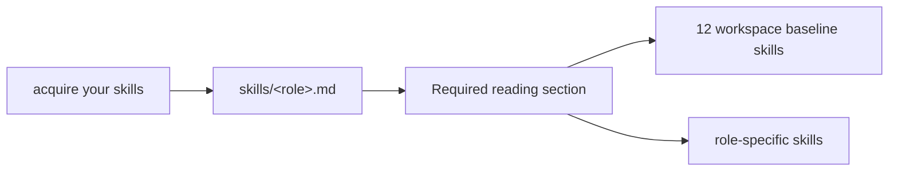

# 131 — Role as Skill Bundle

*Roles own their required reading lists. The four-bundle
abstraction proposed in `reports/designer/130-skill-bundles.md`
is retired; this report supersedes it. Beads file under the
main role only — there are no `role:*-assistant` labels.*

---

## TL;DR

The roles are the bundles. Each role's `skills/<role>.md` file
now carries an explicit `## Required reading` section listing
every workspace skill mandatory for agents acting in that role.
The previous four-bundle abstraction (programming, operational,
role, specialty) is retired along with `skills/README.md` and
`reports/designer/130-skill-bundles.md`.

The companion rule: BEADS work items are filed under main-role
labels only (`role:operator`, `role:designer`,
`role:system-specialist`, `role:poet`). Assistants share their
main role's bead pool — there are no `role:*-assistant`
labels. Lock files remain per-agent.

---

## Why the bundle abstraction was the wrong shape

The four-bundle scheme classified workspace skills by topic:
*programming, operational, role, specialty*. Reading "all the
programming skills" resolved to twelve files via an intermediate
`skills/README.md` index.

The user's clarification (2026-05-12): **the roles already are
the bundles.** A designer needs the skills relevant to designing.
An operator needs the skills relevant to implementing. A poet
needs the skills relevant to writing. The role IS the discipline
context that decides which skills load. The bundle scheme split
that single decision into two layers — first pick a bundle, then
map bundle → skills — which was indirection without value. The
agent never wanted "all programming skills" abstractly; they
wanted "the skills I need to be effective at this role."

The user's quote: *"These are the roles. I don't know why I was
reaching for something else. These are the roles."*

---

## The role-as-bundle model

Each role's skill file gains a `## Required reading` section
listing every workspace skill mandatory for that role. The
section is exhaustive: workspace baseline + role contracts +
role-specific discipline.

### Workspace baseline (every role reads these 12)

| Skill | Why universal |
|---|---|
| `ESSENCE.md` | workspace intent; upstream of every rule |
| `lore/AGENTS.md` | canonical workspace contract |
| `protocols/orchestration.md` | role coordination protocol |
| `skills/autonomous-agent.md` | gateway skill; routine obstacles |
| `skills/beauty.md` | aesthetic discipline applies everywhere |
| `skills/naming.md` | naming applies everywhere |
| `skills/jj.md` | every role commits |
| `skills/reporting.md` | every role writes reports |
| `skills/beads.md` | every role interacts with beads |
| `skills/skill-editor.md` | every role may edit a skill |
| `skills/repository-management.md` | gh / ghq usage |
| `skills/stt-interpreter.md` | decoding STT-mangled user prompts |

### Per-role additions

| Role | Adds | Skips |
|---|---|---|
| `designer` | every other workspace skill (the role's authority IS breadth) | nothing |
| `operator` | programming discipline; cross-role designer contract | `prose`, `library` |
| `system-specialist` | platform discipline + Rust as applied to host tools | `prose`, `library` |
| `poet` | `prose`, `library` | programming discipline |

The designer reads every skill — including `prose.md` and
`library.md` — because the designer is the role that holds the
cross-cutting view. The poet is the most focused — their
surface barely overlaps with programming.

### Assistants

Each assistant's reading list is identical to its main role's.
The assistant does the same work as the main role; the
discipline is the same; the reading list is the same. The
assistant skill file states this explicitly and repeats the
list inline so a fresh agent reading
`skills/<role>-assistant.md` doesn't have to chase pointers.

---

## Beads belong to main roles, not assistants

The companion rule. BEADS work items are filed under
**main-role** labels only. The four labels are
`role:operator`, `role:designer`, `role:system-specialist`, and
`role:poet`. There are no `role:*-assistant` labels.

The reason: an assistant does the same kind of work as its main
role. A bead filed under `role:system-assistant` is invisible
to the system specialist agent who could pick it up; a bead
filed under `role:system-specialist` is visible to both. The
discipline pool — main role plus any assistants stacked under
it — sees the same beads.

The rule generalises. If a future second-assistant or
third-assistant ever appears under one main role, beads still
file under the main role. Lock files remain per-agent (an
assistant edits its own lock), because locks name *who is
actively touching what right now* — which is per-agent. Beads
pool at the discipline level.

The user's quote: *"If the operator assistant needs work, he
should work on the operator beads. And if he needs to bead work
for himself, he should file it as an operator bead."*

### Existing assistant-labeled beads — migrated in this sweep

Three open beads carried `role:*-assistant` labels under the
prior convention; two more carried `@operator-assistant`
assignees. All five were migrated as part of this sweep:

| Bead | Before | After |
|---|---|---|
| `primary-75t` | `role:operator-assistant` | `role:operator` |
| `primary-ddx` | `role:operator-assistant` | `role:operator` |
| `primary-mm0` | `role:system-assistant` | `role:system-specialist` |
| `primary-aww` | `@operator-assistant` | `@operator` |
| `primary-3ro` | `@operator-assistant` | `@operator` |

Title prefixes that read `operator-assistant:` on
`primary-aww` and `primary-3ro` are left in place — they are
historical text that doesn't mislead under the new rule, and
per `skills/beads.md` §"Stale internal references in bead
descriptions" bead descriptions are a timestamp of what was
true when filed, not an ongoing accuracy contract.

---

## Files changed in this sweep

| File | Change |
|---|---|
| `AGENTS.md` | Step 4 of "Required reading, in order" now points at the role file |
| `skills/designer.md` | "Required reading" section added (exhaustive) |
| `skills/operator.md` | "Required reading" section added |
| `skills/system-specialist.md` | "Required reading" section replaced with explicit list |
| `skills/poet.md` | "Required reading" section added |
| `skills/designer-assistant.md` | "Required reading" updated to match main role + active-beads note |
| `skills/operator-assistant.md` | same shape |
| `skills/system-assistant.md` | same shape |
| `skills/poet-assistant.md` | same shape |
| `skills/autonomous-agent.md` | §"Role-tag convention" updated: main-role labels only |
| `protocols/orchestration.md` | §"Beads belong to main roles, not assistants" added |
| `skills/README.md` | deleted (bundle index no longer needed) |
| `reports/designer/130-skill-bundles.md` | deleted (superseded by this report) |

---

## See also

- `~/primary/ESSENCE.md` — workspace intent.
- `~/primary/protocols/orchestration.md` §"Beads belong to main
  roles, not assistants" — the companion rule's canonical home.
- `~/primary/skills/autonomous-agent.md` §"Role-tag convention"
  — the bead-label convention.
- The four main role skill files for the canonical reading
  lists:
  - `~/primary/skills/designer.md`
  - `~/primary/skills/operator.md`
  - `~/primary/skills/system-specialist.md`
  - `~/primary/skills/poet.md`
