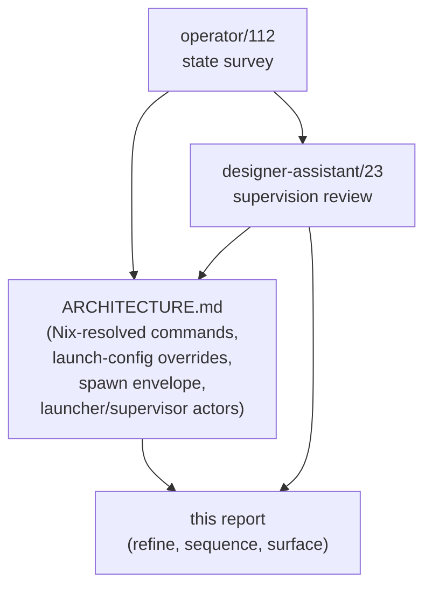
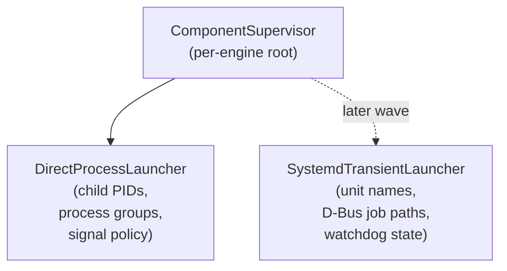
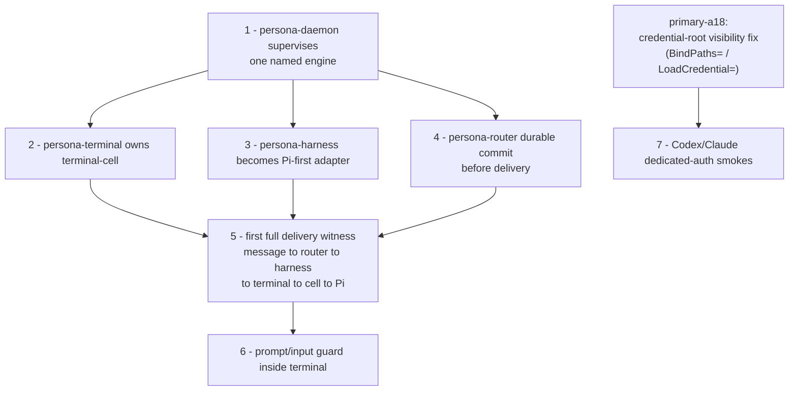

# 132 — Persona engine supervision shape

*Designer review. Reads `reports/operator/112-persona-engine-work-state.md`
(operator's engine-state survey, 2026-05-12) in light of the edited
`/git/github.com/LiGoldragon/persona/ARCHITECTURE.md` and
`reports/designer-assistant/23-persona-daemon-supervision-and-nix-dependency-review.md`
(designer-assistant's hybrid-supervision and Nix-dependency analysis).
Affirms the shape both recommend; refines the backend abstraction and
the proposed actor-tree naming; sequences the next implementation work;
surfaces the design questions that belong in follow-up reports.*

---

## TL;DR

Three documents converge on the same diagnosis. `persona` has good
foundations — daemon-first CLI, `EngineManager` and `ManagerStore`
Kameo actors, `EngineLayout` with `EngineId`-scoped state/socket paths,
the dev-stack and terminal-cell sandbox witnesses — but the component
supervisor that turns the daemon into a real engine manager has not
landed yet.

The edited `ARCHITECTURE.md` and
`reports/designer-assistant/23-persona-daemon-supervision-and-nix-dependency-review.md`
land the shape: Nix-resolved component commands, narrow per-component
launch-config overrides, a resolved `ComponentSpawnEnvelope` carrying
executable path + argv + environment + state path + socket path +
socket mode + peer socket paths, and Kameo launcher / supervisor
actors that own child-process lifecycle — with a direct-process
backend first and a systemd-transient backend later, both behind the
same actor boundary. The eight new architectural-truth tests in
`ARCHITECTURE.md` §9 (e.g.
`persona-component-commands-resolve-from-nix-closure`,
`persona-spawn-envelope-carries-resolved-component-command`,
`persona-component-launcher-does-not-block-manager-mailbox`,
`persona-engine-sandbox-binds-dedicated-credential-root`) make the
constraints falsifiable.

This designer review:

- **Affirms** the supervision shape in
  `reports/designer-assistant/23-persona-daemon-supervision-and-nix-dependency-review.md`
  and the `ARCHITECTURE.md` edits.
- **Refines** the backend abstraction (separate launcher actor types,
  not one actor with an enum-typed backend field).
- **Refines** the proposed actor-tree naming per
  `~/primary/skills/kameo.md` §"Naming actor types".
- **Sequences** the next implementation work per `operator/112` §8.
- **Names** the design questions that belong in follow-up reports,
  not inside the next implementation pass.

---

## 1 — What `operator/112` reads correctly

`operator/112` cleanly separates *what is real* from *what is not yet*,
and its diagnosis matches what designer-assistant/23 found independently.

Real and worth keeping:

| Surface | Why it's load-bearing |
|---|---|
| Daemon-first `persona` CLI: one NOTA request → one `signal-persona` frame → one NOTA reply | Settles the runtime-state question per `~/primary/skills/rust-discipline.md` §"CLIs are daemon clients" — CLIs are clients; daemons own state. |
| `EngineManager` Kameo actor with typed `Message<T>` per request | Native Kameo shape per `~/primary/skills/kameo.md` §"The core shape" — `Self` IS the actor; no behavior-marker / state split. |
| `ManagerStore` Kameo writer actor over `manager.redb` | First architectural witness that "manager mutations go through the writer actor"; the constraint becomes a falsifiable test (`persona-manager-store-writes-engine-status-through-writer-actor`). |
| `EngineLayout` derives per-engine state paths, socket paths, modes, peer socket lists | Settles the resource-scoping question — `EngineId` is a typed boundary, not a string convention. |
| `persona-engine-sandbox-dev-stack-smoke` running real `persona-router-daemon` and `persona-terminal-daemon` under `systemd-run --user` | Witness scaffolding that catches the lie when one of the bundled binaries doesn't actually run. |
| Terminal-cell sandbox with deterministic + Pi-live variants; Pi marker-transform test | Proves the raw terminal primitive runs inside the sandbox, and the marker-transform shape proves the harness actually responded (the failure mode that "accept your own prompt as success" used to hide). |

Honestly named gaps:

| Gap | Why it matters now |
|---|---|
| Daemon does not spawn or supervise component processes. | The "engine manager" name is aspirational until the daemon owns at least one named engine's component federation. |
| `ManagerStore` persists a minimal `(EngineId, EngineStatus)` record, not the catalog. | The catalog is the structural noun the manager exists to own; today's redb is a write-only journal. |
| Terminal-cell sandbox bypasses `persona-terminal`. | The witness proves the *raw primitive* runs, not the Persona delivery path. |
| Sandbox runner contains harness-specific knowledge (Pi packaging, snapshot policy). | That knowledge wants to migrate into `persona-harness` once `persona-harness` exists as a daemon. |
| Hand-written NOTA in shell scripts. | Acceptable as witness scaffolding, not as the production wire path. |
| No production NixOS module / `persona` system-user service. | Sandbox witnesses prove the bits work; deployment-as-systemd-service is system-specialist's lane and is genuinely not landed. |

The diagnostic value of `operator/112` is its refusal to confuse
*foundations* with *engine*. The foundations are real; the engine is
not. Both statements are true at once and need to be held that way.

---

## 2 — What `designer-assistant/23` settles

`reports/designer-assistant/23-persona-daemon-supervision-and-nix-dependency-review.md`
takes the gap `operator/112` named most sharply — *the daemon doesn't
supervise components* — and converts it into a settled architectural
shape. The substance it lands:

**Hybrid supervision.** systemd owns the host-level `persona` daemon
as a service unit (system-specialist's lane, future work). Inside the
daemon, component lifecycle lives behind a Kameo launcher / supervisor
actor. This matches `~/primary/skills/actor-systems.md` §"Runtime
roots are actors" — the daemon process is one actor root, and
per-engine component supervision is its own actor plane.

**Nix-resolved component commands.** Default component executables
come from the persona flake closure (the production NixOS module, in
the deployed shape). The host's ambient `PATH` is not the resolver.
This matches `~/primary/skills/nix-discipline.md` §"Use `nix run
nixpkgs#<pkg>` for missing tools" — Nix-managed end-to-end.

**Narrow launch-config overrides.** A NOTA `PersonaEngineLaunchConfig`
record may provide `ComponentCommandOverride` entries keyed by closed
component kind. Omitted components use the Nix default. Resolution
fails closed if a required component is missing or ambiguous.

**Resolved `ComponentSpawnEnvelope`.** The spawn envelope is the typed
record that crosses the launcher → child boundary, carrying executable
path + argv + environment + state path + socket path + socket mode +
peer socket paths. Components do not discover peers by scanning the
filesystem.

**Direct-process backend first, systemd-transient backend later.**
The direct-process launcher owns process groups, readiness state,
kill-on-drop, restart tracing, and reverse-order shutdown. A systemd
unit-based backend becomes a later choice driven by genuine
cgroup-cleanup / `LoadCredential` / namespace-sandbox / journald-unit
/ `WatchdogSec` needs.

**Sandbox credential-root visibility fix.** `ReadWritePaths=` is
not a visibility mechanism when `ProtectHome=tmpfs` hides the parent.
Use `BindPaths=` or `LoadCredential=`. The fix lives at the sandbox
runner level and gates the prompt-bearing Codex/Claude live-auth
smokes (BEAD `primary-a18`, "bind credential root and add provider
auth smoke").

The `ARCHITECTURE.md` edits land all of these as named constraints
with named architectural-truth tests (see §9, the eight new
`persona-component-commands-*`, `persona-launch-config-*`,
`persona-spawn-envelope-*`, `persona-component-launcher-*`,
`persona-engine-sandbox-binds-dedicated-credential-root` checks).

The shape is the right shape. The rest of this report refines and
sequences, not contests.

---

## 3 — Refinements

### 3.1 — Backend abstraction: two launcher actor types, not one with an enum

`designer-assistant/23` §3 ("Recommended Shape") proposes a single
launcher / supervisor actor whose backend is a
`ComponentProcessBackend { DirectProcess, SystemdTransientUnit }`
enum field.

**The cleaner shape: two launcher actor types speaking the same
message vocabulary.** `DirectProcessLauncher` carries child PIDs,
process groups, signal-disposition policy. `SystemdTransientLauncher`
carries unit names, D-Bus job paths, watchdog state. Both implement
the same `Message<Spawn>`, `Message<Stop>`, `Message<Restart>`
shapes; they do not share state.

The argument: per `~/primary/skills/actor-systems.md` §"Self IS the
actor", the actor type *is* the data-bearing noun; collapsing two
distinct data shapes into one actor with an enum-typed field is the
`Item / ItemDetails` smell flagged by
`~/primary/skills/rust-discipline.md` §"One type per concept" (when
two variants carry materially different fields, the base type was
designed too thin — split the type). The two backends are different
things; name is identity.

The trait that abstracts them — if and when — emerges from real
working code. Don't pre-design `LauncherBackend` as a trait before
the second backend is being implemented; that is the
speculative-abstraction shape `operator/103` already retired (the
`persona-actor` / `workspace-actor` wrapper-crate retirement —
abstractions earn their place after the second concrete consumer
exists, not before).

For the first wave, ship `DirectProcessLauncher` as a concrete actor
type. Name a future bead for the systemd-backend shape when
cgroup / credential / sandbox needs become load-bearing.

### 3.2 — Actor-tree naming per `~/primary/skills/kameo.md`

`operator/112` §3.4 sketches the missing actor planes:
`EngineManagerRoot`, `IngressActor`, `CatalogActor`, `LifecycleActor`,
`SpawnEnvelopeActor`, `ComponentSupervisorActor`,
`HealthObservationActor`, `ManagerStoreActor`.

The planes are well chosen. The names need a sweep before they land,
per `~/primary/skills/kameo.md` §"Naming actor types" — the `*Actor`
suffix is framework-category tagging, not role-naming, and the
historical drift toward it came from frameworks where the behavior
marker and the state struct were separate types. In Kameo, where
`Self` IS the actor, the suffix becomes noise.

Suggested first pass:

| operator/112 sketch | Suggested | Why |
|---|---|---|
| `EngineManagerRoot` | `EngineManagerRoot` ✓ | `Root` is relationship-naming (this IS the root of the actor tree); keep. |
| `IngressActor` | `EngineRequestIngress` or `RequestReader` | `*Ingress` carries role meaning; drop the `*Actor` framework tag. |
| `CatalogActor` | `EngineCatalog` | The state IS the catalog; the type carries it. |
| `LifecycleActor` | `LifecycleSupervisor` (if supervising) or `EngineLifecycle` | Be honest about whether it supervises or just tracks state. Per `~/primary/skills/actor-systems.md` §"Phase actors are the second exception", forwarding-only types want `*Phase` not `*Supervisor` (and `*Supervisor` must actually supervise — name the type by what it does). |
| `SpawnEnvelopeActor` | `SpawnEnvelopeBuilder` | Per `~/primary/skills/actor-systems.md` §"Actor per plane" — the canonical `EnvelopeBuilder` is the cataloged name. |
| `ComponentSupervisorActor` | `ComponentSupervisor` | Already role-naming; drop the framework-category suffix. |
| `HealthObservationActor` | `ComponentHealthMonitor` | Name what it does (monitor health), not which framework category it falls in. |
| `ManagerStoreActor` | `ManagerStore` | Already the in-code name; ✓. |

Pick actual names when the wiring lands; the rule is *drop the
`*Actor` suffix when it's category-tagging rather than role-naming*.

### 3.3 — Sequencing the next work

`operator/112` §8 lists seven priorities. The right order, with what
each step costs and what it unblocks:

`(1)` blocks everything: until `persona-daemon` supervises at least
one engine's components, there is no engine to deliver into. `(2)`
and `(3)` proceed in parallel once `(1)` lands. `(4)` is operator's
work inside `persona-router` and runs in parallel with `(2)` and
`(3)`. `(5)` is the first cross-component witness and reveals where
the contracts need refinement. `(6)` lives inside `persona-terminal`
per the architecture's current disposition — the gate that prevents
prompt/input interleaving belongs at the terminal-cell write
boundary, not earlier in the chain. `(7)` is independent of `(5)`
but blocks on the credential-root sandbox fix (`primary-a18`).

The terminal-cell sandbox runner today bypasses `persona-terminal`
on purpose — it proves the raw primitive. Once `persona-terminal`
owns the cell, the sandbox's terminal-cell lane retargets at
`persona-terminal`, and the direct-cell witness becomes a regression
test, not the main path.

### 3.4 — Shell scaffolding is not the runtime

`operator/112` §3.1 and §7.3 worry about the sandbox runner's shell
debt: scripts that hand-write NOTA, supervise via `setsid` / `kill` /
`trap`, and contain harness-specific knowledge of Pi. The right
disposition:

- **Shell stays as witness scaffolding.** A test script that proves a
  real binary starts, leaves an inspectable artifact, and matches an
  expected pattern is appropriate per
  `~/primary/skills/architectural-truth-tests.md` §"Nix-chained tests
  — the strongest witness" (separating writer and reader across two
  derivations makes in-memory faking impossible).
- **Shell never becomes the runtime architecture.** The harness-
  specific knowledge migrates into `persona-harness` as that
  component matures. The hand-written NOTA migrates into typed Rust
  records rendered by `nota-codec`.
- **The migration is per-actor, not one rewrite.** Each shell
  responsibility moves into its owning component when that component
  is ready. `persona-engine-sandbox` shrinks as the components grow;
  it does not get a single "big rewrite" milestone.

The terminal-cell Pi smoke (`operator/112` §2.4) — where the marker
bug surfaced and was fixed by requiring the harness to *transform*
the prompt rather than echo it — is the load-bearing example of the
right posture. That is exactly the architectural-truth shape per
`~/primary/skills/architectural-truth-tests.md` §"Rule of thumb —
the test name pattern" (`x_cannot_happen_without_y`). Keep that
posture; just move the wiring into the owning components as they
mature.

---

## 4 — What this report does not settle (later work)

The following design questions deserve their own designer reports
and should not be answered inside the next implementation pass:

| Question | Where it belongs |
|---|---|
| The full `ManagerStore` catalog shape: engine definitions, component desired state, process identity, socket paths, spawn-envelope history, lifecycle observations, health, route declarations, restart/shutdown activity (`operator/112` §3.3). | `reports/designer/<N>-manager-catalog-design.md`, written before the catalog grows past its current single-status shape. |
| The typed `ManagerEvent` model. `operator/112` §7.2 names the current `ManagerEvent` enum as a "trace scaffold" — the real event model is its own design: typed lifecycle facts (component requested, spawned, socket bound, exited, restart scheduled). | Same future report or its successor — write it before the catalog grows. |
| Inter-engine route declarations. `ARCHITECTURE.md` §1.6 names the route as a "typed, manager-owned record" but defers the approval contract to the auth/route wave. | Future report when cross-engine routing is the next surface; pairs with the criome-shaped identity work, not with persona's day-to-day. |
| `ComponentSupervisor` restart policy: what causes restart vs. report-and-park? Per `~/primary/skills/kameo.md` §"Supervision", `RestartPolicy::Permanent` reconstructs from `Args`, not from mutated memory — so the policy choice depends on whether the failed child's state is durable. | Decided per-component as each is supervised. Direct-process launcher tests should include a failure-injection case per `~/primary/skills/architectural-truth-tests.md` §"Witness catalogue". |
| Prompt-input guard: lives in `persona-terminal` (the current `ARCHITECTURE.md` disposition — terminal-cell input safety belongs at the terminal write boundary) or in `persona-router` (which knows delivery state and adjudicates whether a message is deliverable)? | Settled when `persona-terminal` and `persona-router` both daemonize and the first delivery witness reveals the seam. Until then, keep the gate in `persona-terminal` per the current architecture. |

Surfacing these here keeps the next implementation pass focused on
shipping the supervisor, not on debating these openings.

---

## 5 — What this report affirms in one sentence

The supervision shape `reports/designer-assistant/23-persona-daemon-supervision-and-nix-dependency-review.md`
describes is the right shape; the `ARCHITECTURE.md` edits land it; the
next implementation pass implements direct-process launching behind a
typed `ComponentSupervisor` actor and spawns one named engine's
components from a Nix-resolved `ComponentSpawnEnvelope`. Everything
else waits for the manager to actually be a manager.

---

## See also

- `~/primary/reports/operator/112-persona-engine-work-state.md` — the
  state survey this report responds to (foundations real, engine
  not-yet, prioritized next-work list).
- `~/primary/reports/designer-assistant/23-persona-daemon-supervision-and-nix-dependency-review.md`
  — the hybrid supervision + Nix dependency review whose
  recommendations this report affirms and refines.
- `/git/github.com/LiGoldragon/persona/ARCHITECTURE.md` — the apex
  architecture, now carrying the supervision / launch-config / spawn-
  envelope constraints and the eight new architectural-truth tests
  (`persona-component-commands-*`, `persona-launch-config-*`,
  `persona-spawn-envelope-*`, `persona-component-launcher-*`,
  `persona-engine-sandbox-binds-dedicated-credential-root`).
- `~/primary/skills/actor-systems.md` §"Self IS the actor",
  §"Runtime roots are actors", §"Actor or data type", §"Phase actors
  are the second exception" — the discipline applied to the
  backend-shape refinement and the actor-tree naming.
- `~/primary/skills/kameo.md` §"Naming actor types",
  §"Public consumer surface — ActorRef<A> or domain wrapper",
  §"Supervision" — the naming pass referenced in §3.2 and the
  restart-policy framing referenced in §4.
- `~/primary/skills/rust-discipline.md` §"One type per concept" —
  why two launcher actor types beats one with an enum-typed
  backend field.
- `~/primary/skills/architectural-truth-tests.md` §"Rule of thumb —
  the test name pattern", §"Nix-chained tests — the strongest
  witness" — the test-shape posture the sandbox runner already lives
  by and should keep as components mature.
- BEAD `primary-a18` — "bind credential root and add provider auth
  smoke"; gates the Codex/Claude live-auth smokes (§3.3 priority 7).
