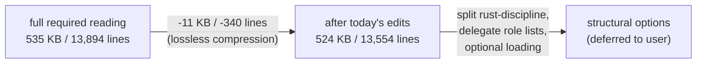

# 133 — Skill Set Context Budget

*The designer's required reading consumes ~535 KB / ~135–170 K
tokens before any work begins. This report names what was
compressed without semantic loss today, what the field's evidence
says about optional loading, and the structural questions only the
user can decide.*

---

## TL;DR

The required-reading set the designer loads (`AGENTS.md` →
`ESSENCE.md` → `repos/lore/AGENTS.md` → `protocols/orchestration.md`
→ 30 workspace skills) totals **535,328 bytes / 13,894 lines** —
roughly **135–170 K tokens** depending on tokenizer. On Codex CLI
(default `project_doc_max_bytes = 32 KiB`, ~256 K context window)
this consumes a substantial fraction of the working window before
the agent reads a single repo file.

The field's evidence on **optional loading** is observational, not
empirical. Anthropic's own Skills documentation recommends
progressive disclosure but provides no measurement of agent
compliance — only "iterate based on observations." The user's
direct experience matches: optional reading tends to be skipped
when needed. The training-force-preserving lever is therefore
**lossless compression** of mandatory reading, plus a structural
question about whether some files can move to "load if relevant"
without losing the rule's bite.

Today's surgical compressions (rust-discipline.md, kameo.md,
actor-systems.md, designer.md) saved **~11 KB / ~340 lines** by
collapsing cross-file conceptual duplication. The bigger savings
require structural choices that need user decision (§4).

---

## 1 — The problem named precisely

The workspace's role-as-skill-bundle discipline (per
`reports/designer/131-role-as-skill-bundle.md`: each role's
`skills/<role>.md` carries an explicit Required reading list of
every workspace skill mandatory for that role) makes the loading
set declarative and reproducible. Good. The cost is that the
designer's list is exhaustive — designer reads every workspace
skill.

Per-file sizes (sorted, current state, post-today's edits):

| File | Bytes | Lines |
|---|---|---|
| `ESSENCE.md` | 34,449 | 786 |
| `skills/kameo.md` | 39,939 | 1,023 |
| `skills/rust-discipline.md` | 46,647 | 1,143 |
| `skills/reporting.md` | 24,466 | 705 |
| `skills/contract-repo.md` | 26,115 | 615 |
| `skills/designer.md` | 18,681 | 501 |
| `skills/actor-systems.md` | 18,671 | 482 |
| `skills/architectural-truth-tests.md` | 16,723 | 387 |
| `skills/operator.md` | 17,746 | 483 |
| `skills/autonomous-agent.md` | 18,993 | 465 |
| `repos/lore/AGENTS.md` | 18,960 | 490 |
| `skills/jj.md` | 15,542 | 462 |
| `skills/naming.md` | 15,230 | 389 |
| `skills/abstractions.md` | 14,865 | 363 |
| `skills/language-design.md` | 14,595 | 376 |
| `protocols/orchestration.md` | 14,580 | 344 |
| `skills/nix-discipline.md` | 14,009 | 404 |
| `skills/beads.md` | 12,179 | 357 |
| `skills/system-specialist.md` | 11,940 | 307 |
| (… 16 more files, each under 12 KB) | | |
| **Total** | **~524 KB** | **~13,554** |

Three concentrations stand out: `rust-discipline.md` + `kameo.md` =
**86 KB / 2,166 lines** (the Rust-runtime pair); `ESSENCE.md` +
`repos/lore/AGENTS.md` + `protocols/orchestration.md` = **68 KB**
(the apex/contract pair); `reporting.md` + `contract-repo.md` =
**51 KB** (two large discipline files).

---

## 2 — What the field's evidence says

### Anthropic Skills (progressive disclosure)

Anthropic's published model: three loading levels —
- **Always loaded**: YAML frontmatter (name, description) of every
  installed skill, ~100 tokens each.
- **Loaded when relevant**: SKILL.md body, only after the agent
  decides the skill applies.
- **Loaded on demand**: linked files (`reference.md`, `forms.md`,
  etc.), only when the SKILL.md body navigates to them.

Anthropic recommends **SKILL.md body under 500 lines** and
splitting into separate files past that. The discovery mechanism
is the YAML description: the agent reads ~100 tokens of metadata
per skill at startup, reasons about relevance, and pulls in the
body only if it decides the skill applies.

The critical evidence question — *do agents actually read the
optional files when they should?* — is unanswered. Anthropic's
own best-practices doc explicitly says: *"Monitor how Claude uses
your skill in real scenarios and iterate based on observations:
watch for unexpected trajectories or overreliance on certain
contexts."* That is the language of "we don't know empirically;
we recommend iterative testing."

### Codex CLI AGENTS.md

OpenAI Codex applies a hard cap: `project_doc_max_bytes = 32 KiB`
by default. Files discovered later in the walk (more
project-specific) are dropped if the budget is already spent.
Their guidance: **keep global AGENTS.md under 2–3 KB** so
project-level files always fit.

This is *automatic context shedding*, not progressive disclosure —
Codex doesn't reason about relevance, it just truncates.

### The user's direct experience

Matches the field's caveat: agents tend not to read optional
documentation when they need it. The whole reason Anthropic
invests in the YAML-description discovery mechanism is that
without it, optional content tends to be invisible. Without that
mechanism (and the workspace doesn't currently have one), making
a skill "optional" is closer to making it absent.

### What this means for the workspace

Three implications:

1. **Lossless compression is unambiguously good.** Reduce the
   mandatory set's footprint where the substance can survive
   compression. This is what today's edits do.
2. **Optional loading is risky without a discovery mechanism.**
   Moving a skill from "required" to "load if relevant" likely
   means it stops being read.
3. **Structural splits help only if the split files become
   genuinely on-demand.** A `rust-discipline/` directory whose 8
   files are all required reading saves nothing — same total bytes,
   one more layer of indirection.

---

## 3 — Today's edits (lossless compression)

Five surgical edits collapsed cross-file conceptual duplication
where the same rule lived in two skills already in the required
reading set. The substance migrated to its canonical home; the
duplicating site became a short pointer.

| File | Section | Before | After | Saved |
|---|---|---|---|---|
| `skills/rust-discipline.md` | "Methods on types, not free functions" | ~52 lines | ~25 lines | ~27 lines |
| `skills/rust-discipline.md` | "No ZST method holders" | ~63 lines | ~33 lines | ~30 lines |
| `skills/rust-discipline.md` | "Naming — full English words" | ~33 lines | ~16 lines | ~17 lines |
| `skills/rust-discipline.md` | "No crate-name prefix on types" | ~30 lines | ~9 lines | ~21 lines |
| `skills/rust-discipline.md` | "Actors: logical units with kameo" | ~85 lines | ~30 lines | ~55 lines |
| `skills/kameo.md` | "Naming actor types" | ~56 lines | ~25 lines | ~31 lines |
| `skills/actor-systems.md` | "Rust shape" | ~56 lines | ~21 lines | ~35 lines |
| `skills/designer.md` | "Universal capability, preserved capacity" | ~68 lines | ~37 lines | ~31 lines |
| `skills/designer.md` | "The designer's tool kit" | ~78 lines | ~17 lines | ~61 lines |
| **Total** | | | | **~308 lines / ~11 KB** |

Verified file-size diffs:

| File | Before | After | Δ |
|---|---|---|---|
| `skills/rust-discipline.md` | 51,955 | 46,647 | −5,308 |
| `skills/kameo.md` | 40,599 | 39,939 | −660 |
| `skills/actor-systems.md` | 20,157 | 18,671 | −1,486 |
| `skills/designer.md` | 22,276 | 18,681 | −3,595 |
| **Total** | **134,987** | **123,938** | **−11,049** |

The compression preserved all training force: in every case the
rule's canonical home remained intact (`naming.md` keeps the
offender table; `abstractions.md` keeps the Karlton bridge;
`kameo.md` keeps the actor-naming table). The duplicating sites
collapsed to a one-paragraph pointer plus the language-specific
example or enforcement clause.

The 11 KB savings is **~2.1% of the total set** — modest but free
in the sense that no rule disappeared from any agent's reach.

---

## 4 — Structural questions (deferred to user)

Where the bigger savings live. Each is a structural choice with a
real tradeoff; none should land without user direction.

### 4.1 — Split `rust-discipline.md` into a directory

`rust-discipline.md` is 46 KB / 1,143 lines after today's edits —
still the largest file in the set. Its sections are large and
topically separable:

- CLIs are daemon clients (~50 lines)
- Methods on types / ZST holders / domain newtypes / one-object-in-out / typification (~250 lines)
- Constructors / trait domains / direction-encoded names (~80 lines)
- Naming / crate-name prefix (~30 lines, already compressed)
- Errors / actors (~50 lines, mostly cross-references now)
- **redb + rkyv (signaling, sema-family, anti-patterns) (~400 lines)**
- No hand-rolled parsers (~90 lines)
- One Rust crate per repo (~30 lines)
- Module layout / tests / documentation (~80 lines)

The `redb + rkyv` section alone is ~400 lines and self-contained;
it could become `skills/rust/storage-and-wire.md` (or `rkyv.md`
under that directory) without losing its referent. Same for the
`No hand-rolled parsers` section, which is independent.

**Option:** create `skills/rust/` containing:
- `methods.md` — the type-and-method discipline (today's
  Methods/ZST/newtype/one-object-in-out sections)
- `naming-in-rust.md` — the Rust-specific naming applications
- `errors.md` — typed Error enums via thiserror
- `storage-and-wire.md` — redb + rkyv + signaling + sema-family
- `parsers.md` — no hand-rolled parsers
- `module-layout.md` — file structure, tests, docs

`skills/rust-discipline.md` becomes a 50-line index pointing at
each.

**Pro:** Operator (who reads rust-discipline.md) doesn't change —
all those files become required reading via the index. Designer
gains a coarser map of the Rust discipline. **No context savings
unless coupled with optional loading.**

**Con:** Six more files to maintain. One more level of indirection
for a fresh agent.

**Question for the user:** *Is the directory split worth doing
purely for readability, even if it doesn't reduce context? Or is
the right move to keep rust-discipline.md as one file and accept
its size?*

### 4.2 — Delegate role-file Required reading sections

Each role's `skills/<role>.md` carries an explicit Required reading
section (per /131). The lists for `designer`, `operator`,
`system-specialist`, `poet` and their four assistants are largely
duplicates of each other (workspace baseline + role-specific
additions/skips). Across 8 files, that's ~250 lines of indexed
duplication.

**Option:** Move the lists to `AGENTS.md` (or a new
`protocols/role-reading.md`) as a single source of truth; each
role file points at the index instead of restating it.

**Pro:** Saves ~250 lines workspace-wide. Single source of truth
for what each role reads.

**Con:** `AGENTS.md` is already loaded first; adding 8 lists makes
it longer. The role-file Required-reading section is also a
*claim* about ownership — moving it dilutes that claim's
visibility.

**Question for the user:** *Is the role-file Required-reading
section load-bearing for the role's identity, or is it indexed
content that belongs in AGENTS.md?*

### 4.3 — Optional loading for `prose.md` and `library.md`

The poet-shaped roles read `skills/prose.md` (11 KB) and
`skills/library.md` (9 KB). Designer reads them too (designer
reads everything). Operator, system-specialist, and their
assistants skip both already (per /131 §"Per-role additions").

**Option:** Drop `prose.md` and `library.md` from the designer's
Required reading. Designer still has read access; loads when
prose-shaped work appears.

**Pro:** Saves ~20 KB for designer sessions that don't touch
prose. Designer rarely edits prose-as-craft (poet's lane).

**Con:** Designer occasionally refines wording in ESSENCE / skills.
If the prose discipline isn't loaded, those edits drift toward
operator-shaped prose. The /131 principle was *"designer reads
everything because designer holds the cross-cutting view"* — this
softens that principle.

**Question for the user:** *Is the designer's universal-reader
principle worth the 20 KB, or is prose discipline reasonably
"load if needed"?*

### 4.4 — Apply Anthropic's progressive-disclosure model

The most aggressive change: introduce a YAML frontmatter
description on every skill, treat the skill body as load-on-demand,
and let the loading agent reason about which skills apply to the
current task.

**This requires a discovery mechanism the workspace doesn't
currently have.** Claude Code's skill system supplies one
(`.claude/skills/<name>/SKILL.md` with frontmatter, scanned at
startup); Codex CLI doesn't have a comparable mechanism yet — its
AGENTS.md model is "read until budget exhausted." A workspace-side
implementation would mean either:

(a) restructure skills as Claude Code skills (one directory per
skill, YAML frontmatter); break the AGENTS.md → workspace skills
pattern;

(b) write a thin loader (in the workspace's `tools/` perhaps) that
each session bootstraps and that conditionally pulls skills based
on the current task — fragile, agent-harness-specific, and likely
to drift;

(c) accept that some skills become "if relevant" with no discovery
mechanism — the user's experience suggests this means they get
skipped.

**Pro:** This is what Anthropic recommends and is the only path to
substantial (50%+) context savings.

**Con:** Tightly couples the workspace to Claude Code's skill model
(works against the "no harness-dependent memory" rule in `AGENTS.md`).
Empirical track record per Anthropic's own docs: "iterate based on
observations" — no certainty agents will load the right skills.

**Question for the user:** *Is the workspace willing to adopt
Claude Code's skill structure (which would lock workspace skills to
that harness), or does the workspace stay AGENTS.md-shaped and
accept the budget cost as the price of being harness-agnostic?*

### 4.5 — Trim `reporting.md` Mermaid section

`reporting.md` is 24 KB; ~200 lines of it (lines 336–561 in the
current file) are detailed Mermaid syntax workarounds (node label
quoting, edge label pipes, reserved-word IDs, Mermaid 8.8.0
gotchas).

**Option:** Move the Mermaid syntax workarounds into a separate
`skills/mermaid.md` referenced from `reporting.md`. Reporting.md
gets back to the *reporting discipline* (when, where, tone, paths,
cross-references); Mermaid syntax is a tool reference more like
`repos/lore/`.

**Pro:** ~8 KB compression of `reporting.md` (every role reads
it). The Mermaid workarounds are real and load-bearing for report
authors, so the new `skills/mermaid.md` would itself be required
reading for designer and poet roles.

**Con:** One more file. The split's benefit is "lighter
`reporting.md` for the times you're answering in chat, not writing
a diagram-heavy report" — but every role reads both anyway.

**Question for the user:** *Is the Mermaid-syntax-reference split
worth doing as a readability/discoverability improvement, or stay
as-is?*

---

## 5 — What I did NOT compress (and why)

- **ESSENCE.md**. The apex doc is by design upstream of every
  rule; duplication between ESSENCE and downstream skills is *the
  pattern* (ESSENCE states the principle; the skill teaches the
  enforcement). Compressing ESSENCE would weaken the rule's
  upstream anchor.
- **The smaller skills (`beauty.md` at 3.8 KB, `push-not-pull.md`
  at 6.5 KB, etc.)**. Already lean; no obvious redundancy.
- **`naming.md`'s framework-category-suffixes section**. This is
  the *canonical* home for that rule; `kameo.md` now points here.
  The home stays full.
- **`abstractions.md`'s LLM-codegen-friction section**. Slightly
  philosophical but load-bearing for the rule's *why* — the rule
  exists because LLMs lack the typing friction humans have.
  Compressing this loses the rule's motivation.

---

## 6 — Open questions

For the user to direct:

1. **Directory split for `rust-discipline.md`** (§4.1) — yes /
   no / not yet?
2. **Role-file Required-reading delegated to AGENTS.md** (§4.2)
   — yes / no?
3. **`prose.md` and `library.md` optional for designer** (§4.3)
   — yes / no?
4. **Adopt Claude Code's progressive-disclosure skill model**
   (§4.4) — yes / no / explore further?
5. **`reporting.md` Mermaid-section extraction** (§4.5) — yes /
   no?
6. **General philosophy: how much context cost is acceptable in
   exchange for the universal-reader principle?** The /131
   structure says designer reads everything; if the answer to (3)
   and (4) is "no," the universal-reader principle is the
   constraint shaping all other decisions.

A follow-up question worth surfacing: **is Codex specifically the
constraint, or is the budget concern general?** Codex's 32 KiB
AGENTS.md limit is hard-coded; if Codex sessions consistently
truncate workspace content (silently!), the workspace has a
deeper bug than file size. Worth measuring whether Codex sessions
have been dropping required reading without anyone noticing.

---

## See also

- `~/primary/reports/designer/131-role-as-skill-bundle.md` —
  retired the four-bundle abstraction; established the
  role-as-bundle model (each role's `skills/<role>.md` carries the
  Required reading list) that this report is critiquing for
  context cost.
- `~/primary/skills/skill-editor.md` — conventions for editing
  skills; the canonical home for skill-edit discipline.
- `~/primary/ESSENCE.md` §"Efficiency of instruction" (rules live
  in one canonical place; cross-references rather than copies) —
  the upstream principle today's edits enforce.
- Anthropic's [Skill authoring best practices](https://platform.claude.com/docs/en/agents-and-tools/agent-skills/best-practices)
  — keep SKILL.md body under 500 lines; progressive disclosure via
  linked files; iterate based on observations.
- Anthropic's [Agent Skills overview](https://www.anthropic.com/engineering/equipping-agents-for-the-real-world-with-agent-skills)
  — YAML-frontmatter discovery + on-demand body loading; the
  three-level architecture (metadata always, body when relevant,
  links on demand).
- OpenAI Codex CLI's [AGENTS.md guide](https://developers.openai.com/codex/guides/agents-md)
  — `project_doc_max_bytes = 32 KiB` default; lean global AGENTS.md
  under 2–3 KB; budget-exhausted files are dropped, not progressive.
