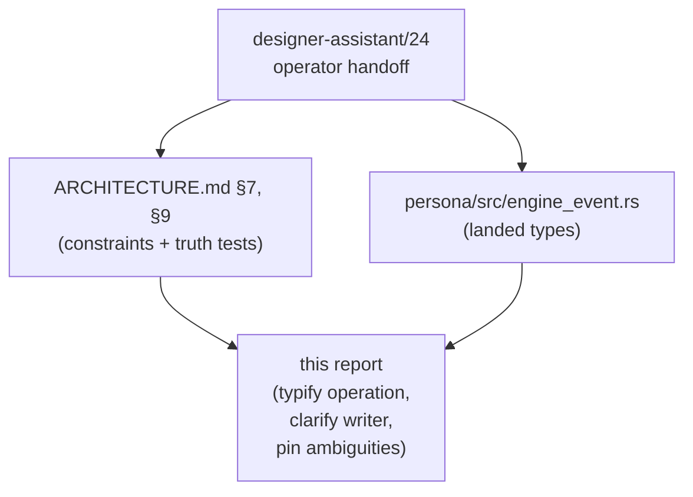
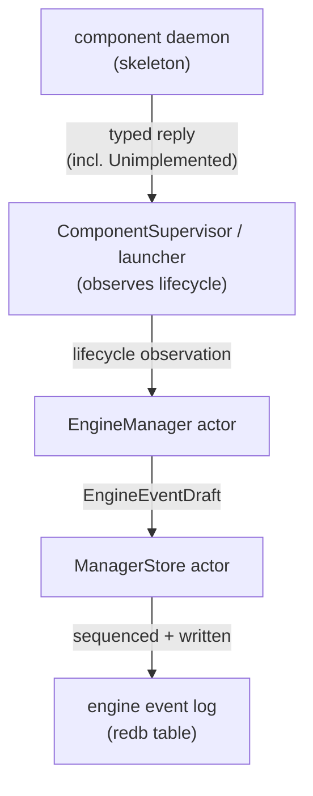

# 134 — Component skeletons and engine event log — designer review

*Designer review of `reports/designer-assistant/24-persona-daemon-skeletons-and-engine-event-log.md`
(the operator-handoff written after the user's answers on /132). Affirms
the shape; refines the typed-operation field that landed as a `String`
bag in `persona/src/engine_event.rs`; clarifies the writer boundary the
report's §1 diagram blurs; pins the ambiguities the report's typed
sketches leave open.*

---

## TL;DR

`/24` lands the right shape: every first-stack component runs as a real
process from the first witness; valid-but-unbuilt operations return a
typed `Unimplemented` reply; the manager owns a typed event log and NOTA
is a projection. The architecture absorbed all of that —
`persona/ARCHITECTURE.md` §7 carries the constraints, §9 carries seven
new architectural-truth tests
(`persona-daemon-spawns-first-stack-skeletons`,
`persona-component-skeletons-answer-health-status-readiness`,
`persona-component-skeleton-returns-typed-unimplemented`,
`persona-engine-event-log-records-typed-manager-events`,
`persona-engine-event-log-nota-projection-is-view`, plus the launcher
non-blocking and reverse-shutdown tests). The event-log record types
have already landed in `persona/src/engine_event.rs`.

This review:

- **Affirms** the witness shape, the four reply classes
  (`Unimplemented` / `Unsupported` / `Unavailable` / `Failed`), and the
  typed-event-log / NOTA-as-projection split.
- **Refines** `ComponentOperation(String)`
  (`persona/src/engine_event.rs:170-180`) — the field is currently a
  string bag, which is the exact `Stringly-typed` smell
  `skills/rust/methods.md` forbids. The fix is small and load-bearing.
- **Clarifies** that the event log is manager-written; components do
  not push into it. `/24`'s §1 diagram (`mind → log`, `router → log`,
  …) reads like component-side writes; the operator should not
  implement those arrows.
- **Pins** four ambiguities the typed sketches leave open: what each
  `UnimplementedReason` variant actually means, what "ready" requires,
  whether `EngineEventSequence` is per-engine or per-manager, and the
  decode-vs-execute boundary that gives the skeleton a path to reply
  `Unimplemented` instead of crashing on a request it can't run.



---

## 1 — What `/24` settles correctly

The substantive shape `/24` lands and the architecture absorbed:

| Decision | Why it's right |
|---|---|
| Spawn every first-stack daemon skeleton from the first witness, not just the implemented subset. | The witness's job is to prove the topology, not the convenient subset. `persona-daemon-spawns-first-stack-skeletons` makes the constraint falsifiable per `skills/architectural-truth-tests.md` §"Rule of thumb — the test name pattern". |
| Four reply classes: `Unimplemented`, `Unsupported`, `Unavailable`, `Failed`. | Each names a genuinely different fact a caller (and the manager) needs to distinguish — *in this contract, not built* vs. *not in this contract* vs. *deps not ready* vs. *attempted and failed*. Collapsing into one would be `Item / ItemDetails` smell at the reply boundary. |
| Engine event log is typed manager state; NOTA log output is a projection. | Matches the architecture's "Producers push; consumers subscribe; redb is durable truth" pattern. A plain-text log as durable truth is the `Signal → text → reparse` round-trip violation `skills/contract-repo.md` warns against. |
| The event log is not a terminal transcript. | Terminal transcripts belong to `persona-terminal` / `persona-harness` with their own privacy and pointer rules. Conflating them would lose the boundary and force every consumer to filter. The architecture's §7 invariants now name this explicitly. |
| Component daemons answer health/status/readiness even when most behavior is unimplemented. | The skeleton is honest: the daemon can be probed; the reply is typed; the absence of behavior is *also* typed. This is the architecture's standing rule that contract crates own typed records and runtime crates honor them. |

The shape is right. The rest of this report refines specific points
that landed thin enough to mislead the next implementation pass.

---

## 2 — Refinements

### 2.1 — `ComponentOperation` is a `String` bag — typify it

The biggest gap. The current shape in
`persona/src/engine_event.rs:170-180`:

```rust
#[derive(rkyv::Archive, rkyv::Serialize, rkyv::Deserialize, Debug, Clone, PartialEq, Eq)]
pub struct ComponentOperation(String);

impl ComponentOperation {
    pub fn new(value: impl Into<String>) -> Self { Self(value.into()) }
    pub fn as_str(&self) -> &str { self.0.as_str() }
}
```

This is the exact `Stringly-typed bag` `skills/rust/methods.md`
§"Don't hide typification in strings" calls out: a free-form string
field where a closed sum belongs. The architecture's §7 invariant
"Unfinished-state replies are closed typed records … never plain
strings or catch-all text errors" applies to the *reason* (which is
typed — `UnimplementedReason::{NotBuiltYet, DependencyTrackNotLanded}`),
but the *operation* it identifies is currently free-form.

The cost shows up the moment a falsifiable test asks "did the harness
skeleton return `Unimplemented(DeliverToHarness)`?" The test cannot
match on a typed variant — only on a string literal — and a typo at
the producer site silently passes.

`signal-persona/src/lib.rs` already has the discipline at the
component-identity layer: `ComponentKind` is a closed sum (`Mind |
Router | Message | System | Harness | Terminal`), `ComponentName` is
the instance identifier. The operation field wants the same shape:
closed by-contract, instance-free.

**Recommended shape.** Each `signal-persona-*` contract crate already
owns a closed request enum (the `signal_channel! { request … }` block
in `signal-persona/src/lib.rs:152-159` is the prototype). Define an
`*OperationKind` enum alongside each contract's request enum —
discriminator-only, no payloads — and aggregate them in the manager's
event log:

```rust
// signal-persona-mind
pub enum MindOperationKind {
    SetRoleClaim,
    QueryReadyWork,
    RecordDecision,
    // … one variant per MindRequest variant
}

// signal-persona-harness
pub enum HarnessOperationKind {
    DeliverToHarness,
    FocusHarness,
    ObserveHarness,
    // …
}

// persona::engine_event
pub enum ComponentOperation {
    Mind(MindOperationKind),
    Router(RouterOperationKind),
    Message(MessageOperationKind),
    System(SystemOperationKind),
    Harness(HarnessOperationKind),
    Terminal(TerminalOperationKind),
}
```

The shape composes: `ComponentUnimplemented` now carries
`(ComponentName, ComponentOperation, UnimplementedReason)` where
`ComponentOperation` is a closed two-level sum. A test reads:

```rust
assert!(matches!(
    body,
    EngineEventBody::ComponentUnimplemented(u)
        if u.operation() == &ComponentOperation::Harness(
            HarnessOperationKind::DeliverToHarness
        )
));
```

**The dependency cost.** `persona/engine_event.rs` already depends on
`signal-persona` (`ComponentName`, `EnginePhase`) and
`signal-persona-auth` (`EngineId`). Aggregating the six
`*OperationKind` enums adds six contract-crate dependencies. The
manager already has to handle all six relations to be a manager, so
this is honesty about the topology, not new coupling. The contract
crates stay free of `persona`-side types — the arrows still point one
way.

**If the dependency aggregation is itself undesirable.** Keep
`ComponentOperation` as a closed sum of `(ComponentKind,
OperationDiscriminator)` where `OperationDiscriminator` is a small
typed newtype, *and* mandate that every producer-side projection comes
from a typed `*OperationKind::as_kind() -> OperationDiscriminator`
method (no free string construction). The first shape is cleaner; the
second preserves the kernel-extraction discipline of
`skills/contract-repo.md` if the dependency direction matters. Either
beats today's `String`.

The first-witness implementation can ship with a closed
`ComponentOperation` that names *only the operations the skeleton
actually receives in the witness* (one or two per component). The
enum widens as contracts grow — each new contract operation adds a
variant — and the type system catches the producers that didn't update.

### 2.2 — Manager writes events; components reply

`/24`'s §1 diagram:

```text
daemon --> mind, router, system, harness, terminal, message
mind --> log
router --> log
system --> log
harness --> log
terminal --> log
message --> log
```

Reads as "every component writes into the engine event log." That is
not the architecture. `persona/ARCHITECTURE.md` §7 invariant: *"The
manager catalog is written through the `ManagerStore` actor; request
handling does not open `manager.redb` directly."* The event log is
inside the manager catalog. Components do not know it exists.

What actually happens:



The events are *the manager's record of observing the components*, not
data the components push. The arrow direction in `/24`'s diagram
should flip — or, more honestly, the components shouldn't appear as
sources of the log arrow at all. The right diagram has the launcher /
supervisor + manager observe lifecycle and reply traffic, draft
`EngineEvent`s, and route them through `ManagerStore`.

The current code already half-encodes this:
`engine_event.rs::EngineEventSource::{Manager, Component(ComponentName)}`
names the source field as "where the observation came from" — but
"Component" here means "the manager observed something about this
component," not "the component wrote this." The operator-handoff text
should make that explicit so the next implementation pass doesn't try
to give component daemons a write path into `manager.redb`.

### 2.3 — Pin the open ambiguities

Four small ones, all worth fixing before the next implementation pass.

**`UnimplementedReason` variants.** Current code:

```rust
pub enum UnimplementedReason {
    NotBuiltYet,
    DependencyTrackNotLanded,
}
```

`NotBuiltYet` reads as "this daemon's handler is stubbed."
`DependencyTrackNotLanded` is ambiguous between two readings:

- "the contract names this operation, but the upstream / cross-cutting
  work it depends on hasn't landed" — i.e., *we'd write this handler
  if our local sema layer / cross-component contract were ready*; or
- "this daemon would call out to a downstream component that doesn't
  accept the request yet" — i.e., *we can't complete because someone
  else is unfinished*.

Pin one. My recommendation: `DependencyTrackNotLanded` means the
*current* reading (cross-cutting upstream work the implementer is
waiting on — closer to a project-state hint than a runtime fact); add
a future variant `UpstreamComponentUnimplemented(ComponentName)` if
the second reading ever needs to be distinguished. Naming the chosen
meaning in a doc comment on the enum is enough for now.

**What "ready" means.** Acceptance criterion `/24` §4 #5 says: *"Each
component can answer a readiness/health/status request."* The weak
reading — "didn't crash on start" — is not useful as a witness; the
strong reading — "the daemon's socket is bound and a `HealthCheck`
round-trip returns a typed reply" — is the load-bearing one. The
event-log fact `ComponentReady` should fire *after* the manager has
received a successful health/status reply, not after `spawn(2)`
succeeds. The architecture's §9 test
`persona-component-skeletons-answer-health-status-readiness` is the
strong-reading witness; make sure the operator implementation marks
ready off that signal, not off process-start.

**Sequence scope.** `EngineEvent` carries both
`sequence: EngineEventSequence` and `engine: EngineId`
(`engine_event.rs:21-27`). Is `sequence` monotonic per-engine or
per-manager? The code's `EngineEvent::key()` returns the raw `u64`
(line 55-57), which reads as "primary key in a single events table" —
i.e., per-manager. That's the right answer for a single events table
that mixes engines, but the choice is invisible from outside. Pin it
in the doc comment so a future implementer doesn't build a per-engine
counter that diverges from the table's storage shape. (Per-manager
also gives a free total-order tag that downstream observers — NOTA log
projection, `bd`-style consumers — can rely on.)

**Decode-vs-execute boundary.** A skeleton's job, per `/24` §0 and the
architecture's invariant about typed unfinished replies, requires
that the daemon can *decode* every operation its contract names, even
when it can't execute the operation. If the daemon panics or
parse-errors on an operation whose handler is stubbed, the caller
gets a framing error instead of a typed `Unimplemented` and the
witness is a lie about the topology. The discipline is:

- contract `signal-persona-*` decoders are derived (`Archive` /
  `rkyv` round trip) — every variant decodes by construction;
- skeleton handlers `match` over the full request enum exhaustively
  and return `Unimplemented(*OperationKind::<variant>)` for the
  not-yet-built variants;
- `Unsupported` (different reply class) is reserved for the case where
  a request reaches the *wrong* component (a `HarnessRequest` arrived
  at a `Terminal` daemon's socket because of a wiring error) — not for
  "this component's contract names the operation but we haven't
  built it."

This boundary deserves a one-paragraph entry in the skeleton-writing
discipline, and probably an architectural-truth test:
`persona-skeleton-handles-every-contract-variant` would catch the
non-exhaustive match before it leaks into a witness run.

---

## 3 — Refined acceptance criteria

`/24` §4 lists nine acceptance criteria. The shape is right;
refinements drawn from §2 above:

| # | `/24` criterion (paraphrased) | Refinement |
|---|---|---|
| 1 | Every first-stack component has a runnable daemon/proxy skeleton through Nix. | Keep. The `persona-message` proxy is the special case — verify it as a CLI invocation surface, not a long-lived daemon. |
| 2 | `persona-daemon` resolves each component command from Nix or explicit override. | Keep. The architecture's `persona-component-commands-resolve-from-nix-closure` and `persona-launch-config-overrides-one-component-command` tests cover this. |
| 3 | `ComponentSupervisor` starts every first-stack component for one named engine through `DirectProcessLauncher`. | Keep. Names are settled per `/132` §3.2. |
| 4 | Each component receives a resolved spawn envelope. | Keep. `persona-spawn-envelope-carries-resolved-component-command` covers this. |
| 5 | Each component can answer a readiness/health/status request. | **Refine:** mark `ComponentReady` in the event log only after a successful health/status round-trip, not after `spawn(2)` returns. See §2.3. |
| 6 | At least one request to a not-yet-implemented operation returns a typed `Unimplemented` reply. | **Refine:** the reply's operation field must be a typed `*OperationKind` variant, not a string. See §2.1. The architectural-truth test should pattern-match on the typed variant. |
| 7 | `persona-daemon` records component spawn, readiness, and unimplemented replies into a typed engine event log. | **Refine:** through the manager / `ManagerStore` writer path; components do not write the log. See §2.2. |
| 8 | A NOTA log projection displays typed engine events without making text the source of truth. | Keep. |
| 9 | The Nix witness proves this through real processes and sockets, not in-process fakes. | Keep. |

Two additions:

| 10 | A skeleton's request match is exhaustive over its contract's request enum; non-implemented variants reply `Unimplemented(<variant>)`. | Decode-vs-execute boundary, §2.3. Test: `persona-skeleton-handles-every-contract-variant`. |
| 11 | `EngineEventSequence` is per-manager monotonic; document at the enum site. | Sequence scope, §2.3. |

---

## 4 — Carried forward to the catalog design

`/132` §4 already deferred the full `ManagerStore` catalog shape to a
future designer report. `/24` and this review add specific things that
report needs to settle:

- The events table layout — single table per manager, primary-keyed on
  the global `EngineEventSequence`, indexed on `(engine, sequence)`
  for engine-scoped readers.
- Subscription protocol for NOTA projection — push, not poll, per
  `skills/push-not-pull.md`. The projection process subscribes to new
  events as they're written; it does not periodically tail the table.
- Retention policy. Engine events are durable but presumably bounded —
  what's the GC story?
- The relationship between `EngineEvent::ComponentUnimplemented` and
  the *per-component* event streams a future component might want to
  expose. The manager's events are management facts (spawned,
  unimplemented, exited); a component's own events (request received,
  side effect taken) live in its own redb and are not mirrored.

These are catalog-design questions, not skeleton-implementation
questions — defer.

`/132` §4 also deferred restart policy. The first-skeleton witness
inherits the deferral: the supervisor tracks process lifecycle and
records `ComponentExited` events, but **does not restart** in the
first implementation. `RestartScheduled` and `RestartExhausted` event
variants exist in `engine_event.rs` for the future shape; the operator
implementation populates the `ComponentExited` path only, and the
restart policy lands in a follow-up wave once cgroup-vs-direct-process
backend tradeoffs are clearer.

---

## 5 — One-sentence summary

`/24`'s operator handoff is right about *what* to ship; the
architecture already absorbed the constraints and the truth tests;
the one load-bearing refinement is typing `ComponentOperation` as a
closed sum so the `Unimplemented` reply is falsifiable per variant
instead of per string literal, with three smaller clarifications
(manager writes the log; "ready" means health-replied; sequence is
per-manager) plus a decode-vs-execute discipline for the skeleton's
request match.

---

## See also

- `reports/designer-assistant/24-persona-daemon-skeletons-and-engine-event-log.md`
  — the operator-handoff this report reviews.
- `reports/designer/132-persona-engine-supervision-shape.md` — the
  upstream supervision-shape review whose follow-up `/24` is.
- `reports/designer-assistant/23-persona-daemon-supervision-and-nix-dependency-review.md`
  — the supervision/Nix-dependency review `/132` affirms.
- `reports/operator/112-persona-engine-work-state.md` — operator's
  state survey at the start of this thread.
- `/git/github.com/LiGoldragon/persona/ARCHITECTURE.md` §7, §9 — the
  apex architecture, carrying `/24`'s constraints and truth tests.
- `/git/github.com/LiGoldragon/persona/src/engine_event.rs` — the
  landed event-record types; `ComponentOperation(String)` at
  lines 170-180 is the field to typify per §2.1.
- `/git/github.com/LiGoldragon/signal-persona/src/lib.rs` —
  `ComponentKind`, `ComponentName`, and the `signal_channel!`
  request/reply prototype the `*OperationKind` enums extend.
- `~/primary/skills/rust/methods.md` §"Don't hide typification in
  strings" — the discipline the `ComponentOperation` refinement
  applies.
- `~/primary/skills/contract-repo.md` §"Examples-first round-trip
  discipline" — why the typed-operation field matters for falsifiable
  per-variant assertions.
- `~/primary/skills/architectural-truth-tests.md` §"Rule of thumb —
  the test name pattern" — the shape of the
  `persona-skeleton-handles-every-contract-variant` test §2.3 proposes.
