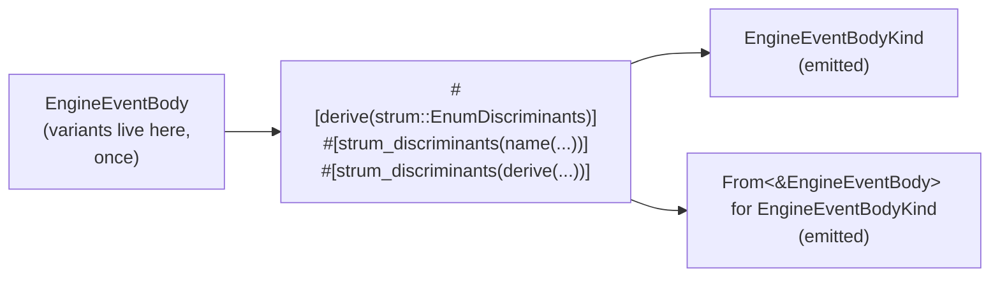

# 135 — Kind enums via `strum::EnumDiscriminants` — one source of truth for payload-free projections

*Designer proposal. Scope: the kind/companion enums in
`persona/src/schema.rs` that mirror `EngineEventBody` and
`EngineEventSource` from `persona/src/engine_event.rs`. Follow-up to
`/134` §2.1, which argued the broader case that operation discriminators
should be typed; this report argues the narrower case that the
discriminator enums themselves should be derived, not duplicated.*

---

## TL;DR

`schema.rs` currently defines `EngineEventBodyKind` and
`EngineEventSourceKind` by hand and projects them with
`from_event_body` / `from_event_source` methods that mechanically match
each parent variant to its kind. The variant list is duplicated —
once on `EngineEventBody`, once on `EngineEventBodyKind`, once in the
match arms — and the projection method reinvents `From<&T>`.

The fix is one derive line on each parent enum:
`strum::EnumDiscriminants` reads the parent's variant list and emits a
payload-free companion enum + a `From<&Parent>` impl. The variant list
lives in exactly one place — the parent enum's own definition — and
the compiler enforces the lockstep structurally.

A `macro_rules!`-based workaround (suggested earlier in the thread)
either duplicates the variant list at the macro-invocation site or
forces the parent enum itself to be defined through a macro, losing the
readability of a normal `pub enum { ... }` block. Both are strictly
worse than the derive.



---

## 1 — The problem

`persona/src/engine_event.rs` defines the payload-bearing parent
enums:

```rust
pub enum EngineEventBody {
    ComponentSpawned(ComponentLifecycleEvent),
    ComponentReady(ComponentLifecycleEvent),
    ComponentUnimplemented(ComponentUnimplemented),
    ComponentExited(ComponentExited),
    RestartScheduled(RestartScheduled),
    RestartExhausted(RestartExhausted),
    ComponentStopped(ComponentLifecycleEvent),
    EngineStateChanged(EngineStateChanged),
}

pub enum EngineEventSource {
    Manager,
    Component(ComponentName),
}
```

`persona/src/schema.rs` defines payload-free companions and projection
methods (the code from the screenshot in the thread, lines ~250-296):

```rust
// schema.rs — pre-proposal
#[derive(NotaEnum, Debug, Clone, Copy, PartialEq, Eq)]
pub enum EngineEventBodyKind {
    ComponentSpawned,
    ComponentReady,
    ComponentUnimplemented,
    ComponentExited,
    RestartScheduled,
    RestartExhausted,
    ComponentStopped,
    EngineStateChanged,
}

#[derive(NotaEnum, Debug, Clone, Copy, PartialEq, Eq)]
pub enum EngineEventSourceKind {
    Manager,
    Component,
}

impl EngineEventBodyKind {
    pub fn from_event_body(body: &EngineEventBody) -> Self {
        match body {
            EngineEventBody::ComponentSpawned(_) => Self::ComponentSpawned,
            EngineEventBody::ComponentReady(_) => Self::ComponentReady,
            EngineEventBody::ComponentUnimplemented(_) => Self::ComponentUnimplemented,
            EngineEventBody::ComponentExited(_) => Self::ComponentExited,
            EngineEventBody::RestartScheduled(_) => Self::RestartScheduled,
            EngineEventBody::RestartExhausted(_) => Self::RestartExhausted,
            EngineEventBody::ComponentStopped(_) => Self::ComponentStopped,
            EngineEventBody::EngineStateChanged(_) => Self::EngineStateChanged,
        }
    }
}

impl EngineEventSourceKind {
    pub fn from_event_source(source: &EngineEventSource) -> Self {
        match source {
            EngineEventSource::Manager => Self::Manager,
            EngineEventSource::Component(_) => Self::Component,
        }
    }
}
```

The variant list appears three times:

1. on `EngineEventBody` (the source-of-truth definition);
2. on `EngineEventBodyKind` (the companion);
3. in the match arms of `from_event_body`.

`EngineEventSource` and `EngineEventSourceKind` carry the same triple.
Adding a new variant requires updating all three places. The compiler
catches some drift (a missing match arm is non-exhaustive) but does
not enforce that the companion enum has the same variant set as the
parent — extra or misspelled variants on the companion compile cleanly
until a match in `from_event_*` rejects them.

The `from_event_*` methods are also reinventing `From<&T>` — the
canonical Rust conversion for a non-Copy reference projection.

The user's question, in the thread: *"if all the variants have a
match, why list them all again?"* The right answer: they shouldn't be
listed again.

---

## 2 — Options surveyed

| Option | One source of truth? | Cost | Notes |
|---|---|---|---|
| **Status quo** (hand-defined kind enum + projection method) | No — variant list in 3 places. | Maintenance hazard at every variant addition. | Compiler catches one direction of drift. |
| `std::mem::discriminant` | No — returns an opaque value, not a named projection. | Can't be NOTA-serialized; can't be matched on by variant name. | Wrong tool for this shape. |
| Local `macro_rules!` that defines kind + projection from a variant list at the invocation site | No — variant list is in 2 places (parent enum + macro invocation). | Saves a proc-macro dependency; pays ~12 lines of unfamiliar macro plumbing. | Compiler enforces lockstep but doesn't eliminate duplication. |
| Local `macro_rules!` that wraps the *whole parent enum* in a single variant list | Yes — variant list once, inside the macro invocation. | Loses normal-enum readability; parent enum no longer reads as `pub enum { ... }`. | Strictly worse than a derive on every axis. |
| `strum::EnumDiscriminants` | **Yes** — variant list lives on the parent enum only. | One derive crate; one extra line of derive + two attribute lines per parent enum. | Mature, broadly used; supports passing arbitrary derives to the generated type. |
| `enum-kinds` | Yes — same shape as strum. | Smaller, purpose-built crate. | Fine, but `strum` is the ecosystem default. |
| `kinded` | Yes — same shape, with extra ergonomics (`kind()` method, `Display`, `FromStr`). | A bit more featureful than needed here. | Reasonable; not first pick. |

The proc-macro-dependency objection raised earlier in the thread is
not load-bearing for this workspace: `persona/Cargo.toml` already pulls
`nota-derive`, `rkyv`, `kameo`, and adjacent proc-macro crates. Adding
`strum` (or `enum-kinds`) is a tiny incremental cost and matches the
workspace's pattern of *using real libraries* rather than hand-rolling
boilerplate, per `~/primary/skills/rust/parsers.md` §"No hand-rolled
parsers" applied to the parallel case of derive-shaped boilerplate.

---

## 3 — The "one source of truth" test

A pattern claims "single source of truth" only if **adding a variant
to the parent enum touches exactly one place** — the parent enum's
definition. By that test:

- Status quo: 3 places must be updated.
- `macro_rules!` separate variant list: 2 places.
- `macro_rules!` whole-enum wrapper: 1 place, but at the cost of
  parent-enum readability.
- `strum::EnumDiscriminants`: 1 place. The derive reads the variant
  list from the parent and emits the rest.

Only the derive shape passes the test without paying a readability
cost on the parent enum.

The compiler will catch some duplication-drift in the macro_rules
shape — but "compiler catches drift between two lists" is not the same
property as "there is only one list." The first is a safety net; the
second is the absence of the problem. The workspace's discipline is
to prefer the absence of the problem (per
`~/primary/skills/abstractions.md` §"Find the structure that makes the
special case dissolve into the normal case" — here the "special case"
is the duplicate list that requires lockstep maintenance).

---

## 4 — Recommended shape

Move both kind enums into `engine_event.rs` next to their parents,
and replace their hand-written definitions + projection methods with a
single `strum::EnumDiscriminants` derive per parent.

```rust
// persona/src/engine_event.rs — post-proposal
#[derive(
    rkyv::Archive, rkyv::Serialize, rkyv::Deserialize,
    Debug, Clone, PartialEq, Eq,
    strum::EnumDiscriminants,
)]
#[strum_discriminants(name(EngineEventBodyKind))]
#[strum_discriminants(derive(NotaEnum, Debug, Clone, Copy, PartialEq, Eq))]
pub enum EngineEventBody {
    ComponentSpawned(ComponentLifecycleEvent),
    ComponentReady(ComponentLifecycleEvent),
    ComponentUnimplemented(ComponentUnimplemented),
    ComponentExited(ComponentExited),
    RestartScheduled(RestartScheduled),
    RestartExhausted(RestartExhausted),
    ComponentStopped(ComponentLifecycleEvent),
    EngineStateChanged(EngineStateChanged),
}

#[derive(
    rkyv::Archive, rkyv::Serialize, rkyv::Deserialize,
    Debug, Clone, PartialEq, Eq,
    strum::EnumDiscriminants,
)]
#[strum_discriminants(name(EngineEventSourceKind))]
#[strum_discriminants(derive(NotaEnum, Debug, Clone, Copy, PartialEq, Eq))]
pub enum EngineEventSource {
    Manager,
    Component(ComponentName),
}
```

The derive emits:

- `pub enum EngineEventBodyKind { ComponentSpawned, ComponentReady, … }`
  — payload-free companion with the variant list lifted from the
  parent.
- `impl From<&EngineEventBody> for EngineEventBodyKind` — the
  projection.
- The same pair for `EngineEventSource` / `EngineEventSourceKind`.

The pass-through `#[strum_discriminants(derive(...))]` line emits the
generated companion enum *with* the NOTA-codec derive and the standard
trait bag. The NOTA projection logic in `schema.rs` keeps importing
the kind enums by the same names; only their *home* changes.

### What disappears from `schema.rs`

- `pub enum EngineEventBodyKind { ... }` definition (8 variants).
- `pub enum EngineEventSourceKind { ... }` definition (2 variants).
- `impl EngineEventBodyKind { pub fn from_event_body(...) }` block
  (~12 lines).
- `impl EngineEventSourceKind { pub fn from_event_source(...) }` block
  (~6 lines).

### What changes at call sites

Wherever `schema.rs` (or any consumer) writes
`EngineEventBodyKind::from_event_body(body)`, the canonical Rust
spelling becomes `EngineEventBodyKind::from(body)` or `body.into()`:

```rust
// before
let kind = EngineEventBodyKind::from_event_body(event.body());

// after
let kind = EngineEventBodyKind::from(event.body());
// or, when the target type is inferable:
let kind: EngineEventBodyKind = event.body().into();
```

The pre-proposal `from_event_body` name was reinventing `From` with a
non-canonical spelling. The derive aligns the name with the trait.

### Module-boundary argument

Earlier in the thread, the question was raised whether moving the kind
enums into `engine_event.rs` "moves schema knowledge into the event
module." It does not. The kind enum is a *structural projection of
the parent enum's variant set* — a property of the parent, not a NOTA
choice. The NOTA-specific piece is the `NotaEnum` derive on the
projection; that derive can live wherever the projection lives, and
keeping the projection next to its parent is the right cut per
`~/primary/skills/abstractions.md` §"Verb belongs to noun" (here:
"projection-from belongs to the parent enum, not to the schema
module").

`schema.rs` keeps its NOTA-record types and the projection logic that
maps `EngineEvent` into NOTA records; it just imports the kind enums
by name from `engine_event`.

---

## 5 — Migration steps

A small, mechanical change:

1. Add `strum = { version = "<latest>", features = ["derive"] }` to
   `persona/Cargo.toml` `[dependencies]`. (`features = ["derive"]`
   enables `EnumDiscriminants`.)
2. Add the two `strum::EnumDiscriminants` derives + the four
   `#[strum_discriminants(...)]` attribute lines to `EngineEventBody`
   and `EngineEventSource` in `engine_event.rs`. Keep the rest of the
   parent-enum derives unchanged.
3. Re-export the kind enums from `engine_event.rs` so `schema.rs` can
   import them at the same path it used before, *or* update the
   imports in `schema.rs` from `crate::schema::EngineEventBodyKind` to
   `crate::engine_event::EngineEventBodyKind`. (Pick one based on
   what minimizes churn at the call sites.)
4. Delete the four hand-written items from `schema.rs`: the two enum
   definitions and the two `from_event_*` impls.
5. Update call sites that wrote `EngineEventBodyKind::from_event_body(...)`
   or `EngineEventSourceKind::from_event_source(...)` to use
   `EngineEventBodyKind::from(...)` or `.into()`.
6. Run `cargo check` to confirm the derive expansion produces
   identical types and trait impls, and `cargo test` to confirm the
   NOTA projection round-trips still pass.

Expected net diff: about +6 lines of derive/attribute on the parent
enums, about -30 lines of hand-written enums + projections in
`schema.rs`, plus a few-character change at each call site.

The migration is reversible: if the derive expansion turns out to
miss a detail the hand-written code captured, we re-introduce the
hand-written shape and revert the derive. Nothing about the
serialized wire form changes — the companion enum's variant list is
identical, and `NotaEnum`'s output for a payload-free enum is the
same whether the enum was hand-written or derive-emitted.

---

## 6 — Carried forward

The broader case in `/134` §2.1 — `ComponentOperation(String)` should
become a closed two-level sum over each contract's `*OperationKind`
enum — is *also* a derive-friendly shape. Each contract's
`*OperationKind` enum is the payload-free projection of that
contract's request enum, and could be emitted from the request enum
via the same `strum::EnumDiscriminants` pattern. The
`signal-persona-*` contract crates already lean on derives (`rkyv`,
`signal_channel!`); adding `strum` there is the same kind of cost as
adding it to `persona`.

That extension is out of scope for this proposal — `/134` proposes the
contract-side typing as its own design move, and this report proposes
only the local cleanup of the engine-event-side kind enums. If both
land, the pattern *"every payload-free projection is a derive, not a
hand-written companion"* becomes a workspace habit, and the same
discipline lands in `~/primary/skills/rust/methods.md` as a small new
section.

---

## See also

- `reports/designer/134-component-skeletons-and-engine-event-log-review.md`
  §2.1 — the broader typed-operation argument that frames this
  narrower one.
- `reports/designer-assistant/24-persona-daemon-skeletons-and-engine-event-log.md`
  — the operator-handoff that landed the original
  `engine_event.rs` shape.
- `/git/github.com/LiGoldragon/persona/src/engine_event.rs` — where
  the `strum::EnumDiscriminants` derive lands.
- `/git/github.com/LiGoldragon/persona/src/schema.rs` — where the
  hand-written kind enums + projection methods get deleted.
- `~/primary/skills/rust/parsers.md` §"No hand-rolled parsers" — the
  workspace principle that applies to derive-shaped boilerplate as
  well as parsers.
- `~/primary/skills/abstractions.md` §"Verb belongs to noun" — why
  the projection belongs next to its parent enum, and why the
  conversion is named `From`.
- `~/primary/skills/rust/methods.md` — the broader type-and-method
  discipline; a future revision could grow a small "payload-free
  projection: derive, don't duplicate" subsection citing this report.
- [`strum::EnumDiscriminants`](https://docs.rs/strum/latest/strum/derive.EnumDiscriminants.html)
  — the derive macro this proposal recommends.
- [`enum-kinds`](https://docs.rs/enum-kinds/latest/enum_kinds/) — the
  purpose-built alternative; same shape, smaller surface.
