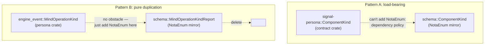

# 137 — Operation-kind mirrors: when the wire/text duplication is and isn't load-bearing

*Designer follow-up to `reports/operator-assistant/108-kind-enum-pattern-survey.md`
(which named the operation-kind report mirrors as "related but not direct"
targets for `/135`) and `reports/designer/136-strum-enum-discriminants-proposal-review.md`
(which flagged the broader `from_contract` duplication as a separate future
proposal). This report names the actual deduplication move for the mirrors
`/108` left unresolved, distinguishes it from a cosmetically similar pattern
the same move does **not** fix, and recommends folding the work into
the operator's current `persona` pass.*

---

## TL;DR

`persona/src/schema.rs` carries two superficially similar duplication
patterns. They look the same from a distance — both are "wire-side enum
plus a hand-written text-side mirror with the same variants and a
mechanical projection method" — but they have different causes and
different fixes.

**Pattern A — cross-crate wire/text mirrors.** Enums like
`ComponentKind` and `EnginePhase` originate in `signal-persona` (a
contract crate) and are mirrored in `persona/src/schema.rs` with
`NotaEnum` instead of `rkyv::Archive`. The duplication is **load-bearing**:
contract crates should not depend on `nota-codec` because the wire/text
separation is part of the workspace's `signal-*` discipline. Eliminating
this duplication would require changing the dependency policy. The cost
is real and there is no free move.

**Pattern B — same-crate wire/text mirrors.** Enums like
`EngineOperationKind`, `MessageOperationKind`, `MindOperationKind`,
`SystemOperationKind`, `HarnessOperationKind`, `TerminalOperationKind`,
and `UnimplementedReason` all originate in `persona/src/engine_event.rs`
and are mirrored in `persona/src/schema.rs` (as `*Report` types) for
no architectural reason. `persona` already depends on `nota-codec`. The
duplication is **pure historical** — copy-paste from Pattern A's shape
without inheriting Pattern A's constraint.

The fix for Pattern B is smaller than `/135`'s strum migration: **add
`NotaEnum` directly to the seven wire-side enums in `engine_event.rs`,
add `NotaSum` to `ComponentOperation` (the two-level outer sum), and
delete the seven `*Report` enums + their `from_kind` impls + the
`ComponentOperationReport` projection block from `schema.rs`**.
No new crate dependency, no proc-macro composition uncertainty —
two existing derives applied to existing types. Net deletion is
roughly 110 lines.

Pattern A stays. The dependency policy is sound; the duplication is
the cost of paying it. A future "projection generator" proposal could
revisit this if the count ever grows past today's five enums, but that
is not this report.



---

## 1 — The two patterns

### 1.1 — Pattern A — cross-crate wire/text mirrors

Source: `signal-persona/src/lib.rs`. Five enums declared with rkyv
derives only:

```rust
// signal-persona/src/lib.rs:53
#[derive(Archive, RkyvSerialize, RkyvDeserialize, Debug, Clone, Copy, PartialEq, Eq)]
pub enum ComponentKind {
    Mind, Router, Message, System, Harness, Terminal,
}
```

Same shape for `EnginePhase`, `ComponentDesiredState`, `ComponentHealth`,
`SupervisorActionRejectionReason`.

Mirror: `persona/src/schema.rs:49-78`. Five hand-written copies with
identical variant lists, declared with `NotaEnum` instead of rkyv:

```rust
// persona/src/schema.rs:50
#[derive(NotaEnum, Debug, Clone, Copy, PartialEq, Eq)]
pub enum ComponentKind {
    Mind, Router, Message, System, Harness, Terminal,
}
```

Plus a hand-written `from_contract` projection on each
(`persona/src/schema.rs:369-430`).

**Why the mirror exists.** `signal-persona` is a contract crate. Per
the workspace's signal/contract discipline (`skills/contract-repo.md`,
`persona/ARCHITECTURE.md` §3 "Wire Vocabulary"), contract crates own
typed wire records and rkyv frame behavior; they do not own text
projection. The `signal-persona` Cargo.toml does not include
`nota-codec`, so adding `#[derive(NotaEnum)]` to its enums is not a
zero-cost change — it would couple every wire contract crate to NOTA.
The cost is small per-crate but the policy is the load-bearing piece:
wire types stay wire; text projection happens in consumer crates that
already depend on `nota-codec`.

**Why this pattern is unfixable by `/135`-style moves.**
`strum::EnumDiscriminants` is about generating a *payload-free discriminant
projection of a payload-bearing enum*. The Pattern A enums are
**already payload-free** on both sides — `signal-persona::ComponentKind`
and `schema::ComponentKind` are both unit-variant enums with the same
variants. There is no discriminant to extract; the duplication is at a
different layer.

### 1.2 — Pattern B — same-crate wire/text mirrors

Source: `persona/src/engine_event.rs`. Seven enums declared with rkyv
derives only:

```rust
// persona/src/engine_event.rs:217
#[derive(rkyv::Archive, rkyv::Serialize, rkyv::Deserialize, Debug, Clone, Copy, PartialEq, Eq)]
pub enum MessageOperationKind {
    MessageSubmission,
    InboxQuery,
}
```

Same shape for `EngineOperationKind` (line 209), `MindOperationKind`
(line 223), `SystemOperationKind` (line 245), `HarnessOperationKind`
(line 252), `TerminalOperationKind` (line 259), and
`UnimplementedReason` (line 275).

Plus the outer two-level sum
`ComponentOperation` (line 199), which is payload-bearing
(`Engine(EngineOperationKind) | Message(MessageOperationKind) | …`).

Mirror: `persona/src/schema.rs:217-287`. Seven hand-written copies
with identical variant lists declared with `NotaEnum`, plus a
`ComponentOperationReport` outer sum, plus hand-written `from_kind`
impl blocks at `schema.rs:486-600`.

**Why this mirror exists: historical.** `persona/Cargo.toml` line 24
already includes `nota-codec`. There is no dependency-direction
constraint preventing `NotaEnum` from being on the engine-event-side
enums. Pattern B is what copy-paste of Pattern A's shape looks like when
the constraint that justifies Pattern A doesn't apply.

The smell is visible in the variant lists: every Pattern B mirror is a
character-for-character duplicate of its parent. `MindOperationKindReport`
has 18 variants, all named identically to `MindOperationKind`'s 18
variants; the `from_kind` impl is 18 mechanical match arms. None of the
mirror types carry payload transformations or different naming
conventions — they exist purely because schema.rs wanted `NotaEnum` on
something.

---

## 2 — The fix for Pattern B

Two existing derives on existing types. No new crate dependency. No
proc-macro composition uncertainty (both `NotaEnum` and rkyv are
already used in `persona` and compose cleanly because they generate
disjoint impls — `rkyv::Archive` emits `Archive` / `ArchivedFoo` /
`impl Archive`; `NotaEnum` emits `impl NotaEncode` / `impl NotaDecode`).

### 2.1 — The seven payload-free enums

Each gets one extra derive:

```rust
// persona/src/engine_event.rs — example for one of the seven

use nota_codec::NotaEnum;

#[derive(
    rkyv::Archive, rkyv::Serialize, rkyv::Deserialize,
    NotaEnum,
    Debug, Clone, Copy, PartialEq, Eq,
)]
pub enum MessageOperationKind {
    MessageSubmission,
    InboxQuery,
}
```

`NotaEnum`'s unit-variant constraint (per
`nota-derive/src/nota_enum.rs:15-20`, established in `/136` §2.1) is
satisfied — every operation-kind enum is unit-variant by construction.

### 2.2 — The payload-bearing outer sum

`ComponentOperation` (lines 199-207 of `engine_event.rs`) is
payload-bearing — it has variants like `Engine(EngineOperationKind)`
and `Mind(MindOperationKind)`. `NotaEnum` cannot derive on it
(payload-bearing variants are rejected). But `NotaSum` can —
`nota-derive/src/nota_sum.rs:1-8` describes NotaSum's scope:
"variant ident matches the inner type's name", which is exactly
`ComponentOperation`'s shape:

```rust
#[derive(
    rkyv::Archive, rkyv::Serialize, rkyv::Deserialize,
    NotaSum,
    Debug, Clone, Copy, PartialEq, Eq,
)]
pub enum ComponentOperation {
    Engine(EngineOperationKind),
    Message(MessageOperationKind),
    Mind(MindOperationKind),
    System(SystemOperationKind),
    Harness(HarnessOperationKind),
    Terminal(TerminalOperationKind),
}
```

`NotaSum` requires each variant's payload to itself implement
`NotaEncode` / `NotaDecode`, which §2.1 provides for all seven
operation-kind enums.

### 2.3 — What gets deleted from `schema.rs`

| Item | Lines | What |
|---|---|---|
| 7 hand-written `*Report` enums | 217-287 | The mirrors. ~28 lines counting derive headers. |
| `ComponentOperationReport` definition | (somewhere around 217-230, payload-bearing) | The outer sum mirror. |
| `impl ComponentOperationReport { from_operation }` | 486-509 | ~25 lines. |
| 7 `impl *Report { fn from_kind }` blocks | 511-600 | One per operation-kind enum. ~5-12 lines each. ~55 lines total. |
| 1 `impl UnimplementedReasonReport { from_reason }` block | 597-600+ | ~5 lines. |
| **Total deletion in `schema.rs`** | | **~110-120 lines** |

### 2.4 — What changes at consumer sites

The schema-side consumers of the `*Report` types
(`EngineEventBodyReport::from_event_body` at `schema.rs:432+`, and any
`from_nota`/`to_nota` round-trip tests) need their field types updated:

- `ComponentOperationReport` → `ComponentOperation`
- `MindOperationKindReport` → `MindOperationKind`
- `UnimplementedReasonReport` → `UnimplementedReason`
- (etc.)

And the calls `*Report::from_kind(*kind)` and
`UnimplementedReasonReport::from_reason(event.reason())` disappear —
the wire-side values already implement `NotaEncode` / `NotaDecode`
after §2.1/§2.2, so the report-struct fields just hold the wire types
directly.

This is the same shape as the schema-side re-export approach `/136`
§5 recommended for the strum-emitted kind enums: the *teleological*
identity (these are NOTA-projection-ready operation kinds) stays in
`schema`'s public surface as re-exports, while the *structural*
definitions live in `engine_event.rs` where they belong.

---

## 3 — Composition with `/135`

`/135` is in flight (`/108` confirms it's the only direct
`strum::EnumDiscriminants` target in the workspace; `/136` reviewed
the shape and verified syntax). The operator currently holds the
`persona` working copy and has uncommitted changes in
`engine_event.rs`, `schema.rs`, and `tests/manager_store.rs` — exactly
the files this report touches.

The natural sequencing inside that pass:

1. **First, this report's Pattern B fix.** Add `NotaEnum` / `NotaSum`
   to the eight wire-side enums in `engine_event.rs`. Delete the seven
   `*Report` enums + their projections + `ComponentOperationReport` +
   its projection from `schema.rs`. Update consumers
   (`EngineEventBodyReport::from_event_body`) to use the wire types
   directly. Update tests. Run `cargo test -p persona` — round-trips
   should pass because `NotaEnum`/`NotaSum` derive the same encoding
   shape as the deleted mirrors.

2. **Then `/135`'s strum migration.** Add the `strum` dependency.
   Add `EnumDiscriminants` derives to `EngineEventBody` and
   `EngineEventSource`. Re-export `EngineEventBodyKind` /
   `EngineEventSourceKind` from `schema.rs` (per `/136` §5). Delete
   the hand-written kind enums + their `from_event_*` projections.
   Run `cargo expand` + tests to verify the proc-macro composition
   (`/136` §2.5 smoke test).

Reverse order also works. The two changes touch overlapping files but
non-overlapping types, so they don't conflict. Doing them in the same
pass saves a re-read of the file.

Net deletion across both:
- `/135` migration: ~-34 lines (per `/136` §2.4)
- This report's Pattern B fix: ~-100 lines (after counting new derive
  additions on the wire-side enums and reflow at consumer sites)
- Combined: **~-134 lines** from `schema.rs` and adjacent.

The remaining schema.rs becomes substantially leaner — it carries the
NOTA-record types (`EngineEventReport`, `EngineStatusReport`,
`ComponentStatusRecord`, the `EngineEventBodyReport`'s
payload-transforming projections of `ComponentLifecycleEvent` /
`ComponentUnimplemented` / etc.) and the Pattern A mirrors that remain
load-bearing. That's the right size for a schema module: text-record
shapes and the projections that genuinely transform payloads.

---

## 4 — Why Pattern A stays

For completeness, the reasons not to chase Pattern A as part of this
work:

1. **The dependency policy is sound.** Wire contracts and text
   projection are kept architecturally separate. Adding `nota-codec`
   to every `signal-*` crate would couple wire decisions to text
   decisions — exactly what the contract-repo discipline prevents
   (`skills/contract-repo.md` §"The kernel is wire-only").
2. **The duplication footprint is small and stable.** Five enums,
   each with ≤6 variants, mirrored once. Total schema-side
   contribution is ~32 lines of enum definitions + ~50 lines of
   `from_contract` projections — about 80 lines. Bounded.
3. **The future direction is a projection generator, not a derive.**
   If Pattern A's count ever grows past a threshold (say, 10+ mirrors
   or 200+ projection lines), a workspace-internal projection-generator
   proc macro that takes two same-shape enums and emits both
   `From` directions becomes worth building. That is a much bigger
   piece of design than this report — `nota-derive`-shaped, not
   `persona`-shaped — and it should wait for the cost to genuinely
   justify it.

A future designer report (`/138`+) might revisit this if a sixth or
seventh contract-side enum needing a mirror appears. Today the count
is stable.

---

## 5 — Open question for the operator

One small ambiguity in the migration: should the schema module
**re-export** the wire-side types under their existing `*Report` names
(zero-churn at downstream call sites, but the re-export names are
slightly misleading — `MindOperationKindReport` no longer exists as a
distinct type), or should the call sites update to the wire-side
names (slight churn, but the names match what they refer to)?

Recommendation: **update the call sites to the wire-side names.**
`MindOperationKindReport` is misleading once the type is the same as
`MindOperationKind`; the `*Report` suffix was always carrying the
duplication. The schema module's public surface should reflect the
post-deduplication reality. The churn is contained — schema.rs is the
only caller of the `*Report` names (consumers reach through
`EngineEventReport`, not the inner types directly), so the update is
local.

This differs from `/136` §5's re-export recommendation for the strum
case, where `EngineEventBodyKind` was a name external consumers
(`tests/manager_store.rs:11`) imported by that exact name. The kind
enums have external surface; the `*Report` operation-kind names do
not.

---

## 6 — Summary

`/108` correctly identified the operation-kind mirrors as "related but
not direct" to `/135`. The fix isn't more sophisticated derive machinery
— it's simpler: the operation-kind enums in `engine_event.rs` can derive
`NotaEnum`/`NotaSum` directly, because the dependency-direction
constraint that justifies the contract-side mirrors (Pattern A) does
not apply to same-crate mirrors (Pattern B). The mirrors exist by
historical copy-paste, not by architectural necessity. ~110 lines of
duplication delete cleanly when the wire-side enums carry both wire
and text derives, which they can because the workspace's pattern
already allows derive composition (every `NotaTransparent` String
newtype in schema.rs is precedent).

The work folds cleanly into the operator's current `persona` pass
alongside `/135`. Combined, the two migrations remove ~134 lines from
`schema.rs` and leave the module carrying only what's actually doing
work: NOTA-record shapes and genuinely payload-transforming
projections.

---

## See also

- `reports/operator-assistant/108-kind-enum-pattern-survey.md` — the
  workspace-wide survey whose "operation kind report mirrors"
  section flagged this exact pattern as needing a follow-up.
- `reports/designer/135-kind-enums-via-strum-enum-discriminants.md` —
  the proposal this work composes with; together they cover both
  the discriminant-projection and the wire/text-mirror patterns in
  `schema.rs`.
- `reports/designer/136-strum-enum-discriminants-proposal-review.md`
  §4 — the original flag of "the broader `from_contract` duplication"
  this report's Pattern A/B distinction grew from.
- `reports/designer/134-component-skeletons-and-engine-event-log-review.md`
  §2.1 — the typed-`ComponentOperation` argument that introduced the
  outer two-level sum this report's §2.2 unifies.
- `/git/github.com/LiGoldragon/persona/src/engine_event.rs` lines
  199-283 — the eight wire-side enums (seven payload-free
  operation-kinds plus `UnimplementedReason`) plus the
  payload-bearing `ComponentOperation` sum.
- `/git/github.com/LiGoldragon/persona/src/schema.rs` lines 217-287
  (mirror enum definitions) and 486-600+ (`from_kind` /
  `from_operation` / `from_reason` projection blocks) — the
  ~110 lines that delete.
- `/git/github.com/LiGoldragon/persona/src/schema.rs` lines 49-78
  (Pattern A mirror enums) and 369-430 (`from_contract`
  projections) — the load-bearing duplication that stays.
- `/git/github.com/LiGoldragon/signal-persona/src/lib.rs` — the
  contract crate whose dependency boundary justifies Pattern A.
- `~/primary/skills/contract-repo.md` §"The kernel is wire-only" —
  the discipline that makes Pattern A's mirror load-bearing.
- `/git/github.com/LiGoldragon/nota-codec/../nota-derive/src/nota_enum.rs`
  lines 15-20 (unit-variant constraint, met by §2.1)
  and `/git/github.com/LiGoldragon/nota-codec/../nota-derive/src/nota_sum.rs`
  lines 1-8 (newtype-variant constraint, met by §2.2).
