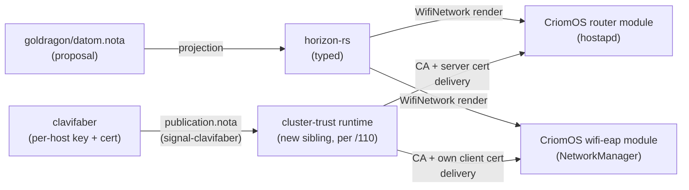

# 139 — Wi-Fi PKI migration: designer response to system-specialist/117

*Designer report. Responds to `reports/system-specialist/117-system-data-purity-and-wifi-pki.md`. Endorses the layering and the structural diagnoses; refines the Horizon record shape; pushes back on Horizon embedding cert PEM; takes a firm position on Option B (dedicated Wi-Fi keypair); raises items 117 missed (eap_user_file rendering, outer-identity leak, NetworkManager `domain-suffix-match`).*

---

## 0 · TL;DR

| Question | 117's position | Designer position |
|---|---|---|
| Where does Wi-Fi policy attach? | Implied cluster-wide `WifiPolicy` | **Per-router `NodeProposal.wifi`**. Precedent: `RouterInterfaces`. Hoist to `Cluster` only when a multi-AP cluster makes it load-bearing. |
| What does Horizon carry — fingerprint or PEM? | "CA cert/fingerprint" (both) | **Fingerprint + nominal identity only.** PEM lives in `clavifaber/publication.nota` and is distributed by the cluster-trust runtime (per `persona/ARCHITECTURE.md` §7 — auth/security/identity is a sibling component, not inside criome or persona). Horizon embedding the PEM erases the trust runtime's reason to exist. |
| Client key strategy (A vs B)? | Open question | **Option B — dedicated Wi-Fi keypair.** ECDSA-P256 default; Ed25519 only behind a passing per-cluster interop test. |
| WPA3-SAE fallback during migration? | "explicit Horizon migration policy, not a hard-coded password" | A typed `WifiAuthentication::MigrationWindow { primary, fallback, until: TimestampNanos }`. Expiry is a *projection-time* check; never a TODO comment. |
| ClaviFaber X.509 profile? | "verify SAN/EKU policy" | **Hard precondition** — typed `CertificateProfile` record with SAN/EKU/KeyUsage fields; tests assert the profile, not just round-trip. Lands before any deploy. |
| Cluster-trust runtime placement | Sibling component (cites /110) | Endorsed. The Wi-Fi migration is the moment to **name the new repo and skeleton it** — /110 left this open and it's now blocking. |
| Service-node gating (tailscale, headscale, port 11436) | Move to Horizon capabilities | Endorsed. The verb is per-node `NodeServices`; cluster-level uniqueness (one Headscale server) is a projection-time validation, not a separate cluster record. |

Order of work in §6.

---

## 1 · What this report is and isn't

A designer review of 117's proposed Wi-Fi migration. 117 is a competent system-specialist survey — code paths cited are accurate (verified), diagnoses are correct, the layering claim is correct, the sequencing intent is correct. The designer-side work this report adds is:

- shape decisions for `horizon-rs` (record placement, NOTA encoding, closed sums);
- the typed cert-profile invariant for `clavifaber` and the falsifiable spec that pins it;
- preservation of the `/110` cluster-trust boundary against Horizon-embedded PEMs;
- surface items 117 missed (eap_user_file, outer-identity leak, NetworkManager `domain-suffix-match`);
- the migration-window typed variant.

What this report does **not** decide: which Rust crate replaces ClaviFaber's hand-rolled DER builder (operator's call); the cluster-trust runtime's repo name (system-specialist's call, per /110); the exact NixOS hostapd module wiring (system-specialist's shape).

---

## 2 · The layering, with the trust runtime restored



The load-bearing designer rule: **Horizon carries policy; ClaviFaber carries per-host key material; the trust runtime carries cross-host public material.** Each layer has exactly one data-flow direction. Splitting "where the CA PEM lives" between Horizon and ClaviFaber's publication breaks this — and per /110, the trust runtime is the resolution.

---

## 3 · Verified findings from 117

Spot-checks against live code (parallel verification subagents over `clavifaber`, `horizon-rs`, `CriomOS`, `CriomOS-lib`, `CriomOS-home`, `goldragon`):

| 117 claim | Verified? | Evidence |
|---|---|---|
| Router hard-codes country `PL`, SSID `criome`, WPA3-SAE, plaintext password | Yes | `CriomOS/modules/nixos/router/default.nix:88,95,97,98` |
| `wifi-eap.nix` writes NetworkManager `[802-1x]` profile pointed at `/etc/criomOS/complex/key.pem` | Yes | `CriomOS/modules/nixos/network/wifi-eap.nix:10-38` (key path resolved through `constants.fileSystem.complex.keyFile`) |
| `wifi-pki.nix` only prepares server-key directory + prints stale hints; hostapd is not EAP-TLS wired | Yes | `CriomOS/modules/nixos/router/wifi-pki.nix:18-39` |
| ClaviFaber has `CertificateAuthorityIssuance` / `ServerCertificateIssuance` / `ClientCertificateIssuance` | Yes | `clavifaber/src/request.rs:21-29` |
| ClaviFaber publication carries SSH pubkey, Yggdrasil projection, Wi-Fi client cert PEM | Yes | `clavifaber/src/publication.rs:13-24` |
| ClaviFaber X.509 builder sets BasicConstraints / KeyUsage / SubjectKeyIdentifier but **not** SAN, **not** EKU | Yes | `clavifaber/src/x509.rs:84-204` (hand-rolled DER assembly via `const-oid` + `x509-cert` + `der`; *not* `rcgen`) |
| Tailscale gates on `[ouranos prometheus]`; headscale gates on `ouranos`; port 11436 gates on `prometheus` | Yes | `tailscale.nix:10`, `headscale.nix:12`, `nix.nix:79` |
| `horizon-rs` has `NodeProposal.wifi_cert: bool` and derived `has_wifi_cert_pub_key`; no Wi-Fi policy fields | Yes | `horizon-rs/lib/src/proposal.rs:54`, `node.rs:347,417` |
| `CriomOS-lib/lib/default.nix:66-103` mixes cluster policy (`10.18.0.0/24`, gateway, ULA) with implementation constants (paths, runtime dirs) | Yes | confirmed |
| `mkUntrustedProxy` shadow bug — inherits `publicKey`/`endpoint` from list, not parameter | Yes | `CriomOS/modules/nixos/network/wireguard.nix:26-29` |
| LiveISO `users.users.root.initialPassword = "r"` | Yes | `CriomOS/modules/nixos/disks/liveiso.nix:16` |

The empirical surface is exactly as 117 describes. No corrections.

---

## 4 · Designer refinements

### 4.1 Attachment point — `NodeProposal.wifi`, not cluster-wide

`horizon-rs`'s current shape (verified): every networking surface is per-node. `RouterInterfaces` lives on `NodeProposal` and identifies the router by being `Some`. There is no cluster-level networking primitive. Adding one for Wi-Fi would be a novel structural move 117 doesn't justify.

The router runs hostapd. Wi-Fi policy belongs on the router node:

```rust
pub struct NodeProposal {
    // ... existing fields
    pub router_interfaces: Option<RouterInterfaces>,
    pub wifi: Option<WifiNetwork>,          // Some iff router_interfaces.is_some()
}
```

The implicit cross-field invariant (`wifi` ⟺ `router_interfaces`) gets a projection-time validation. Hoisting `wifi` into `Cluster` is solvable later when a real multi-AP cluster exists; don't hoist preemptively.

### 4.2 Horizon carries CA *fingerprint*, not PEM

117's example embeds the PEM directly:

```
(WifiCertificateAuthority
  "sha256:..."
  "-----BEGIN CERTIFICATE-----...")
```

This breaks /110. The cluster-trust runtime's stated purpose is *exactly* to gather per-host public material from `clavifaber/publication.nota` and distribute it across the cluster. If Horizon carries the PEM, the trust runtime has nothing to do; the data path forks (declarative PEMs vs runtime-emitted PEMs); ClaviFaber's `publication.nota` becomes duplicate emission.

Designer position: **Horizon carries the nominal identity (name, fingerprint, server DNS-SAN, client authorization policy). The PEM is materialized on every host by the cluster-trust runtime, which sources it from the CA host's `publication.nota`.**

```nota
(NodeProposal
  ...
  (RouterInterfaces eno1 wlp195s0 TwoG 6 Wifi4)
  (WifiNetwork
    (Ssid "criome")
    (Country PL)
    (Authentication
      (EapTls
        (CertificateAuthority
          (Name "criome-wifi-ca")
          (Fingerprint Sha256 "..."))
        (ServerIdentity (DnsName "wifi.goldragon.criome"))
        (ClientAuthorization KnownClusterNodes))))
  ...)
```

CriomOS hostapd rendering reads:

| Source | Fields |
|---|---|
| Horizon | SSID, country, auth mode, CA name + fingerprint, server DNS-SAN, authorization policy |
| `CriomOS-lib` | local file paths (`/etc/criomOS/wifi-pki/{ca,server,server-key}.pem`) |
| cluster-trust runtime | the *content* at those paths |

### 4.3 Naming inside the record — drop the `Wifi` prefix

Per `skills/language-design.md` §3 (position defines meaning), names inside a `WifiNetwork` body don't need to repeat `Wifi`. The parser knows where it is. So `(CertificateAuthority …)` not `(WifiCertificateAuthority …)`. The full names exist as Rust types; the wire form is positional and unprefixed.

Also: 117's `WifiPolicy` is verb-y — "policy" describes how to *apply* something. The noun is the **network** that exists. `WifiNetwork`.

### 4.4 `WifiAuthentication` as a closed sum with a typed migration variant

117 correctly says the migration fallback should be "explicit Horizon migration policy, not a hard-coded password." The typed shape:

```rust
pub enum WifiAuthentication {
    EapTls(EapTlsConfiguration),
    Wpa3Sae(Wpa3SaeConfiguration),                  // only during a MigrationWindow
    MigrationWindow {
        primary: Box<WifiAuthentication>,           // the target (typically EapTls)
        fallback: Box<WifiAuthentication>,          // the legacy (typically Wpa3Sae)
        until: TimestampNanos,
    },
}
```

The `until` field makes "remove the fallback" a projection-time fact rather than a TODO. `horizon-rs` refuses to project a `NodeProposal` whose `MigrationWindow.until` has passed — the workspace's existing validation pass enforces it. The hard-coded SAE password literal in `router/default.nix` cannot survive this discipline: it would have to live inside a `Wpa3SaeConfiguration` carrying a typed-secret reference (not a literal), and the migration window is the only place that variant ever appears.

### 4.5 `ClientAuthorization` as a closed sum

117's `(WifiClientAuthorization HorizonNodes)` is too thin. Spell it:

```rust
pub enum ClientAuthorization {
    /// Every node whose ClaviFaber publication is in the cluster-trust runtime.
    KnownClusterNodes,
    /// Explicit allow-list of node names (escape hatch — e.g. a Pi that should not join Wi-Fi).
    ExplicitNodes(Vec<NodeName>),
}
```

`KnownClusterNodes` is the default; `ExplicitNodes` is the escape hatch. Both surfaces are typed; neither is a string.

### 4.6 X.509 certificate profile as a typed record

117's P1 says "verify SAN/EKU policy." The structural fix is bigger: ClaviFaber's `src/x509.rs:84-204` hand-assembles extension DER blobs per call (`const-oid` + `x509-cert::der::Encode` + raw byte vectors — verified, no `rcgen`). That's a per-call decision tree, not a profile. Profiles need to be typed:

```rust
pub struct CertificateProfile {
    pub basic_constraints: BasicConstraints,
    pub key_usage: KeyUsage,
    pub extended_key_usage: Vec<ExtendedKeyUsageOid>,
    pub subject_alternative_names: Vec<SubjectAlternativeName>,
    pub subject_key_identifier: bool,
}

impl CertificateProfile {
    pub fn certificate_authority(common_name: CommonName) -> Self { /* CA:true; KU=keyCertSign,cRLSign */ }
    pub fn eap_tls_server(server_dns_name: DnsName) -> Self {
        /* EKU=serverAuth; SAN dNSName=...; KU=digitalSignature,keyEncipherment */
    }
    pub fn eap_tls_client(node_identity: NaiIdentity) -> Self {
        /* EKU=clientAuth; SAN rfc822Name=node@criome; KU=digitalSignature */
    }
}
```

Per `skills/contract-repo.md` §"Examples-first round-trip discipline," the falsifiable specs land *before* deploy:

```rust
#[test]
fn eap_tls_server_certificate_carries_server_auth_extended_key_usage() { ... }

#[test]
fn eap_tls_server_certificate_carries_dns_name_subject_alternative_name() { ... }

#[test]
fn eap_tls_client_certificate_carries_client_auth_extended_key_usage() { ... }

#[test]
fn certificate_authority_certificate_has_basic_constraints_ca_true() { ... }
```

These parse the issued certificate (`x509-cert::Certificate::from_der`) and assert the OIDs and structures, not just that a PEM round-trips. Without these, "EAP-TLS is ready" is a phrase that doesn't fit the situation — issuance currently *succeeds* with certs that NetworkManager's `domain-suffix-match` will reject and that hostapd's `check_cert_subject` cannot pin.

Whether `rcgen` replaces the hand-rolled DER builder is operator's choice; the typed `CertificateProfile` is the designer-side invariant either way.

### 4.7 Option A vs Option B — Option B, strongly

External research summary (RFC 5216 §5.2-5.3, hostapd 2.10/2.11 + NetworkManager on NixOS, OpenWrt forum data on Ed25519 EAP-TLS):

- Ed25519 EAP-TLS is **possible** with hostapd ≥ 2.10 + OpenSSL 3.x + TLS 1.3, but TLS 1.3 EAP-TLS is still labeled experimental in hostapd's source; the `wpa_supplicant` side has known cases where the supplicant filters its `signature_algorithms` extension to RSA/ECDSA;
- the `mbedtls` and `wolfssl` hostapd builds have weaker Ed25519 + EAP coverage than `openssl`;
- reusing `/etc/ssh/ssh_host_ed25519_key` couples Wi-Fi failure to SSH identity: rotating either breaks the other; revoking either revokes both. That's a category error.

**Option B (dedicated Wi-Fi keypair) is the call.** Algorithm default: **ECDSA-P256** (universal supplicant support, every TLS-EAP code path). Ed25519 only when a per-cluster interop test against the actual NixOS hostapd + NM build is green.

New ClaviFaber request:

```rust
WifiClientKeypairSetup {
    output_private_key: PathBuf,             // /etc/criomOS/wifi-pki/client-key.pem, mode 0600
    output_certificate_signing_request: PathBuf,
    algorithm: WifiKeyAlgorithm,             // EcdsaP256 by default
}
```

New publication field:

```rust
pub struct PublicKeyPublication {
    pub node_name: NodeName,
    pub open_ssh_public_key: String,
    pub yggdrasil: Option<YggdrasilProjection>,
    pub wifi_client_certificate: Option<WifiClientCertificate>,   // dedicated Wi-Fi cert
}
```

The Wi-Fi cert is no longer derived from the SSH public key; the existing `ClientCertificateIssuance::open_ssh_public_key` field is preserved for any *non-Wi-Fi* use case but is not the EAP-TLS client identity source.

### 4.8 `NodeServices` for tailscale, headscale, large-AI ports

117's proposed shape mixes node-scoped (`node.services.tailscale.enable`) and cluster-scoped (`cluster.headscale.serverNode`) verbs. Designer position: **every service capability is per-node.** Cluster-level uniqueness (one Headscale server) is a *projection-time validation*, not a separate record family:

```rust
pub struct NodeServices {
    pub tailscale: Option<TailscaleMembership>,
    pub headscale: Option<HeadscaleRole>,
    pub large_ai: Option<LargeAiServiceConfiguration>,
}

pub enum HeadscaleRole {
    Server,
    Client,
}
```

The validation: "at most one node in the cluster has `services.headscale == Some(Server)`." Lives in `horizon-rs`'s existing proposal validation pass. The CriomOS modules then render from `node.services.*` with no name comparisons.

This also removes the `ouranos.${cluster.name}.criome` brittle fallback 117 calls out.

---

## 5 · What 117 missed (designer additions)

### 5.1 `hostapd eap_user_file` is part of the CriomOS render surface

The CriomOS hostapd render must emit an `eap_user_file`. For `ClientAuthorization::KnownClusterNodes` the file is:

```text
* TLS
```

(allow any cert chain validating against the CA; authorization happens via cert presence.) For `ClientAuthorization::ExplicitNodes`, render one line per node identity (`"node-name@criome" TLS`). Either way the file is a generated artifact, not a literal.

### 5.2 NetworkManager outer-identity is a clear-text leak

NetworkManager `[802-1x] identity=` is sent in clear text before TLS starts. RFC 5216 §2.2 explicitly says it's just routing and SHOULD NOT be required to match the cert. Designer rule: **set the outer identity to a constant** (`anonymous@criome` or just `anonymous`) on every client. The cert is the authentication; the outer identity should not leak per-node information over the air.

### 5.3 `domain-suffix-match` is non-negotiable on every NM profile

The classic EAP-TLS pitfall is omitting NetworkManager's `domain-suffix-match=` / `domain-match=`. Without it the supplicant accepts any server cert signed by the CA — a rogue AP within the cluster's trust scope passes validation. The CriomOS `wifi-eap.nix` render must emit `domain-suffix-match=<ServerIdentity.DnsName>` sourced from Horizon. This is what makes the `ServerIdentity` field in §4.2 load-bearing rather than ornamental.

### 5.4 LiveISO root password — structural, not deferral

117 calls `users.users.root.initialPassword = "r"` a P2. Designer position: a one-line Nix change to `initialHashedPassword` (from a build-time secret) or unset (require setup-on-boot). Removing the literal is straightforward; deferring is wrong because the LiveISO is built and signed from the cluster's trust scope.

### 5.5 ARCHITECTURE.md edits the migration drives

- `horizon-rs/ARCHITECTURE.md` — currently ~40 lines (just role/boundaries). The `WifiNetwork` + `NodeServices` additions are the moment to flesh out the per-node-policy section.
- `clavifaber/ARCHITECTURE.md` — add a "Certificate profiles" section describing the typed profile record and the EAP-TLS profile builders.
- `CriomOS/ARCHITECTURE.md` — currently doesn't describe the hostapd-rendering boundary; the EAP-TLS migration is the moment.
- New cluster-trust runtime's `ARCHITECTURE.md` — doesn't exist because the repo doesn't exist yet. Naming it is now blocking.

---

## 6 · Recommended sequence

Dependency order. Operator and system-specialist each pick up the chunks they own; the (A) — (M) labels are work IDs, not priorities.

| # | Land | Owner | Blocks |
|---|---|---|---|
| A | `horizon-rs` — `WifiNetwork` record + projection + round-trip tests + `Wifi`⇔`RouterInterfaces` validation | operator | B, F, G |
| B | `goldragon/datom.nota` — `WifiNetwork` value on the prometheus node (initially with `MigrationWindow` enclosing existing SAE) | system-specialist | F, G |
| C | `clavifaber` — typed `CertificateProfile` + EAP-TLS server/client profile builders + profile-assertion tests | operator | D |
| D | `clavifaber` — `WifiClientKeypairSetup` request + `WifiClientCredentials` in publication | operator | F, G |
| E | **Name the cluster-trust runtime repo** (closes the /110 open question) | system-specialist | F |
| F | Cluster-trust runtime skeleton — ingests `signal-clavifaber` publications, distributes CA + server cert to hosts, distributes per-host client cert to its owner | operator + system-specialist | G, H |
| G | `CriomOS` router hostapd EAP-TLS render from Horizon + trust-runtime-delivered files | system-specialist | I |
| H | `CriomOS` `wifi-eap.nix` rewired to dedicated Wi-Fi key + Horizon-sourced `domain-suffix-match` + outer-identity constant | system-specialist | I |
| I | Staged migration — temporary SSID, prove client auth on one device, then flip primary | system-specialist | J |
| J | Remove the WPA3-SAE literal + `MigrationWindow` variant from `datom.nota` once `until` has passed | system-specialist | — |
| K | (Parallel) `NodeServices` migration: tailscale, headscale, large-AI firewall ports out of CriomOS name-comparison gates | operator | — |
| L | (Parallel) `mkUntrustedProxy` shadow-bug fix in `wireguard.nix:26-29` | system-specialist | — |
| M | (Parallel) LiveISO root password → `initialHashedPassword` or empty | system-specialist | — |

A→J is the migration spine; K, L, M parallelize.

---

## 7 · What this report decides and defers

**Decides** (designer authority):

- `NodeProposal.wifi: Option<WifiNetwork>` is the attachment point; not cluster-wide.
- Horizon carries CA *fingerprint + nominal identity*; the trust runtime distributes the PEM (per /110).
- Client key strategy: Option B — dedicated Wi-Fi keypair; ECDSA-P256 default; Ed25519 only with passing interop test.
- `WifiAuthentication` is a closed sum with explicit `MigrationWindow { until: TimestampNanos }`.
- `ClientAuthorization = KnownClusterNodes | ExplicitNodes(Vec<NodeName>)`.
- ClaviFaber gets a typed `CertificateProfile` + EAP-TLS profile builders; tests assert the profile.
- Service-node gating: per-node `NodeServices`; cluster uniqueness as projection-time validation.
- Surface elements 117 missed: `eap_user_file` render; constant outer-identity; mandatory `domain-suffix-match`.

**Defers** (named owner / forward-pointer):

- Cluster-trust runtime repo name — open since /110; system-specialist's call when picking up §6/E.
- Whether `rcgen` replaces ClaviFaber's hand-rolled DER builder — operator's call when picking up §6/C.
- The exact NixOS hostapd module wiring (CriomOS shape) — system-specialist's surface.
- A multi-AP cluster shape (Wi-Fi at `Cluster` level) — not justified today; revisit when a real multi-AP cluster exists.

---

## See also

- `~/primary/reports/system-specialist/117-system-data-purity-and-wifi-pki.md` — the survey this responds to.
- `~/primary/reports/designer/110-cluster-trust-runtime-placement.md` — the cluster-trust runtime boundary this report preserves against Horizon-embedded PEMs.
- `~/primary/skills/contract-repo.md` §"Examples-first round-trip discipline" — the falsifiable-spec discipline §4.6 invokes.
- `~/primary/skills/language-design.md` §§3, 4, 14 — positional records; PascalCase types; field names in the schema, not the wire.
- `~/primary/skills/naming.md` — full English words; applies to the type names in §4.
- `/git/github.com/LiGoldragon/horizon-rs/lib/src/proposal.rs:54,74,96-104` — current `NodeProposal` shape and `RouterInterfaces` precedent.
- `/git/github.com/LiGoldragon/clavifaber/src/x509.rs:84-204` — current hand-rolled DER builder (no SAN, no EKU).
- `/git/github.com/LiGoldragon/clavifaber/src/publication.rs:13-24` — `PublicKeyPublication` shape that the trust runtime ingests.
- RFC 5216 §§2.2, 5.2-5.4 — EAP-TLS identity rules, SAN/EKU requirements, CRL/OCSP options.
- RFC 5280 §§4.2.1.3, 4.2.1.12 — X.509 key usage bits; extended key usage OIDs.
