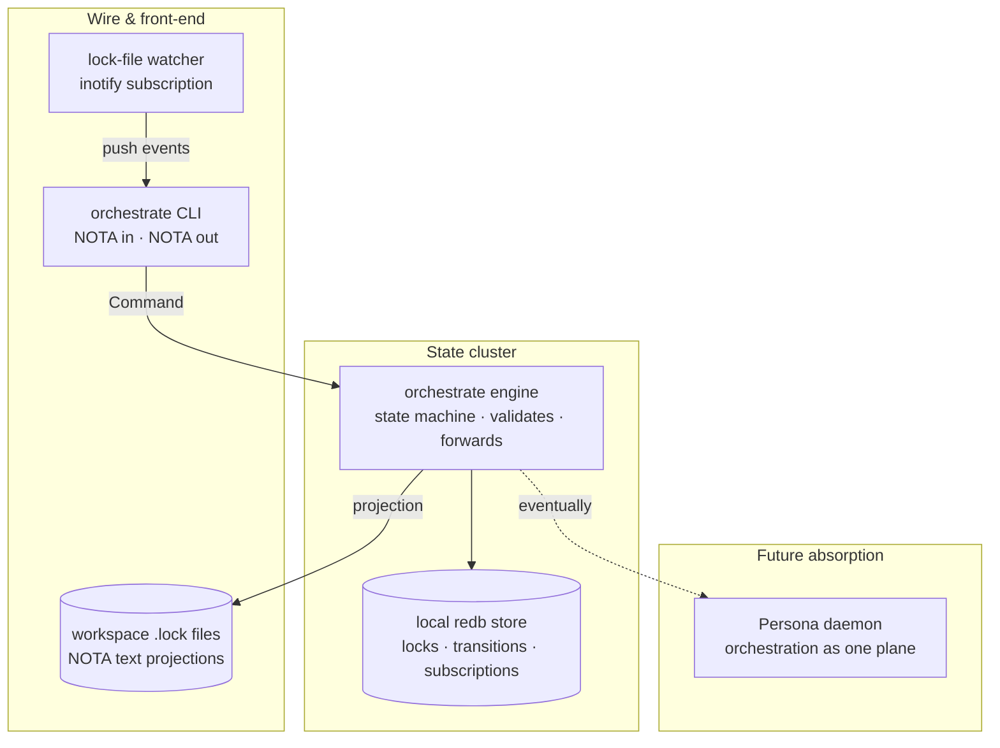
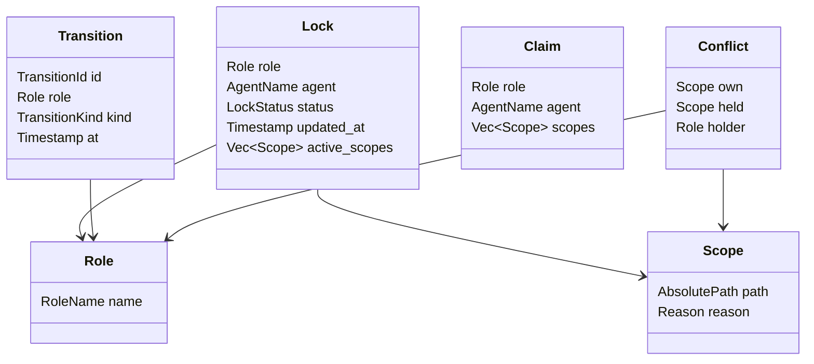
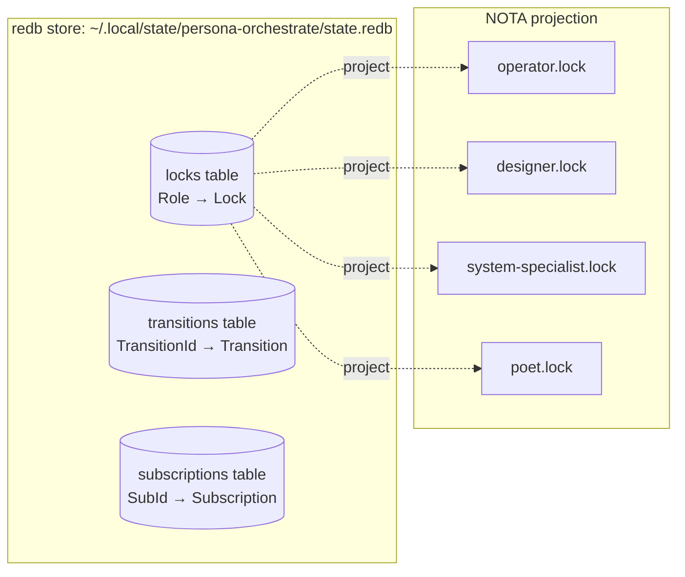
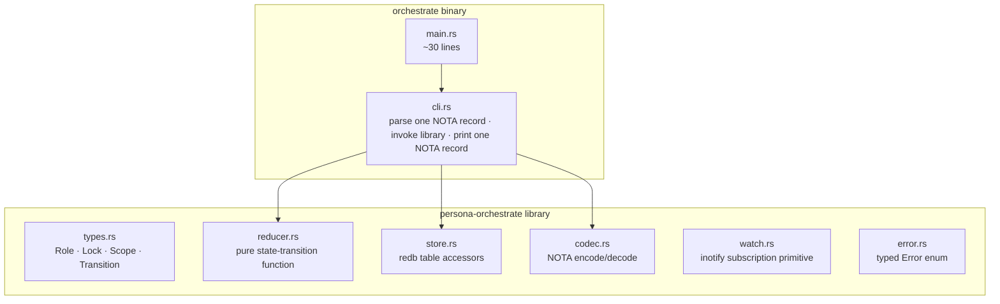
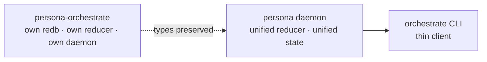

# persona-orchestrate — Rust component proposal

Date: 2026-05-07
Author: Claude (designer)

A proposal for replacing the Bash `tools/orchestrate` script
with a typed Rust component in its own repository,
`persona-orchestrate`. The component is **the predecessor of
Persona's full orchestration layer** — same Criome-shaped
state engine, scoped down to workspace coordination
(claim/release on role-owned scopes). It uses rkyv for
binary serialization, redb for the embedded KV store, and
NOTA for the wire format and human-readable lock-file
projections. Library-heavy; the CLI is a thin wrapper.

This report is design, not code. It names the shape, the
pieces, the storage model, and the phasing toward absorption
into the Persona daemon. It addresses the operator's open
bead `primary-jwi` ("Harden orchestration helper into a
typed Persona component").

---

## 1. Why this exists

The current `tools/orchestrate` Bash script is two-role-grew-to-N
hack. It works: the four roles (operator, designer,
system-specialist, poet) coordinate cleanly through plaintext
lock files, conflict detection runs at claim time, the script
is short and trivially editable.

But it has reached the limits of its shape:

- **Stringly-typed throughout.** Roles are case-statement
  branches. Lock-file contents are parsed by `awk` and `grep`
  on prose lines.
- **No persistent transition log.** Every claim/release
  rewrites the lock file from scratch; the history of who
  claimed what when lives only in git commits.
- **No subscription primitive.** Agents that want to react
  to lock changes have no push channel; they would have to
  poll lock files.
- **No protocol surface for richer claims.** Future
  features — typed claim TTLs, scoped sub-claims,
  authorization gates, cross-machine coordination — don't
  fit the Bash shape.

Operator's bead `primary-jwi` already names the move: *harden
the orchestration helper into a typed Persona component.*
Persona itself isn't ready to absorb the work yet (the
reducer is still designed, not built). The right intermediate
shape is **a sibling component, in its own repo, following
Persona's pattern at smaller scope.**

---

## 2. The pattern — Criome-shape, scoped down

`persona-orchestrate` mirrors Criome's three-cluster pattern,
scoped to workspace coordination instead of sema-ecosystem
state.



The design borrows directly from Criome's discipline:

| Criome | persona-orchestrate |
|---|---|
| **state engine validates + forwards** | engine validates a Claim against current locks; forwards effect (write to store + project to lock file) |
| **runs nothing** | the engine doesn't talk to other roles directly; it writes the lock state and lets observers learn via inotify |
| **sema** (typed records DB; redb) | the local redb store; same approach |
| **signal** (wire) | NOTA records (workspace standard) |
| **nexus** (text↔signal gateway) | the CLI is the gateway; takes one NOTA record on stdin/argv |
| **forge / arca** (executors) | not needed yet — orchestration has no effect-bearing work beyond "write the lock file" |

Where Criome dispatches typed verbs to executor crates,
`persona-orchestrate` only writes its own state — there are
no remote effects to dispatch (yet). The pattern is the same;
the executor cluster is empty until persona absorbs the
component.

---

## 3. The state machine

The orchestration model is small. Six typed records and three
commands cover the entire surface.

### 3.1 Records



Two closed enums:

```text
RoleName       = Operator | Designer | SystemSpecialist | Poet
LockStatus     = Idle | Active
TransitionKind = ClaimGranted | ClaimRejected | Released
```

`RoleName` is a closed enum per `skills/rust-discipline.md`
§"Don't hide typification in strings". Adding a new role is
an enum-variant addition + exhaustive-match update — the
compiler forces every dispatch site to be touched.

### 3.2 Commands

```text
ClaimScope    (role, agent, scopes, reason)
ReleaseScope  (role)
Status        ()
```

Three commands. Each is a typed Nota record. The CLI takes
exactly one record and returns exactly one record (per
`lojix-cli`'s "one Nota record IN, one Nota record OUT"
shape).

### 3.3 Reducer

```mermaid
flowchart TD
    cmd[Command record arrives]
    decode[NOTA decode]
    validate{validate}
    overlap{overlap with<br/>any other active lock?}
    grant[write Lock(Active) ·<br/>append ClaimGranted ·<br/>project to .lock file]
    reject[append ClaimRejected ·<br/>return Conflict]
    release[write Lock(Idle) ·<br/>append Released ·<br/>project to .lock file]
    status[read all Locks ·<br/>read open beads ·<br/>return Status]

    cmd --> decode
    decode --> validate
    validate -->|ClaimScope| overlap
    overlap -->|no| grant
    overlap -->|yes| reject
    validate -->|ReleaseScope| release
    validate -->|Status| status
```

The reducer is **pure**: it takes the current state +
command and returns the new state + zero or more effects.
The "effects" here are: write the redb state, append the
transition log entry, project to the NOTA `.lock` file.
That's it.

This matches Criome's reducer pattern. The pure reducer is
testable in isolation, replayable from the transition log,
deterministic over the same input sequence.

---

## 4. Storage — redb + rkyv

Following sema's discipline (redb + rkyv as the canonical
binary store):



**Three redb tables:**

- `locks` — keyed by `RoleName`, value is a `Lock` record
  (rkyv-encoded). The current state of each role's
  coordination.
- `transitions` — append-only log of every state change.
  Keyed by monotonic `TransitionId`, value is a `Transition`
  record. The lineage of all coordination decisions.
- `subscriptions` — held subscriptions for daemon mode
  (Phase 5). MVP CLI doesn't write here.

**rkyv encoding** for the values: zero-copy reads, content-
addressable bytes, the workspace standard for binary
serialization in redb tables.

**NOTA projection** for the lock files. After every
state-changing command, the engine writes the affected
role's lock as a NOTA record to disk:

```nota
(Lock
  designer
  Claude
  Active
  "2026-05-07T14:00:00+02:00"
  [(Scope "/home/li/primary/skills/jj.md" "tighten jj-mandate")])
```

This keeps lock files **human-readable and git-trackable**,
preserving the existing workflow where coordination state is
visible to peer machines via committed lock files. The redb
store is the in-process truth; the lock file is the outward
projection.

---

## 5. Library vs binary

Per the user's framing — *as much as possible should be a
library*. The split:



**Library (`persona-orchestrate`)** holds:
- Typed records (`Role`, `Lock`, `Scope`, `Transition`,
  `Claim`, `Conflict`).
- Reducer (pure function over `(State, Command) → (State,
  Vec<Effect>)`).
- redb table layout + accessors.
- NOTA codec (round-trip for every record type).
- inotify subscription primitive (push-not-pull observer
  for lock files).
- Typed `Error` enum per crate (per
  `skills/rust-discipline.md`).

**Binary (`orchestrate`)** is a thin wrapper:
- Reads one NOTA record from argv.
- Calls library to decode → reduce → encode response.
- Writes one NOTA record to stdout.
- ~30 lines.

This matches `persona-message`'s `message` binary shape and
`lojix-cli`'s pattern. Other consumers (the eventual Persona
daemon, future scripts, agents that subscribe to lock
changes) link the library directly without going through
the CLI.

---

## 6. CLI surface — one Nota record in, one Nota record out

Following `lojix-cli` and `persona-message`:

```text
orchestrate '(ClaimScope designer Claude
              [(Scope "/home/li/primary/skills/jj.md" "tighten jj-mandate")
               (Scope "/home/li/primary/AGENTS.md" "ref update")]
              "consolidate jj discipline")'

orchestrate '(ReleaseScope designer)'

orchestrate '(Status)'
```

No flags. No subcommands. The verb is the head identifier of
the NOTA record; the parser dispatches on that. New
operations land as new typed records, not as new flags.

**Output is also one NOTA record:**

```nota
(Granted
  designer
  Claude
  [(Scope "/home/li/primary/skills/jj.md" "tighten jj-mandate")
   (Scope "/home/li/primary/AGENTS.md" "ref update")])

(Rejected
  designer
  [(Conflict
     "/home/li/primary/skills/jj.md"
     "/home/li/primary/skills/jj.md"
     operator)])

(Released designer)

(Status
  [(Lock operator Codex Active "..." [...])
   (Lock designer Claude Idle "..." [])
   (Lock system-specialist (unspecified) Idle "..." [])
   (Lock poet (unspecified) Idle "..." [])]
  [(Bead primary-jwi "Harden orchestration helper into a typed Persona component")
   ...])
```

The output's typed shape lets agents pattern-match on the
result instead of parsing prose. This is the same discipline
`persona-message` already uses (`Accepted`, `InboxMessages`).

---

## 7. Push, never pull — the inotify subscription primitive

Per `ESSENCE.md` §"Polling is forbidden", the engine must
not poll. The MVP CLI is one-shot: each invocation reads the
current state from redb and acts. The CLI itself doesn't
need to watch — the invocation IS the event.

For agents that want to *react* to lock changes (Phase 4):

```mermaid
sequenceDiagram
    participant A as agent
    participant W as orchestrate watch
    participant FS as inotify
    participant L as .lock files

    A->>W: subscribe(role-filter)
    W->>FS: register watch on .lock files
    Note over FS: kernel pushes
    L-->>FS: file changed
    FS-->>W: IN_MODIFY event
    W->>L: read changed lock as NOTA
    W-->>A: Lock record
    Note over A: subscriber processes;<br/>no polling anywhere
```

inotify is one of the named carve-outs in `ESSENCE.md`
§"Polling is forbidden" — *deadline-driven OS timers* and
its sibling, *kernel-pushed file events*. The watcher is a
real subscription primitive, not a poll loop.

**No periodic re-read of any kind.** No `sleep(N)`. No
"check every K seconds." If a watcher misses an event
(impossible in practice for inotify on local files), the
recovery is to re-read once on demand — not to schedule a
fallback poll.

---

## 8. Phasing — six steps to persona absorption

```mermaid
flowchart TB
    p1[Phase 1<br/>library: types · reducer · store · codec · error<br/>no binary yet]
    p2[Phase 2<br/>orchestrate binary<br/>NOTA in · NOTA out · 1:1 with current Bash semantics]
    p3[Phase 3<br/>retire tools/orchestrate Bash<br/>flake input replaces script]
    p4[Phase 4<br/>inotify subscription primitive<br/>push-channel for agents that want it]
    p5[Phase 5<br/>daemon mode (optional)<br/>long-lived ractor process · holds subscriptions]
    p6[Phase 6<br/>Persona absorption<br/>state merges into Persona reducer · CLI talks to Persona daemon]

    p1 --> p2 --> p3 --> p4 --> p5 --> p6
```

**Phase 1** is the bulk of the work: typed records, the
reducer, redb tables, NOTA codec, error types. Tests-first
per `skills/rust-discipline.md`. Library-only; can be
exercised through tests without a binary.

**Phase 2** wraps the library in a `~30-line` CLI. The
behavior matches the current Bash 1:1 — same lock semantics,
same conflict detection, same status output (in NOTA form).

**Phase 3** removes `~/primary/tools/orchestrate`. The Rust
binary, exposed via `persona-orchestrate`'s flake output,
becomes the canonical entry point. CriomOS-home or the
workspace flake brings the binary onto PATH.

**Phase 4** adds the inotify subscription primitive. Agents
that want to wake on lock changes (e.g., a UI showing live
coordination state, an agent waiting for a peer to release a
scope) link the library and call `Watcher::subscribe(...)`.

**Phase 5** *optionally* wraps the library in a long-lived
`ractor` daemon. The daemon holds subscriptions, owns the
redb store as in-memory state, and serves CLI invocations
over a Unix socket. This is the *exact shape* persona will
absorb — a single-reducer process owning typed coordination
state. If the persona daemon is close enough to ready by
this point, Phase 5 is skipped and we go straight to Phase 6.

**Phase 6** retires `persona-orchestrate` as an independent
component. Its records become a slice of persona's state.
Its reducer logic merges into persona's reducer. Its redb
store merges into persona's store. The CLI surface
(`orchestrate '(...)'`) keeps working — the binary becomes
a thin client of persona's daemon socket, the same way
`message` will.

---

## 9. Repository setup — standard sema-ecosystem layout

Following the workspace's micro-components discipline (one
capability, one crate, one repo) and `lore/AGENTS.md`'s
canonical-repo conventions:

```text
persona-orchestrate/
├── AGENTS.md                  # repo's agent contract; points at lore/AGENTS.md
├── CLAUDE.md                  # one-line shim → AGENTS.md
├── ARCHITECTURE.md            # repo's bird's-eye view
├── README.md
├── LICENSE.md
├── skills.md                  # how to work in this repo
├── Cargo.toml                 # one crate, one repo
├── Cargo.lock
├── rust-toolchain.toml        # fenix-pinned toolchain
├── flake.nix                  # crane + fenix build
├── flake.lock
├── src/
│   ├── lib.rs                 # re-exports
│   ├── error.rs               # Error enum (thiserror)
│   ├── types.rs               # Role, Lock, Scope, Transition, ...
│   ├── reducer.rs             # pure state transitions
│   ├── store.rs               # redb tables + accessors
│   ├── codec.rs               # NOTA encode/decode
│   ├── watch.rs               # inotify subscription primitive
│   └── main.rs                # ~30-line CLI
├── tests/
│   ├── reducer.rs             # reducer tests
│   ├── codec.rs               # NOTA round-trip tests
│   ├── store.rs               # redb integration tests
│   └── conflicts.rs           # cross-role conflict-detection scenarios
└── reports/
    └── (per-repo reports go here as 1-, 2-, 3- ...)
```

Two binaries are not needed yet. If a `daemon` binary
(Phase 5) lands, it's added under `[[bin]]` in `Cargo.toml`
following the `<crate>-daemon` naming from `lore/AGENTS.md`
§"Binary naming". Otherwise the single `orchestrate` binary
is enough.

**Dependencies** (per `lore/rust/style.md` and
`lore/rust/nix-packaging.md`):

```text
nota-codec       — wire format
rkyv             — binary serialization
redb             — embedded KV store
notify           — inotify wrapper (cross-platform safety net)
thiserror        — error enum derive
ractor           — only if Phase 5 daemon lands
```

Sibling deps (`nota-codec`) come in via flake input
populating `path = "..."` per `lore/rust/style.md`. No
`git+file://` per `skills/nix-discipline.md`.

---

## 10. Naming

| Layer | Name | Why |
|---|---|---|
| Repo | `persona-orchestrate` | Names its lineage; sits next to `persona-message`, `persona-wezterm`. |
| Crate (lib) | `persona-orchestrate` | One crate per repo. |
| Library import | `persona_orchestrate` | Standard cargo. |
| Binary | `orchestrate` | Matches the verb; replaces `tools/orchestrate`. |
| Daemon binary (Phase 5) | `orchestrate-daemon` | Per `lore/AGENTS.md` §"Binary naming". |

The user typed *"Persona Orchestrate"* with a space; the
kebab-case form `persona-orchestrate` matches every other
workspace repo name. The verb `orchestrate` as the binary
name keeps the CLI invocation short and matches what
fingers already know.

---

## 11. Persona alignment — what gets absorbed

When persona's reducer is ready (per
`reports/designer/4-persona-messaging-design.md`), the
absorption maps cleanly:

| persona-orchestrate today | persona tomorrow |
|---|---|
| `Lock` record | `LockSlot` field on persona's coordination plane |
| `Transition` record | persona's transition log (one stream of all transitions across all planes) |
| `ClaimScope` command | persona Command — one variant in the unified command enum |
| `ReleaseScope` command | persona Command — same |
| `Status` query | persona snapshot + bead reads, unified |
| redb store | merges into persona's redb store |
| CLI binary | thin client of persona daemon's socket |
| inotify watcher | replaced by persona daemon's push subscription |

The records `persona-orchestrate` defines today are the
*starting types* persona's coordination plane will use
tomorrow. Designing them now under the workspace's discipline
means persona doesn't have to rename them later.

The cleanup at absorption time:



The CLI's NOTA invocation form (`orchestrate '(ClaimScope ...)'`)
keeps working. Users don't notice the absorption.

---

## 12. What this proposal is NOT

- **Not cross-machine.** Coordination is per-workspace,
  single-host. Cross-machine coordination is persona's
  concern (location-transparent harnesses per report 4).
- **Not authorization.** Claims are trusted (the agent
  declaring a role IS the agent acting in that role). An
  authorization gate is persona's `Authorization` record
  per report 4.
- **Not message routing.** That's `persona-message`.
  `persona-orchestrate` only handles claim/release on
  scopes.
- **Not a TTL system for claims.** Claims are explicit:
  the agent holds the scope until it releases or until the
  user discharges it. (Auto-expiry could be added later if
  forgotten claims become a real problem; not MVP.)
- **Not a lock-server.** No daemon in MVP; the CLI is
  one-shot, redb is the truth, lock files are the
  projection.

---

## 13. Open questions

In rough priority order:

1. **Does the daemon (Phase 5) land before persona absorbs
   the component?** My lean: **no**. The daemon shape *is*
   what persona absorbs; building it twice is waste.
   Phases 1–4 are the right scope; persona's daemon picks
   up where Phase 4 leaves off.
2. **Library naming — `persona-orchestrate` or
   `orchestrate`?** I lean `persona-orchestrate` for the
   crate name. The binary stays `orchestrate` (verb).
3. **Does `Status` return open beads, like the current Bash
   does?** Yes; agents currently rely on the bead listing
   in claim/release output. Either embed in the NOTA `Status`
   record or have a separate `OpenBeads` query.
4. **Where do conflict-resolution rules live?** For now:
   the reducer rejects on any path overlap. No precedence
   rules between roles. If precedence becomes useful later,
   it lands as a typed `ConflictPolicy` field in the
   workspace's coordination state — not as a flag on the
   CLI.
5. **What happens if redb is missing on first run?** The
   CLI initializes an empty store with idle Locks for all
   four roles. First-run is the migration from the Bash
   tool's lock files.
6. **Cross-process consistency.** Two CLI invocations from
   different processes hitting redb at the same time:
   redb's transaction model handles this. The reducer's
   reads + writes happen inside a single transaction.
7. **What about old commit history of the Bash lock
   files?** They stay in git. The Rust component doesn't
   migrate the Bash-era lock files; it starts from idle
   on first run. The Bash tool's history captures the
   Bash-era coordination.

---

## 14. Smaller observations

- **The reducer is small.** Maybe ~50 lines for the core
  match-and-validate. The bulk of the library is records,
  codec, and storage.
- **The codec round-trip is mechanical.** Every record
  derives `NotaRecord`. The codec module mostly contains
  trait impls for the dispatch enum (`Command`, `Output`)
  picking variants by head identifier — same as
  `persona-message/src/command.rs`.
- **Test surface is contained.** The reducer is
  pure-function-of-state, so tests don't need a real redb
  database; an in-memory state suffices for reducer tests.
  Store tests use `tempfile` per `lore/rust/testing.md`.
- **The current Bash's `print_state` becomes `Status`'s
  output.** Same content (all role locks + bead listing),
  typed instead of formatted-text.

---

## 15. Recommendations

1. **Operator picks up `primary-jwi` with this design as
   the starting shape.** Phase 1 (library) is the bulk of
   the work; lands as a single substantive PR.
2. **Phase 1 lands first; Phase 2 (binary) is the smallest
   commit on top.** This keeps the library validated by
   tests before any user-facing surface ships.
3. **Phase 3 (retire `tools/orchestrate`) waits for
   confidence.** A week of running both side-by-side, then
   delete the Bash. Don't accumulate two sources of truth.
4. **Phases 4–6 are deferred** until persona's reducer
   timeline becomes clearer. Phase 4 (inotify watcher) has
   independent value; Phases 5–6 should wait.
5. **Cross-reference this report from the new repo's
   `ARCHITECTURE.md`.** When `persona-orchestrate` lands,
   its `ARCHITECTURE.md` cites this design report as the
   foundational reference (per
   `lore/AGENTS.md`'s pattern of architecture docs
   pointing at workspace reports).

---

## 16. See also

- `~/primary/tools/orchestrate` — the Bash predecessor.
- `~/primary/protocols/orchestration.md` — the protocol the
  tool implements.
- `~/primary/reports/designer/4-persona-messaging-design.md`
  — the destination architecture; persona-orchestrate
  becomes one plane of this design.
- `~/primary/reports/designer/12-no-polling-delivery-design.md`
  — the no-polling design; the inotify watcher is one
  application of the same push-not-pull discipline.
- `criome/ARCHITECTURE.md` — the apex pattern this design
  borrows from. Read §1 ("the engine in one map") for the
  three-cluster shape.
- `criome/skills.md` — the *eventually impossible to
  improve* discipline that this component aims for.
- `~/primary/skills/rust-discipline.md` — closed enums,
  domain newtypes, error per crate, methods on types.
- `~/primary/skills/micro-components.md` — one capability,
  one crate, one repo.
- `~/primary/skills/nix-discipline.md` — flake inputs;
  no `git+file://`.
- `lore/rust/style.md` — `Cargo.toml` shape, cross-crate
  deps, pin strategy.
- `lore/rust/ractor.md` — actor framework reference (Phase
  5 daemon).
- `lore/rust/rkyv.md` — rkyv portable feature set.
- `lore/rust/nix-packaging.md` — canonical crane + fenix
  flake layout.
- `persona-message`'s `Cargo.toml` and `src/main.rs` —
  the closest existing template for this repo's shape.
- BEADS task `primary-jwi` — operator's open task this
  proposal addresses.

---

*End report.*
