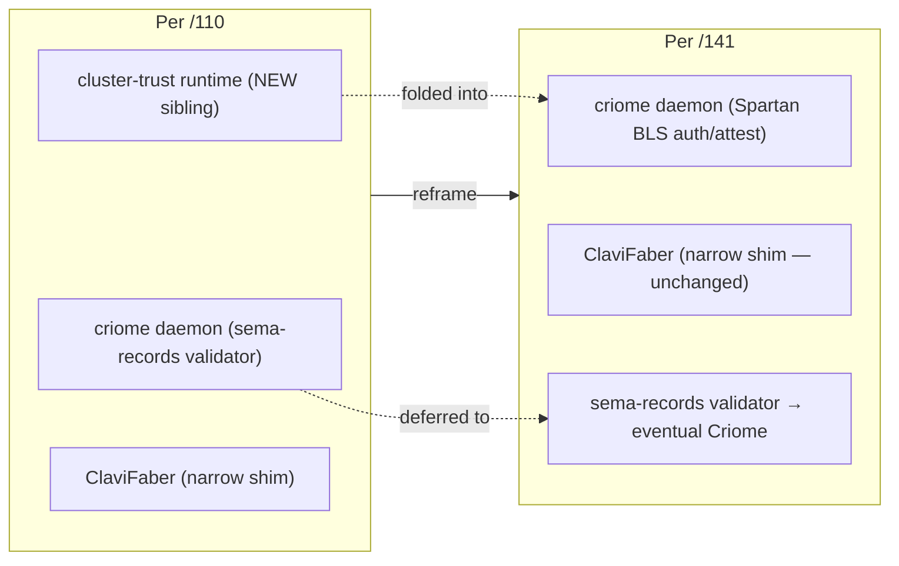
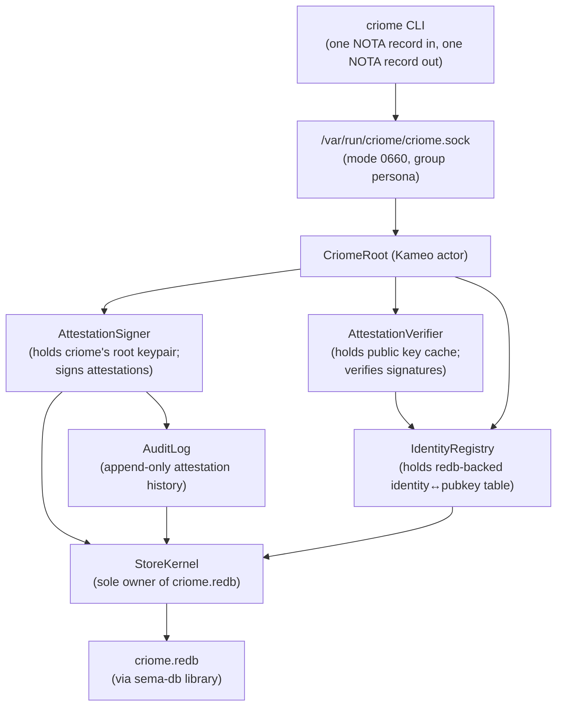
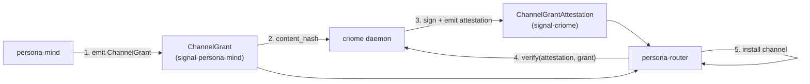
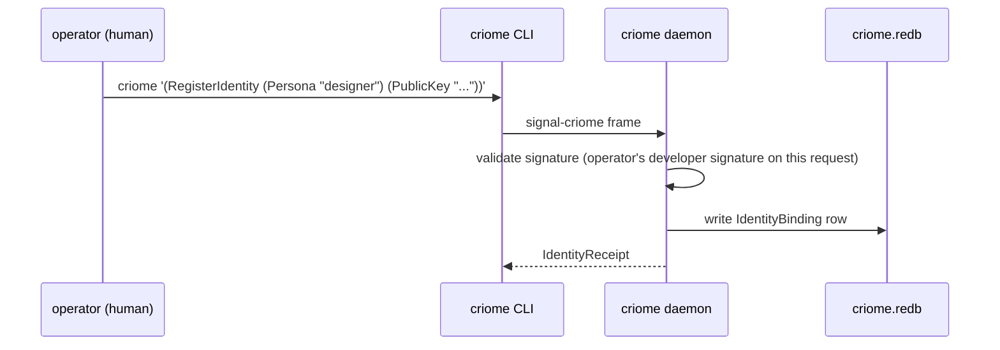
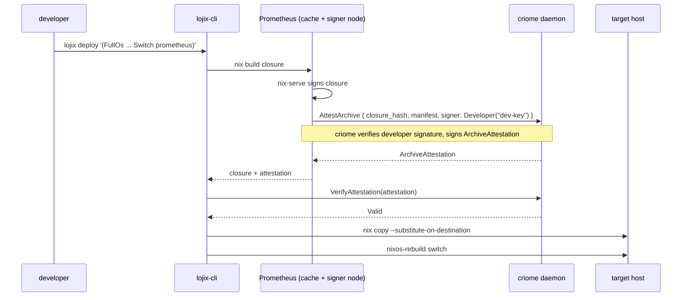

# 141 — Minimal Criome as BLS Auth Substrate

*Designer report. Reframes today's `criome` daemon: shelf the
sema-records-validator skeleton; rewrite as a **Spartan
BLS-signature authentication and attestation substrate** for the
Persona ecosystem. Identifies the contract surface, the records
that get attested, the integration points across the stack, and
the operator handoff. Partially supersedes designer/110 on the
question "what does today's criome daemon do?".*

---

## 0 · TL;DR

| Question | Answer |
|---|---|
| What is today's `criome`? | A **minimal Spartan BLS-signature authentication and attestation daemon** — not the sema-ecosystem records validator. |
| Why now? | The workspace's near-term need is auth/attestation across personas, agents, channel grants, privilege elevation, and release archives. Per /110's framing, eventual Criome eventually subsumes auth; we bring that slice forward into today's scope, narrow and Spartan. |
| Supersedes what? | /110's "today's criome = sema-records validator; cluster-trust runtime = new sibling component." The cluster-trust runtime function is **folded into the Spartan criome**; ClaviFaber's `PublicKeyPublication` feeds into criome's identity registry. /110's discipline (ClaviFaber stays narrow; eventual Criome subsumes everything) is preserved. |
| What happens to the sema-records validator? | Deferred to eventual Criome (Sema-on-Sema). No active consumer today; the skeleton in commit `a3f4173` of `criome` remains as design archaeology if a future agent wants to mine it. |
| Operative principle | **Criome verifies; Persona decides.** Criome answers *"is this signature valid for this principal under this grant for these bytes?"* Persona answers *"should this prompt be delivered, should this work be executed, should this elevation be honored?"* The boundary is sharp. (Per designer-assistant/30 §0.) |
| Signing scheme | **Closed `SignatureScheme` enum**, starting with `Ed25519` (via `ed25519-dalek`) for single-signer cases. `Bls12_381MinPk` / `Bls12_381MinSig` (via `blst`) land when quorum/aggregation is load-bearing, justified by a concrete first quorum witness. Single-scheme commit on day one; second scheme is a coordinated schema bump. |
| Owns what state? | One redb file: `criome.redb`. Identity registry (PublicKey ↔ typed Identity), delegation grants, replay-guard nonces, and an append-only audit event log. Criome holds its own root keypair (private + public). Held via `sema-db`. |
| Wire contract | `signal-criome` (new repo) — closed `CriomeRequest`/`CriomeReply` enums. Depends only on `signal-core`; does not depend on `signal` (the sema-ecosystem vocabulary). Avoids the overloaded `AuthProof` name from `signal/src/auth.rs` (drift surfaced in designer-assistant/30 §1.3); uses specific names `SignatureEnvelope`, `SignedObject`, `VerificationReceipt`, `DelegationGrant`, `ComponentRelease`, `SignedPersonaRequest`. |
| Out-of-band, never in-band | Verification records live in `signal-criome` and reference content records (e.g. a `ChannelGrant` from `signal-persona-mind`) by content hash. They are not embedded as proof fields inside the content records themselves. `signal-persona-auth`'s discipline ("origin context, not proof material") stays inviolate; designer/125's "filesystem ACL is the local engine boundary; per-component class gates are removed" stays inviolate. |
| Domain separation in signed bytes | Every signed payload binds the content hash to its **purpose** (component name, channel role, audience, contract/schema version, expiry) so a release signature cannot be replayed as a persona-message authorization. Detached signatures over raw bytes are forbidden. |
| Replay protection | A typed `replay_guard` redb table tracks `(principal, audience, nonce)` for one-shot delegations and time-bound authorizations. Repeat use rejects with `VerificationRejected::ReplayAttempted`. |
| What gets attested | Channel grants/retracts/denies (mind→router); cross-persona signed requests; agent privilege elevations; release archive fingerprints (replacing trust in Git/GitHub as the trust root). |
| Persona audit | **Lives in `persona-mind`, NOT in criome** (per designer-assistant/30 §2.3). Criome's verification receipt says "this signed request comes from a known principal under a valid delegation"; mind decides whether the request is safe to absorb or execute. Conflating the two would recreate the in-band proof / per-component gate sprawl that designer/125 explicitly removed. |

---

## 1 · The reframe

### 1.1 What changes

`criome/ARCHITECTURE.md` today describes a sema-ecosystem
records-validator daemon (Graph/Node/Edge/Derivation/CompiledBinary
validation, capability-token signing as a side concern). The
implementation is M0 — handshake + Assert + Query + Subscribe over
sema; the validator pipeline (schema → refs → invariants →
permissions → write → cascade) is entirely `todo!()` skeleton.

The new shape narrows criome to **one concern**: be the
workspace's BLS signing/verification substrate and identity
registry. Everything else — sema-records validation, forge
dispatch, store-entry control plane — leaves today's criome.

### 1.2 Why this is the right move

Three converging pressures:

- **`signal-persona-auth` deliberately rejects in-band proof.**
  Per its ARCH §"Non-Goals": "No in-band signing. No runtime
  permission checks." The workspace's auth/route implementation
  wave (deferred in `persona/ARCHITECTURE.md` §1.6) needs an
  out-of-band proof source. The new Spartan criome IS that
  source.

- **/125's channel choreography needs attestations.** Today
  `ChannelGrant`/`Retract`/`AdjudicationDeny` flow from mind to
  router as typed records but carry no signature. Router has no
  way to verify "did mind actually emit this grant?" beyond
  trusting the socket-ACL boundary. For workspace-internal
  trust that's sufficient; for cross-engine or cross-host
  trust, attestations are the way forward.

- **Release supply-chain trust currently lives in
  Git/GitHub.** Flake inputs resolve via `github:owner/repo`;
  nothing verifies the resolved commit before
  `nixos-rebuild`. The user's stated direction: move trust
  out of Git/GitHub (treat it as dumb storage) and into
  criome-signed archive fingerprints.

The Spartan criome closes all three at once. It is small
(one daemon, one redb, one contract crate, one signing
primitive); it has clear integration points across the
stack; and it is consistent with the eventual-Criome
direction in `ESSENCE.md` §"Today and eventually".

### 1.3 What this supersedes in /110

Per `reports/designer/110-cluster-trust-runtime-placement.md`:

| /110 claimed | /141 reframes |
|---|---|
| "Today's criome = sema-ecosystem records validator (Graph/Node/Edge/Derivation/CompiledBinary)." | **Today's criome = BLS authentication and attestation substrate.** Sema-records validator function deferred to eventual Criome. |
| "Cluster-trust runtime is a NEW sibling component, not inside criome, not inside ClaviFaber." | **Cluster-trust runtime is folded into the Spartan criome.** The new criome IS the identity registry + public-material distribution + attestation source. No separate sibling component needed. |
| "ClaviFaber stays narrow." | **Unchanged.** ClaviFaber remains a per-host key-generation shim. Its `PublicKeyPublication` records feed into criome's identity registry via `signal-clavifaber`. |
| "Eventual Criome eventually subsumes everything." | **Unchanged.** The Spartan criome IS a step toward that subsumption; bringing auth forward into today's scope, Spartan-style. |

/110's scope discipline (today vs eventually) is preserved.
What changes is *which slice of the eventual* we bring into
today: not "cluster-trust as a new sibling," but "auth
substrate as today's criome."



---

## 2 · The Spartan shape

### 2.1 One component, three responsibilities

The new criome is **one Kameo-based daemon** doing exactly
three things:

1. **Sign** content (NOTA-typed records or content hashes) with
   its own root key, producing typed `Attestation` records.
2. **Verify** content against a public key registered in its
   identity registry.
3. **Register / lookup** typed identities — bind a
   PublicKey to an `Identity` (Persona, Agent, Host, Developer,
   Cluster) and serve queries.

Nothing else. No records-validator pipeline, no forge dispatch,
no store-entry control plane, no subscriptions push pipeline
beyond what's needed for identity registry updates.

### 2.2 Topology



Direct Kameo per `skills/kameo.md` and `skills/actor-systems.md`.
Self IS the actor; one redb opened by `StoreKernel`; blocking
work (BLS keypair load, signature generation, signature
verification) lives in `AttestationSigner` / `AttestationVerifier`
either via `DelegatedReply` + `spawn_blocking` (Template 1 in
`skills/kameo.md` §"Blocking-plane templates") or by isolating
signature work on a dedicated thread pool (Template 2). Operator
picks the template per the work pattern observed at implementation.

### 2.3 Sizes

Per `skills/micro-components.md`, the whole component fits in
one LLM context window. Initial implementation budget:

| Surface | Lines (rough) |
|---|---|
| `src/lib.rs` re-exports | ~30 |
| `src/main.rs` daemon entry | ~50 |
| `src/error.rs` typed Error enum | ~50 |
| `src/actors/root.rs` CriomeRoot | ~80 |
| `src/actors/signer.rs` AttestationSigner | ~150 |
| `src/actors/verifier.rs` AttestationVerifier | ~100 |
| `src/actors/registry.rs` IdentityRegistry | ~120 |
| `src/actors/store.rs` StoreKernel + tables | ~150 |
| `src/text.rs` NOTA projection | ~100 |
| `src/transport.rs` Signal-frame transport | ~150 |
| `src/command.rs` CLI client logic | ~80 |
| `tests/*.rs` round-trip + truth tests | ~400 |
| **Total** | **~1500 lines**, well inside the ceiling. |

The `signal-criome` contract crate is similarly small: ~600
lines including round-trip tests, per the pattern in
`signal-persona-mind` (~500 lines today).

---

## 3 · Wire vocabulary — `signal-criome`

### 3.1 Crate placement

New repo at `github:LiGoldragon/signal-criome`. Depends only on
`signal-core` (the wire kernel — Frame, handshake, verb spine).
**Does not depend on `signal`** — `signal` is the sema-ecosystem
vocabulary (Node/Edge/Graph) which today's criome no longer
serves. The new criome and the eventual sema-records validator
become siblings under `signal-core`, not a layering relationship.

### 3.2 Closed request/reply enums

```text
CriomeRequest (closed enum)
  | Sign(SignRequest)
  | VerifyAttestation(VerifyRequest)
  | RegisterIdentity(IdentityRegistration)
  | RevokeIdentity(IdentityRevocation)
  | LookupIdentity(IdentityLookup)
  | AttestArchive(ArchiveAttestationRequest)
  | AttestChannelGrant(ChannelGrantAttestationRequest)
  | AttestAuthorization(AuthorizationAttestationRequest)
  | SubscribeIdentityUpdates(IdentitySubscription)

CriomeReply (closed enum)
  | SignReceipt(SignReceipt)
  | VerificationResult(VerificationResult)
  | IdentityReceipt(IdentityReceipt)
  | IdentitySnapshot(IdentitySnapshot)
  | AttestationReceipt(AttestationReceipt)
  | IdentityUpdate(IdentityUpdate)
  | Rejection(Rejection)
```

Every variant is a typed record; no string-tagged dispatch; no
`Unknown` escape hatch (per `ESSENCE.md` §"Perfect specificity at
boundaries").

### 3.3 The identity type

```text
Identity (closed enum)
  | Persona(PersonaName)        — a named persona in the federation
  | Agent(AgentName)            — a harness/agent CLI session
  | Host(HostName)              — a CriomOS host (sourced from clavifaber)
  | Developer(DeveloperName)    — a human signer for releases
  | Cluster(ClusterName)        — a cluster's own root identity
```

Closed enum. No `Other` variant (per /127 §4.5). New identity
kinds land as coordinated schema bumps.

### 3.4 Attestation record families

The attestation pattern: criome attests *that* a typed record
exists and *that* a known identity authorized it. Attestations
are **separate records** that reference the content record —
never embedded inside the content record. This preserves
`signal-persona-auth`'s out-of-band discipline.

| Attestation kind | What it references | Who emits | Who verifies |
|---|---|---|---|
| `ChannelGrantAttestation` | `signal-persona-mind::ChannelGrant` | criome (signs after mind requests) | `persona-router` (before installing the channel) |
| `ChannelRetractAttestation` | `signal-persona-mind::ChannelRetract` | criome | `persona-router` |
| `AuthorizationAttestation` | a typed `AuthorizationRequest` (new in `signal-persona-mind`) | criome (after audit-policy verdict) | `persona-router` and/or recipient persona |
| `ArchiveAttestation` | a content-hash + manifest (new in `signal-criome`) | criome (after developer-signed request) | `lojix-cli`, `forge`, `arca-daemon` |
| `PrivilegeElevationAttestation` | a typed `PrivilegeElevationRequest` (new in `signal-persona`) | criome (after policy decision) | engine manager, target component |

Each attestation carries: the content reference (Slot or Hash),
the signer identity, the BLS signature, the issued/expires
timestamps, and an audit context block.

### 3.5 The Sign / Verify primitives

```text
SignRequest                  | content_hash: Blake3Hash
                             | signer_identity: Identity
                             | audit_context: AuditContext
                             | expires_at: Option<TimestampNanos>

SignReceipt                  | attestation: Attestation
                             | issued_at: TimestampNanos

Attestation                  | content_hash: Blake3Hash
                             | signer_pubkey: BlsPublicKey
                             | signer_identity: Identity
                             | issued_at: TimestampNanos
                             | expires_at: Option<TimestampNanos>
                             | audit_context: AuditContext
                             | signature: BlsSignature

VerifyRequest                | attestation: Attestation
                             | content_hash: Blake3Hash

VerificationResult (closed enum)
                             | Valid { identity: Identity, expires_at: Option<TimestampNanos> }
                             | InvalidSignature
                             | UnknownSigner
                             | Expired
                             | Revoked
```

`AuditContext` is a closed record that captures *what kind of
attestation this is* and any policy inputs (e.g., for
authorization attestations: source persona, target persona,
verdict, policy version). The signed payload is
`hash(content_hash || identity || issued_at || expires_at ||
audit_context)`. Operator picks the canonical encoding (rkyv
canonical bytes per workspace standard).

---

## 4 · Records and their signatures (out-of-band pattern)

The discipline matters: **content records stay clean of proof
material**. Attestations live in their own crate, reference
content records by Slot or Hash, and travel separately on the
wire.



The shape:

1. Mind makes a decision (e.g., grant a channel). The
   `ChannelGrant` record is emitted in `signal-persona-mind`
   form, **with no signature field**.
2. Mind asks criome to attest by sending `AttestChannelGrant`
   with the grant's content_hash and source identity.
3. Criome signs and returns `ChannelGrantAttestation` to mind.
4. Mind forwards both records (grant + attestation) to router.
5. Router verifies the attestation against the grant via
   `VerifyAttestation`, then installs the channel.

The same shape applies to authorization attestations, archive
attestations, and privilege-elevation attestations.

### 4.1 Why this shape (vs embedded signature fields)

| Property | Embedded signature | Separate attestation record |
|---|---|---|
| Adds proof to existing records | Yes — `signal-persona-mind::ChannelGrant { ..., signature }` | No — signal-persona-mind unchanged |
| Breaks signal-persona-auth's "no in-band proof" discipline | Yes | **No** |
| Backward-compatible with existing channel-grant code | No — every emitter + verifier touches the type | Yes — emitters/verifiers opt in by requesting/checking the attestation |
| Allows criome attestation to be optional initially | No (signature field exists everywhere) | **Yes (attestation can be present-or-absent at the same wire boundary)** |
| Composable across multiple attesters (criome + future quorum) | Hard | Easy — multiple attestation records per content record |
| Audit trail durability | Lives inside the content record (one row) | Lives separately (criome's redb owns the full audit log) |

The separate-record shape wins on every axis. The cost is one
extra wire round-trip when mind needs an attestation, which is
negligible at the cadence channel grants happen.

---

## 5 · Trust model and key distribution

### 5.1 The keys

| Key | Held by | Purpose |
|---|---|---|
| `criome` root keypair | criome daemon (`criome.redb`, mode 0600) | Signs all criome-issued attestations |
| Per-persona keypair | each persona's runtime state (TBD shape) | Signs persona-originated requests; criome holds the public half |
| Per-agent keypair | each agent's local state (TBD shape) | Signs agent-originated requests; criome holds the public half |
| Per-host keypair | ClaviFaber (per its existing ARCH) | Today: Ed25519 for SSH identity. Future: criome's identity registry can additionally bind a BLS key per host. |
| Per-developer keypair | each developer's local machine (TBD shape, likely HSM or gpg-agent-backed) | Signs release attestations; criome holds the public half |
| Per-cluster keypair | (TBD — possibly criome's root acts as cluster root) | Signs cluster-wide attestations |

Criome **holds only its own private key**. For every other
identity, criome holds the *public* half in its registry and
verifies signatures presented to it. Private-key custody for
personas, agents, developers, hosts stays distributed.

### 5.2 Bootstrap

The chicken-and-egg: criome's own public key needs to be known
to every verifier (router, lojix-cli, forge) before they can
trust criome's attestations.

Bootstrap mechanism: **criome's public key is materialized
into every consumer's startup environment via the
deployment system** — `lojix-cli` writes it to a well-known
path (`/etc/criome/root.pub`); `persona-engine-sandbox` and
related runners pass it as an environment variable. The path
+ environment-variable name lives in
`signal-criome`'s ARCHITECTURE.md as the canonical key
discovery convention.

This is trust-on-deploy: the deployment chain attests "the
file at /etc/criome/root.pub is criome's actual public
key," and downstream verifiers trust it. The first
bootstrap of a fresh cluster is human-mediated; subsequent
deploys carry the key forward.

Future enhancement: a `signal-criome::RotateRootKey` request
that lets criome rotate its root keypair (signed by the
previous root + an out-of-band human signature). Out of
scope for the Spartan first cut.

### 5.3 Identity registration flow



Initial registrations are human-driven; the operator (with a
developer key registered in criome's bootstrap config) signs
the registration request, criome verifies the signature, and
the new identity lands.

Subsequent registrations can be automated (e.g., clavifaber
publishes a new host's public material → cluster-trust feed
into criome via the same protocol).

### 5.4 Public key distribution

Verifiers (router, lojix-cli, forge) need to look up "what's
the public key for Identity X?" before verifying a signature
signed by X. Two patterns:

- **Pull**: verifier sends `LookupIdentity` request, gets back
  the current public key. Fine for low-rate verifications;
  awful for hot-path delivery.
- **Push** (preferred per `skills/push-not-pull.md`): verifier
  subscribes to `SubscribeIdentityUpdates`; criome pushes the
  current snapshot plus deltas as identities change. Verifier
  caches the snapshot in memory and uses it on every
  verification.

Per the workspace's push-not-pull discipline, the subscription
path is the production path. The pull path is acceptable as a
test-fixture convenience but not the production verification
shape.

---

## 6 · Integration points

This section names every component that consumes criome and
the typed records crossing the boundary. Operator's
implementation plan derives directly from this section.

### 6.1 `persona-mind` ↔ criome

Mind requests an attestation for each channel-choreography
decision before forwarding to router.

| Mind operation | Sends to criome | Receives from criome |
|---|---|---|
| Decide a channel grant | `AttestChannelGrant { grant_hash, source: Identity::Persona(...) }` | `ChannelGrantAttestation` |
| Decide a channel retract | `AttestChannelGrant { retract_hash, source }` | `ChannelRetractAttestation` |
| Decide an adjudication deny | `AttestAuthorization { deny_hash, source }` | `AuthorizationDenyAttestation` |

Mind's `MindRoot` gains a `CriomeClient` actor that holds the
criome socket connection. Per `skills/kameo.md`, the client is
either an `ActorRef<CriomeClient>` directly or a thin
`CriomeHandle` wrapper if the domain ergonomics warrant — let
operator pick at implementation time.

### 6.2 `persona-router` ↔ criome

Router subscribes to `IdentityUpdates` at startup and caches
the snapshot. Before installing any channel record from mind,
router verifies the attestation.

| Router operation | Sends to criome | Verifies with |
|---|---|---|
| Receive ChannelGrant + ChannelGrantAttestation from mind | (uses cached pubkey) | `VerifyAttestation(...)` against in-memory cache |
| Receive ChannelRetract + ChannelRetractAttestation | (uses cached pubkey) | `VerifyAttestation(...)` |

A new constraint: **router does not install a channel grant
that does not carry a valid attestation**. Today's
`ChannelGrant` flows are unsigned; the new requirement is
phased in by extending the structural-channel installation to
include attestations from the start, then gradually moving
mind-emitted grants behind the attestation gate.

### 6.3 `persona` engine manager ↔ criome

Engine manager attests cross-engine route approvals and
privilege-elevation verdicts.

| Engine manager operation | Sends to criome | Use |
|---|---|---|
| Approve a cross-engine route | `AttestChannelGrant` (with `source: Identity::Persona(...)` on the originating engine) | Cross-engine messages flow over routes signed by criome |
| Grant a harness elevated privilege | `AttestAuthorization` with `audit_context: PrivilegeElevation { ... }` | Target component (e.g., system service handler) verifies before honoring |

The "auth/route implementation wave" deferred in
`persona/ARCHITECTURE.md` §1.6 is the work this report makes
concrete.

### 6.4 `lojix-cli` ↔ criome

`lojix-cli` verifies archive attestations before activating a
closure on a host.



The deploy step gains one verification round-trip. The host's
local `criome.pub` (from `/etc/criome/root.pub`) is the trust
root; the developer's identity-registration with criome was
the prior bootstrap step.

### 6.5 Prompt audit lives in `persona-mind`, not in criome

Per designer-assistant/30 §2.3, the prompt-audit policy
engine **lives inside `persona-mind`**, NOT inside criome.
The boundary is sharp:

- **Criome** answers: "is this signed request from a known
  principal, under a valid delegation, over these exact
  bytes?"
- **persona-mind** answers: "is this prompt safe? does this
  request match policy? should this work be absorbed or
  executed?"

Conflating them recreates the failure mode designer/125
explicitly removed (per-component class gates and in-band
proof sprawl). The clean flow:

```text
external persona / developer / agent
  → SignedPersonaRequest crosses the future network or
    persona-message boundary
  → criome verifies signature, key status, grant, digest,
    nonce → returns VerificationAccepted with principal +
    delegation receipt
  → router commits message with verified provenance
  → router checks authorized-channel table
  → if no active channel, router parks and asks persona-mind
  → persona-mind runs prompt-audit / policy adjudication
  → mind issues ChannelGrant (allow once / permanent /
    time-bound) or AdjudicationDeny
  → router enforces the channel decision
```

The cryptographic facts (criome's verification receipt)
persist in criome's audit log; the safety/policy facts
(mind's adjudication record) persist in mind's work graph.
Neither replaces the other.

For *this* report: criome's contract surface supports the
flow via `VerifyAttestation` (router asks criome to verify
inbound signed requests). The prompt-audit policy engine
itself is in `persona-mind` and gets its own designer
report when the user is ready to design it.

### 6.6 ClaviFaber → criome (identity feed)

Existing pattern from /110: per-host ClaviFaber publishes
`PublicKeyPublication` (SSH ed25519 + WiFi cert + Yggdrasil).
The new criome subscribes to this feed and registers each
host as `Identity::Host(HostName)` in its registry.

This subsumes /110's "cluster-trust runtime" responsibility
into the new criome. ClaviFaber stays a narrow per-host shim;
criome holds the cluster-wide identity state.

---

## 7 · What gets shelved in today's criome repo

Today's `criome` repo carries a sema-records-validator skeleton.
The shelving is mechanical:

| Path | Lines | Action | Reason |
|---|---|---|---|
| `src/engine.rs` | 262 | Delete | Sema-records validation; not the new domain. |
| `src/reader.rs` | 131 | Delete | Sema query/decode; not the new domain. |
| `src/kinds.rs` | 21 | Delete | Record-kind discriminators (Graph/Node/Edge); not the new domain. |
| `src/validator/*.rs` | 77 | Delete | Validator skeleton (all `todo!()`); not the new domain. |
| `tests/engine.rs` | 189 | Delete | Tests assert/query Node/Edge/Graph; not transferable. |
| `src/bin/handle_frame.rs` | 53 | Delete | Sync façade over the old engine; rewrite if needed for new daemon. |
| `src/main.rs`, `src/daemon.rs`, `src/listener.rs`, `src/connection.rs` | ~500 | Delete and rewrite | The current scaffolding uses **ractor**, not Kameo. Per `skills/kameo.md`, ractor is retired; the new daemon is direct Kameo. The old scaffolding patterns (UDS accept, length-prefixed frames, per-connection actor) are sound but expressed in stale runtime; operator rewrites against Kameo. |
| `src/error.rs` | 31 | Delete and rewrite | New error vocabulary for the auth daemon. |
| `src/lib.rs` | 49 | Delete and rewrite | New module surface. |
| `Cargo.toml` | — | Rewrite | Drop `signal`, `sema`, `ractor`. Keep `tokio`, `thiserror`, `clap`. Add `kameo`, `sema-db`, `signal-core`, `signal-criome` (the new contract crate, when published), `blst`, `blake3`, `nota-codec`, `nota-derive`. |
| `ARCHITECTURE.md` | 993 | **Rewrite (this design's primary artifact)** | Today's ARCH describes the sema-records validator. New ARCH describes the Spartan BLS auth substrate. Reference commit `a3f4173` for archaeology of the prior shape. |
| `AGENTS.md` | — | Update repo-role section | Update to name the new repo role (auth substrate, not records validator). |
| `skills.md` | — | Update | Repo-specific intent for the new daemon. |
| `README.md` | — | Replace stub | Brief positioning of today's Spartan criome vs eventual Criome. |

**Archaeology pointer**: commit `a3f4173` (current `criome`
HEAD) contains the full sema-records validator skeleton + the
ractor supervision tree + the BLS-G1 capability-token type
stub in `signal/src/auth.rs`. Future agents who want to mine
that work can `jj log` to the commit and read the prior code
directly.

---

## 8 · Migration sequence (operator handoff)

The implementation lands as a numbered track. Each step
produces a falsifiable artifact (test or commit hash) before
the next begins.

### Track 1 — Foundation (≈ 1 session)

1. Land `signal-criome` repo (new): `Cargo.toml` with
   `signal-core` dep + `blst` + `blake3` + `nota-derive`;
   `src/lib.rs` declaring `CriomeRequest` / `CriomeReply`
   closed enums per §3.2 with `todo!()` payload types as
   skeleton-as-design; `tests/round_trip.rs` with one
   per-variant round-trip witness (NOTA + rkyv). Land minimal
   ARCH.

2. Rewrite `criome/Cargo.toml` per §7. Drop ractor + sema +
   signal; add kameo + sema-db + signal-core + signal-criome
   + blst + blake3 + nota-codec + nota-derive.

3. Stub `criome` daemon skeleton: `src/main.rs` binds the
   socket; `src/actors/root.rs` spawns the three child
   actors (`AttestationSigner`, `AttestationVerifier`,
   `IdentityRegistry`); each child has `todo!()` bodies.
   `nix flake check` builds; no tests pass yet.

### Track 2 — Identity registry (≈ 1 session)

1. Land `IdentityRegistry` actor + `StoreKernel` redb table.
   Tables: `identities` (PublicKey → Identity), `revocations`
   (PublicKey → RevocationRecord).
2. Implement `RegisterIdentity` / `RevokeIdentity` /
   `LookupIdentity` request handlers.
3. Tests: `register_then_lookup_returns_identity`,
   `revoke_then_lookup_returns_unknown`,
   `duplicate_register_returns_rejection`.

### Track 3 — Signing primitive (≈ 1 session)

1. Land `AttestationSigner` actor. Loads criome's root
   keypair from disk at startup; signs attestations via
   `blst`.
2. Implement `Sign` request handler. Choose BLS sig/pub
   layout (G1 sig + G2 pub vs the inverse) per `blst`
   ergonomics.
3. Tests: `sign_returns_valid_attestation`,
   `attestation_verifies_against_root_pubkey`,
   `signature_format_matches_blst_canonical_encoding`.

### Track 4 — Verifier (≈ 1 session)

1. Land `AttestationVerifier` actor. Holds in-memory
   cache of registered identities (rebuild from
   `IdentityRegistry` at startup; subscribe to updates).
2. Implement `VerifyAttestation` request handler.
3. Tests: `verify_with_known_signer_succeeds`,
   `verify_with_unknown_signer_returns_unknown_signer`,
   `verify_with_tampered_signature_returns_invalid`.

### Track 5 — Subscription primitive (≈ 1 session)

1. Land `SubscribeIdentityUpdates` request handler. On
   subscribe, push snapshot of current registry then deltas
   on every change.
2. Tests:
   `subscribe_receives_initial_snapshot_then_deltas`,
   `subscriber_disconnect_clears_subscription`.

### Track 6 — Attestation kind families (≈ 2 sessions)

1. Land `ChannelGrantAttestation`, `ChannelRetractAttestation`,
   `AuthorizationAttestation`, `ArchiveAttestation`,
   `PrivilegeElevationAttestation` payload types in
   `signal-criome`.
2. Land their request/reply handlers in criome daemon.
3. Tests per kind: `attest_<kind>_emits_signed_attestation`,
   `verify_<kind>_succeeds_for_known_signer`.

### Track 7 — Sandbox smoke (≈ 1 session)

1. Land `criome-sandbox` Nix app per
   `skills/testing.md` (chained Nix derivations): writer
   derivation registers an identity + signs an
   archive-attestation; reader derivation opens the
   resulting `criome.redb` and verifies the audit log.
2. Add `criome` to the persona-engine-sandbox stack so the
   federation can exercise round-trips.

### Track 8 — Persona-mind integration (≈ 1 session)

1. Land `CriomeClient` actor in `persona-mind`.
2. Wire `ChannelGrant` emission path: mind calls
   `AttestChannelGrant` before forwarding to router.
3. Round-trip test: mind decides a grant → criome attests →
   router verifies → channel installs.

### Track 9 — Persona-router verification gate (≈ 1 session)

1. Subscribe `persona-router` to `IdentityUpdates` at
   startup.
2. Add verification gate before `ChannelAuthority` installs
   a channel.
3. Negative test:
   `channel_with_invalid_attestation_does_not_install`.

### Track 10 — lojix-cli archive verification (≈ 1 session)

1. Land `ArchiveAttestation` shape in `signal-criome` + the
   `AttestArchive` request handler.
2. Wire `lojix-cli` to call `AttestArchive` after `nix
   build` and verify before `nixos-rebuild`.
3. Negative test: deploy with no attestation fails;
   deploy with valid attestation succeeds; deploy with
   tampered closure fails.

After Track 10, the Spartan criome is integrated into the
mind/router/lojix-cli path. The persona-audit policy
engine, cross-engine routing, and privilege-elevation gates
follow as separate design + implementation rounds.

---

## 9 · Constraints (test seeds)

Per `skills/architectural-truth-tests.md`, every load-bearing
constraint gets a witness. The new criome's constraints:

| Constraint | Test name |
|---|---|
| `criome` CLI accepts exactly one NOTA record | `criome_cli_accepts_exactly_one_nota_record` |
| `criome` CLI sends Signal frames to the daemon | `criome_cli_cannot_reply_without_daemon_signal_frame` |
| Daemon owns `criome.redb`; CLI never opens the database | `criome_redb_cannot_be_opened_by_cli` |
| Signing requires a registered signer identity | `sign_with_unregistered_identity_returns_rejection` |
| Attestation signature verifies against the registered pubkey | `attestation_verifies_against_registered_pubkey` |
| Tampered signature fails verification | `verify_with_tampered_signature_returns_invalid` |
| Revoked identity's attestations fail verification | `verify_with_revoked_signer_returns_revoked` |
| Expired attestation fails verification | `verify_with_past_expiry_returns_expired` |
| Verifier never opens criome's redb directly | `verifier_routes_lookups_through_identity_registry` |
| Subscribers receive initial snapshot then deltas (push, not poll) | `subscribe_receives_initial_snapshot_then_deltas` |
| Subscription closes on subscriber disconnect | `subscriber_disconnect_clears_subscription` |
| `signal-criome` does not depend on `signal` | `signal_criome_cargo_metadata_excludes_signal` |
| `signal-criome` contract crate carries no runtime | `signal_criome_contract_crate_carries_no_actor_runtime` |
| Channel grants without an attestation do not install in router | `channel_grant_without_attestation_does_not_install` |
| Deploy with an invalid attestation aborts in lojix-cli | `lojix_deploy_with_invalid_attestation_aborts` |
| Attestations do not embed proof fields in content records | `signal_persona_mind_channel_grant_carries_no_signature_field` |

Each row maps to an architectural-truth test per
`skills/architectural-truth-tests.md`. Operator writes them
inline with each track.

---

## 10 · Open questions for the user

Designer-assistant/30 §8 surfaced a tight set of decisions
that benefit from the user's call before operator starts
Track 1. Restated inline with my recommendations:

| Question | My recommendation | Owner |
|---|---|---|
| First signature scheme — `Ed25519` (single-signer simpler) or `Bls12_381` (quorum-ready)? | **Start with `Ed25519`**. Add `Bls12_381` when a concrete quorum/aggregation witness is in front of us. The `SignatureScheme` closed enum carries both variants from day one; the first impl chooses Ed25519. (DA/30 §4.2.) | User |
| First witness to land — signed release verification, signed cross-persona request, or agent privilege elevation? | **Signed release verification**. It directly tests "GitHub is dumb storage," scope is narrow, the lojix-cli integration is mechanical. (DA/30 §8 q4.) | User |
| Cleanup of stale `AuthProof` in `signal/src/auth.rs` — fold into this wave or defer? | **Defer.** The new `signal-criome` contract avoids `AuthProof` naming entirely; cleanup of the stale type in `signal/src/auth.rs` can land separately when an operator-assistant audit catches the drift. (DA/30 §1.3.) | Designer-assistant (next audit pass) |
| Private key custody for personas / agents / developers | **Distributed.** Criome holds only its own root keypair. Personas, agents, developers each custody their own private material (under OS protection or HSMs); they register their public halves with criome. (DA/30 §3.2.) | Designer (next report when implementation surfaces the question) |
| Per-developer key tool — `gpg-agent` reuse from ClaviFaber, or HSM, or new tool? | **Reuse ClaviFaber's `gpg-agent` integration pattern** for the first wave. HSM lands when production-deployment scope demands it. | System-specialist |
| Quorum-signature multi-sig (eventual-Criome shape) | **Out of scope for Spartan criome.** `SignatureScheme` enum supports `Bls12_381*` variants from day one; quorum aggregation lands when a witness needs it. | Designer (eventual) |

Operator-side and system-specialist-side implementation
choices that don't need user input:

| Question | Owner | Resolution path |
|---|---|---|
| BLS sig/pubkey size choice if/when BLS lands | Operator | Pick per `blst` ergonomics when adding the variant. |
| `/etc/criome/root.pub` default path | System-specialist | Document in `signal-criome/ARCHITECTURE.md` on first deploy. |
| `signal-clavifaber` → `signal-criome` identity feed shape | System-specialist + Designer | Concrete protocol shape lands when implementation surfaces it. |
| Repo for `signal-criome` | System-specialist | `gh repo create LiGoldragon/signal-criome --public` at Track 1 start. |

---

## 11 · Constraints this report imposes on /110

Per `skills/reporting.md` §"Supersession deletes the older
report", supersessions of substance get the prior report
deleted. /110 is **partially** superseded — its core scope
discipline (today vs eventually; ClaviFaber stays narrow;
eventual Criome subsumes everything) is preserved and still
load-bearing. Only the *placement* of the cluster-trust
runtime is reframed.

**Action**: /110 stays in `reports/designer/` with a header
edit noting that /141 reframes the placement question.
Operator+system-specialist consult /141 for current shape;
/110 remains for the scope-discipline framing.

---

## See also

- `~/primary/ESSENCE.md` §"Today and eventually" — the
  scope discipline this report applies (Spartan criome IS
  today's piece; eventual Criome subsumes it).
- `~/primary/ESSENCE.md` §"Perfect specificity at
  boundaries" — closed enums in `signal-criome`; no proof
  fields embedded in content records.
- `~/primary/reports/designer/110-cluster-trust-runtime-placement.md`
  — partially superseded on the placement question;
  scope-discipline framing preserved.
- `~/primary/reports/designer/125-channel-choreography-and-trust-model.md`
  — channel grants today carry no proof; this report names
  where the attestation attaches.
- `~/primary/reports/designer/127-decisions-resolved-2026-05-11.md`
  — closed enums (no `Other`), contract-crate-as-typed-vocabulary.
- `~/primary/reports/designer/114-persona-vision-as-of-2026-05-11.md`
  §3.2 — the eventual Criome quorum-signature multi-sig
  direction; today's Spartan criome is one step toward it.
- `~/primary/reports/designer-assistant/30-minimal-criome-persona-auth-research.md`
  — parallel designer-assistant research on the same
  direction; surfaced the **"Criome verifies; Persona
  decides"** sharpening, the Ed25519-first staging
  argument, the replay-guard requirement, the
  prompt-audit-belongs-in-mind boundary, and the
  `AuthProof` naming drift in `signal/src/auth.rs`.
  Folded into §0, §6.5, and §10 of this report.
- `~/primary/reports/system-specialist/117-system-data-purity-and-wifi-pki.md`
  — existing per-host PKI surface (X.509 + Ed25519 +
  WiFi-EAP-TLS); criome's identity registry consumes
  ClaviFaber publications via the same feed.
- `~/primary/reports/designer/139-wifi-pki-migration-designer-response.md`
  — designer response on Wi-Fi PKI; pattern of "ClaviFaber
  signs, distribution runtime distributes" reused for
  criome's identity feed.
- `~/primary/skills/contract-repo.md` — `signal-criome` is a
  new contract crate; this report names the relations.
- `~/primary/skills/actor-systems.md` + `~/primary/skills/kameo.md`
  — Kameo-based daemon (not ractor); the four-actor
  topology per §2.2 follows the canonical Kameo pattern.
- `~/primary/skills/architectural-truth-tests.md` — the
  witness pattern for each constraint in §9.
- `~/primary/skills/push-not-pull.md` — `SubscribeIdentityUpdates`
  is push, not pull; verifiers cache the snapshot.
- `~/primary/skills/micro-components.md` — one capability,
  one crate, one repo; criome stays one Spartan daemon.
- `/git/github.com/LiGoldragon/criome` commit `a3f4173` —
  archaeology of the prior sema-records validator skeleton.
- `/git/github.com/LiGoldragon/signal-criome` — to be
  created in Track 1.
- `/git/github.com/LiGoldragon/clavifaber/ARCHITECTURE.md` —
  feeds into criome's identity registry; unchanged.
