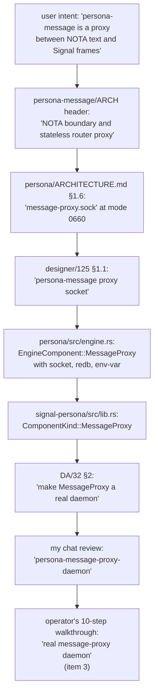
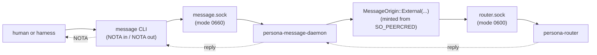
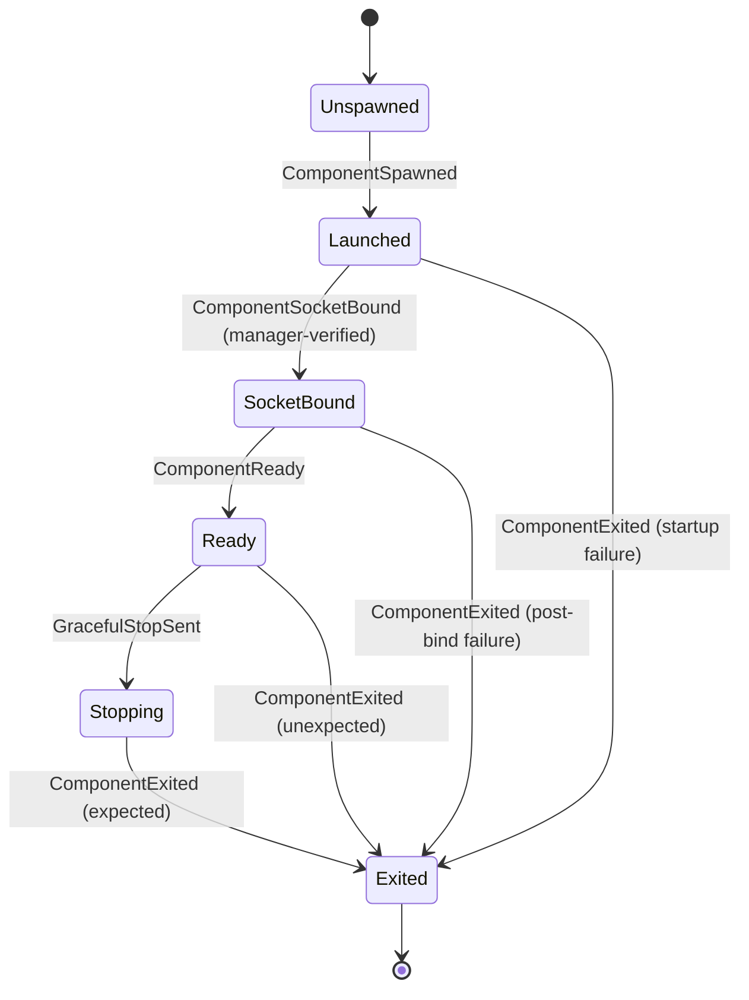

# 142 — Supervision in signal-persona; persona-message IS the daemon (drop "proxy" name); the two reducers named

*Designer report. Corrects three drifts surfaced in the
DA/32 → my-chat-review → operator/113 → operator's-next-step
thread (2026-05-12/13): supervision lifecycle records belong
in `signal-persona`, not in a new repo; the `MessageProxy`
naming retires but the **daemon stays** — `persona-message`
IS the supervised first-stack daemon, just don't call it
"proxy"; the engine-lifecycle reducer is named and designed
alongside the engine-status reducer.*

*Lands the architectural correction in `persona/ARCHITECTURE.md`,
`persona-router/ARCHITECTURE.md`, `persona-message/ARCHITECTURE.md`
& `README.md`, `signal-persona/ARCHITECTURE.md`, and
`protocols/active-repositories.md`. Files an operator bead to
rename `EngineComponent::MessageProxy` → `EngineComponent::Message`,
add the `persona-message-daemon` binary, and add the supervision
relation to `signal-persona`.*

*Revision 2026-05-13: §3 originally proposed dropping the
daemon entirely and folding both sockets onto `persona-router`.
That was a misreading of the user's "no proxy demon" direction
(which meant "no SEPARATE proxy daemon beyond persona-message
itself," not "no daemon"). Corrected here in line with
designer-assistant/33 §0.2 and §1.2. See §9.5 for the trace.*

---

## 0 · TL;DR

Three corrections from the user (2026-05-12 / 2026-05-13):

| Question | Answer |
|---|---|
| Where do the common supervision/readiness records live? | **In `signal-persona` as a new relation.** Not in a new `signal-persona-supervision` repo. `signal-persona` already owns the manager's wire surface (engine catalog, component status, supervisor actions); supervision is one more relation inside that contract. Per `/127 §4.2 D3` (one contract crate = one component's wire surface; multiple relations within is fine). |
| Is there a `persona-message-proxy` daemon? | **No — but `persona-message` IS the daemon.** The user's "no proxy demon" means "no SEPARATE proxy daemon beyond what `persona-message` already is." `persona-message` itself stays a supervised first-stack component; its long-lived binary is `persona-message-daemon`; the `message` binary stays as its CLI client. What retires is the **name** "proxy" (in `MessageProxy` / `message-proxy.sock` / `PERSONA_MESSAGE_PROXY_EXECUTABLE`), not the daemon. Per DA/33's rename matrix. |
| What is the engine-lifecycle reducer? | **A second reducer that consumes the same events as the engine-status reducer but materializes process state** (Unspawned → Launched → SocketBound → Ready → Stopping → Exited). Engine-status answers "is this component healthy?"; engine-lifecycle answers "what's its current process state and how did it get there?". CLI status reads engine-status; audit replay walks engine-lifecycle events. |

Plus a residual cleanup:

| Cleanup | Resolution |
|---|---|
| `message-proxy.sock` named in `persona/ARCHITECTURE.md` §1.6 and `/125 §1.1` | Rename to **`message.sock`** (mode 0660, group = engine owner's group). Bound by `persona-message-daemon`. The `0660` mode is the engine's user-writable ingress boundary. |
| `EngineComponent::MessageProxy` + `ComponentKind::MessageProxy` | Rename to `EngineComponent::Message` + `ComponentKind::Message`. The variant survives; only the name retires. |
| `PERSONA_MESSAGE_PROXY_EXECUTABLE` env var | Rename to `PERSONA_MESSAGE_DAEMON_EXECUTABLE` (operator's choice on suffix; the point is to drop "proxy"). |
| First-stack supervised set | **Six components**: `persona-mind`, `persona-router`, `persona-system`, `persona-harness`, `persona-terminal`, `persona-message`. |

The operator's last response (the 10-step prototype walkthrough)
proposes `signal-persona-supervision` as item 1 — **wrong**;
supervision lives in `signal-persona` per §2. Item 3 (a real
message daemon) is **right in substance**; just don't call it a
"proxy" — the binary is `persona-message-daemon`. Items 2 and
4–10 are sound. Operator's bead update is in §8.

---

## 1 · The misreading trace

The "proxy daemon" idea propagated step by step. Naming the
trail makes it harder to reinvent.



At each step the word "proxy" got more weight, eventually
becoming a supervised process with a redb file. The user's
clarification (2026-05-13):

> *"There's no persona message proxy either. That's a
> misunderstanding of me saying the persona message is a
> proxy between the pure signal and the message landing
> somewhere or coming from somewhere. But I guess
> everything is a proxy, and the agent took it the wrong
> way. There's no proxy demon."*

The corrective is to retire `MessageProxy` from the
supervised set and rename the user-writable socket to
something router-owned.

---

## 2 · Decision 1 — Supervision relation in `signal-persona`

### 2.1 The relation

Every supervised first-stack component answers the same
manager-level lifecycle questions, regardless of its domain.
That common surface lives **in `signal-persona`** as a new
relation alongside the engine-catalog and supervisor-action
relations already there. **Not** in a new
`signal-persona-supervision` repo.

**The supervision relation has its own closed root family**
(`SupervisionRequest` / `SupervisionReply`), separate from
the manager/CLI relation's `EngineRequest` / `EngineReply`.
Per `skills/contract-repo.md` §"Contracts name a component's
wire surface": *"a multi-relation contract crate (one
component, multiple relations) has one root family per
relation, not one crate-wide enum."* The relations share a
crate; they do not share a root enum or a single
`signal_channel!` invocation. (Correction from DA/34 §1: an
earlier draft of this report said the two relations "share
one `signal_channel!` declaration" — that was wrong; root
families must stay separate so CLI-oriented surface cannot
accidentally grow child-lifecycle verbs and vice versa.)

Why this is the right home:

- `signal-persona` is the manager's wire surface; every
  supervised component already needs to depend on it for
  engine-context records. Adding supervision variants here
  means no new dependency edge across the dependency graph.
- Per `/127 §4.2 D3` and `skills/contract-repo.md` §"Contracts
  name a component's wire surface," a contract crate is one
  component's typed-vocabulary bucket with multiple relations
  inside it. The supervision relation is just another relation
  in `signal-persona`'s bucket — engine-manager ↔ supervised
  component.
- Workspace skill `skills/contract-repo.md` §"Kernel extraction
  trigger" says: extract a kernel only when 2+ domains share
  it. Here only one domain shares this vocabulary (the engine
  manager); extraction would be premature.
- Operator-side cost is one closed enum + one closed enum +
  per-component round-trip witness inside `signal-persona`'s
  existing test surface — no new repo, no new flake, no new
  Cargo.toml.

### 2.2 The records

Add the following to `signal-persona/src/lib.rs`, under the
existing `signal_channel!` declaration:

```text
SupervisionRequest (closed enum)
  | ComponentHello                              -- "are you the expected component?"
  | ComponentReadinessQuery                     -- "are you ready to serve domain traffic?"
  | ComponentHealthQuery                        -- "what's your current health?"
  | GracefulStopRequest                         -- "drain and stop"

SupervisionReply (closed enum)
  | ComponentIdentity { name: ComponentName,
                        kind: ComponentKind,
                        supervision_protocol_version: SupervisionProtocolVersion,
                        last_fatal_startup_error: Option<ComponentStartupError> }
  | ComponentReady   { component_started_at: Option<TimestampNanos> }  -- child-supplied diagnostic; not minted by component as authoritative event time
  | ComponentNotReady { reason: ComponentNotReadyReason }
  | ComponentHealth  { health: ComponentHealth }
  | GracefulStopAck  { drain_completed_at: Option<TimestampNanos> }

SupervisionProtocolVersion (newtype u16)
ComponentStartupError      (closed enum: SocketBindFailed, StoreOpenFailed, EnvelopeIncomplete, … )
ComponentNotReadyReason    (closed enum: NotYetBound, AwaitingDependency, RecoveringFromCrash, … )
```

`ComponentHealth` already exists in `signal-persona` as
`Starting | Running | Degraded | Stopped | Failed`. Reuse.

**Timestamp authority** (per DA/34 §4 / ESSENCE §"Infrastructure
mints identity, time, and sender"): a child component does not
mint authoritative event time. `ComponentReady`'s
`component_started_at` is diagnostic (the child's own
process-start clock); the **manager** mints `observed_at`
when the readiness round trip succeeds and writes that as
the lifecycle event's authoritative timestamp. The same rule
applies to `GracefulStopAck`'s `drain_completed_at` — child's
clock for diagnostics; manager's clock on the manager event.

The relation crosses the daemon ↔ child boundary, in BOTH
directions: manager initiates queries; component replies.
Frame envelope, handshake, and the universal verb spine come
from `signal-core` per the existing pattern. Each relation
gets its own `signal_channel!` invocation; the two relations
do not share a root family.

### 2.3 Why this stays narrow

The risk DA/32 §1 flagged is real: this relation must not
absorb domain ops. The constraints:

- Supervision requests are **manager-to-component**, not
  component-to-component. Components don't ask each other
  about readiness via this relation.
- Supervision requests carry **no domain content** — no
  message bodies, no role claims, no terminal injections.
- A `Component*Unimplemented` reply on a domain contract
  (e.g., `signal-persona-harness::HarnessRequestUnimplemented`)
  is a separate witness from this relation. The Nix witness
  sends a domain probe; this relation handles manager
  lifecycle.

The acceptance test for "the relation stayed narrow": if
operator finds themselves adding a request variant that
mentions `MessageBody`, `RoleClaim`, `TerminalInput`, or
similar domain content, they're crossing the boundary and
should move that variant to the relevant `signal-persona-*`
domain contract instead.

---

## 3 · Decision 2 — `persona-message` IS the daemon; drop the "proxy" name only

### 3.1 The rename

`EngineComponent::MessageProxy` (in `persona/src/engine.rs`)
becomes `EngineComponent::Message`. `ComponentKind::MessageProxy`
(in `signal-persona/src/lib.rs`) becomes `ComponentKind::Message`.
The **variant survives**; only the name retires. The supervised
first-stack set is:

```text
mind     persona-mind         signal-persona-mind
router   persona-router       signal-persona-message + others (consumer)
system   persona-system       signal-persona-system
harness  persona-harness      signal-persona-harness
terminal persona-terminal     signal-persona-terminal
message  persona-message      signal-persona-message (producer-side daemon)
```

**Six components.** The `persona-message` repo owns:
- the existing `message` CLI binary (one NOTA in, one NOTA out;
  client of the message daemon's socket)
- a new `persona-message-daemon` binary (long-lived; binds
  `message.sock`; forwards typed frames to `persona-router`)

### 3.2 The socket rename and ownership

Today the user-writable socket is `message-proxy.sock` at mode
`0660`. The new shape:

| Before | After |
|---|---|
| `/var/run/persona/<engine-id>/router.sock` (mode 0600, bound by `persona-router`) | unchanged |
| `/var/run/persona/<engine-id>/message-proxy.sock` (mode 0660) | **`/var/run/persona/<engine-id>/message.sock`** (mode 0660, group = engine owner's group, bound by `persona-message-daemon`) |

`persona-router` binds **one socket** at `router.sock` (0600
internal traffic only). `persona-message-daemon` binds
**`message.sock`** at mode 0660 — the engine's user-writable
ingress boundary.

Both are spawn-envelope-driven (persona-daemon provides the
paths and modes; each component binds and applies the mode;
manager verifies after `ComponentReady`).

### 3.3 What `persona-message-daemon` does

The message daemon is small and stateless. Its job is the
user-writable boundary:



The daemon's responsibilities:

- bind `message.sock` at mode 0660 with engine-owner group;
- accept Signal frames from the `message` CLI (or any future
  user-side client speaking `signal-persona-message`);
- mint `MessageOrigin::External(ConnectionClass)` from
  SO_PEERCRED on the connecting peer;
- forward typed `signal-persona-message` frames to
  `persona-router` over `router.sock` with the origin tag;
- read the router's reply frame;
- forward the reply back to the CLI client.

No durable state. No actor topology beyond the small Kameo
tree that owns the two socket connections (`UserSocketListener`
that accepts CLI connections; `RouterClient` that maintains the
internal-side connection to router). No `message.redb`.

### 3.4 Why a daemon and not router-owns-both-sockets

Earlier draft of this report (now corrected) proposed
collapsing both sockets onto `persona-router`. That
mis-implemented the architectural separation the user has
been holding throughout:

- The **user-writable boundary** is a distinct concern from
  routing. Keeping it on its own supervised process lets the
  message daemon evolve independently (rate-limiting, ingress
  validation, eventual signature-verification when criome
  integration lands) without growing router's surface.
- The kernel ACL is the same trust boundary either way, but
  the **process boundary** doubles as a blast-radius boundary:
  a daemon crash takes down ingress without taking down
  routing; an exploitation of the ingress code path is bounded
  by the daemon's privileges.
- The user has named "persona-message is a proxy *between* pure
  signal and the message landing somewhere" — i.e., it has a
  distinct job at a distinct boundary, even if currently a tiny
  one. Naming that job as its own supervised component matches
  the workspace's micro-component discipline.

### 3.5 What changes in `persona-message`'s repo

`persona-message/ARCHITECTURE.md` previously said:

> *"The proxy does not build or run a daemon."*

That's wrong now. The repo gains a daemon binary. Specifically:

- New binary `persona-message-daemon` (long-lived; supervised
  by `persona-daemon`).
- Existing `message` CLI binary unchanged in role (NOTA-to-frame
  translation at the CLI surface), but its target socket changes
  from "router socket" to "message daemon socket" — i.e., from
  router-directly to going through the supervised message daemon.
- The repo's ARCH and README drop "proxy" framing in favor of
  "message ingress boundary" or "user-writable ingress component."
- Kameo runtime (a small one) lands per `skills/actor-systems.md`
  and `skills/kameo.md`; the daemon is two or three actors
  (root + listener + router-client).

The repo's no-in-band-proof discipline is preserved; the
daemon mints origin from SO_PEERCRED, never from request
payload fields.

---

## 4 · Decision 3 — The two reducers, named and designed

DA/32 §4 named the split-brain risk: `EngineManager` owns
desired state and health/status replies; `EngineSupervisor`
owns process launch/stop observations; both consume the same
event log. They can drift.

My prior chat review said: name the second reducer too. The
user agreed. Here's the design.

### 4.1 The state machines

Both reducers consume the same append-only event log
(`manager.engine-events` in `manager.redb`). Each materializes
a different state.

**Engine-lifecycle reducer** — per `(EngineId, ComponentName)`,
closed enum of process states:

```text
ComponentProcessState (closed enum)
  | Unspawned
  | Launched     { pid: ProcessId, started_at: TimestampNanos }
  | SocketBound  { pid, socket_path: WirePath, mode: SocketMode, bound_at: TimestampNanos }
  | Ready        { pid, since: TimestampNanos, last_health_probe: Option<TimestampNanos> }
  | Stopping     { pid, expected: bool, stop_requested_at: TimestampNanos }
  | Exited       { exit_code: ExitCode, expected: bool, exited_at: TimestampNanos }
```

The transitions:



**Engine-status reducer** — per `(EngineId, ComponentName)`,
closed enum of health states:

```text
ComponentHealthState (closed enum — same vocabulary as today's signal-persona::ComponentHealth)
  | Starting    -- process spawned but not Ready
  | Running     -- Ready and last health probe succeeded
  | Degraded    -- health probe failed but process still alive
  | Stopped     -- Exited expected
  | Failed      -- Exited unexpected
```

Derived from engine-lifecycle state + health-probe history.

### 4.2 The event → reducer table

The single event log feeds both reducers. Each event updates
one or both:

| Event | Engine-lifecycle reducer | Engine-status reducer |
|---|---|---|
| `ComponentSpawned { pid }` | Unspawned → Launched | NotApplicable → Starting |
| `ComponentSocketBound { socket_path, mode }` | Launched → SocketBound | Starting (unchanged) |
| `ComponentReady { since }` | SocketBound → Ready | Starting → Running |
| `ComponentHealthDegraded { since }` | (no transition) | Running → Degraded |
| `ComponentHealthRecovered` | (no transition) | Degraded → Running |
| `GracefulStopSent { expected: true }` | Ready → Stopping | Running → Stopped |
| `ComponentExited { code, expected: true }` | * → Exited(expected) | * → Stopped |
| `ComponentExited { code, expected: false }` | * → Exited(unexpected) | * → Failed |

The two reducers compute independently from the same event
stream. There is no shared mutable state between them other
than the event log.

### 4.3 Tables in `manager.redb`

```text
manager.engine-events                                    append-only event log (sole source of truth)
manager.engine-lifecycle-snapshot                        engine-lifecycle reducer's current state
manager.engine-status-snapshot                           engine-status reducer's current state
manager.engine-records                                   engine catalog (desired state)
manager.meta                                             schema version
```

Both snapshot tables are derived from the event log. On
daemon startup:

1. Load `engine-records` (catalog of engines and desired
   state).
2. Replay `engine-events` past the latest checkpoint to
   rebuild both reducer snapshots in memory. (Until event
   replay lands, snapshots can be reloaded directly from the
   snapshot tables, with the event log used as the
   eventually-replayable truth.)
3. Open both snapshots into Kameo actors that own them.
4. Reply to CLI status queries from the engine-status
   reducer.

### 4.4 Which reducer answers which question

| Question | Reducer | Table read |
|---|---|---|
| `EngineStatusQuery` (CLI) — "what's the engine's overall health?" | engine-status | `engine-status-snapshot` |
| `ComponentStatusQuery` (CLI) — "what's component X's health?" | engine-status | `engine-status-snapshot` |
| `SupervisionReply::ComponentHealth` (child → manager input to the status reducer) | engine-status | feeds the reducer; does **not** read CLI status |
| `EngineReply::ComponentStatus` (manager → CLI output from the status reducer) | engine-status | reads `engine-status-snapshot` |
| "Did component X come up cleanly?" (audit / debug) | engine-lifecycle | walk events for X |
| "Was component X's last exit expected?" | engine-lifecycle | latest event for X |
| "How long has X been Ready?" | engine-lifecycle | `engine-lifecycle-snapshot.since` |
| "Why did X transition to Failed?" | event-log + engine-lifecycle | events leading to Exited(unexpected) |

The CLI never reads the event log directly. CLI status is a
read of the engine-status snapshot via `EngineReply` on the
manager/CLI relation. The supervision relation only feeds
the reducers; it does not return CLI-shaped replies. (Per
DA/34 §5: the two relations stay sharply separate — child-
to-manager facts flow into reducers; manager-to-CLI
projections flow out of reducers.)

Audit / debug paths walk the event log or read the
engine-lifecycle snapshot.

### 4.5 Why both, not one with two projections

A single reducer with two projections is defensible (same
event stream, two views). The case for two distinct reducers:

- Different storage shapes — engine-lifecycle carries
  process-level facts (pid, socket_path) that engine-status
  doesn't need. Engine-status carries last-probe-time that
  engine-lifecycle treats as opaque.
- Different update cadences — engine-status changes on
  health-probe events; engine-lifecycle changes on
  process-state events. Decoupling lets each evolve
  independently.
- Different consumers — CLI hits engine-status often;
  engine-lifecycle is read by audit tools and the supervisor
  itself.

Storage cost is small (two redb tables, both lightweight);
clarity gain is real. Operator can collapse them later if
they prove redundant in practice; the two-reducer shape is
the safer first cut.

---

## 5 · Architecture changes required

This report distinguishes two layers per DA/34 §2:

- **Design decisions** that land immediately, in the canonical
  architecture docs (this section's edits — landed in the same
  commit as the report).
- **Implementation drift** in `*.rs` source and tests that
  takes operator's bead to clear. Listed under §8.

The design-doc edits (this section) land immediately. The
source/test edits (§8) land per the operator bead. The bead
closes only when no `MessageProxy` survives in any source
file.

### 5.1 `signal-persona/src/lib.rs` (operator bead — implementation)

- **Rename** `ComponentKind::MessageProxy` → `ComponentKind::Message`.
- **Add** the supervision relation as its own closed root family:
  `SupervisionRequest`, `SupervisionReply`,
  `SupervisionProtocolVersion`, `ComponentStartupError`,
  `ComponentNotReadyReason` (per §2.2). The supervision
  relation gets its own `signal_channel!` invocation, separate
  from the existing `EngineRequest` / `EngineReply`.

This is a coordinated wire-version bump per
`skills/contract-repo.md` §"Versioning is the wire".

### 5.2 `signal-persona/ARCHITECTURE.md` (designer — landed)

- **Rename** `MessageProxy` → `Message` in the `ComponentKind`
  closed enum listing (§"Typed Records").
- **Update** the witness "Message proxy is named as a closed
  component kind" → "Supervision requests carry no domain
  payloads" with a witness pointer.
- **Add** the supervision-relation surface to §"Current
  Surface" and §"Typed Records" — declared as its own root
  family.
- State explicitly that the two relations (manager/CLI
  catalog vs manager/child supervision) **each have their own
  closed root family**; they do not share one
  `signal_channel!` declaration.

### 5.3 `persona/ARCHITECTURE.md` (designer — landed)

- **§1.6 socket-layout table**: keep `message.sock` in the
  list (bound by `persona-message-daemon` at mode 0660,
  group = engine owner's group). `router.sock` (mode 0600) is
  bound by `persona-router`. Drop the misleading
  `router-public.sock` placeholder from my earlier draft.
- **§1 component map**: first-stack supervised set is **six
  components** including `persona-message`.
- **§7 constraints**: rewrite "the message-proxy socket is
  group-writable for owner ingress" to "the `message.sock`
  is group-writable for owner ingress (bound by
  `persona-message-daemon`)."

### 5.4 `persona-router/ARCHITECTURE.md` (designer — landed)

- **§1 / §2**: router binds **one socket** (`router.sock`,
  mode 0600). Drop the "two sockets" framing from my
  earlier draft.
- Ingress on `router.sock` tags as
  `MessageOrigin::Internal(...)` for in-engine components,
  or `MessageOrigin::External(...)` when the connecting
  peer is `persona-message-daemon` forwarding owner ingress
  with the External tag already minted.

### 5.5 `persona-message/ARCHITECTURE.md` and `README.md` (designer — landed)

- **Header**: this is the message ingress/text-boundary
  component. Owns: the `message` CLI binary, the
  `persona-message-daemon` binary (long-lived, supervised
  first-stack member), and a small Kameo runtime inside the
  daemon.
- **§2 State and Ownership**: the daemon binds
  `message.sock` (mode 0660). It owns no durable state
  (no redb). Origin tags are minted from SO_PEERCRED, not
  from request payloads.
- **§4 Invariants**: drop the "proxy does not build or run
  a daemon" line — that's wrong now. Keep "no in-band proof
  material," "no durable message ledger," "no actor
  registration writes," "origin via SO_PEERCRED."
- **Code Map**: add `src/bin/persona-message-daemon.rs` (or
  equivalent) alongside the `message` CLI.

### 5.6 `protocols/active-repositories.md` (designer — landed)

- **`persona-message` row**: change description to: "The
  `message` CLI and `persona-message-daemon`: NOTA-to-router
  message ingress. Daemon owns `message.sock` (mode 0660,
  engine-owner-writable), forwards typed Signal frames to
  `persona-router` with origin tags minted from
  SO_PEERCRED."
- **`persona-router` row**: revert to a single-socket
  description (`router.sock` at mode 0600, internal traffic;
  external traffic flows through `persona-message-daemon`).

### 5.7 `reports/designer/125-channel-choreography-and-trust-model.md`

- **§1.1 socket table**: row labeled "Per-engine message
  proxy" → "Per-engine message ingress" with the new socket
  name `message.sock` bound by `persona-message-daemon`. The
  mode (0660, group = engine owner's group) and owner
  (persona) stay.
- Other instances of "persona-message proxy" or
  `Internal(MessageProxy)` in /125 prose: rename to
  `persona-message-daemon` / `Internal(Message)`.

### 5.8 Tests across the stack (operator bead — implementation)

Per DA/34 §7:

- `persona-daemon-spawns-first-stack-skeletons` and related
  Nix witnesses: assert **six** first-stack processes,
  including `persona-message-daemon`.
- Peer socket count witnesses: include `message.sock` in the
  expected peer set.
- `persona-message` tests: cover the daemon's accept loop
  and origin-tag minting in addition to the CLI's
  NOTA-to-frame translation.

---

## 6 · Acknowledging operator-assistant/108 on signal-criome

Brief note since the user surfaced
`reports/operator-assistant/108-signal-criome-foundation-self-review.md`
in the same exchange:

`signal-criome` landed cleanly as a contract foundation
(commit `cc6dfa4e` at `github:LiGoldragon/signal-criome`).
The operator-assistant's self-review correctly identifies the
work as "vocabulary only" and proposes a sharper first cut:
keep the smallest record set, add a real `blst` round-trip
test, defer the broader attestation families until daemon
handlers need them, defer `SignedPersonaRequest` until a
Persona consumer is concrete.

**Designer agreement**: the OA's "redo smaller" instinct is
right and aligns with `skills/contract-repo.md` §"Examples-first
round-trip discipline" (every record kind earns its place via
a witness; broader vocabulary without consumer pressure is
premature). The next high-signal work is the `criome` daemon
skeleton (Track 1 of /141 §8), which exerts the consumer
pressure that confirms or rejects each contract record. No
designer follow-up needed beyond /141; OA continues against
the bead `primary-5rq`.

The `protocols/active-repositories.md` touch from OA's lane
is acceptable as a mechanical drift fix (per
`skills/autonomous-agent.md` §"A doc references a
removed/renamed thing"). The bookmark
`push-signal-criome-active-map` can land on main when the
next designer pass reaches the file (i.e., this very report's
edits — see §5.6).

---

## 7 · Constraints (test seeds)

Per `skills/architectural-truth-tests.md`, every load-bearing
constraint becomes a witness. The new constraints from this
report:

| Constraint | Test name |
|---|---|
| `signal-persona` carries the supervision relation; no separate `signal-persona-supervision` repo exists | `cargo metadata` test in the persona meta repo: no dep on `signal-persona-supervision`; static scan |
| Supervision requests carry no domain payloads | `signal-persona/tests/supervision_no_domain_payload.rs` (compile-fail and round-trip) |
| `ComponentKind` enum does not contain `MessageProxy` | source scan in `signal-persona/src/lib.rs` |
| `EngineComponent` enum does not contain `MessageProxy` | source scan in `persona/src/engine.rs` |
| The first-stack supervised set has exactly five components | `persona-daemon-spawns-first-stack-skeletons` lists 5 |
| `persona-router` binds two sockets | `router-binds-internal-and-public-sockets` |
| `router-public.sock` is mode 0660 | filesystem witness after engine start |
| `router.sock` is mode 0600 | filesystem witness |
| Frames on `router-public.sock` tag as `MessageOrigin::External` | router-trace witness |
| Frames on `router.sock` tag as `MessageOrigin::Internal` | router-trace witness |
| `persona-message` repo has no daemon binary | source-scan witness; `bin = ["message"]` only |
| Engine-lifecycle reducer transitions match the state machine in §4.1 | per-transition reducer test |
| Engine-status reducer matches §4.2's event-to-state mapping | per-event reducer test |
| CLI status reads engine-status, never the event log directly | actor-trace witness |
| Manager startup loads the latest `StoredEngineRecord` per engine | restart witness — start daemon, persist, restart, assert state |

---

## 8 · Operator bead

Replaces the message-proxy work item that DA/32 §2 and my
prior chat review implicitly created. Operator's 10-step
walkthrough is mostly correct; items 1 and 3 retire per this
report. Filing a new bead under `role:operator`.

**Title**: "persona+signal-persona+persona-router: retire
MessageProxy phantom; add supervision relation to
signal-persona; design two reducers (per designer/142)"

**Description summary**:

1. `signal-persona`: add supervision relation per /142 §2.2.
   Remove `ComponentKind::MessageProxy`. Coordinated wire
   bump.
2. `persona/src/engine.rs`: remove `EngineComponent::MessageProxy`
   variant + its socket/redb/env-var/socket-mode entries.
3. `persona/src/transport.rs`, `supervisor.rs`,
   `tests/supervisor.rs`, `tests/daemon.rs`: reduce first-stack
   from 6 to 5 components.
4. `persona-router`: bind two sockets (`router.sock` 0600 +
   `router-public.sock` 0660); tag ingress by socket origin.
5. Implement engine-lifecycle reducer (new) + wire
   engine-status reducer (existing CLI surface) per /142 §4.
6. Add manager restore: load latest `StoredEngineRecord` on
   daemon startup.
7. Add exit observation in `DirectProcessLauncher` —
   `ComponentExited { expected, code }`. No restart policy
   yet.
8. Add socket-metadata verification before `ComponentReady`
   per DA/32 §3 / operator/113 §3.
9. Run the new architectural-truth tests in §7.

Plus the architecture-doc edits in §5 (designer's lane; this
report lands those alongside).

---

## 9 · What this report supersedes / corrects

### 9.1 Retracted

- **DA/32 §2** — "Keep MessageProxy as a supervised engine
  component and make it a real long-lived boundary daemon
  named `persona-message-proxy-daemon`." Only the **name**
  was wrong; the daemon stays. Corrected per §3.
- **My prior DA/32 chat review (2026-05-13)** —
  recommended `persona-message-proxy-daemon` naming.
  Corrected: the binary is `persona-message-daemon`.
- **Operator's 10-step walkthrough (chat, 2026-05-13)**
  item 1 (`signal-persona-supervision` as a NEW contract):
  **rejected**; supervision lives in `signal-persona`.
  Item 3 (real message-proxy daemon): **right in
  substance**, just rename — `persona-message-daemon`.

### 9.2 Sound items preserved from DA/32

- DA/32 §1 (common supervision-relation surface + domain
  Unimplemented stays domain) — confirmed; lives in
  `signal-persona`.
- DA/32 §3 (socket mode: child applies, manager verifies) —
  confirmed.
- DA/32 §4 (split-brain manager state) — addressed via §4's
  two-reducer design.
- DA/32 §5 (restart waits; exit observation goes now) —
  confirmed.

### 9.3 DA/33 — superseding their own self-supersession

DA/33 §0.2 / §1.2 / §5.4 / §6 said: keep `persona-message` in
the supervised first stack; drop "proxy" from the name; the
daemon binary is `persona-message-daemon`. **That was right.**
DA/34 §0 later superseded DA/33 in favor of /142's
(then-wrong) 5-component shape. With this correction, DA/33's
direction is restored; DA/34's verdict that DA/33 was
"superseded" is itself superseded. Operator follows /142 (this
version) and DA/33's rename matrix.

### 9.4 DA/34 — kept refinements / rejected verdict

**Kept**: DA/34 §1 (separate root families per relation —
folded into §2.1); DA/34 §2 (design-vs-implementation
distinction — folded into §5's structure); DA/34 §4
(manager-minted authoritative timestamps; child-supplied
diagnostic time — folded into §2.2); DA/34 §5
(`SupervisionReply::ComponentHealth` is child-to-manager,
not manager-to-CLI — fixed in §4.4); DA/34 §6 (stale proxy
wording remains in canonical files — captured in §5.7 and the
operator bead); DA/34 §7 (tests need updating to match the
new component count and socket layout — captured in §5.8).

**Rejected**: DA/34 §0 verdict that /142's old 5-component
shape was correct, and DA/34's claim that this supersedes
DA/33. The user's clarification 2026-05-13
(*"PersonaMessage is the daemon. There's no other
PersonaMessage daemon"*) makes the 6-component shape
authoritative. DA/34's verdict is reversed in §3.

### 9.5 The misread trace

For future agents reviewing this thread:

- User direction 2026-05-12: *"There's no persona message
  proxy either. ... There's no proxy demon."*
- /142 v1 reading: "no daemon at all; collapse the daemon
  into router."
- DA/33 reading: "the variant survives as `Message`;
  `persona-message-daemon` is the supervised binary."
- DA/34 reading: "agree with /142 v1; supersede DA/33."
- User clarification 2026-05-13: *"PersonaMessage is the
  daemon. There's no other PersonaMessage daemon, right?
  ... are you saying the design assistant didn't
  understand that?"*

The user's word "proxy demon" meant **a separate proxy
daemon** beyond `persona-message` itself, not "no daemon."
DA/33 understood; /142 v1 and DA/34 did not. This revision
of /142 aligns with the user's clarification.

---

## See also

- `~/primary/reports/operator/113-persona-engine-supervision-slice-and-gaps.md`
  — operator's slice that surfaced the readiness/proxy/restore
  questions; this report answers them.
- `~/primary/reports/designer-assistant/32-review-operator-113-engine-supervision.md`
  — DA's review whose §2 this report overrides on
  message-proxy framing.
- `~/primary/reports/operator-assistant/108-signal-criome-foundation-self-review.md`
  — adjacent operator-assistant self-review on
  `signal-criome` contract foundation. Acknowledged in §6;
  no designer follow-up needed.
- `~/primary/reports/designer/125-channel-choreography-and-trust-model.md`
  — filesystem-ACL trust model; §1.1 socket name edited per
  §5.7.
- `~/primary/reports/designer/127-decisions-resolved-2026-05-11.md`
  §4.2 D3 — contract crates as multi-relation typed
  vocabularies; cited in §2.1.
- `~/primary/skills/contract-repo.md` §"Contracts name a
  component's wire surface" + §"Kernel extraction trigger"
  — the rules placing supervision in `signal-persona`.
- `~/primary/skills/architectural-truth-tests.md` —
  witnesses for §7.
- `~/primary/reports/designer/115-persona-engine-manager-architecture.md`
  — engine-manager framing this report extends.
- `~/primary/reports/designer/141-minimal-criome-bls-auth-substrate.md`
  — adjacent contract design; same drift-correction shape
  (Criome verifies; Persona decides; out-of-band records).
- `/git/github.com/LiGoldragon/signal-persona/src/lib.rs` —
  where the supervision relation lands.
- `/git/github.com/LiGoldragon/persona/src/engine.rs` —
  where `EngineComponent::MessageProxy` retires.
- `/git/github.com/LiGoldragon/persona-router/ARCHITECTURE.md`
  — gains the two-socket detail.
- `/git/github.com/LiGoldragon/persona-message/ARCHITECTURE.md`
  — wording cleanup to drop "proxy daemon" framing.
