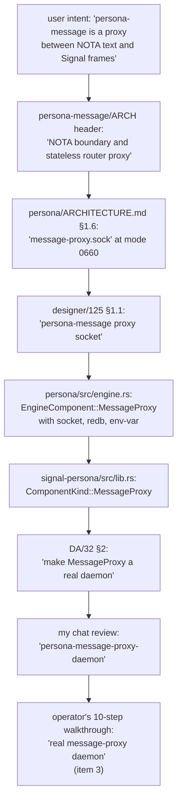
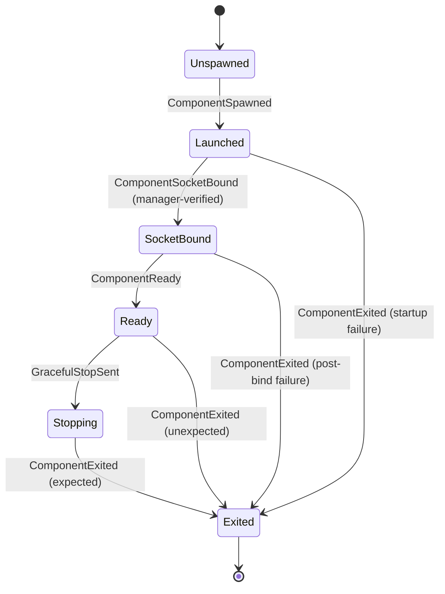

# 142 — Supervision in signal-persona; no message-proxy daemon; the two reducers named

*Designer report. Corrects three drifts surfaced in the
DA/32 → my-chat-review → operator/113 → operator's-next-step
thread (2026-05-12/13): supervision lifecycle records belong
in `signal-persona`, not in a new repo; there is no
`persona-message-proxy` daemon and never was one in the
user's intent; the engine-lifecycle reducer is named and
designed alongside the engine-status reducer.*

*Lands the architectural correction in `persona/ARCHITECTURE.md`,
`persona-router/ARCHITECTURE.md`, `persona-message/ARCHITECTURE.md`
& `README.md`, `signal-persona/ARCHITECTURE.md`, and
`protocols/active-repositories.md`. Files an operator bead to
retire `EngineComponent::MessageProxy` and add the supervision
relation to `signal-persona`.*

---

## 0 · TL;DR

Three corrections from the user (2026-05-12 / 2026-05-13):

| Question | Answer |
|---|---|
| Where do the common supervision/readiness records live? | **In `signal-persona` as a new relation.** Not in a new `signal-persona-supervision` repo. `signal-persona` already owns the manager's wire surface (engine catalog, component status, supervisor actions); supervision is one more relation inside that contract. Per `/127 §4.2 D3` (one contract crate = one component's wire surface; multiple relations within is fine). |
| Is there a `persona-message-proxy` daemon? | **No.** The word "proxy" in `persona-message`'s description means *"boundary translator at the CLI surface,"* not *"proxy daemon process."* Agents (DA/32, my prior chat review, the framing in operator/113 and operator's last reply) reified the word into a phantom daemon. There is no daemon to supervise; `EngineComponent::MessageProxy` retires. |
| What is the engine-lifecycle reducer? | **A second reducer that consumes the same events as the engine-status reducer but materializes process state** (Unspawned → Launched → SocketBound → Ready → Stopping → Exited). Engine-status answers "is this component healthy?"; engine-lifecycle answers "what's its current process state and how did it get there?". CLI status reads engine-status; audit replay walks engine-lifecycle events. |

Plus a residual cleanup:

| Cleanup | Resolution |
|---|---|
| `message-proxy.sock` named in `persona/ARCHITECTURE.md` §1.6 and `/125 §1.1` | Rename to **`router-public.sock`** (or merge into `router.sock` with mode 0660 — operator's call). Router owns this socket directly; the `0660` mode is the engine's user-writable ingress boundary. No separate component binds it. |
| First-stack supervised set | **Five components**: `persona-mind`, `persona-router`, `persona-system`, `persona-harness`, `persona-terminal`. **Not** six. |

The operator's last response (the 10-step prototype walkthrough)
proposes `signal-persona-supervision` and a real
message-proxy daemon as items 1 and 3. **Both are wrong** per
this report; the other eight items are sound. Operator's bead
update is in §8.

---

## 1 · The misreading trace

The "proxy daemon" idea propagated step by step. Naming the
trail makes it harder to reinvent.



At each step the word "proxy" got more weight, eventually
becoming a supervised process with a redb file. The user's
clarification (2026-05-13):

> *"There's no persona message proxy either. That's a
> misunderstanding of me saying the persona message is a
> proxy between the pure signal and the message landing
> somewhere or coming from somewhere. But I guess
> everything is a proxy, and the agent took it the wrong
> way. There's no proxy demon."*

The corrective is to retire `MessageProxy` from the
supervised set and rename the user-writable socket to
something router-owned.

---

## 2 · Decision 1 — Supervision relation in `signal-persona`

### 2.1 The relation

Every supervised first-stack component answers the same
manager-level lifecycle questions, regardless of its domain.
That common surface lives **in `signal-persona`** as a new
relation alongside the engine-catalog and supervisor-action
relations already there. **Not** in a new
`signal-persona-supervision` repo.

Why this is the right home:

- `signal-persona` is the manager's wire surface; every
  supervised component already needs to depend on it for
  engine-context records. Adding supervision variants here
  means no new dependency edge across the dependency graph.
- Per `/127 §4.2 D3` and `skills/contract-repo.md` §"Contracts
  name a component's wire surface," a contract crate is one
  component's typed-vocabulary bucket with multiple relations
  inside it. The supervision relation is just another relation
  in `signal-persona`'s bucket — engine-manager ↔ supervised
  component.
- Workspace skill `skills/contract-repo.md` §"Kernel extraction
  trigger" says: extract a kernel only when 2+ domains share
  it. Here only one domain shares this vocabulary (the engine
  manager); extraction would be premature.
- Operator-side cost is one closed enum + one closed enum +
  per-component round-trip witness inside `signal-persona`'s
  existing test surface — no new repo, no new flake, no new
  Cargo.toml.

### 2.2 The records

Add the following to `signal-persona/src/lib.rs`, under the
existing `signal_channel!` declaration:

```text
SupervisionRequest (closed enum)
  | ComponentHello                              -- "are you the expected component?"
  | ComponentReadinessQuery                     -- "are you ready to serve domain traffic?"
  | ComponentHealthQuery                        -- "what's your current health?"
  | GracefulStopRequest                         -- "drain and stop"

SupervisionReply (closed enum)
  | ComponentIdentity { name: ComponentName,
                        kind: ComponentKind,
                        supervision_protocol_version: SupervisionProtocolVersion,
                        last_fatal_startup_error: Option<ComponentStartupError> }
  | ComponentReady   { since: TimestampNanos }
  | ComponentNotReady { reason: ComponentNotReadyReason }
  | ComponentHealth  { health: ComponentHealth }
  | GracefulStopAck  { drain_completed_at: Option<TimestampNanos> }

SupervisionProtocolVersion (newtype u16)
ComponentStartupError      (closed enum: SocketBindFailed, StoreOpenFailed, EnvelopeIncomplete, … )
ComponentNotReadyReason    (closed enum: NotYetBound, AwaitingDependency, RecoveringFromCrash, … )
```

`ComponentHealth` already exists in `signal-persona` as
`Starting | Running | Degraded | Stopped | Failed`. Reuse.

The relation crosses the daemon ↔ child boundary, in BOTH
directions: manager initiates queries; component replies.
Frame envelope, handshake, and the universal verb spine come
from `signal-core` per the existing pattern.

### 2.3 Why this stays narrow

The risk DA/32 §1 flagged is real: this relation must not
absorb domain ops. The constraints:

- Supervision requests are **manager-to-component**, not
  component-to-component. Components don't ask each other
  about readiness via this relation.
- Supervision requests carry **no domain content** — no
  message bodies, no role claims, no terminal injections.
- A `Component*Unimplemented` reply on a domain contract
  (e.g., `signal-persona-harness::HarnessRequestUnimplemented`)
  is a separate witness from this relation. The Nix witness
  sends a domain probe; this relation handles manager
  lifecycle.

The acceptance test for "the relation stayed narrow": if
operator finds themselves adding a request variant that
mentions `MessageBody`, `RoleClaim`, `TerminalInput`, or
similar domain content, they're crossing the boundary and
should move that variant to the relevant `signal-persona-*`
domain contract instead.

---

## 3 · Decision 2 — No `MessageProxy` daemon

### 3.1 The retraction

`EngineComponent::MessageProxy` (in `persona/src/engine.rs`)
and `ComponentKind::MessageProxy` (in `signal-persona/src/lib.rs`)
are retired. The first-stack supervised set is:

```text
mind     persona-mind         signal-persona-mind
router   persona-router       signal-persona-message + others
system   persona-system       signal-persona-system
harness  persona-harness      signal-persona-harness
terminal persona-terminal     signal-persona-terminal
```

Five components. The `persona-message` repo stays — it's the
CLI, not a supervised process. The `message` binary projects
NOTA into `signal-persona-message` frames and sends them to
`persona-router`'s public ingress socket. There is no
intermediate daemon.

### 3.2 The socket rename

Today the user-writable socket is `message-proxy.sock` at
mode `0660`. The new shape:

| Before | After |
|---|---|
| `/var/run/persona/<engine-id>/router.sock` (mode 0600) | unchanged — `persona-router`'s internal socket for component-to-component traffic (mind, system → router) |
| `/var/run/persona/<engine-id>/message-proxy.sock` (mode 0660) | **`/var/run/persona/<engine-id>/router-public.sock`** (mode 0660) — bound by `persona-router` directly, owner-group-writable, the engine's untrusted-ingress boundary |

`persona-router` therefore binds **two sockets** at startup:
- `router.sock` (mode 0600) for internal Signal traffic
- `router-public.sock` (mode 0660) for external NOTA-CLI submissions

Both are spawned-envelope-driven (persona-daemon provides the
paths and modes; router binds and applies the mode; manager
verifies after `ComponentReady`).

The "stateless boundary" framing for `persona-message` survives
— it IS a stateless boundary, but the boundary is the
CLI-to-router edge, not a separate daemon. The CLI parses
NOTA, projects to `signal-persona-message::MessageSubmission`,
opens a connection to `router-public.sock`, sends one frame,
reads one frame, projects the reply NOTA, prints, exits.

### 3.3 Why router owns both sockets (not a separate daemon)

DA/32 §2 worried: "if router owns the user-writable socket,
the router absorbs an ingress/security responsibility that
belongs at the boundary."

That worry is real for in-band proof systems where the
boundary needs to do cryptographic validation. It is **not** a
concern in this workspace's trust model. Per `/125 §1.1` and
`/125 §1.2`: filesystem ACLs are the engine boundary; the
kernel enforces who can `connect()`. Inside `persona-router`,
incoming frames are tagged with `MessageOrigin` (from
SO_PEERCRED on the public socket) and that tag flows into the
channel-state table. Router doesn't need a separate process
to do this; it's a small responsibility (mint the
`MessageOrigin` tag from the connection's peer credentials)
that fits naturally next to router's existing channel
authority.

A separate daemon would multiply processes for no security
gain. The kernel ACL is the boundary; the validating
component is router; the trust model is unchanged.

### 3.4 What this means for `persona-message`'s repo

The `persona-message` repo stays. Its ARCH already says:

> *"The proxy does not build or run a daemon."*
> *"The proxy does not depend on an actor runtime."*

These were correct all along. The drift was in the *naming
elsewhere* — `EngineComponent::MessageProxy`,
`ComponentKind::MessageProxy`, the `message-proxy.sock`
filename. That naming gets dropped; persona-message's own
ARCH stays close to its current form, with light wording
edits to remove "proxy" framing where it leads agents to
imagine a daemon.

---

## 4 · Decision 3 — The two reducers, named and designed

DA/32 §4 named the split-brain risk: `EngineManager` owns
desired state and health/status replies; `EngineSupervisor`
owns process launch/stop observations; both consume the same
event log. They can drift.

My prior chat review said: name the second reducer too. The
user agreed. Here's the design.

### 4.1 The state machines

Both reducers consume the same append-only event log
(`manager.engine-events` in `manager.redb`). Each materializes
a different state.

**Engine-lifecycle reducer** — per `(EngineId, ComponentName)`,
closed enum of process states:

```text
ComponentProcessState (closed enum)
  | Unspawned
  | Launched     { pid: ProcessId, started_at: TimestampNanos }
  | SocketBound  { pid, socket_path: WirePath, mode: SocketMode, bound_at: TimestampNanos }
  | Ready        { pid, since: TimestampNanos, last_health_probe: Option<TimestampNanos> }
  | Stopping     { pid, expected: bool, stop_requested_at: TimestampNanos }
  | Exited       { exit_code: ExitCode, expected: bool, exited_at: TimestampNanos }
```

The transitions:



**Engine-status reducer** — per `(EngineId, ComponentName)`,
closed enum of health states:

```text
ComponentHealthState (closed enum — same vocabulary as today's signal-persona::ComponentHealth)
  | Starting    -- process spawned but not Ready
  | Running     -- Ready and last health probe succeeded
  | Degraded    -- health probe failed but process still alive
  | Stopped     -- Exited expected
  | Failed      -- Exited unexpected
```

Derived from engine-lifecycle state + health-probe history.

### 4.2 The event → reducer table

The single event log feeds both reducers. Each event updates
one or both:

| Event | Engine-lifecycle reducer | Engine-status reducer |
|---|---|---|
| `ComponentSpawned { pid }` | Unspawned → Launched | NotApplicable → Starting |
| `ComponentSocketBound { socket_path, mode }` | Launched → SocketBound | Starting (unchanged) |
| `ComponentReady { since }` | SocketBound → Ready | Starting → Running |
| `ComponentHealthDegraded { since }` | (no transition) | Running → Degraded |
| `ComponentHealthRecovered` | (no transition) | Degraded → Running |
| `GracefulStopSent { expected: true }` | Ready → Stopping | Running → Stopped |
| `ComponentExited { code, expected: true }` | * → Exited(expected) | * → Stopped |
| `ComponentExited { code, expected: false }` | * → Exited(unexpected) | * → Failed |

The two reducers compute independently from the same event
stream. There is no shared mutable state between them other
than the event log.

### 4.3 Tables in `manager.redb`

```text
manager.engine-events                                    append-only event log (sole source of truth)
manager.engine-lifecycle-snapshot                        engine-lifecycle reducer's current state
manager.engine-status-snapshot                           engine-status reducer's current state
manager.engine-records                                   engine catalog (desired state)
manager.meta                                             schema version
```

Both snapshot tables are derived from the event log. On
daemon startup:

1. Load `engine-records` (catalog of engines and desired
   state).
2. Replay `engine-events` past the latest checkpoint to
   rebuild both reducer snapshots in memory. (Until event
   replay lands, snapshots can be reloaded directly from the
   snapshot tables, with the event log used as the
   eventually-replayable truth.)
3. Open both snapshots into Kameo actors that own them.
4. Reply to CLI status queries from the engine-status
   reducer.

### 4.4 Which reducer answers which question

| Question | Reducer | Table read |
|---|---|---|
| `EngineStatusQuery` (CLI) — "what's the engine's overall health?" | engine-status | `engine-status-snapshot` |
| `ComponentStatusQuery` (CLI) — "what's component X's health?" | engine-status | `engine-status-snapshot` |
| `SupervisionReply::ComponentHealth` (manager-to-CLI passthrough) | engine-status | `engine-status-snapshot` |
| "Did component X come up cleanly?" (audit / debug) | engine-lifecycle | walk events for X |
| "Was component X's last exit expected?" | engine-lifecycle | latest event for X |
| "How long has X been Ready?" | engine-lifecycle | `engine-lifecycle-snapshot.since` |
| "Why did X transition to Failed?" | event-log + engine-lifecycle | events leading to Exited(unexpected) |

The CLI never reads the event log directly. CLI status is a
read of the engine-status snapshot. Audit / debug paths walk
the event log or read the engine-lifecycle snapshot.

### 4.5 Why both, not one with two projections

A single reducer with two projections is defensible (same
event stream, two views). The case for two distinct reducers:

- Different storage shapes — engine-lifecycle carries
  process-level facts (pid, socket_path) that engine-status
  doesn't need. Engine-status carries last-probe-time that
  engine-lifecycle treats as opaque.
- Different update cadences — engine-status changes on
  health-probe events; engine-lifecycle changes on
  process-state events. Decoupling lets each evolve
  independently.
- Different consumers — CLI hits engine-status often;
  engine-lifecycle is read by audit tools and the supervisor
  itself.

Storage cost is small (two redb tables, both lightweight);
clarity gain is real. Operator can collapse them later if
they prove redundant in practice; the two-reducer shape is
the safer first cut.

---

## 5 · Architecture changes required

This report's edits land in the same commit:

### 5.1 `signal-persona/src/lib.rs`

- **Remove** `ComponentKind::MessageProxy` variant.
- **Add** the supervision relation: `SupervisionRequest`,
  `SupervisionReply`, `SupervisionProtocolVersion`,
  `ComponentStartupError`, `ComponentNotReadyReason` (per §2.2).

This is a coordinated wire-version bump per
`skills/contract-repo.md` §"Versioning is the wire".
Operator handles in the bead.

### 5.2 `signal-persona/ARCHITECTURE.md`

- **Drop** `MessageProxy` from the `ComponentKind` closed enum
  listing (§"Typed Records").
- **Drop** the constraint "Message proxy is named as a closed
  component kind" + its witness test.
- **Add** the supervision-relation surface to §"Current
  Surface" and §"Typed Records".
- **Add** a constraint: "Supervision requests carry no domain
  payloads (no MessageBody, RoleClaim, TerminalInput, etc.)"
  with a witness.

### 5.3 `persona/ARCHITECTURE.md`

- **§1.6 socket-layout table**: drop `message-proxy.sock`;
  add `router-public.sock` at mode `0660` bound by
  `persona-router`. Both `router.sock` (0600 internal) and
  `router-public.sock` (0660 public) belong to router.
- **§1 component map**: confirm the first-stack supervised
  set is five components. Adjust any prose referring to six.
- **§7 constraints**: rewrite "the message-proxy socket is
  group-writable for owner ingress" to "the router-public
  socket is group-writable for owner ingress."

### 5.4 `persona-router/ARCHITECTURE.md`

- **§1 / §2**: add the two-socket detail. Router binds
  `router.sock` and `router-public.sock`. Frame ingress on the
  public socket is tagged `MessageOrigin::External(...)` from
  SO_PEERCRED; ingress on the internal socket is tagged
  `MessageOrigin::Internal(...)`.
- **Constraints**: add witnesses for "router binds two
  sockets" and "frames on router-public.sock are tagged
  External; frames on router.sock are tagged Internal."

### 5.5 `persona-message/ARCHITECTURE.md` and `README.md`

- **Header**: rephrase "NOTA boundary and stateless router
  proxy" to "NOTA-to-router CLI boundary" or "Message CLI
  surface for the engine's public router socket." Avoid the
  word "proxy" where it leads agents to imagine a separate
  process.
- **§4 Invariants**: keep "The proxy does not build or run a
  daemon" — rename the section's framing so it reads as the
  reason, not a residual constraint after some daemon
  considered: "This repo holds a CLI surface only; no daemon
  runtime, no actor system, no durable state."
- **Code Map**: confirm `src/main.rs` is the CLI entry point;
  drop any prose suggesting a future daemon.

### 5.6 `protocols/active-repositories.md`

- **`persona-message` row**: change description from
  "Current CLI/message experiments; transitional until
  router/mind contracts settle" to "Message CLI: NOTA-to-router
  boundary surface; sends `signal-persona-message` frames to
  `persona-router`'s public ingress socket. No daemon."
- **`persona-router` row**: add note that router binds both
  internal (`router.sock`, 0600) and public ingress
  (`router-public.sock`, 0660) sockets.

### 5.7 `reports/designer/125-channel-choreography-and-trust-model.md`

- **§1.1 socket table**: edit the row labeled "Per-engine
  message proxy" to "Per-engine router public ingress" with
  the new socket name. The mode (0660, group = engine owner's
  group) and owner (persona) stay.

### 5.8 `reports/designer/141-minimal-criome-bls-auth-substrate.md`

- **§5 keys table**: the row for "per-host keypair" mentions
  ClaviFaber's Ed25519 SSH identity — unchanged. No
  message-proxy-related edits.

---

## 6 · Acknowledging operator-assistant/108 on signal-criome

Brief note since the user surfaced
`reports/operator-assistant/108-signal-criome-foundation-self-review.md`
in the same exchange:

`signal-criome` landed cleanly as a contract foundation
(commit `cc6dfa4e` at `github:LiGoldragon/signal-criome`).
The operator-assistant's self-review correctly identifies the
work as "vocabulary only" and proposes a sharper first cut:
keep the smallest record set, add a real `blst` round-trip
test, defer the broader attestation families until daemon
handlers need them, defer `SignedPersonaRequest` until a
Persona consumer is concrete.

**Designer agreement**: the OA's "redo smaller" instinct is
right and aligns with `skills/contract-repo.md` §"Examples-first
round-trip discipline" (every record kind earns its place via
a witness; broader vocabulary without consumer pressure is
premature). The next high-signal work is the `criome` daemon
skeleton (Track 1 of /141 §8), which exerts the consumer
pressure that confirms or rejects each contract record. No
designer follow-up needed beyond /141; OA continues against
the bead `primary-5rq`.

The `protocols/active-repositories.md` touch from OA's lane
is acceptable as a mechanical drift fix (per
`skills/autonomous-agent.md` §"A doc references a
removed/renamed thing"). The bookmark
`push-signal-criome-active-map` can land on main when the
next designer pass reaches the file (i.e., this very report's
edits — see §5.6).

---

## 7 · Constraints (test seeds)

Per `skills/architectural-truth-tests.md`, every load-bearing
constraint becomes a witness. The new constraints from this
report:

| Constraint | Test name |
|---|---|
| `signal-persona` carries the supervision relation; no separate `signal-persona-supervision` repo exists | `cargo metadata` test in the persona meta repo: no dep on `signal-persona-supervision`; static scan |
| Supervision requests carry no domain payloads | `signal-persona/tests/supervision_no_domain_payload.rs` (compile-fail and round-trip) |
| `ComponentKind` enum does not contain `MessageProxy` | source scan in `signal-persona/src/lib.rs` |
| `EngineComponent` enum does not contain `MessageProxy` | source scan in `persona/src/engine.rs` |
| The first-stack supervised set has exactly five components | `persona-daemon-spawns-first-stack-skeletons` lists 5 |
| `persona-router` binds two sockets | `router-binds-internal-and-public-sockets` |
| `router-public.sock` is mode 0660 | filesystem witness after engine start |
| `router.sock` is mode 0600 | filesystem witness |
| Frames on `router-public.sock` tag as `MessageOrigin::External` | router-trace witness |
| Frames on `router.sock` tag as `MessageOrigin::Internal` | router-trace witness |
| `persona-message` repo has no daemon binary | source-scan witness; `bin = ["message"]` only |
| Engine-lifecycle reducer transitions match the state machine in §4.1 | per-transition reducer test |
| Engine-status reducer matches §4.2's event-to-state mapping | per-event reducer test |
| CLI status reads engine-status, never the event log directly | actor-trace witness |
| Manager startup loads the latest `StoredEngineRecord` per engine | restart witness — start daemon, persist, restart, assert state |

---

## 8 · Operator bead

Replaces the message-proxy work item that DA/32 §2 and my
prior chat review implicitly created. Operator's 10-step
walkthrough is mostly correct; items 1 and 3 retire per this
report. Filing a new bead under `role:operator`.

**Title**: "persona+signal-persona+persona-router: retire
MessageProxy phantom; add supervision relation to
signal-persona; design two reducers (per designer/142)"

**Description summary**:

1. `signal-persona`: add supervision relation per /142 §2.2.
   Remove `ComponentKind::MessageProxy`. Coordinated wire
   bump.
2. `persona/src/engine.rs`: remove `EngineComponent::MessageProxy`
   variant + its socket/redb/env-var/socket-mode entries.
3. `persona/src/transport.rs`, `supervisor.rs`,
   `tests/supervisor.rs`, `tests/daemon.rs`: reduce first-stack
   from 6 to 5 components.
4. `persona-router`: bind two sockets (`router.sock` 0600 +
   `router-public.sock` 0660); tag ingress by socket origin.
5. Implement engine-lifecycle reducer (new) + wire
   engine-status reducer (existing CLI surface) per /142 §4.
6. Add manager restore: load latest `StoredEngineRecord` on
   daemon startup.
7. Add exit observation in `DirectProcessLauncher` —
   `ComponentExited { expected, code }`. No restart policy
   yet.
8. Add socket-metadata verification before `ComponentReady`
   per DA/32 §3 / operator/113 §3.
9. Run the new architectural-truth tests in §7.

Plus the architecture-doc edits in §5 (designer's lane; this
report lands those alongside).

---

## 9 · What this report supersedes / corrects

- **My prior DA/32 chat review (2026-05-13)** — proposed
  `persona-message-proxy` as the supervised component name
  when a real daemon landed. **Retracted.** No daemon; the
  supervised set is five components.
- **DA/32 §2** — "Keep MessageProxy as a supervised engine
  component and make it a real long-lived boundary daemon."
  **Rejected** per user direction.
- **Operator's 10-step walkthrough (chat, 2026-05-13)**
  items 1 (`signal-persona-supervision` as a NEW contract)
  and 3 (real message-proxy daemon). **Rejected**.
- **Designer/125 §1.1**, the row labeled "Per-engine message
  proxy" — renamed to "Per-engine router public ingress"
  per §5.7.

Sound items preserved:

- DA/32 §1 (common supervision-relation surface + domain
  Unimplemented stays domain) — confirmed; lives in
  `signal-persona`.
- DA/32 §3 (socket mode: child applies, manager verifies) —
  confirmed.
- DA/32 §4 (split-brain manager state) — addressed via /142
  §4's two-reducer design.
- DA/32 §5 (restart waits; exit observation goes now) —
  confirmed.
- Operator's 10-step walkthrough items 2, 4, 5, 6, 7, 8, 9,
  10 — sound.

---

## See also

- `~/primary/reports/operator/113-persona-engine-supervision-slice-and-gaps.md`
  — operator's slice that surfaced the readiness/proxy/restore
  questions; this report answers them.
- `~/primary/reports/designer-assistant/32-review-operator-113-engine-supervision.md`
  — DA's review whose §2 this report overrides on
  message-proxy framing.
- `~/primary/reports/operator-assistant/108-signal-criome-foundation-self-review.md`
  — adjacent operator-assistant self-review on
  `signal-criome` contract foundation. Acknowledged in §6;
  no designer follow-up needed.
- `~/primary/reports/designer/125-channel-choreography-and-trust-model.md`
  — filesystem-ACL trust model; §1.1 socket name edited per
  §5.7.
- `~/primary/reports/designer/127-decisions-resolved-2026-05-11.md`
  §4.2 D3 — contract crates as multi-relation typed
  vocabularies; cited in §2.1.
- `~/primary/skills/contract-repo.md` §"Contracts name a
  component's wire surface" + §"Kernel extraction trigger"
  — the rules placing supervision in `signal-persona`.
- `~/primary/skills/architectural-truth-tests.md` —
  witnesses for §7.
- `~/primary/reports/designer/115-persona-engine-manager-architecture.md`
  — engine-manager framing this report extends.
- `~/primary/reports/designer/141-minimal-criome-bls-auth-substrate.md`
  — adjacent contract design; same drift-correction shape
  (Criome verifies; Persona decides; out-of-band records).
- `/git/github.com/LiGoldragon/signal-persona/src/lib.rs` —
  where the supervision relation lands.
- `/git/github.com/LiGoldragon/persona/src/engine.rs` —
  where `EngineComponent::MessageProxy` retires.
- `/git/github.com/LiGoldragon/persona-router/ARCHITECTURE.md`
  — gains the two-socket detail.
- `/git/github.com/LiGoldragon/persona-message/ARCHITECTURE.md`
  — wording cleanup to drop "proxy daemon" framing.
