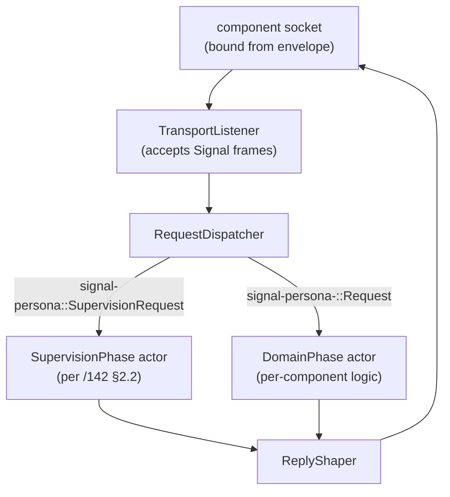
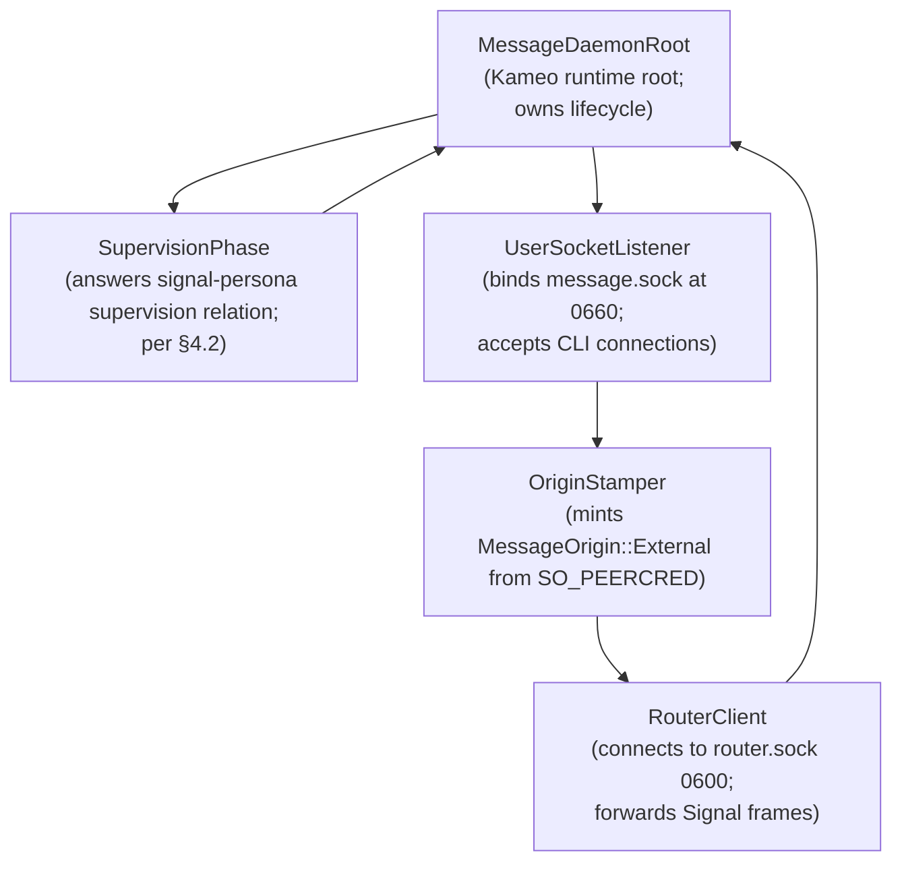
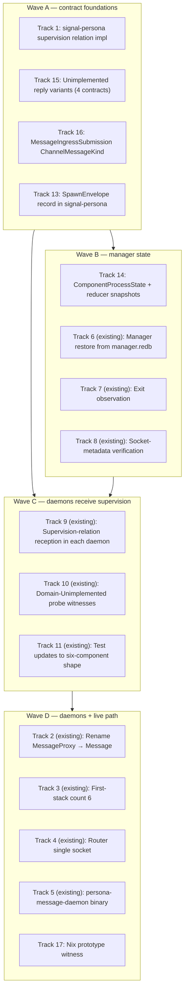

# 143 — Prototype-readiness gap audit

*Designer report. A full-stack gap audit across every
architecture document and contract crate touched by the
target "fully working prototype." Names what's missing or
under-specified, where the fix lands, and the design
decisions this report lands directly so operator can
implement without inventing policy in code.*

*Method: four parallel survey agents reviewed (A)
persona-mind + persona-router, (B) persona-system +
persona-harness + persona-terminal + terminal-cell, (C) all
seven `signal-persona-*` contract crates, (D) the persona
meta-repo + persona-message + Nix prototype runner. Findings
cross-checked against /142, /127, /125, /126, /115, /114,
operator/113, designer-assistant/32–34.*

---

## 0 · TL;DR

The target prototype shape (§1 unpacks this):

> `persona-daemon` starts one engine; all six first-stack
> daemons come up under it; `persona status` returns real
> component readiness; one `message` CLI call traverses the
> engine through `persona-message` → `persona-router`
> → `persona-harness` → `persona-terminal` → child terminal
> cell; durable manager events land in `manager.redb`. No
> Criome/BLS, no restart policy, no multi-engine, no
> production system-user deployment.

**Three blocking design surfaces** (must land at the
designer level before operator can implement honestly):

1. **The `SpawnEnvelope` typed record** — where it lives,
   what fields it carries, who mints it, how children read
   it. Today every ARCH names env-vars and paths informally;
   no typed record exists. (§4.1)
2. **The supervision-relation reception pattern** — one
   canonical shape every supervised daemon implements.
   Today no ARCH says "every daemon implements this trait /
   has this actor / answers these four request kinds." (§4.2)
3. **The typed `Unimplemented` reply convention** — every
   `signal-persona-*` contract needs an `Unimplemented`
   reply variant so prototype skeletons can be *honest*
   per operator/113 §6. Missing on `signal-persona`,
   `signal-persona-mind`, `signal-persona-harness`,
   `signal-persona-terminal`. (§4.3)

**Plus six structural gaps** (named below; each has a
concrete fix location):

| Gap | Where it lives today | Fix in /143 §… |
|---|---|---|
| `ComponentProcessState` closed enum (engine-lifecycle reducer state machine) | Named in /142 §4.1 but not yet a Rust type or table | §4.4 |
| `engine-lifecycle-snapshot` + `engine-status-snapshot` redb tables | Named in /142 §4.3 but absent from `manager.redb` schema | §4.5 |
| The typed `MessageIngressSubmission` `ChannelMessageKind` variant | Hard-coded as generic `DirectMessage` in router structural-channel install | §4.6 |
| The message-landing endpoint (where router→harness→terminal delivery ends) | Implicit in code; not specified in any ARCH | §4.7 |
| `persona-message` actor topology (the daemon's internal Kameo tree) | Outlined in /142 §3.3; not yet in `persona-message/ARCHITECTURE.md` body | §4.8 |
| Nix prototype witness `persona-daemon-spawns-first-stack-skeletons` shape | Named as a test target in operator/113 §6; no concrete acceptance spec | §4.9 |

**Plus implementation drift across operator-lane source** —
`EngineComponent::MessageProxy` still in `persona/src/engine.rs`,
stale `"message-proxy"` string at `persona-router/src/channel.rs:311`,
etc. These are tracked in the existing operator bead
`primary-devn` (the §6 list is updated here).

**Skills**: this audit found no prototype-blocking gap in
the workspace skills (kameo, actor-systems,
contract-repo, architectural-truth-tests, push-not-pull,
testing all cover the prototype shape). One small
refinement worth landing: `skills/contract-repo.md`
§"Examples-first round-trip discipline" can add the
**Unimplemented-reply pattern** as part of the discipline
(§7).

---

## 1 · What "fully working prototype" means

This report uses the target the operator articulated in
their 10-step walkthrough (2026-05-13), trimmed to the
parts that actually need to demonstrate "engine alive":

- **One engine**, started by `persona-daemon` with a launch
  plan.
- **All six first-stack daemons come up** under
  persona-daemon: `persona-mind`, `persona-router`,
  `persona-system`, `persona-harness`, `persona-terminal`,
  `persona-message`. Each binds its own Unix socket per
  the spawn envelope and applies the requested mode.
- **Each daemon answers the supervision relation** from
  `signal-persona::supervision::*` (per /142 §2.2):
  `ComponentHello`, `ComponentReadinessQuery`,
  `ComponentHealthQuery`, `GracefulStopRequest`.
- **Manager state is real**: the engine-lifecycle reducer
  transitions per /142 §4.1 (Unspawned → Launched →
  SocketBound → Ready); the engine-status reducer
  transitions per /142 §4.2 (NotApplicable → Starting →
  Running). `persona status` reads the engine-status
  snapshot.
- **Manager survives restart**: `persona-daemon` restarts;
  loads the latest `StoredEngineRecord` from
  `manager.redb`; engine catalog state and current health
  match what was there pre-restart.
- **Exit observation works**: a child process killed
  externally surfaces as `ComponentExited { expected:
  false, exit_code }` in the event log; engine-status
  transitions the component to `Failed`.
- **One live message path**: `message '(Send designer
  "hello")'` lands as bytes in the destination harness's
  terminal cell. Specifically:

```mermaid
flowchart LR
    cli["message CLI"]
    mday["persona-message<br/>(daemon; binds message.sock 0660)"]
    router["persona-router<br/>(binds router.sock 0600)"]
    harness["persona-harness"]
    terminal["persona-terminal"]
    cell["terminal-cell child PTY"]

    cli -->|"NOTA → signal-persona-message frame"| mday
    mday -->|"MessageOrigin::External from SO_PEERCRED + forward"| router
    router -->|"channel-state lookup → MessageDelivery"| harness
    harness -->|"HarnessTerminalDelivery → TerminalInput"| terminal
    terminal -->|"gate-and-cache → WriteInjection"| cell
```



The success criterion is that the message bytes land in the
terminal cell's PTY (visible in transcript). Per /127 §1.4
the prototype defers clean-then-inject; a dirty prompt
causes `DeliveryDeferred`. A clean prompt causes
delivery, transcript append, `DeliveryCompleted` back to
router via harness.

**Not in scope** (per /126 §9 and /142):
- Restart backoff policy
- Production `persona` system-user deployment
- systemd transient-unit backend
- Criome/BLS integration
- Multi-engine routing
- Cross-host authentication

---

## 2 · Per-component architecture-document gaps

### 2.1 `persona/ARCHITECTURE.md` (engine manager apex)

**Substantive gaps**:

- **`SpawnEnvelope` shape unspecified.** §1.7 names env-vars
  informally (`PERSONA_ENGINE_ID`, `PERSONA_SOCKET_PATH`,
  etc.); no typed record. Per /142 §5 and operator/113 §3.4,
  this should be a closed Rust type that the manager
  constructs and the child reads at startup. (Fix: §4.1.)
- **Engine-lifecycle reducer schema absent.** /142 §4.1
  names the state machine but the ARCH doesn't say where
  `ComponentProcessState` lives, what its rkyv encoding
  is, or which redb table holds the snapshot. (Fix: §4.4–4.5.)
- **Engine-status reducer schema absent.** Same shape:
  /142 §4.2 transitions named, but ARCH and `manager.redb`
  schema lack the snapshot table. (Fix: §4.5.)
- **Manager-restore rule absent.** /142 §5.4 says "load
  latest StoredEngineRecord on daemon startup"; ARCH §1.7
  doesn't name it. (Fix: §5.1 doc edit.)
- **Socket-metadata verification rule absent.** /142 §3.2
  and DA/32 §3 settled "child binds + applies mode;
  manager verifies before emitting `ComponentReady`"; ARCH
  hasn't absorbed the rule. (Fix: §5.1 doc edit.)

**Not gaps** (these are documented):
- Six-component first stack (per /142 §3.1)
- `message.sock` at 0660, internal sockets at 0600
- `persona` runs as the dedicated `persona` user
- EngineId-scoped paths

### 2.2 `persona-mind/ARCHITECTURE.md`

**Substantive gaps**:

- **No supervision-relation reception.** ARCH §3 names a
  `MindRoot` runtime topology but doesn't say where
  supervision requests enter. Same gap exists in code: no
  `signal-persona` dependency. (Fix: §4.2 — designer
  defines the pattern; operator wires it.)
- **No section on choreography-op routing.** /125 §3.4
  named `ChannelGrant` / `ChannelRetract` /
  `AdjudicationDeny` as mind ops; ARCH §1.1 implementation
  status says "mind graph supplies typed work items..." but
  doesn't address whether choreography ops are routed yet
  (they're not, per Agent A).
- **`MindTables` schema v3 lacks choreography tables.**
  ARCH §4 names `claims`, `activities`, `memory_graph` but
  no `choreography_grants` or `adjudication_log`. Even if
  the choreography policy engine ships later, the prototype
  should be honest about what mind durably stores.

**Not gaps**:
- Actor topology is well-named (MindRoot → store
  supervisor → ledgers)
- Sema schema layout
- One-NOTA-record CLI shape

### 2.3 `persona-router/ARCHITECTURE.md`

**Substantive gaps**:

- **The message-ingress channel is not typed.** Router's
  structural-channels install names a channel from
  `Internal(Message)` to `Internal(Router)` (currently
  buggy as `"message-proxy"` per Agent A), but
  `signal-persona-mind::ChannelMessageKind` has no
  distinct variant for message ingress. Today the channel
  uses generic `DirectMessage`, which collapses
  message-ingress with all other internal routing into one
  kind. (Fix: §4.6.)
- **Spawn-envelope reception not described.** ARCH §1 lists
  the daemon-client CLI surface but doesn't say how the
  daemon binary itself reads its socket path / mode from a
  spawn envelope. (Fix: §4.1.)
- **Schema-version guard not named.** ARCH §2 references
  `meta` as a table name but doesn't say what the
  version-skew guard looks like at boot.

**Not gaps**:
- Channel-authority actor structure
- Sema tables (`channels`, `adjudication_pending`,
  `delivery_attempts`, `delivery_results`)
- Single socket at `router.sock` per /142 §3.4

### 2.4 `persona-system/ARCHITECTURE.md`

**Status**: deferred per /127 §3. The daemon still needs to
exist as a skeleton (otherwise the six-component prototype
witness can't pass). Specifically:

- **Skeleton-mode behavior unspecified.** ARCH should add
  a "skeleton mode" §: daemon binds socket, answers
  supervision relation (`ComponentReady`,
  `ComponentHealth { health: Running }`), returns
  `SystemRequestUnimplemented` for every domain request.
  No focus-tracker work required for the prototype.

**Not gaps**: the deferred-design surface (FocusTracker, Niri
backend, privileged actions) is fine to leave as-is; the
prototype only needs the skeleton-mode daemon.

### 2.5 `persona-harness/ARCHITECTURE.md`

**Substantive gaps**:

- **Lifecycle FSM not documented in ARCH.** Code carries
  `HarnessLifecycle::{Starting, Running, Paused, Stopped}`
  but ARCH names neither the states nor the transitions.
  The supervision relation's `ComponentReady` mapping
  depends on knowing which states are "ready." (Fix: §5.5
  doc edit + §4.2.)
- **`MessageDelivery` field set unspecified.** ARCH names
  `MessageDelivery` as the inbound contract from router but
  doesn't list the fields. Per Agent C, the contract carries
  `harness_id`, `sender`, `body`, `message_slot`; the ARCH
  should at minimum name these and reference the contract
  crate. Per Agent B, the ARCH should also clarify that the
  delivery target is named by role/persona, not by raw
  harness binary, and how the resolution from "role" →
  "harness ID" happens. (Fix: §5.5 doc edit + §4.6.)
- **Terminal binding flow unspecified.** Code carries
  `HarnessTerminalDelivery::deliver_text` sending
  `TerminalInput` to a hardcoded path; ARCH doesn't say
  how the daemon learns the terminal socket path (spawn
  envelope per /142? hardcoded? service discovery?).

**Not gaps**:
- `HarnessKind` closed at `Codex | Claude | Pi | Fixture`
  per /127 §4.5
- Transcript-pointer fanout default
- Identity-view projection

### 2.6 `persona-terminal/ARCHITECTURE.md`

**Substantive gaps**:

- **Prompt-pattern registration lifecycle unspecified.**
  Code shows `RegisterPromptPattern` on the cell; ARCH
  doesn't say *who registers* (harness at session-create
  time per /127 §1.2 — but that note hasn't crossed into
  this ARCH). (Fix: §5.6 doc edit.)
- **Gate-acquire forwarding path partially typed.** Per
  Agent B, `TerminalSignalControl::event()` returns a
  hardcoded `PromptState::Clean` instead of querying
  terminal-cell. The ARCH doesn't say the supervisor
  *forwards* `AcquireInputGate` to the cell and awaits the
  cell's reply — which it must, per /127 §1.2.
- **Message-landing endpoint unspecified.** This is the
  prototype's terminus. The ARCH should name: "router →
  harness → terminal → terminal-cell PTY via
  `TerminalInput` bytes through the gate-and-cache
  transaction." Currently implicit in code. (Fix: §4.7 +
  §5.6 doc edit.)

**Not gaps**:
- Gate-and-cache mechanism (per /127 §1)
- Worker-lifecycle subscription
- Terminal-cell integration via `signal-persona-terminal`

### 2.7 `terminal-cell/ARCHITECTURE.md`

**Substantive gaps** (small — terminal-cell is mostly
done):

- **Signal-integration boundary still labeled
  "transitional".** Per /127 §2, terminal-cell speaks
  `signal-persona-terminal` directly on the control plane;
  the data plane stays raw. ARCH §0 still uses
  "transitional" framing in places. (Fix: §5.7 doc edit —
  drop the transitional qualifier on the production path.)
- **Socket-mode decision unrecorded.** Per Agent B, the
  cell binds its control socket somewhere but the mode
  isn't named (0600 if internal-only; 0660 if viewers
  attach directly). (Fix: §5.7 doc edit.)

**Not gaps**:
- Two-plane split (control = Signal; data = raw)
- Input gate + cache mechanism
- Worker-lifecycle subscription

### 2.8 `persona-message/ARCHITECTURE.md`

The /142 revision already partially updated this. Remaining
gaps:

- **Daemon actor topology not described.** ARCH says "this
  repo owns the message CLI and the `persona-message` daemon (binary: `persona-message-daemon`)"
  but doesn't sketch the actor topology. /142 §3.3
  proposed root + `UserSocketListener` + `RouterClient`.
  Promote that sketch into the ARCH body. (Fix: §4.8 +
  §5.8 doc edit.)
- **Code Map missing the daemon binary.** Still lists
  `src/main.rs` (CLI) only.

---

## 3 · Per-contract gaps

Agent C audited all seven `signal-persona-*` contracts.
Concise summary; full detail in Agent C's output (also
folded into §4.3 below):

| Contract | Prototype-blocking gap |
|---|---|
| `signal-persona` | Missing `SupervisionUnimplemented` reply variant on the supervision relation. |
| `signal-persona-auth` | `ConnectionClass` variant set may need re-audit against `signal-persona-mind::ChannelEndpoint::External(ConnectionClass)` usage (minor; check if all prototype origins are covered). |
| `signal-persona-message` | Missing `MessageKind` closed enum for body semantics (per /127 §4.1 D2). Missing origin-bridging record between `MessageSubmission` + `IngressContext`. |
| `signal-persona-mind` | Missing `MindReply::Unimplemented` variant. `ChannelMessageKind` needs a `MessageIngressSubmission` variant (§4.6). |
| `signal-persona-system` | None blocking. (Deferred per /127 §3; `SystemRequestUnimplemented` exists.) |
| `signal-persona-harness` | Missing `HarnessEventUnimplemented` for outbound replies on unbuilt operations? (Spec has `HarnessRequestUnimplemented` per Agent C, which covers this — verify.) Delivery context fields could be richer (target role, channel id, priority). |
| `signal-persona-terminal` | Missing `TerminalRequestUnimplemented` event variant. `WriteInjection` lacks an `injection_sequence: u64` for ordering. `TerminalName` namespace scope unclear. |

---

## 4 · Design specifications this report lands

Each subsection is a load-bearing design decision that
needs to live somewhere in the architecture. The report
lands the decisions; §5 then names the doc edits that
absorb them.

### 4.1 The `SpawnEnvelope` record

**Where it lives**: in `signal-persona` (the engine
manager's contract). Not in a new repo; per /142 §2.1
multi-relation contract crates are fine. The spawn
envelope is part of the manager↔component supervision
surface — the manager pushes the envelope at spawn time;
the child reads it at startup.

**Shape** (closed record, rkyv + NOTA derives):

```text
SpawnEnvelope
  | engine_id:           EngineId                     (typed newtype)
  | component_kind:      ComponentKind                (closed enum from signal-persona)
  | component_name:      ComponentName                (from signal-persona-auth)
  | state_dir:           WirePath                     (absolute path, child's redb directory)
  | socket_path:         WirePath                     (the socket this child binds)
  | socket_mode:         SocketMode                   (0600 internal | 0660 for message component)
  | peer_sockets:        Vec<PeerSocket>              (socket_path + ComponentName per peer)
  | manager_socket:      WirePath                     (the persona daemon's supervision socket)
  | supervision_protocol_version: SupervisionProtocolVersion (newtype u16)
```

**How children read it**: per the workspace's
push-not-pull discipline, the manager *pushes* the envelope
to the child rather than the child polling. Two
mechanisms are acceptable (operator picks):

- **Env var carrying the path to a serialized envelope
  file**: `PERSONA_SPAWN_ENVELOPE=/var/run/persona/<engine-id>/<component>.envelope`.
  Manager writes the file at spawn; child reads it once at
  startup; manager deletes it after `ComponentReady`.
- **Env vars per field** (legacy shape per /115 §8.1):
  `PERSONA_ENGINE_ID`, `PERSONA_COMPONENT_SOCKET`,
  `PERSONA_DATA_DIR`, etc.

Recommend the **single envelope-file** form for typed
honesty (one rkyv record on disk; one read; one delete).
Each daemon's startup code parses the envelope through
`signal-persona`'s typed decoder — no per-field env-var
boilerplate per child.

**Manager mints all fields**; child reads, validates,
binds. Per ESSENCE §"Infrastructure mints identity, time,
and sender" — the child does not invent its socket path or
its component name.

### 4.2 The supervision-relation reception pattern

Every supervised first-stack daemon implements the same
shape:



**Canonical Rust shape per daemon** (skeleton for
operator):

```rust
// (illustrative; lives in each component's src/actors/)
pub struct SupervisionPhase {
    component_name: ComponentName,
    component_kind: ComponentKind,
    supervision_protocol_version: SupervisionProtocolVersion,
    started_at: TimestampNanos,         // child-supplied diagnostic
    domain_health: ComponentHealth,     // pushed from domain actor
}

impl Message<ComponentHello> for SupervisionPhase { … }
impl Message<ComponentReadinessQuery> for SupervisionPhase { … }
impl Message<ComponentHealthQuery> for SupervisionPhase { … }
impl Message<GracefulStopRequest> for SupervisionPhase { … }
```

The supervision phase actor is **the same shape across all
six daemons**. Each daemon's domain logic feeds its
current `ComponentHealth` into the supervision phase via a
push (a tiny push-not-pull link); the supervision phase
answers the manager's probes from its cached health.

**Why one canonical pattern**: prototypes get easier when
six daemons share a shape. The supervision phase ends up
as ~80 lines of Rust each, mostly identical. Operator's
bead should land a small `signal-persona` helper crate
(or a module inside `signal-persona`) that exposes the
boilerplate so each daemon writes ~10 lines instead of 80.

### 4.3 Typed `Unimplemented` reply convention

Every `signal-persona-*` contract gets an `Unimplemented`
reply variant. The shape:

```text
<Channel>Reply::<Channel>Unimplemented(<Channel>UnimplementedReason)

<Channel>UnimplementedReason (closed enum)
  | NotInPrototypeScope               -- variant exists in contract but daemon hasn't built it yet
  | DependencyMissing(DependencyKind)  -- needs a peer component to be Ready first
  | ResourceUnavailable(ResourceKind)  -- runtime preconditions unmet
```

**Per contract, the additions**:

| Contract | Add |
|---|---|
| `signal-persona` (supervision) | `SupervisionReply::SupervisionUnimplemented(...)` |
| `signal-persona-mind` | `MindReply::MindRequestUnimplemented(...)` (Agent A's `ChoreographyUnimplemented` is one specific reason inside this) |
| `signal-persona-message` | `MessageReply::MessageRequestUnimplemented(...)` |
| `signal-persona-harness` | (already has `HarnessRequestUnimplemented` per Agent C — verify) |
| `signal-persona-terminal` | `TerminalEvent::TerminalRequestUnimplemented(...)` |
| `signal-persona-system` | (already has `SystemRequestUnimplemented` per Agent C — confirmed) |

**Discipline**: a daemon **decodes every request variant
in its contract**. For variants whose behavior is built,
it replies with the success/failure reply. For variants
whose behavior is not yet built, it replies with
`Unimplemented(NotInPrototypeScope)` — a typed answer, not
a panic, not a "future" left dangling. This is the
"skeleton honesty" rule from operator/113 §6 made
concrete.

The Nix prototype witness per /113 §6 includes the
domain-Unimplemented probe: send one valid unbuilt
operation to each daemon, assert the reply is typed
`Unimplemented` (not a parse error, not a process exit).

### 4.4 The `ComponentProcessState` closed enum

Per /142 §4.1, the engine-lifecycle reducer's state:

```text
ComponentProcessState (closed enum)
  | Unspawned
  | Launched { pid: ProcessId, started_at: TimestampNanos }
  | SocketBound { pid: ProcessId, socket_path: WirePath, mode: SocketMode, bound_at: TimestampNanos }
  | Ready { pid: ProcessId, since: TimestampNanos, last_health_probe: Option<TimestampNanos> }
  | Stopping { pid: ProcessId, expected: bool, stop_requested_at: TimestampNanos }
  | Exited { exit_code: ExitCode, expected: bool, exited_at: TimestampNanos }
```

**Where it lives**: in the `persona` crate (operator's
lane to add the Rust type). The signal-persona contract
does **not** need this — it's an internal manager state
type, never on the wire to children. The reducer reads
events from the manager event log and computes this state
per `(EngineId, ComponentName)`.

### 4.5 The two reducer snapshot tables

Per /142 §4.3, the manager.redb gets two new tables:

```text
manager.engine-lifecycle-snapshot
  key:   (EngineId, ComponentName)
  value: ComponentProcessState (rkyv-encoded)

manager.engine-status-snapshot
  key:   (EngineId, ComponentName)
  value: ComponentHealthState (rkyv-encoded; values: Starting | Running | Degraded | Stopped | Failed)
```

Both are projections of `manager.engine-events`. On
startup, the daemon initializes both from their stored
state (event replay can come later). On every event
append, both reducers update their respective snapshots.
CLI status queries read engine-status-snapshot only.

### 4.6 The `MessageIngressSubmission` `ChannelMessageKind`

`signal-persona-mind::ChannelMessageKind` currently has
`MessageSubmission`, `InboxQuery`, `MessageDelivery`,
`TerminalInput`, `TerminalCapture`, `TerminalResize`. The
prototype needs a distinct kind for the
**Message → Router** structural channel (where the
ingress daemon submits user messages to router) so router
and mind can distinguish it from internal
component-to-router traffic.

**Add**: `ChannelMessageKind::MessageIngressSubmission`.

Used at:
- The router's structural-channels install: the channel
  from `Internal(Message)` → `Internal(Router)` carries
  this kind.
- Mind's channel-state policy: the
  `MessageIngressSubmission` kind has its own
  channel-grant duration default (Permanent at engine
  setup; future per-message policy may refine).

### 4.7 The message-landing endpoint

The prototype's first message terminates at:
**`terminal-cell`'s child PTY**, as raw bytes written via
`signal-persona-terminal::WriteInjection`, guarded by the
gate-and-cache transaction per /127 §1.2.

The path:

```text
1. message CLI parses NOTA, sends MessageSubmission to message.sock.
2. persona-message stamps MessageOrigin::External(Owner) from SO_PEERCRED.
3. Daemon forwards to router.sock; channel-state lookup against MessageIngressSubmission channel.
4. Router resolves recipient role → harness instance via persona-harness's registry.
5. Router emits signal-persona-harness::MessageDelivery to harness.sock.
6. Harness picks the terminal session for the harness, calls AcquireInputGate on terminal-supervisor.
7. Terminal-supervisor forwards to terminal-cell; cell checks prompt-pattern; replies Clean.
8. Harness calls WriteInjection (lease, bytes); cell writes to child PTY.
9. Cell releases gate; cached human bytes (if any) replay.
10. Harness replies DeliveryCompleted up the chain; router commits delivery state.
```

**Success criterion for the prototype**: the bytes appear
in the child PTY's transcript; `TerminalInputAccepted` and
`DeliveryCompleted` events flow back; router's
`delivery_results` table has a Success row.

The prototype's MVP version can use a `HarnessKind::Fixture`
that's just a `cat` PTY child — bytes echo back. That's
enough to prove the path works without needing a real
agent harness.

### 4.8 `persona-message` actor topology



Five actors, all data-bearing per `skills/kameo.md`'s
`Self IS the actor` rule. Stateless across CLI requests
(no redb). The daemon is small enough that its full source
should fit in ~400 lines including tests.

### 4.9 The Nix prototype witness

A named flake check / app:

```text
checks.persona-daemon-spawns-first-stack-skeletons
```

**What it does** (Nix-chained per
`skills/architectural-truth-tests.md` §"Nix-chained tests"):

1. Writer derivation: starts `persona-daemon` with a
   launch plan that names the six first-stack components;
   waits for daemon-ready signal; emits the running
   manager.redb as its output.
2. Reader derivation (separate): opens the writer's
   `manager.redb`; asserts:
   - six `ComponentSpawned` events present, one per
     component
   - six `ComponentReady` events present (after socket
     verification + supervision probe succeeded)
   - engine-status-snapshot rows: all six components in
     `Running`
   - engine-lifecycle-snapshot rows: all six components in
     `Ready`
3. Domain-Unimplemented probe: sends one valid unbuilt
   operation per component (e.g.,
   `signal-persona-mind::ChannelGrant` to mind), asserts
   each replies with typed `Unimplemented`.
4. Live-message probe: invokes `message '(Send fixture
   "hello")'`; asserts:
   - `MessageSubmission` event in router's
     `delivery_attempts` table
   - `MessageDelivery` reaches harness (harness event log)
   - `TerminalInputAccepted` reaches terminal (terminal
     event log)
   - bytes `"hello"` appear in fixture terminal-cell's
     transcript

**Artifact**: write a typed NOTA observation file —
`persona-daemon-witness-report.nota` — with one record per
assertion (per skills/testing.md's NOTA-artifact pattern).

---

## 5 · Architecture-document edits required

This report lands §4's design decisions; the ARCH docs
absorb them per the edits below. Lower-numbered edits land
with this commit; higher-numbered edits are operator's
lane (they require source-code changes that the doc
describes).

### 5.1 `persona/ARCHITECTURE.md`

- **§1.6** add a "SpawnEnvelope record" subsection naming
  the typed shape from §4.1. Cite `signal-persona` as the
  envelope's home; cite this report.
- **§1.7** under "Startup Strategy," add the
  manager-restore rule: "On daemon startup, the manager
  loads the latest `StoredEngineRecord` per engine and
  initializes the engine-status reducer from the stored
  snapshot. Event replay is later strengthening; the
  prototype loads directly from
  `engine-status-snapshot`."
- **New §1.8** or extend §1.6: "Engine-lifecycle and
  engine-status reducers" — name both reducers per §4.4
  and §4.5; specify the redb tables. Cite /142 §4.
- **New §1.9** or extend §1.6: "Socket-metadata
  verification" — name the rule per /142 §3.2 and DA/32 §3.
- **§9 (Architectural-truth Tests)**: add the
  `persona-daemon-spawns-first-stack-skeletons` witness
  per §4.9.

### 5.2 `persona-mind/ARCHITECTURE.md`

- **Add a §11 "Supervision-relation reception"**: name the
  pattern from §4.2; specify which actor owns supervision
  in mind's tree.
- **§7 Boundaries**: add `signal-persona` to the "this
  repo owns" surface (the dependency); the supervision
  records flow through dispatch alongside `MindRequest`.
- **§4 State and Storage**: add a placeholder
  `choreography_grants` / `adjudication_log` table to the
  recommended-tables list (marked as "future when
  choreography policy lands"); the prototype reducer can
  be stub.
- **§3 Runtime Topology**: add a `SupervisionPhase` actor
  to the topology diagram.

### 5.3 `persona-router/ARCHITECTURE.md`

- **Add a §"Supervision-relation reception"**: same shape
  as mind.
- **§1 Component Surface**: add the
  `MessageIngressSubmission` channel kind per §4.6; rewrite
  the structural-channels description to use the new kind.
- **§5 State and Ownership**: add a "Schema version
  guard" subsection naming the version-skew check.
- **§3 Boundaries**: clarify that router reads its socket
  path / mode from the spawn envelope, not argv.

### 5.4 `persona-system/ARCHITECTURE.md`

- **Add a §"Skeleton mode (prototype)"** per §2.4:
  daemon binds socket, answers supervision relation,
  returns `SystemRequestUnimplemented` for every domain
  request. No FocusTracker work required in the prototype.

### 5.5 `persona-harness/ARCHITECTURE.md`

- **Add a §"Harness lifecycle FSM"**: name the states
  (`Starting | Running | Paused | Stopped`), transitions,
  entry/exit actions. Map to supervision-relation
  `ComponentReady`.
- **Add a §"Supervision-relation reception"**.
- **§3 Component Surface**: spell out `MessageDelivery`
  fields (or cite `signal-persona-harness`'s ARCH for the
  full shape); name the resolution from "role" → "harness
  ID."
- **§4 State and Ownership**: name how the harness daemon
  learns its peer terminal socket path (via spawn
  envelope per §4.1).

### 5.6 `persona-terminal/ARCHITECTURE.md`

- **Add a §"Supervision-relation reception"**.
- **§3** name where prompt patterns come from: harness
  registers them at session-create time per /127 §1.2.
- **§3** describe the gate-acquire forwarding: supervisor
  receives `AcquireInputGate`, forwards to the named cell,
  awaits cell's prompt-state reply, returns to caller.
- **Add a §"Message-landing endpoint"**: name the bytes →
  `TerminalInput` → cell PTY transaction per §4.7.

### 5.7 `terminal-cell/ARCHITECTURE.md`

- **§0 / §3** drop the "transitional" qualifier on the
  Signal-on-control-plane path per /127 §2 (this is the
  production path now).
- **Add a §"Control socket mode"**: name the mode (likely
  0600; system-specialist may revise when production
  deployment lands).

### 5.8 `persona-message/ARCHITECTURE.md`

- **§2 State and Ownership**: expand from the /142 update
  to include the actor topology from §4.8.
- **Code Map**: add `src/bin/persona-message-daemon.rs`.
- **§4 Invariants**: add explicit "binds message.sock at
  mode 0660 with engine-owner group; mints
  `MessageOrigin::External` from SO_PEERCRED on each peer
  connection."

### 5.9 `signal-persona/ARCHITECTURE.md`

- **§"Typed Records"**: add `SpawnEnvelope` per §4.1 to
  the record list; describe the envelope's role.
- **§"Typed Records"** (or new subsection): add the
  `SupervisionReply::SupervisionUnimplemented` variant per
  §4.3.
- **§Constraints**: add a test seed for "each supervised
  daemon answers SupervisionRequest with typed
  Unimplemented for unbuilt operations."

### 5.10 `signal-persona-mind/ARCHITECTURE.md`

- **§3.4 Channel choreography**: add the
  `MessageIngressSubmission` `ChannelMessageKind` variant
  per §4.6. Describe its role.
- **§"Closed Vocabulary"**: add `MindReply::MindRequestUnimplemented`
  per §4.3.

### 5.11 `signal-persona-message/ARCHITECTURE.md`

- Add the `MessageKind` closed enum (Send / Inbox /
  Notification / …) per /127 §4.1 D2.
- Add the origin-bridging record (`StampedMessageSubmission`
  or similar) per Agent C §3.

### 5.12 `signal-persona-terminal/ARCHITECTURE.md`

- Add `TerminalEvent::TerminalRequestUnimplemented` per
  §4.3.
- Add `injection_sequence: u64` to `WriteInjection` per
  Agent C §7.
- Document `TerminalName` namespace scope.

### 5.13 `protocols/active-repositories.md`

No edit needed (already updated to reflect /142's
six-component shape).

---

## 6 · Operator implementation work (updates to `primary-devn`)

The existing operator bead `primary-devn` (filed
2026-05-13 per /142) needs three additional tracks added
to its description. Filing as a description update rather
than a new bead:

- **Track 13**: Add the `SpawnEnvelope` typed record to
  `signal-persona`; wire `DirectProcessLauncher` to mint
  the envelope and write it to the per-component spawn
  envelope file; wire each daemon's startup to read the
  envelope.
- **Track 14**: Add `ComponentProcessState` enum, the two
  snapshot tables (`engine-lifecycle-snapshot`,
  `engine-status-snapshot`) to `manager.redb`'s schema,
  and the two reducer materializations per /142 §4 and §4.4–4.5 here.
- **Track 15**: Add typed `Unimplemented` reply variants
  to all four affected contracts (per §4.3) and wire each
  daemon's dispatch to return `Unimplemented` for unbuilt
  variants.
- **Track 16**: Add the `MessageIngressSubmission` variant
  to `signal-persona-mind::ChannelMessageKind`; update
  router's structural-channels install to use the new kind
  (also resolves the stale `"message-proxy"` string at
  `persona-router/src/channel.rs:311`).
- **Track 17**: Land the Nix witness
  `persona-daemon-spawns-first-stack-skeletons` per §4.9.

---

## 7 · Skills layer

Audit conclusion: the workspace skills cover the
prototype's needs. Specifically:

- `skills/kameo.md` and `skills/actor-systems.md` are
  sufficient for the supervision-phase actor pattern.
- `skills/contract-repo.md` covers contract-crate
  discipline (one root family per relation; rkyv + NOTA
  derives).
- `skills/architectural-truth-tests.md` covers the
  witness-test pattern, including Nix-chained writer/reader
  derivations.
- `skills/push-not-pull.md` covers the subscription
  contract for `SubscribeIdentityUpdates`-shaped pushes
  (which the engine-status reducer might offer for
  external observers).
- `skills/testing.md` covers the Nix-app shape for
  stateful tests.
- `skills/jj.md` covers the version-control discipline.

**One small refinement** worth landing in a future skill
edit (NOT prototype-blocking): `skills/contract-repo.md`
§"Examples-first round-trip discipline" can grow a
subsection naming **the typed `Unimplemented` reply
convention** so future contract crates land it
consistently. Not blocking the prototype; flag in a future
designer pass.

---

## 8 · Suggested implementation order

Operator picks up `primary-devn`; the dependency wave
below sequences the tracks. (Tracks 1–10 are already in
the bead per /142 §8 and /142 revision; tracks 11–17 are
new per §6.)



After Wave D's witness fires green, the prototype is
real. Subsequent waves (restart policy, multi-engine
upgrade, Criome integration, system-user deployment) can
proceed in any order as separate operator beads.

---

## 9 · Constraints (test seeds)

Per `skills/architectural-truth-tests.md`, every
load-bearing constraint becomes a witness. New witnesses
from this report:

| Constraint | Witness name |
|---|---|
| `SpawnEnvelope` is a typed record in `signal-persona` | source-scan: `signal-persona` exports `SpawnEnvelope` |
| Every daemon reads its envelope and binds the named socket at the named mode | per-daemon Nix witness: fixture envelope → spawn → assert socket exists at path with mode |
| Every daemon answers `signal-persona::SupervisionRequest::ComponentHello` with its component name + kind | per-daemon Nix witness |
| Every daemon answers `ComponentReadinessQuery` with `Ready` after its domain plane is initialized | per-daemon Nix witness |
| Every daemon decodes every contract variant and returns typed `Unimplemented` for unbuilt ones | per-contract probe in the prototype runner |
| `MessageIngressSubmission` is a distinct `ChannelMessageKind` variant | source-scan in `signal-persona-mind` |
| The `Internal(Message) → Internal(Router)` structural channel uses `ChannelMessageKind::MessageIngressSubmission` | router-state Nix witness |
| `manager.redb` has `engine-lifecycle-snapshot` + `engine-status-snapshot` tables | redb-schema introspection witness |
| `ComponentReady` event triggers transitions in both reducers | reducer-trace witness |
| `persona-daemon` restart loads latest `StoredEngineRecord` and restores engine-status snapshot | Nix-chained: writer derivation runs daemon + appends events; reader derivation restarts daemon, asserts engine-status matches |
| Six first-stack components come up and answer supervision relation | the master `persona-daemon-spawns-first-stack-skeletons` witness from §4.9 |
| Live message path: `message '(Send fixture "hello")'` lands bytes in fixture cell's PTY | end-to-end Nix witness; the prototype's primary success criterion |

---

## 10 · Open questions

| # | Question | Owner | Resolution path |
|---|---|---|---|
| Q1 | `SpawnEnvelope` delivery: single envelope file vs per-field env vars? | Designer (lean: single file per §4.1) → Operator | Lock at Track 13 implementation. |
| Q2 | Manager-side socket-metadata verification: is `chmod` after-bind acceptable, or should the manager set up a pre-bound fd via systemd-socket-activation? | System-specialist | Out of scope for prototype; pick at production deployment. |
| Q3 | Live-message prototype: should the fixture be a `cat` PTY or an actual Codex/Claude harness? | User | Recommend `Fixture` harness (`HarnessKind::Fixture`) for the prototype witness; real harnesses come in a separate operator track when fixture's path is proven. |
| Q4 | `MessageKind` closed-enum variant set for v1 | Designer (lean: `Send`, `Inbox` only for prototype; add others as concrete uses surface) | Land at Track 15. |
| Q5 | `TerminalName` namespace scope (per Agent C terminal §1) | Designer | Recommend: `TerminalName` is the role-name (operator / designer / ...) when one harness per role; future cases where multiple harnesses share a role get a richer namespace. Land at Track 12 if needed. |
| Q6 | terminal-cell control socket mode (per Agent B terminal-cell §1) | System-specialist | Recommend 0600; production may revise. |
| Q7 | Choreography-policy engine timing — does the prototype need any choreography ops to actually do anything, or just answer `ChoreographyUnimplemented`? | Designer (lean: prototype uses `ChoreographyUnimplemented` only; real choreography lands separately) | Confirm with user. |

---

## See also

- `~/primary/reports/designer/142-supervision-in-signal-persona-no-message-proxy-daemon.md`
  — the supervision relation + six-component first stack
  + two-reducer split this report builds on.
- `~/primary/reports/designer/127-decisions-resolved-2026-05-11.md`
  — input gate, terminal-cell signal integration,
  HarnessKind closed, MessageBody freeform.
- `~/primary/reports/designer/125-channel-choreography-and-trust-model.md`
  — filesystem-ACL trust model; channel choreography.
- `~/primary/reports/designer/126-implementation-tracks-operator-handoff.md`
  — predecessor track list (T1–T9); /143 extends with
  tracks 13–17 in `primary-devn`'s description.
- `~/primary/reports/designer/115-persona-engine-manager-architecture.md`
  — engine manager substance; §1.7 spawn lifecycle prose
  is the closest existing source for the `SpawnEnvelope`
  shape this report types.
- `~/primary/reports/operator/113-persona-engine-supervision-slice-and-gaps.md`
  — the operator's own gap inventory; many gaps in /143
  cross-reference /113 §1–§6.
- `~/primary/reports/designer-assistant/32-review-operator-113-engine-supervision.md`,
  `33-engine-prototype-naming-and-supervision-corrections.md`,
  `34-review-designer-142-supervision-and-message-proxy.md`
  — DA's review thread; refinements folded into /142 §9.4
  and via this report's §4.
- `~/primary/skills/architectural-truth-tests.md` —
  witness pattern for §9.
- `~/primary/skills/kameo.md`, `~/primary/skills/actor-systems.md`
  — actor pattern for supervision-phase reception in §4.2.
- `~/primary/skills/contract-repo.md` — contract-crate
  discipline for §4.1 / §4.3 (one root family per
  relation; rkyv + NOTA derives).
- `~/primary/skills/testing.md` — Nix-app shape for the
  §4.9 witness.
- `/git/github.com/LiGoldragon/persona/ARCHITECTURE.md` —
  primary doc absorbing §5.1.
- `/git/github.com/LiGoldragon/signal-persona/src/lib.rs` —
  source where the `SpawnEnvelope` and `Unimplemented`
  variants land (operator's lane).
- bead `primary-devn` — updated description per §6.
