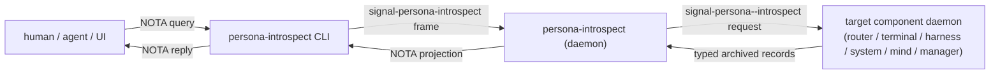

# 146 — Introspection component and contract layer

*Designer report absorbing
`~/primary/reports/designer-assistant/37-signal-nexus-and-introspection-survey.md`.
Confirms DA/37's three-layer placement (existing operational
contracts; component-specific introspection contracts;
central introspection envelope), adds `persona-introspect` as
a planned high-privilege read/projection component, and
lands the skill + ARCH edits per DA/37 §7 inline.*

---

## 0 · TL;DR

DA/37 is correct. The architecture rule it proposes is the
positive form of what was already implicit in
`skills/rust/storage-and-wire.md` and the existing contract
discipline — just sharpened to cover **durable inspectable
state**:

> Nexus/NOTA is the edge text projection for ingress, egress,
> and inspection. Signal/rkyv is the engine's internal wire.
> Sema/redb stores rkyv-archived typed records. Every durable
> Sema value that can be inspected outside its component has
> a contract-owned record shape: **operational contract** when
> it crosses a live boundary, **introspection contract** when
> it exists only so the component can explain its own state.
> Runtime ownership stays in the component; `persona-introspect`
> asks components for typed observations and renders NOTA
> views.

This report:

1. **Confirms DA/37's `persona-introspect` shape** — a
   high-privilege read/projection component talking to peer
   component daemons via Signal; no direct redb peeking; no
   second owner of any component's database.
2. **Confirms DA/37's three-layer contract placement** —
   existing operational contracts stay where they are;
   component-specific introspection contracts are added only
   when durable inspectable state is non-operational and
   large/separate; a central `signal-persona-introspect`
   crate owns the query/projection envelopes.
3. **Resolves DA/37's four open decisions** (§3 below).
4. **Lands the three doc edits per DA/37 §7** —
   `skills/rust/storage-and-wire.md` clarification,
   `skills/contract-repo.md` introspection carve-out,
   `persona/ARCHITECTURE.md` `persona-introspect` section.
5. **Updates `protocols/active-repositories.md`** to note
   the two planned repos (`persona-introspect`,
   `signal-persona-introspect`).
6. **Files an operator track** on `primary-devn` for the
   first introspection slice (terminal — DA/37 §7.4).

This is a forward-looking architecture surface. The current
prototype scope (`/143` + `/144`) is unchanged — the
introspection component is **not** part of the
six-component first stack and not on the critical path for
the two-witness prototype acceptance. The introspection
work begins after the prototype is real.

---

## 1 · The architecture rule

Adding the positive rule to the workspace skills (per
DA/37 §6):

> **Nexus/NOTA at the edge. Signal/rkyv on the wire.
> Sema/redb on disk.**
>
> - Internal component traffic is Signal frames carrying
>   rkyv-archived typed records.
> - Durable component state in redb is rkyv-archived typed
>   records (Signal-compatible; not literally a Signal frame
>   unless the table is recording frames).
> - NOTA is the human-/agent-/UI-facing edge projection —
>   ingress (CLI parses NOTA into typed records), egress
>   (typed reply projects to NOTA), inspection (typed
>   inspection record projects to NOTA for display).
>
> **Every durable Sema value that can be inspected from
> outside its component has a contract-owned record shape.**
> Two homes:
>
> - **Operational contract** (`signal-persona-<X>`) when the
>   record crosses a live operational boundary (a delivery
>   request, a channel grant, a focus observation, etc.).
> - **Introspection contract** when the record exists only
>   so the component can explain its own state to
>   inspection consumers (a router channel-table readout, a
>   terminal session snapshot, a manager event-log entry).
>
> Runtime ownership — actors, redb, reducers, supervision,
> redaction policy — stays in the component. The
> introspection contract names the *vocabulary* of
> inspectable state; the component decides what to expose
> and when.

This rule does **not** replace any existing rule from
`skills/contract-repo.md`. It refines: contracts may own
typed introspection record shapes without owning the
component's daemon code, redb access, or projection policy.

---

## 2 · `persona-introspect`

A planned (not yet implemented) high-privilege component:

**Owns**:

- The `persona-introspect` daemon and its socket.
- Cross-component inspection requests (fan-out / fan-in).
- NOTA/Nexus projection policy for inspectable records.
- Later: typed authorization for who may inspect what.

**Does not own**:

- Component databases. The component daemon answers; the
  introspect daemon asks.
- Snapshot consistency. The component decides how to read a
  consistent snapshot.
- Redaction at the field level. The component decides which
  fields it will project; redaction is a typed projection
  decision in the relevant introspection contract.

**Trust posture**: high-privilege. The daemon runs as the
`persona` system user like other supervised components, and
its socket is `0600` internal. Development mode can be
transparent; production-mode redaction lives in the typed
projection contracts, not in field-name heuristics.

`persona-introspect` is **not** in the first-stack prototype.
It's a follow-up component, added after the six-component
prototype is real. The first introspection slice
(per DA/37 §7.4) is terminal — `persona-terminal` has the
largest current gap between durable local Sema records and
contract-owned inspectable vocabulary.

---

## 3 · Open-decision resolutions

DA/37 §8 named four open decisions. Resolutions:

| # | Decision | Resolution |
|---|---|---|
| D1 | Introspection records inside `signal-persona-<X>` or sibling `signal-persona-<X>-introspect`? | **Start inside the existing component contract.** Split to a sibling crate when records are heavy / high-churn / not needed by normal operational clients. (DA/37 recommendation, adopted.) The first slice — terminal — starts inside `signal-persona-terminal` under an `introspection` module; split if it grows past the operational records. |
| D2 | Live-daemon-only or also offline redb readers? | **Live first.** Offline readers are useful for crash artifacts and tests, but the live architecture preserves component ownership by asking daemons through Signal. Offline can land as a separate tool later if needed. |
| D3 | Component name | **`persona-introspect`** for the repo + binary; `PersonaIntrospector` for the root Kameo actor inside; `signal-persona-introspect` for the central envelope contract crate. |
| D4 | Secret/redaction projection | **Defer to first production-minded pass.** For the first transparent development version, all inspectable fields project as-is. When production needs it, redaction lands as **typed projection records** in the relevant introspection contract — explicit closed enums for what's exposed and what's withheld, not field-name heuristics, not marker traits. |

---

## 4 · Doc edits landing inline

### 4.1 `skills/rust/storage-and-wire.md`

Add the Signal/Nexus/Sema split clarification in the existing
"What goes where" section. The clarification: *Sema values
are Signal-compatible rkyv-archived typed records on disk —
not text, and not necessarily IPC frames.* Inline edit below.

### 4.2 `skills/contract-repo.md`

Refine the "It does not own" list: component-internal state
stays out, **but** typed introspection record shapes for
durable inspectable state may live in a contract crate
without owning the redb access or projection policy.
Inline edit below.

### 4.3 `persona/ARCHITECTURE.md`

Add a section naming `persona-introspect` as a planned
high-privilege read/projection component. Inline edit below.

### 4.4 `protocols/active-repositories.md`

Add two **planned** entries (not active yet, but the names
are reserved for the upcoming work).

---

## 5 · Landing order

Per DA/37 §7, adapted with operator-side beads:

1. **Skill clarifications** (this report's inline edits;
   landed alongside `/146`).
2. **`persona-introspect` ARCH section** (this report's
   inline edit).
3. **Terminal introspection records** as the first slice —
   per DA/37 §7.4. Operator track: add `introspection`
   module to `signal-persona-terminal`; define typed
   inspection records over `StoredTerminalSession`,
   `StoredDeliveryAttempt`, `StoredTerminalEvent`,
   `StoredViewerAttachment`, `StoredSessionHealth`,
   `StoredSessionArchive`; add per-record round-trip
   tests. Filed as track 21 on `primary-devn`.
4. **Manager event-log records** into `signal-persona`
   (per DA/37 §4.1 — they're already manager catalog
   facts and the engine-manager contract is the right home).
5. **Router channel-table readouts** as the second
   introspection slice.
6. **`persona-introspect` daemon skeleton** when at least
   two component introspection slices are real (so the
   cross-component fan-in is a real test, not a stub).

`persona-introspect` is **not on `primary-devn`'s critical
path**. The prototype acceptance per `/144` §4 stays the
gate; introspection follows.

---

## 6 · What this report does not change

- The prototype scope per `/143` + `/144`: still the
  six-component first stack + the live fixture-message path.
- The supervision relation, the two reducers, the
  `SpawnEnvelope` typed record, the channel choreography
  decisions per `/142` + `/143` + `/144`.
- Existing `signal-persona-*` contracts: no operational
  record migrates from operational contract to introspection
  contract.
- `skills/contract-repo.md` §"Contracts name relations":
  multi-relation contract crates are still fine; one root
  family per relation; the introspection note adds, doesn't
  remove.

---

## 7 · Constraints (test seeds)

Per `skills/architectural-truth-tests.md`, the new rule
gets witnesses:

| Constraint | Witness |
|---|---|
| `persona-introspect` does not open another component's redb | `cargo metadata` rejects redb-on-non-introspect-tables paths; source scan for `Database::open` outside the owning component |
| Introspection requests cross via Signal frames, never via shared memory | actor-trace witness in the inspection path |
| NOTA projection happens at the `persona-introspect` edge, not at component daemons | source scan: component daemons return typed records on the introspection socket, not NOTA |
| Contract crates may own introspection record shapes but no daemon code | source scan: no `tokio`, `kameo`, or actor runtime in `signal-persona-<X>-introspect` |
| Secret-bearing fields project through typed redaction records, not field-name heuristics | manual review at first; explicit projection-record witness when redaction lands |

---

## 8 · Open questions

| # | Question | Owner | Recommendation |
|---|---|---|---|
| Q1 | When does `persona-introspect` become real (which prototype wave)? | User | After prototype-one acceptance (`/144` §4 witnesses fire green) and at least two component introspection slices are landed |
| Q2 | Should `persona-introspect` be allowed to talk to other engines' components (cross-engine inspection)? | Designer (eventual) | Out of scope for first cut; same single-engine constraint as the rest of the prototype |
| Q3 | Will operator-assistant's `signal-criome` work need an introspection slice? | Designer-assistant (operator-assistant) | Yes eventually — criome's identity registry and audit log are natural introspection candidates. Defer until the criome daemon itself is real per `/141` |

---

## See also

- `~/primary/reports/designer-assistant/37-signal-nexus-and-introspection-survey.md`
  — the survey this report absorbs; the canonical reading
  of the introspection design surface.
- `~/primary/reports/designer/143-prototype-readiness-gap-audit.md`
  — current prototype-readiness audit; introspection is
  out of scope for that.
- `~/primary/reports/designer/144-prototype-architecture-final-cleanup-after-da36.md`
  — final cleanup; this report doesn't touch its scope.
- `~/primary/skills/rust/storage-and-wire.md` — edited per §4.1.
- `~/primary/skills/contract-repo.md` — edited per §4.2.
- `~/primary/protocols/active-repositories.md` — edited per §4.4.
- `/git/github.com/LiGoldragon/persona/ARCHITECTURE.md`
  — edited per §4.3.
- bead `primary-devn` — track 21 added per §5.
